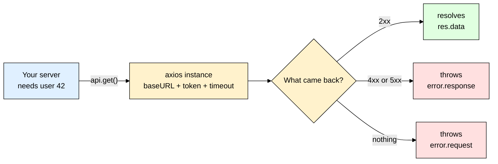
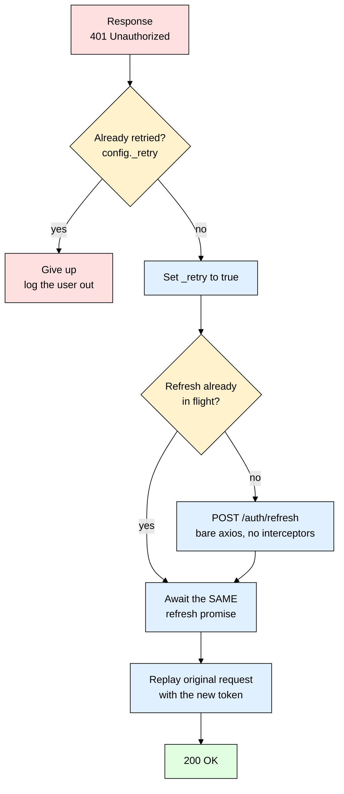
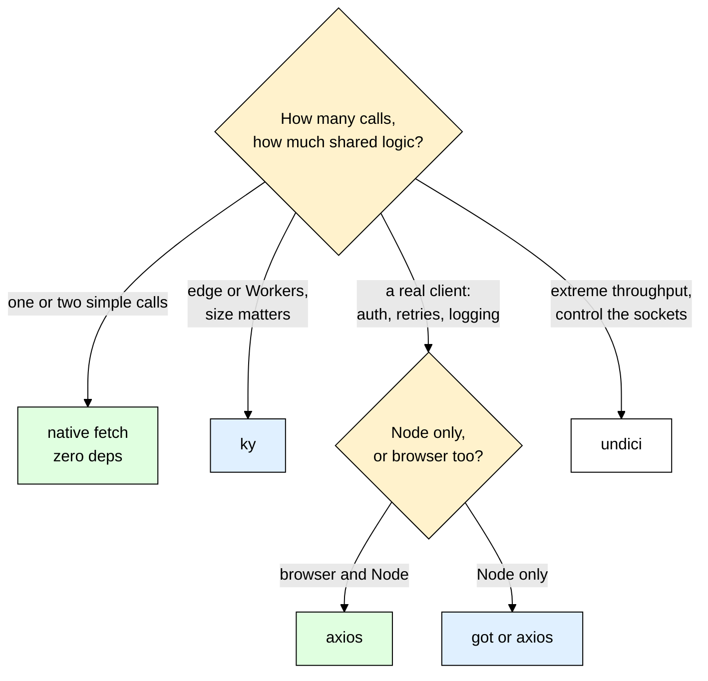

# axios — Talking to Other APIs Without Repeating Yourself

> **Scope:** The `axios` npm package in Node 20+ and the browser — instances, interceptors, the error object, timeouts, retries, cancellation, uploads and streams. Plus an honest comparison against native `fetch`, `got`, `ky` and `undici`.
> **Level:** Beginner + practical.
> **New to serving HTTP in Node?** Read [[express]] first — this file is the other half of the story: *calling* other people's APIs instead of answering calls yourself.

---

## 1. ELI5: What is axios?

You wrote one route that calls Stripe. Then one that calls SendGrid. Then one that calls your own auth service. Each repeats the same six lines: paste the base URL again, paste the `Authorization` header again, `JSON.stringify` the body, remember to check `res.ok`, parse the reply, and — you forgot this one — give up if the other server never answers. Three months later the token format changes and you are editing fourteen files.

**axios** is a hotel concierge you brief **once**. You give them the address, hand them your ID, and say "if anyone keeps you waiting more than five seconds, walk away and tell me." After that briefing every errand you send goes out pre-addressed and pre-authenticated, and comes back either with the goods in your hand or with a clear, uniform explanation of what went wrong. You never repeat the address, and you never repeat the instructions.

> **Type:** npm package — a promise-based HTTP client. Runs in Node (via the built-in `http`/`https` modules) and in the browser (via `XMLHttpRequest`) from the same code.
> **Core promise:** One configured client, one consistent response shape, one consistent error shape — and one place to hang cross-cutting logic like auth, logging and retries.



---

## 2. Why Does axios Exist? (The Problem It Solves)

Here is one "fetch a user from an upstream service" call written with raw `fetch`, done **properly**. Every line is one beginners forget, and every one is a real production incident:

```js
// ❌ The honest version of "just use fetch" — this is what correct actually looks like
async function getUser(id, token) {
  const controller = new AbortController();
  const timer = setTimeout(() => controller.abort(), 5000);   // fetch has no timeout option
  try {
    const url = `https://api.internal/v1/users/${encodeURIComponent(id)}`;
    const headers = { Authorization: `Bearer ${token}` };   // pasted into every call site
    const res = await fetch(url, { headers, signal: controller.signal });
    // THE trap: fetch resolves happily on 404 and 500. No throw. Nothing.
    if (!res.ok) throw new Error(`HTTP ${res.status}: ${await res.text()}`);
    return await res.json();          // a second await with its own failure mode
  } finally {
    clearTimeout(timer);              // forget this and you leak a timer per call
  }
}
```

Now multiply that by every endpoint in your app.

| Without axios | With axios |
|---|---|
| Base URL pasted into every call site | `baseURL` set once on an instance |
| `if (!res.ok) throw` written by hand — **and forgotten**, so a 500 flows on as `undefined` | Any non-2xx **rejects** the promise automatically |
| `await res.json()` as a second step that can throw its own error | `res.data` is already parsed |
| No timeout unless you hand-roll `AbortController` + `clearTimeout` | `timeout: 5000` in the config |
| Query strings assembled by hand with `URLSearchParams` | `{ params: { q, page } }`, encoded for you |
| Auth header, request id and logging duplicated per call | One request interceptor, one file |
| Failures are shaped differently depending on where they broke | One `AxiosError` with `response` / `request` / `code` / `config` |
| Token refresh on 401 means editing every caller | One response interceptor retries transparently |

**The `res.ok` trap deserves its own paragraph**, because it is the single most common beginner bug. `fetch` only rejects when the request **never completed** — DNS failure, connection refused, abort. A 404, a 401, an HTML "502 Bad Gateway" page from a load balancer: as far as `fetch` is concerned those are *successful* HTTP exchanges. So `await res.json()` parses the error body into something your code treats as valid, `user.email` is `undefined`, nothing throws, and the garbage surfaces three services later as something baffling. axios rejects on any non-2xx by default, so `try`/`catch` catches it where it happened.

Note what axios does **not** solve: it is not faster than `fetch`, it adds nothing to HTTP, and it will not save you from a bad upstream API. It buys you **one place to put the boring, repeated, easy-to-forget parts** — and for a single throwaway call it does not earn its keep, so use `fetch` there and skip the dependency.

---

## 3. Installing & Basic Usage

```bash
npm install axios
```

```js
import axios from "axios";

// GET — you get back a response object; the parsed body lives on .data
const res = await axios.get("https://api.github.com/users/torvalds");
console.log(res.status, res.data.name);   // 200 "Linus Torvalds" — no res.json() step
// POST — body is the 2nd argument, config is the 3rd
await axios.post("https://api.internal/v1/users", { email: "a@b.com" }, { timeout: 5000 });
// the object is serialized to JSON for you; never omit the timeout on a real call
```

### CommonJS version

```js
const axios = require("axios");   // the package ships both ESM and CJS builds
const { data } = await axios.get("https://api.github.com/users/torvalds");
```

### Express example

```js
import express from "express";
import axios from "axios";

const app = express();
app.get("/profile/:username", async (req, res, next) => {
  try {
    // Destructure straight to .data — you rarely need the rest of the response
    const url = `https://api.github.com/users/${req.params.username}`;
    const { data } = await axios.get(url, { timeout: 5000 });  // a hung upstream must not hang YOU
    res.json({ login: data.login, name: data.name, repos: data.public_repos });
  } catch (err) {
    // A 404 from GitHub is a rejected promise here, not a silent success
    if (err.response?.status === 404) return res.status(404).json({ error: "No such user" });
    next(err);                           // anything else goes to your error middleware
  }
});

app.listen(3000);
```

That's the entire mental model — `await` gives you a **response object** (`data`, `status`, `headers`, `config`), and anything that is not a 2xx becomes a **thrown error** you catch. Everything else in this file is about not repeating yourself, and about what to do when things go wrong.

---

## 4. Instances — One Configured Client Per External API

This is the habit that separates a toy from a codebase. **Never scatter `axios.get(fullUrl)` across your app.** Create one instance per upstream service, in its own module, and import that.

```js
// src/clients/billing.js
import axios from "axios";

export const billing = axios.create({
  baseURL: process.env.BILLING_URL,     // "https://billing.internal/v1" — see [[dotenv]]
  timeout: 5000,                        // applies to every request through this client
  // a real User-Agent: upstream teams will thank you when they debug their logs
  headers: { Accept: "application/json", "User-Agent": "orders-service/1.4" }
});

// src/services/orders.js — the call site is business logic now, not HTTP plumbing
import { billing } from "../clients/billing.js";

export async function chargeOrder(orderId, amountCents) {
  const { data } = await billing.post("/charges", { orderId, amountCents });
  return data;
}
```

Why one instance **per API**, not one shared global:

- **Different upstreams need different settings.** Your payment provider gets a 10s timeout and zero retries; your internal search service gets 800ms and three retries. A single global cannot express that.
- **Interceptors are per-instance.** A refresh-on-401 handler for your auth service must not fire when Stripe returns a 401 — completely different meaning.
- **Credentials stay scoped, and tests get a seam.** The Stripe key lives on the Stripe client and cannot leak onto a request to some other host, and you mock one imported module instead of stubbing global `axios`.

`baseURL` joins with a relative path the way you would expect (`/charges` and `charges` both work), with one sharp edge: an **absolute** URL in the request ignores `baseURL` completely, and per-call config always overrides the instance (`billing.get("/reports", { timeout: 60_000 })`).

> ⚠️ Because an absolute URL bypasses `baseURL`, **never** build a request path out of unvalidated user input. `api.get(req.query.next)` is a server-side request forgery hole: the attacker points your server at `http://169.254.169.254/` and reads your cloud metadata credentials. Validate against an allow-list first — see [[zod]].

---

## 5. Interceptors — The Killer Feature

An interceptor is a function that runs on **every** request or response passing through an instance. This is the whole reason to pick axios over `fetch`.

```js
// src/clients/api.js
import axios from "axios";
import { randomUUID } from "node:crypto";        // or nanoid — see [[uuid_nanoid]]
import { logger } from "../logger.js";           // see [[winston_morgan]]
import { getAccessToken } from "../auth/tokenStore.js";

export const api = axios.create({ baseURL: process.env.API_URL, timeout: 5000 });

api.interceptors.request.use((config) => {
  const token = getAccessToken();                // read it fresh — tokens rotate constantly
  if (token) config.headers.Authorization = `Bearer ${token}`;  // JWTs — see [[jsonwebtoken]]
  config.headers["X-Request-Id"] = randomUUID(); // grep one user's journey across services
  config.metadata = { startedAt: Date.now() };   // stash anything; it survives to the response
  return config;                                 // you MUST return the config
});

api.interceptors.response.use(
  (response) => {
    const ms = Date.now() - response.config.metadata.startedAt;
    logger.info({ url: response.config.url, status: response.status, ms }, "upstream ok");
    return response;                             // must return the response
  },
  (error) => {
    // Collapse three different failure worlds into one predictable log line
    logger.warn({ url: error.config?.url, code: error.code,
      status: error.response?.status ?? null }, error.message);   // null status = no reply
    return Promise.reject(error);                // MUST reject, or failures become successes
  }
);
```

In axios v1, `config.headers` is an `AxiosHeaders` object — plain assignment works, and `config.headers.set("Authorization", value)` is the explicit API if you prefer it. Interceptors can be removed (`const id = api.interceptors.request.use(fn)` then `api.interceptors.request.eject(id)`), and a request interceptor can be made conditional by registering it with the `runWhen` option, which receives the config and returns a boolean.

> ⚠️ The most damaging interceptor bug: forgetting to `return Promise.reject(error)` (or `throw error`). If the error handler falls off the end it returns `undefined`, the promise **resolves**, and every caller sees a successful response whose body is `undefined`. Silent data corruption.

**Should you unwrap `res.data` in an interceptor?** Tempting — it makes every call site one word shorter. Do it only if you commit everywhere, and know the cost: you lose `status` and `headers` (pagination links, rate-limit headers), and your TypeScript types become a lie unless you redeclare them. On a server, keeping the full response is usually the better trade.

### The full refresh-on-401 flow

This is the snippet everyone copies. Three things make it correct: the **`_retry` flag**, a **bare client for the refresh call**, and a **single shared refresh promise**.



```js
import axios from "axios";
import { api } from "./api.js";
import { getRefreshToken, saveTokens, clearSession } from "../auth/tokenStore.js";

// A SEPARATE, interceptor-free client for the refresh call itself. If the refresh endpoint
// answered 401 through `api`, the interceptor below would call itself forever.
const plain = axios.create({ baseURL: process.env.API_URL, timeout: 5000 });
let refreshPromise = null;   // holds the ONE in-flight refresh; null when idle

function refreshOnce() {
  // Ten requests can 401 in the same millisecond; all ten await this one promise, so the
  // endpoint is hit once — rotating the refresh token ten times would log the user out.
  if (!refreshPromise) {
    refreshPromise = (async () => {
      try {
        const { data } = await plain.post("/auth/refresh", { refreshToken: getRefreshToken() });
        saveTokens(data.accessToken, data.refreshToken);
        return data.accessToken;
      } finally {
        refreshPromise = null;            // reset so a LATER 401 can refresh again
      }
    })();
  }
  return refreshPromise;
}

api.interceptors.response.use(
  (response) => response,
  async (error) => {
    const original = error.config;
    // Only handle "token is stale". A 403 means the token is fine but you lack permission.
    if (error.response?.status !== 401 || !original || original._retry) return Promise.reject(error);
    original._retry = true;   // the loop guard: this request gets exactly one second chance
    try {
      const token = await refreshOnce();
      original.headers.Authorization = `Bearer ${token}`;
      return await api.request(original);   // replay: same method, body, params
    } catch (refreshError) {
      clearSession();                       // the refresh token is dead too — a real logout
      return Promise.reject(refreshError);
    }
  }
);
```

- **`original._retry`** — without it a still-invalid token 401s again, which refreshes, which replays… until your rate limiter or the stack gives out. One retry, then surrender.
- **`refreshPromise`** — this is the "queue the concurrent failures" part, and `plain` is why it terminates: one shared promise everyone awaits, refreshed through a client the interceptor cannot re-enter.
- **Replaying `original`** — `error.config` still holds the method, body, headers and params, so `api.request(original)` re-sends the identical request instead of making you rebuild it.

---

## 6. Errors, Timeouts and Retries

Every axios failure is an `AxiosError`, and it lands in exactly one of three buckets:

| Bucket | How you detect it | What it means |
|---|---|---|
| Server answered | `err.response` is set | Real HTTP status and body — a 4xx is **your** bug and must not be retried |
| Nothing came back | `err.response` is undefined, `err.request` is set | Timeout, refused, DNS, reset — check `err.code`, retry if idempotent |
| Never left | neither is set | Bad config, or one of your own interceptors threw |

```js
import axios from "axios";
import { api } from "./clients/api.js";

try {
  await api.post("/charges", { amountCents: 500 });
} catch (err) {
  if (!axios.isAxiosError(err)) throw err;   // a TypeError in YOUR code — don't swallow it
  if (err.response) console.error(err.response.status, err.response.data);  // server replied
  else if (err.request) console.error("no response", err.code);   // timeout, refused, DNS, reset
  else console.error("bad setup", err.message);   // config was wrong, or an interceptor threw
  console.error(err.config?.method, err.config?.url);   // what were we doing when it broke?
}
```

Useful members: `err.code` (`"ECONNABORTED"` for a timeout, plus `"ETIMEDOUT"`, `"ERR_CANCELED"`, `"ERR_NETWORK"`, `"ERR_BAD_REQUEST"` for 4xx and `"ERR_BAD_RESPONSE"` for 5xx), and `err.toJSON()`, which gives you a compact, loggable summary of the whole failure.

### Always set a timeout. Always.

axios defaults to `timeout: 0` — **wait forever**. That is not a style preference, it is an outage waiting to happen. An upstream gets slow (its database is locked) but keeps accepting connections, so your requests to it never finish and the Express handlers awaiting them never finish either. Every new incoming request opens another one; sockets, memory and pending promises pile up; your health check times out, the load balancer pulls you out of rotation, and now *your* service is down because someone else's was slow. That is a **cascading failure**, and a timeout is the wall that stops it crossing the service boundary.

One subtlety: in Node, axios applies `timeout` through the request's socket timeout, which measures **inactivity**, not total elapsed time — a server dribbling one byte per second can keep a "5 second" request alive far longer. That is what you want for a large download and not what you want for a JSON call, so add a real deadline when you need one:

```js
// hard ceiling: 8s total, no matter how slowly the bytes trickle in
await api.get("/users/42", { signal: AbortSignal.timeout(8000) });
```

### Retry only what is safe to retry

| Method | Retry? | Why |
|---|---|---|
| `GET`, `HEAD`, `OPTIONS` | **Yes** | Idempotent by definition — reading twice changes nothing |
| `PUT`, `DELETE` | Usually | Idempotent by spec: same value set twice, deleted twice |
| `POST`, `PATCH` | **No**, unless the endpoint takes an **idempotency key** | The first attempt may have succeeded before the connection dropped — you would double-charge |

Retry only *retriable failures* too: no response at all, a timeout, a `429`, or a `5xx`. A `400` or `422` will fail identically forever; retrying it just adds load.

```js
// Exponential backoff + jitter, no dependency
async function withRetry(fn, { retries = 3, baseMs = 200 } = {}) {
  for (let attempt = 0; ; attempt++) {
    try {
      return await fn();
    } catch (err) {
      const status = err.response?.status;
      const retriable = !err.response || status === 429 || status >= 500;
      if (!retriable || attempt >= retries || err.code === "ERR_CANCELED") throw err;
      const retryAfter = Number(err.response?.headers?.["retry-after"]) * 1000;  // server's ask
      const backoff = baseMs * 2 ** attempt;    // 200ms, 400ms, 800ms — back off, don't hammer
      const jitter = Math.random() * backoff;   // spread the herd, see below
      await new Promise((r) => setTimeout(r, retryAfter > 0 ? retryAfter : backoff + jitter));
    }
  }
}

const { data } = await withRetry(() => api.get("/users/42"));
```

That **jitter** line is the one people skip. Without it, a thousand clients that all timed out at 12:00:03.000 all retry at 12:00:03.200 — a synchronized stampede that re-kills the upstream exactly as it was recovering. Randomizing the delay spreads them out. If you would rather not maintain that, `axios-retry` wires the same idea into an instance:

```js
// npm install axios-retry
import axiosRetry, { exponentialDelay, isNetworkOrIdempotentRequestError } from "axios-retry";

axiosRetry(api, {
  retries: 3,
  retryDelay: exponentialDelay,                       // exponential, with jitter added
  retryCondition: isNetworkOrIdempotentRequestError   // GET/PUT/DELETE + network errors only
});
```

**Circuit breakers.** If an upstream has been failing for thirty seconds, your retries are not helping it recover — they are the reason it cannot. A **circuit breaker** wraps the call and counts failures: past a threshold it "opens" and fails every call *instantly* for a cool-off window without touching the network, then lets one trial request through to test the water. Your service stays responsive, failing fast with a fallback or a cached value instead of hanging, and the sick dependency gets the quiet it needs to restart. `opossum` is the standard Node implementation — wrap the function that makes the axios call, not axios itself.

---

## 7. Params, Uploads, Streams and Cancellation

```js
await api.get(`/search?q=${query}&page=${page}`);   // ❌ breaks on a space, &, #, + or emoji
await api.get("/search", {                          // ✅ every key and value URL-encoded for you
  params: { q: "iron man & robots", page: 2, tags: ["new", "sale"] }
});
```

Arrays serialize as `tags[]=new&tags[]=sale` by default. If the upstream wants the key repeated plainly (`tags=new&tags=sale`), pass your own `paramsSerializer: { serialize: (params) => ... }` on the instance — one that builds a `URLSearchParams` and calls `.append()` once per array item.

### `validateStatus` — when a 404 is not an error

```js
const res = await api.get(`/users/${id}`, {
  validateStatus: (status) => status === 200 || status === 404  // 404 resolves, doesn't throw
});
return res.status === 404 ? null : res.data;
```

The default is `(status) => status >= 200 && status < 300`. `validateStatus: null` makes axios resolve for **every** status — occasionally useful in a proxy route, dangerous everywhere else.

### FormData uploads and streamed downloads

Node 20 has global `FormData` and `Blob`, so no extra package is needed:

```js
import { readFile } from "node:fs/promises";
import { createWriteStream } from "node:fs";
import { pipeline } from "node:stream/promises";
const form = new FormData();          // global in Node 18+, no form-data package needed
form.append("caption", "my avatar");
form.append("file", new Blob([await readFile("./a.png")], { type: "image/png" }), "a.png");
await api.post("/upload", form);        // do NOT set Content-Type yourself
const res = await api.get("/reports/2026.csv", { responseType: "stream" });  // Node only
await pipeline(res.data, createWriteStream("./2026.csv"));  // never buffers the file in memory
```

Setting `"Content-Type": "multipart/form-data"` by hand is a classic self-inflicted 400: multipart needs a `boundary=...` parameter only the serializer knows, so let axios write the whole header. (On the receiving side that request is parsed by [[multer]].) For the download, `res.data` is a Node `Readable` — use `pipeline`, not `.pipe()`, so an error mid-stream propagates and destroys both ends instead of leaking a socket. Because the timeout is inactivity-based, a long download that keeps sending bytes will not trip a 5s timeout. In the browser the equivalent is `responseType: "blob"` plus `onDownloadProgress` for a progress bar.

### Cancellation with AbortController

`axios.CancelToken` is deprecated — use the standard `AbortController`:

```js
app.get("/dashboard", async (req, res, next) => {
  const controller = new AbortController();
  req.on("close", () => controller.abort());   // browser closed the tab — stop the upstream call
  try {
    const { data } = await api.get("/aggregate", { signal: controller.signal });
    res.json(data);
  } catch (err) {
    if (axios.isCancel(err)) return;           // code is "ERR_CANCELED" — nobody is listening
    next(err);
  }
});
```

`AbortSignal.any([controller.signal, AbortSignal.timeout(8000)])` (Node 20.3+) folds "the client left" and "we ran out of time" into one signal. On the frontend the classic use is cancelling a stale search-as-you-type request so a slow older response cannot overwrite a newer one.

---

## 8. TypeScript Version

```ts
import axios, { isAxiosError, type AxiosInstance } from "axios";

interface GitHubUser {                  // the shape you EXPECT from the upstream
  login: string;
  name: string | null;
  public_repos: number;
}

interface GitHubError {                 // the upstream's ERROR body — types err.response.data
  message: string;
  documentation_url?: string;
}

const github: AxiosInstance = axios.create({
  baseURL: "https://api.github.com",
  timeout: 5000,
  headers: { Accept: "application/vnd.github+json" }
});

// Returns null for "no such user", throws for anything you cannot recover from
export async function getProfile(username: string): Promise<GitHubUser | null> {
  try {
    // The generic types response.data — it does NOT validate it at runtime
    const { data } = await github.get<GitHubUser>(`/users/${username}`);
    return data;
  } catch (err: unknown) {
    // isAxiosError is a type guard: inside this block err is AxiosError<GitHubError>
    if (isAxiosError<GitHubError>(err)) {
      if (err.response?.status === 404) return null;
      if (!err.response) throw new Error(`GitHub unreachable: ${err.code}`);  // timeout/network
      throw new Error(err.response.data.message);            // err.response.data is fully typed
    }
    throw err;                                               // not an axios failure — rethrow
  }
}
```

> ⚠️ `github.get<GitHubUser>(...)` is a **promise, not a guarantee**. The generic tells the compiler what you believe the body looks like; if the API renames a field, TypeScript stays silent and your code explodes at runtime. For any upstream you do not control, parse the body with a schema — `const user = GitHubUserSchema.parse(data)` — see [[zod]]. Types describe intent; schemas enforce reality.

The generic slots worth remembering: `AxiosResponse<TData>`, `AxiosError<TErrorBody>`, and `api.post<TResponse, AxiosResponse<TResponse>, TBody>()` when you want the request body typed too.

---

## 9. Production Setup

```js
// src/clients/api.js — what a real deployed service configures
import axios from "axios";
import http from "node:http";
import https from "node:https";
import axiosRetry, { exponentialDelay, isNetworkOrIdempotentRequestError } from "axios-retry";
import { randomUUID } from "node:crypto";
import { logger } from "../logger.js";          // see [[winston_morgan]]

export const api = axios.create({
  baseURL: process.env.API_URL,                 // never hardcoded — see [[dotenv]]
  timeout: 5000,
  // Reuse TCP connections instead of a fresh TLS handshake per request. Node 19+ enables
  // keep-alive on the global agents; owning the agent also caps concurrency per dependency.
  httpAgent: new http.Agent({ keepAlive: true, maxSockets: 64 }),
  httpsAgent: new https.Agent({ keepAlive: true, maxSockets: 64 }),
  maxContentLength: 10 * 1024 * 1024, maxBodyLength: 10 * 1024 * 1024,   // never OOM on a body
  headers: { "User-Agent": `${process.env.SERVICE_NAME}/${process.env.VERSION}` }
});

axiosRetry(api, {
  retries: 3,
  retryDelay: exponentialDelay,
  retryCondition: isNetworkOrIdempotentRequestError
});

api.interceptors.request.use((config) => {
  config.headers["X-Request-Id"] ??= randomUUID();   // propagate or mint — see [[uuid_nanoid]]
  return config;
});
// Never log a header bag verbatim — bearer tokens and session cookies live in there,
// and your log aggregator is searchable by everyone in the company.
const REDACTED = new Set(["authorization", "cookie", "set-cookie", "x-api-key"]);
const safeHeaders = (headers = {}) =>
  Object.fromEntries(Object.entries(headers)
    .map(([k, v]) => [k, REDACTED.has(k.toLowerCase()) ? "***" : v]));

api.interceptors.response.use((res) => res, (err) => {
  logger.error({ url: err.config?.url, method: err.config?.method, code: err.code,
    status: err.response?.status, headers: safeHeaders(err.config?.headers) }, "upstream failed");
  return Promise.reject(err);
});
```

- **Per-dependency budgets.** Each upstream gets its own instance, timeout and retry policy. Your route's total budget must exceed the sum of the calls it makes, or you time out on yourself.
- **Proxies and redirects.** In Node, axios honours the `HTTP_PROXY`, `HTTPS_PROXY` and `NO_PROXY` environment variables — handy in corporate networks, a nasty surprise when they are set and you didn't expect them. It also follows redirects by default; for a callback URL you don't control, set `maxRedirects: 0` and inspect the `Location` header yourself.
- **Browsers.** axios is subject to CORS exactly like `fetch` — an interceptor cannot bypass it, the fix is on the server ([[cors]]). `withCredentials: true` also needs `Access-Control-Allow-Credentials` on the other side.
- **Testing.** `nock` intercepts at the Node HTTP layer; `axios-mock-adapter` swaps the adapter on one instance. Because your client is a module you import, injecting a fake is trivial — see [[jest_supertest]].
- **Don't call yourself over HTTP.** If services A and B are the same process, import the function. A loopback call costs a socket, a serialization round trip and a whole new class of failure.

---

## 10. Common Gotchas & Best Practices

| Gotcha | Fix |
|---|---|
| `const user = await api.get("/users/1")` and then `user.email` is `undefined` | `await` gives you the **response**, not the body. Destructure: `const { data: user } = await api.get(...)`. |
| **No timeout** — one slow upstream takes your whole service down | axios defaults to `timeout: 0` (infinite). Set `timeout` on every instance, plus `signal: AbortSignal.timeout(ms)` when you need a hard wall-clock deadline. |
| Interceptor error handler doesn't rethrow | Falling off the end **resolves** the promise with `undefined`, so every caller thinks the call succeeded. Always finish with `return Promise.reject(error)`. |
| Refresh-on-401 interceptor loops forever | Set `config._retry = true` before replaying, bail out if it is already set, and make the refresh call through a **separate instance with no interceptors**. |
| `axios.defaults.headers.common.Authorization = token` on a server | Fine in a browser (one user). On a server it is a **cross-request token leak**: request B overwrites the global while A is still in flight, so A goes out with B's credentials. Set the token per-request in an interceptor from request-scoped state. |
| `err.response.status` throws `Cannot read properties of undefined` | On a timeout or connection failure there **is** no response. Always `err.response?.status`, and handle the `err.request` branch (retry, or 504) separately. |
| Setting `Content-Type: multipart/form-data` by hand for an upload | Wipes the `boundary` parameter and the server rejects the body. Pass the `FormData` object and let axios write the header. |
| Logging `error.config` or the full header bag on failure | Dumps the `Authorization` bearer token straight into your log store. Redact `authorization`, `cookie` and any API-key header before logging — see [[winston_morgan]]. |

---

## 11. Alternatives — When axios Isn't the Best Fit

| Tool | What it is | Best for |
|---|---|---|
| **Native `fetch`** | Built into Node 18+, all browsers, Deno, Bun and every edge runtime. Zero dependencies. | One-off calls, scripts, serverless/edge functions, anywhere bundle size matters. Just remember `if (!res.ok) throw` and `AbortSignal.timeout()`. |
| **`axios`** | Batteries included: instances, interceptors, auto-JSON, throws on non-2xx, progress events, browser + Node from one codebase. | The default for a real service or SPA with a shared client, auth refresh, retries and logging. Biggest ecosystem, most answers online. |
| **`got`** | Node-only. Hooks (interceptors by another name), strong retry logic, pagination helpers, first-class streams. ESM-only. | Node backends that hammer external APIs and want serious retry and pagination behaviour out of the box. |
| **`ky`** | A tiny `fetch` wrapper: hooks, retries, timeouts, throws on non-2xx. ESM-only, built on the platform. | Frontends and edge runtimes that want axios ergonomics without shipping axios. |
| **`undici`** | The low-level HTTP client that *powers* Node's `fetch`. Connection pooling via `Pool`/`Agent`, the fastest option, plus `MockAgent` for tests. | Very high-throughput services and proxies, or when you need precise control over sockets. |
| **`node-fetch` / `request`** | Legacy. `node-fetch` is redundant now `fetch` is built in; `request` has been deprecated since 2020. | Nothing new — migrate off them. |



**Rule of thumb:** if you can count your HTTP calls on one hand and none of them need auth refresh or retries, use native `fetch` and skip the dependency. The moment you catch yourself writing a `wrapper.js` around `fetch` with a base URL and a token header, stop — you are re-implementing axios, and axios is better tested than your version.

---

## 12. Interview Questions

**Q: Why doesn't `fetch` throw on a 404 or a 500, and what bug does that cause?**
A: `fetch` only rejects when the HTTP exchange itself fails — DNS, connection refused, abort. A 404 or 500 is a *successful* exchange that happens to carry an error status, so the promise resolves and you must check `res.ok` yourself. The bug is that `await res.json()` then parses an error body into something your code treats as valid, so `user.email` is `undefined` and bad data flows downstream silently instead of hitting a `catch`. axios rejects on any non-2xx by default, so the same code fails loudly and early.

**Q: What is the difference between `error.response` and `error.request` on an AxiosError?**
A: `error.response` exists when the server actually replied — you have `status`, `data` and `headers`, so the upstream is alive and told you something meaningful. `error.request` exists with no `response` when the request went out and nothing came back: a timeout, connection refused, DNS failure or reset. The distinction drives handling: a 4xx is your fault and must not be retried, while "no response" is a transport failure worth retrying on an idempotent method and usually mapped to a 502 or 504 for your own caller.

**Q: How do you implement token refresh on 401 without an infinite loop?**
A: In a response interceptor, check for `status === 401` and a `config._retry` flag; if `_retry` is already set, give up and log the user out. Otherwise set `_retry = true`, refresh the token, put the new one on `error.config.headers`, and replay with `api.request(error.config)`. Two details matter: the refresh call must go through a separate axios instance with no interceptors, or a 401 from the refresh endpoint recurses; and the refresh must be de-duplicated behind a single shared promise so ten simultaneous 401s trigger one refresh instead of ten.

**Q: Why must every server-to-server HTTP call have a timeout?**
A: axios defaults to no timeout at all, so a dependency that hangs instead of failing holds your request handler open forever. Incoming traffic keeps opening more of them, sockets and pending promises accumulate, your health check stops responding, and your service goes down because someone else's got slow — a cascading failure. A timeout converts "hang forever" into "fail fast", which you can then handle with a retry, a fallback or a clean 504.

**Q: Which requests are safe to retry, and why does backoff need jitter?**
A: Retry idempotent methods — `GET`, `HEAD`, `PUT`, `DELETE` — and only for retriable failures: no response, a timeout, a 429 or a 5xx. `POST` is unsafe because the first attempt may have succeeded before the response was lost, so you would double-charge; make it safe with an idempotency key the server deduplicates on. Jitter matters because without it every client that failed at the same instant retries at the same instant, a synchronized stampede that re-kills the upstream just as it recovers.

**Q: Why is `axios.defaults.headers.common.Authorization = token` dangerous on a server?**
A: It mutates shared global state inside a process that handles many users concurrently. Request A sets the global to Alice's token, request B overwrites it with Bob's a millisecond later, and A's outbound call — issued after that — goes out authenticated as Bob. It is a real data-leak bug and it is timing-dependent, so it will pass every test you write. Set the header per request inside an interceptor, reading from request-scoped state such as `AsyncLocalStorage`.

---

## 13. Quick Cheat Sheet

```bash
npm install axios
npm install axios-retry     # optional: retry with exponential backoff
```

```js
// One configured client per upstream API — timeout is NEVER optional
export const api = axios.create({ baseURL: process.env.API_URL, timeout: 5000 });
const { data } = await api.get("/users/42");                     // body is res.data
await api.get("/search", { params: { q: "cats", page: 2 } });    // auto URL-encoded
await api.post("/users", { email: "a@b.com" });                  // auto JSON
await api.get("/big.csv", { responseType: "stream" });           // Node stream
await api.post("/upload", form);                                 // don't set Content-Type
```

```js
// Errors — three buckets, always checked in this order
try {
  await api.get("/users/42");
} catch (err) {
  if (!axios.isAxiosError(err)) throw err;
  if (err.response) console.error(err.response.status, err.response.data);  // server replied
  else if (err.request) console.error("no response", err.code);             // timeout / network
}

// Interceptors — must return the config/response, must reject the error
api.interceptors.request.use((config) => {
  config.headers.Authorization = `Bearer ${getAccessToken()}`;
  return config;
});
api.interceptors.response.use((res) => res, (err) => Promise.reject(err));

// Cancellation + hard deadline
const controller = new AbortController();
api.get("/slow", { signal: controller.signal });
controller.abort();                                           // err.code === "ERR_CANCELED"
await api.get("/x", { signal: AbortSignal.timeout(8000) });   // wall-clock ceiling
```

**Mental model to remember:**
> axios is a **briefed** HTTP client: configure `baseURL`, `timeout` and auth once on an instance, and every call after that is one line that either resolves with `res.data` or throws a uniform `AxiosError`. Interceptors are where the cross-cutting work lives — attach the [[jsonwebtoken]] bearer token and a [[uuid_nanoid]] request id on the way out, refresh-on-401 and redacted logging ([[winston_morgan]]) on the way back. Reach for native `fetch` when it is one simple call, and reach for axios the moment you catch yourself writing a wrapper around `fetch` in an [[express]] service.
