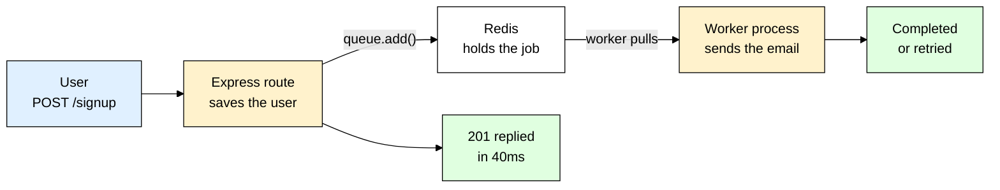
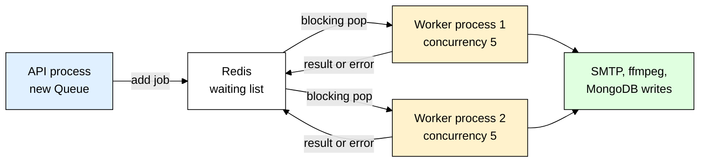
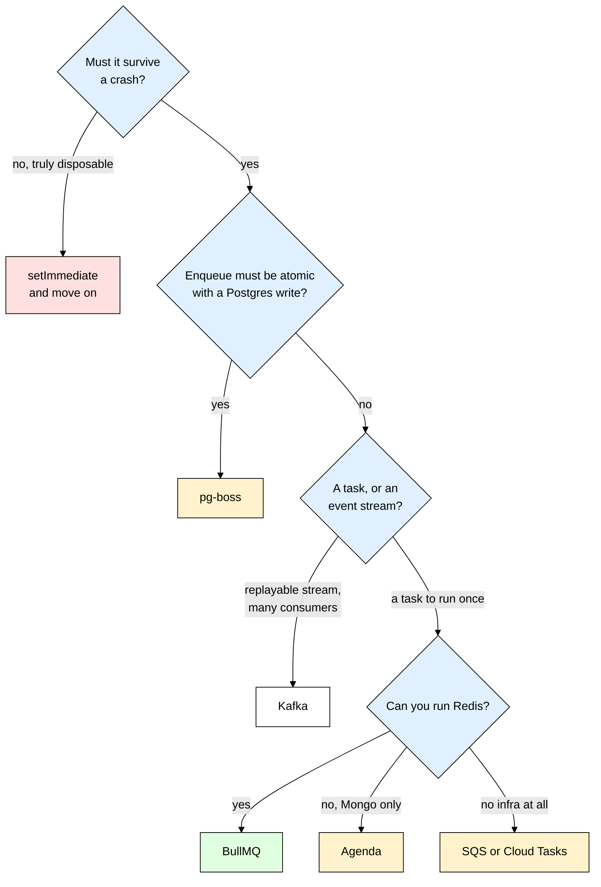

# bullmq — Doing the Slow Work After You Have Already Replied

> **Scope:** The `bullmq` npm package — Redis-backed background job queues for Node.js: queues, workers, retries, cron jobs, rate limiting, and running it all in production.
> **Level:** Beginner + practical.
> **New to Redis in Node?** Read [[ioredis]] first — BullMQ stores every job in Redis and you configure that connection yourself.

---

## 1. ELI5: What is BullMQ?

You built a `POST /signup` route. It saves the user, sends a welcome email, then replies. It works on your laptop. Then it goes live and:

- Signup takes **3.5 seconds** because the mail API is slow, and users think the site is broken.
- The mail provider has a 40-second outage, `sendMail()` throws, and your route returns **500** — so the user assumes signup failed and signs up again. Now you have two accounts and still no email.
- Someone asks for a "download all my data as a PDF" button. That takes 40 seconds, and no load balancer will hold an HTTP response open that long.

The problem is that you glued **slow, unreliable work** onto the **request path**, where a human is staring at a spinner.

Think of a **dry cleaner's front counter**. You hand over a shirt, they staple a numbered ticket to it, drop it in a bin behind them, hand you the stub, and you are out the door in twenty seconds. Nobody stands at the counter while the shirt is pressed — that happens in the back room, by different staff, on their own schedule. If a machine jams they run the shirt again, and your stub is still valid, so you can come back and ask "is ticket 4471 done?"

**BullMQ is that counter, that bin, and that ticket stub.** Your API takes the request, writes a **job** into a Redis-backed bin, and replies immediately. A completely separate **worker** process pulls jobs out and actually does the slow thing — with retries, on its own schedule, with nobody waiting.

> **Full name:** BullMQ — the TypeScript rewrite of the older `bull` library, by the same author
> **Type:** npm package (a library, not a server) — needs a Redis instance to talk to
> **Core promise:** Hand slow or failure-prone work to a durable queue, reply to the user now, and let a separate process run that work later with retries.



---

## 2. Why Does BullMQ Exist? (The Problem It Solves)

Here is the code almost everybody writes first — slow work sitting directly on the request path:

```js
// ❌ The version that pages you at 2am
app.post("/signup", async (req, res) => {
  const user = await User.create({ email: req.body.email });
  // Network calls to third parties: 1-4 seconds on a good day, and if either
  // throws, the whole request 500s — even though the user WAS created.
  await sendWelcomeEmail(user.email);
  await analytics.track("signup", { userId: user.id });
  res.status(201).json({ id: user.id });
});
```

Three bugs live in there. The user waits for work they do not care about. A third-party outage turns a *successful* signup into a *failed* HTTP response. And there is no retry — if the email fails it is gone forever, because the only record that it should have been sent was a line of code that already returned. Dropping the `await` is not the fix either: the work then lives only in the memory of one Node process, so a deploy or crash loses it silently, and from Node 15 onward an unhandled rejection **terminates the process** by default. Fire-and-forget is really fire-and-lose.

| Without BullMQ | With BullMQ |
|---|---|
| User waits for email + PDF + analytics before seeing a response | User gets a response as soon as the database write is done |
| Mail provider down → signup returns 500 | Mail provider down → job retries in 2s, 4s, 8s; signup already returned 201 |
| Work lives in process memory — a deploy or crash loses it | Work lives in **Redis** — it survives restarts and is picked up by whichever worker is alive |
| Heavy work competes with HTTP traffic for the same event loop | Heavy work runs in a **separate process** you scale, restart and throttle independently |
| No idea what failed, or how often | Failed jobs are kept with their stack trace, inspectable and re-runnable from a dashboard |
| "Email a report every night at 3am" needs a system cron, a script, and a lock | One repeatable job that fires once no matter how many workers are running |

**The real use cases**, so you can recognize them in your own app:

- **Transactional email** — welcome, password reset, receipts. See [[nodemailer]] for the sending; BullMQ is what makes it reliable.
- **Image and video processing** — thumbnails, transcoding, watermarking. Pure CPU work that must never touch your HTTP event loop.
- **Report and export generation** — "email me a CSV of everything" jobs that take a minute.
- **Outgoing webhooks** — calling *someone else's* flaky endpoint, where retry with backoff is the entire feature.
- **Scheduled cleanups** — expire sessions nightly, purge soft-deleted rows after 30 days, refresh a cache.

**Rule of thumb:** if work is slow, calls a third party, or would be fine finishing "within a minute" rather than "before I reply" — it belongs in a queue.

---

## 3. Installing & Basic Usage

```bash
npm install bullmq
docker run -d --name redis -p 6379:6379 redis:7   # local Redis, the fast way
```

BullMQ ships `ioredis` as its own dependency, so the Redis driver is already there — install `ioredis` explicitly only when you import it yourself to build a shared connection, which the production setup below does. The smallest complete example is **two files**, because a producer and a consumer are two different programs:

```js
// queue.js — the producer side, imported by your API
import { Queue } from "bullmq";
// One Queue per logical kind of work. The name is the Redis key prefix and the
// only thing tying producer to worker — they must match exactly.
export const emailQueue = new Queue("emails", {
  connection: { host: "127.0.0.1", port: 6379 },
});
// add() writes the job to Redis in about a millisecond and runs nothing. Arg 1 is
// the job NAME (a label the worker branches on), arg 2 is the payload.
await emailQueue.add("welcome", { to: "sam@example.com", name: "Sam" });
```

```js
// worker.js — run as its own process: `node worker.js`
import { Worker } from "bullmq";
import { sendMail } from "./mail.js";

// Same queue name as the producer, or this worker sits idle forever.
const worker = new Worker("emails", async (job) => {
  // This function IS the job. What it returns is stored as the result;
  // what it throws marks the job failed and triggers a retry.
  await sendMail(job.data.to, `Welcome ${job.data.name}`);
  return { sentAt: new Date().toISOString() };
}, { connection: { host: "127.0.0.1", port: 6379 } });
// Without these listeners you are debugging blind.
worker.on("completed", (job) => console.log(`job ${job.id} done`));
worker.on("failed", (job, err) => console.error(`job ${job?.id} failed:`, err.message));
```

Start `node worker.js` in one terminal and the producer in another: the job runs within milliseconds. Now kill the worker, add three more jobs, and restart it — all three run immediately, because they were sitting in Redis the whole time. That durability is the entire point.

### CommonJS version

```js
// worker.cjs — the same thing with require()
const { Worker } = require("bullmq");
const { sendMail } = require("./mail.js");

const worker = new Worker("emails", async (job) => {
  await sendMail(job.data.to, `Welcome ${job.data.name}`);
}, { connection: { host: "127.0.0.1", port: 6379 } });
```

### Express example

```js
// server.js — the API never sends an email; it only writes tickets.
import express from "express";
import { emailQueue } from "./queue.js";
import User from "./models/User.js";

const app = express();
app.use(express.json());
app.post("/signup", async (req, res) => {
  // Do the work the user is actually waiting for — the durable write.
  const user = await User.create({ email: req.body.email });
  // Queue everything else. Pass IDs, never documents: job data is JSON in Redis,
  // so a Mongoose document arrives at the worker as a lifeless blob.
  await emailQueue.add("welcome", { userId: user._id.toString() }, {
    attempts: 5,
    backoff: { type: "exponential", delay: 2000 },
  });
  res.status(201).json({ id: user._id }); // replied in milliseconds
});

app.listen(3000);
```

`queue.add` failing now means **Redis** is down, not your mail provider — far rarer, and a failure you can honestly surface as a 503. See [[express]] for routing and [[mongoose]] for the model.

That's the entire mental model — `queue.add()` on the request path writes a ticket to Redis and returns instantly, and a `Worker` in a different process picks that ticket up and runs the slow code. Everything below is refinement of those two lines.

---

## 4. Queue, Worker, Job — and Redis in the Middle

BullMQ is a handful of objects and one database. Get these straight and the rest is options.

| Object | Lives in | What it does |
|---|---|---|
| **`Queue`** | Your API process (the *producer*) | Writes jobs into Redis; also inspects, pauses, drains and schedules. Never runs job code. |
| **`Worker`** | A separate process (the *consumer*) | Blocks on Redis waiting for jobs, runs your handler, marks each job completed or failed. |
| **`Job`** | Redis (a hash plus a place in a list) | The unit of work: `id`, `name`, `data`, `opts`, `attemptsMade`, return value, failure reason. |
| **`QueueEvents`** | Anywhere | A read-only stream of `completed` / `failed` / `progress`, for dashboards and metrics. |
| **`FlowProducer`** | Producer side | Adds parent jobs with children, where the parent waits for all children to finish. |



### Why the worker must be a separate process

This is the part beginners skip, and it is the whole reason the pattern works. Node runs your JavaScript on **one thread**. A worker resizing a 4000x3000 image inside your web server makes every HTTP request queue behind that image for two seconds — including the health check, which your orchestrator then treats as a dead container. You moved the work off the *request* but not off the *event loop*, so you solved nothing.

Separating them buys **isolation** (a leaking job cannot take down the API), **independent scaling** (2 API containers, 8 worker containers), **independent deploys** (a worker can drain slowly without dropping traffic), and **different resource shapes** (fat workers, thin API) — in practice, two entry points in one repo, `src/server.js` and `src/worker.js`, sharing your models and config.

### The Redis connection, and the one option you must set

```js
import IORedis from "ioredis";
import { Queue } from "bullmq";
// maxRetriesPerRequest: null is REQUIRED for Workers — they use blocking commands
// that sit idle for seconds, and ioredis's default retry cap would abort those,
// so BullMQ refuses to start if you leave it set.
const connection = new IORedis(process.env.REDIS_URL, { maxRetriesPerRequest: null });
export const emailQueue = new Queue("emails", { connection });
```

If you see `BullMQ: Your redis options maxRetriesPerRequest must be null` on boot, that is this. A `Queue` can share one `IORedis` instance with the rest of your app, but each `Worker` needs a **dedicated blocking connection** and will duplicate whatever you hand it — passing a plain `{ host, port }` object and letting BullMQ manage that is the simpler default. See [[ioredis]] for the connection options themselves.

### Redis is your job database now — treat it like one

Jobs are not *cached* in Redis, they are **stored** there — which changes how you run it.

> ⚠️ Never point BullMQ at a Redis instance running an eviction policy like `allkeys-lru`. Under memory pressure Redis deletes whichever keys it likes — including half your pending jobs — with no error anywhere. Set `maxmemory-policy noeviction`, and if you also use Redis as a cache, put the cache on a **separate instance or database**.

Turn on persistence (`appendonly yes`) if losing queued work on a Redis restart would matter — managed Redis usually has it on, but check rather than assume. BullMQ v5 needs Node 18 or newer and Redis 5.0 or newer; target a current Redis (6.2+) unless something stops you, since newer features assume it.

---

## 5. Reliability: Retries, Backoff, and Idempotency

A queue you cannot trust is worse than no queue, because the failure is now invisible. Reliability here is four options and one discipline.

### Attempts and backoff

```js
export const emailQueue = new Queue("emails", {
  connection,
  // Set these once per queue instead of repeating them at every call site.
  defaultJobOptions: {
    attempts: 5, // TOTAL runs, not extra ones: 5 tries, then the job is failed
    // exponential doubles the wait each time — 2s, 4s, 8s, 16s — giving a
    // flapping provider room to recover instead of hammering it while it burns.
    backoff: { type: "exponential", delay: 2000 },
    // Without these, every finished job stays in Redis forever and the memory
    // graph only goes up. Keep successes briefly, keep failures as evidence.
    removeOnComplete: { age: 3600, count: 1000 }, // age is in SECONDS
    removeOnFail: { age: 7 * 24 * 3600 },
  },
});
```

`backoff` also takes `{ type: "fixed", delay: 5000 }` for a constant wait. Exponential is the right default for anything network-shaped.

### Retryable vs permanent failures

BullMQ retries on **any** thrown error, which is wrong for half of them. "SMTP connection reset" deserves four more tries. `"to" address is not a valid email` will fail identically five times and then sit in your failed list impersonating an outage.

```js
import { Worker, UnrecoverableError } from "bullmq";
import { sendMail } from "./mail.js";

const worker = new Worker("emails", async (job) => {
  try {
    await sendMail(job.data.to, "Welcome");
  } catch (err) {
    // A 4xx means we sent something invalid — retrying changes nothing.
    // UnrecoverableError fails the job now and skips the remaining attempts.
    if (err.statusCode >= 400 && err.statusCode < 500) {
      throw new UnrecoverableError(`rejected by provider: ${err.message}`);
    }
    throw err; // timeouts, 5xx, DNS: rethrow so the backoff schedule applies
  }
}, { connection });
```

### Idempotency is not optional

**A job can run more than once.** Not "might in theory" — it will, and your handler must survive it. The ways it happens:

- The handler succeeded but the worker was killed before it recorded "completed" in Redis.
- The handler ran longer than `lockDuration` (30s by default) without renewing its lock, so BullMQ declared the job **stalled** and handed it to another worker.
- An operator clicked retry on a dashboard.
- A retry fired after a partial success — three of five emails already sent.

**Rule of thumb:** write every handler so running it twice leaves the same end state as running it once.

```js
import User from "./models/User.js"; // same worker file, safer handler

const worker = new Worker("emails", async (job) => {
  // Make the DB the source of truth for "already done", with an ATOMIC
  // check-and-set. On a second run the filter matches nothing, modifiedCount is
  // 0, and we return before sending anything.
  const claim = await User.updateOne(
    { _id: job.data.userId, welcomeSentAt: null },
    { $set: { welcomeSentAt: new Date() } }
  );
  if (claim.modifiedCount === 0) return { skipped: "already sent" };
  const user = await User.findById(job.data.userId);
  await sendMail(user.email, "Welcome");
}, { connection });
```

For producers that can fire twice, give the job a deterministic id — `queue.add("welcome", data, { jobId: "welcome-" + userId })`. If a job with that id already exists, BullMQ returns it instead of adding a second one. That deduplicates *adds*, not *retries*, so you still need the idempotent handler.

### Watching failures

```js
import { QueueEvents } from "bullmq";

// Fires in the worker process, with the real Error object and stack.
worker.on("failed", (job, err) =>
  logger.error({ jobId: job?.id, attempts: job?.attemptsMade, err: err.message }, "failed"));
// "error" is different — BullMQ itself hit trouble, usually Redis. Without this
// listener an EventEmitter error takes the whole process down.
worker.on("error", (err) => logger.error({ err: err.message }, "worker error"));
// From ANOTHER process (your API, a metrics exporter) use QueueEvents — it reads
// a Redis stream, so you get ids and strings back, not Job objects.
const events = new QueueEvents("emails", { connection });
events.on("failed", ({ jobId, failedReason }) => logger.warn({ jobId, failedReason }, "job failed"));
```

Structured logs are what turn "the emails feel broken" into a searchable answer — see [[winston_morgan]].

---

## 6. Scheduling and Throughput

### Delayed and repeatable jobs

```js
// Runs in 15 minutes. The job waits in a delayed set inside Redis, so unlike a
// setTimeout it survives deploys, restarts and crashes.
await emailQueue.add("nudge", { userId }, { delay: 15 * 60 * 1000 });
```

For "every night at 3am" work, BullMQ has **job schedulers**. A scheduler is keyed by a **stable id you choose**, and `upsertJobScheduler` creates or updates it in place:

```js
// 03:00 daily in the timezone you name — not the server's. Because the id is the
// upsert key, running this line on every boot is a no-op, not a duplicate.
await cleanupQueue.upsertJobScheduler(
  "nightly-cleanup",
  { pattern: "0 3 * * *", tz: "Asia/Kolkata" },
  { name: "cleanup", data: { olderThanDays: 30 } }
);

// A fixed interval instead of a cron pattern:
await syncQueue.upsertJobScheduler("sync-5m", { every: 5 * 60 * 1000 }, { name: "sync" });
await cleanupQueue.removeJobScheduler("nightly-cleanup"); // getJobSchedulers() lists them
```

> ⚠️ Older code uses `queue.add(name, data, { repeat: { pattern } })`. It still works, but the repeat key is derived from the name, pattern and options — so *changing the pattern* leaves the old schedule running next to the new one, and your cleanup silently fires twice a night. `upsertJobScheduler` exists to make that whole class of bug impossible.

Which process runs it? Whichever worker is connected. That is the quiet win over a system crontab: with three API containers, an OS cron fires your cleanup three times, while a repeatable job produces **one** job in **one** queue no matter how many workers watch it.

### Concurrency

```js
// Up to 10 jobs in flight in THIS process. Not threads — it works because your
// handler awaits I/O, which frees the event loop to start the next job.
const worker = new Worker("emails", handler, { connection, concurrency: 10 });
```

Tune it by what the job actually does. I/O-bound work (HTTP calls, database writes) is happy at 10-50. CPU-bound work (image resizing, PDF rendering) should sit near `concurrency: 1` per process and scale by adding processes — ten concurrent CPU jobs on one thread just makes all ten slow and starves the lock renewal that keeps them from stalling.

### Rate limiting a third-party API

Your mail provider allows 100 requests per second. Ten workers at concurrency 10 will cheerfully send 1000 and get you throttled.

```js
const worker = new Worker("emails", handler, {
  connection,
  concurrency: 20,
  // Cluster-wide, not per-process: the counter lives in Redis, so ten worker
  // containers still share this single 100-per-second budget.
  limiter: { max: 100, duration: 1000 },
});
```

When the provider itself tells you to slow down, `await worker.rateLimit(ms)` stops the queue being consumed for that long and `throw Worker.RateLimitError()` requeues the job **without** burning an attempt — the correct pair to reach for on a `429` with a `Retry-After` header.

### Priorities

```js
// priority runs 1..2097152 and LOWER means sooner. Omitting it (or 0) means "no
// priority" — plain FIFO, which is cheaper, so do not set what you do not need.
await emailQueue.add("password-reset", data, { priority: 1 }); // jumps ahead
await emailQueue.add("monthly-digest", data, { priority: 10 });
```

### Flows — parent and child jobs

When one unit of work is really "do these five things, then combine the results", `new FlowProducer({ connection })` and `flow.add({ name, queueName, data, children: [...] })` express that without you inventing a counter in Redis. The children run like any other job on the workers watching their queue; the parent sits in the `waiting-children` state until every child has completed, and then its handler can read the results with `await job.getChildrenValues()`.

---

## 7. TypeScript Version

BullMQ is written in TypeScript, and its generics are worth using: they turn the payload into a real contract between producer and worker, so a renamed field is a compile error instead of a 3am `undefined`.

```ts
// src/queues/email.ts
import { Queue, Worker, Job, type ConnectionOptions } from "bullmq";
import { sendWelcome } from "../mail.js";

// One shared shape, imported by BOTH sides. That is the whole benefit.
export interface WelcomeEmailData { userId: string; locale: "en" | "hi" }
export interface WelcomeEmailResult { messageId: string; sentAt: string }
const connection: ConnectionOptions = {
  host: process.env.REDIS_HOST ?? "127.0.0.1",
  port: Number(process.env.REDIS_PORT ?? 6379),
};
// Queue<Data, Result, Name> — naming the job names as a union makes a typo in
// queue.add("welcom", ...) fail to compile instead of vanishing into Redis.
export const emailQueue = new Queue<WelcomeEmailData, WelcomeEmailResult, "welcome">(
  "emails",
  { connection, defaultJobOptions: { attempts: 5, backoff: { type: "exponential", delay: 2000 } } }
);
// job.data is typed, and the returned object is checked against the result type.
export const emailWorker = new Worker<WelcomeEmailData, WelcomeEmailResult, "welcome">(
  "emails",
  async (job: Job<WelcomeEmailData, WelcomeEmailResult, "welcome">) => {
    await job.updateProgress(10); // readable from QueueEvents and dashboards
    const info = await sendWelcome(job.data.userId, job.data.locale);
    return { messageId: info.messageId, sentAt: new Date().toISOString() };
  },
  { connection, concurrency: 10 }
);
```

On the producer side that typing is what earns its keep: `emailQueue.add("welcome", { userId: user._id, locale: "en" })` now fails to compile, because `_id` is an `ObjectId` and the contract says `string` — exactly the bug you want caught at build time instead of in a failed job at 3am.

---

## 8. Production Setup

### A dedicated worker entry point

```js
// src/worker.js — this file never imports express
import "dotenv/config";
import mongoose from "mongoose";
import IORedis from "ioredis";
import { Worker } from "bullmq";
import { handleWelcome } from "./jobs/sendWelcome.js";
import logger from "./logger.js";

await mongoose.connect(process.env.MONGO_URL); // its own DB connection, own process
const connection = new IORedis(process.env.REDIS_URL, { maxRetriesPerRequest: null });
const worker = new Worker("emails", async (job) => {
  // Branch on job.name so one queue can carry several related job types.
  switch (job.name) {
    case "welcome": return handleWelcome(job);
    default: throw new Error(`unknown job name: ${job.name}`);
  }
}, { connection, concurrency: Number(process.env.EMAIL_CONCURRENCY ?? 10) });
worker.on("completed", (job) => logger.info({ jobId: job.id, name: job.name }, "completed"));
worker.on("failed", (job, err) => logger.error({ jobId: job?.id, err: err.message }, "failed"));
worker.on("error", (err) => logger.error({ err: err.message }, "worker error"));
```

```json
{
  "scripts": {
    "start": "node src/server.js",
    "start:worker": "node src/worker.js",
    "dev": "concurrently \"npm:dev:api\" \"npm:dev:worker\""
  }
}
```

Locally, run both with [[concurrently]]; in production they are two separate services.

### Graceful shutdown — the one that actually bites

When a deploy sends `SIGTERM`, the default behavior kills the process mid-job. The job's lock is still held, so nothing happens for 30 seconds, then it stalls and is retried — a half-charged card, a truncated file, a duplicate email.

```js
// same file, below the worker
async function shutdown(signal) {
  logger.info({ signal }, "shutting down worker");
  await worker.close(); // stops taking NEW jobs, waits for running handlers
  await mongoose.connection.close();
  process.exit(0);
}
process.on("SIGTERM", () => shutdown("SIGTERM"));
process.on("SIGINT", () => shutdown("SIGINT"));
```

Then make sure your supervisor actually waits: [[pm2]] uses `kill_timeout`, Docker uses `--stop-timeout`, Kubernetes uses `terminationGracePeriodSeconds`. Set it comfortably longer than your slowest job, or the platform `SIGKILL`s you halfway through the graceful shutdown and you are back where you started. Under pm2 that is two apps in `ecosystem.config.cjs` — the API in `cluster` mode, and the worker in the default `fork` mode with `instances: 4` and `kill_timeout: 30000`.

### A dashboard: Bull Board

Flying blind is the main reason teams abandon queues. **Bull Board** mounts a UI on your existing Express app showing waiting, active, completed, failed and delayed jobs, with stack traces and a retry button.

Install it with `npm install @bull-board/api @bull-board/express`, then mount the router:

```js
import { createBullBoard } from "@bull-board/api";
import { BullMQAdapter } from "@bull-board/api/bullMQAdapter.js";
import { ExpressAdapter } from "@bull-board/express";
const serverAdapter = new ExpressAdapter();
serverAdapter.setBasePath("/admin/queues");
createBullBoard({ queues: [new BullMQAdapter(emailQueue)], serverAdapter });
app.use("/admin/queues", requireAdmin, serverAdapter.getRouter());
```

> ⚠️ That router can delete, retry and drain jobs. Put real authentication in front of it — never expose it on a public path.

**The rest of the checklist.** Keep connection strings in the environment rather than in code — see [[dotenv]]. Alert on the failed count **and** on the waiting count *growing*, since a rising backlog is how you learn your workers are dead or too slow before your users do. Keep payloads small (ids, never documents or base64 files — big blobs go to S3 and the job carries the key), and keep producers and workers on the same BullMQ major version, because the Redis key layout is an internal contract between them.

---

## 9. Common Gotchas & Best Practices

| Gotcha | Fix |
|---|---|
| `BullMQ: Your redis options maxRetriesPerRequest must be null` on worker boot | You passed a shared `IORedis` instance built with defaults. Workers use blocking commands: build it as `new IORedis(url, { maxRetriesPerRequest: null })`, or pass a plain `{ host, port }` object and let BullMQ manage the connection. |
| Worker started inside the Express process "to keep it simple" | One CPU-heavy job blocks every HTTP request and your health check, and blocking the loop also stops lock renewal, so jobs go **stalled** and run twice. Run `node worker.js` as its own process from day one. |
| Redis memory climbing forever | Completed and failed jobs are kept by default. Set `removeOnComplete: { age: 3600, count: 1000 }` and `removeOnFail: { age: 7 * 24 * 3600 }` in `defaultJobOptions`. |
| Passing a Mongoose document as `job.data` | Job data is `JSON.stringify`-ed into Redis: methods disappear, `Date` becomes a string, `ObjectId` becomes a string, and a populated document can be megabytes. Pass `{ userId: user._id.toString() }` and re-fetch inside the handler. |
| The same email arriving twice | A job legitimately reruns after a stall or an operator retry. Make handlers idempotent — an atomic conditional update like `updateOne({ _id, sentAt: null }, ...)` is the cheapest guard. |
| A job with bad input retrying five times and burning your rate limit | Classify errors: `throw new UnrecoverableError(msg)` for permanent problems (missing record, provider 4xx), plain `throw err` for transient ones so backoff applies. |
| A duplicate cron job appearing after every deploy | Legacy `repeat` options key off the pattern, so changing the schedule leaves the old one alive. Use `queue.upsertJobScheduler("stable-id", { pattern }, { name })` — the id is the upsert key, so redeploying is a no-op. |
| Jobs silently vanishing under load | The Redis instance has an eviction policy such as `allkeys-lru` and is deleting job keys to free memory. Set `maxmemory-policy noeviction` and keep cache traffic on a different instance or database. |

---

## 10. Alternatives — When BullMQ Isn't the Best Fit

| Option | What it is | Best for |
|---|---|---|
| **BullMQ** | Redis-backed job queue for Node: retries, cron, rate limits, flows, priorities. | **The default when your Node app already has Redis.** Fast, feature-rich, one dependency, excellent local dev story. |
| **Agenda** | Job scheduler backed by **MongoDB**, polling a collection. | You have Mongo and no Redis, and the workload is mostly *scheduled* rather than high-throughput. Much slower per job, and development is far quieter than BullMQ's. |
| **pg-boss** | Job queue backed by **Postgres**, using `SKIP LOCKED`. | Postgres-only stacks, and — the real advantage — enqueueing a job **in the same transaction** as your data write, which no Redis queue can offer. |
| **SQS / Cloud Tasks** | Managed cloud queues. | Zero queue infrastructure to operate, consumers in other languages, long retention guaranteed by someone else. Higher latency, per-request cost, weaker local dev. |
| **Kafka / Redpanda** | Distributed append-only log. | Event streaming *between services*, replayable history, many independent consumer groups. Not a task queue: no per-job retries, no delayed jobs, no "run this once". |
| `setImmediate` / bare promise | Nothing at all. | Genuinely disposable work where losing it silently is fine. Not durable, not retried, dies with the process, and an unhandled rejection terminates Node. |
| **Temporal** | Durable workflow engine with resumable, versioned execution. | Multi-step business processes lasting days with human approvals — far more power, and far more operational weight, than a queue. |

**BullMQ vs the older Bull.** Same author, different generation. `bull` is the original JavaScript library; **BullMQ** is the TypeScript rewrite with a redesigned Redis data model — sturdier stalled-job handling, `FlowProducer` parent/child jobs, job schedulers, cluster-wide rate limiting, and active development. `bull` is in maintenance mode. If a tutorial has you `npm install bull` and call `queue.process()`, that is the old API. Start new work on BullMQ, and never point both at the same queue name — the key layouts are not compatible.



**Rule of thumb:** if your Node app already runs Redis for sessions or caching, BullMQ is the shortest path from "this route is slow" to "this route is fast and the work still happens". Reach past it only for transactional enqueue (pg-boss), zero-infrastructure operations (SQS), or real event streaming (Kafka).

---

## 11. Interview Questions

**Q: Why move work into a queue instead of just not awaiting the promise?**
A: Not awaiting makes the response fast but the work non-durable — it lives only in one process's memory, so a deploy, crash or scale-down loses it silently, and an unhandled rejection can terminate Node. A queue writes the intent to Redis first, so the work survives restarts, retries with backoff on failure, is visible in a dashboard, and runs on a process you scale separately from HTTP traffic.

**Q: Why must the worker be a separate process from the web server?**
A: Node executes JavaScript on a single thread, so a CPU-heavy job in the API process blocks every request behind it, health checks included. It also blocks BullMQ's lock renewal, so the job is marked stalled and re-dispatched to another worker while it is still running. Separate processes additionally let you scale, restart and resource-size the API and the workers independently.

**Q: What does "jobs must be idempotent" mean, and why is it forced on you?**
A: It means running the same job twice leaves the system in the same state as running it once. BullMQ gives you at-least-once delivery, not exactly-once: a worker can finish the work and die before recording completion, a slow job can exceed its lock and be re-dispatched, and an operator can retry from a dashboard. The practical fix is an atomic conditional write — set `sentAt` only if it is currently null, and skip the job when that update matches nothing.

**Q: How do you stop a job from retrying when the error is permanent?**
A: Classify the error inside the handler. Throw `UnrecoverableError` from `bullmq` for anything more attempts cannot fix — a deleted record, a validation failure, a provider 4xx — which fails the job immediately regardless of remaining `attempts`. Rethrow the original error for transient problems like timeouts and 5xx so exponential backoff applies.

**Q: What is the difference between `concurrency` and `limiter` on a Worker?**
A: `concurrency` is how many jobs one worker process runs at once and is local to that process, so ten processes at concurrency 10 give you 100 in flight. `limiter: { max, duration }` is a throughput ceiling coordinated through Redis, so it applies across every worker on that queue. You use concurrency to saturate your own machine and the limiter to respect somebody else's rate limit.

**Q: Why does Redis's eviction policy matter for BullMQ?**
A: BullMQ stores jobs in Redis as ordinary keys, so Redis is the queue's database, not a cache. With `maxmemory-policy allkeys-lru` or similar, Redis deletes job keys under memory pressure and no error appears anywhere — jobs simply disappear. Use `noeviction` on the queue instance, enable AOF persistence if losing queued work is unacceptable, and keep cache traffic on a different instance.

**Q: How do you deploy workers without corrupting in-flight jobs?**
A: Handle `SIGTERM` and `await worker.close()`, which stops fetching new jobs and waits for running handlers to finish before exiting. Then set the supervisor's grace period — pm2 `kill_timeout`, Kubernetes `terminationGracePeriodSeconds` — longer than your slowest job, or the platform sends `SIGKILL` mid-shutdown anyway. Even then, keep handlers idempotent, because a hard kill is always possible.

---

## 12. Quick Cheat Sheet

```bash
npm install bullmq                                 # ioredis comes with it
docker run -d --name redis -p 6379:6379 redis:7    # local Redis
```

```js
// Producer — in your API
import { Queue } from "bullmq";
export const emailQueue = new Queue("emails", {
  connection: { host: "127.0.0.1", port: 6379 },
  defaultJobOptions: {
    attempts: 5,                                   // total tries, then failed
    backoff: { type: "exponential", delay: 2000 }, // 2s, 4s, 8s, 16s
    removeOnComplete: { age: 3600, count: 1000 },  // stop Redis growing
    removeOnFail: { age: 7 * 24 * 3600 },
  },
});
await emailQueue.add("welcome", { userId });                    // now
await emailQueue.add("nudge", { userId }, { delay: 900000 });   // in 15 minutes
await emailQueue.add("reset", { userId }, { priority: 1 });     // lower = sooner
// Cron — safe to run on every boot, because the id is the upsert key
await emailQueue.upsertJobScheduler("cleanup", { pattern: "0 3 * * *", tz: "UTC" }, { name: "cleanup" });
```

```js
// Consumer — its own process: `node worker.js`
import IORedis from "ioredis";
import { Worker, UnrecoverableError } from "bullmq";
// maxRetriesPerRequest: null is mandatory for workers
const connection = new IORedis(process.env.REDIS_URL, { maxRetriesPerRequest: null });
const worker = new Worker("emails", async (job) => {
  if (!job.data.userId) throw new UnrecoverableError("no userId"); // never retry
  return await doWork(job.data);                                   // retry on throw
}, {
  connection,
  concurrency: 10,                       // in-flight jobs in this process
  limiter: { max: 100, duration: 1000 }, // cluster-wide, 100 per second
});
worker.on("failed", (job, err) => console.error(job?.id, err.message));
process.on("SIGTERM", async () => { await worker.close(); process.exit(0); }); // drain, then exit
```

```
# redis.conf for a queue instance
maxmemory-policy noeviction
appendonly yes
```

**Mental model to remember:**
> BullMQ is a durable ticket counter in front of your slow work: the API calls `queue.add()` and replies in milliseconds, while a separate worker process pulls the ticket out of Redis and does the real job with retries, backoff and rate limits. Treat Redis as a database (`noeviction`, persistence on, retention configured), write every handler to be safe when it runs twice, and shut workers down with `await worker.close()`. Pair it with [[ioredis]] for the connection, [[nodemailer]] for the classic first job, [[pm2]] for running the worker, and [[winston_morgan]] for seeing what happened.
