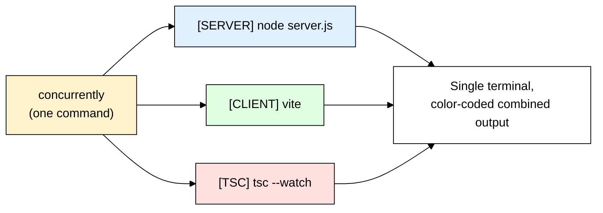
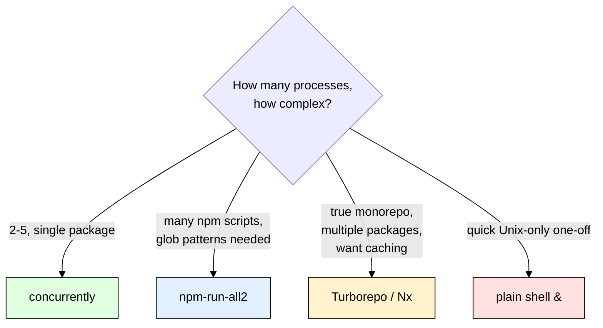

# concurrently — Run Multiple Commands at the Same Time

> **Scope:** Node.js dev tooling. Covers the `concurrently` npm package, plus alternatives (`npm-run-all2`, plain shell `&`, monorepo task runners like Turborepo/Nx).
> **Level:** Beginner + practical.

---

## 1. ELI5: What is concurrently?

Most real apps aren't just "one server." A typical dev setup needs **several things running at once**:

- A backend API server (`node server.js`)
- A frontend dev server (`vite` / `next dev`)
- A TypeScript compiler watching for changes (`tsc --watch`)
- Maybe a CSS watcher, a test runner in watch mode...

Without help, you'd need to open **multiple terminal tabs**, and run one command in each, and watch all of them separately.

**`concurrently`** is like hiring **one manager who opens all those terminals for you, runs a command in each, and streams all their output into a single terminal** — color-coded so you can tell which line came from which process.

> **Full name:** `concurrently` (npm package name, literally the word "concurrently")
> **Type:** npm package (dev dependency), CLI tool
> **Core promise:** Run multiple shell commands in parallel, from one command, with combined/labeled output.



---

## 2. Why Does concurrently Exist? (The Problem It Solves)

| Without concurrently | With concurrently |
|---|---|
| Open Terminal Tab 1 → `npm run server` | One command: `npm run dev` |
| Open Terminal Tab 2 → `npm run client` | Both start together automatically |
| Manually `Ctrl+C` each tab separately to stop everything | `Ctrl+C` once stops **all** of them |
| No easy way to tell whose log line is whose | Each line prefixed/colored by which process wrote it |
| `git clone` your project → new dev needs to remember "run these 2 commands in 2 tabs" | `npm install && npm run dev` — one documented command, works for everyone |

This is purely a **developer experience (DX)** tool, same spirit as nodemon (see [[nodemon]]) — it doesn't change how your app works, it just makes running it locally less tedious.

---

## 3. Installing & Basic Usage

```bash
npm install --save-dev concurrently
```

Run two (or more) commands at once, each as a quoted string:

```bash
npx concurrently "node server.js" "vite"
```

Both start immediately, and their output is interleaved in one terminal, each line prefixed with `[0]` / `[1]` by default (the command's index).

### The real-world pattern: reference `package.json` scripts

Instead of writing raw shell commands, it's cleaner to define each piece as its own npm script, then have `concurrently` run them **by name** using the `npm:` prefix:

```json
{
  "scripts": {
    "server": "node server.js",
    "client": "vite",
    "dev": "concurrently \"npm:server\" \"npm:client\""
  }
}
```

```bash
npm run dev
```

Now `npm run dev` starts **both** the backend and frontend dev servers together, in one command, and `Ctrl+C` stops both cleanly.

---

## 4. Practical Example: Backend + Frontend Together

This is the single most common real-world use of `concurrently` — a Node API backend and a frontend dev server (Vite/React/etc.), run together during development:

```json
{
  "scripts": {
    "server": "nodemon server/index.js",
    "client": "vite --config client/vite.config.js",
    "dev": "concurrently --names \"SERVER,CLIENT\" --prefix-colors \"blue,green\" \"npm:server\" \"npm:client\""
  }
}
```

```bash
npm run dev
```

Output looks like:

```
[SERVER] Server listening on port 4000
[CLIENT] VITE ready in 320ms
[CLIENT] Local: http://localhost:5173
[SERVER] GET /api/users 200 12ms
```

Notice this also composes nicely with [[nodemon]] — `server` itself uses nodemon to auto-restart on backend changes, while `concurrently` is just the outer layer running both dev processes side by side.

---

## 5. Key Flags / Options

| Flag | What it does |
|---|---|
| `--names "A,B,C"` | Custom labels instead of `[0]`, `[1]`, `[2]` — e.g. `[SERVER]`, `[CLIENT]`. |
| `--prefix-colors "blue,green,yellow"` | Color each process's output differently, matched to `--names` order. |
| `-k`, `--kill-others` | If **any** process exits, kill all the others too (useful when one process failing means the rest are pointless). |
| `--kill-others-on-fail` | Like above, but only kills the others if a process exits with a **non-zero** (failure) code — lets clean exits (like a one-off build step finishing) not tear everything down. |
| `-s`, `--success` | Controls what determines overall success/exit code: `all` (every process must succeed), `first` (only the first-listed process's exit code matters), `last`, or a count. |
| `-r`, `--raw` | Output raw, unprefixed, unmodified — useful when piping to another tool that expects clean output. |
| `-n`, `--names` (shorthand) | Same as `--names`. |
| `--restart-tries <n>` | Automatically restart a process N times if it crashes. |

```bash
concurrently -k --names "SERVER,CLIENT" --prefix-colors "blue,green" "npm:server" "npm:client"
```

---

## 6. Common Gotchas

| Gotcha | Fix / Explanation |
|---|---|
| **Forgetting to quote each command** | `concurrently node server.js vite` is WRONG — `concurrently` will treat `node`, `server.js`, `vite` as 3 separate single-word commands. Always quote each full command: `concurrently "node server.js" "vite"`. |
| **One process crashing doesn't stop the others by default** | By default, if `server` crashes, `client` keeps running "successfully" forever. Use `--kill-others` or `--kill-others-on-fail` if that's not what you want. |
| **`&&` vs `concurrently` confusion** | `a && b` runs `a`, waits for it to **finish**, then runs `b` (sequential). `concurrently "a" "b"` runs them **at the same time**. They solve opposite problems — don't mix them up. |
| **Exit code surprises in CI** | If you use `concurrently` in a CI pipeline (not just local dev) and expect the overall command to fail when one process fails, make sure `--success` is set correctly (default is `all`, which usually is what you want in CI). |
| **Nested quotes on Windows vs Unix shells** | Command quoting for `npm:` script references is more portable/reliable than raw shell command strings — prefer `"npm:server"` over inlining the raw command directly when you can. |

---

## 7. Alternatives — When concurrently Isn't the Best Fit

| Tool | What it is | Best for |
|---|---|---|
| **`concurrently`** | Run N commands in parallel, combined/labeled output, cross-platform. | Simple projects, 2-5 dev processes, want it to "just work" on Mac/Linux/Windows alike. |
| **Plain shell `&`** (e.g. `node server.js & vite`) | OS-level backgrounding, no package needed. | Quick one-offs on Unix/Mac — but **not cross-platform** (breaks on Windows `cmd`), no color-coded labeled output, harder to stop both with one `Ctrl+C`. |
| **`npm-run-all2`** (maintained fork of the older `npm-run-all`) | Run multiple npm scripts either in parallel (`-p`) or sequentially (`-s`), using glob patterns to match script names. | When you have many scripts (`build:*`, `test:*`) and want glob-based selection, e.g. `npm-run-all -p build:*`. |
| **Turborepo** | Full monorepo build system — task graph, caching, only reruns what changed, parallelizes across multiple *packages* (not just multiple commands in one package). | Monorepos with several apps/packages that depend on each other (e.g. `packages/api`, `packages/web`, `packages/shared-ui`). |
| **Nx** | Similar to Turborepo — monorepo task orchestration, dependency graph, caching, code generators. | Larger monorepos, especially ones wanting more built-in tooling/generators beyond just "run tasks." |
| **Wireit** | Adds caching + dependency-aware task running on top of plain npm scripts, without a full monorepo tool. | Projects that want Turborepo-style incremental/caching benefits but want to stay lightweight, still using plain `npm run`. |

### Rule of thumb

- **Just need 2-5 processes running together in one project (e.g. backend + frontend + a watcher)?** → `concurrently` is the simplest, most direct fit. This is almost certainly what you want for a normal single-repo project.
- **Have many `npm` scripts and want glob-based selection (`test:*`, `build:*`) or a sequential+parallel mix?** → `npm-run-all2`.
- **You're in an actual monorepo** with multiple independent packages that have their own `package.json`, dependencies between them, and you care about build caching/incremental runs → outgrow `concurrently` into **Turborepo** or **Nx**.
- **Quick, throwaway, Unix-only, don't care about clean combined output?** → plain shell `&` is fine, just know it's not cross-platform and won't give you labeled/colored output.



---

## 8. Quick Cheat Sheet

```bash
# Install
npm install --save-dev concurrently

# Basic use — quote each full command
npx concurrently "node server.js" "vite"

# Reference existing npm scripts by name (cleaner)
concurrently "npm:server" "npm:client"

# Named + colored output, kill all if one crashes
concurrently -k --names "SERVER,CLIENT" --prefix-colors "blue,green" "npm:server" "npm:client"
```

```json
{
  "scripts": {
    "server": "node server.js",
    "client": "vite",
    "dev": "concurrently \"npm:server\" \"npm:client\""
  }
}
```

**Mental model to remember:**
> `concurrently` = run several commands **at the same time**, in one terminal, with one `Ctrl+C` to stop them all. It's the dev-experience glue for "I need my backend and frontend (and maybe a watcher) running together" — reach for a real monorepo tool (Turborepo/Nx) only once you outgrow a single `package.json`.
