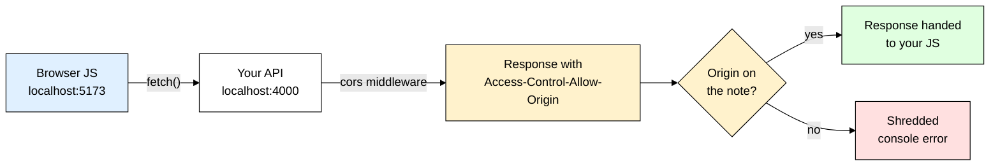
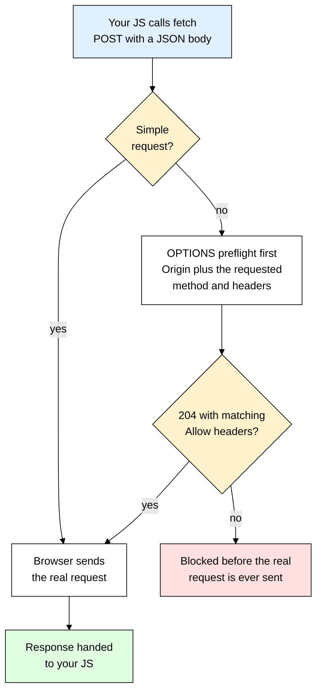
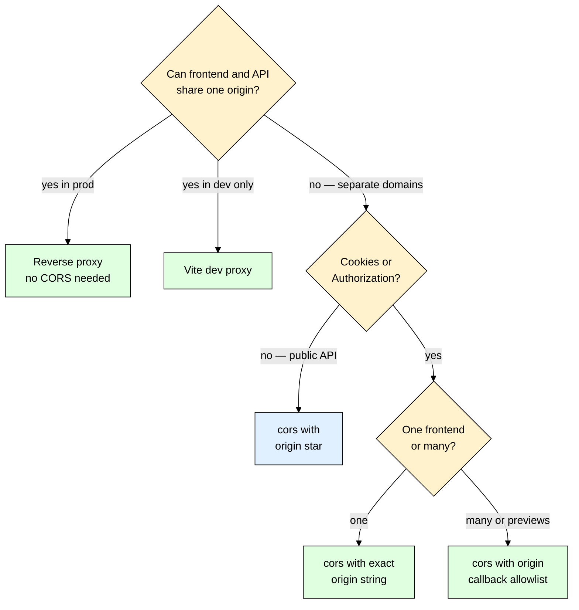

# cors — Why the Browser Blocks Your Frontend (and How to Unblock It)

> **Scope:** The `cors` npm package as Express middleware — origins, preflights, credentials, dynamic allowlists — plus the alternatives (manual headers, reverse proxy, Vite dev proxy).
> **Level:** Beginner + practical.
> **New to Express middleware?** Read [[express]] first — everything here is "a function that runs before your route handler."

---

## 1. ELI5: What is cors?

You built a login route. You tested it in Postman — perfect, `200 OK`, token comes back. You wire up your React app on `http://localhost:5173`, click the button, and the console lights up red:

```
Access to fetch at 'http://localhost:4000/api/login' from origin 'http://localhost:5173'
has been blocked by CORS policy: No 'Access-Control-Allow-Origin' header is present
on the requested resource.
```

Nothing in your server code changed, and your server is fine — it *answered*. Something in the middle threw the answer away.

Think of your browser as a **paranoid butler**. Your JavaScript asks the butler to fetch a document from the house next door. The butler walks over, knocks, collects the document, walks back — and then, standing in the doorway, reads the note stapled to the front: *"the residents of number 5173 may read this."* If your address isn't on that note, the butler shreds the document in front of you rather than handing it over. The neighbor was perfectly happy to give it up; the butler is the one who refuses.

The **`cors` package** staples the right note to your server's responses. That's it — it writes a handful of `Access-Control-*` response headers so the butler lets your JavaScript read what came back.

> **Full name:** CORS = **C**ross-**O**rigin **R**esource **S**haring
> **Type:** npm package — Express middleware (a thin wrapper that sets response headers)
> **Core promise:** Tell the browser which other origins are allowed to read your responses — so it stops blocking your own frontend.



---

## 2. Why Does cors Exist? (The Problem It Solves)

Here is a perfectly correct Express API that a browser refuses to talk to — and the two-line "fix" that eats your afternoon:

```js
// Works flawlessly in curl. Blocked in every browser.
app.get("/api/products", (req, res) => {
  res.json([{ id: 1, name: "Keyboard" }]); // the response leaves the server just fine
});

// The hand-rolled attempt:
app.use((req, res, next) => {
  res.setHeader("Access-Control-Allow-Origin", "*"); // works... until you need cookies
  next();
});
```

`GET` works now. Then you POST JSON and it breaks again, because you never answered the `OPTIONS` preflight. Then you add cookies and it breaks again, because `"*"` is illegal with credentials. Then you add a staging domain and `"*"` stops being acceptable at all. Every one of those is a *different rule of the CORS spec*, learned the hard way, in production, at 11pm.

| Without cors | With cors |
|---|---|
| You hand-write `Access-Control-Allow-Origin` and hope | `app.use(cors(options))` — one line, spec-correct headers |
| `OPTIONS` preflights fall through to your router and 404 | Preflights are intercepted and answered with `204` automatically |
| One hardcoded origin, or the unsafe `*` | Origin can be a string, array, `RegExp`, or a **function** that checks an allowlist |
| You forget `Vary: Origin` and a CDN caches one origin's headers for another | `Vary: Origin` is added for you whenever the origin isn't `*` |
| `Access-Control-Allow-Headers` must be hand-maintained as your client evolves | Defaults to reflecting whatever the browser asked for |

`cors` is not a security feature you're adding — it's a **restriction you're carefully relaxing**. The browser's default is "block everything cross-origin," and this package writes the exceptions.

---

## 3. Installing & Basic Usage

```bash
npm install cors
```

The smallest thing that works — a fully public, read-only API:

```js
import express from "express";
import cors from "cors";

const app = express();

// No options = Access-Control-Allow-Origin: *
// Fine for a public API with no cookies. NOT fine once you send credentials.
app.use(cors());
app.listen(4000);
```

### CommonJS version

```js
const express = require("express");
const cors = require("cors");

const app = express();
app.use(cors());
```

### Express example

The version you actually want — a named frontend origin, cookies allowed, mounted before everything else:

```js
app.use(cors({
  origin: "http://localhost:5173", // exact string — no trailing slash, no path
  credentials: true,               // let cookies / Authorization ride along
}));

app.use(express.json()); // body parser goes AFTER cors, so preflights never reach it

app.post("/api/login", (req, res) => {
  res.cookie("sid", "abc123", { httpOnly: true, sameSite: "lax" });
  res.json({ ok: true });
});
```

Mounted with `app.use()` the middleware does two jobs: on a normal request it adds the `Access-Control-*` headers and calls `next()`; on an `OPTIONS` preflight it adds the headers, replies `204`, and **ends the request** — your routes never see it.

That's the entire mental model — `cors()` writes a few response headers, the browser reads them and decides whether your JavaScript may see the response. Everything below is just *which* headers, and *when*.

---

## 4. The Same-Origin Policy — What an "Origin" Actually Is

An **origin** is exactly three things glued together: `scheme` + `host` + `port`. Not the path. Not the query string. Not "the same website." If any one of the three differs, it is a **different origin** and the browser's **Same-Origin Policy (SOP)** kicks in.

Compare everything against `https://api.myapp.com/users`:

| Other URL | Same origin? | Why |
|---|---|---|
| `https://api.myapp.com/orders` | **Yes** | Path is irrelevant — only scheme + host + port count |
| `https://api.myapp.com/users?page=2` | **Yes** | Query strings don't affect origin either |
| `http://api.myapp.com/users` | No | Different **scheme** (`http` vs `https`) |
| `https://myapp.com/users` | No | Different **host** — the bare domain is not the subdomain |
| `https://www.api.myapp.com/users` | No | Different host — subdomains are *not* "close enough" |
| `https://api.myapp.com:8443/users` | No | Different **port** |
| `http://localhost:5173` → `http://localhost:4000` | No | Same host, different port — this is why local dev breaks |

That last row bites every beginner: `localhost:5173` and `localhost:4000` are as cross-origin as `google.com` and `facebook.com`, as far as the browser is concerned.

### The part that confuses everyone: the server never blocks anything

**CORS is enforced by the browser, and only by the browser.** Your Express server has no idea whether a request came from a browser, curl, Postman, a mobile app, or another server. It just answers. `Access-Control-Allow-Origin` is *advice to the browser*, and the browser is the only party that acts on it.

This is why **curl and Postman never get CORS errors** — they aren't browsers, they don't implement SOP, and they don't even send an `Origin` header by default. So "it works in Postman" tells you nothing. It's also why **a blocked request usually still ran**: for a simple `GET` the browser sends it, receives the response, *then* checks the header and throws the body away. Your database was read, your logs show a `200`, and the user just never saw it.

To reproduce a browser's view from the terminal, send the header yourself with `curl -i -H "Origin: http://localhost:5173" http://localhost:4000/api/products`. If `Access-Control-Allow-Origin` is missing from that output, the browser will block it; if it's there, the browser won't.

---

## 5. Simple vs Preflighted Requests

Some cross-origin requests the browser just sends. Others it **asks permission for first**, using a throwaway `OPTIONS` request called a **preflight** — knowing which is which explains 90% of "my GET works but my POST doesn't." A request is **simple** (no preflight) only if *all three* of these hold: the method is `GET`, `HEAD`, or `POST`; the only headers your code set are safelisted (`Accept`, `Accept-Language`, `Content-Language`, `Content-Type`); and if `Content-Type` is set, its value is one of exactly three — `application/x-www-form-urlencoded`, `multipart/form-data`, `text/plain`. Break any one and you get a preflight:

| Your request | Preflighted? | Why |
|---|---|---|
| `fetch("/api/products")` | No | Plain `GET`, no custom headers |
| `<form>` POST with a url-encoded body | No | Safelisted method + safelisted `Content-Type` |
| `fetch(url, { method: "POST", headers: { "Content-Type": "application/json" } })` | **Yes** | `application/json` is **not** on the three-value safelist |
| Anything sending `Authorization: Bearer ...` | **Yes** | Custom header |
| `PUT`, `PATCH`, `DELETE` | **Yes** | Non-simple method |
| A JSON call via [[axios]] | **Yes** | axios sets `Content-Type: application/json` for you |

That third row is the classic — practically every real API call is preflighted, because practically every real API call sends JSON or a token.



The two sides line up one-to-one:

| Browser asks (on the `OPTIONS`) | Server must answer with |
|---|---|
| `Origin: http://localhost:5173` | `Access-Control-Allow-Origin: http://localhost:5173` |
| `Access-Control-Request-Method: POST` | `Access-Control-Allow-Methods: GET,HEAD,PUT,PATCH,POST,DELETE` |
| `Access-Control-Request-Headers: content-type,authorization` | `Access-Control-Allow-Headers: Content-Type,Authorization` |
| (implied by `credentials: "include"`) | `Access-Control-Allow-Credentials: true` |

The `cors` package answers all four for you. By default `allowedHeaders` simply **reflects** whatever the browser listed in `Access-Control-Request-Headers` — which is why you rarely need to set it, and why the moment you *do* set it manually you must keep it in sync with every custom header your client sends.

> ⚠️ A preflight carries **no cookies, no `Authorization` header, and no body**. It is an anonymous question. If your auth middleware runs before `cors()`, it rejects the `OPTIONS` with `401`, the preflight fails, and the browser reports a generic CORS error — with no hint that auth was the real cause.

---

## 6. Credentials — Cookies and Authorization Headers

By default, cross-origin `fetch` sends **no cookies at all** and ignores any `Set-Cookie` that comes back — your session cookie exists in the browser and simply never leaves it. Two switches must both be flipped. **Server side**, allow credentials and name an exact origin:

```js
// An exact origin — NOT "*" — plus Access-Control-Allow-Credentials: true
app.use(cors({ origin: "https://app.myapp.com", credentials: true }));
```

**Client side** — opt in per request:

```js
import axios from "axios";

// "same-origin" is the default and will NOT send the cookie cross-origin
await fetch("https://api.myapp.com/api/me", { credentials: "include" });

// [[axios]] — set it once on the instance instead of per request
const api = axios.create({ baseURL: "https://api.myapp.com", withCredentials: true });
```

### The hard rule: `*` is illegal with credentials

This combination is forbidden by the spec, and the browser says so in a very specific way:

```
has been blocked by CORS policy: The value of the 'Access-Control-Allow-Origin' header
in the response must not be the wildcard '*' when the request's credentials mode is 'include'.
```

```js
// ❌ Illegal — browser refuses the response even though your server sent it
app.use(cors({ origin: "*", credentials: true }));

// ✅ Legal — one exact origin string, or the allowlist function from section 7
app.use(cors({ origin: "https://app.myapp.com", credentials: true }));
```

The reason isn't arbitrary: `*` means "any website on the internet may read this," so combined with cookies it would let `evil.com` fetch your API *as the logged-in user* and read the response. The spec closes that door by making the pair impossible.

### The cookie itself has its own rules

Getting CORS right is necessary but not sufficient. A cookie sent from `api.myapp.com` to a page on a *different site* is a **cross-site** cookie, and modern browsers drop those unless the cookie says so explicitly:

```js
res.cookie("sid", token, {
  httpOnly: true,   // JS can't read it — mitigates XSS token theft
  secure: true,     // required whenever sameSite is "none"; also means HTTPS only
  sameSite: "none", // "none" = allowed on cross-site requests; "lax" would block them
  maxAge: 1000 * 60 * 60 * 24 * 7,
});
```

If your API and frontend share a registrable domain (`api.myapp.com` and `app.myapp.com`) they are cross-*origin* but same-*site*, so `sameSite: "lax"` still works and is safer. `"none"` is only needed when the sites genuinely differ (`myapp.vercel.app` calling `myapi.onrender.com`), and it will not work over plain HTTP at all.

---

## 7. Dynamic Origin Whitelist

Real apps have more than one frontend: production, staging, a preview deploy per pull request, a local dev server. Hardcoding one string doesn't survive that. The `origin` option accepts a **function**, which is where the real work happens. Keep the list in the environment, not in code — see [[dotenv]]:

```bash
CORS_ORIGINS=https://app.myapp.com,https://staging.myapp.com,http://localhost:5173  # .env
```

```js
// Parse once at boot, not per request — checkOrigin runs on every single call.
// .filter(Boolean) drops the empties left by a trailing comma in the env var.
const allowlist = (process.env.CORS_ORIGINS ?? "").split(",").map((o) => o.trim()).filter(Boolean);

export function checkOrigin(requestOrigin, callback) {
  // No Origin header at all: curl, Postman, server-to-server, uptime checks.
  // There is no browser here to protect.
  if (!requestOrigin) return callback(null, true);

  // true = echo THIS origin back. Never "*", because credentials are on.
  if (allowlist.includes(requestOrigin)) return callback(null, true);

  // false = simply omit the CORS headers. Browser blocks it, your logs stay clean.
  return callback(null, false);
}

export const corsOptions = { origin: checkOrigin, credentials: true };
```

Three details matter more than they look. **`callback(null, false)` vs `callback(new Error(...))`:** passing an `Error` makes the middleware call `next(err)`, which lands in your error handler and produces a **500** — polluting your monitoring with what is really "an unknown website called us." That 500 has no CORS headers either, so the browser message is identical; prefer `false` unless you want the attempt logged. **Allowing no-Origin requests:** `requestOrigin` is `undefined` when the header is absent, and returning `true` there keeps curl, uptime monitors, and other backend services working while granting a browser nothing, because browsers always send `Origin` cross-origin.

The third is the security-critical one — **never reflect blindly**. This looks convenient and is a genuine vulnerability:

```js
// ❌ NEVER — `true` echoes back whatever origin asked. With credentials enabled it
// means evil.com can read authenticated responses as your logged-in user.
app.use(cors({ origin: true, credentials: true }));

// ❌ Equally bad — substring matching. "myapp.com.evil.io" passes this check.
app.use(cors({ origin: (o, cb) => cb(null, o.includes("myapp.com")), credentials: true }));

// ✅ Exact match against a known list
app.use(cors({ origin: (o, cb) => cb(null, !o || allowlist.includes(o)), credentials: true }));

// ✅ Anchored RegExp when you truly need dynamic preview subdomains
const previews = [/^https:\/\/[a-z0-9-]+\.preview\.myapp\.com$/, "https://app.myapp.com"];
app.use(cors({ origin: previews, credentials: true }));
```

The package adds `Vary: Origin` automatically whenever `origin` is anything other than `*`, telling caches the response differs per origin. Without it, a CDN can serve `app.myapp.com`'s headers to `staging.myapp.com` — an unreproducible-in-dev CORS bug.

---

## 8. The Remaining Options — exposedHeaders, maxAge, Per-Route CORS

| Option | Header it writes | What it's for |
|---|---|---|
| `origin` | `Access-Control-Allow-Origin` | String, `RegExp`, array, boolean, or callback. The whole ballgame. |
| `credentials` | `Access-Control-Allow-Credentials` | `true` to permit cookies / `Authorization`. Illegal with `origin: "*"`. |
| `methods` | `Access-Control-Allow-Methods` | Defaults to `GET,HEAD,PUT,PATCH,POST,DELETE`. Rarely needs changing. |
| `allowedHeaders` | `Access-Control-Allow-Headers` | Defaults to reflecting the browser's request. Set it only to be *more* restrictive. |
| **`exposedHeaders`** | `Access-Control-Expose-Headers` | Which **response** headers your JS is allowed to read. |
| **`maxAge`** | `Access-Control-Max-Age` | Seconds the browser may cache a preflight result. |
| `optionsSuccessStatus` | — | Status for the preflight reply. Default `204`; use `200` for ancient clients that choke on 204. |
| `preflightContinue` | — | `false` (default) = `cors` ends the OPTIONS itself. `true` = pass it to your own handler. |

### exposedHeaders — why you can't read your own header

Cross-origin JavaScript may only read a tiny safelist of response headers: `Cache-Control`, `Content-Language`, `Content-Length`, `Content-Type`, `Expires`, `Last-Modified`, `Pragma`. Anything else reads as `null`, even though it's plainly visible in the Network tab.

```js
res.set("X-Total-Count", "1420"); // server — pagination metadata in a header

const response = await fetch("https://api.myapp.com/api/products"); // client
response.headers.get("X-Total-Count"); // → null. No error, no warning, just null.
```

Publish them explicitly — `checkOrigin` is the allowlist function from section 7:

```js
app.use(cors({
  origin: checkOrigin,
  credentials: true,
  exposedHeaders: ["X-Total-Count", "X-Request-Id", "Content-Disposition"],
}));
```

`Content-Disposition` is the one that catches people building downloads — without exposing it, the client can't read the server-suggested filename when you stream a file back out (see [[multer]]).

### maxAge — stop paying for a preflight on every call

Without it, a chatty SPA doubles its request count: an `OPTIONS` before every `PATCH`, every `DELETE`, every JSON `POST`. Add `maxAge: 600` alongside your other options and the browser reuses one preflight result for ten minutes.

**Rule of thumb:** 600 seconds is a safe production value. Don't bother going above 7200 — Chromium clamps `Access-Control-Max-Age` to a 2-hour maximum regardless of what you send (Firefox allows 24 hours). Keep it low while you're actively changing CORS config, or you'll be debugging a cached preflight from twenty minutes ago.

### Per-route CORS

Global middleware is the usual answer, but you can scope it — a public widget endpoint beside a private authenticated one:

```js
const publicCors = cors({ origin: "*" });                                    // read-only, no cookies
const appCors = cors({ origin: "https://app.myapp.com", credentials: true }); // the real app

app.get("/api/public/stats", publicCors, (req, res) => res.json({ users: 1420 }));
app.post("/api/orders", appCors, (req, res) => res.status(201).json({ id: "o_1" }));
app.options("/api/orders", appCors); // without this, the preflight 404s
```

That last line is the trap: `app.use(cors())` handles every preflight for you, but per-route `cors()` only runs for the method you attached it to. The browser's `OPTIONS` would otherwise fall straight through to a 404.

---

## 9. What CORS Does *Not* Protect Against

CORS is a **relaxation** mechanism, not a security control. Being blunt about what it doesn't buy you:

- **It is not authentication.** A locked-down `Access-Control-Allow-Origin` does nothing to stop `curl https://api.myapp.com/api/admin/users`. Endpoints still need real auth — see [[jsonwebtoken]].
- **It is not CSRF protection.** SOP restricts *reading responses*, not *sending requests*. A simple `POST` from `evil.com` (form-encoded, no custom headers) still reaches your server, still carries the user's cookies if `SameSite` permits, and still performs the write. The attacker never sees the response — irrelevant if the request was "transfer money." Defend with `SameSite` cookies plus CSRF tokens on state-changing routes.
- **It does not hide your API, and it is not rate limiting.** `Origin` is trivially spoofable outside a browser, so treat the allowlist as a convenience for your own frontends rather than a gate — and a request blocked in the browser still burned your CPU and your database. See [[express_rate_limit]].
- **It doesn't replace your other headers.** CSP, HSTS, and `X-Frame-Options` are a separate concern — that's [[helmet]]'s job, complementary rather than alternative.

**Rule of thumb:** if your answer to "why is this endpoint safe?" mentions CORS, the endpoint is not safe.

---

## 10. TypeScript Version

The package ships no types of its own — install them separately:

```bash
npm install --save-dev @types/cors @types/express
```

```ts
import express, { Request, Response, NextFunction } from "express";
import cors, { CorsOptions } from "cors";

interface Product {
  id: string;
  name: string;
}

async function findProducts(): Promise<Product[]> {
  return [{ id: "1", name: "Keyboard" }]; // stand-in for your DB call
}

const allowlist: string[] = (process.env.CORS_ORIGINS ?? "").split(",").map((o) => o.trim()).filter(Boolean);

// CorsOptions gives real completion on every field and catches typos in option names.
// Both callback parameters are typed for you by the contextual CorsOptions type:
// requestOrigin is `string | undefined` — undefined means a non-browser caller.
const corsOptions: CorsOptions = {
  origin(requestOrigin, callback) {
    if (!requestOrigin) return callback(null, true);
    callback(null, allowlist.includes(requestOrigin));
  },
  credentials: true,
  exposedHeaders: ["X-Total-Count"],
  maxAge: 600,
};

const app = express();
app.use(cors(corsOptions));
app.use(express.json());

app.get("/api/products", async (req: Request, res: Response, next: NextFunction) => {
  try {
    const products = await findProducts();
    res.set("X-Total-Count", String(products.length)); // readable client-side via exposedHeaders
    res.json(products);
  } catch (err) {
    next(err); // hand it to the central error handler
  }
});
```

The callback's second argument accepts `boolean | string | RegExp | (boolean | string | RegExp)[]`, so TypeScript catches the common mistake of returning the wrong shape — passing `true` echoes the request's origin back, while passing a string sets that literal value.

---

## 11. Production Setup

A realistic entry point. The middleware **order** is the part that actually matters:

```js
import express from "express";
import cors from "cors";
import helmet from "helmet";
import "dotenv/config";
import apiRouter from "./routes/api.js";

const app = express();

// Behind a proxy (Nginx, Render, Railway, Fly), trust it so req.secure and cookie
// `secure: true` behave. Not CORS, but getting it wrong looks exactly like a CORS bug.
app.set("trust proxy", 1);

const allowlist = (process.env.CORS_ORIGINS ?? "").split(",").map((o) => o.trim()).filter(Boolean);

// CORS goes FIRST — before helmet, before auth, before rate limiting. Nothing that can
// reject a request may run before the OPTIONS preflight has been answered.
app.use(cors({
  origin: (requestOrigin, callback) => {
    if (!requestOrigin) return callback(null, true);  // curl, monitors, server-to-server
    callback(null, allowlist.includes(requestOrigin)); // exact match only
  },
  credentials: true,                                 // cookies / Authorization
  exposedHeaders: ["X-Total-Count", "X-Request-Id"], // headers the SPA needs to read
  maxAge: 600,                                       // cache preflights for 10 minutes
}));

app.use(helmet({ crossOriginResourcePolicy: { policy: "cross-origin" } })); // see gotchas
app.use(express.json({ limit: "1mb" }));
app.use("/api", apiRouter);

// Error handler last. CORS headers were written above, so even a 500 carries them
// and the browser shows your real error instead of a misleading CORS one.
app.use((err, req, res, next) => {
  res.status(err.status ?? 500).json({ error: "Internal error" });
});

app.listen(process.env.PORT ?? 4000);
```

Keep the value per stage via [[dotenv]] locally and real env vars in production — `.env.development` gets `CORS_ORIGINS=http://localhost:5173,http://localhost:3000`, while production reads `CORS_ORIGINS=https://app.myapp.com` from your host's dashboard, never committed. The allowlist is parsed at boot, so **adding a domain to the env var does nothing until the process restarts** (see [[pm2]]), and you should **verify from the terminal after every deploy** — a browser caches a successful preflight and will hide a regression from you for the next ten minutes.

---

## 12. Common Gotchas & Best Practices

| Gotcha | Fix |
|---|---|
| **"It works in Postman but not the browser"** | Postman isn't a browser and sends no `Origin` header, so there's nothing to enforce. Reproduce it properly with `curl -i -H "Origin: http://localhost:5173" <url>` and look for `Access-Control-Allow-Origin` in the output. |
| **Trailing slash in the origin string** | `origin: "http://localhost:5173/"` never matches anything. The `Origin` header is scheme + host + port only — no path, no trailing slash. Same for a stray `/api` on the end. |
| **`origin: "*"` together with `credentials: true`** | Illegal per spec — the browser rejects the response outright. Use an exact string, an array, or the callback form. `origin: true` "works" but reflects **every** origin, meaning any site can read authenticated responses. |
| **Auth or rate-limit middleware mounted before `cors()`** | A preflight `OPTIONS` carries no cookies and no `Authorization`, so it gets a `401` — or a `429` from [[express_rate_limit]] — with no CORS headers, and the browser reports it as a generic CORS failure. Mount `cors()` first, always. |
| **`app.options("*", cors())` throws on Express 5** | `path-to-regexp` v8 rejects the bare `*`. Use `app.options("/*splat", cors())` — or just delete the line, since a global `app.use(cors())` already answers every preflight. |
| **`res.headers.get("X-Total-Count")` returns `null`** | Only seven response headers are readable cross-origin by default. Add yours to `exposedHeaders: ["X-Total-Count"]`. Nothing errors — it just silently reads as `null`. |
| **Cookie set by the API never appears in the browser** | Three separate switches: `credentials: true` on the server, `credentials: "include"` (or axios `withCredentials`) on the client, and the cookie itself needing `sameSite: "none", secure: true` when the sites genuinely differ. Miss one and it fails silently. |
| **[[helmet]] blocks your images or uploaded files** | Helmet defaults to `Cross-Origin-Resource-Policy: same-origin`, which stops another origin loading your static assets even with CORS configured. Set `crossOriginResourcePolicy: { policy: "cross-origin" }` on the routes that serve files. |

---

## 13. Alternatives — When cors Isn't the Best Fit

| Approach | What it is | Best for |
|---|---|---|
| **`cors` package** | Express middleware that writes the `Access-Control-*` headers and answers preflights. | **The default.** Any Express API a browser on a different origin talks to. Handles the spec edge cases you'd otherwise learn one production bug at a time. |
| **Hand-written headers** | A 6-line `app.use()` that sets the headers itself. | A single, static, credential-free origin — or a non-Express runtime. You take on preflights, `Vary`, and header reflection yourself. |
| **Reverse proxy (Nginx / Caddy / Cloudflare)** | Serve the frontend and proxy `/api` to the backend, so everything is **one origin**. | Production. If the browser never makes a cross-origin request, CORS never applies at all — the cleanest answer for a deployed SPA + API pair. |
| **Dev-server proxy (Vite / Next rewrites)** | The dev server forwards `/api` to your backend, so the browser only ever sees `localhost:5173`. | **Local development.** Removes CORS from your dev loop entirely and makes dev match a proxied production setup. |
| **API gateway CORS (AWS API Gateway, Cloudflare Workers)** | The platform handles CORS ahead of your code. | Serverless, where your function may not even run for an `OPTIONS`. Configure it there and don't duplicate it in app code. |
| **Same-origin by design (Next.js route handlers, Remix)** | The API lives inside the same app as the UI. | Full-stack frameworks — there is no second origin to authorize, so the topic evaporates. |

The manual version, for reference — roughly what `cors()` does, minus the correctness:

```js
app.use((req, res, next) => {
  res.setHeader("Access-Control-Allow-Origin", "http://localhost:5173");
  res.setHeader("Access-Control-Allow-Credentials", "true");
  res.setHeader("Access-Control-Allow-Headers", "Content-Type, Authorization");
  res.setHeader("Access-Control-Allow-Methods", "GET,POST,PUT,PATCH,DELETE");
  res.setHeader("Vary", "Origin"); // easy to forget; breaks CDN caching when you do
  if (req.method === "OPTIONS") return res.sendStatus(204); // answer the preflight
  next();
});
```

The Vite dev proxy, which is what most people should use locally instead:

```js
// vite.config.js — the browser only ever talks to localhost:5173
import { defineConfig } from "vite";

export default defineConfig({
  server: {
    proxy: {
      "/api": {
        target: "http://localhost:4000", // your Express server
        changeOrigin: true,              // rewrite the Host header to match the target
      },
    },
  },
});
```

With that in place, `fetch("/api/products")` from React is a **same-origin** request — no CORS, no preflight, no cookie headaches.



**Rule of thumb:** use the Vite proxy in development, a reverse proxy in production if you control the deployment, and the `cors` package with an env-driven allowlist whenever the frontend genuinely lives on a different domain. These are not exclusive — a proxied production deploy still keeps `cors()` mounted so that a direct API call from another origin behaves predictably.

---

## 14. Interview Questions

**Q: What exactly is an "origin," and what makes two URLs cross-origin?**
A: An origin is the triple of scheme, host, and port — `https://api.myapp.com:443`. Two URLs are same-origin only if all three match exactly; path and query string are irrelevant. That means `http://` vs `https://`, `myapp.com` vs `www.myapp.com`, and `localhost:5173` vs `localhost:4000` are all cross-origin pairs, which is why local development trips people up immediately.

**Q: Who enforces CORS — the browser or the server?**
A: The browser, entirely. The server just adds `Access-Control-*` headers as advisory metadata; it has no idea whether the caller is a browser. This is why curl and Postman never see CORS errors, and why a blocked simple `GET` usually already executed on the server — the browser received the response and discarded it before your JavaScript could read it.

**Q: What triggers a preflight request, and what does it contain?**
A: Anything that isn't a "simple" request: a method other than `GET`/`HEAD`/`POST`, any custom header like `Authorization`, or a `Content-Type` outside `application/x-www-form-urlencoded`, `multipart/form-data`, and `text/plain`. The browser sends an `OPTIONS` carrying `Origin`, `Access-Control-Request-Method`, and `Access-Control-Request-Headers`, with no body and no credentials, and only sends the real request if the response approves it. In practice almost every JSON API call is preflighted.

**Q: Why is `Access-Control-Allow-Origin: *` illegal when credentials are involved?**
A: `*` means every website on the internet may read the response. If cookies were also sent, any site the user visits could call your API as the logged-in user and read the result — a total account-takeover primitive. The spec forbids the combination outright, so the server must echo back one specific approved origin, which forces you to maintain a real allowlist.

**Q: Does CORS protect you from CSRF?**
A: No. The Same-Origin Policy restricts *reading* responses, not *sending* requests. A simple form-encoded `POST` from an attacker's page still reaches your server with the user's cookies attached, and the write still happens — the attacker just can't read the reply, which doesn't help if the request was destructive. You need `SameSite` cookies and CSRF tokens on state-changing routes.

**Q: Your frontend can see `X-Total-Count` in the Network tab but `headers.get()` returns null. Why?**
A: Cross-origin JavaScript can only read a short safelist — `Cache-Control`, `Content-Language`, `Content-Length`, `Content-Type`, `Expires`, `Last-Modified`, and `Pragma`. Everything else is hidden from script unless the server lists it in `Access-Control-Expose-Headers`, which the `cors` package sets via the `exposedHeaders` option. It fails silently with no console error, which is what makes it confusing.

**Q: Adding a rate limiter suddenly caused CORS errors. What happened?**
A: The limiter was mounted before the CORS middleware, so it rejected requests — including preflight `OPTIONS` — with a `429` that carried no `Access-Control-*` headers. The browser can only report that as a CORS failure, hiding the real status code. Anything capable of short-circuiting a request (auth, rate limiting, body-size checks) must run *after* `cors()`.

**Q: When would you use a reverse proxy instead of the `cors` package?**
A: When you control the deployment and can serve the frontend and API under one origin — Nginx serving static files and proxying `/api` to Node, for example. Then the browser never makes a cross-origin request, so CORS simply doesn't apply, and you sidestep cross-site cookie restrictions entirely. The `cors` package is the right answer when the origins genuinely must differ, such as a Vercel frontend calling a separately hosted API.

---

## 15. Quick Cheat Sheet

```bash
npm install cors
npm install --save-dev @types/cors   # TypeScript only
```

```js
app.use(cors());                                                      // public API: Allow-Origin: *
app.use(cors({ origin: "https://app.myapp.com", credentials: true })); // one frontend, with cookies

// Env-driven allowlist — the production pattern
const allowlist = (process.env.CORS_ORIGINS ?? "").split(",");
app.use(cors({
  origin: (o, cb) => cb(null, !o || allowlist.includes(o)), // !o = curl / server-to-server
  credentials: true,
  exposedHeaders: ["X-Total-Count"],                        // headers JS may read
  maxAge: 600,                                              // cache preflights 10 min
}));

// Order matters: cors() BEFORE anything that can reject a request
app.use(cors(corsOptions)); // 1. answer preflights   2. helmet   3. express.json()
                            // 4. rate limiter        5. your routes

// Client side: cookies must be opted into on BOTH ends
await fetch(url, { credentials: "include" });      // fetch
axios.create({ withCredentials: true });           // axios
res.cookie("sid", token, { httpOnly: true, secure: true, sameSite: "none" }); // cross-site
```

```bash
# Debug from the terminal — see exactly what the browser sees
curl -i -H "Origin: http://localhost:5173" http://localhost:4000/api/products

# Simulate the preflight the browser sends before a JSON POST
curl -i -X OPTIONS http://localhost:4000/api/orders \
  -H "Origin: http://localhost:5173" -H "Access-Control-Request-Method: POST" \
  -H "Access-Control-Request-Headers: content-type"
```

**Mental model to remember:**
> CORS is the browser's rule, not your server's — `cors()` just staples a note to each response saying which origins may read it, and answers the `OPTIONS` preflight the browser sends before anything non-trivial. Name exact origins from an env allowlist, never pair `origin: "*"` with `credentials: true`, and mount the middleware before anything that can reject a request. It authorizes *reading*, not *acting* — so pair it with real auth ([[jsonwebtoken]]), security headers ([[helmet]]), and client config ([[axios]]) on top of your [[express]] app.
