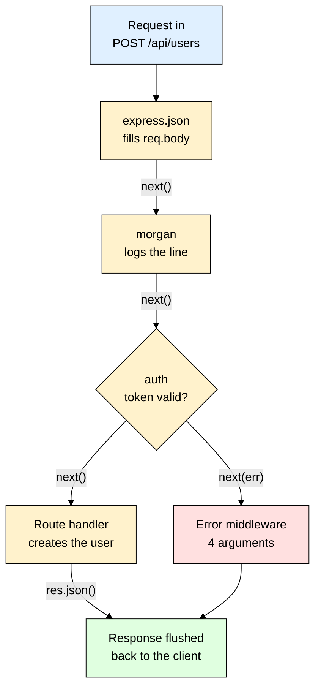
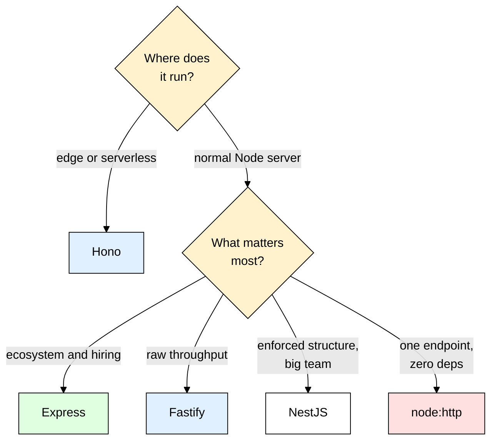

# express — The Web Framework Everything Else Sits On

> **Scope:** Express 5 (plus the Express 4 differences that still bite you) for building HTTP APIs in Node.js — middleware, routing, `Router()`, project structure, error handling.
> **Level:** Beginner + practical.
> **New to Node tooling?** Read [[nodemon]] and [[dotenv]] first — every example below assumes auto-restart and environment variables are already sorted.

---

## 1. ELI5: What is express?

You decided to build an API. Node already ships an HTTP server, so you write this:

```js
http.createServer((req, res) => {
  if (req.method === "GET" && req.url === "/users") { /* ... */ }
  else if (req.method === "POST" && req.url === "/users") { /* ... */ } // ...and 38 more
  // now parse the JSON body, split the query string, pull "42" out of /users/42 — yourself
}).listen(3000);
```

Ten routes in, that `if/else` is 300 lines of string slicing and you still haven't handled a 404. **Express** is the **conveyor belt behind an airport check-in desk**. A bag (the request) drops on one end and rolls past a line of stations: a scanner, a weight check, a security officer, a label printer. Each station gets the same bag, does one job, and pushes it along — or pulls it off the belt entirely ("rejected"). You never rewrite the belt per bag; you decide **which stations sit on it, in what order**. That ordered line of stations is the whole framework.

> **Type:** npm package — a minimal, unopinionated HTTP framework for Node.js
> **Core promise:** Turn one giant request-handling `if/else` into an ordered pipeline of small functions, and hand you `req`/`res` objects that already did the boring parsing.


---

## 2. Why Does express Exist? (The Problem It Solves)

One JSON `POST` endpoint written against raw `node:http` — nothing hidden:

```js
import http from "node:http";
http.createServer((req, res) => {
  const [path] = req.url.split("?"); // req.url still carries the query string
  if (req.method === "POST" && path === "/users") {
    let raw = "";
    req.on("data", (chunk) => { raw += chunk; }); // bodies arrive as a stream of chunks
    req.on("end", () => {
      let body;
      try { body = JSON.parse(raw); } // malformed JSON throws — you catch it yourself
      catch { return res.writeHead(400).end('{"error":"Invalid JSON"}'); }
      res.writeHead(201, { "Content-Type": "application/json" });
      res.end(JSON.stringify({ id: 1, email: body.email }));
    });
    return;
  }
  res.writeHead(404).end('{"error":"Not found"}'); // every unmatched request lands here
}).listen(3000);
```

That's ~20 lines for **one** endpoint. Now add auth, logging, CORS, and `/users/:id`.

| The old way (raw `node:http`) | With Express |
|---|---|
| Match method + URL with string comparisons | `app.post("/users", handler)` — method and path *are* the API |
| `/users/42` → slice the string and hope | `app.get("/users/:id")` → `req.params.id` |
| `?page=2&limit=10` → parse the query string yourself | `req.query.page` is already there |
| Buffer the body stream, `JSON.parse`, catch parse errors | `app.use(express.json())` once → `req.body` everywhere |
| Auth and logging copy-pasted into every branch | `app.use()` once — every later route inherits it |
| Status + headers + `JSON.stringify` by hand, and a thrown error crashes the process | `res.status(201).json({ ... })`, and one 4-argument error middleware catches everything |

Express is deliberately **thin** — routing, middleware, nicer `req`/`res`, and that's it. Databases ([[mongoose]]), validation ([[zod]]), security headers ([[helmet]]), rate limits ([[express_rate_limit]]) are separate packages you bolt on. That's why everything else sits on it.

---

## 3. Installing & Basic Usage

```bash
npm install express # express@5 is today's "latest" and needs Node 18+.
# Legacy codebase? npm install express@4 — differences are flagged throughout this file.
```

Add `"type": "module"` to `package.json`, then the smallest app that actually runs:

```js
// app.js
import express from "express";

const app = express(); // an app is really just a function (req, res) Node can call
app.get("/", (req, res) => res.send("Hello from Express")); // sets 200 + Content-Type for you
app.listen(3000, () => console.log("http://localhost:3000"));
```

### CommonJS version

```js
// Same app, older module system — most tutorials and legacy repos look like this
const express = require("express");
const app = express();
app.get("/", (req, res) => res.send("Hello from Express"));
app.listen(3000);
```

### Express example

The three things you touch every day — a body parser, a route param, a JSON response:

```js
// app.js continued. `User` is whatever your data layer exposes — see [[mongoose]].
app.use(express.json()); // MUST come before any route that reads req.body

app.get("/users/:id", async (req, res) => {
  const user = await User.findById(req.params.id); // params are ALWAYS strings, never numbers
  if (!user) return res.status(404).json({ error: "User not found" }); // note the `return`
  res.json(user);
});

app.post("/users", async (req, res) => {
  res.status(201).json(await User.create(req.body)); // status first, then body
});
```

That's the entire mental model — an Express app is an **ordered list of functions** that each get a shot at the same request, and the first one to send a response ends the story.

---

## 4. The Middleware Pipeline — The One Concept That Matters

If you learn one thing about Express, learn this. **Middleware** is any function shaped `(req, res, next)`. Express keeps them in an array in registration order and walks that array for every request.

```js
import { randomUUID } from "node:crypto";

app.use((req, res, next) => {
  req.requestId = randomUUID(); // anything you attach to req flows downstream
  next();                       // hand the request to the NEXT function in the stack
});
```

Every middleware has exactly **three** legal moves — and must make exactly one of them:

| Move | Meaning | Example |
|---|---|---|
| `next()` | "Done, pass it along" | logger, body parser |
| Send a response | "This request ends here" | route handler, a 401 from auth |
| `next(err)` | "Broken — skip to the error handler" | auth failure, DB failure |

Doing **none** of them is the classic beginner bug; doing **two** is the other one:

```js
app.use((req, res, next) => {
  console.log("checking auth");
  // ❌ forgot next() — no error, no response, no crash. The client hangs until it times out.
});

app.use((req, res, next) => {
  if (!req.headers.authorization) res.status(401).json({ error: "No token" });
  next(); // ❌ runs even after responding → "Cannot set headers after they are sent"
});
// ✅ the fix, every time: `return res.status(401).json(...)` — return the moment you respond
```

### Order of `app.use()` IS the program

No config file, no priority numbers, no dependency graph — the order you write the lines is the order they run. Put `express.json()` below your routes and `req.body` is `undefined` in all of them. Put [[cors]] below your routes and every browser preflight fails. Put your logger ([[winston_morgan]]) below them and it never sees the requests you care about. Put your 404 handler above them and **everything** 404s.

```js
// imports omitted — helmet, cors, morgan and rateLimit are each a separate package
app.use(helmet());                 // 1. security headers first — cheap, applies to everything
app.use(cors({ origin: "..." }));  // 2. CORS before anything that can reject the request
app.use(express.json());           // 3. parse bodies before routes need them
app.use(morgan("dev"));            // 4. request logging
app.use("/api/users", userRoutes); // 5. your actual routes
app.use(notFound);                 // 6. nothing matched → 404
app.use(errorHandler);             // 7. LAST — 4 args, catches everything thrown above it
```

Because `next()` hands control back once the downstream stack finishes, you can also run code on the way *out*. That is how timing middleware works: record `Date.now()`, register `res.on("finish", ...)` — which fires when the response is fully flushed to the socket — then call `next()`.



Scope any middleware by giving it a path, or by attaching it to a single route:

```js
app.use(logger);                          // every request
app.use("/api", express.json());          // only URLs under /api
app.get("/admin", requireAdmin, handler); // only this route — per-route middleware
```

---

## 5. Routing — Paths, Params, Queries, Bodies

```js
app.get("/users", listUsers);         // read
app.post("/users", createUser);       // create
app.put("/users/:id", replaceUser);   // full replace, and app.patch() for partial updates
app.delete("/users/:id", deleteUser); // and app.all() for any method
```

### `app.use` vs `app.get` — the difference beginners miss

| | `app.use(path, fn)` | `app.get(path, fn)` |
|---|---|---|
| HTTP methods | **All** of them | GET only |
| Path matching | **Prefix** — `/api` also matches `/api/users/42` | Full path match (params allowed) |
| Typical use | Mounting middleware and routers (`req.url` is stripped of the prefix inside) | Defining one endpoint |

That prefix behaviour is exactly why `app.use("/api/users", userRoutes)` works — inside the router, paths are written relative to the mount point.

### The three places data arrives from

```js
// Route "/users/:userId/posts", hit by POST /users/42/posts?page=2 with a JSON body
req.params.userId; // "42"    — from the path. ALWAYS a string, even for numeric ids
req.query.page;    // "2"     — from the query string, also a string
req.body;          // { ... } — only if a body parser ran first
```

Because they are strings, `req.params.id === 42` is always `false` — convert with `Number()`, or better, coerce and validate the whole object with [[zod]].

### Why `express.json()` is required

Node delivers the body as a **stream of chunks**, not a string — nothing parses it unless you say so. `express.json()` buffers those chunks, checks the `Content-Type` is `application/json`, parses it, and assigns the result to `req.body`. Without it, `req.body` is `undefined`.

```js
app.use(express.json({ limit: "100kb" }));       // JSON bodies, capped size
app.use(express.urlencoded({ extended: true })); // HTML form posts
```

> ⚠️ Uploads are `multipart/form-data` — neither parser touches those, that is [[multer]]'s job. And `express.json()` only parses when the request actually carries `Content-Type: application/json`: a client that posts JSON without that header gets an empty `req.body`, and you'll blame your server for an hour.

### Matching order, and 404s

Express walks routes **top to bottom and stops at the first match**, and there's no "404 config" — if a request reaches the bottom of the stack unanswered, nothing matched, so you put a catch-all there:

```js
app.get("/users/:id", getUser); // ❌ matches "/users/me" first, with id = "me"
app.get("/users/me", getMe);    // unreachable — declare literal paths ABOVE parameterised ones

// AFTER every route. No path = matches everything that got this far.
app.use((req, res) => res.status(404).json({ error: `No route for ${req.originalUrl}` }));
```

> ⚠️ Express 5 changed path syntax (path-to-regexp v8): a bare `app.get("*")` now **throws at startup**. Wildcards must be named — `app.get("/*splat", handler)` — and optional segments use `/users{/:id}` instead of `/users/:id?`. The `app.use()` form above works identically in Express 4 and 5.

---

## 6. `req` and `res` — The Objects You Actually Touch

Express doesn't replace Node's `IncomingMessage`/`ServerResponse`, it **decorates** them — everything Node gave you is still there, plus a convenience layer.

| Response method | What it does |
|---|---|
| `res.json(obj)` | Serializes to JSON, sets `Content-Type: application/json` — **the default for an API** |
| `res.status(code)` | Sets status, returns `res` so you can chain: `res.status(201).json(...)` |
| `res.send(body)` | Sniffs the type — string → HTML, object → JSON, Buffer → binary |
| `res.sendStatus(code)` | Sets status **and** sends the status text as the body — `res.sendStatus(403)` sends `"Forbidden"` |
| `res.redirect(url)` | 302 by default; `res.redirect(301, url)` for permanent |
| `res.set(name, value)` | Sets a header — and `res.sendFile(absPath)` streams a file |

Two rules: **status before body**, and **exactly one response per request**.

> ⚠️ Express 5 dropped the old status-code overloads. `res.send(200)` and `res.json(500, obj)` are gone — use `res.sendStatus(200)` and `res.status(500).json(obj)`. Code copied from 2015 blog posts breaks here.

```js
req.path;        // "/users/42"     — path only, no query string
req.originalUrl; // "/users/42?x=1" — full URL as received, survives router mounting
req.get("Host"); // case-insensitive header lookup (req.headers is lowercase-keyed)
res.locals;      // per-request scratch space you can safely write to
```

> ⚠️ In Express 5, `req.query` is a **getter** — you cannot assign to it. The common [[zod]] pattern `req.query = validated` throws. Put the sanitised result on `res.locals` or a custom property instead.

### Serving static files

```js
app.use(express.static("public"));                              // public/logo.png -> /logo.png
app.use("/static", express.static("public", { maxAge: "1d" })); // or mounted, with caching
```

It is ordinary middleware: file exists → it responds and the chain stops; no file → it calls `next()` and your routes get a turn. Mount it **above** your API routes so a static hit never runs your auth middleware.

### The request lifecycle, end to end

1. Node's HTTP server accepts the connection, parses headers, and calls the Express app as its request listener — Express then decorates `req`/`res` and walks the middleware stack from index 0, with `next()` advancing the index.
2. When a **route** matches, Express fills `req.params` from the path pattern and runs its handlers.
3. `res.json()` writes headers + body to the socket, and `res` emits `"finish"`.
4. Stack empties with no response → Express's built-in final handler sends a bare 404. Any `next(err)` instead **skips every remaining normal middleware** and jumps to the first 4-argument error handler.

---

## 7. `express.Router()` and Real Folder Structure

One `app.js` with 40 routes is unmaintainable. `express.Router()` gives you a **mini-app** — its own middleware stack and routes — that you mount onto the main app. Models come from [[mongoose]], env vars from [[dotenv]].

```
src/
├── app.js                          # middleware + routes. NO listen()
├── server.js                       # imports app, connects DB, calls listen()
├── routes/user.routes.js           # URL shapes only
├── controllers/user.controller.js  # what each route actually does
├── models/user.model.js            # the Mongoose schema
└── middlewares/{auth,error}.middleware.js, utils/{AppError,asyncHandler}.js
```

```js
// routes/user.routes.js — paths here are RELATIVE to where the router is mounted
import { Router } from "express";
import { listUsers, getUser } from "../controllers/user.controller.js";
import { requireAuth } from "../middlewares/auth.middleware.js";
import { asyncHandler } from "../utils/asyncHandler.js";

const router = Router();
router.use(requireAuth); // applies to every route in THIS router only
router.get("/", asyncHandler(listUsers));
router.get("/:id", asyncHandler(getUser)); // final URL: GET /api/users/:id

export default router;
```

```js
// controllers/user.controller.js — no idea which URL it lives on. That is the point.
import User from "../models/user.model.js";
import { AppError } from "../utils/AppError.js";
export async function getUser(req, res) {
  const user = await User.findById(req.params.id).lean(); // lean() = plain object, faster
  if (!user) throw new AppError("User not found", 404); // thrown, not formatted here — see §8
  res.json({ data: user });
}
```

```js
// app.js — assembles everything, exports the app. Deliberately does NOT listen.
import express from "express";
import userRoutes from "./routes/user.routes.js";
import { errorHandler } from "./middlewares/error.middleware.js";

const app = express();
app.use(express.json({ limit: "100kb" }));
app.get("/health", (req, res) => res.json({ status: "ok" })); // for load balancers
app.use("/api/users", userRoutes); // every route in the router inherits this prefix
app.use((req, res) => res.status(404).json({ error: "Not found" }));
app.use(errorHandler); // always last

export default app;
```

```js
// server.js — the only file that touches the network or the database
import "dotenv/config"; // loads .env before anything else reads process.env
import mongoose from "mongoose";
import app from "./app.js";

await mongoose.connect(process.env.MONGO_URI); // fail fast: no DB, no server
app.listen(process.env.PORT || 3000);
```

### Why split `app.js` from `server.js`?

Because **tests must not open a port**. [[jest_supertest]] takes your `app` object and drives requests straight through the middleware stack in memory:

```js
// tests/users.test.js
import request from "supertest";
import app from "../src/app.js"; // app, NOT server — nothing binds a socket

it("lists users", async () => {
  const res = await request(app).get("/api/users").set("Authorization", "Bearer test");
  expect(res.status).toBe(200);
});
```

If `app.js` called `listen()` at import time, every test file would fight over port 3000. That one-line separation is the entire reason for the split.

---

## 8. Error Handling — The 4-Argument Middleware

An **error middleware** is normal middleware with one extra parameter at the front:

```js
// middlewares/error.middleware.js
export function errorHandler(err, req, res, next) { // FOUR args — non-negotiable
  const statusCode = err.statusCode || 500;
  if (statusCode >= 500) console.error(err); // full trace to your logs, never to the client
  res.status(statusCode).json({
    error: err.isOperational ? err.message : "Internal server error",
    ...(process.env.NODE_ENV !== "production" && { stack: err.stack }),
  });
}
```

### Why it MUST have exactly 4 arguments

Express inspects `fn.length` — the declared parameter count — to decide what a function is. Three parameters → normal middleware. Four → error middleware. There is no flag and no registration API, just arity, so declare `next` even when you don't use it (and silence the unused-arg rule from [[eslint_prettier]]). This one silently never runs:

```js
app.use((err, req, res) => { /* ... */ }); // ❌ length 3 → registered as normal middleware
```

### The async-throw trap

The single most common Express bug in the wild:

```js
// ❌ In Express 4 the promise rejects and nothing catches it: no response is sent,
// the client hangs, and you get an UnhandledPromiseRejection in the logs.
app.get("/users/:id", async (req, res) => {
  res.json(await User.findById(req.params.id)); // throws on a malformed ObjectId
});
```

Express 4 wraps handler calls in a *synchronous* `try/catch`. An `async` function returns immediately with a pending promise, so by the time it rejects, that `try` block is long gone. The classic fix turns rejections into `next(err)`:

```js
// utils/asyncHandler.js — Promise.resolve() normalises sync throws and async rejections
export const asyncHandler = (fn) => (req, res, next) =>
  Promise.resolve(fn(req, res, next)).catch(next);

app.get("/users/:id", asyncHandler(async (req, res) => {
  const user = await User.findById(req.params.id);
  if (!user) throw new AppError("User not found", 404); // ✅ throw freely, the wrapper forwards it
  res.json(user);
}));
```

> **Express 5 fixes this.** A handler returning a rejected promise is forwarded to your error middleware automatically, so `asyncHandler` becomes optional. It still only covers promises Express can see — an error thrown inside a bare `setTimeout` callback escapes to `process.on("uncaughtException")` in every version.

### A custom error class

```js
// utils/AppError.js
export class AppError extends Error {
  constructor(message, statusCode = 500) {
    super(message);
    this.statusCode = statusCode;
    // "operational" = an expected failure such as bad input or a missing row, so the message
    // is safe to show a user — unlike a programmer bug, whose message can leak internals
    this.isOperational = true;
    Error.captureStackTrace(this, this.constructor); // drop the constructor from the trace
  }
}
```

Now every layer just throws and one handler decides the wire format — change your error JSON shape in one file and the whole API follows. Register no error handler at all and Express falls back to its built-in final handler, which — outside `NODE_ENV=production` — returns an HTML page containing the full stack trace to the client.

---

## 9. TypeScript Version

```bash
npm install express && npm install --save-dev typescript tsx @types/node @types/express
# @types/express v5 matches express v5 — mismatched majors give baffling type errors
```

```ts
// src/types/express.d.ts — teach Express about properties your middleware attaches
declare global {
  // set by requireAuth below, read by every controller downstream
  namespace Express { interface Request { user?: { id: string; email: string } } }
}
export {}; // makes this a module so the global augmentation actually applies
```

```ts
// The same pieces, typed: auth middleware, controller, async wrapper, error handler
import type { Request, Response, NextFunction, ErrorRequestHandler } from "express";
import jwt from "jsonwebtoken"; // install @types/jsonwebtoken too — see [[jsonwebtoken]]

export function requireAuth(req: Request, res: Response, next: NextFunction): void {
  const header = req.get("authorization");
  // `void` discards the returned res object — a handler must return void, not Response
  if (!header?.startsWith("Bearer ")) return void res.status(401).json({ error: "No token" });
  req.user = jwt.verify(header.slice(7), process.env.JWT_SECRET!) as Request["user"];
  next();
}
// Typed params and body: Request<Params, ResBody, ReqBody, ReqQuery> — fill in what you read,
// e.g. (req: Request<{ id: string }, unknown, CreateUserBody>) types req.params.id and req.body

// ErrorRequestHandler enforces the 4-argument shape at compile time; its sibling type
// RequestHandler types the asyncHandler wrapper from section 8 with no generics needed
export const errorHandler: ErrorRequestHandler = (err, req, res, next) => {
  const status = typeof err.statusCode === "number" ? err.statusCode : 500;
  res.status(status).json({ error: status >= 500 ? "Internal server error" : err.message });
};
```

**Rule of thumb:** type the request generics only where you actually read `params`/`body`. Pair a [[zod]] schema with `z.infer` so the runtime validation and the TypeScript type come from one source instead of drifting apart.

---

## 10. Production Setup

```js
// app.js (production shape). Behind nginx or a cloud load balancer, req.ip is the PROXY's
// IP unless you say this — "1" = trust one hop. Wrong here breaks IP rate limiting.
app.set("trust proxy", 1);
app.disable("x-powered-by");               // stop advertising "Express" to scanners
app.use(helmet());                         // security headers
app.use(cors({ origin: process.env.CLIENT_URL, credentials: true }));
app.use(compression());                    // gzip (skip if your proxy already does it)
app.use(express.json({ limit: "100kb" })); // cap body size — a real, cheap defense
app.use(morgan("combined"));               // request logs
app.use("/api", rateLimit({ windowMs: 60_000, limit: 100 }));
```

Each of those layers has its own file: [[helmet]], [[cors]], [[winston_morgan]], [[express_rate_limit]].

```js
// server.js — Docker/Kubernetes/pm2 send SIGTERM first and SIGKILL seconds later. Without
// this, every request in flight at deploy time gets a connection reset.
const server = app.listen(process.env.PORT || 3000);
process.on("SIGTERM", () => {
  server.close(async () => {           // drain existing connections, refuse new ones
    await mongoose.connection.close();  // then close the DB pool
    process.exit(0);
  });
});
```

| Concern | What to do |
|---|---|
| Config | No hardcoded secrets — `process.env` via [[dotenv]] locally, real env vars in prod |
| Process management | Run under [[pm2]] or a container orchestrator so crashes restart and logs get collected |
| `NODE_ENV=production` | Express caches view templates and skips verbose error output when this is set |
| Error visibility | Ship errors to a log aggregator inside `errorHandler` — `console.error` on a dead container is lost |
| Timeouts | Set `server.requestTimeout` / `server.headersTimeout` if clients can be slow or hostile |

---

## 11. Common Gotchas & Best Practices

| Gotcha | Fix |
|---|---|
| **Request hangs forever, nothing in the logs** | A middleware forgot `next()` and never responded. Every path through every middleware must do exactly one of: `next()`, `next(err)`, or send a response. |
| **`Cannot set headers after they are sent to the client`** | You responded twice — almost always a missing `return` before an early `res.status(...).json(...)`, so execution fell through to a second response. |
| **`req.body` is `undefined`** | `express.json()` is missing, registered *after* the route, or the client sent no `Content-Type: application/json`. File uploads are `multipart/form-data` — that needs [[multer]], not a JSON parser. |
| **Error middleware never fires** | It has 3 parameters instead of 4 (Express dispatches on `fn.length`), or it's registered above the routes. It must be the last `app.use()`. |
| **Async handler throws and the client hangs (Express 4)** | Wrap handlers in `asyncHandler`, or move to Express 5 where rejected promises reach the error handler automatically. |
| **`app.get("*")` crashes at startup after upgrading to Express 5** | path-to-regexp 8 requires named wildcards. Use `app.use(...)` for the catch-all 404, or `app.get("/*splat", ...)`; optional params become `/users{/:id}`. |
| **`/users/me` returns "user not found"** | A `/users/:id` route is declared above it and matched first with `id = "me"`. Declare literal paths before parameterised ones — matching is strictly top-to-bottom. |
| **Rate limits or IP logs show one IP for everyone** | You're behind a proxy without `app.set("trust proxy", 1)`, so `req.ip` is the load balancer's address, not the client's. |

---

## 12. Alternatives — When express Isn't the Best Fit

| Framework | What it is | Best for |
|---|---|---|
| **Express** | The minimal, unopinionated standard. Enormous middleware ecosystem; every tutorial and Stack Overflow answer assumes it. | **Default choice.** Any REST API, any team, anything you want to hire for or search answers about. |
| **Fastify** | Same middleware idea, faster router, schema-based JSON validation and serialization built in, real plugin encapsulation. | High-throughput JSON APIs where benchmarks matter, or when you want validation baked into the route definition. |
| **Hono** | Tiny, built on Web-standard `Request`/`Response`; runs unchanged on Node, Bun, Deno, Cloudflare Workers, Lambda. | Edge and serverless deploys, or when cold-start size and runtime portability matter. |
| **NestJS** | Opinionated architecture layered on Express or Fastify — decorators, modules, dependency injection. | Large teams and big codebases that want structure enforced by the framework, not by convention. |
| **Koa** | From the original Express authors — elegant `ctx`-based async middleware. | Rarely the pick for new work: much smaller ecosystem, largely superseded by Fastify and Hono. |
| **raw `node:http`** | Zero dependencies. You write routing and parsing yourself. | A one-route webhook receiver, a health-check sidecar, or learning what a framework does for you. |

**Rule of thumb:** building a normal backend API and want the biggest ecosystem and the most answers to your questions? Express — boring is a feature. Profiled it and the framework is genuinely the bottleneck, or you want schema-driven validation built in? Fastify. Deploying to Workers/Bun/Deno or cold-start-sensitive Lambda? Hono. Ten engineers and a hundred modules? NestJS. One endpoint, zero deps? `node:http` is fine.



---

## 13. Interview Questions

**Q: What exactly is middleware in Express?**
A: Any function shaped `(req, res, next)` that Express stores in an ordered stack and runs for matching requests. Each one can modify `req`/`res`, end the request by responding, pass control downstream with `next()`, or jump to the error handler with `next(err)`. Route handlers are just middleware that happen to sit last in their chain — there's no separate concept.

**Q: Why must an error-handling middleware take four arguments?**
A: Express identifies error handlers by reading `fn.length`, the declared parameter count. Four means "error handler", anything else is ordinary middleware. So a handler written `(err, req, res)` gets registered as normal middleware that receives the *request* in its `err` slot and never sees an error at all.

**Q: Why doesn't Express 4 catch errors thrown inside an `async` route handler?**
A: Express 4 calls handlers inside a synchronous `try/catch`. An `async` function returns a pending promise immediately, so the `try` block has already exited by the time the promise rejects — the rejection escapes and the request hangs. The fix is a wrapper like `Promise.resolve(fn(req, res, next)).catch(next)`; Express 5 does this internally.

**Q: What's the difference between `app.use()` and `app.get()`?**
A: `app.use()` matches **all** HTTP methods and treats its path as a **prefix**, so `app.use("/api", ...)` also matches `/api/users/42`. `app.get()` matches GET only and needs the full path to match the pattern. That prefix behaviour is what lets `app.use("/api/users", router)` mount an entire router under one path.

**Q: Why do people split `app.js` from `server.js`?**
A: So the app can be built without binding a port. Test runners import `app` and hand it to Supertest, which drives requests through the middleware stack in memory — no port conflicts, no cleanup, fast tests. `server.js` then becomes the only file that connects to the database, calls `listen()`, and handles graceful shutdown.

**Q: Is Express fast enough for production?**
A: For almost every real app, yes — the framework's per-request overhead is microseconds while your database query is milliseconds. Fastify wins synthetic benchmarks by a few times, but that gap only becomes your bottleneck at very high request rates on very cheap handlers. Fix your queries, indexes, and caching (see [[ioredis]]) long before you swap frameworks.

**Q: Why isn't `req.body` populated by default?**
A: Node delivers the body as a stream of chunks, and Express will not buffer it for you until you opt in — it cannot know whether the payload is JSON, a form, a two-gigabyte upload, or a stream you want to pipe straight to disk. `express.json()` opts you in for `application/json`, `express.urlencoded()` for form posts, and [[multer]] for `multipart/form-data`. If the parser is missing, registered below the route, or the client omitted the `Content-Type` header, `req.body` stays `undefined`.

**Q: What actually changed between Express 4 and Express 5?**
A: Four things bite in practice. Rejected promises returned by `async` handlers now reach your error middleware automatically, so `asyncHandler` becomes optional. Path matching moved to path-to-regexp 8, so a bare `app.get("*")` throws at startup, wildcards must be named as `/*splat`, and optional segments are written `/users{/:id}`. `req.query` became a getter you cannot assign to. And the old status-code overloads such as `res.send(200)` and `res.json(500, obj)` were removed in favour of `res.sendStatus(200)` and `res.status(500).json(obj)`. Express 5 also requires Node 18 or newer.

---

## 14. Quick Cheat Sheet

```bash
npm install express && npm install --save-dev nodemon @types/express
```

```js
// Minimal app
import express from "express";
const app = express();
app.use(express.json());
app.get("/", (req, res) => res.json({ ok: true }));
app.listen(3000);

// Middleware: exactly one move per request — never zero, never two
app.use((req, res, next) => {
  if (!req.get("authorization")) return res.status(401).json({ error: "No token" }); // respond
  if (req.path === "/blocked") return next(new AppError("Forbidden", 403)); // to error handler
  next(); // pass downstream
});
```

```js
// The canonical order — this order IS the program
app.use(helmet(), cors(), express.json(), express.static("public"));
app.use("/api/users", userRoutes);
app.use((req, res) => res.status(404).json({ error: "Not found" }));   // 404: no path, near-last
app.use((err, req, res, next) => res.status(err.statusCode || 500).json({ error: err.message }));

// Async safety (required in Express 4, optional in Express 5)
const asyncHandler = (fn) => (req, res, next) =>
  Promise.resolve(fn(req, res, next)).catch(next);
```

**Mental model to remember:**
> Express is an ordered pipeline of `(req, res, next)` functions — the order you register them *is* your program, and every request either gets a response from one of them or falls through to your 404 and error handlers at the bottom. Keep `app.js` free of `listen()` so [[jest_supertest]] can drive it in memory, and treat Express as the thin base you bolt real capability onto: [[helmet]] and [[cors]] for safety, [[zod]] for input, [[mongoose]] for data, [[winston_morgan]] for visibility.
