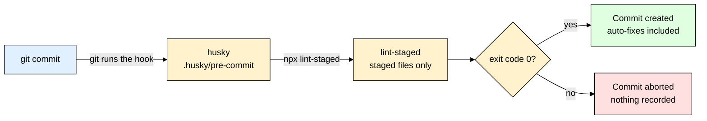
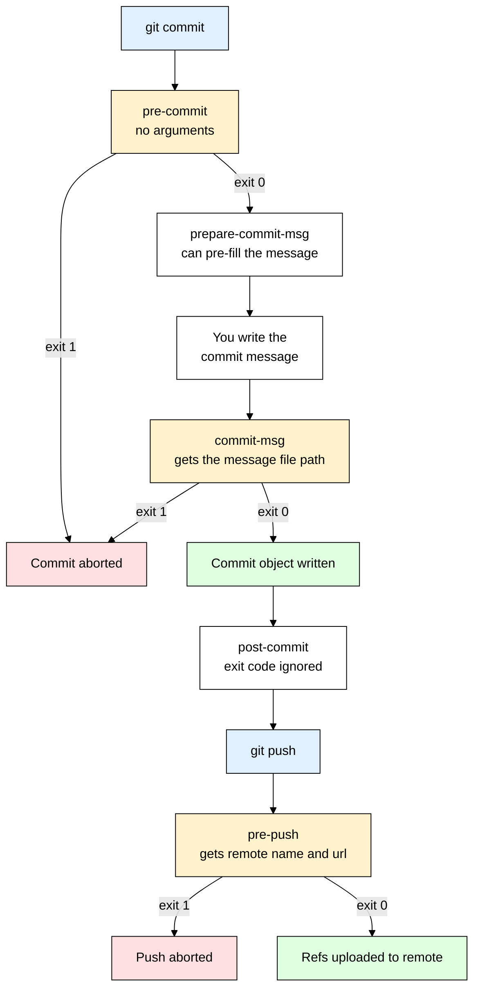
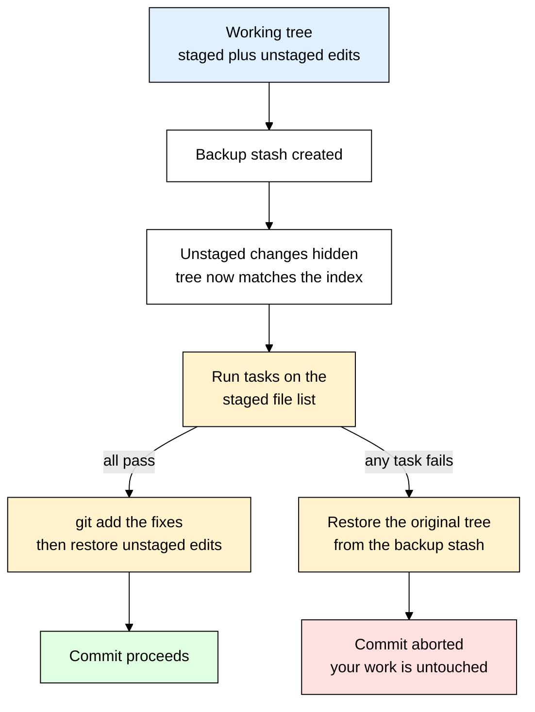
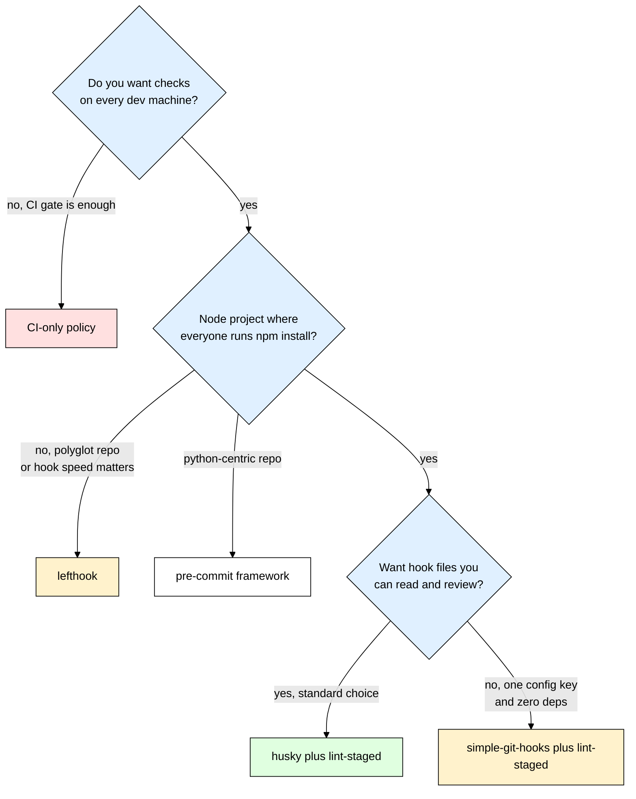

# husky + lint-staged — Making Bad Commits Impossible

> **Scope:** Git hooks in a Node.js project — `husky` (installs and shares the hooks with your team) and `lint-staged` (runs your tools on *only* the staged files). Covers pre-commit, commit-msg, pre-push, commitlint, CI parity, and the alternatives.
> **Level:** Beginner + practical.
> **New to linting?** Read [[eslint_prettier]] first — husky is only the trigger, ESLint and Prettier are the things being triggered.

---

## 1. ELI5: What is husky + lint-staged?

You finish a feature, commit, push, open a PR — and ninety seconds later CI is red. Not because the feature is broken, but because you left a `console.log` in, an import is unused, and one file has tabs where the rest of the repo has spaces. So you fix it, commit "fix lint", push, and wait another ninety seconds — while a reviewer leaves four comments about formatting instead of about your actual logic. Multiply that by five developers and half the commits in the repo are noise and every diff is polluted by whitespace churn.

Think of it like **airport security**. The gate is the only way onto the plane, and there is a scanner in front of it — you cannot walk past. Crucially, the scanner only looks at **the bag you are actually carrying**, not at everything you own back home. That is the whole idea: `husky` **bolts the checkpoint onto the gate** (git's commit machinery) for every developer on the team, and `lint-staged` makes sure only **the bag in your hand** (the files in the staging area) goes through the X-ray. If something is wrong, you don't board — the commit simply never happens.

> **Type:** two npm dev dependencies that are almost always installed as a pair.
> **Core promise:** your project's quality checks run automatically, on every developer's machine, *before* a bad commit can exist — and they only inspect the files you actually touched.



---

## 2. Why Does husky + lint-staged Exist? (The Problem It Solves)

Life without them is a **README bullet nobody reads**:

```bash
# "Before you commit, please run:" — the honor system
npm run lint
npm test
git commit -m "add checkout flow"

# You will remember that for about three days. So someone discovers git hooks:
echo 'npm run lint' > .git/hooks/pre-commit && chmod +x .git/hooks/pre-commit
```

That last line works beautifully — on exactly one laptop. Here is the sentence that explains why husky exists at all:

> ⚠️ **`.git/hooks/` is not part of the repository.** It lives *inside* the `.git` folder, it is never staged, never committed, never pushed, and `git clone` does not bring it. A hook you write there protects you and literally nobody else.

That is the gap. `husky` moves the hook scripts into a normal, committed `.husky/` directory and tells git to look there instead. `lint-staged` then solves the second problem — that running the linter over the *whole repo* on every commit is slow and fails on files you never touched.

| Without husky + lint-staged | With husky + lint-staged |
|---|---|
| Hooks live in `.git/hooks`, invisible to teammates | Hooks live in `.husky/`, committed and reviewed like any other file |
| New teammate has to be *told* about the process | `npm install` wires the hooks up automatically |
| CI is the first thing that tells you a file is unformatted (~2 min feedback) | Your terminal tells you in ~2 seconds, before the commit exists |
| `eslint .` lints 4,000 files to check the 2 you changed | Only staged files are passed to the linter |
| Inherited lint errors in old files block your unrelated commit | Old files are ignored until someone actually edits them |
| PR diffs full of whitespace churn and "fix lint" commits | The formatting fix is folded into the same commit, silently |
| Commit messages are `asdf`, `fix`, `fix2`, `final fix` | `commit-msg` hook enforces a real convention |

---

## 3. Installing & Basic Usage

```bash
npm install --save-dev husky lint-staged
npx husky init
```

That second command is the whole setup. `husky init` does exactly three things:

1. Creates a `.husky/` directory with a starter `.husky/pre-commit` file (containing `npm test`).
2. Adds `"prepare": "husky"` to your `package.json` scripts — npm runs `prepare` automatically after every `npm install`, so **teammates get the hooks without doing anything**.
3. Runs `git config core.hooksPath .husky/_`, which is how git is told to stop looking in `.git/hooks`.

Now replace the starter hook and add the lint-staged config:

```sh
# .husky/pre-commit — a plain shell script, nothing more
npx lint-staged
```

```json
{
  "scripts": {
    "prepare": "husky"
  },
  "lint-staged": {
    "*.{js,jsx,ts,tsx}": ["eslint --fix --max-warnings=0", "prettier --write"],
    "*.{json,md,yml,yaml,css,html}": ["prettier --write"]
  }
}
```

Commit something with a lint error and watch it get blocked:

```bash
git add src/routes/users.js
git commit -m "add user route"
# eslint --fix --max-warnings=0 found 1 problem
# husky - pre-commit script failed (code 1)
```

### CommonJS version

The config can also live in its own file. ESM projects (`"type": "module"` in `package.json`) use `lint-staged.config.js` with `export default`; everyone else uses the `.cjs` extension so Node parses it as CommonJS no matter what:

```js
// lint-staged.config.cjs
module.exports = {
  "*.{js,ts}": ["eslint --fix", "prettier --write"],
  "*.{json,md}": "prettier --write", // a single command can be a plain string
};
```

### Express example

A typical Express + Mongoose API, fully wired:

```
my-api/
├─ .husky/
│  ├─ pre-commit      # committed — npx lint-staged
│  ├─ commit-msg      # committed — commitlint
│  ├─ pre-push        # committed — npm test
│  └─ _/              # generated by husky, gitignored automatically
├─ src/               # server.js, models/User.js, routes/users.js
└─ package.json
```

Scope the globs to where your source actually lives, so a stray staged file in `scripts/` or `docs/` never triggers ESLint:

```json
{
  "lint-staged": {
    "src/**/*.js": ["eslint --fix --max-warnings=0", "prettier --write"],
    "*.{json,md,yml}": ["prettier --write"]
  }
}
```

That's the entire mental model — git fires a shell script at a defined moment, the script runs `lint-staged`, `lint-staged` runs your tools on just the staged files and re-stages whatever they fixed, and a **non-zero exit code kills the commit**.

---

## 4. What a Git Hook Actually Is

A git hook is not a special file format or a plugin system. It is **an executable script that git runs at a defined moment**, judged purely by its exit code: **exit 0** and git carries on, **any non-zero exit** and git aborts the whole operation — no commit object is written, no push happens.

Every repository already ships a folder full of disabled examples — drop the `.sample` extension, make the file executable, and it runs:

```bash
ls .git/hooks
# applypatch-msg.sample  commit-msg.sample  pre-commit.sample  pre-push.sample ...

git ls-files .git/hooks   # prints nothing — ever. .git/ is git's own storage,
                          # it is not tracked BY git, so your hook cannot be shared.

git config core.hooksPath .husky/_   # the escape hatch: "look in this committed folder"
```

That last line is genuinely all husky is doing at its core — plus generating the shim scripts inside `.husky/_` that forward each hook to the matching file you wrote in `.husky/`.

### Where each hook fires



| Hook | Fires | Arguments | Can it block? | What people actually put here |
|---|---|---|---|---|
| **`pre-commit`** | Before the message editor opens | none | **Yes** | `lint-staged`, secret scanning — the workhorse |
| `prepare-commit-msg` | Before the editor, message pre-filled | message file, source | Yes | Auto-inserting a ticket number from the branch name |
| **`commit-msg`** | After you write the message | `$1` = path to the message file | **Yes** | `commitlint` — enforce Conventional Commits |
| `post-commit` | After the commit exists | none | No — exit code ignored | Notifications, local bookkeeping |
| **`pre-push`** | On `git push`, before uploading | remote name, remote URL | **Yes** | The test suite, type-check, build |
| `post-merge` | After `git pull` merges | was-squash flag | No | Reminding you to run `npm install` |

**Rule of thumb:** if the hook must be able to *stop* you, it has to be one of the `pre-*` / `commit-msg` family. `post-*` hooks are informational only.

---

## 5. Setting Up husky Properly

### The `prepare` script is the important line

```json
{
  "scripts": {
    "prepare": "husky"
  }
}
```

`prepare` is a **built-in npm lifecycle script** — npm runs it automatically after `npm install` finishes in a local project. So a brand-new teammate does `git clone`, then `npm install`, and husky quietly sets `core.hooksPath` on the way past. They now have the hooks and were never told they existed. That is the entire value proposition; without this line husky is just a folder of scripts git isn't looking at.

### What a hook file looks like in husky v9+

```sh
# .husky/pre-commit
npx lint-staged
```

That is the complete file — one line. Tutorials that start the hook with `#!/usr/bin/env sh` and `. "$(dirname -- "$0")/_/husky.sh"` were written for husky v8; in v9 that boilerplate is **unnecessary and prints a deprecation warning** on every commit, and v10 removes it. Delete both lines.

It is still an ordinary shell script, so `&&` chains, `if` blocks and an early `exit 1` all work — section 8 uses that to block `.env` files before `lint-staged` even runs.

| Path | Committed? | Why |
|---|---|---|
| `.husky/pre-commit`, `.husky/commit-msg`, … | **Yes** | These are your hooks — the whole point is sharing them |
| `.husky/_/` | **No** | Generated by husky on install; it writes its own `.gitignore` containing `*` in there |
| `.git/hooks/` | Impossible | Not tracked by git, by design |

---

## 6. lint-staged — The Half That Actually Matters

husky gets a script to run. **lint-staged is what makes that script tolerable.** Skip it and your pre-commit hook looks like this:

```sh
# .husky/pre-commit — the naive version
npm run lint    # eslint .
```

Two things go wrong immediately. **It is slow** — ESLint on a 3,000-file repo takes 20-40 seconds, you commit ten times an hour, and you will delete this hook by Thursday. And **it fails on files you did not touch** — turn on a new rule and every legacy file lights up, so nobody can commit anything until someone does a giant repo-wide cleanup. The hook ends up punishing you for other people's code.

lint-staged fixes both by passing your tools **only the paths currently in the staging area**:

```json
{
  "lint-staged": {
    "*.{js,jsx,ts,tsx}": ["eslint --fix --max-warnings=0", "prettier --write"],
    "*.{json,md,yml,yaml,css,html}": ["prettier --write"]
  }
}
```

Read it as: *"for every staged file matching this glob, run these commands, in order, with the matching filenames appended."* If you staged `src/routes/users.js` and `README.md`, lint-staged literally runs:

```bash
eslint --fix --max-warnings=0 src/routes/users.js
prettier --write src/routes/users.js
prettier --write README.md
```

Then — this is the part beginners miss — **lint-staged runs `git add` on the files its tasks modified**, so the auto-fixes end up in the same commit. You get one clean commit instead of a commit followed by an "oops, formatting" commit.

### The stash: why your unstaged work is safe

Here is the subtle problem lint-staged solves. Suppose `users.js` has two changes: one you staged, one you're still working on and deliberately left unstaged. If lint-staged just ran Prettier on the file, it would reformat **both** changes and `git add` the whole thing — silently committing work you were not ready to commit.

So before running anything, lint-staged **creates a backup stash and hides all unstaged modifications**, leaving the working tree matching the index exactly:



Two consequences are worth internalizing. Your tools see **exactly what is being committed**, not whatever happens to be sitting in your editor — so a passing hook is a statement about the commit itself. And if a task fails the tree is restored with nothing lost; if a run is ever force-killed mid-way, the backup survives in `git stash list` and `git stash apply` brings it back.

### Ordering, parallelism, and commands that ignore filenames

- Commands **inside one array run sequentially** — that is why `eslint --fix` comes before `prettier --write`.
- Commands for **different glob keys run concurrently**. If two keys both match `*.ts`, two processes can write the same file at once. Fix: put them under one key.
- lint-staged **appends filenames** to every command, so tools that treat arguments differently break. `tsc --noEmit src/a.ts` silently ignores your `tsconfig.json`, and `jest src/a.ts` treats the path as a regex matched against *test* file paths, so it usually matches nothing. Use a **function value** to build the command yourself:

```js
// lint-staged.config.js
export default {
  // Array form: filenames are appended automatically — what you want for linters.
  "*.{js,ts}": ["eslint --fix --max-warnings=0", "prettier --write"],

  // Function form: YOU build the command, so YOU decide what gets appended.
  // Here: run only the tests that actually touch the staged files.
  "src/**/*.js": (files) =>
    `jest --bail --findRelatedTests --passWithNoTests ${files.join(" ")}`,
};
```

| Useful flag | What it does |
|---|---|
| `--verbose` | Print task output even on success — the first thing to reach for when debugging |
| `--concurrent false` | Run every task serially; useful when two tools fight over the same files |
| `--relative` | Pass paths relative to the config file instead of absolute — some tools need this |
| `--allow-empty` | Permit the commit even if the tasks reverted every staged change (rare, e.g. formatting-only commits) |
| `--no-stash` | Skip the backup stash. Faster, but a failed run leaves the tree modified — avoid |

---

## 7. Designing the Hook Set: pre-commit, commit-msg, pre-push

Everyone puts the full test suite in `pre-commit` once. It works for a week; then the suite hits 40 seconds and *every* commit costs 40 seconds, so people stop committing in small steps and start typing `--no-verify` out of muscle memory. **A hook that is annoying gets bypassed, and a bypassed hook protects nothing.**

**Rule of thumb:** `pre-commit` must feel instant (under ~5 seconds). Anything slower moves to `pre-push` or CI.

| Hook | Time budget | Put here | Do not put here |
|---|---|---|---|
| `pre-commit` | < 5s | Lint and format staged files, secret scan | Full test suite, `npm run build`, Docker builds |
| `commit-msg` | < 1s | commitlint | Anything touching the network |
| `pre-push` | < 60s | Unit tests, `tsc --noEmit` | Long end-to-end suites, deployments |
| CI | minutes | Everything, on the whole repo | Anything that rewrites your source |

### The three files

```sh
# .husky/pre-commit
npx lint-staged

# .husky/commit-msg
npx --no -- commitlint --edit "$1"

# .husky/pre-push
npm test
```

`$1` in `commit-msg` is the path to the temporary file holding the message you just typed — git passes it in, and `commitlint --edit <file>` reads it from there. The `--no` flag on `npx` means "fail if the package isn't installed locally" instead of silently downloading it from the registry mid-commit.

The full test suite belongs in `pre-push`: you push far less often than you commit, and a push is the moment your code becomes other people's problem. See [[jest_supertest]] for what that suite looks like.

### commitlint and Conventional Commits

```bash
npm install --save-dev @commitlint/cli @commitlint/config-conventional
```

```js
// commitlint.config.js  (use .mjs or module.exports if package.json has no "type": "module")
export default {
  extends: ["@commitlint/config-conventional"],
};
```

Now messages must follow the **Conventional Commits** shape — `type(optional scope): description`:

```bash
git commit -m "feat(auth): add refresh token rotation"   # ✅
git commit -m "fix(users): handle duplicate email"       # ✅
git commit -m "stuff"                                    # ❌ type may not be empty [type-empty]
# husky - commit-msg script failed (code 1)
```

This looks like bureaucracy until you see what it buys you. Because the *type* is machine-readable, tooling can:

- **Generate the changelog automatically** — group every `feat:` under "Features" and every `fix:` under "Bug Fixes", with no human curating a list.
- **Pick the next semver number automatically** — a `fix:` bumps the patch (`1.4.2` → `1.4.3`), a `feat:` bumps the minor (`1.4.2` → `1.5.0`), and a `BREAKING CHANGE:` footer (or a `!` after the type, like `feat!:`) bumps the major (`1.4.2` → `2.0.0`).
- **Make `git log` searchable** — `git log --oneline --grep "^fix"` becomes a real bug history.

The convention is only worth anything if it is applied consistently, and "consistently" is exactly what a hook is for.

---

## 8. Hooks Are a Convenience, Not a Guarantee

This is the section that separates people who understand git hooks from people who just copy-pasted a config. Say it plainly:

> ⚠️ **A git hook is a local courtesy, not a security control.** It runs on the developer's machine, under the developer's control, and it can be skipped with one flag.

```bash
git commit --no-verify -m "wip"   # skips pre-commit AND commit-msg
git commit -n -m "wip"            # same thing, short form
git push --no-verify              # skips pre-push
```

Beyond the deliberate bypass, hooks simply do not exist in several normal situations:

- **On the CI server.** A runner does a fresh `git clone` and never commits anything, so no hook ever fires.
- **When someone edits a file in the GitHub web UI**, or merges a PR through the merge button.
- **When someone never ran `npm install`** after cloning — no `prepare`, no `core.hooksPath`, no hooks.
- **Inside some GUI git clients** that don't load your shell PATH (see gotchas).

**Hooks are the fast feedback loop. CI is the actual gate.** The hook tells you in 2 seconds what CI would have told you in 2 minutes — that is *all* it does, and it is genuinely valuable, but the enforcement lives in CI plus a branch protection rule that blocks merging when CI is red.

Which means CI must run **the same checks**:

```yaml
# .github/workflows/ci.yml
name: CI
on: [push, pull_request]

jobs:
  verify:
    runs-on: ubuntu-latest
    env:
      HUSKY: "0" # hooks are pointless on a runner — don't even install them
    steps:
      - uses: actions/checkout@v4
      - uses: actions/setup-node@v4
        with:
          node-version: "20"
          cache: "npm"
      - run: npm ci
      - run: npx eslint .            # same rules pre-commit ran, now repo-wide
      - run: npx prettier --check .  # --check, not --write: CI reports, never fixes
      - run: npm test                # same suite pre-push ran
```

Note `--check` rather than `--write`: on your machine the hook *fixes* things, in CI it only *reports*. CI should never rewrite your code.

### Secret scanning: the one hook that pays for the whole setup

A lint error costs you a PR comment. A committed `.env` costs you a credential rotation across every service you own — and rewriting history does not help, because the value was pushed and is already in someone's clone. **Once a secret is pushed, treat it as leaked and rotate it.** The only real defence is never letting it in.

```sh
# .husky/pre-commit
# --cached means "the staging area" — exactly the files about to be committed.
if git diff --cached --name-only | grep -qE '(^|/)\.env(\..+)?$'; then
  echo "Blocked: .env files must never be committed. Commit .env.example instead."
  exit 1
fi

# -S is git's pickaxe: it lists files where the number of occurrences of the
# string changed, which for a staged diff means somebody just added one.
if git diff --cached -S'AKIA' --name-only | grep -q .; then
  echo "Blocked: that looks like an AWS access key id."
  exit 1
fi

npx lint-staged
```

For anything more serious, use a dedicated scanner — gitleaks and friends ship a staged-files mode built for exactly this hook. But even these few lines stop the most common accident. Pair them with [[dotenv]] and a `.gitignore` that lists `.env` from day one.

---

## 9. TypeScript Version

Two things change in a TypeScript project. First, the type checker cannot be run per-file, and second, your configs can be typed.

**The `tsc` trap:** if you pass file paths to `tsc`, it **ignores `tsconfig.json` completely** and falls back to default compiler options — so `"*.ts": "tsc --noEmit"` type-checks with the wrong settings and often passes when it should fail. Use the function form, which lets you build the command yourself and simply not append the file list:

```ts
// lint-staged.config.mjs
export default {
  "*.{ts,tsx}": [
    "eslint --fix --max-warnings=0", // filenames appended — correct here
    "prettier --write", // filenames appended — correct here
    () => "tsc --noEmit", // no filenames — reads tsconfig.json, checks the whole project
  ],
};
```

Keep every command for a file type inside **one** array key. Splitting them across two keys that both match `*.ts` makes lint-staged run them concurrently on the same file.

Typed commitlint config, using the real types package:

```ts
// commitlint.config.ts
import type { UserConfig } from "@commitlint/types";

const config: UserConfig = {
  extends: ["@commitlint/config-conventional"],
  rules: {
    // [level, applicable, value] — level 2 = error, 1 = warning, 0 = off
    "subject-max-length": [2, "always", 100],
    // Restrict scopes to your actual modules so nobody invents new ones.
    "scope-enum": [2, "always", ["auth", "users", "orders", "deps", "ci"]],
  },
};

export default config;
```

Because type-checking a large project is slow, many teams move it out of `pre-commit` entirely:

```sh
# .husky/pre-commit
npx lint-staged        # fast: eslint + prettier, staged files only

# .husky/pre-push
npx tsc --noEmit       # slower: whole-project type check
npm test
```

---

## 10. Production Setup

A real repo's complete configuration, plus the escape hatches for the environments where hooks make no sense.

```json
{
  "name": "my-api",
  "type": "module",
  "scripts": {
    "lint": "eslint .",
    "format:check": "prettier --check .",
    "test": "jest --runInBand",
    "typecheck": "tsc --noEmit",
    "prepare": "husky"
  },
  "lint-staged": {
    "*.{js,jsx,ts,tsx}": ["eslint --fix --max-warnings=0", "prettier --write"],
    "*.{json,md,yml,yaml,css,scss,html}": ["prettier --write"]
  },
  "devDependencies": {
    "@commitlint/cli": "^19.0.0",
    "@commitlint/config-conventional": "^19.0.0",
    "husky": "^9.1.0",
    "lint-staged": "^16.0.0"
  }
}
```

### Disabling husky where it makes no sense

`HUSKY=0` turns husky off — it skips the install step *and* stops hooks from running. Use it on CI runners (as in the workflow above) and anywhere a git checkout exists but hooks are unwanted:

```bash
HUSKY=0 npm ci        # dependencies installed, hooks never wired up
HUSKY=2 git commit    # the opposite: debug mode, traces every line of the hook
```

Production images are a different problem. With `--omit=dev` the `husky` binary is never installed, yet npm still runs `prepare` — so the build fails with `husky: not found` and `HUSKY=0` cannot save you, because the script itself is missing. Delete the script instead:

```dockerfile
# Dockerfile — remove the prepare script before installing production deps
RUN npm pkg delete scripts.prepare \
 && npm ci --omit=dev
```

### When package.json is not at the git root

`core.hooksPath` is a per-repository setting, so husky must be installed from the repository root. In a monorepo where the Node app lives in a subfolder, point husky back at the root and tell it where your hooks directory is:

```json
{
  "scripts": {
    "prepare": "cd .. && husky backend/.husky"
  }
}
```

The payoff is that onboarding is `git clone && npm install`, with zero documentation, and the new developer physically cannot commit an unformatted file.

---

## 11. Common Gotchas & Best Practices

| Gotcha | Fix |
|---|---|
| **Hooks silently don't run after cloning** | The teammate never ran `npm install`, so `prepare` never fired. Confirm with `git config core.hooksPath` — if it prints nothing, hooks are still pointing at `.git/hooks`. Run `npm install` (or `npx husky` directly). This is the number one support question, always. |
| **`npx: command not found` in a GUI client** | Sourcetree, GitHub Desktop and friends launch without your shell's PATH, so nvm's node is invisible. husky v9 sources `~/.config/husky/init.sh` before every hook — put your `export PATH=...` / `nvm use` lines in that file. It is per-machine, so nothing gets committed. |
| **The hook file isn't executable** | Under plain `.git/hooks` (and husky v8) the file *must* have the executable bit or git skips it without a word: `chmod +x .husky/pre-commit`. husky v9 invokes your hook through `sh`, so it usually works either way — but this is still the first thing to check when a hook does nothing at all. |
| **Copy-pasted v8 boilerplate** | `. "$(dirname -- "$0")/_/husky.sh"` and the `#!/usr/bin/env sh` shebang are deprecated in husky v9 and print a warning on every commit; v10 removes them. A v9 hook file is just the command. |
| **`npm ci --omit=dev` fails in Docker with "husky: not found"** | npm still runs `prepare`, but husky was skipped as a devDependency. Use `RUN npm pkg delete scripts.prepare && npm ci --omit=dev` — `HUSKY=0` does *not* help here, because the binary the script calls was never installed. |
| **`tsc --noEmit` in lint-staged passes when it shouldn't** | Passing filenames to `tsc` makes it ignore `tsconfig.json` and use defaults. Use the function form `() => "tsc --noEmit"` so the file list is dropped and the whole project is checked. |
| **Two glob keys matching the same file** | `"*.ts": ["eslint --fix"]` and `"*.{ts,js}": ["prettier --write"]` run *concurrently* and can both write the same file — you get corrupted or lost fixes. Put every command for a file type under one key, in one ordered array. |
| **The team quietly starts using `--no-verify`** | That is a symptom, not a discipline problem: your `pre-commit` is too slow or too noisy. Move tests to `pre-push`, keep `pre-commit` under five seconds, and never make the hook print a wall of output on success. |

---

## 12. Alternatives

| Tool | What it is | Best for |
|---|---|---|
| **husky + lint-staged** | The default pairing. husky manages `core.hooksPath` and the `.husky/` scripts; lint-staged narrows tools to staged files. Huge ecosystem, every tutorial assumes it. | **Almost every Node/TypeScript project.** Pick this unless you have a specific reason not to. |
| **simple-git-hooks** | Tiny, near-zero-dependency alternative to husky *only* (still pair it with lint-staged). Hooks are declared as a `simple-git-hooks` key in `package.json`, and it writes real files into `.git/hooks`. | Small repos that want one config key and the smallest possible dependency footprint. Trade-off: hooks must be re-installed whenever the config changes, and there is no `.husky/` folder to read in the diff. |
| **lefthook** | A single Go binary configured with `lefthook.yml`. Runs commands **in parallel**, with staged-file globs and skip rules built in — so it replaces husky *and* lint-staged at once. | Big or polyglot repos (Node + Go + Ruby in one monorepo), or when hook time is measurably hurting and parallelism is worth it. |
| **pre-commit** (the Python framework) | Language-agnostic hook manager with a large registry of ready-made hooks, configured in `.pre-commit-config.yaml`. Manages its own tool environments. | Repos where Python is already the main language, or teams that want pinned, self-installing hook tooling across many languages. |
| **Plain `.git/hooks` + `core.hooksPath`** | Commit a `hooks/` folder and have everyone run `git config core.hooksPath hooks` once. No dependencies at all. | Tiny projects, or when you want to *understand* the machinery. Trade-off: nothing enforces that one-time setup command, so half the team won't have hooks. |
| **CI-only, no hooks** | Skip local hooks entirely; branch protection blocks merges when CI is red. | Open-source repos with drive-by contributors, or teams that genuinely dislike anything running automatically on their machine. Trade-off: feedback moves from 2 seconds to 2 minutes. |



---

## 13. Interview Questions

**Q: Why does husky exist at all — can't you just write a script in `.git/hooks`?**
A: You can, but `.git/hooks` lives inside the `.git` directory, which git does not track. The script cannot be committed, pushed, or code-reviewed, and `git clone` does not bring it — so it protects exactly one machine. husky puts the hooks in a committed `.husky/` folder and sets `core.hooksPath` to point git at it, then hangs that setup off npm's `prepare` lifecycle script so it happens automatically on `npm install`.

**Q: What does lint-staged actually add? Why not just run `npm run lint` in the hook?**
A: Two reasons. Running the linter over the whole repo takes tens of seconds on every commit, and a slow hook gets bypassed. More importantly it fails on files you never touched — inherited errors in legacy code would block unrelated commits. lint-staged passes your tools only the paths in the staging area, and re-runs `git add` on whatever the tools fixed so the fix lands in the same commit.

**Q: Why does lint-staged stash your unstaged changes before running?**
A: So the tasks see exactly what is being committed and nothing else. If you have a file with one staged hunk and one unstaged hunk, formatting the file on disk would rewrite both — and the automatic `git add` would sweep the unstaged work into your commit. Hiding unstaged modifications first means a passing hook is a statement about the commit, not about your editor's current state, and a failed task restores the tree from the backup stash.

**Q: How do you decide what goes in pre-commit versus pre-push versus CI?**
A: By time budget. `pre-commit` must feel instant — lint and format staged files, scan for secrets, nothing more. `pre-push` can afford up to a minute, so unit tests and a project-wide type check go there, since you push far less often than you commit. Everything runs again in CI on the whole repo, because CI is the only place the checks are actually enforced.

**Q: If a developer can just type `--no-verify`, what is the point of hooks?**
A: Hooks are a fast feedback loop, not a security control. They tell you in two seconds what CI would tell you in two minutes, which is genuinely valuable, but enforcement has to live in CI plus a branch protection rule that blocks merges on red. That is also why CI must run the same checks the hooks run — otherwise the hook is the only gate and a single flag defeats it.

**Q: Why enforce Conventional Commits with a commit-msg hook?**
A: Because the commit type becomes machine-readable. A release tool can then group every `feat:` and `fix:` into a generated changelog and derive the next semver number automatically — `fix:` bumps the patch, `feat:` bumps the minor, a `BREAKING CHANGE:` footer bumps the major. That only works if the format is applied to every single commit, which is exactly what a hook guarantees and a style guide does not.

**Q: A teammate says the hooks are not running for them. How do you debug it?**
A: Run `git config core.hooksPath` first — if it prints nothing, husky never installed, which almost always means they didn't run `npm install` after cloning. If it prints `.husky/_`, check that the hook file exists and, on older setups, that it is executable. If it only fails inside a GUI git client, it is a PATH problem: the client launched without nvm, so put the PATH setup in `~/.config/husky/init.sh`. `HUSKY=2 git commit` turns on shell tracing for the rest.

---

## 14. Quick Cheat Sheet

```bash
# Install + initialize: creates .husky/, adds "prepare": "husky", sets core.hooksPath
npm install --save-dev husky lint-staged && npx husky init

# Optional: Conventional Commits enforcement
npm install --save-dev @commitlint/cli @commitlint/config-conventional
```

```sh
# .husky/pre-commit
npx lint-staged

# .husky/commit-msg   ($1 = path to the message file git passes in)
npx --no -- commitlint --edit "$1"

# .husky/pre-push
npm test
```

```json
{
  "scripts": { "prepare": "husky" },
  "lint-staged": {
    "*.{js,jsx,ts,tsx}": ["eslint --fix --max-warnings=0", "prettier --write"],
    "*.{json,md,yml,yaml,css,html}": ["prettier --write"]
  }
}
```

```bash
# Escape hatches
git commit --no-verify -m "wip"   # skip pre-commit + commit-msg
git push --no-verify              # skip pre-push
HUSKY=0 npm ci                    # install deps without wiring up hooks

# Troubleshooting
git config core.hooksPath         # should print .husky/_
HUSKY=2 git commit                # trace every line of the hook
chmod +x .husky/pre-commit        # if a hook silently never runs
npx lint-staged --verbose         # see task output even when it passes
```

**Mental model to remember:**
> husky puts your git hooks in a **committed** folder and points `core.hooksPath` at it, so `npm install` is all a teammate needs to get them; lint-staged then runs your tools on **only the staged files** and re-stages the fixes, which is what keeps the hook fast enough that nobody bypasses it. Treat both as a two-second feedback loop, never as enforcement — CI must re-run the same [[eslint_prettier]] and [[jest_supertest]] checks, and the highest-value hook you will ever write is the one that refuses to commit a [[dotenv]] file.
