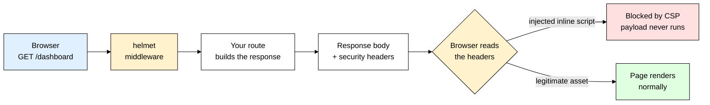
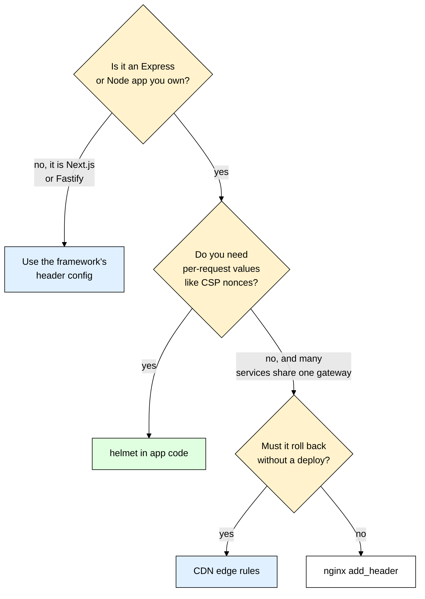

# helmet — Security Headers Your API Should Have Had From Day One

> **Scope:** The `helmet` npm package for Express — what each security header does, how to configure Content-Security-Policy without breaking your app, and what helmet deliberately does *not* protect you from.
> **Level:** Beginner + practical.
> **New to Express middleware?** Read [[express]] first — helmet is just a middleware, and the ordering rules matter here more than usual.

---

## 1. ELI5: What is helmet?

You built a small Express app. It works. You deploy it. Then someone runs your URL through a free security scanner and sends you a screenshot full of red: *"missing Content-Security-Policy, missing Strict-Transport-Security, missing X-Content-Type-Options, X-Powered-By reveals Express."* You didn't write any insecure code — you just never wrote the **response headers** that tell the browser to be careful with your page.

Think of your response as a package you ship to a stranger's house. The **body** is the contents. The **headers** are the handling instructions printed on the outside of the box: *"this side up", "do not open with a knife", "refrigerate on arrival", "return to sender if the seal is broken."* Browsers are extremely obedient couriers — they will follow every instruction on the box. But if you print nothing, they default to the most permissive, most backwards-compatible behavior the web has ever supported, which is exactly what an attacker wants.

**helmet** is the label printer. It's one line of middleware that stamps about a dozen well-chosen handling instructions onto every response you send.

> **Type:** npm package, Express middleware (works with any Connect-style framework)
> **Core promise:** Set a sane, modern set of HTTP security response headers by default, and give you a clean way to tune each one.



---

## 2. Why Does helmet Exist? (The Problem It Solves)

Nothing helmet does is magic. Every single header it sets is one line of `res.setHeader()`. The problem is that there are a dozen of them, each with a fiddly value string, each with browser quirks, and most developers have never heard of half of them. Life without helmet looks like this:

```js
// The "I'll just set them myself" approach — please don't ship this
app.use((req, res, next) => {
  res.setHeader("X-Content-Type-Options", "nosniff");
  res.setHeader("Strict-Transport-Security", "max-age=31536000; includeSubDomains");
  res.setHeader("X-XSS-Protection", "1; mode=block"); // ❌ actively harmful — see section 5
  res.setHeader("Content-Security-Policy", "default-src 'self'"); // ❌ blocks every CDN asset
  res.removeHeader("X-Powered-By");
  // ...and you still forgot Referrer-Policy, X-Frame-Options, Cross-Origin-Opener-Policy,
  // Cross-Origin-Resource-Policy, Origin-Agent-Cluster, X-Permitted-Cross-Domain-Policies
  next();
});
```

That block is wrong in two places already, is missing the six headers named in its own comment, and will silently rot as browser recommendations change over the next three years.

| Without helmet | With helmet |
|---|---|
| You have to *know* a dozen header names exist before you can set them | `app.use(helmet())` sets a curated modern set on day one |
| Values are hand-typed strings — one typo and the header is silently ignored | Values are built by tested code, validated at startup |
| Recommendations drift (X-XSS-Protection went from "required" to "harmful") | Upgrading the package updates the defaults with the industry |
| `X-Powered-By: Express` broadcasts your stack to every scanner | Removed automatically |
| CSP is a single hard-to-edit string you're afraid to touch | CSP is an object of directives you can merge, extend, or remove one key at a time |

helmet is not a firewall and not a vulnerability scanner. It is **a well-maintained default configuration** for a part of HTTP most people never learn.

---

## 3. Installing & Basic Usage

```bash
npm install helmet
```

helmet has zero dependencies, needs Node 18 or newer, and works with both Express 4 and Express 5. Everything below describes helmet 8, the current major version.

```js
import express from "express";
import helmet from "helmet";

const app = express();

// Mount helmet BEFORE any route or static handler — middleware runs in
// registration order, and a header set after res.send() is thrown away.
app.use(helmet());

app.get("/", (req, res) => {
  res.send("<h1>Hello</h1>");
});

app.listen(3000);
```

That single `app.use(helmet())` call is a bundle of about a dozen tiny middlewares running in sequence. You can see exactly what it produced without opening a browser:

```bash
curl -sI http://localhost:3000 | sort
# Content-Security-Policy: default-src 'self';base-uri 'self';font-src 'self' https: data:; ...
# Strict-Transport-Security: max-age=31536000; includeSubDomains
# X-Content-Type-Options: nosniff
# ...and nine more — the full list, with what each one is for, is in section 4
```

### CommonJS version

```js
const express = require("express");
const helmet = require("helmet"); // helmet ships both ESM and CJS builds

const app = express();
app.use(helmet());
```

### Express example

Order is the whole game. helmet goes at the very top, above logging, CORS, parsers, and routes:

```js
import express from "express";
import helmet from "helmet";
import cors from "cors";

const app = express();

app.use(helmet()); // 1. headers first, so even a 404 or a thrown error carries them
app.use(cors({ origin: "https://app.example.com" })); // 2. see [[cors]] — different problem, different headers
app.use(express.json({ limit: "100kb" })); // 3. body parsing after the cheap stuff
app.get("/api/users", (req, res) => res.json([])); // 4. routes last
```

That's the entire mental model — helmet writes response headers on the way in, the browser obeys them on the way out, and everything you configure is just tuning the value of one header.

---

## 4. What a Security Header Actually Is

A **security header** is a normal HTTP response header whose value is a *policy* the browser agrees to enforce on your behalf. Three consequences fall out of that definition, and beginners get bitten by all three:

1. **They only work in a browser.** `curl`, Postman, a Python script, and a malicious bot ignore every one of them. Headers protect *your users' browsers* from *your own page being abused* — they do not protect your server from bad requests. For that you need [[express_rate_limit]] and input validation with [[zod]].
2. **They are enforced by the client, so they can never be trusted as an access control.** A header is a request to a browser, not a lock on a door. Never think "frame-ancestors protects my admin page" — authentication protects your admin page.
3. **They apply per-response.** A header set on `/` does nothing for `/api/orders`. This is why helmet is mounted globally rather than per-route.

Here is the complete set helmet 8 writes by default, and what each one is actually for:

| Header | Value helmet sets by default | What it stops |
|---|---|---|
| `Content-Security-Policy` | `default-src 'self'; ...` (see the curl output above) | XSS: the browser refuses to run scripts, load frames, or send data to origins you didn't allow |
| `Cross-Origin-Opener-Policy` | `same-origin` | Cross-window attacks — a page you open (or that opens you) can no longer touch your `window` object |
| `Cross-Origin-Resource-Policy` | `same-origin` | Other sites embedding your responses as images/scripts to probe them via side channels |
| `Origin-Agent-Cluster` | `?1` | Asks the browser to isolate your origin in its own agent cluster — a memory-isolation hint |
| `Referrer-Policy` | `no-referrer` | Leaking the full URL you came from — including reset tokens and IDs — to third parties |
| `Strict-Transport-Security` | `max-age=31536000; includeSubDomains` | SSL stripping: the browser refuses plain `http://` to your domain for a year |
| `X-Content-Type-Options` | `nosniff` | MIME sniffing: a user-uploaded `.txt` being guessed as JavaScript and executed |
| `X-DNS-Prefetch-Control` | `off` | Privacy leak — the browser resolving DNS for every link on your page before the user clicks |
| `X-Download-Options` | `noopen` | Legacy IE opening a download directly in your site's security context |
| `X-Frame-Options` | `SAMEORIGIN` | Clickjacking in browsers too old to understand CSP `frame-ancestors` |
| `X-Permitted-Cross-Domain-Policies` | `none` | Adobe Flash/Acrobat reading your domain via a `crossdomain.xml` policy file |
| `X-XSS-Protection` | `0` | **Disables** a legacy browser filter that was itself exploitable — `0` is correct, not lazy |
| `X-Powered-By` | *removed, not set* | Free fingerprinting — telling every scanner you run Express |

One notable header is **off by default**: `Cross-Origin-Embedder-Policy`. It is required for `SharedArrayBuffer` and high-resolution timers, but it breaks any cross-origin resource that doesn't opt in with CORP/CORS headers. helmet leaves it to you (`crossOriginEmbedderPolicy: true` turns it on).

---

## 5. The Headers That Matter Most

Twelve headers is a lot to hold in your head. In practice, five of them do ninety percent of the work.

### 5.1 Content-Security-Policy — stops XSS from paying off

XSS happens when attacker-controlled text ends up inside your HTML and the browser runs it as code. CSP is the second line of defense: even if the payload lands on the page, the browser checks the script against your policy first and refuses to execute it. `default-src 'self'` means *"only load things from my own origin"* — an injected `<script src="https://evil.tld/steal.js">` is dead on arrival, and so is an inline `<script>` block. This is the header worth understanding deeply, so it gets its own section below.

### 5.2 Strict-Transport-Security — stops SSL stripping

A user types `example.com` (no scheme). The browser tries `http://` first. On hostile Wi-Fi, an attacker intercepts that plaintext request and proxies the whole session, quietly rewriting `https://` links to `http://` — the user never sees a certificate warning because there is no certificate involved. This is **SSL stripping**, and a redirect from your server does not prevent it, because the attacker intercepts the request before it ever reaches you.

HSTS fixes it by making the browser remember: *"for this hostname, never speak plain HTTP again."*

```js
app.use(helmet({
  strictTransportSecurity: {
    maxAge: 63072000, // 2 years in SECONDS — not ms. Short values weaken the guarantee.
    includeSubDomains: true, // covers api.example.com, cdn.example.com, everything
    preload: false, // see the warning below before flipping this
  },
}));
```

- **`maxAge`** is in seconds and is a sliding window — every HTTPS response refreshes it. helmet's own default is `31536000` (one year, raised from six months in helmet 8).
- **`includeSubDomains`** is the part that actually protects you, because a stray `http://staging.example.com` can drop a cookie on the parent domain. But it means *every* subdomain must serve valid HTTPS, forever.
- **`preload`** only adds the `preload` token to the header — it submits nothing by itself. That token is the prerequisite for submitting your domain at `hstspreload.org`, the list Chrome, Firefox, Safari and Edge **compile into the browser binary** (submission also requires `max-age` of at least one year and `includeSubDomains`). Once you are on it, even a first-ever visit is protected, with no trust-on-first-use gap.

> ⚠️ **`preload` is close to irreversible.** Removal from the preload list takes months to propagate, and users on old browser builds keep the baked-in entry until they upgrade. If a single subdomain later needs plain HTTP — an internal tool, an IoT callback, a legacy partner integration — you cannot fix it quickly. Only set `preload: true` once you are certain that every subdomain, present and future, will be HTTPS-only. And note that **browsers ignore HSTS delivered over `http://`** — on `http://localhost` you will see the header in `curl` and see nothing happen in the browser, which is correct, not a bug.

### 5.3 X-Content-Type-Options: nosniff — stops MIME sniffing

Historically, browsers "helped" by ignoring your `Content-Type` and guessing from the bytes. So a file you served as `text/plain` that happened to start with `<script>` could be executed as HTML or JS. If your app accepts uploads (see [[multer]]) and serves them back, that is a direct path from "user uploaded a note" to "user uploaded stored XSS".

`nosniff` tells the browser: *trust my `Content-Type`, and if a `<script>` tag points at something that isn't a JavaScript MIME type, refuse to run it.* It has no options and no downside. The only thing it breaks is code that was serving the wrong `Content-Type` and getting away with it.

### 5.4 X-Frame-Options and frame-ancestors — stop clickjacking

Clickjacking: the attacker loads *your real, logged-in page* in an invisible iframe on their site, stacks a decoy button underneath the user's cursor, and the user's click lands on your "Transfer funds" button. Every request is genuine, cookies and all — the user simply could not see what they were clicking.

Both headers below say "refuse to render me in a frame", so the outer page has nothing to stack a decoy on. You want both:

```js
app.use(helmet({
  xFrameOptions: { action: "deny" }, // legacy header — every browser ever shipped obeys it
  contentSecurityPolicy: {
    useDefaults: true,
    // Modern equivalent, and the only one that can express an allowlist
    directives: { "frame-ancestors": ["'none'"] }, // or ["'self'", "https://partner.example.com"]
  },
}));
```

**Rule of thumb:** if your app is never meant to be embedded, use `frame-ancestors 'none'` plus `X-Frame-Options: DENY`. If you must allow specific partners, only `frame-ancestors` can express an allowlist — `X-Frame-Options: ALLOW-FROM` was removed from browsers and from helmet, so a partner allowlist means CSP or nothing.

### 5.5 Referrer-Policy — stops URL leaks

When a user clicks a link off your site (or your page loads a third-party image or analytics script), the browser sends a `Referer` header with the URL they came from. If your URLs look like `/reset-password?token=abc123` or `/invoices/9f2b/pay`, you just handed that token to a third party's access logs.

helmet's default `no-referrer` sends nothing at all, ever. That's the safest choice but it also blinds your own analytics on outbound clicks. A common production compromise:

```js
// Full URL to your own origin, bare origin cross-site, nothing on an HTTPS-to-HTTP downgrade
app.use(helmet({ referrerPolicy: { policy: "strict-origin-when-cross-origin" } }));
```

The real fix is upstream: **never put secrets in a URL path or query string**. Put them in a POST body or an `Authorization` header (see [[jsonwebtoken]]). Referrer-Policy is damage limitation for URLs that leak anyway.

### 5.6 A note on X-XSS-Protection

You will find a thousand blog posts telling you to set `X-XSS-Protection: 1; mode=block`. **They are out of date.** That header enabled a heuristic XSS "auditor" in old Internet Explorer and Chrome, and the auditor introduced vulnerabilities of its own — attackers could use it to selectively *disable* legitimate scripts and create holes that would not otherwise exist. Chrome removed the auditor entirely, Firefox never implemented it, and helmet therefore sends `X-XSS-Protection: 0` to explicitly opt out of whatever buggy implementations remain. If a compliance checklist flags the `0`, the checklist is outdated, not your app.

---

## 6. Content-Security-Policy Deep Dive

This is the one that will break your app, so it's the one worth actually learning.

### 6.1 The syntax

A CSP is a single string of semicolon-separated **directives**. Each directive is a resource type followed by a space-separated list of sources:

```
default-src 'self'; script-src 'self' https://cdn.example.com; img-src 'self' data:; connect-src 'self' https://api.example.com
```

| Directive | Governs | Typical mistake |
|---|---|---|
| `default-src` | The fallback for every `*-src` you didn't specify | Assuming it covers `frame-ancestors` or `base-uri` — it does not |
| `script-src` | `<script>` tags, `eval`, inline handlers | Adding `'unsafe-inline'` to make a widget work |
| `style-src` | `<style>`, `<link rel=stylesheet>`, inline `style=` | CSS-in-JS libraries need `'unsafe-inline'` or a nonce |
| `img-src` | ``, `background-image`, favicons | Forgetting `data:` for base64 inline images |
| `connect-src` | `fetch`, XHR, WebSocket, `EventSource` | Forgetting `wss://` for [[socket_io]] connections |
| `font-src` | `@font-face` sources | Google Fonts needs `https://fonts.gstatic.com` |
| `frame-ancestors` | Who may embed **you** | Thinking `default-src` covers it |
| `frame-src` | Who **you** may embed | Confusing it with `frame-ancestors` |
| `form-action` | Where `<form>` may POST | Injected forms exfiltrating credentials |
| `base-uri` | What `<base href>` may be set to | Left open, an injected `<base>` reroutes every relative script URL |
| `object-src` | `<object>`, `<embed>` — legacy plugins | Should always be `'none'` |

The special keyword sources, which must be written **with the single quotes inside the string**:

- `'self'` — the exact scheme + host + port of the page.
- `'none'` — nothing, at all. `default-src 'none'` is the strictest possible starting point.
- `'unsafe-inline'` — allow inline `<script>`/`style=` attributes.
- `'unsafe-eval'` — allow `eval()`, `new Function()`, and string `setTimeout`.
- `'nonce-<random>'` — allow exactly the inline blocks carrying that one-time token.
- `'sha256-<base64>'` — allow inline blocks whose contents hash to this value.

### 6.2 Why `'unsafe-inline'` defeats the whole point

The single most common "fix" for a broken CSP is to add `'unsafe-inline'` to `script-src`. Understand what you just did: XSS *is* injected inline script. A policy of `script-src 'self' 'unsafe-inline'` tells the browser "run any inline script you find on this page" — which is precisely the attack you deployed CSP to prevent. You now have a header that scores green on scanners and blocks nothing.

`'unsafe-inline'` in `style-src` is a much smaller deal (CSS injection is mostly a data-exfiltration and defacement risk, not code execution), which is why helmet's own default includes it for styles but never for scripts.

### 6.3 Nonces — the right way to allow inline scripts

If you server-render HTML and genuinely need an inline script, generate a fresh random value per response and put it on both the header and the tag:

```js
import crypto from "node:crypto";
import express from "express";
import helmet from "helmet";

const app = express();

app.use((req, res, next) => {
  // Fresh per RESPONSE — a reused or predictable nonce is the same as 'unsafe-inline'
  res.locals.cspNonce = crypto.randomBytes(16).toString("base64");
  next();
});

app.use(helmet({
  contentSecurityPolicy: {
    // helmet evaluates functions per request, so the fresh nonce lands in the header
    directives: { "script-src": ["'self'", (req, res) => `'nonce-${res.locals.cspNonce}'`] },
  },
}));

// Only a tag carrying this exact nonce runs; an injected <script> without it is blocked
app.get("/", (req, res) =>
  res.send(`<script nonce="${res.locals.cspNonce}">console.log("allowed")</script>`)
);
```

The alternative is a **hash**: compute `sha256` of the exact script text and list `'sha256-...'`. Hashes suit static, never-changing inline snippets; nonces suit templated pages.

> ⚠️ A nonce is only safe if it is unguessable and never reused across responses. Do not hardcode one in a config file, and do not compute it once at boot.

### 6.4 Rolling it out safely with Report-Only

Turning on a strict CSP in production without testing is how you white-screen your app at 2am. The escape hatch is `Content-Security-Policy-Report-Only`: the browser evaluates the policy, blocks nothing, and reports what *would* have been blocked.

The loop is: ship the candidate policy as Report-Only, collect violations for a week or two, add the sources that turn out to be legitimate, and flip it to enforcing only once the reports go quiet.

```js
// 1. Today's working policy, actually enforced
app.use(helmet({
  contentSecurityPolicy: {
    useDefaults: true,
    directives: { "script-src": ["'self'", "'unsafe-inline'"] },
  },
}));

// 2. The stricter policy you WANT — evaluated but never enforced, so nothing breaks
app.use(helmet.contentSecurityPolicy({
  useDefaults: false,
  reportOnly: true, // sends Content-Security-Policy-Report-Only instead
  directives: {
    "default-src": ["'self'"],
    "script-src": ["'self'"], // no 'unsafe-inline' — the goal state
    "report-uri": ["/csp-violation"], // legacy directive, but universally supported
  },
}));

// Browsers POST violations as application/csp-report, not application/json
app.post("/csp-violation", express.json({ type: ["json", "application/csp-report"] }), (req, res) => {
  console.warn("CSP violation", req.body); // pipe into [[winston_morgan]] in real life
  res.sendStatus(204);
});
```

Expect noise: browser extensions inject scripts into your pages and generate violation reports you cannot fix. Filter by whether the blocked URI looks like a real asset of yours.

---

## 7. Configuring helmet

### 7.1 Turning individual pieces off

Pass `false` for any sub-middleware you don't want:

```js
app.use(helmet({
  contentSecurityPolicy: false, // you'll set your own further down the stack
  crossOriginResourcePolicy: false, // this server hands assets to other origins
  xDnsPrefetchControl: false, // you actually want prefetching for link-heavy pages
}));
```

Two things to know before you touch `directives`. `useDefaults` is `true` unless you say otherwise, so your object is **merged** into helmet's hardened defaults, not swapped for them — and setting a directive to `null` is how you delete one of those defaults instead of overriding it. Print what you are merging into with `console.log(helmet.contentSecurityPolicy.getDefaultDirectives())` before you guess.

### 7.2 Mounting one piece on one route

Every sub-middleware is also exported standalone, which is how you give a subtree a different policy:

```js
app.use(helmet()); // the whole app gets the strict default...

// ...but /embed is meant to be iframed by partners, so relax only that path
app.use("/embed",
  helmet.contentSecurityPolicy({
    useDefaults: true,
    directives: { "frame-ancestors": ["https://partner.example.com"] },
  }),
  helmet.xFrameOptions({ action: "sameorigin" })
);
```

> Since helmet 6.2, every sub-middleware is also exported under the name of the header it sets — `helmet.hsts` is also `helmet.strictTransportSecurity`, `helmet.frameguard` is `helmet.xFrameOptions`, `helmet.noSniff` is `helmet.xContentTypeOptions`, `helmet.xssFilter` is `helmet.xXssProtection`, `helmet.hidePoweredBy` is `helmet.xPoweredBy`. Both spellings still work in helmet 8, as option keys too, so older tutorials aren't wrong — just older.

### 7.3 API server vs HTML server — genuinely different configs

This is the split beginners miss. A JSON API and an HTML app want opposite things:

| Concern | JSON API (`/api/*` only) | Server-rendered / static HTML app |
|---|---|---|
| `Content-Security-Policy` | `default-src 'none'` — nothing is ever loaded | Carefully allowlisted per resource type, nonces for inline |
| `Cross-Origin-Resource-Policy` | `same-site` or `cross-origin` if a separate frontend domain calls it | `same-origin` is usually fine |
| Cross-origin browser access | Handled by [[cors]], **not** by helmet | Often not needed at all |
| `Referrer-Policy` | Irrelevant — nobody navigates from a JSON response | Matters a lot |
| `X-Frame-Options` | `DENY`, no exceptions | `SAMEORIGIN`, or an allowlist via `frame-ancestors` |

```js
// Split stack: React on app.example.com, API on api.example.com
app.use(helmet({
  contentSecurityPolicy: { useDefaults: false, directives: { "default-src": ["'none'"] } },
  crossOriginResourcePolicy: { policy: "same-site" }, // let the sibling origin use the response
}));
app.use(cors({ origin: "https://app.example.com", credentials: true })); // the actual cross-origin gate
```

---

## 8. helmet Is Necessary, Not Sufficient

Installing helmet does not make your app secure; it removes one specific class of "you forgot to say no" problems. Everything below is still entirely on you:

| helmet does **not** stop | What actually does |
|---|---|
| SQL/NoSQL injection, mass assignment | Schema validation on every input — [[zod]] — plus never passing raw `req.body` into a query |
| Credential stuffing, brute-force login | [[express_rate_limit]] plus slow password hashing ([[bcrypt]] / [[argon2]]) |
| Cross-origin API abuse from other sites | A correctly configured [[cors]] allowlist — helmet sets zero CORS headers |
| Broken authentication / expired-token handling | Your own auth layer — [[jsonwebtoken]] and session design |
| Secrets committed to the repo | [[dotenv]] plus a real secret store in production |
| A dependency with a published CVE | `npm audit`, Dependabot, and actually upgrading |
| Stored XSS getting into your database | Validate and encode on output; CSP is the *second* line of defense, not the first |

**Rule of thumb:** helmet is the cheapest security work you will ever do — one line, five minutes — which is exactly why it must not be the *only* security work you do.

Verify through the real CDN or proxy path rather than your Node origin, because whatever sits in front of your app can add, drop, or duplicate the headers you set:

```bash
curl -sI https://api.example.com/health | grep -iE "content-security|strict-transport|x-frame|x-content-type|referrer"
```

For a graded external report, paste the URL into `securityheaders.com`; to check whether your domain is genuinely on the HSTS preload list, use `hstspreload.org`.

---

## 9. TypeScript Version

```ts
import express, { type Request, type Response, type NextFunction } from "express";
import helmet from "helmet";
import crypto from "node:crypto";

type AppLocals = { cspNonce: string }; // so res.locals isn't `any` downstream

const app = express();

app.use((req: Request, res: Response<unknown, AppLocals>, next: NextFunction) => {
  res.locals.cspNonce = crypto.randomBytes(16).toString("base64");
  next();
});

app.use(helmet({
  contentSecurityPolicy: {
    useDefaults: true,
    directives: {
      // helmet types this callback against Node's http types, not Express's,
      // so narrow it back to an Express Response to reach res.locals
      "script-src": ["'self'", (req, res) => `'nonce-${(res as Response<unknown, AppLocals>).locals.cspNonce}'`],
      "connect-src": ["'self'", "https://api.example.com"],
      "upgrade-insecure-requests": null, // null is a valid directive value: "delete this default"
    },
  },
  strictTransportSecurity: { maxAge: 31_536_000, includeSubDomains: true },
  referrerPolicy: { policy: "strict-origin-when-cross-origin" },
  xFrameOptions: { action: "deny" },
}));

app.get("/health", (req: Request, res: Response) => res.json({ ok: true }));
app.listen(3000);
```

helmet ships its own type declarations — do **not** install `@types/helmet`; that package is a deprecated stub and will only confuse your editor.

---

## 10. Production Setup

A realistic `security.js` for an app that serves HTML — one file, hardened in production, permissive enough to work in dev:

```js
import helmet from "helmet";
import crypto from "node:crypto";

const isProd = process.env.NODE_ENV === "production";

export function nonceMiddleware(req, res, next) {
  res.locals.cspNonce = crypto.randomBytes(16).toString("base64");
  next();
}

export const securityHeaders = () => helmet({
  contentSecurityPolicy: {
    useDefaults: true, // keep object-src 'none', base-uri 'self', form-action 'self'
    reportOnly: !isProd, // in dev, report instead of enforce so a bad policy never blocks work
    directives: {
      "script-src": ["'self'", (req, res) => `'nonce-${res.locals.cspNonce}'`],
      "style-src": ["'self'", "'unsafe-inline'", "https://fonts.googleapis.com"],
      "font-src": ["'self'", "https://fonts.gstatic.com", "data:"],
      "img-src": ["'self'", "data:", "https://res.cloudinary.com"], // avatars on a CDN
      "connect-src": ["'self'", process.env.API_ORIGIN].filter(Boolean), // drop undefined env vars
      "frame-ancestors": ["'none'"],
      "upgrade-insecure-requests": isProd ? [] : null, // null deletes it — dev is plain http
    },
  },
  // Pointless over http, and it poisons the whole localhost hostname for your other projects
  strictTransportSecurity: isProd && { maxAge: 31_536_000, includeSubDomains: true, preload: false },
  referrerPolicy: { policy: "strict-origin-when-cross-origin" },
  xFrameOptions: { action: "deny" },
});
```

Wire it into `server.js` in exactly this order: `app.set("trust proxy", 1)` so `req.protocol` and `req.ip` are real behind nginx or Cloudflare, then `app.use(nonceMiddleware)` — which has to run *before* helmet reads `res.locals.cspNonce` — then `app.use(securityHeaders())`, then [[cors]], then your body parsers and routes.

Three production decisions worth making explicitly:

1. **Pick one place to set headers.** If nginx or Cloudflare also injects a CSP, browsers will receive two `Content-Security-Policy` headers and enforce the **intersection** — the union of all restrictions. That is almost never what either config intended, and it produces bugs that reproduce only in production.
2. **HSTS only in production.** An HSTS header served from `localhost:3000` gets remembered by your browser for the whole `localhost` hostname and will force *every other project you run on localhost* to HTTPS. Clear it at `chrome://net-internals/#hsts` if you've already done this.
3. **Wire CSP reports into your logger** ([[winston_morgan]]) rather than a bare `console.warn`, and rate-limit that endpoint — a hostile client can POST fake reports all day.

---

## 11. Common Gotchas & Best Practices

| Gotcha | Fix |
|---|---|
| **`app.use(helmet())` placed after your routes** | Middleware runs in registration order — a route that already called `res.send()` has flushed its headers, so helmet never runs for it. Mount helmet as the first `app.use()` in the file. |
| **CSP breaks every image, font, or CDN script after install** | helmet's default is `default-src 'self'`, which blocks all third-party assets. Do not delete the CSP — add the specific origins to `img-src` / `font-src` / `script-src` with `useDefaults: true` so the rest of the hardening stays. |
| **Adding `'unsafe-inline'` to `script-src` to fix an error** | You just re-enabled the exact thing CSP blocks. Use a per-response nonce, or move the inline code into a real `.js` file served from `'self'`. |
| **Passing `directives` without `useDefaults`** | `useDefaults` is `true` by default, so your object *merges* — people expecting a full replacement are surprised by leftover directives. To start clean, set `useDefaults: false`; to delete one default, set that key to `null`. |
| **Two CSP headers from Node and from nginx** | The browser applies both policies and blocks anything either one forbids. Check with `curl -sI` for duplicate `Content-Security-Policy` lines and remove one source. |
| **Images/fonts served to another origin suddenly 404 or render blank** | helmet's default `Cross-Origin-Resource-Policy: same-origin` blocks it. For an asset server, set `crossOriginResourcePolicy: { policy: "cross-origin" }` — and note this is a *separate* mechanism from [[cors]], not a replacement for it. |
| **HSTS "not working" when you test on localhost** | Browsers ignore `Strict-Transport-Security` delivered over plain HTTP by design. Test it on a real HTTPS host, and keep HSTS disabled in dev so you don't poison your local hostname. |
| **Assuming helmet protects the API from non-browser clients** | Headers are instructions to browsers. `curl`, scripts, and bots ignore all of them. Server-side protection means validation ([[zod]]), rate limiting ([[express_rate_limit]]), and auth. |

---

## 12. Alternatives — When helmet Isn't the Best Fit

| Approach | What it is | Best for |
|---|---|---|
| **helmet** | Express middleware, headers set in application code | Almost every Node app. Config lives in your repo, is code-reviewed, ships with the app, and can vary per route or per request (nonces!). |
| **Reverse proxy (nginx / Caddy)** | `add_header` directives in the proxy config | Fleets of heterogeneous services behind one gateway, or when app teams can't be trusted to configure it. Cannot do per-request values like nonces, and lives outside your repo's review process. |
| **CDN / edge (Cloudflare, Fastly)** | Header transform rules in a dashboard or edge worker | Instant global rollout and rollback without a deploy — great for emergency changes, terrible as a source of truth, since the config isn't in git. |
| **Framework built-ins** | Next.js `headers()` in `next.config.js`, Fastify's `@fastify/helmet`, NestJS wrapping helmet | Use these when you're on that framework — they're the idiomatic path and often wrap helmet anyway. Adding raw helmet on top usually creates duplicate headers. |
| **Nothing (defaults)** | No security headers at all | Never for anything reachable from a browser. Acceptable only for an internal service on a private network with no HTML and no browser clients — and even then, `nosniff` is free. |



**Rule of thumb:** set headers in **one** place, and prefer the place where the config is version-controlled next to the code it protects. For a Node app, that is helmet.

---

## 13. Interview Questions

**Q: What does `app.use(helmet())` actually do?**
A: It mounts roughly a dozen tiny middlewares that each set one HTTP response header — CSP, HSTS, `X-Content-Type-Options`, `X-Frame-Options`, `Referrer-Policy`, the Cross-Origin-* family — and removes `X-Powered-By`. It sets no cookies, touches no request bodies, and blocks no requests; every protection is enforced by the browser after the response arrives.

**Q: What is SSL stripping, and how does HSTS stop it?**
A: A user types a bare hostname, the browser tries `http://` first, and an attacker on the network intercepts that plaintext request and proxies the session while rewriting HTTPS links to HTTP — no certificate warning ever appears. A server-side redirect can't help, because the attacker sees the request before your server does. HSTS makes the browser refuse plain HTTP to that hostname for `max-age` seconds, so the vulnerable first request never leaves the machine.

**Q: Why is `'unsafe-inline'` in `script-src` considered a red flag?**
A: XSS payloads are inline scripts, so allowing all inline scripts allows the attack CSP exists to prevent. A policy with `'unsafe-inline'` looks green on a scanner but blocks essentially nothing for script execution. The correct alternatives are per-response nonces or content hashes; `'unsafe-inline'` in `style-src` is a much lesser concern and is even in helmet's own defaults.

**Q: Why does helmet set `X-XSS-Protection: 0` instead of `1; mode=block`?**
A: The legacy XSS auditor that header enabled was itself a vulnerability — attackers could use it to selectively disable legitimate scripts and create holes that didn't otherwise exist. Chrome removed the auditor and Firefox never shipped one, so `0` explicitly opts out of the remaining buggy implementations. Guidance recommending `1; mode=block` predates that consensus.

**Q: Someone installs helmet and their site's images and CDN scripts break. What happened and how do you fix it?**
A: helmet's default CSP is `default-src 'self'`, so anything from another origin is blocked. The fix is not to disable CSP — it is to add the specific origins to the specific directives (`img-src`, `script-src`, `font-src`) while keeping `useDefaults: true` so the rest of the hardening stays. Roll the change out with `Content-Security-Policy-Report-Only` first and read the violation reports to find every origin you actually depend on.

**Q: Should security headers be set in the app or at the reverse proxy?**
A: In one place only — duplicated CSP headers make browsers enforce the intersection of both policies, which produces bugs that reproduce only in production. In-app (helmet) is usually better because the config is version-controlled with the code, reviewed in PRs, and can compute per-request values like nonces; proxy or edge config wins when many heterogeneous services share a gateway or when you need an emergency change without a deploy.

**Q: Is an app with helmet installed "secure"?**
A: No — helmet closes one class of browser-side holes and does nothing about injection, authentication, authorization, rate limiting, or vulnerable dependencies. Non-browser clients ignore every header it sets. It's the cheapest possible win, not the finish line.

---

## 14. Quick Cheat Sheet

```bash
npm install helmet

# Verify what actually shipped — through the proxy or CDN, not just the Node origin
curl -sI https://api.example.com/health | sort
```

```js
// Minimum viable — sane defaults for an HTML app
import helmet from "helmet";
app.use(helmet()); // FIRST middleware, before routes
```

```js
// JSON API — nothing is ever rendered, so lock it all down
app.use(helmet({
  contentSecurityPolicy: {
    useDefaults: false,
    directives: { "default-src": ["'none'"], "frame-ancestors": ["'none'"] },
  },
}));

// HTML app — merge into the defaults instead of replacing them
app.use(helmet({
  contentSecurityPolicy: {
    useDefaults: true,
    directives: {
      "img-src": ["'self'", "data:", "https://res.cloudinary.com"],
      "connect-src": ["'self'", "https://api.example.com", "wss://api.example.com"],
      "upgrade-insecure-requests": null, // null deletes a default directive
    },
  },
  strictTransportSecurity: { maxAge: 31_536_000, includeSubDomains: true },
  referrerPolicy: { policy: "strict-origin-when-cross-origin" },
  xFrameOptions: { action: "deny" },
}));
```

```js
// Safe rollout: report on the strict candidate policy, and inspect what you are merging into
app.use(helmet.contentSecurityPolicy({
  useDefaults: false,
  reportOnly: true,
  directives: { "default-src": ["'self'"], "report-uri": ["/csp-violation"] },
}));
console.log(helmet.contentSecurityPolicy.getDefaultDirectives());
```

**Mental model to remember:**
> helmet is one line of middleware that stamps a dozen "handle with care" instructions onto every response, and browsers obey them — CSP kills injected scripts, HSTS kills SSL stripping, `nosniff` kills MIME guessing, `frame-ancestors` kills clickjacking. Mount it first, merge into its CSP defaults rather than replacing them, and roll strict policies out with Report-Only before enforcing. It protects browsers, not servers — so pair it with [[cors]], [[express_rate_limit]], and input validation via [[zod]] on top of a properly configured [[express]] app.
