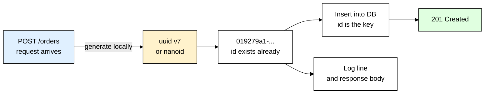
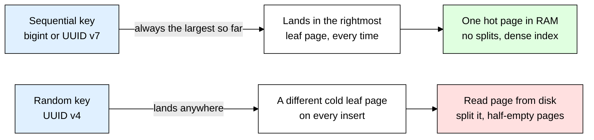
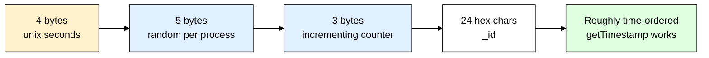
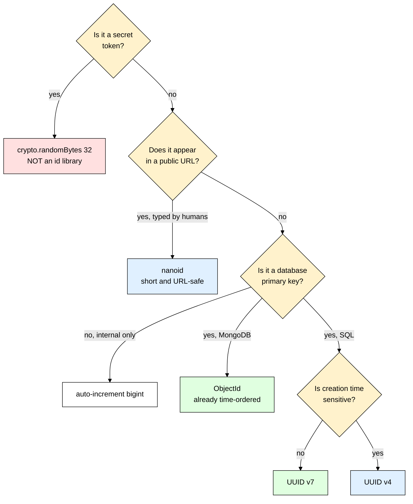

# uuid + nanoid — Choosing IDs You Will Not Regret

> **Scope:** Generating unique identifiers in Node.js — `node:crypto`'s `randomUUID()`, the `uuid` package (v4 and v7), `nanoid`, `cuid2`, Mongo's `ObjectId`, and how to pick between them.
> **Level:** Beginner + practical.
> **New to Express?** Read [[express]] first — every route example here assumes you know what a handler is.

---

## 1. ELI5: What is uuid + nanoid?

You built a signup route. A user is created, and now you need to put them somewhere and hand back a link. So you write `/users/1`. Then `/users/2`. Then you add a background worker that also creates users, and a mobile client that creates drafts while offline, and a second database region — and suddenly two different machines both decide the next user is `7`. Meanwhile a bored visitor changes `/orders/1042` to `/orders/1041` in the address bar and reads somebody else's invoice.

The problem is that you asked the **database** to name your rows, and a single database counting upward is the only thing keeping those names unique.

Think of it like **name badges at a conference**. The cheap approach is a numbered roll of stickers: `#1`, `#2`, `#3`. It works perfectly while one person at one desk hands them out. The moment you open a second entrance, both desks start from `#1` and you have two `#57`s wandering around. Worse, anybody glancing at a badge can tell exactly how many people showed up and who arrived first. The alternative is to let **every** desk print badges from a pool so enormous that two desks picking the same string is not a practical concern — no coordination, no central counter, no queue.

`uuid` and `nanoid` are that pool. They are **ID generators**: pure functions that return a string statistically guaranteed to be unique, without asking anyone's permission.

> **Type:** ID generation libraries — `uuid` (npm), `nanoid` (npm), plus `randomUUID()` built into Node's `node:crypto`
> **Core promise:** Get a unique identifier locally, instantly, with no database round trip and no coordination between machines.



Notice the shape: the ID exists **before** the insert. That single property is what makes logging, idempotency, file naming, and multi-service writes all become easy.

---

## 2. Why Does uuid + nanoid Exist? (The Problem It Solves)

Here is the code you write when the database owns the ID:

```js
import fs from "node:fs/promises";
// Life without local ID generation — the database is the only source of truth
app.post("/orders", async (req, res) => {
  // We cannot log anything useful yet — the order has no name until it is saved
  const order = await Order.create({ userId: req.user.id, total: req.body.total });

  // Only NOW do we know the id, so the log line and the payment call
  // both have to wait for the database round trip to finish
  console.log("created order", order._id);
  await payments.charge({ orderId: order._id, amount: order.total });

  // If the client retries this request, we create a SECOND order —
  // there is no client-supplied key to deduplicate on
  res.status(201).json({ id: order._id });
});

// And uploads get the classic filename collision
app.post("/avatar", upload.single("file"), async (req, res) => {
  // Two users both uploading "photo.jpg" — the second overwrites the first
  await fs.rename(req.file.path, `/uploads/${req.file.originalname}`);
  res.sendStatus(204);
});
```

| The old way (DB-assigned integers) | With uuid / nanoid |
|---|---|
| ID exists only **after** a successful insert | ID exists **before** you touch the database — log it, return it, pass it to another service immediately |
| Two services writing to two databases produce conflicting IDs | Any machine, any process, any offline mobile client can mint IDs that never collide |
| `/orders/1042` tells a competitor you have done ~1042 orders | Opaque — reveals nothing about volume or ordering (except v7's coarse timestamp, if you choose that) |
| An access-control bug becomes a full scrape by walking `1, 2, 3...` | Not enumerable — an attacker cannot guess the next ID |
| Uploaded files collide on `photo.jpg` | `uuid + ext` guarantees a unique object key every time |
| Retried POST creates a duplicate row | Client sends a UUID idempotency key; the server deduplicates on it |

**Rule of thumb:** if an identifier ever leaves your server — in a URL, an API response, a log line, an S3 key — it should not be a sequential integer.

---

## 3. Installing & Basic Usage

```bash
# For UUID v4 you need NOTHING — it is built into Node
# Install the uuid package only when you want v7 (or validate/parse helpers)
npm install uuid

# nanoid is a separate, much smaller package for short URL-safe ids
npm install nanoid
```

The smallest possible working example — no dependencies at all:

```js
import { randomUUID } from "node:crypto"; // built in since Node 14.17 — no npm install

const id = randomUUID(); // "6f1c8b3e-4d2a-4f6b-9c1e-2a7b5d8e0f31"
console.log(id.length);  // 36 — 32 hex digits plus 4 dashes
```

That is a **UUID v4**. Most projects genuinely do not need the `uuid` package for this — you reach for the package when you want **v7** or the validation helpers:

```js
import { v4 as uuidv4, v7 as uuidv7, validate, version } from "uuid";

const random = uuidv4();     // same thing randomUUID() gives you
const sortable = uuidv7();   // timestamp-prefixed — see section 6, this is the one you usually want

validate(sortable);          // true — cheap format check before you hit the DB with a bad param
version(sortable);           // 7 — tells you which flavor a string is
```

And nanoid, when you want something short enough to live in a URL a human might type:

```js
import { nanoid } from "nanoid";

nanoid();    // "V1StGXR8_Z5jdHi6B-myT" — 21 URL-safe characters, no dashes to double-click around
nanoid(10);  // "IRFa-VaY2b" — shorter, but see the collision tradeoff in section 7
```

### CommonJS version

```js
const { randomUUID } = require("node:crypto"); // works everywhere, no ESM needed
const { v7: uuidv7 } = require("uuid");        // uuid ships both CJS and ESM builds

// nanoid v4+ is ESM-only. On CommonJS, pin the last CJS release: npm install nanoid@3
const { nanoid } = require("nanoid"); // only valid with nanoid@3
```

### Express example

```js
import express from "express";
import { randomUUID } from "node:crypto";
import { v7 as uuidv7 } from "uuid";
import { nanoid } from "nanoid";

const app = express();
app.use(express.json());

// Every request gets a correlation id so you can grep one user's journey out of the logs
app.use((req, res, next) => {
  // Trust an upstream proxy's id if it set one, otherwise mint our own
  req.id = req.get("x-request-id") ?? randomUUID();
  res.setHeader("x-request-id", req.id); // hand it back so the client can quote it in a bug report
  next();
});

app.post("/links", async (req, res) => {
  const link = await Link.create({
    _id: uuidv7(),          // primary key: time-ordered, index-friendly
    slug: nanoid(8),        // public short code: "V1StGXR8" — short enough for a QR code
    target: req.body.target,
    createdBy: req.user.id
  });
  res.status(201).json({ id: link._id, url: `https://sho.rt/${link.slug}` });
});
```

That's the entire mental model — an ID is just a string you generate yourself, before the database is involved. Everything else in this file is about *which* string, and the answer depends entirely on whether the ID is a database key, a public URL, or a secret.

---

## 4. Why Not Just Auto-Increment?

`AUTO_INCREMENT` / `SERIAL` / `BIGSERIAL` is a counter the database bumps on every insert. It is the default in most SQL tutorials, and it has four real problems.

| Problem | What actually goes wrong |
|---|---|
| **Leaks business information** | Sequential IDs are a public counter. Sign up on day one, sign up again a week later, subtract the two IDs — now a competitor knows your exact weekly growth. This has a name: the **German tank problem**. `/invoices/1042` says "we have issued about a thousand invoices." |
| **Enumerable** | An access-control bug on `/orders/:id` is normally one leaked record. With sequential IDs it is your **entire orders table**, because the attacker just writes a loop from 1 upward. Unguessable IDs do not fix broken authorization — you still must check ownership — but they turn a scrape into a single unlucky record. |
| **Requires a round trip** | You cannot know the ID until the `INSERT` returns. That rules out generating an ID on the client, writing the row and its child rows in one batch, or logging the entity before it is persisted. |
| **Collides across sources** | Two databases, two shards, an offline mobile client, or a merge of prod and staging data all produce the same numbers for different rows. Reconciling that later is genuinely painful. |

Being fair — auto-increment is not stupid, and there are good reasons it is the default:

- A `BIGINT` is **8 bytes**; a UUID is **16 bytes** as binary and **36 bytes** as a naive string. Every secondary index in Postgres and every non-clustered index in InnoDB carries a copy of the primary key, so that difference multiplies.
- It is perfectly **monotonic**, so inserts always append to the right edge of the B-tree — the best possible write pattern.
- It is trivially readable in a support ticket. "Order 1042" beats "order 019279a1-8f2c-7c4e-b3a1-6d5e9f0a2b3c."

**Rule of thumb:** internal tables nobody outside your team ever sees — join tables, audit logs, enum-ish lookup tables — are fine with auto-increment. Anything with a public URL, a mobile client, multiple writers, or a future sharding story should generate its own ID. A common hybrid is to keep an internal integer key *and* a public UUID column, and only ever expose the UUID.

---

## 5. UUID v4 — Random and Everywhere

A **UUID** is 128 bits, printed as 32 hex digits in the `8-4-4-4-12` pattern:

```
6f1c8b3e-4d2a-4f6b-9c1e-2a7b5d8e0f31
              ^    ^
              |    variant bits
              version digit (4 = random)
```

Six of those bits are fixed (4 for the version, 2 for the variant), so **v4 carries 122 random bits**. Node fills them from the OS cryptographic random source.

```js
import { randomUUID } from "node:crypto";

const id = randomUUID();
// Node keeps a small pre-generated cache for speed. If you are minting IDs
// in a security-sensitive loop and want each one drawn fresh, disable it:
const fresh = randomUUID({ disableEntropyCache: true });
```

### Is it actually safe from collisions?

Yes, and the numbers are worth internalizing once so you stop worrying about it. There are 2^122 possible v4 UUIDs — about 5.3 × 10^36. To reach a **one-in-a-billion** chance of a single duplicate, you would need to generate roughly **103 trillion** of them. Put differently: generating a billion UUIDs every second, you would need about **85 years** before a duplicate became more likely than not.

You will not hit that. Stop adding retry loops "just in case" — the real risk is a bug in your code reusing an ID, not the math.

### The downside that actually matters: random writes

v4's randomness is fine for uniqueness and terrible for **B-tree indexes**. Your database stores the primary key as a sorted tree of fixed-size pages. Where a new key lands depends entirely on its value:



Concretely, with random v4 keys on a table larger than your buffer pool:

- Every insert touches a **different** leaf page, so the page must be read from disk first — your cache hit rate collapses.
- Pages fill unevenly and **split**, leaving them roughly 50-70% full instead of packed. The index ends up noticeably larger on disk.
- In MySQL/InnoDB the primary key is **clustered** — the row data physically lives in primary-key order — so random keys scatter the *rows* too, not just the index. This is where the pain is worst.
- Range queries like "orders from last Tuesday" cannot use the primary key at all, because insertion order and key order are unrelated.

None of this matters at 10,000 rows. All of it matters at 50 million. That is exactly the problem v7 was standardized to fix.

---

## 6. UUID v7 — The Modern Default

**UUID v7** keeps the same 128-bit shape and the same `8-4-4-4-12` format, but spends the first 48 bits on a **Unix millisecond timestamp** and fills the rest with randomness:

```
019279a1-8f2c-7c4e-b3a1-6d5e9f0a2b3c
\___________/ ^
 48-bit ms    version 7, then 74 random bits
 timestamp
```

Because the timestamp sits in the **high** bits, sorting UUID v7 strings lexicographically sorts them chronologically. New IDs are always larger than old ones, so inserts append to the right edge of the index — the good pattern from the diagram above — while the 74 random bits keep them unguessable.

```js
import { v7 as uuidv7 } from "uuid"; // v7 shipped in uuid v10+

const a = uuidv7();
const b = uuidv7();

// Inside one millisecond the uuid package bumps an internal counter, so
// back-to-back ids still come out in generation order
console.log([b, a].sort()); // [a, b] — chronological order for free
```

v7 is not a draft any more: it is part of **RFC 9562**, finalized in 2024, and databases have caught up — **Postgres 18 ships a native `uuidv7()` function**, so you can default a column to it without touching application code.

### The version comparison

| Version | What is in it | Sortable | The catch |
|---|---|---|---|
| **v1** | 60-bit timestamp + clock sequence + 48-bit node ID (historically your **MAC address**) | Not lexicographically — the timestamp bytes are stored in the wrong order | Leaks the machine's MAC address and the exact creation time. Avoid in anything public. |
| **v4** | 122 random bits | No | Random insert position — index fragmentation and cache misses on large tables. |
| **v7** | 48-bit ms timestamp + 74 random bits | **Yes** | Reveals creation time to the **millisecond**. Almost always fine; occasionally not (see below). |

> ⚠️ v7 tells anyone holding the ID roughly when the record was created. For an order or a document that is harmless — often useful. For something like an anonymous report, a medical record, or anything where creation time is itself sensitive, use v4 instead.

**ULID** is the same idea from a different community: 128 bits, 48-bit timestamp + 80 random, encoded in Crockford base32 as 26 characters instead of 36. It predates v7 and is functionally equivalent. Prefer v7 today, purely because it is a real standard your database and drivers already understand — a ULID has to be stored as a string or converted.

**Rule of thumb:** UUID v7 is the default choice for a new database primary key. Use v4 only when the timestamp is a leak you cannot accept.

---

## 7. nanoid, cuid2 and Mongo ObjectId

UUID is not the only shape. Three alternatives cover the cases where 36 characters is too many.

### nanoid — short, URL-safe, fast

nanoid produces **21 characters** from a 64-symbol alphabet (`A-Za-z0-9_-`), which is 126 bits of randomness — *more* than a UUID v4's 122, in 15 fewer characters. Every character is URL-safe and none of them break a double-click selection.

```js
import { nanoid, customAlphabet } from "nanoid";

nanoid();     // "V1StGXR8_Z5jdHi6B-myT" — the default, safe to use anywhere a v4 would go
nanoid(12);   // shorter — you are trading bits for brevity, see below

// A custom alphabet: no lookalike characters (0/O, 1/l/I), so a human can read it aloud
const readableCode = customAlphabet("23456789ABCDEFGHJKLMNPQRSTUVWXYZ", 8);
readableCode(); // "K7QF3XNP" — good for a coupon or invite code

// The non-secure build swaps the crypto RNG for Math.random() — faster, but ONLY
// where unpredictability does not matter (a React list key, a DOM node id)
import { nanoid as fastNanoid } from "nanoid/non-secure";
fastNanoid(); // never for anything a user can see or guess at
```

The length/alphabet tradeoff is the whole design. Default nanoid needs roughly **149 billion years** at 1,000 IDs per hour before there is a 1% chance of a single collision. Drop to 8 characters and that window shrinks to days at a high enough rate. When you shorten it, check the numbers with the nanoid collision calculator at `zelark.github.io/nano-id-cc` rather than guessing — and add a unique index so a collision becomes a retry instead of a silent overwrite.

### cuid2 — collision-resistant and deliberately unsortable

```js
import { createId } from "@paralleldrive/cuid2";

createId(); // "tz4a98xxat96iws9zmbrgj3a" — 24 lowercase alphanumeric chars by default
```

cuid2 hashes together a random seed, a timestamp, a counter, and a per-machine fingerprint, then throws away any ordering. That is a **feature**: the original cuid was deprecated partly because its sortable prefix made IDs partially guessable. cuid2 is the right pick when you want maximum unguessability in a URL and you do not care about index locality. The price is exactly that — random inserts, same B-tree problem as v4.

### Mongo ObjectId — the one you already have

If you use MongoDB, every document already gets a 12-byte `_id` and it is not random:



```js
// Order is a Mongoose model (schema side covered below)
const doc = await Order.create({ total: 500 });
doc._id.getTimestamp(); // Date — the first 4 bytes ARE the creation time, to the second
// This is why sorting by _id descending is a cheap "newest first" with no extra index
```

That layout is essentially UUID v7's idea from 2009, at second granularity — it is why `_id` sorts chronologically and why you rarely need a separate `createdAt` index in Mongo. See [[mongoose]] for the schema side.

### Side by side

| | Length | Sortable | URL-friendly | Guessable | DB-index-friendly |
|---|---|---|---|---|---|
| **UUID v4** | 36 chars / 16 bytes | No | Yes, but long and dash-heavy | No | Poor — random inserts |
| **UUID v7** | 36 chars / 16 bytes | **Yes** | Same as v4 | No (timestamp visible) | **Excellent** |
| **nanoid** | 21 chars (tunable) | No | **Yes — designed for it** | No | Poor — random inserts |
| **cuid2** | 24 chars (tunable) | **No, by design** | Yes | No | Poor — random inserts |
| **ObjectId** | 24 hex chars / 12 bytes | **Yes, to the second** | Yes | No | **Excellent** |

---

## 8. Choosing in Practice

Nobody picks one ID scheme for a whole app. You pick per use case:

| Use case | Pick | Why |
|---|---|---|
| Database primary key | **UUID v7** (or **ObjectId** in Mongo — you already have it) | Time-ordered inserts keep the index dense and the writes cheap. |
| Public URL slug, short link, invite code | **nanoid** (often with a custom alphabet) | Short, URL-safe, tunable length; no ordering to leak. |
| API idempotency key | **UUID v4**, generated by the **client** | Must be unpredictable and must exist before the request is sent; ordering is irrelevant. |
| Request / correlation ID in logs | **nanoid** or **UUID v4** | Only needs to be unique per in-flight request. Short is nicer to read — see [[winston_morgan]]. |
| Uploaded file name / object key | **UUID v4** + original extension | Never trust `originalname` — see [[multer]]. Randomness also stops anyone guessing other users' object keys. |
| Password reset, session, or API token | **None of these — use `crypto.randomBytes`** | See the warning below. |

> ⚠️ **Never use uuid, nanoid, or cuid2 as a security token.** A password reset link, a session ID, an email verification link, or an API key is a **secret** — the only thing standing between an attacker and an account. These libraries are built to avoid *collisions*, not to be *secrets*: nanoid has a non-secure build, cuid2 is hashed rather than raw entropy, and v7 hands away half its bits as a public timestamp. Use `crypto.randomBytes(32).toString("hex")` — 256 bits straight from the OS CSPRNG — store only a hash of it, and give it an expiry. For stateless auth tokens, use a signed JWT instead: see [[jsonwebtoken]].

```js
import { randomBytes, createHash } from "node:crypto";

function createResetToken() {
  const token = randomBytes(32).toString("hex"); // 64 hex chars, 256 bits — this goes in the email link
  // Store only the HASH. If the database leaks, the stored value cannot be replayed as a token.
  const tokenHash = createHash("sha256").update(token).digest("hex");
  return { token, tokenHash };
}
```

---

## 9. TypeScript Version

```ts
import express, { type Request, type Response, type NextFunction } from "express";
import { randomUUID, type UUID } from "node:crypto"; // UUID is a template literal type, not just string
import { v7 as uuidv7 } from "uuid";
import { nanoid } from "nanoid";

// Express types live in @types/express — augment Request so req.id is typed everywhere
declare global {
  namespace Express {
    interface Request {
      id: string;
    }
  }
}

const app = express();
app.use(express.json());

function requestId(req: Request, res: Response, next: NextFunction): void {
  req.id = req.get("x-request-id") ?? randomUUID(); // randomUUID() returns the UUID type, assignable to string
  res.setHeader("x-request-id", req.id);
  next();
}
app.use(requestId);

// Branded types stop you passing an OrderId where a UserId is expected —
// both are strings at runtime, but the compiler now tells them apart
type OrderId = string & { readonly __brand: "OrderId" };
const newOrderId = (): OrderId => uuidv7() as OrderId;

app.post("/links", async (req: Request<unknown, unknown, { target: string }>, res: Response) => {
  const id = newOrderId();
  const slug: string = nanoid(8); // public short code, separate from the primary key
  await Link.create({ _id: id, slug, target: req.body.target });
  res.status(201).json({ id, slug });
});

// randomUUID's return type is `${string}-${string}-${string}-${string}-${string}`,
// so this compiles and a plain string would not:
const typedId: UUID = randomUUID();
```

---

## 10. Production Setup

### Store UUIDs as 16 bytes, not 36 characters

This is the single most common performance mistake. A UUID is 128 bits of data. Stored as `VARCHAR(36)` it becomes 36 bytes of text, which then gets copied into every secondary index and compared character by character.

```sql
-- Postgres: there is a native type. Use it.
CREATE TABLE orders (
  id   uuid PRIMARY KEY DEFAULT uuidv7(),   -- native in Postgres 18; use gen_random_uuid() for v4 on older versions
  total numeric NOT NULL
);

-- MySQL 8: no uuid type, so store binary and convert at the edges
CREATE TABLE orders (
  id    BINARY(16) PRIMARY KEY,
  total DECIMAL(10,2) NOT NULL
);
-- UUID_TO_BIN(?, 0) going in, BIN_TO_UUID(id, 0) coming out.
-- The second argument is a byte-swap flag that only exists to make v1 sortable — leave it 0 for v7.
```

With [[prisma]] the database default is declared in the schema, so the ID never round-trips through your app at all. Plain `uuid()` means v4; recent Prisma versions also accept a version argument, `@default(uuid(7))` — check what your installed version supports:

```prisma
model Order {
  id        String   @id @default(uuid()) @db.Uuid  // @db.Uuid is what makes Postgres use the native 16-byte type
  total     Decimal
  createdAt DateTime @default(now())
}
```

With [[mongoose]], keep `ObjectId` unless you have a reason not to. If you do need UUIDs, use the dedicated schema type so it is stored as BSON binary rather than a 36-char string:

```js
import mongoose from "mongoose";
import { v7 as uuidv7 } from "uuid";

const orderSchema = new mongoose.Schema({
  // UUID SchemaType stores 16 bytes of BSON binary, not a string — a third of the size
  _id: { type: mongoose.Schema.Types.UUID, default: () => uuidv7() },
  total: { type: Number, required: true }
});
```

### Idempotency keys

```js
// The Idempotency model: `key` carries a unique index (that index IS the deduplication),
// plus a TTL index on createdAt so keys older than a day delete themselves.
app.post("/payments", async (req, res) => {
  const key = req.get("idempotency-key"); // the CLIENT generates this, with uuid v4, before sending
  if (!key) return res.status(400).json({ error: "Idempotency-Key header required" });

  const seen = await Idempotency.findOne({ key });
  if (seen) return res.status(200).json(seen.response); // replay the old answer, do not charge twice

  const result = await chargeCard(req.body);
  await Idempotency.create({ key, response: result }); // unique index throws if a concurrent retry beat us
  res.status(201).json(result);
});
```

### Correlation IDs across async work

A request ID is only useful if every log line in that request carries it. Threading `req.id` through ten function signatures is miserable, so use `AsyncLocalStorage`:

```js
import { AsyncLocalStorage } from "node:async_hooks";
import { randomUUID } from "node:crypto";

export const requestContext = new AsyncLocalStorage();

app.use((req, res, next) => {
  // Everything awaited inside this callback can read the store — no parameter passing
  requestContext.run({ requestId: req.get("x-request-id") ?? randomUUID() }, next);
});

// Anywhere, arbitrarily deep in the call stack:
const log = (msg) => console.log(JSON.stringify({ ...requestContext.getStore(), msg }));
```

Wire the same value into your logger's format so `grep` on one ID reconstructs the whole request — see [[winston_morgan]].

---

## 11. Common Gotchas & Best Practices

| Gotcha | Fix |
|---|---|
| **`import uuid from "uuid"` throws** | The package dropped its default export in v9. Use named imports: `import { v4, v7 } from "uuid"`. |
| **`require("nanoid")` crashes with `ERR_REQUIRE_ESM`** | nanoid v4+ is ESM-only. Either move the file to ESM (`"type": "module"`), or pin `npm install nanoid@3` for the last CommonJS release. |
| **Storing UUIDs as `VARCHAR(36)`** | Wastes 20 bytes per copy and slows every index comparison. Use Postgres `uuid`, MySQL `BINARY(16)`, or Mongoose's `Schema.Types.UUID`. |
| **UUID v4 as the primary key on a big write-heavy table** | Switch new rows to v7. Random keys fragment the B-tree and, in InnoDB, physically scatter the row data as well. |
| **Using an ID as a security token** | A reset link built from `uuid()` or `nanoid()` is guessable enough to be a real risk. Use `crypto.randomBytes(32).toString("hex")`, store only its hash, and expire it. |
| **Shortening nanoid to 6-8 chars without a unique index** | At small lengths collisions are a matter of *when*. Put a unique index on the column and retry on duplicate-key error — never assume uniqueness you did not enforce. |
| **Comparing a UUID string to an ObjectId with `===`** | `doc._id` is an object, not a string. Use `doc._id.equals(other)` or `String(doc._id) === other`. The silent `false` from `===` is a classic debugging afternoon. |
| **Case and dash inconsistency** | `6F1C8B3E-...` and `6f1c8b3e-...` are the same UUID but different strings. Normalize to lowercase at the boundary, or store binary so the question disappears. |

---

## 12. Alternatives — When These Aren't the Best Fit

| Option | What it is | Best for | Watch out for |
|---|---|---|---|
| **Auto-increment `BIGINT`** | Database counter | Internal tables, join tables, audit logs — anything never exposed | Leaks volume, enumerable, single writer |
| **UUID v4** | 122 random bits | Idempotency keys, file names, anything where creation time must stay hidden | Random index inserts on large tables |
| **UUID v7** | 48-bit ms timestamp + 74 random bits | **The default for new primary keys** | Publishes the creation time |
| **nanoid** | 21 URL-safe chars, tunable | Public slugs, short links, invite codes | Not sortable; shortening costs collision resistance |
| **cuid2** | Hashed, deliberately unsortable | Public IDs where guessability is the top concern | Random inserts; slower than nanoid by design |
| **ObjectId** | 12 bytes, timestamp + random + counter | MongoDB — you get it whether you ask or not | Mongo-specific; second-level (not ms) resolution |
| **Snowflake** (Twitter-style 64-bit) | 41-bit ms timestamp + 10-bit machine ID + 12-bit sequence | Very high write volume where 8 bytes vs 16 genuinely matters, and you can operate machine-ID assignment | Needs coordination — every node must have a unique machine ID, and clock skew breaks it |



---

## 13. Interview Questions

**Q: Why would you avoid auto-increment integer IDs for a public-facing resource?**
A: They leak business information — anyone can subtract two IDs to estimate your growth rate, and `/orders/1042` announces roughly how many orders exist. They are also enumerable, so a single broken authorization check turns into a full table scrape by walking `1, 2, 3...`. On top of that they require a database round trip before the ID exists, and they collide when more than one source generates rows.

**Q: What is the difference between UUID v4 and v7, and which would you pick for a primary key?**
A: v4 is 122 random bits with no structure; v7 puts a 48-bit millisecond timestamp in the high bits and fills the remaining 74 with randomness. Because the timestamp is at the front, v7 sorts chronologically and inserts land at the right edge of the B-tree instead of scattering across it. I would default to v7 for a primary key, and fall back to v4 only if exposing the creation time is a problem.

**Q: Why is a random UUID a bad clustered primary key?**
A: A B-tree keeps keys sorted, so a random key lands in an arbitrary leaf page on every insert. That page usually is not in cache, so it must be read from disk, and when it is full it splits, leaving pages half empty and the index fragmented. In InnoDB the primary key is clustered, meaning the row data itself is stored in key order, so random keys scatter the actual rows too — not just the index entries.

**Q: When would you use nanoid over a UUID?**
A: When the ID appears in a URL a human might read, type, or fit into a QR code. nanoid gives 126 bits of entropy in 21 URL-safe characters versus a UUID's 122 bits in 36 characters, and the alphabet and length are both configurable — so you can strip lookalike characters for an invite code. I would not use it as a primary key on a large table, because it is unsortable and hits the same random-insert problem as v4.

**Q: Can you use `nanoid()` for a password reset token?**
A: No. Those libraries are engineered to avoid collisions, not to be secrets: nanoid ships a deliberately non-secure variant, and v7 gives away half its bits as a public timestamp. A reset token is the only thing protecting the account, so it should be `crypto.randomBytes(32).toString("hex")` — 256 bits from the OS CSPRNG — stored as a hash with a short expiry.

**Q: Why is a MongoDB ObjectId roughly sortable by creation time?**
A: Its 12 bytes are a 4-byte Unix timestamp in seconds, then 5 random bytes generated once per process, then a 3-byte incrementing counter. Because the timestamp occupies the highest-order bytes, comparing two ObjectIds mostly compares their creation seconds, so sorting by `_id` gives you newest-first for free. That is also how `_id.getTimestamp()` works — it just reads those first four bytes back.

**Q: How should a UUID be stored in the database?**
A: As 128 bits of binary, not as text — Postgres has a native `uuid` type, MySQL wants `BINARY(16)` with `UUID_TO_BIN`/`BIN_TO_UUID`, and Mongoose has a `UUID` schema type backed by BSON binary. Stored as `VARCHAR(36)` it is more than twice the size, and that cost is duplicated into every secondary index since those carry a copy of the primary key.

**Q: What is an idempotency key and which ID type fits?**
A: It is a client-generated identifier sent with a non-idempotent request — typically a payment — so that if the client retries after a timeout, the server recognizes the key and replays the original response instead of charging twice. UUID v4 is the right fit: it must exist before the request is sent, must be unpredictable, and ordering is irrelevant. Server-side it is a unique-indexed column with a TTL so old keys clean themselves up.

---

## 14. Quick Cheat Sheet

```bash
# UUID v4 needs no package at all — it is in node:crypto
npm install uuid     # only for v7 / validate / parse
npm install nanoid   # short URL-safe ids (v4+ is ESM-only; use nanoid@3 for CommonJS)
npm install @paralleldrive/cuid2
```

```js
// Zero-dependency v4
import { randomUUID } from "node:crypto";
randomUUID();                       // "6f1c8b3e-4d2a-4f6b-9c1e-2a7b5d8e0f31"

// v7 — the default for new primary keys
import { v7 as uuidv7, validate, version } from "uuid";
uuidv7();                           // time-ordered, index-friendly
validate(str) && version(str) === 7;

// Short public ids
import { nanoid, customAlphabet } from "nanoid";
nanoid();                           // 21 chars
nanoid(10);                         // shorter — add a unique index
customAlphabet("23456789ABCDEFGHJKLMNPQRSTUVWXYZ", 8)(); // human-readable code

// Secrets are NOT ids
import { randomBytes } from "node:crypto";
randomBytes(32).toString("hex");    // ✅ reset tokens, session ids, api keys
// nanoid()                         // ❌ never for a security token
```

```sql
-- Store 16 bytes, never 36 characters
id uuid PRIMARY KEY DEFAULT uuidv7();          -- Postgres 18+
id BINARY(16) PRIMARY KEY;                     -- MySQL 8 + UUID_TO_BIN(?, 0)
```

**Mental model to remember:**
> An ID is a name you give a row yourself, before the database ever sees it — so pick the name for the job: **UUID v7** for primary keys because its timestamp prefix keeps the index dense, **nanoid** for anything short enough to live in a URL, **UUID v4** when the creation time must stay hidden, and **ObjectId** if [[mongoose]] already handed you one. The one rule you must not break: none of these are secrets — reach for `crypto.randomBytes(32)` for reset tokens and [[jsonwebtoken]] for auth, and see [[prisma]], [[multer]], and [[winston_morgan]] for where each shape actually shows up in a real app.
