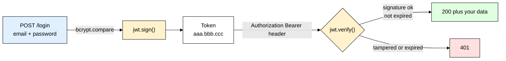
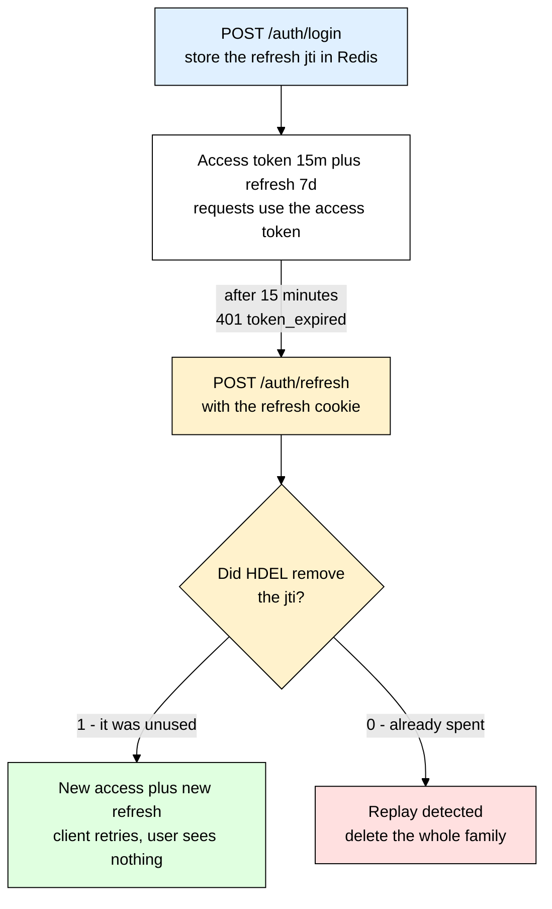
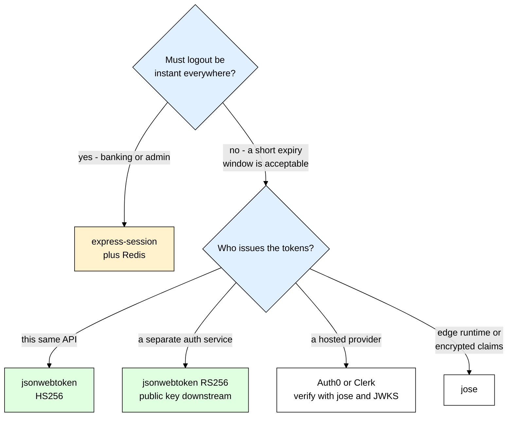

# jsonwebtoken — Stateless Login Tokens, Explained Properly

> **Scope:** The `jsonwebtoken` npm package (v9+) in Node.js/Express — signing, verifying, access vs refresh tokens, browser storage, revocation, and the classic JWT attacks.
> **Level:** Beginner + practical, with the security details a real deployment needs.
> **New to auth?** Read [[password_hashing]] and [[bcrypt]] first — JWTs are what you hand out *after* the password check passes.

---

## 1. ELI5: What is jsonwebtoken?

You built a login route. The user POSTs an email and password, you check the hash with [[bcrypt]], and it matches. Now what? The next request — `GET /orders` — arrives on a brand-new HTTP connection with no memory of what just happened. HTTP is stateless: your server has genuinely no idea this is the same person. The naive fix is to have the client send `x-user-id: 42` on every request, and that "works" until someone opens DevTools and types `x-user-id: 1`. You need the client to carry proof of identity that the client itself **cannot forge**.

Think of a music festival. At the gate, security checks your ID and ticket **once** — the slow, careful part. Then they snap a **wristband** on you: your name and access tier printed right on it, plus a tamper-evident seal. Every stage inside just glances at the band — no radio call back to the gate, no database, no queue. Three things follow, and they are exactly the three things people get wrong about JWTs:

- Anyone standing next to you can **read** what is printed on it. It is sealed, not hidden.
- The seal means you cannot **change** "General" to "VIP" without it being obvious.
- Once it is on a wrist, the gate cannot magically **remove** it. It dies when the festival ends, or every stage has to check a list of banned band numbers.

`jsonwebtoken` prints, seals, and inspects those wristbands.

> **Full name:** JSON Web Token — the token format is standardised as RFC 7519; `jsonwebtoken` is the Node implementation.
> **Type:** npm package (runtime dependency), a thin wrapper over Node's built-in `crypto`.
> **Core promise:** Hand the client a tamper-proof, self-describing token so any server instance can authenticate a request without a session lookup.



---

## 2. Why Does jsonwebtoken Exist? (The Problem It Solves)

Here is what people write before they know better:

```js
// ❌ Trust an id the client sends — anyone can edit a request header
app.get("/me", async (req, res) => {
  res.json(await User.findById(req.headers["x-user-id"])); // type "1", become the admin
});

// ❌ Hand-rolled session store in a plain Map — lives in ONE process's memory
const sessions = new Map();
app.post("/login", async (req, res) => {
  const sid = Math.random().toString(36).slice(2); // guessable, not cryptographic
  sessions.set(sid, user._id);                     // and gone on the next redeploy
  res.json({ sid });
});
```

The `Map` version dies the moment you restart the process (everyone logged out), and dies harder behind a load balancer (the second instance has never heard of that session id). Moving the `Map` into Redis fixes both — that is a real, respectable design called a **server session** — but now every single request costs a network round-trip. A JWT flips the problem: instead of the server remembering, the **token carries the facts**, and a signature proves the server itself issued them.

| Without jsonwebtoken | With jsonwebtoken |
|---|---|
| Client-supplied identity can be edited freely | Payload is signed — one changed byte and `verify()` throws |
| Session state lives in one process's memory | Nothing to store; any instance can verify with the same secret |
| Every request hits Redis/Mongo to resolve the session | Verification is pure local CPU — an HMAC, ~microseconds |
| Restarting the server logs everyone out | Tokens survive restarts and deploys |
| Sharing login state across services means sharing a session DB | Any service holding the secret (or public key) can verify independently |
| You invent your own token format and get it subtly wrong | A standard format every language and gateway already understands |

The trade you accept in return: **you cannot un-issue a token before it expires**. Section 8 is entirely about living with that.

---

## 3. Installing & Basic Usage

```bash
npm install jsonwebtoken
npm install --save-dev @types/jsonwebtoken   # only if you use TypeScript
```

The smallest thing that works:

```js
import jwt from "jsonwebtoken";

// A long random string from your environment — never a literal in the repo. See [[dotenv]].
const SECRET = process.env.JWT_SECRET;

// Sign: turn facts about the user into a sealed token.
// "sub" is the standard claim for WHO the token is about; expiresIn stamps iat + exp.
const token = jwt.sign({ sub: "user_123", role: "admin" }, SECRET, { expiresIn: "15m" });

// Verify: prove we issued it, it was not edited, and it has not expired.
const claims = jwt.verify(token, SECRET, { algorithms: ["HS256"] });
console.log(claims.sub, claims.exp);  // "user_123" 1766000900 <- UNIX seconds, not ms
```

### CommonJS version

```js
const jwt = require("jsonwebtoken");
const token = jwt.sign({ sub: "user_123" }, process.env.JWT_SECRET, { expiresIn: "15m" });
const claims = jwt.verify(token, process.env.JWT_SECRET, { algorithms: ["HS256"] });
```

### Express example

```js
import bcrypt from "bcrypt";
import jwt from "jsonwebtoken";
import User from "./models/User.js";      // a Mongoose model — see [[mongoose]]
import { requireAuth } from "./auth.js";  // built in section 5

app.post("/login", async (req, res) => {
  const user = await User.findOne({ email: req.body.email });

  // One combined check, so a wrong email and a wrong password fail identically —
  // otherwise you leak which emails are registered.
  if (!user || !(await bcrypt.compare(req.body.password, user.passwordHash))) {
    return res.status(401).json({ error: "invalid_credentials" });
  }

  // Only put claims you would happily print on a billboard in here.
  const token = jwt.sign({ sub: user.id, role: user.role },
    process.env.JWT_SECRET, { expiresIn: "15m" });
  res.json({ token });
});

// requireAuth already proved who this is — no second password check.
app.get("/me", requireAuth, async (req, res) => {
  res.json(await User.findById(req.user.id).select("-passwordHash"));
});
```

That's the entire mental model — `jwt.sign()` once at login, `jwt.verify()` on every protected request, and nothing stored in between. Everything past this point is about doing those two calls *safely*.

---

## 4. What a JWT Actually Is (Signed, Not Encrypted)

A JWT is three chunks of **base64url** text glued with dots:

```
eyJhbGciOiJIUzI1NiJ9 . eyJzdWIiOiJ1c2VyXzEyMyJ9 . 7hK2QmR9x...
└─── header ───┘       └─── payload ───┘          └ signature ┘
```

- **Header** — `{"alg":"HS256","typ":"JWT"}`. Which algorithm sealed this.
- **Payload** — `{"sub":"user_123","role":"admin","iat":1766000000,"exp":1766000900}`. The claims.
- **Signature** — `HMAC-SHA256(base64url(header) + "." + base64url(payload), secret)`.

To verify, the server recomputes that HMAC from the header and payload it just received and compares it to the third chunk. Match means the claims are trustworthy; anything else throws `JsonWebTokenError: invalid signature`.

### The single most important sentence in this file

**A JWT is signed, not encrypted.** base64url is not encryption — it is not even obfuscation. Anyone who holds the token can read every claim in it, with no secret, in one line of code:

```js
JSON.parse(atob(token.split(".")[1]));                                 // browser: no key
JSON.parse(Buffer.from(token.split(".")[1], "base64url").toString());  // Node: same thing
```

> ⚠️ **Never put anything sensitive in a JWT payload.** No passwords, no hashes, no API keys, no card numbers, no PII you would not email in plain text. The signature stops *editing*, never *reading*.

What the signature buys you is **integrity**: change `"role":"user"` to `"role":"admin"` and the recomputed HMAC no longer matches, so `verify()` throws — an attacker cannot produce a valid signature without the secret. A separate standard, **JWE**, does encrypt the payload; `jsonwebtoken` does not implement it. If you truly need hidden claims, look them up by `sub` on the server instead, or use `jose`.

### decode is not verify

```js
jwt.decode(token);                                    // ❌ reads the payload, checks NOTHING
jwt.verify(token, SECRET, { algorithms: ["HS256"] }); // ✅ the only function that authenticates
```

`jwt.decode()` will happily parse a token a stranger typed by hand. Use it in exactly two places: a debug script, and peeking at the header's `kid` before you know which key to verify with (section 11).

---

## 5. sign, verify, and a Real Auth Middleware

### Registered claims

The spec reserves a handful of short claim names. Use them instead of inventing `userId` or `expiresAt` — every JWT tool on earth already understands these:

| Claim | Means | How you set it in `jsonwebtoken` |
|---|---|---|
| `sub` | **Subject** — who the token is about (your user id) | payload `{ sub }`, or the `subject` option |
| `iat` | **Issued at** (UNIX seconds) | automatic |
| `exp` | **Expires at** (UNIX seconds) | `expiresIn: "15m"` |
| `nbf` | **Not before** — invalid until this time | `notBefore: "5s"` |
| `iss` | **Issuer** — which service minted it | `issuer: "my-api"` |
| `aud` | **Audience** — which service may consume it | `audience: "my-app"` |
| `jti` | **JWT ID** — unique id for this one token, used for revocation | `jwtid: someUuid` |

`iss` and `aud` matter more than beginners think: they stop a token minted by *staging*, or by a different internal service sharing a secret, from being accepted here. `verify()` only enforces them if you pass the matching options.

```js
import crypto from "node:crypto";

const token = jwt.sign({ sub: user.id, role: user.role }, process.env.JWT_ACCESS_SECRET, {
  expiresIn: "15m",                            // short — see section 6 for why
  issuer: "my-api", audience: "my-app",        // who minted it, who may consume it
  jwtid: crypto.randomUUID(),                  // lets you deny-list this exact token
});
```

### The errors verify throws

`jwt.verify()` never returns `null` on failure — it **throws**, and the error class tells you what to do:

| Error | Typical `message` | What it means | Right response |
|---|---|---|---|
| `TokenExpiredError` | `jwt expired` | Signature was fine, `exp` has passed. Carries `.expiredAt` | `401` with a distinct code so the client knows to hit `/auth/refresh` |
| `NotBeforeError` | `jwt not active` | `nbf` is in the future. Carries `.date` | `401` |
| `JsonWebTokenError` | `invalid signature`, `jwt malformed`, `jwt audience invalid` | Forged, corrupted, or aimed at someone else | `401`, and log it — this one is often an actual attack |

`TokenExpiredError` and `NotBeforeError` both extend `JsonWebTokenError`, so **check them first**.

### The middleware you'll reuse in every project

```js
// auth.js
import jwt from "jsonwebtoken";

export function requireAuth(req, res, next) {
  // "Authorization: Bearer eyJhbGci..." — reject the shape before touching crypto.
  const [scheme, token] = (req.headers.authorization ?? "").split(" ");
  if (scheme !== "Bearer" || !token) {
    return res.status(401).json({ error: "missing_token" });
  }
  try {
    const claims = jwt.verify(token, process.env.JWT_ACCESS_SECRET, {
      algorithms: ["HS256"],  // pin it — section 8 explains the attacks this blocks
      issuer: "my-api", audience: "my-app",
    });
    // Attach only what your handlers need. Do NOT trust anything else in the token.
    req.user = { id: claims.sub, role: claims.role };
    next();
  } catch (err) {
    // Distinct code on expiry so the frontend refreshes instead of bouncing to /login.
    // Everything else is indistinguishable from an attack — stay vague to the client.
    const error = err instanceof jwt.TokenExpiredError ? "token_expired" : "invalid_token";
    return res.status(401).json({ error });
  }
}

// Authorization is a separate concern from authentication — keep them separate.
export function requireRole(...roles) {
  return (req, res, next) =>
    roles.includes(req.user?.role) ? next() : res.status(403).json({ error: "forbidden" });
}

// Use them together: app.delete("/users/:id", requireAuth, requireRole("admin"), handler);
```

**Rule of thumb:** `401` means "I don't know who you are" (fix it with a token). `403` means "I know exactly who you are and you still can't" (a new token will not help).

---

## 6. Access Tokens vs Refresh Tokens

If a token cannot be revoked, a 30-day token is a 30-day window for whoever steals it. If you instead issue a 15-minute token, users get logged out four times an hour. Neither is acceptable, so real systems issue **two** tokens with different jobs:

| | Access token | Refresh token |
|---|---|---|
| Lifetime | **5–15 minutes** | 7–30 days |
| Sent with | every API request | only `POST /auth/refresh` |
| Verified by | pure signature check, no DB | signature check **plus** a store lookup |
| Stored server-side? | no | **yes** — that is what makes it revocable |
| If stolen | attacker has minutes | attacker has your account — so guard it harder |

The insight: the token flying around everywhere is short-lived, so its blast radius is small. The long-lived one moves rarely, down one narrow path, and **is** tracked server-side — so you can kill it. Statelessness on the hot path, revocability on the cold one.



### Rotation, and why deleting is the whole trick

**Refresh token rotation** means each refresh call burns the old token and issues a new one. The store operation is a *delete*, and Redis reports how many fields it actually removed — so the delete **is** the check. Removed nothing? That token was already used, meaning someone is replaying a stolen copy, and the right response is to revoke the whole family.

```js
import jwt from "jsonwebtoken";
import Redis from "ioredis";           // see [[ioredis]]
import crypto from "node:crypto";
import User from "./models/User.js";
const redis = new Redis(process.env.REDIS_URL);
const REFRESH_TTL = 7 * 24 * 60 * 60;               // seconds
const familyKey = (userId) => `refresh:${userId}`;  // one hash per user, field = jti

async function issueRefreshToken(userId) {
  const jti = crypto.randomUUID();
  const token = jwt.sign({ sub: userId }, process.env.JWT_REFRESH_SECRET, {
    expiresIn: "7d", jwtid: jti,                      // jwtid writes jti into the payload
  });
  await redis.hset(familyKey(userId), jti, Date.now());
  await redis.expire(familyKey(userId), REFRESH_TTL); // dead families expire on their own
  return token;
}

app.post("/auth/refresh", async (req, res) => {
  const token = req.cookies?.refreshToken;            // req.cookies needs cookie-parser
  if (!token) return res.status(401).json({ error: "missing_refresh" });
  let claims;
  try {
    claims = jwt.verify(token, process.env.JWT_REFRESH_SECRET, { algorithms: ["HS256"] });
  } catch {
    return res.status(401).json({ error: "invalid_refresh" });
  }
  // HDEL returns how many fields it removed: 1 = valid and now consumed, 0 = reuse.
  if ((await redis.hdel(familyKey(claims.sub), claims.jti)) === 0) {
    await redis.del(familyKey(claims.sub));  // reuse detected — log them out everywhere
    return res.status(401).json({ error: "refresh_reused" });
  }
  const user = await User.findById(claims.sub);       // still exists? still allowed in?
  if (!user) return res.status(401).json({ error: "invalid_refresh" });
  setRefreshCookie(res, await issueRefreshToken(user.id)); // setRefreshCookie: section 7
  res.json({
    token: jwt.sign({ sub: user.id, role: user.role },
      process.env.JWT_ACCESS_SECRET, { expiresIn: "15m" }),
  });
});
```

Logging out is the same delete without the reissue: `await redis.del(familyKey(req.user.id))` plus `res.clearCookie("refreshToken", { path: "/auth/refresh" })`. Nothing else logs a JWT user out. And sign the two token types with **two different secrets** — otherwise a refresh token, which you deliberately made long-lived, is also a perfectly valid access token, and the whole scheme collapses.

---

## 7. Where to Store the Token in the Browser

This is where most JWT tutorials quietly hand you a vulnerability. There is no option with zero downside; pick the one whose downside you can actually mitigate.

| Storage | Survives refresh? | Readable by XSS? | Sent automatically? | Verdict |
|---|---|---|---|---|
| `localStorage` | yes | **yes — one line of injected JS steals it** | no, you attach it manually | Convenient and the most common. Every npm dependency you ship is a potential thief |
| `sessionStorage` | per-tab only | **yes** | no | Same XSS exposure, worse UX |
| **httpOnly cookie** | yes | **no — JS literally cannot read it** | yes, on every matching request | **Recommended for browser apps**, with `Secure` and `SameSite` |
| In-memory JS variable | **no** — gone on refresh | only while the page is open | no | Best for the *access* token, paired with a cookie-based refresh call on page load |

The honest trade: `localStorage` is exposed to **XSS**, cookies are exposed to **CSRF** — but CSRF has a complete, boring, one-line fix (`SameSite`), while XSS token theft has no fix once script runs on your origin. The attacker just reads the token and walks away.

```js
// The recommended browser setup
function setRefreshCookie(res, token) {
  res.cookie("refreshToken", token, {
    httpOnly: true,                  // JavaScript cannot read it — kills XSS token theft
    secure: true,                    // HTTPS only (set false on localhost dev)
    sameSite: "strict",              // not sent cross-site — kills CSRF
    path: "/auth/refresh",           // never sent elsewhere, so it cannot leak in logs
    maxAge: 7 * 24 * 60 * 60 * 1000, // milliseconds here, unlike exp which is seconds
  });
}
```

**Rule of thumb:**
- **Browser SPA** → refresh token in an httpOnly `Secure` `SameSite` cookie, access token in a plain JS variable in memory. On page load, call `/auth/refresh` once to get a fresh access token. Nothing durable is ever reachable from JS.
- **Cross-origin frontend** (app on `app.com`, API on `api.com`) → `sameSite: "none"` is required, which re-opens CSRF, so add a CSRF token or a custom header. Configure [[cors]] with `credentials: true` and an explicit origin, never `*`.
- **Mobile, server-to-server, CLI** → no cookies, no browser, no XSS. Use `Authorization: Bearer` plus the platform keystore.

---

## 8. Revocation and the Classic Attacks

### The revocation problem

`verify()` is a pure function of the token and the secret. It cannot know you fired that employee ten seconds ago. Until `exp` passes, the token is valid — that is the price of statelessness. Three strategies, and real apps use one or two of them:

| Strategy | How it works | Cost |
|---|---|---|
| **Short expiry** (always do this) | 15-minute access tokens; revocation happens at the next refresh, which you *can* block | Nearly free, but leaves a 15-minute window |
| **Denylist in Redis** | Store the `jti` of every revoked token with a TTL equal to its remaining life | One Redis lookup per request — you gave back some statelessness, but the key set stays tiny because entries self-expire |
| **Token version** | A `tokenVersion` integer on the user document; put it in the payload and bump it on password change or "log out everywhere" | Needs a user read per request unless you cache it. Simple and very effective |

```js
// Denylist one specific access token (requires jwtid at sign time).
// TTL = remaining lifetime, so the entry evaporates when the token dies anyway.
const secondsLeft = claims.exp - Math.floor(Date.now() / 1000);   // exp is SECONDS
if (secondsLeft > 0) await redis.set(`deny:${claims.jti}`, "1", "EX", secondsLeft);
// ...and in requireAuth, right after verify() succeeds:
if (await redis.exists(`deny:${claims.jti}`)) return res.sendStatus(401);
```

> ⚠️ Changing a password does **not** invalidate existing tokens. Neither does deleting the user row, unless a handler happens to look them up. If "change password logs out other devices" is a requirement — and it should be — you need `tokenVersion` or a denylist. Nothing about JWTs gives you this for free.

### Two attacks that both start in the header

The header declares the algorithm, and the header is attacker-controlled. Naive libraries read `alg` and do what it says. **The `alg: none` attack:** the attacker rewrites the header to `{"alg":"none"}`, edits the payload to `"role":"admin"`, deletes the signature, and leaves the trailing dot — a library that trusts the header verifies "no signature" against "no signature" and returns success.

**RS256 to HS256 confusion** is subtler and nastier. You verify with an RSA **public** key — public by definition, often published at a JWKS endpoint. The attacker takes that public key, signs a forged token with **HS256** using the public key text as the HMAC *secret*, and sets `alg: HS256`. A library that picks its algorithm from the header HMACs with the key you handed it, the key matches, and the forged admin token is accepted.

### The fix for both is the same one line

```js
jwt.verify(token, key, { algorithms: ["HS256"] });  // ✅ the header's alg is now just a claim
jwt.verify(token, key);                            // ❌ don't — be explicit anyway
```

`jsonwebtoken` defends you on both counts already: it rejects an unsigned token whenever you pass a key (`jwt signature is required`), and since v9 it turns your key into a `KeyObject` and refuses to use an asymmetric public key with an `HS*` algorithm at all — which is structurally what breaks the confusion attack. **Pass `algorithms` explicitly anyway.** It costs nothing, and it still protects you when the code is ported, a dependency is downgraded, or a colleague swaps HS256 for RS256 next quarter.

### Weak secrets are the other half of the story

An HS256 token is an offline-crackable artifact: an attacker holding one valid token can try billions of candidate secrets per second on a GPU, sending zero requests to your server. `"secret"`, `"jwtsecret123"`, and your project name all fall in under a second.

```bash
# Generate a real one — 64 random bytes, then paste it into .env
node -e "console.log(require('crypto').randomBytes(64).toString('hex'))"
```

Keep it in `.env` (see [[dotenv]]), keep `.env` out of git, use a different secret per environment, and treat a leaked secret as a full compromise: rotating it invalidates every token in circulation, which is exactly what you want.

---

## 9. HS256 vs RS256

`alg` picks the family. There are two that matter:

| | HS256 (HMAC + SHA-256) | RS256 (RSA signature) |
|---|---|---|
| Keys | **one shared secret** — signs and verifies | **private key signs, public key verifies** |
| Who can mint tokens | anyone who can verify | only the holder of the private key |
| Speed | very fast | slower to sign, fine to verify |
| Setup | a string in `.env` | generate a keypair, ship the public half |
| Use when | **one service, or services you fully trust, issues and consumes** | a separate auth service, third parties, or public verification |

```bash
openssl genpkey -algorithm RSA -pkeyopt rsa_keygen_bits:2048 -out private.pem
openssl rsa -pubout -in private.pem -out public.pem
```

```js
import fs from "node:fs";
const token = jwt.sign({ sub: user.id }, fs.readFileSync("./private.pem"), {
  algorithm: "RS256",  // must be explicit — the default is HS256
  expiresIn: "15m",
});

// Downstream services verify with ONLY the public key — they can never forge a token.
const claims = jwt.verify(token, fs.readFileSync("./public.pem"), { algorithms: ["RS256"] });
```

**Rule of thumb:** a single monolithic API? **HS256** with a strong secret — simpler, faster, one thing to keep safe. The moment a second service needs to verify tokens it did not issue, switch to RS256 so you are distributing a public key instead of a minting key. Auth0, Google, and Firebase all issue RS256 for exactly this reason.

---

## 10. TypeScript Version

```ts
// auth.ts
import type { Request, Response, NextFunction } from "express";
import jwt, { type JwtPayload, type SignOptions, type VerifyOptions } from "jsonwebtoken";

type Role = "user" | "admin";
// Extend the claim type instead of reaching for `any` on the verify result.
interface AccessClaims extends JwtPayload { sub: string; role: Role }

// `declare global` needs this file to be a module — the imports above already make it one.
declare global {
  namespace Express {
    interface Request { user?: { id: string; role: Role } }
  }
}

// process.env values are `string | undefined` — assert once at boot, never per request.
const SECRET = process.env.JWT_ACCESS_SECRET;
if (!SECRET) throw new Error("JWT_ACCESS_SECRET is not set");
// Sign and verify take DIFFERENT option types — `expiresIn` means nothing to verify().
// Typing them also keeps `expiresIn` off the string-literal cliff (see gotchas).
const SIGN_OPTIONS: SignOptions = { expiresIn: "15m", issuer: "my-api", audience: "my-app" };
const VERIFY_OPTIONS: VerifyOptions = { algorithms: ["HS256"], issuer: "my-api", audience: "my-app" };

export function signAccessToken(userId: string, role: Role): string {
  return jwt.sign({ role }, SECRET, { ...SIGN_OPTIONS, subject: userId });
}

export function requireAuth(req: Request, res: Response, next: NextFunction): void {
  const [scheme, token] = (req.headers.authorization ?? "").split(" ");
  if (scheme !== "Bearer" || !token) {
    res.status(401).json({ error: "missing_token" });
    return;                                      // note: void return, not `return res...`
  }
  try {
    // verify() is typed `string | JwtPayload`, so narrow before touching any claim.
    const decoded = jwt.verify(token, SECRET, VERIFY_OPTIONS);
    if (typeof decoded === "string" || !decoded.sub) {
      res.status(401).json({ error: "invalid_token" });
      return;
    }
    const claims = decoded as AccessClaims;
    req.user = { id: claims.sub, role: claims.role };
    next();
  } catch (err) {
    // TokenExpiredError extends JsonWebTokenError, so it must be checked first.
    const error = err instanceof jwt.TokenExpiredError ? "token_expired" : "invalid_token";
    res.status(401).json({ error });
  }
}
```

Validate the login body with [[zod]] before any of this runs — `req.body.password` is `any` until something proves otherwise, and `bcrypt.compare(undefined, hash)` throws a 500 where you wanted a 400.

---

## 11. Production Setup

```bash
# .env — never committed. See [[dotenv]].
JWT_ACCESS_SECRET=<64 random bytes, hex>
JWT_REFRESH_SECRET=<a DIFFERENT 64 random bytes>
JWT_ISSUER=my-api
JWT_AUDIENCE=my-app
REDIS_URL=redis://localhost:6379
```

- **Fail fast at boot.** Read and validate every JWT env var at startup, not inside a request handler. A missing secret should crash the deploy, not silently surface as a 500 on `/login` at 3am.
- **Separate secrets per token type and per environment.** Staging tokens must never work in production — `iss` and `aud` are your second line of defence there.
- **Clock skew.** Two machines drifting a few seconds will reject freshly minted tokens. `clockTolerance: 5` in the verify options buys five seconds of slack; do not set it high, you are widening the expiry window.
- **Rate limit `/login` and `/auth/refresh`.** Signature checks are cheap, but password checks are deliberately slow — [[express_rate_limit]] in front of both keeps a credential-stuffing bot from becoming a CPU bill.
- **Always HTTPS.** A Bearer token on plain HTTP is a password shouted across the room. Add [[helmet]] for HSTS, and set `app.set("trust proxy", 1)` behind a load balancer so `secure` cookies work.
- **Log auth failures, never tokens.** Log `invalid signature` with the IP and route; a spike is an attack in progress. Never log the token itself or `req.headers.authorization` — see [[winston_morgan]] for redaction.
- **Keep the payload small.** The token rides in a header on every request, and proxies commonly cap headers around 8KB. Store `sub` and `role`, not the user's profile.
- **Key rotation with `kid`.** Sign with `{ keyid: "k2" }`, keep the previous key alive for one token lifetime, and on the way in read `jwt.decode(token, { complete: true })?.header.kid` to choose the key from a hard-coded map — a whitelist lookup, never a file path, and never a default fallback if the `kid` is unknown. Then `jwt.verify()` as usual.

---

## 12. Common Gotchas & Best Practices

| Gotcha | Fix |
|---|---|
| **Using `jwt.decode()` to authenticate** | `decode()` parses without checking the signature — a hand-typed token passes. Only `jwt.verify()` authenticates. Use `decode()` solely to read the header's `kid` before key lookup. |
| **`exp` and `iat` are seconds, `Date.now()` is milliseconds** | Comparing them directly makes every token look ~50,000 years old. Use `Math.floor(Date.now() / 1000)`. Cookie `maxAge`, confusingly, *is* milliseconds. |
| **`expiresIn: 900` meant as 15 minutes but written `"900"`** | A bare **number is seconds**; a **string is parsed by `ms`** (`"15m"`, `"7d"`, `"2h"`). `"900"` as a string means 900 **milliseconds** — quote it and you have shipped a token that expires instantly. |
| **`Bad "options.expiresIn" ... payload already has an "exp" property`** | You set `exp` yourself *and* passed `expiresIn`. Pick one — let the library do it. Same clash for `iss`/`issuer`, `aud`/`audience`, `sub`/`subject`, `jti`/`jwtid`. |
| **`invalid expiresIn option for string payload`** | `expiresIn` only works when the payload is an **object**. `jwt.sign("hello", secret, { expiresIn: "1h" })` throws — wrap it: `{ data: "hello" }`. |
| **Storing the token in `localStorage` "for now"** | Any XSS — including from a compromised npm dependency — reads it in one line, and "for now" never gets fixed. Start with an httpOnly cookie for the refresh token (section 7). |
| **Same secret for access and refresh tokens** | Then a 7-day refresh token is also a valid 7-day *access* token, and short expiry bought you nothing. Two env vars, two secrets. |
| **TypeScript: `Type 'string' is not assignable to type 'StringValue \| number'`** | Recent `@types/jsonwebtoken` types `expiresIn` with the `ms` string-literal union, so `process.env.JWT_TTL` (plain `string`) is rejected. Use a literal `"15m"`, a typed `SignOptions` object, or a number of seconds. |

---

## 13. Alternatives — When jsonwebtoken Isn't the Best Fit

| Option | What it is | Best for |
|---|---|---|
| **`jsonwebtoken`** | The default Node JWT library. Callback-era API, CommonJS core, enormous install base. | **Ordinary Express APIs.** Every tutorial, answer, and colleague already knows it. |
| **`jose`** | Modern JWT/JWS/JWE/JWKS library. ESM, promise-based, built on Web Crypto, runs in Node, Deno, Bun, Cloudflare Workers and browsers. Can actually **encrypt** payloads. | Edge runtimes, JWKS-based verification of third-party tokens, or when you need JWE. |
| **`express-session` + `connect-redis`** | Classic server sessions: an opaque id in a cookie, real state in Redis. | Anything where **instant revocation** matters more than avoiding a lookup — banking, admin panels, "log out all devices" as a headline feature. |
| **Passport.js** | Strategy framework wrapping hundreds of auth providers (Google, GitHub, SAML). Its `passport-jwt` strategy verifies with `jsonwebtoken` underneath. | Social login and multi-provider auth. Overkill if you only have email plus password. |
| **Auth0 / Clerk / Supabase Auth / Cognito** | Hosted identity. They mint RS256 JWTs; you only ever verify with their public JWKS. | Teams who should not be writing password reset, MFA, and device management by hand. |
| **PASETO** | A deliberate JWT replacement with no `alg` header — the version *is* the algorithm, so alg-confusion attacks are structurally impossible. | Greenfield systems where you control both ends and want fewer footguns. |

The moment you add a denylist or a refresh-token store, you have re-introduced the lookup you switched to JWTs to avoid — on *some* requests. That is fine, and it is the standard design. But if you find yourself hitting Redis on **every** request anyway, plain server sessions were the simpler answer all along: they cost one lookup, revoke instantly by deleting a row, and never expose a payload to the client.



---

## 14. Interview Questions

**Q: Is a JWT encrypted?**
A: No — it is **signed**. The header and payload are base64url-encoded, which is reversible by anyone with `atob()` and no key at all. The signature guarantees integrity (nobody edited it) and authenticity (your server issued it), never confidentiality. That is why you never put a password, key, or sensitive PII in the payload.

**Q: Why use a short-lived access token plus a refresh token instead of one long-lived token?**
A: A JWT cannot be un-issued, so its lifetime is the attacker's window if it is stolen. Access tokens live 5–15 minutes and travel on every request, keeping the blast radius small; refresh tokens are long-lived but travel only to `/auth/refresh` and are tracked server-side, so they can be revoked. You get stateless verification on the hot path and real revocation on the cold path.

**Q: How do you log a user out if JWTs are stateless?**
A: Deleting the client's copy is not revocation — a stolen copy still verifies. The real options are short expiry plus refusing the next refresh, a Redis denylist keyed by `jti` with a TTL equal to the token's remaining life, or a `tokenVersion` counter on the user record that you bump on password change and compare during verification. The first is free; the other two trade a lookup for immediacy.

**Q: What is the `alg: none` attack, and how do you stop it?**
A: The `alg` field lives in the attacker-controlled header. A library that trusts it can be handed a token with `alg: none` and no signature, edited to say `role: admin`, and it verifies "nothing" against "nothing". You stop it by pinning `algorithms: ["HS256"]` in `jwt.verify()` so the header's claim is ignored; `jsonwebtoken` also rejects an unsigned token outright when you pass a key, but pinning is the habit to keep.

**Q: When would you pick RS256 over HS256?**
A: HS256 uses one shared secret, so anyone who can verify can also mint tokens. RS256 splits that: the private key signs, the public key only verifies. Use RS256 as soon as a second service, a third party, or an edge function needs to verify tokens it should never be able to issue — which is exactly why identity providers like Auth0 and Firebase issue RS256.

**Q: `localStorage` or cookie for the token?**
A: `localStorage` is readable by any XSS, including one from a compromised dependency, and there is no mitigation once script runs on your origin. An `httpOnly` cookie is invisible to JavaScript but is sent automatically, which exposes CSRF — and CSRF has a real fix in `SameSite=Strict` plus `Secure`. For browsers, keep the refresh token in the cookie and the access token in memory; for mobile and server-to-server, use the `Authorization: Bearer` header.

**Q: When are server sessions the better choice?**
A: When instant revocation matters more than avoiding a lookup — admin tools, banking, anything where "sign out everywhere" must be immediate. Sessions store opaque ids, so nothing leaks to the client and deleting one row ends the session. JWTs win when you are stateless across many instances, serving mobile clients, or passing identity between services.

---

## 15. Quick Cheat Sheet

```bash
npm install jsonwebtoken
npm install --save-dev @types/jsonwebtoken
# Generate a real secret for .env
node -e "console.log(require('crypto').randomBytes(64).toString('hex'))"
```

```js
// Sign
const token = jwt.sign({ sub: user.id, role: user.role }, process.env.JWT_ACCESS_SECRET, {
  expiresIn: "15m", issuer: "my-api", audience: "my-app", jwtid: crypto.randomUUID(),
});

// Verify — ALWAYS pin the algorithm
const claims = jwt.verify(token, process.env.JWT_ACCESS_SECRET, {
  algorithms: ["HS256"], issuer: "my-api", audience: "my-app",
});

// Read without verifying (debugging only) — no key needed, which is the whole point
jwt.decode(token, { complete: true });  // { header, payload, signature }

// Errors — TokenExpiredError extends JsonWebTokenError, so check it first
if (err instanceof jwt.TokenExpiredError) return res.status(401).json({ error: "token_expired" });

// Refresh cookie — the recommended browser storage
res.cookie("refreshToken", refreshToken, {
  httpOnly: true, secure: true, sameSite: "strict", path: "/auth/refresh",
  maxAge: 7 * 24 * 60 * 60 * 1000,
});
```

**Mental model to remember:**
> A JWT is a sealed festival wristband: the server prints your id and expiry on it, seals it so nobody can edit it, and then never has to phone home again — but anyone can read it, and it cannot be pulled off a wrist early. So keep the payload boring, keep access tokens to 15 minutes, pin `algorithms` on every `verify()`, and put the revocable half — the refresh token — in an httpOnly cookie plus a store you control. Pair it with [[bcrypt]] at the login gate, [[ioredis]] for rotation and denylists, [[zod]] on the request body, and a long random secret from [[dotenv]] — and see [[express]] for where the middleware sits in the stack.
