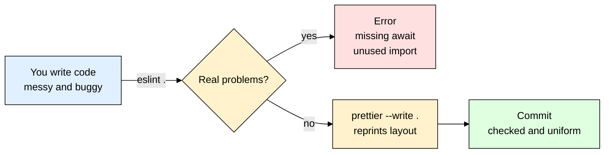
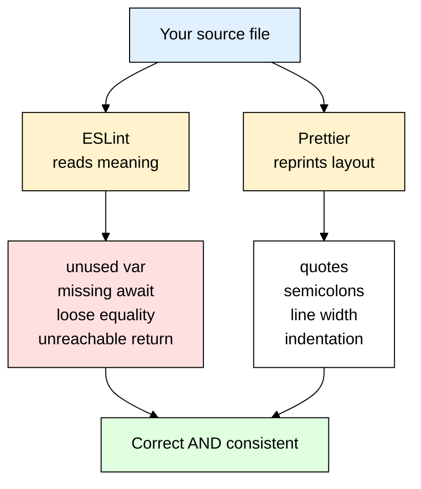
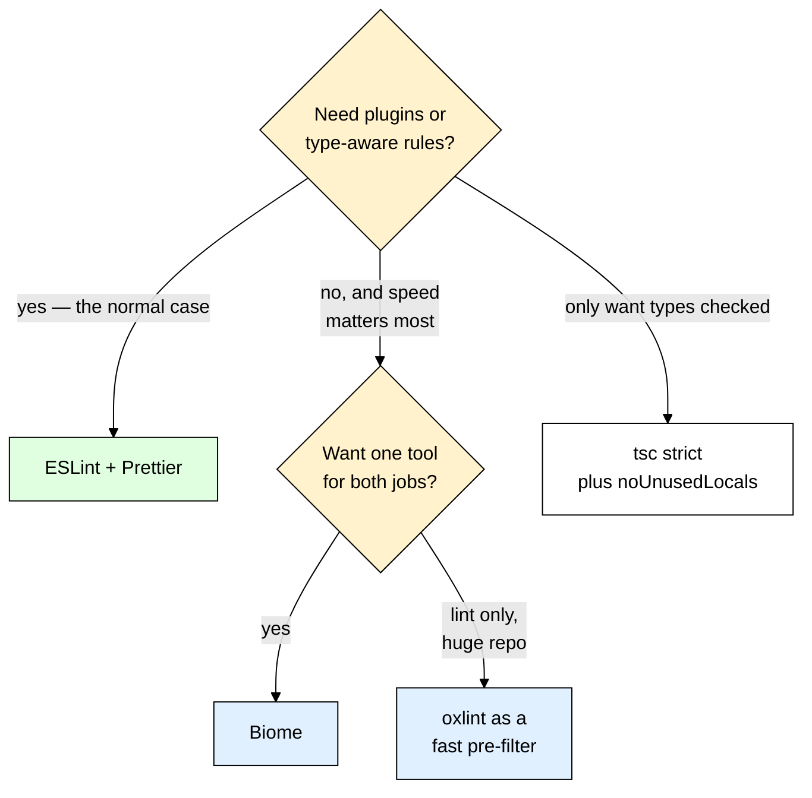

# eslint + prettier — Catching Bugs and Ending Style Arguments Automatically

> **Scope:** ESLint 9+ flat config (`eslint.config.js`), Prettier 3+, `eslint-config-prettier`, `typescript-eslint`, and how to wire all of it into scripts, your editor, CI, and commit hooks for a Node/Express project.
> **Level:** Beginner + practical.
> **New to dev tooling?** Read [[nodemon]] first — same category of tool: it doesn't change what your app does, it changes how bearable it is to work on.

---

## 1. ELI5: What is eslint + prettier?

You built a login route, it works, you push it. Two days later a teammate opens a pull request and the diff is 400 lines — but you only changed 6. The rest is their editor converting every `"` into `'` and re-indenting the whole file. In the review comments there's an argument about whether the opening brace goes on the same line. Nobody has noticed the actual bug in your code yet: on line 40 you wrote `user.save()` without `await`, so the response goes out before the write lands, and roughly one signup in fifty silently disappears.

Two totally different problems, and they need two different tools. Think of publishing a book. **ESLint is the proofreader**: they read for *meaning* — this character was introduced and never used again, this sentence contradicts chapter 3, this paragraph can never be reached. **Prettier is the typesetter**: they don't care what the book says, they just reprint every page with the same margins, the same font, the same line width, so the whole book looks like one object instead of forty people's handwriting. You want both. You do not want the proofreader arguing with the typesetter about margins.

> **Type:** two separate dev dependencies — `eslint` (a static analyser) and `prettier` (a code formatter)
> **Core promise:** ESLint tells you your code is *wrong*; Prettier makes your code *look the same as everyone else's* — automatically, with no discussion.



---

## 2. Why Does eslint + prettier Exist? (The Problem It Solves)

Here is a real file from a project with no tooling. It runs. It also has four bugs and three styles of indentation:

```js
import express from "express";
import crypto from "crypto";          // imported months ago, never used
import User from './models/User.js'   // single quotes here, double quotes above

const router = express.Router()

router.post("/signup", async (req, res) => {
    const existing = await User.findOne({ email: req.body.email });
    if (existing != null) {           // != does type coercion, sloppy
      return res.status(409).send("taken")
    }
  const user = new User({ email: req.body.email });
  user.save();                        // BUG: no await — response can beat the DB write
  res.status(201).json({ id: user.id });
  return res.send("unreachable");     // BUG: dead code after a response
});

export default router
```

Nothing here throws — `node` starts happily. The unused `crypto` import costs nothing at runtime, so it lives there forever and the next person assumes it matters; the missing `await` only breaks under load; the dead `return` only confuses whoever reads it next. Every one of those is **mechanically detectable** in about 40 milliseconds, which is exactly what ESLint is for.

| The old way | With ESLint + Prettier |
|---|---|
| Style debated in code review, per pull request, forever | Style is a config file, decided once, applied by a command |
| Diffs polluted by reformatting noise | Everything is already formatted the same way, so diffs show only real changes |
| Unused imports and dead code pile up unnoticed | `no-unused-vars` and `no-unreachable` fail the build |
| Missing `await` found in production, from a support ticket | `@typescript-eslint/no-floating-promises` finds it before you commit |
| "Works on my machine" formatting from 5 different editors | One `.prettierrc`, plus a committed `.vscode/settings.json`, so every editor agrees |
| Bugs surface at test time (seconds to minutes) | Lint runs in under a second, **before** the tests — the fastest feedback loop you have (see [[jest_supertest]]) |

That last row is the underrated one. Lint is not a replacement for tests; it's the layer *below* them. It catches the class of mistake that isn't worth writing a test for, on every file, for free.

---

## 3. Installing & Basic Usage

```bash
# ESLint core, its official recommended ruleset, and environment globals
npm install --save-dev eslint @eslint/js globals
npm install --save-dev prettier eslint-config-prettier  # formatter + the config that stops them fighting
```

All of these are **dev dependencies** — they never ship to production. ESLint's entire setup then lives in one file at your project root, `eslint.config.js`, which exports an **array of config objects** applied in order, later objects overriding earlier ones:

```js
// eslint.config.js
import js from "@eslint/js";
import globals from "globals";
import prettierConfig from "eslint-config-prettier";

export default [
  // An object with ONLY `ignores` is a global ignore. Flat config never reads
  // .eslintignore, so this is the only way to exclude paths.
  { ignores: ["node_modules/**", "dist/**", "coverage/**"] },

  // ESLint's own recommended set: ~60 rules that only flag near-certain
  // mistakes (no-unreachable, no-dupe-keys, no-undef...).
  js.configs.recommended,

  {
    files: ["**/*.js"],
    languageOptions: {
      // Declares that `process`, `__dirname`, `Buffer` legitimately exist —
      // without it, `no-undef` screams about every Node built-in.
      globals: { ...globals.node },
    },
    rules: {
      eqeqeq: ["error", "always"],                              // ban == and !=
      "no-unused-vars": ["error", { argsIgnorePattern: "^_" }], // allow deliberate _args
      "no-console": ["warn", { allow: ["warn", "error"] }],     // nudge toward a real logger
    },
  },

  prettierConfig, // MUST BE LAST — turns off every rule that argues with Prettier
];
```

```bash
npx eslint .           # report problems
npx eslint . --fix     # auto-fix the mechanically fixable ones
npx prettier --write . # reformat everything Prettier owns
npx prettier --check . # report unformatted files without touching them (CI mode)
```

> ⚠️ `eslint.config.js` with `import` syntax only works if your `package.json` has `"type": "module"`. If it doesn't, either rename the file to **`eslint.config.mjs`** (recommended, works everywhere) or write it in CommonJS.

### CommonJS version

```js
// eslint.config.cjs — identical config for a project without "type": "module"
const js = require("@eslint/js");
const globals = require("globals");
const prettierConfig = require("eslint-config-prettier");

module.exports = [
  { ignores: ["node_modules/**", "dist/**"] },
  js.configs.recommended,
  { files: ["**/*.js"], languageOptions: { globals: { ...globals.node } } },
  prettierConfig, // still last
];
```

### Express example

Save this as `src/routes/users.js` in a project using the config above:

```js
import express from "express";
import User from "../models/User.js";

const router = express.Router();

router.post("/signup", async (req, res) => {
  const existing = await User.findOne({ email: req.body.email });
  if (existing) return res.status(409).json({ error: "Email taken" });

  // `await` matters: without it the 201 can be sent before Mongo confirms the write
  const user = await User.create({ email: req.body.email });
  res.status(201).json({ id: user.id });
});

export default router;
```

Now break it on purpose — change `if (existing)` to `if (existing != null)` and add an unused `import crypto from "crypto";` at the top. `npx eslint .` prints:

```
  2:8   error  'crypto' is defined but never used  no-unused-vars
  8:19  error  Expected '!==' and instead saw '!='  eqeqeq
```

`npx eslint . --fix` rewrites `!=` into `!==` (that rule is auto-fixable) but leaves the unused import for you — removing code is never auto-fixed, it's too dangerous. Delete the `await` on `User.create` and nothing fires at all: that check needs type information, which is section 7.

That's the entire mental model — ESLint reads your code and reports meaning-level problems, Prettier rewrites your code so it looks identical to everyone else's, and `eslint-config-prettier` sits at the end of the ESLint config making sure the two never argue about the same thing.

---

## 4. Lint Is Not Format — The Distinction That Explains Everything

Almost every confusing thing about this pair comes from mixing up two jobs that sound similar and are not.

| | ESLint | Prettier |
|---|---|---|
| **Question it answers** | "Is this code *wrong*?" | "Does this code *look* like the rest?" |
| **Reads** | The AST plus scope, and optionally type information | The AST only — it throws away your original formatting entirely |
| **Catches** | Unused variables, undefined variables, `==`, unreachable code, missing `await`, `case` fallthrough, unsafe regex | Nothing. It is not a checker. |
| **Decides** | Nothing about appearance (once wired correctly) | Quotes, semicolons, line width, indentation, bracket spacing, trailing commas |
| **Configurability** | Hundreds of rules, each on/warn/error, plus plugins | Deliberately tiny option list — that is the product |
| **Fixes** | `--fix` fixes only the subset of rules marked fixable | `--write` reformats 100% of what it owns, always |

The bit people miss: **Prettier does not "fix" your formatting, it discards it.** It parses your file into a syntax tree, throws the original text away, and prints a brand new file from that tree. That's why it's so consistent, and why it has almost no options — every option is a decision the team would otherwise have to argue about, and not having that argument is the entire product.

The collision is that ESLint *also* historically shipped formatting rules (`indent`, `quotes`, `semi`, `comma-dangle`). If both tools have an opinion about indentation you get an infinite loop: Prettier writes 2 spaces, ESLint errors demanding 4, you fix it, Prettier changes it back on save. Those core stylistic rules are deprecated and frozen in ESLint precisely because Prettier does the job better — but they still exist, and old blog posts still tell you to turn them on. Don't.



**Rule of thumb:** if a disagreement about it could never cause a bug, it belongs to Prettier. If it could, it belongs to ESLint.

---

## 5. ESLint Flat Config, Rule by Rule

### Flat config is the modern default — `.eslintrc` is legacy

If a tutorial tells you to create `.eslintrc.json` with `"extends": ["eslint:recommended"]` and an `"env"` block, it was written for ESLint 8 or earlier. That system is **legacy**: ESLint 9 made flat config (`eslint.config.js`) the default and eslintrc support is being removed. Don't mix the two — one project, one `eslint.config.js`. Why it matters practically: the old format had magic string resolution (`"extends": "airbnb"` meant "go find a package called `eslint-config-airbnb` somewhere in node_modules"), cascading files in every subdirectory, and its own `.eslintignore`. Flat config is just a JavaScript array — you `import` what you want, you can `console.log` it, and the file that runs is the file you're looking at.

### The shape of a config object

```js
{
  files: ["src/**/*.js"],       // which files this object applies to (glob)
  ignores: ["src/legacy/**"],   // exceptions inside that set
  languageOptions: {
    sourceType: "module",       // default for .js/.mjs; .cjs defaults to "commonjs"
    globals: { ...globals.node },
  },
  linterOptions: { reportUnusedDisableDirectives: "error" }, // stale disables fail
  plugins: { /* name: pluginObject */ },
  rules: { /* ruleName: severity or [severity, options] */ },
}
```

Objects apply **in array order**, and a later object's `rules` override an earlier one's for any file matching both. That is the single most important mechanic in flat config — it's why `eslint-config-prettier` goes last, and why "extending" is just "putting the shared object earlier in the array." (ESLint 9.23+ also ships a `defineConfig` helper — `import { defineConfig } from "eslint/config"` — which wraps the array and adds editor autocomplete plus an `extends` key. A plain array behaves identically.)

### Severity: `"off"` / `"warn"` / `"error"`

| Severity | Numeric | Exit code | Use it for |
|---|---|---|---|
| `"off"` | `0` | — | Turning off a rule inherited from a preset |
| `"warn"` | `1` | 0 (build still passes) | Nits, gradual migrations, things you want visible but not blocking |
| **`"error"`** | `2` | **1 (build fails)** | **Anything that is or could become a bug** |

The trap: warnings are free to ignore, so a codebase with 300 warnings has effectively zero linting. Two habits keep it honest — run CI with `--max-warnings 0` so warnings block merges anyway, and use `"warn"` only as a temporary state while you clean up an existing violation.

### Rules that earn their keep

```js
rules: {
  // `_`-prefixed names are the standard escape hatch for "required but unused"
  "no-unused-vars": ["error", { argsIgnorePattern: "^_", caughtErrorsIgnorePattern: "^_" }],
  "no-undef": "error",                  // typos: `respose.json()` errors here, not at 2am
  eqeqeq: ["error", "always"],          // `0 == "0"` and `null == undefined` are both true
  "require-await": "error",             // `async` with nothing awaited is a refactor leftover
  "no-async-promise-executor": "error", // `new Promise(async () => ...)` swallows throws
  "no-console": ["warn", { allow: ["warn", "error"] }], // nudge toward a real logger
}
```

Each of those maps to a bug people actually ship:

```js
function getUser(id) {
  return db.find(id);
  console.log("looking up", id);          // ❌ no-unreachable — never runs
}

if (req.body.count == "0") { }            // ❌ eqeqeq — also true for 0, false, []

async function sendEmail(to) {            // ❌ require-await — the caller's `await`
  mailer.send(to);                        //    resolves instantly, before mail is sent
}
```

The missing-`await` bug — calling an async function and never handling the promise — is **not** catchable by core ESLint. The rule that catches it is `@typescript-eslint/no-floating-promises`, and it needs type information to know which calls return promises. That's section 7, and it's the single strongest argument for putting typescript-eslint on even a JavaScript project.

### `eslint-disable` comments, and why every one needs a reason

Sometimes a rule is genuinely wrong for one line. ESLint supports a `--` description suffix — use it every single time:

```js
// eslint-disable-next-line no-console -- CLI tool, stdout IS the interface
console.log(JSON.stringify(report));

/* eslint-disable */  // ❌ kills EVERY rule in the WHOLE file, forever, including
                      //    rules that did not exist when you wrote this line
```

Then stop disables from rotting: set `linterOptions: { reportUnusedDisableDirectives: "error" }` in your config. ESLint 9 already reports unused disable directives as warnings by default, and promoting them to `"error"` is what makes it stick — a disable comment for a rule that no longer fires fails the build instead of quietly hiding whatever problem shows up there next.

---

## 6. Prettier, and Wiring the Two Together

### `.prettierrc`

Prettier has very few options on purpose — a realistic full config fits on one line:

```json
{ "semi": true, "singleQuote": false, "trailingComma": "all", "printWidth": 100, "endOfLine": "lf" }
```

Two of those earn their place: `trailingComma: "all"` (the Prettier 3 default) keeps diffs clean, because adding an argument no longer also modifies the line above it; and `endOfLine: "lf"` prevents the "every single line changed" diff when a Windows machine joins the team — pair it with a `.gitattributes` containing `* text=auto eol=lf`. `printWidth` is a target, not a hard limit; Prettier won't split a long string literal to satisfy it.

### `.prettierignore`

Prettier 3 already skips anything in your `.gitignore`, so this file is only for paths that *are* committed but must not be reformatted — generated code, vendored files, and fixtures whose exact bytes are the point of the test:

```
package-lock.json
*.min.js
```

### The wiring step: `eslint-config-prettier`

This package is not a formatter and adds no rules. It is a config object whose entire content is a long list of ESLint rules set to `"off"` — every rule that could possibly disagree with Prettier's output (`indent`, `quotes`, `semi`, `comma-dangle`, `arrow-parens`, and dozens more, including stylistic rules from plugins). Because flat config applies in order, **it must be the last element of the array**:

```js
// ✅ prettierConfig last — it turns that leftover `indent` rule back off
export default [js.configs.recommended, { rules: { indent: ["error", 4] } }, prettierConfig];

// ❌ prettierConfig first — `indent` is re-enabled after it, so ESLint demands
//    4 spaces while Prettier keeps writing 2, forever
export default [prettierConfig, js.configs.recommended, { rules: { indent: ["error", 4] } }];
```


`eslint-config-prettier` v10+ also exports `eslint-config-prettier/flat`, which is the same rules plus a `name` field that shows up nicely in ESLint's config inspector. Either import works.

### Why not run Prettier *as* an ESLint rule?

`eslint-plugin-prettier` exists: it runs Prettier internally and reports every formatting difference as an ESLint error, so `eslint --fix` also formats. It works. It is generally **not recommended**, for three reasons:

It's **slow** (every file is formatted and then diffed against itself inside the lint run), the **errors are terrible** (a misplaced space becomes a red squiggle saying `Insert ·` — formatting noise dressed up as a code problem, buried among the real bugs), and it puts the job on the **wrong side of the boundary** (formatting on save is instant in the editor; as a lint rule you find out about a missing newline from CI).

Run them as two commands. Format on save, lint on save, and let CI check both.

---

## 7. TypeScript Version

`typescript-eslint` supplies both a **parser** (so ESLint can read `.ts` syntax at all) and a set of TypeScript-specific rules. The package name has no slash — it's the modern all-in-one entry point that replaced the old `@typescript-eslint/parser` + `@typescript-eslint/eslint-plugin` pair: `npm install --save-dev typescript typescript-eslint`.

```ts
// eslint.config.ts (or .js/.mjs — the shape is the same)
import js from "@eslint/js";
import globals from "globals";
import tseslint from "typescript-eslint";
import prettierConfig from "eslint-config-prettier";

export default tseslint.config(
  { ignores: ["dist/**", "coverage/**"] },
  js.configs.recommended,

  // Type-aware preset — these rules can ask the compiler questions
  ...tseslint.configs.recommendedTypeChecked,

  {
    files: ["**/*.ts"],
    languageOptions: {
      globals: { ...globals.node },
      parserOptions: {
        // Finds the right tsconfig per file instead of you listing `project: [...]`
        projectService: true,
        tsconfigRootDir: import.meta.dirname, // Node 20.11+
      },
    },
    rules: {
      "@typescript-eslint/no-floating-promises": "error", // the section-2 bug
      "@typescript-eslint/no-explicit-any": "error",      // `any` erases every guarantee
      // Core rule must be OFF so the TS-aware version can take over
      "no-unused-vars": "off",
      "@typescript-eslint/no-unused-vars": ["error", { argsIgnorePattern: "^_" }],
    },
  },

  {
    // Config files and plain JS aren't in your tsconfig, so type-aware rules
    // crash on them — turn just those rules off for this file set
    files: ["**/*.js", "**/*.mjs"],
    extends: [tseslint.configs.disableTypeChecked],
  },

  prettierConfig, // last, as always
);
```

### Plain vs type-checked: the trade-off

| | `tseslint.configs.recommended` | `tseslint.configs.recommendedTypeChecked` |
|---|---|---|
| Needs a `tsconfig.json` wired in | No | Yes (`projectService: true`) |
| Speed | Fast — syntax only | Slower; it type-checks your project |
| Catches missing `await` | No | **Yes** (`no-floating-promises`) |
| Catches `if (userPromise)` — always truthy | No | Yes (`no-misused-promises`) |
| Catches unsafe `any` flowing through calls | No | Yes (`no-unsafe-argument`, `no-unsafe-member-access`) |

**Rule of thumb:** turn on type-checked rules. The extra seconds are worth it — the promise-related rules alone catch bugs that are otherwise found only in production, and they are the reason a TypeScript project should never settle for the plain preset.

### The typed Express handler

```ts
import express, { type Request, type Response, type NextFunction } from "express";
import { User } from "../models/User.js"; // a typed Mongoose model

interface SignupBody {
  email: string;
  password: string;
}

const router = express.Router();

router.post(
  "/signup",
  // Typing the generics gives you a checked `req.body` instead of `any`, which
  // also stops @typescript-eslint/no-unsafe-member-access from firing.
  async (req: Request<unknown, unknown, SignupBody>, res: Response, next: NextFunction) => {
    try {
      const existing = await User.findOne({ email: req.body.email });
      if (existing) {
        res.status(409).json({ error: "Email taken" });
        return;
      }
      // Drop the `await` and no-floating-promises errors right here:
      // "Promises must be awaited, end with a call to .catch, or be explicitly marked as ignored"
      const user = await User.create(req.body);
      res.status(201).json({ id: user.id });
    } catch (err) {
      next(err); // Express 5 forwards rejections automatically, but explicit reads better
    }
  },
);

export default router;
```

### Plugins worth adding

| Plugin | What it gives you |
|---|---|
| `eslint-plugin-import-x` | Maintained fork of `eslint-plugin-import`: catches broken import paths, enforces import ordering, flags circular dependencies |
| `eslint-plugin-n` | Node-specific rules — using an API newer than your `engines` field, importing a devDependency in production code |
| `eslint-plugin-security` | Heuristic checks for `eval`, unsafe regex, non-literal `fs` paths. Noisy — start it at `"warn"` |

---

## 8. Production Setup — Scripts, Editor, CI, and Commit Hooks

A setup only one person on the team runs is not a setup. Four layers make it stick.

### 1. npm scripts (the contract everyone shares)

```json
{
  "scripts": {
    "lint": "eslint .",
    "lint:fix": "eslint . --fix",
    "format": "prettier --write .",
    "format:check": "prettier --check ."
  }
}
```

`format` writes, `format:check` only reports and exits non-zero — that difference is why both exist. CI must never *write* files; it fails and tells you to run `format`.

### 2. Editor (`.vscode/settings.json`, committed to git)

```json
{
  "editor.formatOnSave": true,
  "editor.defaultFormatter": "esbenp.prettier-vscode",
  "editor.codeActionsOnSave": {
    "source.fixAll.eslint": "explicit"
  },
  "eslint.useFlatConfig": true
}
```

Commit this file. An uncommitted editor setting is a private preference; a committed one is a team standard, and it is why nobody ever sends you a reformat-only diff again. Add a `.vscode/extensions.json` recommending `dbaeumer.vscode-eslint` and `esbenp.prettier-vscode` so a fresh clone prompts for both.

### 3. Commit hook (last line of defence before it's shared)

Format-on-save covers people whose editor is set up; the hook covers everyone else. `lint-staged` runs the tools on **only the staged files**, so it stays fast on a big repo:

```json
{
  "lint-staged": {
    "*.{js,mjs,ts}": ["eslint --fix --max-warnings 0", "prettier --write"],
    "*.{json,md,yml,yaml}": ["prettier --write"]
  }
}
```

Order inside the array matters: `eslint --fix` first (its fixes can be badly formatted), then `prettier --write` to tidy up whatever ESLint just wrote. Full setup — including the Husky `pre-commit` file — is in [[husky_lint_staged]].

### 4. CI (the only gate that can't be skipped)

```yaml
# .github/workflows/ci.yml — the steps inside your job
- run: npm ci
- run: npx eslint . --max-warnings 0   # warnings block merges too
- run: npx prettier --check .          # fails if ANY file is unformatted
- run: npm test
```

`--max-warnings 0` is the line that stops warning rot — without it, a rule set to `"warn"` gets ignored for two years. On big repos add `eslint --cache`, which stores results in `.eslintcache` (gitignore it) and re-lints only changed files.

**Adopting this on an existing messy codebase:** run `npx prettier --write .` in **one commit that changes nothing else**, then add that commit's SHA to a `.git-blame-ignore-revs` file so `git blame` skips past it. Otherwise you become the author of every line in the repo.

---

## 9. Common Gotchas & Best Practices

| Gotcha | Fix |
|---|---|
| **`eslint.config.js` throws `Cannot use import statement outside a module`** | Your `package.json` has no `"type": "module"`. Rename the file to `eslint.config.mjs` (always ESM) or write it as `eslint.config.cjs` with `require`. |
| **ESLint and Prettier fight forever: save, error, fix, save, error** | You have a formatting rule (`indent`, `quotes`, `semi`) enabled. Install `eslint-config-prettier` and put it **last** in the array. If it's already there, something after it re-enabled the rule. |
| **`no-undef` errors on `process`, `__dirname`, `describe`, `it`** | You never set `languageOptions.globals`. Add `...globals.node`, and a second config object for test files with `...globals.jest` (or `...globals.vitest`). Don't sprinkle `/* global process */` comments. |
| **`no-unused-vars` fires on a required-but-unused Express error handler arg** | Express detects error middleware by arity, so all four params must exist. Configure `argsIgnorePattern: "^_"` and write `(err, req, res, _next)`. Same trick for `caughtErrorsIgnorePattern` — ESLint 9 checks caught errors by default now. |
| **A blanket `/* eslint-disable */` at the top of a file** | It kills every rule in that file permanently, including ones added years later. Replace with targeted `// eslint-disable-next-line rule-name -- why`, and set `linterOptions.reportUnusedDisableDirectives: "error"` so stale ones fail the build. |
| **Type-aware rules error with "file was not found by the project service"** | Your `eslint.config.js`, scripts, or `.js` files aren't in `tsconfig.json`. Add a trailing config object with `files: ["**/*.js"]` and `extends: [tseslint.configs.disableTypeChecked]` rather than widening your tsconfig. |
| **CI is green but the repo is full of problems** | Everything is set to `"warn"`. Run CI with `eslint . --max-warnings 0`, and reserve `"warn"` for violations you're actively migrating away from. |

---

## 10. Alternatives — When ESLint + Prettier Isn't the Best Fit

| Tool | What it is | Best for |
|---|---|---|
| **ESLint + Prettier** | The standard pair. Huge plugin ecosystem, type-aware linting via typescript-eslint, every framework ships a config for it. | **Almost every project.** Pick this unless you have a specific reason not to — it's what your teammates, your framework docs, and every Stack Overflow answer assume. |
| **Biome** | One Rust binary that both lints and formats, Prettier-compatible output, near-zero config. Roughly an order of magnitude faster. Biome 2 added some type-aware rules without needing `tsc`. | Greenfield projects, monorepos where lint time actually hurts, teams that want one tool and one config file. Cost: a much smaller rule and plugin ecosystem, and type-aware coverage that still trails typescript-eslint. |
| **oxlint** | Extremely fast Rust linter (from the Oxc project) — commonly 50-100x faster than ESLint. Lint only; formatting is a separate, newer piece of Oxc. | Running as a fast pre-filter in a huge repo, or in a pre-commit hook, with ESLint still doing the deep type-aware pass in CI. Not yet a full ESLint replacement for plugin-heavy setups. |
| **dprint** | Pluggable Rust/WASM formatter, more configurable than Prettier, formats many languages via plugins. | Teams that specifically want formatting options Prettier refuses to add, or a polyglot repo. Doesn't lint at all — you'd still need ESLint. |
| **`tsc` alone** (`strict`, `noUnusedLocals`, `noUnusedParameters`, `noImplicitReturns`) | The TypeScript compiler already catches unused locals, unreachable code, and every type error — for free, with no extra dependency. | The baseline you should turn on regardless. But it will never tell you about a floating promise, `==`, an accidental `console.log`, a bad import path, or a React hook rule. It's a floor, not a replacement. |



**Rule of thumb:** default to ESLint + Prettier. Move to Biome only if lint speed is a real, measured problem *and* you've checked that no plugin you depend on is missing — and keep `tsc --noEmit` in CI either way, because no linter replaces the type checker.

---

## 11. Interview Questions

**Q: What's the difference between a linter and a formatter?**
A: A linter analyses code for *problems* — unused variables, undefined identifiers, unreachable code, missing `await` — and can only fix the subset of those that are mechanically safe to rewrite. A formatter analyses code for *appearance* and rewrites layout unconditionally: it parses the file, discards the original whitespace, and prints it fresh from the AST. The practical consequence is that a linter's output is a list of judgements while a formatter's output is a file, and you should never let both own the same decision.

**Q: Why does `eslint-config-prettier` exist, and why must it be last?**
A: ESLint historically shipped stylistic rules like `indent`, `quotes`, and `semi`, which overlap with everything Prettier does — leaving both enabled means they endlessly overwrite each other. `eslint-config-prettier` is a config that sets all of those rules to `"off"` and nothing else. Flat config applies objects in array order with later ones overriding earlier ones, so if it isn't last, some subsequent config re-enables the rules it just disabled.

**Q: When would you use `"warn"` instead of `"error"`?**
A: For style nits, and for rules you're migrating toward on an existing codebase where flipping to `"error"` would break the build on day one. Anything that represents a real or potential bug should be `"error"`. Because warnings don't change the exit code, teams that lean on them end up with hundreds of ignored warnings — so run CI with `--max-warnings 0` to keep them meaningful.

**Q: Your app sometimes returns 201 before the database write lands. Could a linter have caught that?**
A: Yes — that's a floating promise, and `@typescript-eslint/no-floating-promises` flags exactly it. Core ESLint can't, because it needs to know that the call returns a `Promise`, which requires type information. You enable it by using `typescript-eslint`'s type-checked preset with `parserOptions.projectService: true`; it costs some lint time and pays for itself the first time it catches this.

**Q: If TypeScript already type-checks the code, why lint at all?**
A: The compiler proves types line up; it says nothing about whether the code is a good idea. `tsc` won't warn you about `==`, an un-awaited promise, a `console.log` shipped to production, an import cycle, a React hook called conditionally, or a `catch` block that swallows the error. Types and lint rules cover different failure modes, so real projects run `tsc --noEmit`, ESLint, and the tests — in that order of increasing cost.

**Q: What is flat config, and how is it different from `.eslintrc`?**
A: Flat config is a single `eslint.config.js` at the project root that exports a plain array of config objects, applied in order, with later objects overriding earlier ones for any file they both match. The old `.eslintrc` system cascaded through every directory, resolved `extends: "airbnb"` by magic string lookup in `node_modules`, and had a separate `.eslintignore`; flat config replaces all of that with ordinary JavaScript — you `import` a shared config and put it in the array, and `ignores` is just a key. It became the default in ESLint 9, so any tutorial with an `"env"` block or `"extends": ["eslint:recommended"]` is written for ESLint 8 or older.

**Q: How do you stop formatting arguments in code review permanently?**
A: Make formatting non-negotiable and automatic: one committed `.prettierrc`, a committed `.vscode/settings.json` turning on format-on-save, `lint-staged` running Prettier on staged files at commit time, and `prettier --check .` in CI so nothing unformatted can merge. Do the initial repo-wide reformat as a single isolated commit and add its SHA to `.git-blame-ignore-revs` so blame history stays useful.

---

## 12. Quick Cheat Sheet

```bash
# Install — JS project, then the two extra packages for TypeScript
npm install --save-dev eslint @eslint/js globals prettier eslint-config-prettier
npm install --save-dev typescript typescript-eslint

npx eslint .                    # report problems
npx eslint . --fix              # auto-fix what's fixable
npx eslint . --max-warnings 0   # CI mode: warnings fail too
npx eslint . --cache            # re-lint only changed files
npx prettier --write .          # reformat everything
npx prettier --check .          # CI mode: fail if anything is unformatted
```

```js
// eslint.config.js — minimum viable, correct ordering
import js from "@eslint/js";
import globals from "globals";
import prettierConfig from "eslint-config-prettier";

export default [
  { ignores: ["dist/**", "coverage/**"] },   // global ignores
  js.configs.recommended,
  {
    files: ["**/*.js"],
    languageOptions: { globals: { ...globals.node } },
    linterOptions: { reportUnusedDisableDirectives: "error" },
    rules: { eqeqeq: ["error", "always"], "no-console": "warn" },
  },
  prettierConfig,                            // ALWAYS LAST
];
```

```json
// .prettierrc
{ "semi": true, "singleQuote": false, "trailingComma": "all", "printWidth": 100, "endOfLine": "lf" }
```

```json
// package.json
{
  "scripts": { "lint": "eslint .", "format": "prettier --write .", "format:check": "prettier --check ." },
  "lint-staged": { "*.{js,ts}": ["eslint --fix --max-warnings 0", "prettier --write"] }
}
```

**Mental model to remember:**
> ESLint answers "is this code wrong?" and Prettier answers "does this code look like everyone else's?" — two different jobs, which is why you install both and put `eslint-config-prettier` last so they stop arguing about formatting. Set real bugs to `"error"`, turn on type-aware rules so floating promises get caught before production, and make it unskippable through format-on-save, [[husky_lint_staged]] at commit time, and `--max-warnings 0` in CI — the fastest feedback loop you own, sitting one layer below [[jest_supertest]].
