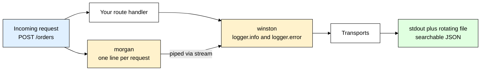
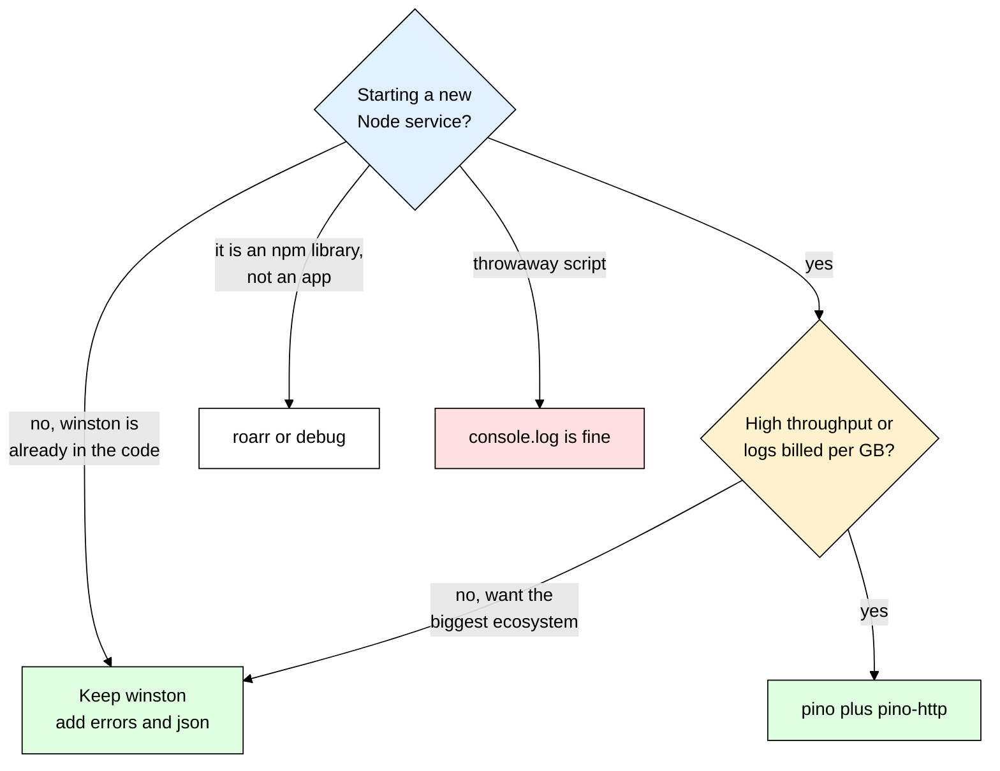

# winston + morgan — Logging That Actually Helps You at 3 A.M.

> **Scope:** Application logging with `winston` and HTTP access logging with `morgan` in a Node.js/Express API — levels, formats, transports, request correlation, redaction, and what to run in production.
> **Level:** Beginner + practical.
> **New to Express middleware?** Read [[express]] first — morgan is just a middleware, and half of this file assumes you know where middleware sits in the request pipeline.

---

## 1. ELI5: What is winston and what is morgan?

It's 3 A.M. A customer emails: *"I got charged twice at around 11 P.M. last night."* You SSH into the box, and the log file is 900 MB of `undefined`, `Error` and `success` — no timestamps, no user id, no request id, no way to tell which of the 40,000 requests that night was theirs. You cannot answer the question, so you refund blindly and go back to bed. **That** is the problem these two libraries solve.

Think of a hospital, which keeps **two** completely different record books. The **front-desk sign-in sheet** records every person who walked through the door, when they arrived, which department they went to, how long they waited — it does not care what happened inside. That is **morgan**. The **patient chart** records what the doctor actually did, what was decided and why, what went wrong. That is **winston**. You need both: the sign-in sheet tells you *"someone hit `POST /checkout` at 23:04:11 and got a 500 after 4.2 seconds"*, and the chart tells you *"the payment call timed out, here is the stack trace, here is the order id."*

> **Type:** two separate npm packages — `winston` (a general-purpose application logger) and `morgan` (an Express middleware that logs one line per HTTP request)
> **Core promise:** winston gives you **levels, structure, and destinations** for the logs your code writes; morgan gives you a consistent **access log** of every request, for free, without touching your route handlers.



The single most important idea in this whole file: **morgan's output should flow into winston**, so you have exactly one logging pipeline with one format and one destination — not two systems writing to two places in two shapes.

---

## 2. Why Does winston Exist? (The Problem It Solves)

Here is the logging setup every tutorial app ships with, and that every real app regrets:

```js
// ❌ The "life without a logger" version
app.post("/orders", async (req, res) => {
  console.log("order request", req.body);     // dumps card details into the log
  const order = await Order.create(req.body);
  console.log("created!");                    // created what? for whom? when?
  res.status(201).json(order);                // and a throw in here is never logged at all
});
```

Run that in production for a week and you get a huge file of `created!` lines with no timestamps, no request ids, and a customer's card number in plain text on disk. You cannot grep it, you cannot turn it down, and you cannot ship it to a log service.

| Without a logger (`console.log`) | With winston |
|---|---|
| Every line is equally important — there is no volume knob | **Levels**: set `level: "info"` in prod and every `debug` line disappears without deleting code |
| No timestamps unless you concatenate them yourself | `format.timestamp()` stamps every line automatically, in ISO 8601 |
| Output is prose — `"User 42 created"` — so you can only grep for substrings | **Structured JSON** — `{"message":"user created","userId":42}` — queryable by field in any log tool |
| Always goes to stdout, nowhere else | **Transports**: stdout *and* a rotating file *and* an HTTP endpoint, each with its own level |
| Errors print as `[object Object]` or `Error` with no stack | `format.errors({ stack: true })` keeps the full stack trace |
| Secrets leak because you dumped a whole object, and crashes vanish silently | One redaction format strips `password`/`token` everywhere, and `exceptionHandlers` log the fatal error before the process dies |

Two objections come up every time, and both have concrete answers.

**"My platform already collects stdout, so `console.log` is enough."** It is not, because `console.log` is not always asynchronous. When stdout is a **file** it is synchronous on every platform, and when it is a **pipe** it is synchronous on Linux — so `node app.js > app.log` puts a blocking disk write inside your request path, producing mysterious latency that vanishes the moment you redirect to `/dev/null`. A logger's transports are built as streams for exactly this reason. And **"I just won't log secrets"** does not survive contact with a real codebase: nobody types `console.log(user.password)`; they type `console.log(req.body)`, and the password, the reset token and the `Authorization` header ride along. One logger module gives you a single place to install redaction. Two hundred scattered `console.log` calls give you none.

morgan exists for a narrower reason: writing `logger.info(req.method + " " + req.url + " " + res.statusCode)` correctly — *after* the response has actually finished, with an accurate response time and byte count — is fiddlier than it looks. morgan is a small, well-tested middleware that gets it right once, for every route.

---

## 3. Installing & Basic Usage

```bash
npm install winston morgan
# optional, but almost always wanted on a VPS:
npm install winston-daily-rotate-file
```

The smallest thing that works:

```js
import winston from "winston";

const logger = winston.createLogger({
  level: "info",                                   // anything less severe than "info" is dropped
  format: winston.format.combine(
    winston.format.timestamp(),                    // must run BEFORE json() to reach the output
    winston.format.json()                          // one JSON object per line — machine readable
  ),
  transports: [new winston.transports.Console()]   // where the lines actually go
});

logger.info("server started", { port: 3000 });     // context goes in an object, not in the string
logger.debug("invisible until you lower the level");
```

### CommonJS version

```js
// logger.cjs
const winston = require("winston");

module.exports = winston.createLogger({
  level: "info",
  format: winston.format.combine(winston.format.timestamp(), winston.format.json()),
  transports: [new winston.transports.Console()]
});
```

### Express example

```js
import express from "express";
import morgan from "morgan";
import logger from "./logger.js";      // the module above, exported as default

const app = express();

// morgan must be registered BEFORE your routes: it listens for the response's finish event
app.use(morgan("combined", {
  stream: { write: (line) => logger.http(line.trim()) }   // morgan appends a newline; winston adds its own
}));

app.get("/users/:id", async (req, res) => {
  logger.info("fetching user", { userId: req.params.id });   // winston: what my code is doing
  res.json({ id: req.params.id });
});
```

That's the entire mental model — **morgan answers "what came in", winston answers "what my code did about it", and both write through one pipeline you configure in one file.**

---

## 4. Log Levels — The Volume Knob

winston uses the **npm levels** by default. The number is the internal severity rank, and **lower means more severe**:

| Level | Rank | What belongs here |
|---|---|---|
| `error` | 0 | Something failed and a human may need to act: unhandled exception, rejected DB write, payment provider returned a 500. Always include the stack. |
| `warn` | 1 | Recovered, but suspicious: a retry succeeded on attempt 3, a deprecated endpoint was used, a config value was missing and a default was applied. |
| `info` | 2 | Business events you want to see forever: server started, user signed up, order placed, job completed. **This is your production level.** |
| `http` | 3 | Per-request access lines. This level exists so morgan's output can be filtered separately from your business logs. |
| `verbose` | 4 | Detailed flow narration — "entering reconciliation step 2 of 5". Rarely used. |
| `debug` | 5 | Variable values, query shapes, branch decisions. **Your local development level.** |
| `silly` | 6 | Raw dumps, byte counts, everything. Almost never enabled. |

> **The one rule:** setting `level: "info"` means winston writes `error`, `warn` and `info`, and **silently discards** everything below — `http`, `verbose`, `debug`, `silly`. Your `logger.debug()` calls stay in the source and cost almost nothing; they simply produce no output until you lower the level.

Never hard-code the level — read it from the environment (see [[dotenv]] for how these get loaded locally). `const level = process.env.LOG_LEVEL ?? (isProd ? "info" : "debug")` gives you `debug` locally, `info` in production, and an escape hatch that turns on `debug` for ten minutes during an incident with no code change and no redeploy. If you ever wish you could "see more" in prod and the only way is a deploy, you configured this wrong.

There is a second, independent knob: **each transport has its own level.** A logger at `debug` with a Console transport at `debug` and a File transport at `error` gives you a chatty terminal and an errors-only file. The logger's level is the outer gate — a transport can never see a line the logger already dropped.

---

## 5. winston in Practice — Building a Real `logger.js`

A winston logger is three things bolted together: **a level** (the gate — everything less severe is dropped before any formatting work happens), **a format** (a pipeline that turns `("user created", { userId })` into the final line), and **transports** (the destinations: Console, File, rotating file, HTTP, and dozens of community ones).

`format.combine(a, b, c)` runs `a`, then `b`, then `c`, each receiving the `info` object the previous one produced. That is why `timestamp()` must come **before** `json()` — `json()` serializes whatever fields exist at the moment it runs, so a timestamp added afterwards never reaches the output.

The one format nobody tells you about until it burns you is `winston.format.errors({ stack: true })`. Without it, `logger.error(err)` logs the error's *message* and throws the stack away, because `stack` is a non-enumerable property that `JSON.stringify` cannot see. You end up with `{"level":"error","message":"Cannot read properties of undefined"}` and no idea which of your 300 files it came from. Add it to **every** logger you ever create.

```js
// logger.js — the only file in your app that imports winston
import winston from "winston";
import DailyRotateFile from "winston-daily-rotate-file";

const { combine, timestamp, errors, json, colorize, printf, splat } = winston.format;
const isProd = process.env.NODE_ENV === "production";

// DEV: human-readable single lines with the level colorized and stacks expanded.
const devFormat = combine(
  timestamp({ format: "HH:mm:ss.SSS" }),   // full ISO dates are noise on your own laptop
  errors({ stack: true }),
  splat(),                                 // enables printf-style logger.info("hi %s", name)
  colorize(),                              // colorizes the level token only — never in the prod format
  printf(({ timestamp, level, message, stack, ...meta }) => {
    const extra = Object.keys(meta).length ? ` ${JSON.stringify(meta)}` : "";   // Object.keys skips winston's Symbol keys
    return `${timestamp} ${level}: ${stack ?? message}${extra}`;
  })
);

// PROD: one JSON object per line. Ugly to read, trivial for machines to query.
const prodFormat = combine(timestamp(), errors({ stack: true }), splat(), json());

const logger = winston.createLogger({
  level: process.env.LOG_LEVEL ?? (isProd ? "info" : "debug"),
  format: isProd ? prodFormat : devFormat,
  // defaultMeta is stamped onto EVERY line — invaluable once several services share one stream
  defaultMeta: { service: "orders-api", env: process.env.NODE_ENV ?? "development" },
  transports: [new winston.transports.Console({ stderrLevels: ["error"] })],   // errors to stderr
  exitOnError: false,                      // logging an exception must not kill the process itself
  silent: process.env.NODE_ENV === "test"  // keep your test output readable
});

// On a plain VPS you also want files on disk. In a container, skip this — see section 11.
if (isProd && process.env.LOG_TO_FILE === "true") {
  logger.add(new DailyRotateFile({
    filename: "logs/app-%DATE%.log", datePattern: "YYYY-MM-DD",
    zippedArchive: true,                   // old days get gzipped so disk usage stays flat
    maxSize: "20m", maxFiles: "14d"        // roll at 20 MB, keep 14 days — full disks take servers down
  }));
}

export default logger;
```

Everywhere else in the app you write `import logger from "./logger.js"` and never think about formats again. That single-module discipline is what makes redaction, level changes, and swapping to a different logger a one-file job later.

---

## 6. Structured Logging — Fields, Not Sentences

This is the habit that separates logs you can use from logs you scroll past.

```js
// ❌ A sentence. Greppable only by fragile substring matching.
logger.info("User " + user.id + " created an order for " + total + " in " + ms + "ms");

// ✅ A constant message plus fields. Every field is independently queryable.
logger.info("order created", { userId: user.id, orderId: order.id, totalCents: total, durationMs: ms });
```

The second form produces:

```json
{"level":"info","message":"order created","userId":"66b1","orderId":"66b2","totalCents":4999,"durationMs":83,"service":"orders-api","timestamp":"2026-08-18T09:12:44.101Z"}
```

Now you can ask questions the first form can never answer: *"every `order created` where `durationMs > 1000`"*, *"orders per hour"*, *"every line for this `userId` across all services"*. The message string stays **constant** so it works as a grouping key, and the varying data lives in fields. If you catch yourself concatenating a variable into the message, move it into the object. Logging at `debug` costs nothing in production because the level gate drops those lines before any formatting happens — so timing every [[mongoose]] query at `debug` is free insurance you can switch on during an incident.

### Logging errors so the stack survives

`JSON.stringify(new Error("boom"))` is `{}` — an Error has no enumerable properties. So the obvious call quietly logs nothing useful:

```js
import logger from "./logger.js";

export async function checkout(orderId, charge) {
  try {
    return await charge(orderId);
  } catch (err) {
    logger.error("checkout failed", { orderId, err });   // ❌ err serializes to {}
    logger.error(err);                                   // ✅ A: errors({ stack: true }) expands it
    logger.error("checkout failed", {                    // ✅ B: keep the business context too
      orderId, errName: err.name, errMessage: err.message,
      stack: err.stack                                   // stack is non-enumerable — copy it explicitly
    });
    throw err;
  }
}
```

Option B is what you want in real handlers, because an error without the surrounding context ("which order?") is only half a clue.

---

## 7. morgan — HTTP Access Logs Done Right

morgan is one middleware that logs one line **after the response finishes**, so it knows the status code, the byte count and the true response time. You pick a format, and optionally a `stream` to write to.

| Format | Output shape | Use it for |
|---|---|---|
| `dev` | `GET /users/42 200 12.043 ms - 51`, status code colorized | Local development only — the ANSI colour codes corrupt machine parsing |
| `tiny` | The same fields, minimal, no colours | Small services where you only care about method, url, status and time |
| `common` | Apache Common Log Format — IP, user, timestamp, request line, status, size | Legacy tooling that expects CLF |
| **`combined`** | **CLF plus the `Referer` and `User-Agent` headers** | **The production default** — those two extra fields are what you need for bot and abuse analysis |
| `short` | Between `tiny` and `common`, includes the remote address | Rarely the right pick; `combined` costs almost nothing more |

### The key integration: pipe morgan into winston

By default morgan writes straight to `process.stdout`, so your access logs bypass your logger entirely — different format, different destination, no `service` field, no way to silence them. The fix is morgan's `stream` option, which accepts any object with a `write(string)` method.

```js
import morgan from "morgan";
import logger from "./logger.js";

const stream = { write: (line) => logger.http(line.trim()) };

app.use(morgan("combined", {
  stream,
  // Health checks fire forever: logging them buries real traffic and costs real money per GB
  skip: (req) => req.url === "/health" || req.url === "/favicon.ico"
}));
```

Access lines now arrive at level `http`, so they inherit your timestamp, your `service` field and your transports — and if you set `LOG_LEVEL=info` they disappear entirely, because `http` (rank 3) is less severe than `info` (rank 2). That is a feature: you keep business logs and drop access noise with one env var.

### Custom formats and tokens

A token is a `:name` placeholder. morgan ships with `:method`, `:url`, `:status`, `:response-time`, `:total-time`, `:res[header]`, `:req[header]`, `:remote-addr`, `:user-agent`, `:referrer`, `:http-version` and `:date`. You can register your own, and you can pass a *function* instead of a format string — it receives `(tokens, req, res)`, and returning `null` tells morgan to write nothing of its own:

```js
morgan.token("id", (req) => req.id);                   // the request id from section 8
morgan.token("user", (req) => req.user?.id ?? "anon"); // the authenticated user, when there is one

app.use(morgan(":id :user :method :url :status :res[content-length] - :response-time ms", { stream }));

// Or, instead of the line above: emit the access line as JSON yourself, then return null
app.use(morgan((tokens, req, res) => {
  logger.http("request", { method: tokens.method(req, res), url: tokens.url(req, res),
    status: Number(tokens.status(req, res)), durationMs: Number(tokens["response-time"](req, res)) });
  return null;                                         // morgan writes nothing; winston already did
}));
```

> **Rule of thumb:** `morgan("dev")` locally, and in production either `morgan("combined", { stream })` for a classic access log, or the JSON version above if your logs go to a queryable service.

---

## 8. Request IDs and Correlation

Here is the problem nobody warns you about. Your server handles 200 concurrent requests, each logging five lines, so the file reads `validating payload` / `charging card` / `insufficient funds` / `validating payload` / `order saved` — all stamped `09:12:44`. Which `validating payload` belongs to the failed charge? **Unknowable.** Timestamps do not disambiguate concurrency, and the interleaving gets worse the healthier your traffic is. The fix is a **correlation id**: one random id generated at the edge of the request, attached to every log line produced while handling it, and passed on to any downstream service you call.

```mermaid
%%{init: {'themeVariables': { 'primaryTextColor': '#000000', 'textColor': '#000000', 'lineColor': '#000000', 'primaryBorderColor': '#000000'}}}%%
flowchart LR
    Req["POST /orders<br/>no x-request-id header"] --> Mw["Middleware generates<br/>id abc123"]
    Mw --> Store["AsyncLocalStorage.run<br/>holds it for this async chain"]
    Store --> Deep["createOrder then chargeCard<br/>four layers deep"]
    Deep --> Fmt["winston format reads<br/>the store on every line"]
    Fmt --> Out["Every line tagged<br/>requestId abc123"]

    style Req fill:#e0f0ff,stroke:#000000,color:#000000
    style Mw fill:#fff2cc,stroke:#000000,color:#000000
    style Store fill:#fff2cc,stroke:#000000,color:#000000
    style Deep fill:#ffffff,stroke:#000000,color:#000000
    style Fmt fill:#ffffff,stroke:#000000,color:#000000
    style Out fill:#e0ffe0,stroke:#000000,color:#000000
```



### The simple version: a child logger

`logger.child(meta)` returns a logger that stamps extra fields onto every line it writes, so one middleware can hang a per-request logger off `req` — the full snippet is in the cheat sheet. Generate the id with `randomUUID()` from `node:crypto`, but honour an incoming `x-request-id` header when there is one, so a request that crossed a gateway keeps the same id end to end, and echo it back in the response header so clients can quote it in bug reports (see [[uuid_nanoid]] if you want shorter ids than a UUID).

For a small app this is genuinely fine. The cost shows up as the call stack deepens — `createOrder` → `chargeCard` → `callProvider` each need `req.log` passed in as a parameter, and the day you want the request id inside a Mongoose hook five layers down, every signature in between has to change.

### The clean version: AsyncLocalStorage

`AsyncLocalStorage` (built into Node, no dependency) keeps a value attached to the current async execution chain — through `await`, timers and callbacks — without passing it anywhere. It is effectively thread-local storage for a request.

```js
// context.js
import { AsyncLocalStorage } from "node:async_hooks";
import { randomUUID } from "node:crypto";

export const requestContext = new AsyncLocalStorage();

export function withRequestContext(req, res, next) {
  const requestId = req.get("x-request-id") ?? randomUUID();
  req.id = requestId;
  res.setHeader("x-request-id", requestId);
  // next() is called INSIDE run(), so the whole handler chain inherits the store
  requestContext.run({ requestId, startedAt: Date.now() }, () => next());
}
```

```js
// logger.js — one custom format teaches every line to pick the id up
import winston from "winston";
import { requestContext } from "./context.js";

const withContext = winston.format((info) => {
  const store = requestContext.getStore();
  if (store) info.requestId = store.requestId;   // stamped from anywhere, at any depth
  return info;
});
// then: combine(timestamp(), errors({ stack: true }), withContext(), json())
```

Now a `logger.info("charge succeeded")` buried four layers deep inside a payment helper comes out tagged with the right `requestId` — and one query on that id replays a single request from start to finish, in order, with nothing else mixed in. That is the whole point.

---

## 9. Redaction — What You Must Never Log

Logs get copied. They land in a third-party log service, a Slack channel, a support ticket, a laptop backup, a bucket someone made public. Treat anything you log as **eventually public**. Never log:

- **Passwords** — plain or hashed. A hash in a log is still a hash an attacker can attack offline (see [[password_hashing]]).
- **JWTs, session ids, API keys, refresh tokens** — a logged token is a working login until it expires.
- **The full `Authorization` header** — the bearer value *is* the credential. Log its presence, never its contents.
- **Card numbers, CVVs, bank details** — this is a compliance violation, not just a bad idea.
- **Personal data you do not need** — names, addresses, emails, phone numbers, dates of birth, medical data. Log a stable `userId` instead; you can always join back to the user record when you genuinely need to.
- **Whole request bodies** — the single most common way all of the above ends up in a log file.

The defence is one format function that runs on every line before any transport sees it:

```js
// redact.js
import winston from "winston";

const SENSITIVE = new Set([
  "password", "passwordhash", "confirmpassword", "oldpassword", "token", "accesstoken",
  "refreshtoken", "apikey", "secret", "authorization", "cookie", "sessionid", "cardnumber", "cvv", "ssn"
]);

// Walk the object and mask anything whose KEY looks sensitive, at any depth.
function scrub(value, depth = 0) {
  if (depth > 6 || value === null || typeof value !== "object") return value;   // depth cap stops cycles
  if (Array.isArray(value)) return value.map((v) => scrub(v, depth + 1));
  const out = {};
  for (const [key, val] of Object.entries(value)) {
    out[key] = SENSITIVE.has(key.toLowerCase()) ? "[REDACTED]" : scrub(val, depth + 1);
  }
  return out;
}

export const redact = winston.format((info) => {
  const { level, message, ...meta } = info;   // level and message keep the shape winston relies on
  return Object.assign(info, scrub(meta));
});
// Slot it in BEFORE json(): combine(timestamp(), errors({ stack: true }), redact(), json())
```

For the case redaction cannot save you from — deliberately logging an email or a raw body — the rule is simpler: **log identifiers, not contents.** `logger.info("password reset requested", { userId })` tells you everything you need. `logger.info("password reset requested", { email, resetToken })` is a security incident waiting for a leaked log file.

> ⚠️ Redaction by key name is a safety net, not a strategy. It cannot catch a token you concatenated into a message string, or a card number inside a free-text `notes` field. Decide what to log **before** you log it.

---

## 10. TypeScript Version

winston ships its own type definitions. morgan does not — install `@types/morgan` separately.

```bash
npm install winston morgan
npm install -D typescript @types/express @types/morgan
```

The logger module itself barely changes: `winston.createLogger` is fully typed, so you only annotate the export — `import type { Logger } from "winston"` and `const logger: Logger = winston.createLogger({ /* section 5 config */ })` — and every call site gets autocomplete on levels and options. What does need work is Express, which knows nothing about the `req.id` and `req.log` fields your middleware adds:

```ts
// app.ts
import express, { type Request, type Response, type NextFunction } from "express";
import morgan from "morgan";
import { randomUUID } from "node:crypto";
import logger from "./logger.js";
import type { Logger } from "winston";

// Teach TypeScript about the fields our middleware adds. In a bigger app this block
// lives in its own types/express.d.ts, which needs a trailing `export {}` to stay a module.
declare global {
  namespace Express {
    interface Request { id: string; log: Logger }
  }
}

const app = express();
const stream = { write: (line: string): void => { logger.http(line.trim()); } };

app.use((req: Request, res: Response, next: NextFunction): void => {
  req.id = req.get("x-request-id") ?? randomUUID();
  req.log = logger.child({ requestId: req.id });   // typed as Logger thanks to the declaration above
  res.setHeader("x-request-id", req.id);
  next();
});

morgan.token("id", (req) => (req as Request).id);
app.use(morgan(":id :method :url :status :response-time ms", { stream }));

// Express error handlers MUST take four parameters — Express identifies them by arity alone
app.use((err: Error, req: Request, res: Response, _next: NextFunction): void => {
  req.log.error("unhandled route error", { errName: err.name, errMessage: err.message, stack: err.stack });
  res.status(500).json({ error: "Internal Server Error", requestId: req.id });
});
```

---

## 11. Production Setup

If you deploy to Docker, Kubernetes, Fly, Render or ECS, the platform already collects stdout and stderr and ships them somewhere durable, so **a single `new winston.transports.Console()` is the whole production config**. Writing files inside a container is actively harmful: the disk is ephemeral, so the logs die with the container, it fills up, and rotation becomes your problem instead of the platform's.

On a plain **VPS with [[pm2]]** the trade-off flips. pm2 captures stdout into `~/.pm2/logs/<app>-out.log` and `<app>-error.log`, which grow forever unless you add rotation:

```bash
pm2 install pm2-logrotate                        # rotates whatever pm2 captures
pm2 set pm2-logrotate:max_size 20M
pm2 set pm2-logrotate:retain 14
```

Use **either** pm2's rotation **or** `winston-daily-rotate-file` — not both, or you end up rotating rotated files and confusing yourself at 3 A.M. An `uncaughtException` or an `unhandledRejection` kills the process, and by default the reason never reaches your logs — the exact information you need most:

```js
// server.js — register these before anything else can throw
import logger from "./logger.js";

process.on("uncaughtException", (err) => {
  logger.error("uncaught exception", { errName: err.name, errMessage: err.message, stack: err.stack });
  // Process state is now unknown: log, let transports flush, then die so pm2 or
  // Kubernetes starts a clean one. Staying alive after this is a known-bad idea.
  setTimeout(() => process.exit(1), 500);
});

process.on("unhandledRejection", (reason) => {
  const err = reason instanceof Error ? reason : new Error(String(reason));
  logger.error("unhandled rejection", { errMessage: err.message, stack: err.stack });
});
```

winston has built-ins for this too — `exceptionHandlers` and `rejectionHandlers` in `createLogger`, or `logger.exceptions.handle(transport)`. They work fine; pick one mechanism, and set `exitOnError: false` if you want to control the exit yourself as above.

| Concern | What to do |
|---|---|
| Level | `LOG_LEVEL` env var, default `info` in prod — loaded via [[dotenv]] locally, real env vars in prod |
| Format | `json()` in production, always, with ISO 8601 UTC timestamps — human-readable local time is for your laptop |
| Health checks | `skip` them in morgan, or they become most of your log volume and your bill |
| Volume | A hot path logging at `info` thousands of times a second belongs at `debug` or sampled — logs cost money per GB |
| Tests | `silent: true` when `NODE_ENV === "test"`, so [[jest_supertest]] output stays readable |
| Secrets | Redaction format installed from day one, not after the first leak |
| Discipline | ESLint's `no-console` rule (see [[eslint_prettier]]) so a stray `console.log` fails CI instead of shipping |

---

## 12. Common Gotchas & Best Practices

| Gotcha | Fix |
|---|---|
| **Error stacks vanish — you only ever see the message** | Add `winston.format.errors({ stack: true })` to the pipeline. Without it winston logs `err.message` and drops the non-enumerable `stack` entirely. |
| **`logger.error("failed", { err })` logs an empty object** | `JSON.stringify(new Error())` is `{}` — Errors have no enumerable properties. Pass the Error as the message (`logger.error(err)`), or flatten it: `{ errMessage: err.message, stack: err.stack }`. |
| **No `timestamp` in the JSON, or colour escapes inside it** | Both are pipeline-order mistakes. `combine()` runs left to right, so `combine(json(), timestamp())` serializes *before* the timestamp exists — put `timestamp()` first and `json()`/`printf()` last. And `colorize()` injects ANSI escapes that break every JSON parser, so use it only in the dev format. |
| **morgan logs nothing at all** | It was registered after your routes, or after middleware that ends the response. morgan hooks the response-finished event, so `app.use(morgan(...))` must come *before* `app.use(routes)`. |
| **Lowering a transport's `level` changes nothing** | The logger's level is the outer gate — a line dropped there never reaches any transport. To get `debug` into one file the logger must also be at `debug`; then raise the *other* transports' levels. |
| **`import { createLogger } from "winston"` fails in ESM** | winston is CommonJS, and Node's named-export detection can miss its exports, giving `Named export 'createLogger' not found`. Use `import winston from "winston"` and destructure afterwards. |
| **Logs truncated when the process exits** | `process.exit()` does not wait for transports to flush. Delay the exit briefly with `setTimeout(..., 500)`, or call `logger.end()` and wait for its `finish` event. |
| **Disk full at 2 A.M. and the server is down** | Unrotated files grow without limit. Set `maxSize` and `maxFiles` on every file transport, use `pm2-logrotate`, or log to stdout and let the platform handle retention. |

---

## 13. Alternatives — When winston Isn't the Best Fit

| Tool | What it is | Best for |
|---|---|---|
| **winston** | The most-used Node logger. Levels, composable formats, and a huge transport ecosystem — files, HTTP, Datadog, Loki, MongoDB. | Apps that need logs in several places with a different format per destination, or that value the ecosystem and endless examples over raw throughput. |
| **pino** | JSON-first logger built for speed — minimal work in-process, formatting pushed to a separate transport worker. `pino-http` replaces morgan entirely; `pino-pretty` gives readable dev output. | **New high-throughput services — honestly the better default today** if you have no existing winston setup. Same ergonomics, several times faster, structured by default rather than by configuration. |
| **bunyan** | The original structured-JSON Node logger, with a nice `bunyan` CLI pretty-printer. | Legacy codebases that already use it. Effectively unmaintained — do not start here. |
| **roarr** | Logger designed for libraries: writes JSON to stdout and stays a no-op unless `ROARR_LOG=true`, so it never spams an app that installs your package. | Publishing an npm library that needs internal logging without hijacking the host app's output. |
| **`debug`** | Namespaced on/off tracing toggled by the `DEBUG` env var. Not a production logger — no levels, no structure, no transports. | Development-time tracing inside a module, for example `DEBUG=myapp:db npm start`. |
| **Plain `console.log` plus the platform** | Zero dependencies; your host collects stdout. | Tiny scripts, a single serverless function, prototypes. Add structure the moment you have real users. |



Be honest about the trade. winston's flexibility is real, but so is its cost — formatting happens in your process, on your event loop, while pino defers that work and serializes less, which is why it wins benchmarks by a wide margin. If you are writing a service that will carry serious traffic and have no legacy to respect, start with pino. If you inherited winston, or you genuinely need three transports with three formats, winston is entirely fine — it just has to be configured properly, which is what this file is about.

---

## 14. Interview Questions

**Q: What is the difference between winston and morgan, and why would an app use both?**
A: morgan is an Express middleware that emits exactly one access-log line per HTTP request, after the response finishes — method, URL, status, response time, bytes. winston is a general application logger you call from your own code to record what happened and why, at a chosen severity level. They answer different questions — "what traffic arrived" versus "what did my code decide" — and the standard setup pipes morgan's output into winston through the `stream` option, so both end up in one pipeline with one format.

**Q: Why is `console.log` not good enough in production?**
A: It has no levels, so you cannot turn the noise down without editing code; no timestamps; no structure, so logs are searchable only by fragile substring matching; and exactly one destination. It also blocks the event loop when stdout is a file, and it is the main way secrets leak, because people log whole objects like `req.body`. A real logger gives you a level gate, structured JSON, multiple transports, and one place to install redaction.

**Q: What does `format.errors({ stack: true })` do, and what breaks without it?**
A: It detects that the logged value is an `Error` and copies the non-enumerable `stack` property onto the log record so it survives serialization. Without it, `logger.error(err)` outputs only the message, because `JSON.stringify` cannot see `stack` — you get "Cannot read properties of undefined" with no file, no line and no call chain. It is the single most commonly missing piece of a winston config.

**Q: What is structured logging and why does it matter?**
A: Structured logging means the message stays a constant string and all varying data goes into named fields — `logger.info("order created", { orderId, durationMs })` rather than string concatenation. The constant message becomes a reliable grouping key and every field becomes independently queryable, so you can ask for "all order-created events slower than one second" instead of grepping substrings. It is also the shape every log aggregation service expects.

**Q: How do you trace one request through the logs when hundreds run concurrently?**
A: Generate a request id at the edge, reusing an incoming `x-request-id` header when there is one, attach it to every log line produced while handling that request, and echo it back in the response header. The clean implementation uses `AsyncLocalStorage` so the id follows the async execution chain automatically, plus a custom winston format that stamps it on every line — no threading a logger parameter through every function. Filtering on one id then replays that request in isolation.

**Q: What must never appear in logs?**
A: Passwords (even hashed), tokens and session ids, full `Authorization` headers, API keys, card numbers, and any personal data you do not strictly need. The practical rule is to log identifiers, not contents — `{ userId }` rather than `{ email, resetToken }` — backed by a redaction format that masks known-sensitive keys at any depth before serialization. Logs get copied into third-party services, tickets and backups, so treat everything you log as eventually public.

**Q: How do you make sure a crash actually gets logged?**
A: Register `process.on("uncaughtException")` and `process.on("unhandledRejection")` handlers, or winston's `exceptionHandlers` and `rejectionHandlers`, that log the message and the stack. After an uncaught exception the process is in an unknown state, so the correct move is to log, allow a brief moment for transports to flush, then exit non-zero and let pm2 or the orchestrator start a clean instance — not to swallow the error and keep serving traffic.

**Q: winston or pino for a new service?**
A: pino is the better default for anything new and high-throughput: it is JSON-first, does far less work on the main thread, and `pino-http` replaces morgan while `pino-pretty` handles readable dev output. winston is the right answer when you need many transports with different formats per destination, or when the codebase already uses it — its ecosystem is larger and every problem has a documented answer. Neither is wrong; the difference is throughput versus flexibility.

---

## 15. Quick Cheat Sheet

```bash
npm install winston morgan
npm install winston-daily-rotate-file      # file rotation on a VPS
npm install -D @types/morgan               # TypeScript only
```

```js
// logger.js — the minimum viable production logger
import winston from "winston";
const { combine, timestamp, errors, json } = winston.format;

const logger = winston.createLogger({
  level: process.env.LOG_LEVEL ?? (process.env.NODE_ENV === "production" ? "info" : "debug"),
  format: combine(timestamp(), errors({ stack: true }), json()),
  defaultMeta: { service: "orders-api" },
  transports: [new winston.transports.Console()]
});
export default logger;

// Levels, most severe first — level "info" drops http/verbose/debug/silly
// error(0) warn(1) info(2) http(3) verbose(4) debug(5) silly(6)
logger.error("payment failed", { orderId, errMessage: err.message, stack: err.stack });
logger.info("order created", { userId, orderId, totalCents, durationMs });
logger.debug("query timing", { collection: "orders", durationMs: 12 });
```

```js
// morgan piped into winston, plus a request id — both BEFORE your routes
import morgan from "morgan";
import { randomUUID } from "node:crypto";

app.use((req, res, next) => {
  req.id = req.get("x-request-id") ?? randomUUID();
  req.log = logger.child({ requestId: req.id });
  res.setHeader("x-request-id", req.id);
  next();
});
app.use(morgan(process.env.NODE_ENV === "production" ? "combined" : "dev", {
  stream: { write: (line) => logger.http(line.trim()) },
  skip: (req) => req.url === "/health"
}));
```

**Mental model to remember:**
> morgan is the sign-in sheet at the door — one line per request, registered before your routes and piped into winston so everything lands in a single stream. winston is the patient chart: levels you can turn down from the environment, `errors({ stack: true })` so stacks survive, JSON fields instead of sentences so logs stay queryable, a request id on every line so one request can be replayed in isolation, and redaction so nothing you regret ever reaches disk. In a container log to stdout and let the platform collect it — see [[pm2]] for the VPS variant, [[dotenv]] for the level env var, and [[express]] for where the middleware sits.
