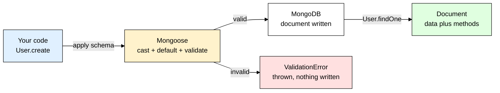
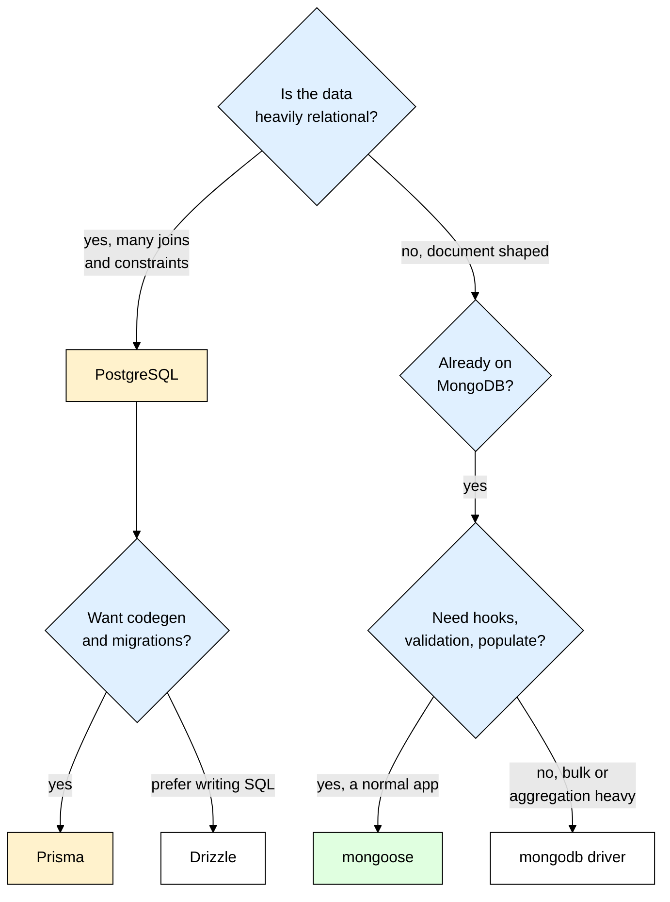

# mongoose — Structure and Safety on Top of MongoDB

> **Scope:** The `mongoose` npm package (v9, the current major line) — schemas, models, queries, `populate()`, validation, hooks, indexes, transactions, and how to wire it into a real Express app.
> **Level:** Beginner + practical.
> **New to the surrounding stack?** Read [[express]] and [[dotenv]] first — every example here assumes an Express app that reads `MONGODB_URI` out of the environment.

---

## 1. ELI5: What is mongoose?

You built a signup route. On Monday you saved `{ email, password }`. On Wednesday you renamed the field to `passwordHash` and forgot one place. On Friday a teammate saved `{ eamil: "..." }` — a typo. MongoDB accepted **all three shapes without complaining**, because MongoDB is schemaless by design. Two weeks later `user.passwordHash` is `undefined` for 4,000 accounts and nobody can log in. Nothing crashed, nothing warned you: the database is a storage facility that will happily let you dump any box into any unit, unlabeled, forever.

**Mongoose is the receiving clerk you hire and put at your own loading dock.** Every box coming through *your* door has to match a printed intake form: this field is required, this one must be a number, this one must be one of three allowed values. The clerk stamps the arrival date on it automatically, converts `"42"` written in pen into the number 42, keeps a card catalogue (indexes) so you can find things later, and refuses anything malformed before it reaches the shelves. But here is the part beginners always miss: **the clerk only guards your door.** A different application, a coworker in `mongosh`, a migration script, an old service still running v1 of your code — all of them walk in the back entrance and drop whatever they like straight onto the shelves. Mongoose enforces your schema **in your Node process**, not inside the database.

> **Type:** npm package — an ODM ("Object Document Mapper") for MongoDB, built on top of the official `mongodb` driver.
> **Core promise:** Declare the shape of your data once, and get validation, type casting, defaults, relationships, hooks, and a nicer query API everywhere you touch that collection.



---

## 2. Why Does mongoose Exist? (The Problem It Solves)

Here is the same feature against the **raw `mongodb` driver**, which is what Mongoose sits on top of:

```js
import { MongoClient } from "mongodb";

// The driver connects lazily on the first operation.
const users = new MongoClient(process.env.MONGODB_URI).db("app").collection("users");

// Both accepted silently — the driver has no idea what a "user" is supposed to be:
await users.insertOne({ emial: "a@b.com", age: "31" }); // typo'd key, age is a string
await users.insertOne({ email: "a@b.com" });            // no password at all
```

None of this is *wrong* — it is that all the discipline lives in your head, and heads leak. Mongoose moves that discipline into one file you can read.

| Without mongoose | With mongoose |
|---|---|
| Field names are whatever you typed that day — `emial` saves fine | `strict` mode (on by default) **silently drops** keys not in the schema, so typos never reach the DB |
| `age: "31"` stored as a string, then `age > 18` behaves bizarrely | Automatic **casting** — `"31"` becomes `31`, garbage input throws a `CastError` |
| `new ObjectId(id)` by hand on every read, and it throws on malformed input | `findById("abc")` casts for you and gives one catchable error type |
| `createdAt` / `updatedAt` written manually on every write | `{ timestamps: true }` — one line, maintained automatically |
| "Required" fields are enforced by hoping | `required`, `enum`, `min`, `match`, custom validators — checked before the write |
| Password hashing lives in whichever route remembered to call it | One `pre("save")` hook — impossible to forget, see [[bcrypt]] |
| Joining a post to its author = write the second query and the `$in` yourself | `.populate("author")` |

**Rule of thumb:** Mongoose does not make MongoDB safer. It makes *your application's* use of MongoDB consistent — which is 95% of the actual problem.

---

## 3. Installing & Basic Usage

```bash
npm install mongoose
```

Mongoose 9 is the current major line and requires **Node 20.19 or newer**. It is promise-only: the callback style in old tutorials (`User.find({}, (err, docs) => {})`) was removed in Mongoose 7, and Mongoose 9 also removed the `next` callback from middleware — hooks are plain async functions now.

```js
// db.js — ESM, Node 20.19+
import mongoose from "mongoose";

await mongoose.connect(process.env.MONGODB_URI); // connect ONCE at boot, see section 5

// A schema describes one document's shape; a model binds it to a collection.
// "User" is singular and capitalised — Mongoose pluralises it into "users".
const userSchema = new mongoose.Schema({
  email: { type: String, required: true, lowercase: true, trim: true },
  age: { type: Number, min: 0 },
});
const User = mongoose.model("User", userSchema);

const user = await User.create({ email: "  ADA@Example.com ", age: "36" });
console.log(user.email); // "ada@example.com" — trimmed + lowercased by the schema
console.log(user.age);   // 36 — the number, not the string you passed in
```

### CommonJS version

```js
const mongoose = require("mongoose");

async function main() {
  await mongoose.connect(process.env.MONGODB_URI); // no top-level await in CJS
  const User = mongoose.model("User", new mongoose.Schema({ email: String }));
  await User.create({ email: "ada@example.com" });
}
main();
```

### Express example

```js
import express from "express";
import "./db.js"; // connects BEFORE anything binds a port
import { User } from "./models/User.js";

const app = express();
app.use(express.json());

app.post("/users", async (req, res, next) => {
  try {
    // Only schema fields survive — extra junk in req.body is stripped by strict mode.
    const user = await User.create({ email: req.body.email, age: req.body.age });
    res.status(201).json(user);
  } catch (err) {
    // A schema violation is err.name === "ValidationError" — a 400, not a 500.
    if (err.name === "ValidationError") return res.status(400).json({ error: err.message });
    next(err);
  }
});

app.listen(3000);
```

That's the entire mental model — describe the shape in a **schema**, turn it into a **model**, and call query methods on that model. Everything else here is detail hanging off those two lines.

---

## 4. Schema, Model, Document — The Three Layers

Beginners blur these into "the mongoose thing." They are genuinely different objects, and knowing which one you are holding tells you which methods exist.

A **schema** is a pure description — fields, defaults, validators, indexes, virtuals, methods, middleware. It touches no database and knows no connection, so you can define twenty schemas without ever connecting. A **model** is what `mongoose.model("User", userSchema)` compiles that schema into: a class bound to one collection, carrying the **collection-level** methods `find`, `create`, `updateOne`, `deleteOne` and `countDocuments`. A **document** is what a query hands back — one record, *hydrated*: your data plus `save()`, `validate()`, `isModified()`, virtuals, instance methods, and change tracking, so `save()` sends only the fields you touched.

```js
const doc = await User.findById(id);   // Document
doc.age = 37;                          // change tracked in memory, nothing sent yet
console.log(doc.isModified("age"));    // true
await doc.save();                      // sends { $set: { age: 37 } } — not the whole document

// Pluralisation is automatic (Person -> people, Category -> categories); pass a
// third argument when the collection already has a different name:
mongoose.model("User", userSchema, "AppUsers");
```

Two limits worth internalising early. A schema is **not a migration system** — adding `required` changes nothing about documents already stored. And it is not database-level enforcement: for that, MongoDB has native `$jsonSchema` collection validation, a complement rather than a substitute. For untrusted HTTP input, validate with [[zod]] *before* it reaches a model — schema validation is about your data model, request validation is about your API surface, and conflating them gives you 500s where you wanted 400s.

---

## 5. Connecting Properly

`mongoose.connect()` does **not** open one socket. It creates a **connection pool** — up to 100 sockets by default — that Mongoose reuses for every query in your process. That single fact explains all the rules below.

```js
// server.js — connect first, listen second
import express from "express";
import mongoose from "mongoose";

const app = express();

try {
  await mongoose.connect(process.env.MONGODB_URI, {
    serverSelectionTimeoutMS: 5000, // fail fast at boot instead of hanging for the default 30s
    maxPoolSize: 20,                // cap sockets — the default 100 exhausts a small Atlas tier
    socketTimeoutMS: 45000,         // kill sockets stuck on a slow query (default: none)
  });
} catch (err) {
  console.error("MongoDB connection failed", err); // no DB means every route 500s
  process.exit(1);                                 // crash loudly, do not serve broken traffic
}

// Close the pool cleanly so in-flight writes finish before the process dies.
process.on("SIGTERM", async () => {
  await mongoose.connection.close();
  process.exit(0);
});
app.listen(3000);
```

Calling `connect()` inside a route handler builds a **new pool per request** — under load you open thousands of sockets, hit the server's connection limit, and the app stalls. Connect once at boot and every query shares that one pool; you never pass a connection object to a query, which is why `User.find()` just works from any file. If you forget to `await` the connect before `listen()`, Mongoose **buffers** queries for 10 seconds and then throws ``Operation `users.findOne()` buffering timed out after 10000ms`` — a confusing error that really means "you never connected."

The driver reconnects on its own after a blip, so you do not write retry logic. What you *do* handle is the initial connection failing (exit) and shutdown (close the pool) — under [[pm2]] or a container orchestrator, exiting on a failed boot connection is correct, because something restarts you. On Lambda, Vercel or Cloud Functions the rule inverts, because module-level code runs on every **cold start** and the container is then reused for many invocations. A `connect()` at module scope opens a fresh pool per container, and a traffic burst opens hundreds at once — the classic "connection limit exceeded" outage. Cache the connection **promise** on `globalThis` instead, since it survives between invocations in the same container:

```js
// lib/db.js — the canonical serverless pattern
import mongoose from "mongoose";

const cached = (globalThis._mongoose ??= { conn: null, promise: null });

export async function connectDB() {
  if (cached.conn) return cached.conn; // warm container — reuse the existing pool
  // Cache the PROMISE, so two concurrent cold starts do not each call connect().
  cached.promise ??= mongoose.connect(process.env.MONGODB_URI, {
    bufferCommands: false, // fail fast instead of queueing while disconnected
    maxPoolSize: 5,        // many small containers, so keep each pool tiny
  });
  cached.conn = await cached.promise;
  return cached.conn;
}
```

---

## 6. CRUD and Queries

```js
// CREATE — validates, casts, applies defaults, runs save hooks.
const post = await Post.create({ title: "Hello", body: "...", author: userId });
await Post.insertMany([{ title: "A" }, { title: "B" }]); // ONE round trip instead of N
await Post.insertMany(docs, { ordered: false });         // keep going past a bad document

// READ
await Post.find();                     // always an array — [] when nothing matches
await Post.findOne({ slug: "hello" }); // one document or null — NOT an error
await Post.findById(id);               // shorthand for findOne({ _id: id })
```

`insertMany` is dramatically faster than a loop of `create()` calls, but it does **not** run `pre("save")` hooks — it has its own `pre("insertMany")` hook — so bulk-inserting users skips your password hashing. And because `findOne` / `findById` return `null` rather than throwing, every `if (!doc) return res.sendStatus(404)` in your codebase exists for that reason. MongoDB's own query operators pass straight through, and the query builder methods chain:

```js
await Post.find({ views: { $gt: 100 } });                       // greater than
await Post.find({ status: { $in: ["draft", "review"] } });      // any of these values
await Post.find({ tags: "node" });                              // array field: matches if it CONTAINS "node"

const posts = await Post
  .find({ published: true })
  .select("title createdAt author") // only these fields — "-body -__v" is the inverse
  .sort({ createdAt: -1 })          // -1 newest first, 1 oldest first
  .skip((page - 1) * limit)
  .limit(limit)
  .lean();                          // plain objects, see section 9
```

> ⚠️ Never drop raw user input into a filter's value slot. `{ email: req.body.email }` is safe when `email` is a string, but a client sending JSON `{"email": {"$ne": null}}` lands an **operator** in your filter and matches every user — that is NoSQL injection. Validate types with [[zod]] first, or switch on `mongoose.set("sanitizeFilter", true)`.

Three performance facts hide in that chain. `$regex` on an unindexed field scans the whole collection, and an unanchored pattern cannot use an index even when one exists — only an anchored `^foo` can, so real search wants a text index or Atlas Search. `skip` is not free: MongoDB walks and discards every skipped document, so `.skip(50000)` reads 50,000 documents to return 20 — fine for page 3 of an admin table, terrible for infinite scroll, where **keyset pagination** (remember the last item's sort key, query `{ createdAt: { $lt: lastSeen } }`, keep only `limit`) stays constant cost at any depth. And a `sort` with no matching index forces a blocking in-memory sort that MongoDB aborts once it exceeds its memory budget.

### Update — and the classic validator bug

```js
// Returns a report object { matchedCount, modifiedCount } — NOT the document.
await User.updateOne({ _id: id }, { $set: { age: 37 } });

// Returns a document. By default the OLD one. Almost never what you want.
const updated = await User.findByIdAndUpdate(id, { age: 37 }, {
  returnDocument: "after", // the document AFTER the update
  runValidators: true,     // ⚠️ WITHOUT THIS, NO VALIDATION RUNS AT ALL
  context: "query",        // so custom validators get `this` as the query
});

await User.deleteOne({ _id: id });         // { deletedCount: 1 }
await User.findByIdAndDelete(id);          // the deleted document, or null
```

Read this twice, because it is the single most common Mongoose bug: **validators do not run on update operations by default.** A schema saying `age: { type: Number, min: 0 }` will happily let `findByIdAndUpdate(id, { age: -500 })` through. `create()` and `save()` always validate; `updateOne`, `updateMany`, `findByIdAndUpdate` and `findOneAndUpdate` do not, unless you pass `runValidators: true`. Even then `required` is still not enforced — update validators only check fields present in the update, deliberately, since an update touching `age` should not fail for omitting `email`.

> ⚠️ Mongoose 9 **deprecated the `new: true` option** in favour of `returnDocument: "after"` (and `new: false` in favour of `returnDocument: "before"`). `new` still works, but every tutorial using it is writing against the old spelling.

`Model.remove()`, `Model.update()` and `Model.count()` were **removed in Mongoose 7** and are still gone in 9 — if a tutorial uses them, it predates 2023. Finally, `User.find()` returns a **Query object**, not a promise: nothing has run yet, which is why chaining works. The `await` (or `.exec()`) is what fires it, and `.exec()` gives you a real Promise with a usable stack trace on failure.

---

## 7. Relationships — `ref` and `populate()`

MongoDB has no joins. You get two ways to model a relationship, and picking the wrong one is the most expensive mistake in a document database.

```js
const postSchema = new mongoose.Schema({
  title: String,
  author: { type: mongoose.Schema.Types.ObjectId, ref: "User", required: true },
  comments: [{ type: mongoose.Schema.Types.ObjectId, ref: "Comment" }],
});

const posts = await Post.find()
  .populate("author", "name email") // second arg is a projection — never ship the hash
  .populate({
    path: "comments",
    perDocumentLimit: 10,                         // 10 comments PER post
    populate: { path: "author", select: "name" }, // nested: comment -> its author
  });
```

`ref: "User"` is a **string matching the model name** you registered with `mongoose.model("User", ...)`. Without `populate()`, `post.author` is just an ObjectId. Nothing is enforced by the database — the field holds that id and `ref` only tells `populate()` which collection to look in. A stale reference to a deleted user is entirely possible; MongoDB has no foreign keys.

> ⚠️ A plain `limit` in populate options caps the **whole** populate query, not each parent — populating 50 posts with `limit: 10` returns 10 comments in total, spread arbitrarily. `perDocumentLimit` is the option that means "10 each", and it pays for that by issuing one query per parent document.

`populate()` is **not** a join. Mongoose runs your original query, collects the ObjectIds it found, and fires a **second query per populated path** using `$in`. So `Post.find().populate("author")` is 2 round trips, not 101 — Mongoose batches. The genuine N+1 appears when you populate **per document**:

```js
// ❌ N+1 — one extra query per post, 100 posts = 101 queries
for (const post of posts) await post.populate("author");

// ✅ one extra query total — Mongoose batches all the author ids into a single $in
const withAuthors = await Post.find().populate("author");
```

Even done right, populate costs a round trip per path and nesting multiplies paths, so three levels on a list endpoint is a latency problem you will feel. When you need it in one round trip, drop to an **aggregation pipeline with `$lookup`**, which runs server-side. When the joined data barely changes (categories, config, plan tiers), cache it in [[ioredis]] instead of populating on every request.

| Embed when | Reference when |
|---|---|
| The data is **small and bounded** — an address, a set of user preferences | The array can grow without limit — comments, orders, events |
| It is **always read together** with the parent | You often need the parent without the child |
| It has no life of its own — deleting the parent should delete it | The entity is queried on its own, or shared by many parents |
| You want it updated atomically with the parent in one write | It is updated on a different rhythm than the parent |
| Total document stays well under the **16MB BSON limit** | The relationship is many-to-many |

**Rule of thumb:** embed by default for one-to-few that is always read together; reference for one-to-many and anything unbounded. An unbounded embedded array is a time bomb — the document grows until it hits 16MB and every read drags the whole thing over the network.

---

## 8. Validation, Indexes, and Middleware Hooks

```js
const userSchema = new mongoose.Schema({
  email: {
    type: String,
    required: [true, "Email is required"], // tuple form sets the error message
    unique: true,                          // ⚠️ NOT a validator — see below
    lowercase: true,                       // a SETTER, applied before validation
    match: [/^\S+@\S+\.\S+$/, "Invalid email format"],
  },
  age: { type: Number, min: [13, "Must be 13 or older"], max: 130 },
  role: { type: String, enum: ["user", "editor", "admin"], default: "user" },
  username: { type: String, minlength: 3, maxlength: 20 },
  // Custom validator: return true when valid. Only runs when the field is set.
  website: { type: String, validate: { validator: (v) => v.startsWith("https://"), message: "Must be https" } },
});
```

> ⚠️ **`unique: true` is not a validator.** It is a shortcut for "build a unique index on this field." It never runs during validation, produces no `ValidationError`, and does nothing at all until the index exists. A duplicate surfaces as a raw `MongoServerError` with `code === 11000` from the *write*, so catch it and return 409 yourself.

Two more sharp edges. If duplicates already exist in the collection the unique index **fails to build**, and that error surfaces on the connection rather than in your route — so you get no uniqueness and no obvious signal; run `await User.syncIndexes()` at deploy time and watch it. And `unique` is case-sensitive, so `Ada@x.com` and `ada@x.com` are two different users unless you also set `lowercase: true`. An unindexed query, meanwhile, is a **collection scan**: MongoDB reads every document to find your matches. On 500 documents nobody notices; on 5 million it takes seconds, saturates the CPU, and takes the whole database down with it — including the queries that *were* fast.

```js
userSchema.index({ email: 1 }, { unique: true });      // 1 = ascending, -1 = descending
postSchema.index({ author: 1, createdAt: -1 });        // compound: filter by author, sort by date
postSchema.index({ title: "text", body: "text" });     // text search index
sessionSchema.index({ expiresAt: 1 }, { expireAfterSeconds: 0 }); // TTL — MongoDB deletes expired docs
```

Index every field you **filter on** and every field you **sort by**. A compound index also serves its **leftmost prefix** — `{ author: 1, createdAt: -1 }` covers queries on `author` alone, but not on `createdAt` alone. Indexes cost write throughput and disk, so index deliberately, not everywhere. To check whether a query used one, run `await Post.find(filter).explain("executionStats")` and compare `totalDocsExamined` with `nReturned`: a large gap means a scan.

### Middleware hooks

Hooks are functions that run around an operation. Two flavours, and mixing them up is a classic bug:

| Kind | Registered on | `this` is | Example |
|---|---|---|---|
| **Document middleware** | `save`, `validate`, and `deleteOne` / `updateOne` with `{ document: true, query: false }` | the document | Hash a password before saving |
| **Query middleware** | `find`, `findOne`, `findOneAndUpdate`, `updateOne`, `deleteMany` | the **query** | Auto-filter out soft-deleted rows |

> ⚠️ **Mongoose 9 removed the `next` callback from `pre` middleware.** A hook is now just an async function: return (or resolve) to continue, `throw` to abort the operation. `pre("save", function (next) { ... next(); })` is not merely old style — `next` is no longer a function, so calling it throws a `TypeError`.

```js
import bcrypt from "bcrypt";

userSchema.pre("save", async function () {
  // `this` is the document — arrow functions break that, so use `function`. And
  // isModified is the whole point: without it every profile update re-hashes the
  // ALREADY-HASHED value, and nobody can ever log in again.
  if (!this.isModified("passwordHash")) return;
  this.passwordHash = await bcrypt.hash(this.passwordHash, 12);
});

userSchema.methods.checkPassword = function (plain) { // available on every document
  return bcrypt.compare(plain, this.passwordHash); // timing-safe compare, never ===
};

// Query middleware: /^find/ matches findOne, findById and findOneAndUpdate too.
postSchema.pre(/^find/, function () {
  this.where({ deletedAt: null }); // `this` is the Query here, not a document
});
```

> ⚠️ **`pre("save")` does not run on `findByIdAndUpdate`.** Those are query operations — no document exists to be `this`. If your change-password route uses `User.findByIdAndUpdate(id, { passwordHash: newPassword })`, the hash hook is skipped and you just stored a plaintext password. Load the document, assign the field, and `save()` instead — and see [[password_hashing]] for why a plain SHA-256 in that hook would be a security bug of its own.

---

## 9. Everyday Power Tools

**`.lean()` — the single biggest read speedup.** By default every document Mongoose returns is *hydrated*: wrapped in a class with getters, setters, virtuals and change tracking, which is real CPU and memory per document. `.lean()` skips all of it and hands you plain JavaScript objects, typically several times faster on large result sets. Filters, `select`, `sort` and `populate` still work; what you lose is `save()`, instance methods, virtuals, getters/setters, and the `toJSON` transform — so a lean query **will not strip your `passwordHash`** if that stripping lives in a transform. Use it on any read you are only going to serialise into JSON, and never when you intend to modify and `save()` the result.

**Virtuals** are computed fields on the document that are never stored. They are excluded from `JSON.stringify` unless you opt in with `toJSON: { virtuals: true }`, and since they are not real fields you **cannot query or sort by them** — `User.find({ fullName: "Ada L" })` matches nothing.

```js
// Derived, so never out of sync. Use `function`, not an arrow — `this` is the document.
userSchema.virtual("fullName").get(function () { return `${this.firstName} ${this.lastName}`; });

const accountSchema = new mongoose.Schema(
  { passwordHash: { type: String, required: true, select: false } }, // never fetched by default
  {
    timestamps: true, // adds createdAt + updatedAt, maintained automatically
    toJSON: {
      virtuals: true,
      transform(doc, ret) {
        delete ret.passwordHash; // res.json(user) calls toJSON — your last line of defence
        return ret;
      },
    },
  }
);
const Account = mongoose.model("Account", accountSchema);

// With select: false, a login route must opt back in explicitly.
const account = await Account.findOne({ email }).select("+passwordHash");
```

**Transactions** give you multi-document atomicity — either all writes land or none do. They **require a replica set**; a bare standalone `mongod` throws. MongoDB Atlas (even the free tier) and `docker run mongo --replSet rs0` both qualify.

```js
const session = await mongoose.startSession();
try {
  // withTransaction handles commit, abort, and retries on transient errors.
  await session.withTransaction(async () => {
    // EVERY operation must get the session, or it runs outside the transaction.
    await Account.updateOne({ _id: from }, { $inc: { balance: -100 } }, { session });
    await Ledger.create([{ from, to, amount: 100 }], { session }); // array form takes a session
  });
} finally {
  await session.endSession(); // always release it
}
```

Two traps: `Model.create()` needs the **array form** to accept a session, and any query that forgets `{ session }` silently executes outside the transaction and will not be rolled back. Reach for transactions only when you genuinely need cross-document atomicity — a single-document write is already atomic in MongoDB, and a transaction there just adds overhead.

---

## 10. TypeScript Version

Mongoose ships its own types — there is no `@types/mongoose` (that package is deprecated). Define an interface, pass it to `model<T>()`, and every query becomes typed.

```ts
// models/User.ts
import { Schema, model, type HydratedDocument, type Model } from "mongoose";
import bcrypt from "bcrypt";

export interface IUser { // the shape of the stored data
  email: string;
  passwordHash: string;
  role: "user" | "editor" | "admin";
  createdAt: Date; // both added by timestamps: true
  updatedAt: Date;
}

export interface IUserMethods { // declared separately — the schema cannot infer them
  checkPassword(plain: string): Promise<boolean>;
}

export type UserDoc = HydratedDocument<IUser, IUserMethods>; // data + methods
type UserModel = Model<IUser, {}, IUserMethods>;

const userSchema = new Schema<IUser, UserModel, IUserMethods>(
  {
    email: { type: String, required: true, unique: true, lowercase: true },
    passwordHash: { type: String, required: true, select: false },
    role: { type: String, enum: ["user", "editor", "admin"], default: "user" },
  },
  { timestamps: true }
);

// `this` is typed as the hydrated document inside methods and hooks alike.
userSchema.methods.checkPassword = function (plain: string): Promise<boolean> {
  return bcrypt.compare(plain, this.passwordHash);
};

export const User = model<IUser, UserModel>("User", userSchema);
```

In a route, `await User.findById(req.params.id)` is now typed `UserDoc | null`, so TypeScript refuses to let you skip the 404 branch, and `user.checkPassword(...)` is checked rather than guessed. Three more things worth knowing. `InferSchemaType<typeof userSchema>` derives the interface from the schema instead of you writing it twice — convenient, but the inferred optionality is looser than you usually want, so an explicit interface is clearer on a real model. `.lean()` changes the return type to the plain raw document type, which is exactly right: TypeScript will now stop you calling `.save()` on it. And **Mongoose 9 renamed `FilterQuery<T>` to `QueryFilter<T>`** and made its top-level keys strongly typed instead of `any` — if you type your own repository helpers, that rename is the first thing that breaks on upgrade, and the newly strict keys will surface real filter bugs.

---

## 11. Production Setup

```js
// db.js — what a deployed app actually configures
import mongoose from "mongoose";

mongoose.set("strictQuery", true);    // drop filter keys not in the schema (default is false)
mongoose.set("sanitizeFilter", true); // strip $-operators smuggled in from user input

// Auto-index rebuilds every index on boot — production-stalling on a large collection.
mongoose.set("autoIndex", process.env.NODE_ENV !== "production");

export async function connectDB() {
  await mongoose.connect(process.env.MONGODB_URI, {
    serverSelectionTimeoutMS: 5000,
    maxPoolSize: Number(process.env.MONGO_POOL_SIZE ?? 20),
  });
}
```

| Concern | What to do |
|---|---|
| **Credentials** | `MONGODB_URI` from the environment via [[dotenv]] locally, real secrets in your host's secret store. Never commit a connection string — Atlas URIs carry the password inline. |
| **Index management** | `autoIndex` off in production, then run `await Model.syncIndexes()` as an explicit deploy step so index builds are visible and controlled. |
| **Query timeouts** | `.maxTimeMS(5000)` on expensive queries so one bad request cannot pin the database forever. |
| **Slow query visibility** | `mongoose.set("debug", true)` in staging to log every query; in production use the Atlas Profiler and log request timings via [[winston_morgan]]. |
| **Graceful shutdown** | `await mongoose.connection.close()` on SIGTERM so in-flight writes finish before the container is killed. |
| **Health check** | Expose `/healthz` returning `mongoose.connection.readyState === 1` so your orchestrator stops routing traffic to a pod that lost the DB. |
| **Migrations** | Mongoose does **not** migrate data. Adding `required` to a schema does nothing to existing documents — use `migrate-mongo` or a versioned script. |

One Express error handler removes the same six lines of `try/catch` from every route:

```js
// Express 5 forwards rejected async handlers here automatically — no wrapper needed.
app.use((err, req, res, next) => {
  // err.errors is keyed by field name — perfect for a form error response.
  if (err.name === "ValidationError") return res.status(400).json({ errors: Object.keys(err.errors) });
  if (err.name === "CastError") return res.status(400).json({ error: `Invalid ${err.path}` });
  if (err.code === 11000) return res.status(409).json({ error: "Duplicate value" });
  res.status(500).json({ error: "Internal error" });
});
```

---

## 12. Common Gotchas & Best Practices

| Gotcha | Fix |
|---|---|
| **Validators do not run on updates** | `updateOne` / `findByIdAndUpdate` skip validation entirely by default. Pass `{ runValidators: true }`, plus `{ context: "query" }` if you have custom validators. `required` is still not checked on updates, by design. |
| **`findByIdAndUpdate` returns the OLD document** | You update a name, return the result, and the API responds with the previous value. Pass `{ returnDocument: "after" }` — Mongoose 9 deprecated the older `{ new: true }` spelling. |
| **`pre` hooks in Mongoose 9 take no `next`** | `pre("save", function (next) { ... next(); })` throws `TypeError: next is not a function`, because that parameter is now the options object. Drop it, make the hook `async`, and `return` early instead of `return next()`. |
| **`pre("save")` never fires on `findByIdAndUpdate`** | Password-change routes written that way store plaintext. Load the doc, assign the field, call `save()`. Or move the logic into a `pre("findOneAndUpdate")` hook using `this.getUpdate()`. |
| **`unique: true` is an index, not a validator** | It throws a raw `MongoServerError` with `code === 11000` from the write, never a `ValidationError` — catch it and return 409. The index also fails to build if duplicates already exist, so run `Model.syncIndexes()` on deploy. |
| **A malformed id returns a 500** | `findById("not-an-id")` throws a `CastError`, which an unhandled route turns into a 500. Map `CastError` to 400 in your error handler, or validate the param with [[zod]] first. |
| **Connecting inside a request handler** | Every request opens a new connection pool and you exhaust the server's connection limit under load. Connect once at boot; on serverless, cache the connect promise on `globalThis`. |
| **`.lean()` bypasses your `toJSON` transform** | The transform that deletes `passwordHash` does not run on lean objects. Put `select: false` on the field itself so it is never fetched — defence at the schema, not at serialisation. |

---

## 13. Alternatives — When mongoose Isn't the Best Fit

| Tool | What it is | Best for |
|---|---|---|
| **mongoose** | ODM over the MongoDB driver — schemas, validation, hooks, populate, virtuals. | The default for any Node app on MongoDB. Its opinions are worth having, especially on a team. |
| **Raw `mongodb` driver** | The official client Mongoose itself wraps. No schemas, no hooks, no casting. | Heavy aggregation pipelines, bulk ETL, and hot paths where hydration overhead matters. Usable alongside Mongoose via `mongoose.connection.db`. |
| **[[prisma]]** | Type-safe query builder with generated types from a `schema.prisma` file. Supports MongoDB, but shines on SQL. | Teams that want end-to-end type safety and real migrations. Best-in-class DX on PostgreSQL. |
| **Drizzle ORM** | Lightweight SQL-first TypeScript query builder — you write near-SQL, it types the results. No codegen step, tiny runtime. | SQL projects wanting full query control and edge/serverless-friendly bundles. **SQL only — no MongoDB support.** |
| **TypeORM / Sequelize** | Older, decorator- or model-based SQL ORMs with large ecosystems. | Legacy codebases, or teams that specifically want Active Record / Data Mapper patterns. |
| **Plain MongoDB + [[zod]]** | Raw driver for I/O, Zod for shape enforcement at the boundaries. | Small services where you would rather own one validation system than learn a whole ODM. |

The more important question is usually decided before anyone opens npm: should you be on MongoDB at all? It is a good fit when your data is document-shaped, read together as a unit, and append-heavy — event logs, product catalogues, CMS content, per-user documents. **PostgreSQL is the better answer** when your data is genuinely relational (users, orders, line items, payments, refunds all referencing each other), when you need real multi-table joins and constraints enforced by the database rather than by the ORM, or when correctness under concurrency matters more than schema flexibility. Reaching for `populate()` on four different paths in one endpoint is your data model telling you it wanted foreign keys.



---

## 14. Interview Questions

**Q: MongoDB is schemaless. So what is a Mongoose schema actually enforcing?**
A: It enforces shape in your application layer, not in the database. Mongoose casts, defaults and validates every write that goes through a model, and strips unknown keys under `strict` mode, but the collection itself still accepts anything written by another service, a migration script or `mongosh`. If you need database-level guarantees you add MongoDB's native `$jsonSchema` validation on the collection.

**Q: Why do validators not run on `findByIdAndUpdate`, and how do you fix it?**
A: Update operations send an update *document* to MongoDB, so there is no hydrated document to validate and Mongoose opts out by default — you must pass `{ runValidators: true }`. Even then only fields present in the update are checked, because an update touching one field should not fail for omitting another, so `required` is not enforced. Custom validators additionally need `{ context: "query" }`, since `this` is the query rather than a document.

**Q: What is the difference between `save()` and `updateOne()`?**
A: `save()` operates on a hydrated document: it runs document middleware, full validation, and sends only the fields you changed. `updateOne()` is a direct query against the collection — faster and one round trip, but it skips `pre("save")` hooks entirely and skips validation unless you ask for it. The practical rule is that anything with a save hook, password hashing being the classic, must go through `save()`.

**Q: Is `populate()` a join?**
A: No. Mongoose runs your query, gathers the referenced ObjectIds, then issues a separate query per populated path using `$in`. Because it batches, populating 100 posts' authors is two queries and not 101 — but calling `populate()` inside a loop really is N+1. For a genuine server-side join you use an aggregation pipeline with `$lookup`.

**Q: When do you embed a subdocument versus referencing another collection?**
A: Embed when the data is small, bounded, and always read together with its parent, such as an address or a set of preferences. Reference when the collection can grow without limit, is queried independently, or is shared by many parents. The hard constraint is the 16MB BSON document limit: an unbounded embedded array eventually breaks the document entirely.

**Q: What does `.lean()` do and what do you give up?**
A: It skips hydration and returns plain JavaScript objects, which is substantially faster and much lighter on memory for large reads. You lose `save()`, instance methods, virtuals, getters, and — dangerously — the `toJSON` transform, so any field you were stripping at serialisation time will leak. Use it for read-only endpoints and keep secrets out with `select: false` instead.

**Q: Why connect to MongoDB once at boot rather than per request?**
A: `mongoose.connect()` creates a connection pool that all queries share for the life of the process. Connecting per request creates a new pool each time, exhausts the server's connection limit under load, and adds handshake latency to every call. On serverless, where module scope reruns on cold start, you cache the connect promise on `globalThis` so warm containers reuse the existing pool.

**Q: A query that was instant in development takes 8 seconds in production. What do you check first?**
A: Indexes. Without one MongoDB does a collection scan and reads every document, which is invisible on 500 rows and fatal on 5 million. Run `.explain("executionStats")` and compare `totalDocsExamined` against `nReturned` — a large gap means a scan. Then add an index covering the filter fields and the sort field, remembering that a compound index only serves its leftmost prefix.

---

## 15. Quick Cheat Sheet

```bash
npm install mongoose   # v9 — requires Node 20.19+
```

```js
// Connect once at boot — never per request
await mongoose.connect(process.env.MONGODB_URI, { serverSelectionTimeoutMS: 5000, maxPoolSize: 20 });

// Schema + model
const userSchema = new mongoose.Schema(
  { email: { type: String, required: true, unique: true, lowercase: true },
    passwordHash: { type: String, required: true, select: false },
    role: { type: String, enum: ["user", "admin"], default: "user" } },
  { timestamps: true }
);
const User = mongoose.model("User", userSchema);

// CRUD
await User.create({ email, passwordHash });
await User.findOne({ email }).select("+passwordHash");
await User.find({ age: { $gt: 18 } }).sort({ createdAt: -1 }).limit(20).lean();
await User.findByIdAndUpdate(id, patch, { returnDocument: "after", runValidators: true });
await User.deleteOne({ _id: id });

// Relations, indexes, hooks (Mongoose 9: no next callback)
await Post.find().populate("author", "name email");
userSchema.index({ email: 1 }, { unique: true });
postSchema.index({ author: 1, createdAt: -1 });
userSchema.pre("save", async function () {
  if (!this.isModified("passwordHash")) return;
  this.passwordHash = await bcrypt.hash(this.passwordHash, 12);
});

// Transaction — needs a replica set
const session = await mongoose.startSession();
try {
  await session.withTransaction(async () => Account.updateOne(filter, update, { session }));
} finally {
  await session.endSession();
}
```

**Mental model to remember:**
> mongoose = a schema layer your Node process enforces on a database that enforces nothing itself — schema describes, model queries, document saves. Get four things right and the rest is detail: connect once at boot, pass `{ returnDocument: "after", runValidators: true }` on every update, index anything you filter or sort by, and put password hashing in a `pre("save")` hook (see [[bcrypt]] and [[password_hashing]]). Validate untrusted request bodies with [[zod]] before they ever reach a model, and if you find yourself populating four paths per endpoint, your data was relational all along — look at [[prisma]] and Postgres.
