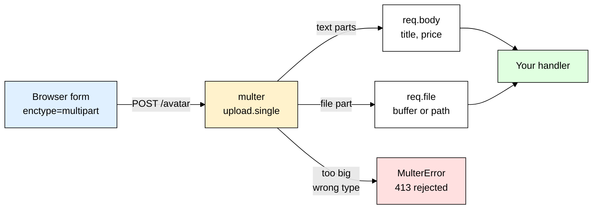
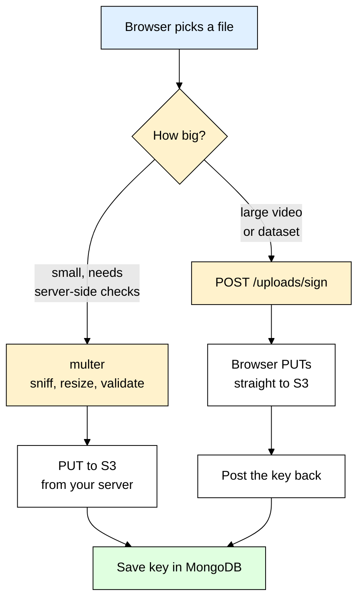
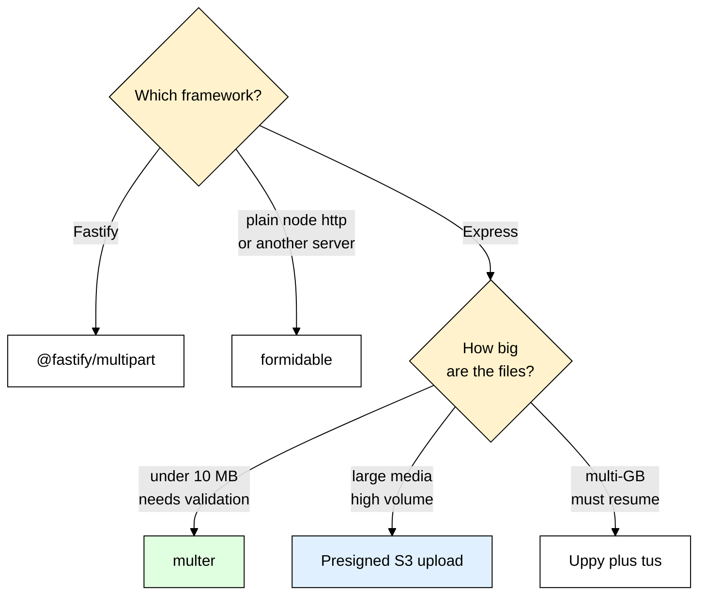

# multer — Handling File Uploads in Express Without Getting Hacked

> **Scope:** The `multer` npm package — parsing `multipart/form-data` in Express, storage engines, upload limits, upload security, and streaming files to object storage.
> **Level:** Beginner + practical.
> **New to Express middleware?** Read [[express]] first — multer is *just* a middleware, and everything here assumes you know what `(req, res, next)` means.

---

## 1. ELI5: What is multer?

You built a profile page. The user picks `beach.jpg`, hits **Save**, and your route sees nothing:

```js
app.use(express.json());
app.post("/avatar", (req, res) => {
  console.log(req.body); // {}          <- empty
  console.log(req.file); // undefined   <- doesn't even exist
});
```

The bytes definitely arrived — your server read 2 MB off the socket — but `req.body` is empty and `req.file` doesn't exist. You didn't do anything wrong; **Express has no idea how to open the envelope the browser sent.**

Think of it like a **mailroom**. A JSON request is a postcard: one flat message, `express.json()` reads it and hands it over. A file upload is a **taped-up parcel** holding several separate items — a form field here, a photo there, another photo — each wrapped in its own paper, with a marker strip between them so you know where one ends and the next begins. **multer is the mailroom clerk:** it recognizes the parcel, cuts along every marker strip, puts the paperwork (text fields) on your desk as `req.body`, carries the heavy goods (files) to the warehouse — RAM, disk, or S3 — and hands you a **claim slip** for each one: original name, size, MIME type, and where it now lives. Your handler never touches raw bytes.

> **Type:** npm package — an Express middleware; a body parser specialised for one content type
> **Core promise:** Turn a `multipart/form-data` request into `req.body` (text fields) plus `req.file` / `req.files` (uploaded files), with hard limits so a hostile client can't flatten your server.



---

## 2. Why Does multer Exist? (The Problem It Solves)

Without multer, "receiving a file" means reading the raw request stream and writing a parser for a 1996 email format yourself:

```js
// ❌ Life without multer — you are now a protocol parser
app.post("/avatar", (req, res) => {
  const boundary = req.headers["content-type"].split("boundary=")[1]; // hope it isn't quoted
  const chunks = [];
  req.on("data", (chunk) => chunks.push(chunk)); // buffering the WHOLE upload in RAM
  req.on("end", () => {
    const raw = Buffer.concat(chunks);
    // now: split on the boundary, parse each part's headers, strip the trailing CRLF,
    // decode the filename... and there is no size limit, so a 4 GB POST kills the process.
  });
});
```

That code is wrong in a dozen ways before it even works — boundary matching on a *stream* (where a marker can straddle two TCP chunks) is genuinely hard, and every bug in it is a security bug.

| Without multer | With multer |
|---|---|
| You buffer the whole request in RAM, then hand-parse boundaries | Streams part by part via **busboy**, never holding more than it must |
| No size limit — one `curl` with a 4 GB file OOM-kills the process | `limits: { fileSize, files }` aborts the stream mid-flight with a typed error |
| Text fields in the same form are lost or parsed separately | Text fields land in `req.body`, exactly like `express.urlencoded()` |
| You invent a filename scheme, usually getting path traversal wrong, and errors are ad-hoc strings | The `filename` callback is an explicit decision you're forced to make, and failures are a typed `multer.MulterError` with a stable `err.code` |
| Swapping "save to disk" for "send to S3" means rewriting the parser | Swap the **storage engine**; route code unchanged |

multer is maintained by the Express team and is a thin wrapper around **busboy** (the actual streaming multipart parser). busboy does the protocol; multer does the ergonomics — limits, filters, storage engines, and the `req.file` shape you actually want.

---

## 3. Installing & Basic Usage

```bash
npm install multer
# 2.x is the maintained line (2.2.0 at the time of writing). Still on 1.4.x? Upgrade —
# 1.x is unmaintained, and the multipart-parser DoS advisories were fixed in 2.0.2. Same API.
```

The smallest thing that works:

```js
import express from "express";
import multer from "multer";

const app = express();
// `dest` = "write it somewhere with a random 32-hex name and no extension" — fine for a
// first run, bad for production: no limits, no control over the filename.
// upload.single("avatar") = expect ONE file, in the form field named exactly "avatar".
const upload = multer({ dest: "uploads/" });

app.post("/avatar", upload.single("avatar"), (req, res) => {
  // req.file is the claim slip; req.body holds the non-file fields from the same form.
  res.json({ saved: req.file.filename, title: req.body.title });
});
```

### CommonJS version

```js
const express = require("express");
const multer = require("multer");
const upload = multer({ dest: "uploads/" });
```

### Express example

```js
const upload = multer({
  storage: multer.memoryStorage(),
  limits: { fileSize: 2 * 1024 * 1024 }, // 2 MB — ALWAYS set this, see section 7
});

// Order matters: multer must run BEFORE anything that reads req.body, which does not
// exist until multer has finished parsing the parts.
app.post("/products", upload.single("image"), async (req, res) => {
  const { name, price } = req.body; // text fields — always strings, never numbers
  if (!req.file) return res.status(400).json({ error: "image is required" });
  res.status(201).json({ name, price, bytes: req.file.size });
});
```

Note what multer does **not** touch: a `Content-Type: application/json` request passes straight through untouched, so `express.json()` and multer coexist happily on the same app — each ignores the other's content type.

That's the entire mental model — multer is a body parser that only wakes up for `multipart/form-data`, splits the request into text parts and file parts, and gives you `req.body` plus `req.file`/`req.files`.

---

## 4. Inside multipart/form-data — What express.json() Can Never Parse

Stop guessing and look at the wire. A `<form enctype="multipart/form-data">` with a text input and a file input produces exactly this request body:

```http
POST /products HTTP/1.1
Content-Type: multipart/form-data; boundary=----WebKitFormBoundaryQ7hT2k

------WebKitFormBoundaryQ7hT2k
Content-Disposition: form-data; name="name"

Blue Mug
------WebKitFormBoundaryQ7hT2k
Content-Disposition: form-data; name="image"; filename="mug.jpg"
Content-Type: image/jpeg

\xFF\xD8\xFF\xE0\x00\x10JFIF ...raw binary bytes, possibly megabytes of them...
------WebKitFormBoundaryQ7hT2k--
```

Four things to notice, because every multer behaviour follows from them:

1. **The `boundary` is chosen by the client** and announced in the `Content-Type` header. Each part starts with `--<boundary>`; the last ends with `--<boundary>--`. Parsing means scanning a byte stream for that marker — and the marker can split across two chunks.
2. **Every part carries its own mini-headers.** `Content-Disposition` holds the field `name`, and for files also a `filename` — which is *whatever the client typed*, not a fact.
3. **A file part's `Content-Type` is also client-supplied.** An `.exe` renamed to `.jpg` arrives as `mimetype: "image/jpeg"`. multer reports it faithfully; it does not verify it.
4. **The file part is raw binary** — not base64, not escaped, not JSON-safe, so `JSON.parse()` throws instantly on it. `express.json()` isn't broken; this is simply a different wire format.

So multer's job is: read the stream, split on the boundary, read each part's headers, then decide — a part with **no** `filename` is a text field and goes to `req.body[name]`; a part **with** a `filename` is a file and goes to the storage engine, surfacing as `req.file` / `req.files`. That split *is* the whole design. And because `req.body` values always arrive as strings, `req.body.price` is `"299"` and a checkbox is `"on"`, so coerce and validate them (a perfect job for [[zod]]) *after* multer, never before.

---

## 5. Storage Engines — Memory vs Disk

A **storage engine** is multer's answer to "where do these bytes go?" You choose one when you construct the instance; two ship in the box.

```js
// memoryStorage — the file lands in req.file.buffer (a Node Buffer), ready to forward on
const upload = multer({
  storage: multer.memoryStorage(),
  limits: { fileSize: 5 * 1024 * 1024 }, // without this, memoryStorage is an OOM button
});
```

Memory storage is perfect when the file is small and you immediately forward it elsewhere — S3, Cloudinary, a resize, a hash. Its danger is that RAM usage is `fileSize × concurrent uploads`, not `fileSize`: ten simultaneous 200 MB uploads is 2 GB of RSS and a dead container.

```js
import path from "node:path";
import { randomUUID } from "node:crypto";

// diskStorage — you control the folder and, crucially, the filename
const storage = multer.diskStorage({
  // The folder must already exist when `destination` is a FUNCTION. multer only runs
  // mkdir for you when you hand it a plain string (`dest:` or `destination:`).
  destination: (req, file, cb) => cb(null, "/var/app/uploads"),
  filename: (req, file, cb) => {
    const ext = path.extname(file.originalname).toLowerCase(); // extension only, never the name
    const safeExt = /^\.[a-z0-9]{1,5}$/.test(ext) ? ext : "";  // reject "..", "/", null bytes
    cb(null, `${randomUUID()}${safeExt}`);                     // see [[uuid_nanoid]]
  },
});
const upload = multer({ storage, limits: { fileSize: 10 * 1024 * 1024 } });
```

> ⚠️ **Never write `cb(null, file.originalname)`.** That one line hands an attacker control of a path on your server — full explanation in section 7. Treat it as the cardinal sin of Node file uploads.

Two more disk facts that surprise people. **Orphan files:** multer writes the file *before* your handler runs, so if the handler then rejects the request — validation failed, DB insert threw — the bytes are still on disk; unlink them in your error path or sweep the folder on a schedule. **Ephemeral filesystems:** on Fly, Cloud Run, Heroku or Lambda, local disk vanishes on restart and isn't shared between instances, so request 1 uploads to instance A and request 2 tries to read it from instance B and 404s.

| | `memoryStorage` | `diskStorage` |
|---|---|---|
| File ends up in | `req.file.buffer` (RAM) | `req.file.path` (filesystem) |
| Best for | **Forwarding to S3/Cloudinary**, thumbnails, hashing, CSV parsing | Large files on a single VM with a real volume, or when a CLI tool needs a path |
| Main risk | OOM under concurrency | Orphan files, disk-full, path traversal, ephemeral containers |
| Cleanup | Automatic — GC frees the buffer; works on serverless | **Yours** — unlink on every failure path; on serverless only `/tmp`, which disappears |

**Rule of thumb:** if the file's final home is object storage — and in 2026 it usually is — use **`memoryStorage` with a tight `fileSize` limit** and stream the buffer onward. Reach for `diskStorage` when files are genuinely large, or when the next step is a tool that wants a path (`ffmpeg`, `unzip`, a virus scanner).

---

## 6. The Upload Middleware Shapes

One multer instance gives you several middleware factories. Each declares *exactly* what the form may contain — anything else is rejected with `LIMIT_UNEXPECTED_FILE`. That strictness is a feature: the shape is a contract.

```js
const upload = multer({ storage, limits: { fileSize: 5 * 1024 * 1024, files: 5 } });

upload.single("avatar")     // ONE file from field "avatar"   -> req.file
upload.array("photos", 5)   // up to 5 files, same field      -> req.files (Array)
upload.fields([{ name: "cover", maxCount: 1 }, { name: "gallery", maxCount: 8 }])
                            // different fields, different counts -> req.files.cover[0]
upload.none()               // text fields only; rejects any file part
```

`upload.fields()` always gives you **arrays**, even for `maxCount: 1` — `req.files.cover[0]`, never `req.files.cover`. `upload.none()` is the one people skip and shouldn't: putting it on a multipart form with no file input stops a hostile client sneaking a 500 MB part into your "update display name" endpoint. `upload.any()` also exists — **don't use it.** It's `SELECT *` for user input: you lose the contract and the attacker picks the field names.

### The claim slip: what's actually on `req.file`

```js
{
  fieldname: "avatar",             // the form field it came from — YOUR name, trustworthy
  originalname: "beach photo.jpg", // CLIENT-CONTROLLED. Hostile until proven otherwise.
  encoding: "7bit",                // the part's Content-Transfer-Encoding — legacy, ignore it
  mimetype: "image/jpeg",          // CLIENT-CONTROLLED. A claim, not a fact.
  size: 184213,                    // bytes actually received — counted by multer, trustworthy
  buffer: <Buffer ff d8 ff e0 ...>,          // memoryStorage only
  destination: "/var/app/uploads",           // diskStorage only
  filename: "9f1c2b8e-....jpg",              // diskStorage only — what YOUR callback returned
  path: "/var/app/uploads/9f1c2b8e-....jpg"  // diskStorage only — destination + filename
}
```

Memorize which of those you can trust: **`fieldname` and `size` are yours; `originalname` and `mimetype` are the attacker's.** The whole next section follows from that one line.

```js
// Where the middleware goes in the chain
app.post(
  "/products",
  requireAuth,             // 1. auth FIRST — don't spend RAM parsing a stranger's 10 MB upload
  uploadRateLimit,         // 2. see [[express_rate_limit]]
  upload.single("image"),  // 3. multer — req.body and req.file appear here
  validateBody,            // 4. anything reading req.body must come AFTER multer
  createProduct            // 5. your handler
);
```

Registering a body-validation middleware *before* `upload` is a classic beginner bug: `req.body` is `undefined` at that point, so the validation "passes" on nothing.

---

## 7. Security — Treat Every Upload as Hostile

This is the section that matters. An upload endpoint is the most direct way for a stranger to put bytes of their choosing onto your infrastructure. Six rules, in priority order.

### 7.1 Never trust `originalname` — it's a path, not a name

```js
filename: (req, file, cb) => cb(null, file.originalname); // ❌ THE cardinal sin
```

`originalname` is copied straight from the `filename="..."` in the part header. A browser sends something sane; `curl` sends whatever it likes — `curl -F "avatar=@evil.js;filename=../../../../etc/cron.d/pwn" http://localhost:3000/avatar` and you are now writing attacker-controlled bytes to an attacker-chosen path. Even without `../`, a name like `index.html`, `.htaccess` or `app.js` can overwrite something that matters.

```js
const ext = path.extname(file.originalname).toLowerCase();          // ✅ extension only
cb(null, `${randomUUID()}${/^\.[a-z0-9]{1,5}$/.test(ext) ? ext : ""}`); // ✅ a name you chose
```

The original name is metadata, not a filesystem path. If you want to show users their filename, store it as a plain string field in [[mongoose]] and keep the storage key opaque. Display name and storage key are two different things — conflating them *is* the bug.

### 7.2 Never trust `mimetype` — verify the magic bytes

`file.mimetype` is a *claim* typed by the client, so checking it stops accidents, not attacks. The real type lives in the first few bytes (`FF D8 FF` for JPEG, `89 50 4E 47` for PNG, `25 50 44 46` for PDF):

```js
import { fileTypeFromBuffer } from "file-type"; // npm install file-type (ESM-only)
import { randomUUID } from "node:crypto";

const ALLOWED = new Set(["image/jpeg", "image/png", "image/webp"]);

app.post("/avatar", upload.single("avatar"), async (req, res) => {
  if (!req.file) return res.status(400).json({ error: "avatar is required" });
  // Sniff the actual content — read the leading bytes, not the declared header.
  const detected = await fileTypeFromBuffer(req.file.buffer);
  if (!detected || !ALLOWED.has(detected.mime)) {
    return res.status(415).json({ error: "Only JPEG, PNG or WebP images are allowed" });
  }
  // detected.ext is the type you actually received — build the storage key from that,
  // never from the client's extension.
  const key = `avatars/${randomUUID()}.${detected.ext}`;
  res.status(201).json({ key }); // the real write to storage comes next — see section 8
});
```

This needs actual bytes, so it pairs with `memoryStorage` (or `fileTypeFromFile` on a disk path) — one more reason memory storage is the production default. Magic bytes confirm "this really is a PNG"; they don't prove the PNG is harmless, so anything you re-serve should also be re-encoded (7.5).

### 7.3 Always set `limits` — an unbounded parser is a DoS

multer aborts the stream the instant a limit trips, so the attacker never gets to send the rest.

```js
limits: {
  fileSize: 5 * 1024 * 1024, // max bytes per FILE — the one everyone remembers
  files: 3,                  // max file parts
  fields: 10,                // max non-file fields
  parts: 15,                 // total parts, files + fields
  fieldSize: 100 * 1024,     // max bytes for one TEXT field (default 1 MB)
  fieldNameSize: 100,        // max bytes for a field NAME (100 is already the default)
  fieldNestingDepth: 5,      // multer 2.x: caps `a[b][c]` nesting (default Infinity)
}
```

Every limit except `fieldNameSize` (100 bytes), `fieldSize` (1 MB) and `headerPairs` (2000) defaults to **`Infinity`** — that default *is* the vulnerability, and setting these is the whole fix. `files`, `fields` and `parts` close the "ten thousand tiny parts" variant of the same attack. Cap it at the proxy layer too — nginx's `client_max_body_size` defaults to **1 MB** and will 413 before Node ever sees the request, which is the classic "works locally, fails in prod" bug.

### 7.4 Use `fileFilter` as an allowlist — never a denylist

```js
fileFilter: (req, file, cb) => {
  // Cheap first-pass rejection, so obvious garbage dies before we buffer it.
  if (!ALLOWED.has(file.mimetype)) return cb(new Error("UNSUPPORTED_FILE_TYPE"));
  cb(null, true); // accept
}
```

Denylists (`if (ext === ".exe") reject`) always lose — `.php5`, `.phtml`, `.svg`, `.htaccess`, uppercase `.JsP`, trailing dots and null bytes have all been used to walk past them. Enumerate what you accept and reject everything else.

> ⚠️ `cb(null, false)` **silently drops** the file: no error, but `req.file` is `undefined` in your handler. If you use it, check for the missing file yourself, or users get a cheerful "Saved!" for a file you threw away.

### 7.5 Store uploads outside the web root

If uploads land in a folder you also serve with `express.static()`, an attacker uploads `evil.html`, opens it on **your** origin, and runs JavaScript with your users' cookies — stored XSS. Worse on a PHP/Apache box, where an uploaded `.php` gets *executed*. Best answer: object storage on a different domain. If you must serve locally, stream through an authenticated route:

```js
import File from "./models/File.js"; // mongoose model: { ownerId, storagePath, displayName }

app.get("/files/:id", requireAuth, async (req, res) => {
  const doc = await File.findById(req.params.id);
  if (!doc || !doc.ownerId.equals(req.user.id)) return res.sendStatus(404);
  res.setHeader("X-Content-Type-Options", "nosniff");        // stop MIME sniffing ([[helmet]])
  res.setHeader("Content-Type", "application/octet-stream"); // never echo the claimed type
  // Force a download; encode the name so a quote or comma can't split the header.
  res.setHeader("Content-Disposition", `attachment; filename="${encodeURIComponent(doc.displayName)}"`);
  res.sendFile(doc.storagePath);
});
```

For images you intend to re-display, re-encode them with `sharp` — that strips EXIF, drops any polyglot payload hidden after the image data, and normalizes the format.

### 7.6 Authenticate and rate limit the endpoint

An unauthenticated upload route is free storage for the internet and a free bandwidth bill for you. Put auth *before* multer so unauthorized requests are rejected before you spend RAM on them, and put [[express_rate_limit]] in front of that.

---

## 8. Uploading to Cloud Storage — The Real Production Pattern

Local disk doesn't survive a container restart, doesn't scale past one instance, and has no CDN in front of it. The production shape is: **memoryStorage → stream the buffer to object storage → save only the key in [[mongoose]].**

```js
import { S3Client, PutObjectCommand } from "@aws-sdk/client-s3";
import { fileTypeFromBuffer } from "file-type";
import { randomUUID } from "node:crypto";
import File from "./models/File.js"; // a mongoose model

const s3 = new S3Client({ region: process.env.AWS_REGION });
const upload = multer({
  storage: multer.memoryStorage(), // nothing ever touches our disk
  limits: { fileSize: 5 * 1024 * 1024, files: 1 },
  fileFilter: (req, file, cb) => (file.mimetype.startsWith("image/") ? cb(null, true) : cb(new Error("UNSUPPORTED_FILE_TYPE"))),
});

app.post("/avatar", requireAuth, upload.single("avatar"), async (req, res, next) => {
  try {
    if (!req.file) return res.status(400).json({ error: "avatar is required" });
    const detected = await fileTypeFromBuffer(req.file.buffer); // trust bytes, not headers
    if (!detected || !["jpg", "png", "webp"].includes(detected.ext)) {
      return res.status(415).json({ error: "Only JPEG, PNG or WebP allowed" });
    }
    // Opaque, unguessable key — namespacing by user makes deletes and audits trivial.
    const key = `avatars/${req.user.id}/${randomUUID()}.${detected.ext}`;
    await s3.send(new PutObjectCommand({
      Bucket: process.env.S3_BUCKET, Key: key, Body: req.file.buffer,
      ContentType: detected.mime,       // the SNIFFED type, not the claimed one
      ContentDisposition: "attachment", // belt and braces if the bucket is ever public
    }));
    // Store the KEY, not a URL — URLs change when you move region or CDN.
    await File.create({ ownerId: req.user.id, key, displayName: req.file.originalname, bytes: req.file.size });
    res.status(201).json({ key });
  } catch (err) {
    next(err); // multer + AWS errors both land in the error middleware below
  }
});
```

Heavy post-processing — thumbnails, transcoding, virus scanning, OCR — should **not** happen inside the request. Save the record as `status: "processing"` and push a job to [[bullmq]]; the HTTP response returns in milliseconds and a worker does the slow part.

### The multer error handler (do not skip this)

multer reports failures by calling `next(err)` with a `multer.MulterError`. Without a handler your user gets Express's default HTML stack trace and a 500 — for what is really a 413.

```js
// Register AFTER all routes. Four arguments = Express treats it as error middleware.
app.use((err, req, res, next) => {
  if (err instanceof multer.MulterError) {
    // err.code is stable; err.field names the offending field — priceless for debugging clients.
    if (err.code === "LIMIT_FILE_SIZE") return res.status(413).json({ error: "File too large (max 5 MB)" });
    if (err.code === "LIMIT_UNEXPECTED_FILE") return res.status(400).json({ error: `Unexpected field: ${err.field}` });
    return res.status(400).json({ error: `Upload error: ${err.code}` });
  }
  // Errors thrown from fileFilter arrive here as plain Errors.
  if (err.message === "UNSUPPORTED_FILE_TYPE") return res.status(415).json({ error: "Unsupported file type" });
  next(err);
});
```

### Presigned URLs — skip your server entirely

For big files (video, datasets, anything over ~10 MB) routing bytes through your API is wasteful: you pay double bandwidth, hold a Node process open for minutes, and risk a proxy timeout. Instead your API only **signs permission**, and the browser uploads straight to S3.

```js
import { getSignedUrl } from "@aws-sdk/s3-request-presigner";
import { randomUUID } from "node:crypto";

app.post("/uploads/sign", requireAuth, async (req, res) => {
  const key = `videos/${req.user.id}/${randomUUID()}.mp4`;
  const cmd = new PutObjectCommand({ Bucket: process.env.S3_BUCKET, Key: key, ContentType: "video/mp4" });
  const url = await getSignedUrl(s3, cmd, { expiresIn: 300 }); // short-lived, one object, one type
  res.json({ url, key }); // browser then does: fetch(url, { method: "PUT", body: file })
});
```



The trade-off: with presigned uploads **you never see the bytes**, so you can't check magic bytes or real size before the object exists — you constrain it with the signed `ContentType`, a bucket policy, and an S3 event that triggers a validating worker, flipping the DB record to `ready` only once that worker approves. **Rule of thumb:** files under ~10 MB that need server-side validation → multer; anything large or high-volume → presigned direct upload.

---

## 9. TypeScript Version

```bash
npm install multer && npm install --save-dev @types/multer @types/express
```

`@types/multer` globally augments Express's `Request`, which is why `req.file` type-checks with no casting once it's installed, and why `req.files` needs narrowing — with `upload.fields()` it is a `Record<string, Express.Multer.File[]>`.

```ts
import express, { type Request, type Response, type NextFunction } from "express";
import multer from "multer";
import { fileTypeFromBuffer } from "file-type";

const ALLOWED = new Set(["image/jpeg", "image/png", "image/webp"]);

const upload = multer({
  storage: multer.memoryStorage(),
  limits: { fileSize: 5 * 1024 * 1024, files: 1 },
  // FileFilterCallback lives on the multer namespace in @types/multer.
  fileFilter: (_req: Request, file: Express.Multer.File, cb: multer.FileFilterCallback) => {
    if (!ALLOWED.has(file.mimetype)) return cb(new Error("UNSUPPORTED_FILE_TYPE"));
    cb(null, true);
  },
});

const app = express();
app.post("/avatar", upload.single("avatar"), async (req: Request, res: Response) => {
  // req.file is `Express.Multer.File | undefined` — the compiler forces the null check
  // that JavaScript users forget.
  const file = req.file;
  if (!file) return res.status(400).json({ error: "avatar is required" });
  const detected = await fileTypeFromBuffer(file.buffer);
  if (!detected || !ALLOWED.has(detected.mime)) return res.sendStatus(415);
  res.status(201).json({ bytes: file.size, mime: detected.mime });
});

// Typed error middleware — NextFunction is what makes Express treat it as one.
app.use((err: unknown, _req: Request, res: Response, next: NextFunction) => {
  if (err instanceof multer.MulterError) {
    return res.status(err.code === "LIMIT_FILE_SIZE" ? 413 : 400).json({ error: err.code });
  }
  next(err);
});
```

---

## 10. Production Setup

One configured instance, exported and imported by every route that needs it:

```js
// uploads.js
import multer from "multer";

const MAX_BYTES = Number(process.env.MAX_UPLOAD_BYTES ?? 5 * 1024 * 1024); // see [[dotenv]]
const ALLOWED = new Set((process.env.ALLOWED_MIME ?? "image/jpeg,image/png,image/webp").split(","));

export const imageUpload = multer({
  storage: multer.memoryStorage(),
  limits: { fileSize: MAX_BYTES, files: 5, fields: 20, parts: 30, fieldSize: 64 * 1024 },
  fileFilter: (req, file, cb) => (ALLOWED.has(file.mimetype) ? cb(null, true) : cb(new Error("UNSUPPORTED_FILE_TYPE"))),
});
```

| Concern | What to actually do |
|---|---|
| **Proxy limits** | nginx `client_max_body_size 10m;` (default 1 MB) must be **larger** than your multer `fileSize`, or nginx 413s first and multer never runs; Cloudflare's free tier caps at 100 MB regardless. Raise `proxy_read_timeout` too — a slow mobile client uploading 10 MB can blow a 30 s read timeout. |
| **Where files live** | Object storage (S3/R2/Cloudinary), never the container filesystem. Store the **key** in [[mongoose]] and build the URL at read time. |
| **Serving files back** | Short-lived signed GET URLs from the bucket, or an authenticated proxy route with `nosniff` + `Content-Disposition` ([[helmet]] for the global headers). |
| **Post-processing** | Thumbnails, transcode and AV scan go on a [[bullmq]] queue, not the request thread; flip the record `pending` → `ready` when the worker finishes. |
| **Orphan cleanup** | With `diskStorage`, unlink in the error path *and* sweep files older than 24 h with no DB row. On S3, a lifecycle rule expires objects under `tmp/`. |
| **Rate limiting & logs** | [[express_rate_limit]] on upload routes keyed by user id, and log fieldname, size, sniffed mime, user id and resulting key for every upload ([[winston_morgan]]) — when storage costs spike you'll want to know who and what. |
| **Version** | Stay on **multer 2.x** (2.0.2 or newer); 1.4.x is unmaintained and carries known parser DoS advisories. |

---

## 11. Common Gotchas & Best Practices

| Gotcha | Fix |
|---|---|
| **`req.file` is `undefined` and no error is thrown** | Three usual causes: the form is missing `enctype="multipart/form-data"`; the field name in `upload.single("avatar")` doesn't match the input's `name`; or your `fileFilter` called `cb(null, false)`, which drops the file silently. Always check `if (!req.file)` in the handler. |
| **`MulterError: Unexpected field`** | The client sent a file in a field you never declared — `upload.single("avatar")` accepts *only* `avatar`, so an input named `file` or `image` triggers `LIMIT_UNEXPECTED_FILE`. Match the names, or use `upload.fields([...])` and list every field. |
| **Setting `Content-Type` by hand with `fetch` + `FormData`** | `headers: { "Content-Type": "multipart/form-data" }` **breaks every upload** — you overwrite the auto-generated `boundary=...`, so multer can't find any part separators. Omit the header and let the browser set it. |
| **`req.body` is empty inside `fileFilter` or `filename`** | multer parses parts **in the order the client sent them**, so text fields that come after the file don't exist yet in those callbacks. Put text inputs before file inputs in the form, or do the check in your handler where `req.body` is complete. Same root cause as reading `req.body` in middleware registered *before* `upload` — it's `undefined` there, so [[zod]] validation must come after. |
| **Using `file.originalname` as the saved filename** | Path traversal: `curl -F "f=@x;filename=../../.env"` writes wherever it likes. Generate a `randomUUID()` name ([[uuid_nanoid]]) and keep the original only as a display string in the DB. Same rule for `mimetype` — verify magic bytes with `file-type` instead of trusting the header. |
| **No `limits`, or a `destination` folder that doesn't exist** | Every limit except `fieldNameSize`, `fieldSize` and `headerPairs` defaults to `Infinity`, so one request can OOM the process or fill the disk — always set `fileSize` plus `files`/`parts`. And multer only auto-creates the directory when `destination` is a **string**; with a function, `fs.mkdirSync(dir, { recursive: true })` at boot. |
| **Works locally, 413 in production** | Your reverse proxy caps the body before Node sees it — nginx `client_max_body_size` defaults to 1 MB, and Cloudflare's free tier hard-caps at 100 MB. Raise the proxy limit above your multer `fileSize`. |
| **Serving the upload folder with `express.static`** | An uploaded `.html` or `.svg` becomes stored XSS on your own origin. Keep uploads out of the web root (ideally in object storage) and serve them through an authenticated route with `nosniff` and `Content-Disposition: attachment`. |

---

## 12. Alternatives — When multer Isn't the Best Fit

| Tool | What it is | Best for |
|---|---|---|
| **multer** | Express middleware over busboy — storage engines, limits, `req.file` | **Express/Connect apps.** The default: ergonomic, maintained by the Express team, huge ecosystem. |
| **busboy** | The low-level streaming parser multer is built on; event-based (`on("file")`, `on("field")`) | Piping a file *while it uploads* without buffering — straight into an S3 multipart upload or a gzip stream. Maximum control, more code. |
| **formidable** | Standalone, framework-agnostic parser with a promise API, disk-first | Plain `node:http`, Next.js Pages-Router API routes, or any non-Express server. Handles very large files well out of the box. (Next.js App Router needs none of this — `await request.formData()` is built in.) |
| **@fastify/multipart** | Fastify's official plugin, also busboy-based, async-iterator API | You're on Fastify — multer's middleware signature doesn't fit Fastify's hook model. |
| **Presigned direct-to-S3** | No server-side parsing at all: your API signs a URL, the browser PUTs to the bucket | Large files, high volume, serverless (dodges Lambda's 6 MB payload cap), lowest bandwidth cost. Trade-off: you can't inspect bytes before they land. |
| **Uppy + tus** | Client library plus a resumable-upload protocol server | Multi-GB files, flaky mobile networks, resume-after-disconnect, progress UI. Overkill for avatars, essential for video platforms. |



**Rule of thumb:** on Express, start with **multer** — and graduate to presigned direct uploads the moment file size or upload volume makes "every byte flows through my API" the bottleneck.

---

## 13. Interview Questions

**Q: Why can't `express.json()` handle a file upload?**
A: They're different wire formats. `express.json()` buffers the body and runs `JSON.parse()` on it, which needs valid UTF-8 text. An upload uses `multipart/form-data`: the body is split into parts separated by a client-chosen boundary, each part carries its own headers, and file parts contain raw binary that isn't valid JSON or even valid text. You need a parser that understands boundaries and streams — that's busboy, and multer is the Express-friendly wrapper around it.

**Q: memoryStorage or diskStorage — how do you choose?**
A: `memoryStorage` puts the whole file in `req.file.buffer`, which is ideal when you're forwarding the bytes straight to S3 or resizing them, but RAM usage is file size times concurrent uploads, so it's only safe with a strict `fileSize` limit. `diskStorage` streams to the filesystem and gives you `req.file.path`, which suits large files and tools that need a real path, but you own the cleanup — a failed request leaves orphan files — and it breaks on ephemeral or autoscaled containers.

**Q: Why is `file.originalname` dangerous, and is `mimetype` any better?**
A: Both come straight from the client's part headers. `originalname` is the `filename="..."` value, so a `curl` request can set it to `../../../etc/cron.d/pwn` — using it as the saved filename hands an attacker a write primitive on your filesystem. `mimetype` is just the `Content-Type` the client wrote, so a renamed executable can claim `image/png`. Generate the storage name yourself with `crypto.randomUUID()`, and verify the real type by reading magic bytes with `file-type` after the file arrives.

**Q: What actually happens when a file exceeds `limits.fileSize`?**
A: multer stops consuming the stream the moment the limit is crossed and calls `next(err)` with a `MulterError` whose `code` is `LIMIT_FILE_SIZE`, so you never buffer the full oversized file. You need a four-argument Express error middleware that checks `err instanceof multer.MulterError` and maps that code to a 413 — without one, Express's default handler returns a 500 with a stack trace.

**Q: A user uploads a 500 MB video. What's wrong with routing it through multer?**
A: Your Node process holds a connection open for minutes, you pay ingress and egress for the same bytes, `memoryStorage` would blow up the heap, and a proxy read timeout can kill the request mid-upload. The right pattern is a presigned URL: your API signs a short-lived PUT for one key and content type, the browser uploads directly to S3, then posts the key back for you to save. Validation moves to an S3-event-triggered worker.

**Q: Where must multer sit in the middleware chain, and why?**
A: After authentication and rate limiting, and before anything that reads `req.body`. Putting auth first means a stranger's 10 MB request is rejected before you spend any RAM or disk parsing it. And `req.body` does not exist until multer has finished parsing the parts, so a validation middleware registered before `upload` sees `undefined` and silently "passes" on nothing — a classic beginner bug. The same ordering rule bites inside `fileFilter` and `filename`, where fields the client sent after the file have not arrived yet.

**Q: What does `upload.any()` do, and why avoid it?**
A: It accepts a file part under any field name and collects them all into `req.files`. That throws away the contract between your route and the client: the attacker picks the field names, `LIMIT_UNEXPECTED_FILE` can never fire, and you lose per-field `maxCount` caps. Declare exactly what you expect with `single()`, `array()` or `fields()`, and use `none()` on multipart forms that should carry no files at all.

**Q: How do you safely serve an uploaded file back to users?**
A: Never with `express.static()` on the upload directory — an uploaded HTML or SVG file then executes as stored XSS with your users' cookies. Serve from object storage on a different domain using short-lived signed URLs, or proxy through an authenticated route that sets `X-Content-Type-Options: nosniff`, a generic `Content-Type`, and `Content-Disposition: attachment` so the browser downloads rather than renders it.

---

## 14. Quick Cheat Sheet

```bash
# Install
npm install multer file-type sharp     # parser + real-type check + image re-encode
npm install --save-dev @types/multer   # TypeScript
```

```js
// Production instance: memory + limits + allowlist
const upload = multer({
  storage: multer.memoryStorage(),
  limits: { fileSize: 5 * 1024 * 1024, files: 3, parts: 15 },
  fileFilter: (req, file, cb) =>
    ["image/jpeg", "image/png", "image/webp"].includes(file.mimetype)
      ? cb(null, true)
      : cb(new Error("UNSUPPORTED_FILE_TYPE")),
});

// Middleware shapes
upload.single("avatar")                          // -> req.file
upload.array("photos", 5)                        // -> req.files (Array)
upload.fields([{ name: "cover", maxCount: 1 }])  // -> req.files (Object of Arrays)
upload.none()                                    // text fields only, reject files

// Safe disk filename — NEVER use file.originalname
import path from "node:path";
import { randomUUID } from "node:crypto";

const storage = multer.diskStorage({
  destination: (req, file, cb) => cb(null, "/var/app/uploads"),
  filename: (req, file, cb) =>
    cb(null, randomUUID() + path.extname(file.originalname).toLowerCase()),
});

// Error middleware — register after all routes
app.use((err, req, res, next) => {
  if (err instanceof multer.MulterError) {
    if (err.code === "LIMIT_FILE_SIZE") return res.status(413).json({ error: "File too large" });
    return res.status(400).json({ error: err.code, field: err.field });
  }
  next(err);
});
```

**Mental model to remember:**
> multer is a body parser that only wakes up for `multipart/form-data` — it slices the request at its boundaries, drops text fields into `req.body` and files into `req.file`/`req.files`, and hands you a claim slip where only `fieldname` and `size` are trustworthy. Set `limits` and generate your own filenames on day one, keep uploads out of your web root, and in production go `memoryStorage` → object storage → save the key in [[mongoose]]. Pair it with [[express]] for the middleware chain, [[uuid_nanoid]] for safe names, [[helmet]] for the response headers, and [[bullmq]] for anything slow you're tempted to do inside the request.
