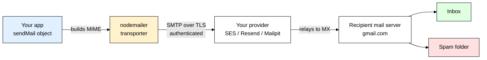
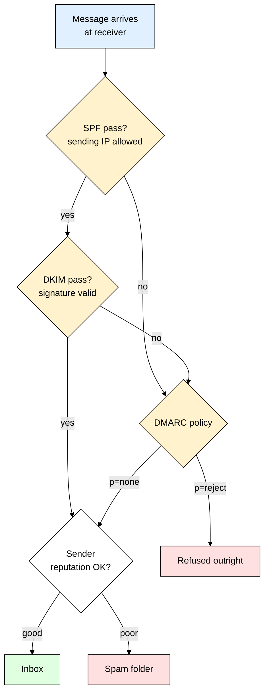
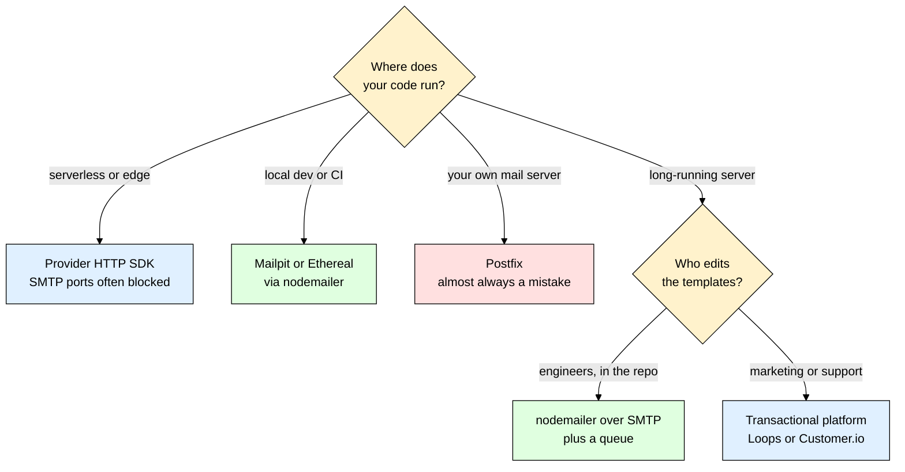

# nodemailer — Sending Email From Node Without Landing in Spam

> **Scope:** The `nodemailer` npm package — SMTP transports, `sendMail`, HTML mail and attachments, choosing a provider, deliverability (SPF/DKIM/DMARC), and sending mail off the request path.
> **Level:** Beginner + practical.
> **New to environment variables?** Read [[dotenv]] first — every credential in this file comes from `process.env`.

---

## 1. ELI5: What is nodemailer?

You built a signup route. It works. Now you need to send the user a "verify your email" link — and you realise Node has no `email.send()`. What you actually have to do is open a TCP socket to a mail server, greet it in a text protocol from 1982 called **SMTP**, authenticate, and hand over a message formatted with headers, MIME boundaries and base64-encoded attachments. Nobody wants to write that by hand.

Think of **nodemailer** as the **envelope desk in your company's mailroom**. You walk up with a letter. The clerk folds it correctly, picks the right envelope, writes the visible address on the front *and* the hidden routing slip the courier actually reads, weighs the attachments, and hands the whole thing across the counter to the courier company you have an account with. The clerk never drives anywhere and never touches the recipient's mailbox — the entire job is *speaking the courier's language correctly so the package is accepted.*

That is the thing beginners get wrong: nodemailer does **not** deliver email, it is a **client**. It hands your message to a mail server you have credentials for, and that server does the real delivery — so if your mail lands in spam, that is almost never a nodemailer bug, it is a DNS and reputation problem (section 8).

> **Type:** npm package — an SMTP client and MIME message builder for Node.js, with zero runtime dependencies.
> **Core promise:** Turn a plain JavaScript object into a correctly formatted email and hand it to an SMTP server over an authenticated, encrypted connection.



---

## 2. Why Does nodemailer Exist? (The Problem It Solves)

SMTP is a plain-text conversation over a socket. Here is roughly what "sending an email yourself" looks like — and this already cheats, because it skips TLS, authentication, MIME multipart, encoding and error handling:

```js
import net from "node:net";

// Exact order, and you must wait for a numeric reply after EVERY line.
const socket = net.createConnection(25, "mx.gmail.com", () => {
  socket.write("EHLO myapp.com\r\n");
  socket.write("MAIL FROM:<no-reply@myapp.com>\r\n"); // the envelope sender
  socket.write("RCPT TO:<user@gmail.com>\r\n");       // the envelope recipient
  socket.write("DATA\r\n");
  socket.write("From: no-reply@myapp.com\r\n");       // the *header* From — a different thing
  socket.write("Subject: Verify your email\r\n\r\n"); // blank line splits headers from body
  socket.write("Click here...\r\n.\r\n");             // a lone dot ends the message
});
```

| Doing it yourself | With nodemailer |
|---|---|
| Hand-write SMTP verbs and parse numeric reply codes | `await transporter.sendMail({ ... })` |
| Build MIME multipart bodies, boundaries, base64, quoted-printable by hand | Pass `text`, `html`, `attachments` — encoding is automatic |
| Escape a body line starting with `.` (it silently ends your message) | Handled |
| Negotiate STARTTLS, then handle AUTH LOGIN / PLAIN / XOAUTH2 | `secure` + `auth` config object |
| Open a fresh TCP connection per email and get rate-limited | `pool: true` reuses connections and paces sends |
| No easy way to point at a fake local server during tests | Swap the transport config — same code path |

nodemailer is not "an email service." It is the **correctness layer** between your object and the wire.

---

## 3. Installing & Basic Usage

```bash
npm install nodemailer
```

The smallest thing that actually sends:

```js
import nodemailer from "nodemailer";

// A "transporter" is a reusable, configured connection to ONE mail server. Create it
// ONCE at module scope — not inside your route handler.
const transporter = nodemailer.createTransport({
  host: process.env.SMTP_HOST,                   // e.g. "smtp.resend.com"
  port: Number(process.env.SMTP_PORT),           // 587 or 465 — see section 4
  secure: Number(process.env.SMTP_PORT) === 465, // true ONLY for 465
  auth: { user: process.env.SMTP_USER, pass: process.env.SMTP_PASS }, // see [[dotenv]]
});

const info = await transporter.sendMail({
  from: '"Acme" <no-reply@acme.com>',   // must be a domain you are allowed to send as
  to: "user@example.com",
  subject: "Verify your email",
  text: "Open https://acme.com/verify/abc123 to verify your account.", // ALWAYS include
  html: '<p>Open <a href="https://acme.com/verify/abc123">this link</a> to verify.</p>',
});

console.log(info.messageId); // log it — your handle when someone reports a problem
```

### CommonJS version

```js
const nodemailer = require("nodemailer");
const transporter = nodemailer.createTransport({
  host: process.env.SMTP_HOST,
  port: 587, secure: false,
  auth: { user: process.env.SMTP_USER, pass: process.env.SMTP_PASS },
});
module.exports = { transporter };
```

### Express example

```js
import express from "express";
import { transporter } from "./mailer.js";

const app = express();
app.use(express.json());
app.post("/contact", async (req, res) => {
  const { email, message } = req.body; // validate with [[zod]] before trusting it
  await transporter.sendMail({
    from: '"Acme Contact Form" <no-reply@acme.com>', // YOUR domain, always
    replyTo: email,                                  // the visitor's address goes HERE
    to: "support@acme.com",
    subject: "New contact form message",
    text: message,
  });
  res.status(202).json({ queued: true });
});
```

> ⚠️ That `await` inside the request handler is a real production bug, not a simplification. If your provider is slow this route hangs; if it is down, signup fails. Section 9 fixes it with [[bullmq]].

That's the entire mental model — build one `transporter` at boot, call `sendMail` with a plain object, and let nodemailer handle the protocol. Everything else here is about making that message actually *arrive*.

---

## 4. How Email Actually Gets Sent

Email has three roles, and knowing which one you are talking to explains every config option:

| Role | Full name | What it is | Example |
|---|---|---|---|
| **MUA** | Mail User Agent | The thing that *composes* a message | Gmail's web UI, Outlook, **your Node app** |
| **MSA** | Mail Submission Agent | The server you *submit* to with a username and password. Accepts mail on your behalf. | `smtp.resend.com`, `email-smtp.us-east-1.amazonaws.com` |
| **MTA** | Mail Transfer Agent | Relays mail between domains, finding the recipient's server via its **MX** DNS record | Your provider's outbound fleet, then Gmail's inbound servers |

nodemailer is a **MUA that speaks the submission protocol**. It talks to an MSA and stops there. Relaying, retrying, bounce handling and reputation all belong to your provider — that is why the diagram in section 1 has your app touching exactly one box.

### Ports and the `secure` flag

This is the single most common source of "it just hangs forever":

| Port | Name | nodemailer config | Notes |
|---|---|---|---|
| **587** | Submission with **STARTTLS** | `port: 587, secure: false, requireTLS: true` | **The default you want.** The connection starts plain, then upgrades to TLS via the `STARTTLS` command. `secure: false` does *not* mean unencrypted — it means "do not start in TLS." |
| **465** | Implicit TLS ("SMTPS") | `port: 465, secure: true` | TLS from the very first byte. Equally fine — use whichever your provider documents. |
| **25** | Server-to-server relay | — | **Blocked outbound by nearly every cloud provider** (AWS, GCP, Azure, DigitalOcean, Render) to fight spam. Never point your app here. |
| 2525 | Alternate submission | `secure: false` | Offered by some providers purely because 587 is occasionally blocked on office and hotel networks. |

`secure` answers exactly one question: *"is this socket TLS from byte zero?"* Setting `secure: true` on port 587 makes nodemailer send a TLS handshake to a server expecting plain text — so it waits, and your request times out with no useful error. The two correct shapes are `{ port: 587, secure: false, requireTLS: true }` and `{ port: 465, secure: true }`; `{ tls: { rejectUnauthorized: false } }` is never one of them, because it turns off certificate validation and hands your SMTP password to any machine in the middle.

---

## 5. The Transporter and `sendMail`

A transporter holds connection config and, with pooling, live sockets. Creating one per request throws away connection reuse and hammers your provider's connection limit.

```js
// mailer.js — one module, one transporter, imported everywhere
import nodemailer from "nodemailer";

const port = Number(process.env.SMTP_PORT ?? 587);

export const transporter = nodemailer.createTransport({
  host: process.env.SMTP_HOST,
  port, secure: port === 465,
  requireTLS: port !== 465,  // on 587, refuse to continue if STARTTLS is unavailable
  auth: { user: process.env.SMTP_USER, pass: process.env.SMTP_PASS },
  connectionTimeout: 10_000, // ms — don't let a dead provider hold a socket forever
});

// Fail fast at boot rather than hearing about bad credentials at 2am from a user.
await transporter.verify(); // connects, runs AUTH, closes. Rejects on bad config.
```

`verify()` catches the top three deployment mistakes immediately: a typo'd host, a rotated password, and a firewall blocking the port. Call it right next to your database connect. In a **serverless** function, skip it — you would pay that round trip on every cold start.

### The message object

```js
const info = await transporter.sendMail({
  from: { name: "Acme", address: "no-reply@acme.com" }, // the string form works too
  to: ["a@example.com", "b@example.com"], // string, array, or "Name <addr>"
  cc: "manager@example.com",              // visible to all recipients
  bcc: "audit@acme.com",                  // hidden from all recipients
  replyTo: "support@acme.com",            // where replies actually go
  subject: "Your receipt",
  text: "Plain text version.",            // never omit this
  html: "<p>HTML version.</p>",
  headers: { "X-Entity-Ref-ID": "order-1042" }, // custom headers your provider may track
});
```

Two rules matter more than the rest. First, **`from` must be an address you are authorised to send as** — SMTP will happily let you claim `from: "ceo@microsoft.com"`, and the receiving server will bin it, because your provider is not in Microsoft's SPF record. When relaying a user's message (contact form, "share with a friend"), put **your** domain in `from` and the user's address in `replyTo`. Second, **always send both `text` and `html`**: spam filters treat HTML-only mail as a negative signal, some clients render only plain text, and nodemailer builds the `multipart/alternative` body for you.

`sendMail` resolves with `info.messageId` (store it against the user record), `info.accepted` (addresses the server took), `info.rejected` (addresses it refused) and `info.response` (the raw final SMTP reply line).

**Rule of thumb:** `accepted` means *"my provider took responsibility for this message"* — not delivered, and certainly not read. Real delivery, bounces and complaints arrive later via your provider's webhooks.

---

## 6. HTML Email and Attachments

Mail clients strip anything they cannot sandbox, and Outlook on Windows still renders with Microsoft Word's HTML engine. So email HTML is stuck in 1999, on purpose:

- **Layout with `<table>`**, not flexbox or grid — many clients support neither.
- **Inline every style** (`style="..."` on the element). External stylesheets are stripped and `<style>` blocks are unreliable.
- **No JavaScript, no forms, no iframes.** Silently removed everywhere. Cap width around 600px, and expect dark mode to invert any colour you did not specify.
- **Always give images `alt` text** — most clients block remote images until the user clicks "show images."

```js
// templates/verify.js — one module per email, returning { subject, text, html }

// Escape ANY user-supplied value before it touches HTML — otherwise a user whose display
// name is '<a href="http://evil">Click</a>' just made you send a phishing link.
export function escapeHtml(value) {
  return String(value).replace(/&/g, "&amp;").replace(/</g, "&lt;")
    .replace(/>/g, "&gt;").replace(/"/g, "&quot;");
}

export function verifyEmailTemplate({ name, url }) {
  // `url` is generated by US from a signed token — never interpolate a user-supplied URL
  const html = `<html><body style="margin:0;padding:24px;background:#f4f4f5;">
  <table role="presentation" width="600" cellpadding="0" cellspacing="0"
         style="max-width:600px;margin:0 auto;background:#ffffff;border-radius:8px;">
    <tr><td style="padding:32px;font-family:Arial,sans-serif;font-size:16px;color:#111111;">
      <p style="margin:0 0 24px;">Hi ${escapeHtml(name)}, confirm your email to sign up.</p>
      <a href="${url}" style="padding:12px 20px;background:#111111;color:#ffffff;
         text-decoration:none;border-radius:6px;">Verify email</a>
    </td></tr>
  </table></body></html>`;
  // The plaintext twin. Keep it genuinely readable, not "please view in HTML".
  const text = `Hi ${name},\n\nConfirm your email address:\n${url}\n\n- Acme`;
  return { subject: "Verify your email", html, text };
}
```

**Never build templates inside route handlers.** A plain render function like the one above is fine for one to five emails. Past that, reach for a real templating layer: **MJML** compiles its own markup down to bulletproof nested-table HTML, **React Email** gives you components plus a preview server if your team already writes React, and Handlebars or EJS suit file-based templates a designer can edit.

### Attachments

```js
await transporter.sendMail({
  from: '"Acme" <billing@acme.com>',
  to: "user@example.com",
  subject: "Invoice 1042",
  text: "Your invoice is attached.",
  html: '<p>Your invoice is attached.</p>',
  attachments: [
    { filename: "invoice-1042.pdf", path: "./tmp/invoice-1042.pdf" },   // streamed, not buffered
    { filename: "report.csv", content: Buffer.from("id,total\n1,42\n") }, // straight from memory
    { filename: "logo.png", path: "./assets/logo.png", cid: "logo@acme" }, // inline, see src above
  ],
});
```

> ⚠️ If any part of a message can be influenced by user input, set `disableFileAccess: true` and `disableUrlAccess: true` on the transport. Otherwise a crafted `path` lets an attacker attach `/etc/passwd` or make your server fetch an internal URL.

Keep total message size under about **10 MB** — many receivers reject larger, and base64 inflates attachments by roughly 33%. For anything bigger, email a signed download link instead.

---

## 7. Choosing a Provider

nodemailer talks to *any* SMTP server. The server you choose decides cost, limits, and whether your mail arrives.

| Provider | Cost / limits | Good for | Watch out for |
|---|---|---|---|
| **Gmail SMTP** (`smtp.gmail.com:587`) | Free, roughly 500 recipients/day on consumer accounts | Hobby projects, a personal cron script | Your normal password is **rejected** — enable 2FA and generate an **App Password**. Gmail rewrites `from` to your own address. Not for product email, ever. |
| **Amazon SES** | ~$0.10 per 1,000 emails — cheapest at scale | High volume, teams already on AWS | Starts in a **sandbox** (verified recipients only) until you request production access. SMTP credentials are *derived* from an IAM user, not your raw access key. |
| **Resend** | Free tier for low volume, simple DNS setup | Modern apps, strong developer experience | Newer and smaller feature surface than the incumbents |
| **Postmark** | Pricier, famously strong transactional deliverability | Password resets and receipts where arrival is non-negotiable | Strictly separates transactional and bulk streams — by design |
| **SendGrid / Mailgun** | Mature APIs, broad routing features | Established platforms with complex routing needs | Shared IP pools mean your reputation is partly other people's |
| **Ethereal** | Free, nothing is ever delivered | **Automated tests and quick local checks** | Purely a capture service — messages exist only as a preview URL |
| **Mailpit / MailHog** | Free, runs locally in Docker | **Day-to-day local development** | Nothing leaves your machine — that is the point |

### Development: never point at a real provider

Sending real mail in development means real bounces against your domain reputation, real accidental mail to real addresses sitting in your seed data, and a slow feedback loop. Use a **catch-all mail sink** instead. **Ethereal** needs zero setup, is run by nodemailer's own author, and is ideal inside tests:

```js
import nodemailer from "nodemailer";

// Creates a throwaway inbox on the fly. Nothing is delivered anywhere.
const account = await nodemailer.createTestAccount();
const transporter = nodemailer.createTransport({
  host: account.smtp.host, port: account.smtp.port, secure: account.smtp.secure,
  auth: { user: account.user, pass: account.pass },
});

const info = await transporter.sendMail({
  from: "dev@example.com", to: "someone@example.com",
  subject: "Test", text: "hello", html: "<p>hello</p>",
});
// A browsable URL of exactly what the message looked like — HTML, headers, raw source.
console.log(nodemailer.getTestMessageUrl(info));
```

**Mailpit** is a local SMTP server with a web inbox — better for everyday work, because it persists and needs no network. Run the one-line Docker command from the cheat sheet, point `SMTP_HOST` at `localhost` and `SMTP_PORT` at `1025`, and read your mail at `http://localhost:8025`. It accepts anonymous submission, so attach `auth` only when a real provider needs it.

**Rule of thumb:** local development → **Mailpit**; automated tests → **Ethereal** or a stub transport you assert against; staging and production → a real provider on a **subdomain** like `mail.acme.com`, so a staging mishap cannot damage your main domain's reputation.

---

## 8. Deliverability — Why Your Mail Goes to Spam

Your code works. `info.accepted` has one address in it. The email is in the spam folder. This section is the difference between "it sends" and "it arrives" — and none of it lives in JavaScript. It lives in **DNS**.

The receiving server asks one core question: *"can this sender prove they are allowed to use this domain?"* Three DNS records answer it.

**SPF — which servers may send for my domain.** A TXT record listing the servers permitted to send as you; the receiver checks whether the connecting server is on the list. `include:` delegates to your provider's own list, and `-all` means "reject anything not listed" — stricter and better than the softer `~all` once you are confident the list is complete. You get **one** SPF record per domain, so multiple senders must be merged into that single record.

**DKIM — a cryptographic signature proving it is really from you.** Your provider signs each message with a private key; you publish the matching **public key** in DNS under a *selector*. The receiver verifies the signature, which also proves the signed headers and body were not altered in transit. nodemailer *can* sign messages itself via a `dkim` option, but let the provider do it — they rotate keys and handle edge cases you should not own.

**DMARC — what to do when the first two fail.** DMARC ties SPF and DKIM to the `From:` address the human actually sees (this is called **alignment**) and states your policy for failures, plus where to send reports. Start at `p=none` (monitor only) and read the reports for a couple of weeks, move to `p=quarantine` (failures go to spam), and finish at `p=reject` (failures refused outright). Since 2024, Gmail and Yahoo **require** SPF, DKIM and a DMARC record from bulk senders.

```text
acme.com.                    TXT  "v=spf1 include:amazonses.com -all"
resend._domainkey.acme.com.  TXT  "v=DKIM1; k=rsa; p=MIGfMA0GCSqGSIb3..."
_dmarc.acme.com.             TXT  "v=DMARC1; p=none; rua=mailto:dmarc@acme.com"
```



### The rest of the checklist

- **Verify your sending domain** with the provider before sending anything, and never put a free-mail address you don't control in `From` (`from: "user@gmail.com"`) — Gmail publishes a strict DMARC policy, so you are forging their domain. Use `replyTo` instead.
- **Give bulk mail a real one-click unsubscribe.** Pass `headers: { "List-Unsubscribe": "<https://acme.com/unsub?t=abc>", "List-Unsubscribe-Post": "List-Unsubscribe=One-Click" }` — the second header is what enables Gmail's native unsubscribe button. Burying the link makes people hit "report spam" instead, which is far more damaging.
- **Split transactional and marketing onto separate subdomains** (`mail.acme.com` vs `news.acme.com`) so one bad campaign cannot sink your password-reset emails.
- **Avoid obvious spam triggers:** ALL CAPS SUBJECTS, "FREE!!!", a single giant image with almost no text, link shorteners, and link text that does not match its destination. And **warm up a new domain** — 50,000 emails on day one from a domain with no history looks exactly like a compromised server, so ramp over 2-4 weeks starting in the low hundreds per day.
- **Process bounces and complaints.** Repeatedly mailing dead addresses destroys reputation faster than anything else. Wire up your provider's bounce webhook and permanently suppress those addresses.

---

## 9. Sending Email in the Background

Never `await sendMail` inside a request handler. Three reasons, all of which you will hit in production:

1. **Latency** — a send means a TCP connect, TLS handshake, AUTH and a data round trip. That is 300ms on a good day and several seconds on a bad one, sitting inside your user's signup request.
2. **Coupling** — if the provider has an incident, your signup endpoint returns 500 and nobody can register. Sending a receipt is not a reason to fail a purchase.
3. **No retries** — a transient `421 Too many connections` throws once and the email is gone forever. Your user never receives their password reset link.

The fix is a **queue**: the request writes a job and returns in milliseconds, and a separate worker process sends with retries and exponential backoff. See [[bullmq]] for the full picture.

```js
// queue.js — BullMQ requires maxRetriesPerRequest: null on the connection, see [[ioredis]]
import { Queue } from "bullmq";
import IORedis from "ioredis";
export const connection = new IORedis(process.env.REDIS_URL, { maxRetriesPerRequest: null });
export const emailQueue = new Queue("email", { connection });
```

```js
// routes/signup.js
import { app } from "../app.js";
import { emailQueue } from "../queue.js";
import { User } from "../models/user.js";
import { hashPassword } from "../lib/passwords.js"; // see [[bcrypt]]

app.post("/signup", async (req, res) => {
  const passwordHash = await hashPassword(req.body.password);
  const user = await User.create({ email: req.body.email, passwordHash });
  // BullMQ ignores an add() whose jobId already exists, so a double submit or a client
  // retry cannot enqueue the same welcome email twice.
  await emailQueue.add("welcome", { userId: user.id.toString() }, { // IDs, not rendered HTML
    jobId: `welcome:${user.id}`,
    attempts: 5,
    backoff: { type: "exponential", delay: 5_000 }, // 5s, 10s, 20s, 40s, 80s
    removeOnComplete: 1_000,                        // keep the last 1000 for debugging
  });
  res.status(201).json({ id: user.id }); // returns in ms; mail is someone else's job
});
```

```js
// worker.js — run as a SEPARATE process: `node worker.js`
import { Worker } from "bullmq";
import { connection } from "./queue.js";
import { transporter } from "./mailer.js";
import { logger } from "./logger.js";             // see [[winston_morgan]]
import { User } from "./models/user.js";
import { EmailLog } from "./models/email-log.js"; // [[mongoose]] model, unique index on `key`
import { welcomeTemplate } from "./templates/welcome.js";

new Worker("email", async (job) => {
  const user = await User.findById(job.data.userId).lean();
  if (!user) return; // deleted between enqueue and send — don't fail the job over it

  // Second idempotency layer: claim the send in the DB first, so a worker that crashes
  // AFTER sending but BEFORE acking cannot send the same email twice on replay.
  const key = `${job.name}:${user._id}`;
  const claim = await EmailLog.findOneAndUpdate(
    { key },
    { $setOnInsert: { key, to: user.email, status: "sending" } },
    { upsert: true, new: false }, // new:false → null means WE just created the row
  );
  if (claim && claim.status === "sent") return; // already delivered, skip silently

  const { subject, text, html } = welcomeTemplate({ name: user.name });
  const info = await transporter.sendMail({
    from: '"Acme" <no-reply@acme.com>', to: user.email, subject, text, html,
  });
  await EmailLog.updateOne({ key }, { status: "sent", messageId: info.messageId });
  logger.info({ event: "email.sent", key, messageId: info.messageId });
}, { connection, concurrency: 5 }); // keep concurrency at or below maxConnections
```

### Pooling, rate limits and the production transport

Once a worker sends in a loop, a fresh TCP and TLS handshake per message is wasteful and will trip your provider's connection limit. Turn on **pooling**, and while you are there add the timeouts and the two `disable*` flags that stop untrusted input naming a file path or URL to attach:

```js
nodemailer.createTransport({
  /* ...host, port, secure, requireTLS, auth as in section 5... */
  pool: true,        // keep sockets open and reuse them across messages
  maxConnections: 5, // parallel sockets — match your provider's documented limit
  maxMessages: 100,  // recycle a connection after N messages (providers often force this)
  rateDelta: 1_000, rateLimit: 10, // at most 10 messages per 1000ms window
  connectionTimeout: 10_000, greetingTimeout: 10_000, socketTimeout: 20_000,
  disableFileAccess: true, disableUrlAccess: true,
});
```

`rateDelta` plus `rateLimit` make nodemailer pace itself, so you are throttled by your own code rather than by the provider's `421` responses — set it just under your plan's documented rate. With `pool: true` idle sockets keep the process alive, so call `transporter.close()` in your `SIGTERM` handler.

---

## 10. TypeScript Version

```bash
npm install nodemailer
npm install --save-dev @types/nodemailer   # nodemailer ships no types of its own
```

```ts
// mailer.ts
import nodemailer, { type SendMailOptions } from "nodemailer";

const port = Number(process.env.SMTP_PORT ?? 587);
// The transporter type is inferred — no annotation, no subpath type import needed.
export const transporter = nodemailer.createTransport({
  host: process.env.SMTP_HOST!,
  port, secure: port === 465, requireTLS: port !== 465,
  auth: { user: process.env.SMTP_USER!, pass: process.env.SMTP_PASS! },
  pool: true,
});

// Narrow the surface your app can use: `from` is decided centrally, so no caller can
// accidentally send as a domain you don't own, and `text` is required, not optional.
export interface AppMail {
  to: string | string[];
  subject: string;
  text: string;   // required — enforces the plaintext twin
  html: string;
  replyTo?: string;
  attachments?: SendMailOptions["attachments"]; // nodemailer's own attachment type
}

export async function sendAppMail(mail: AppMail) {
  return await transporter.sendMail({ from: { name: "Acme", address: "no-reply@acme.com" }, ...mail });
}
```

```ts
// routes/contact.ts — validate before anything reaches a mail header, see [[zod]]
import { Router, type Request, type Response } from "express";
import { z } from "zod";
import { sendAppMail } from "../mailer.js";
import { escapeHtml } from "../templates/verify.js";

const contactSchema = z.object({
  email: z.email(),                      // Zod v4 top-level helper; v3: z.string().email()
  message: z.string().min(1).max(5_000),
});
export const contactRouter = Router();

// [[express]] 5 forwards a rejected promise to the error handler; on 4, wrap the handler.
contactRouter.post("/contact", async (req: Request, res: Response) => {
  const parsed = contactSchema.safeParse(req.body);
  if (!parsed.success) {
    res.status(400).json({ errors: parsed.error.issues });
    return; // a handler returns void — `return res.json(...)` fails the typecheck
  }
  await sendAppMail({
    to: "support@acme.com",
    replyTo: parsed.data.email, // validated, so it cannot inject an extra header
    subject: "New contact message",
    text: parsed.data.message,
    html: `<pre>${escapeHtml(parsed.data.message)}</pre>`,
  });
  res.status(202).json({ ok: true });
});
```

---

## 11. Production Setup

Mail configuration lives entirely in the environment — `SMTP_HOST`, `SMTP_PORT`, `SMTP_USER`, `SMTP_PASS`, `MAIL_FROM` and `REDIS_URL`, loaded via [[dotenv]] or your platform's secret store and never committed. Build the pooled transport from section 9, `await transporter.verify()` before `app.listen()` so bad credentials crash the deploy instead of failing silently, and read `MAIL_FROM` in exactly one module so no route can invent its own sender.

| Concern | What to do |
|---|---|
| **Where mail is sent from** | A dedicated **worker process** (`node worker.js`), separate from your web processes, so they scale and restart independently. |
| **Secrets** | Provider credentials in your platform's secret manager. Rotate SMTP passwords like any credential — `verify()` surfaces a stale one at deploy time. |
| **Observability** | Log every send with `messageId`, template name and recipient via [[winston_morgan]]. Alert on the queue's failed-job count, not on individual errors. |
| **Suppression list** | A [[mongoose]] collection of hard-bounced and complained addresses, checked before every send and never mailed again. Fill it from an endpoint that receives your provider's bounce and complaint webhooks — verify the webhook signature. |
| **Staging safety** | Point staging at Mailpit or a provider sandbox, or add a global allow-list so only `@acme.com` addresses can receive. Test data contains real customer emails more often than you think. |
| **Templates** | Version them in the repo with a preview route or snapshot tests — a broken template ships silently otherwise. |

---

## 12. Common Gotchas & Best Practices

| Gotcha | Fix |
|---|---|
| **`secure: true` on port 587** — the connection hangs, then times out with no useful message | `secure` means "TLS from byte zero." Use `port: 587, secure: false, requireTLS: true`, or `port: 465, secure: true`. Nothing else. |
| **Gmail rejects your account password** with `535-5.7.8 Username and Password not accepted` | Google no longer accepts plain account passwords over SMTP. Enable 2FA and generate an **App Password** — and do not use Gmail for product email, the daily cap is a few hundred recipients. |
| **`from` set to the user's own address** on a contact form, and everything lands in spam | The user's domain never authorised your server. Put your verified domain in `from` and their address in `replyTo`. |
| **HTML-only email** with no `text` field | Costs you a spam score for nothing and renders blank in plaintext clients. Always send both — nodemailer builds the `multipart/alternative` for you. |
| **`await sendMail` inside the request handler** — signup hangs or 500s during a provider incident | Enqueue with [[bullmq]] and send from a worker with exponential backoff. The user should never wait on SMTP. |
| **A retry sends the same email twice** | `sendMail` is not idempotent. Use a deterministic BullMQ `jobId` *plus* a uniquely-indexed `EmailLog` row claimed before sending, as in section 9. |
| **`tls: { rejectUnauthorized: false }` copied from a Stack Overflow answer** | This disables certificate validation and hands your SMTP password to any MITM. Delete it and fix the real cause — usually a wrong `host` or a TLS-inspecting corporate proxy. |
| **Unescaped user input in an HTML template** | A display name containing an `<a>` tag turns your transactional email into a phishing page sent from *your* verified domain. Escape every interpolated value. |

---

## 13. Alternatives — When nodemailer Isn't the Best Fit

| Option | What it is | Best for | Trade-off |
|---|---|---|---|
| **nodemailer over SMTP** | A universal SMTP client that works with every provider plus local sinks. | Long-running Node servers and workers; keeping providers swappable behind one config object. | Needs outbound 587/465 open, and connection setup costs more latency than plain HTTP. |
| **A provider's HTTP API SDK** (`resend`, `@aws-sdk/client-sesv2`, `postmark`) | A REST call instead of an SMTP session. | **Serverless and edge** — Vercel, Cloudflare Workers and many Lambda setups block or poorly support outbound SMTP. Also unlocks scheduling, tagging and hosted templates. | Lock-in: switching providers means rewriting the send path, not editing an env var. |
| **nodemailer plus a provider transport plugin** | nodemailer's API on top of a provider's HTTP transport. | Keeping the `sendMail` shape you already have while moving off raw SMTP. | Plugin quality varies by provider — check the package is actively maintained first. |
| **A transactional email platform** (Loops, Customer.io, Knock) | A hosted service owning templates, localisation, user preferences and multi-channel delivery. | Products with dozens of notification types where non-engineers must edit copy. | Another vendor and bill, and template logic now lives outside your repo. |
| **Self-hosted Postfix or a raw MTA** | Running your own mail server. | Almost nobody. | You inherit IP reputation, blocklists, TLS certs, bounce processing and abuse handling — full-time work with no product upside. |



**Rule of thumb:** on a normal Node server use **nodemailer over SMTP behind a queue** — it keeps providers swappable and local testing trivial. On serverless use the provider's **HTTP SDK**, because outbound SMTP is unreliable or blocked there. Either way the DNS work in section 8 is identical, and matters far more than the client you pick.

---

## 14. Interview Questions

**Q: What does nodemailer actually do — is it a mail server?**
A: No. It is an SMTP **client** and a MIME message builder. It takes a JavaScript object, encodes it into a valid message with proper headers and multipart bodies, opens an authenticated TLS connection to a mail server you have credentials for, and hands the message over. Everything after that — relaying to the recipient's domain, retrying, handling bounces — is your provider's job.

**Q: Ports 587, 465 and 25 — what is the difference, and what does the `secure` flag mean?**
A: 587 is the submission port using STARTTLS, where the connection begins in plain text and is upgraded to TLS mid-session; 465 is implicit TLS, encrypted from the first byte; 25 is for server-to-server relay and is blocked outbound by essentially every cloud provider. nodemailer's `secure` flag means only "start the socket in TLS," so it is `true` for 465 and `false` for 587. Setting `secure: true` on 587 is the classic cause of a connection that hangs until it times out.

**Q: Explain SPF, DKIM and DMARC to someone who has never touched DNS.**
A: SPF is a public list of which servers are allowed to send mail for your domain. DKIM is a cryptographic signature on each message, verified against a public key you publish in DNS, proving both the sender and that the signed content was not tampered with. DMARC ties both to the visible `From:` address and tells receivers what to do when they fail — monitor, quarantine, or reject — plus where to send reports. Since 2024 Gmail and Yahoo require all three from bulk senders, so a missing DMARC record alone can send you to spam.

**Q: Why should you never `await sendMail` inside an HTTP request handler?**
A: An SMTP send is a multi-round-trip network call that can take seconds and can fail transiently. Awaiting it puts provider latency directly into your user's request and couples signup availability to your email vendor's uptime — if they have an incident, registrations start failing. It also means a transient failure loses the email permanently, since there is nothing to retry it. Enqueue a job instead and send from a worker with exponential backoff.

**Q: How do you make email sending idempotent?**
A: `sendMail` gives you no idempotency, so a retried job genuinely sends a second email. Use two layers: a deterministic job id like `welcome:<userId>` so the queue refuses a duplicate enqueue, and a uniquely-indexed ledger row claimed before sending and marked `sent` afterwards, so a crash between send and acknowledgement does not cause a resend. Store the provider's `messageId` on that row so you can trace any individual message later.

**Q: Someone reports "our emails go to spam." How do you debug it?**
A: Start with DNS, not code: confirm the sending domain is verified with the provider and that SPF, DKIM and DMARC exist and align with the `From:` domain. Then check whether you are sending as a domain you do not own — a contact form using the visitor's address as `From` fails SPF and DMARC by definition. After that look at content and reputation: HTML-only messages, a missing unsubscribe header on bulk mail, a brand-new unwarmed domain, and unprocessed hard bounces are the usual causes.

---

## 15. Quick Cheat Sheet

```bash
npm install nodemailer && npm install --save-dev @types/nodemailer

# Local mail sink — SMTP on :1025, web inbox at http://localhost:8025
docker run -d --name mailpit -p 1025:1025 -p 8025:8025 axllent/mailpit
```

```js
// Transporter — build once, at module scope
export const transporter = nodemailer.createTransport({
  host: process.env.SMTP_HOST,
  port: 587, secure: false, requireTLS: true, // secure is true ONLY for port 465
  auth: { user: process.env.SMTP_USER, pass: process.env.SMTP_PASS },
  pool: true, maxConnections: 5, rateDelta: 1_000, rateLimit: 10,
});
await transporter.verify(); // fail fast at boot

const info = await transporter.sendMail({
  from: '"Acme" <no-reply@acme.com>', // a domain YOU are authorised to send as
  to: "user@example.com", replyTo: "support@acme.com",
  subject: "Your receipt",
  text: "Plain text version.",        // always include
  html: "<p>HTML version.</p>",
  attachments: [{ filename: "a.pdf", path: "./a.pdf" }],
});
console.log(info.messageId, info.accepted, info.rejected);
```

**Mental model to remember:**
> nodemailer is a *client*, not a mail service — it formats your message and hands it to an SMTP server you have credentials for, then stops. Getting it to send takes ten lines; getting it to *arrive* takes SPF, DKIM, DMARC, a verified domain and a clean reputation, and getting it to be reliable takes moving the send off the request path. Pair it with [[dotenv]] for credentials, [[bullmq]] for retries, [[zod]] for validating anything that reaches a header, and [[winston_morgan]] for logging every `messageId` you send.
