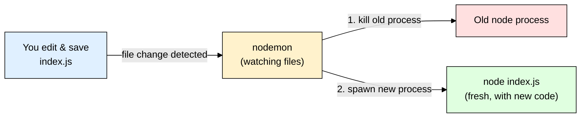

# nodemon — Auto-Restarting Node.js on File Changes

> **Scope:** Node.js backend dev tooling. Covers `nodemon`, Node's native `--watch` flag, and TypeScript watch alternatives (`tsx watch`, `ts-node-dev`).
> **Level:** Beginner + practical.

---

## 1. ELI5: What is nodemon?

Normally, when you run a Node app:

```bash
node index.js
```

...and then you edit `index.js` and save — **nothing happens**. The server you started is still running the **old** code. You have to manually stop it (`Ctrl+C`) and run `node index.js` again, every single time you change a line. During active development, that's dozens of times per hour.

**nodemon** is like having an assistant standing behind you who **watches your files**, and the instant you save a change, they **automatically kill the old server and restart it** for you — so you just save your file and refresh the browser/hit the API again.

> **Full name:** "Node Monitor"
> **Type:** npm package (dev dependency), CLI tool
> **Core promise:** Auto-restart your Node process whenever a watched file changes — no more manual `Ctrl+C` + rerun.



---

## 2. Why Does nodemon Exist? (The Problem It Solves)

| Without nodemon | With nodemon |
|---|---|
| Edit file → `Ctrl+C` → `node index.js` → repeat, forever | Edit file → save → server restarts automatically |
| Easy to forget you're testing stale code | Always running the latest code |
| Breaks your flow every single change | You stay focused on the code, not the terminal |

This is purely a **developer experience (DX)** tool. It changes **nothing** about how your app runs in production — it just wraps `node` and adds a "watch and restart" loop on top, for local development.

> ⚠️ **Important:** nodemon is a **dev dependency only**. Never use it to run your app in production — production should run `node index.js` (or a process manager like PM2/systemd) directly, not through a file-watcher.

---

## 3. Installing & Basic Usage

```bash
npm install --save-dev nodemon
```

Instead of:

```bash
node index.js
```

Run:

```bash
npx nodemon index.js
```

That's the entire mental model — **swap `node` for `nodemon`**, everything else is identical (same args, same env vars, same output).

### Typical `package.json` setup

```json
{
  "scripts": {
    "start": "node index.js",
    "dev": "nodemon index.js"
  }
}
```

```bash
npm run dev
```

Now every save to a `.js`/`.mjs`/`.cjs`/`.json` file in your project auto-restarts the server.

---

## 4. Configuration (`nodemon.json`)

For anything beyond the default behavior, create a `nodemon.json` in your project root:

```json
{
  "watch": ["src"],
  "ext": "js,json,ts",
  "ignore": ["src/**/*.test.js", "node_modules"],
  "exec": "node src/index.js",
  "delay": 400,
  "env": {
    "NODE_ENV": "development"
  }
}
```

| Option | What it does |
|---|---|
| `watch` | Which folders/files to watch. Default: current directory. |
| `ext` | Which file extensions trigger a restart (default: `js,mjs,cjs,json`). |
| `ignore` | Paths to **never** watch — always ignore `node_modules`, test files, logs, `.git`. |
| `exec` | The command to actually run (lets you run TypeScript, e.g. `"exec": "ts-node src/index.ts"`). |
| `delay` | Milliseconds to wait after a change before restarting — avoids multiple rapid restarts when several files save at once (e.g. from a formatter). |
| `env` | Environment variables to inject automatically, e.g. always set `NODE_ENV=development` in dev. |

You can also pass most of these as CLI flags instead of a config file:

```bash
nodemon --watch src --ext js,ts --ignore "src/**/*.test.js" --exec "node src/index.js"
```

### Manually restarting / other handy bits

- Type `rs` + Enter in the terminal running nodemon → forces an immediate restart (useful if a change wasn't in a watched file).
- `nodemon --inspect index.js` → keeps the Node debugger attached across restarts.

---

## 5. Common Gotchas & Best Practices

| Gotcha | Fix |
|---|---|
| Restarts on every tiny change, even `.log`/`.md` files | Set `ext` to only the extensions that matter (`js,json`) and add an `ignore` list. |
| Watching `node_modules` makes it painfully slow | `node_modules` is ignored by default — don't manually add it to `watch`. |
| Rapid-fire restarts when a formatter/linter saves multiple files at once | Increase `delay` (e.g. `400`–`1000` ms). |
| Env vars from `.env` not visible | nodemon doesn't read `.env` files itself — pair it with `dotenv` in your code (see [[dotenv]]), or use nodemon's own `env` config key. |
| Using nodemon in production | Don't. Use `node index.js` directly, managed by PM2/systemd/Docker restart policies — file-watching has no purpose once there's no developer editing files live. |
| Crashes silently and doesn't restart | By default nodemon **does** restart after a crash (unlike plain `node`), but check `nodemon.json` if you've set `restartable: false` or similar overrides. |

---

## 6. The Modern Alternative: Node's Native `--watch` Flag

Since **Node.js v18.11 (experimental)**, stable in **v19+/v20+**, Node has **built-in** file watching — no package needed at all:

```bash
node --watch index.js
```

This does the same core job as nodemon: watches your files, restarts on change. There's also `--watch-path` to scope which directories to watch:

```bash
node --watch --watch-path=./src index.js
```

### `nodemon` vs `node --watch` — Comparison

| Feature | `nodemon` (npm package) | `node --watch` (native) |
|---|---|---|
| Requires install | Yes (`npm install --save-dev nodemon`) | No — built into Node |
| Min Node version | Any (works even on very old Node) | v18.11+ (experimental), stable v20+ |
| Config file (`nodemon.json`) | Yes — rich options | No config file; CLI flags only |
| `ignore` patterns | Fine-grained glob ignore list | Basic — ignores `node_modules` by default, less flexible |
| Custom `exec` command (e.g. run through `ts-node`) | Yes, first-class (`exec` option) | Indirect — you `node --watch` a JS entry, or combine with `--experimental-strip-types` for basic TS |
| Manual restart (`rs` command) | Yes | No |
| Maturity / ecosystem | Extremely mature, used since ~2010, tons of docs/StackOverflow answers | Newer, fewer edge-case guides, still evolving |
| Extra dependency in `package.json` | Yes | No — zero dependencies |

**Rule of thumb:**
- **Simple project, modern Node (18.11+/20+), want zero extra dependencies?** → Use `node --watch index.js`. It's genuinely enough for most everyday dev loops now.
- **Need fine-grained ignore rules, a config file, restart-on-demand (`rs`), or you're on an older Node version / working in a team used to nodemon conventions?** → Use `nodemon`.

```json
{
  "scripts": {
    "dev": "node --watch index.js"
  }
}
```

---

## 7. TypeScript Projects: Watch Tools

If your entry file is `.ts`, plain `node`/`nodemon` can't run it directly — you need something that also **compiles/transpiles on the fly**.

| Tool | What it is | Typical command |
|---|---|---|
| **`tsx watch`** | Fast TS/ESM runner (esbuild-based) with built-in watch mode. Most popular modern choice. | `npx tsx watch src/index.ts` |
| **`ts-node-dev`** | Older combo of `ts-node` + auto-restart, similar spirit to nodemon but TS-aware. | `npx ts-node-dev src/index.ts` |
| **`nodemon` + `ts-node`** | Use nodemon purely as the watcher, delegate execution to `ts-node` via `exec`. | `nodemon --exec "ts-node src/index.ts"` (or set `"exec"` in `nodemon.json`) |
| **`node --watch` + `tsc --watch` (two terminals)** | Compile TS → JS in one terminal, run+watch the compiled JS with native `node --watch` in another. | `tsc --watch` and `node --watch dist/index.js` |

**Rule of thumb for TypeScript:** `tsx watch` is the simplest, fastest modern default for most projects today — one command, no separate compile step, no extra config. Reach for `nodemon --exec "ts-node ..."` mainly if you're already invested in nodemon's config/ignore ecosystem.

```json
{
  "scripts": {
    "dev": "tsx watch src/index.ts"
  }
}
```

---

## 8. Quick Cheat Sheet

```bash
# Install
npm install --save-dev nodemon

# Basic use (swap `node` for `nodemon`)
npx nodemon index.js

# With config file
# nodemon.json → { "watch": ["src"], "ext": "js,json", "ignore": ["node_modules"] }
npx nodemon

# TypeScript via nodemon
nodemon --exec "ts-node src/index.ts" --ext ts

# Modern zero-dependency alternative (Node 18.11+/20+)
node --watch index.js

# Modern TypeScript zero-config alternative
npx tsx watch src/index.ts
```

**Mental model to remember:**
> nodemon (or `node --watch` / `tsx watch`) = a wrapper around `node` that watches your files and restarts the process for you. It's a **dev-only convenience** — it changes nothing about how the app behaves, only how fast you can iterate while building it.
