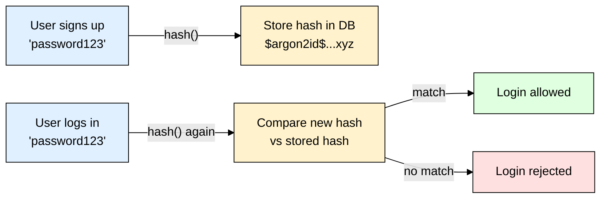

# Password Hashing — Argon2, bcrypt & scrypt (Node.js/Express)

> **Scope:** Storing & verifying user passwords safely in a Node.js/Express backend. Covers `argon2`, `bcrypt`, and `scrypt` (Node's built-in `crypto.scrypt`), plus salt/pepper.
> **Level:** Beginner + practical.

---

## 1. ELI5: What is password hashing?

If you store passwords as plain text in your database and it ever leaks, every user's real password is exposed instantly — and most people reuse passwords, so one leak compromises their other accounts too.

**Hashing** turns `"password123"` into a scrambled, fixed-length string like `$argon2id$v=19$m=65536...`. It's a **one-way street** — there's no "unhash" function. To check a login, you hash what the user just typed *again* and compare the two hashes. You never store, and never need, the original password.



> ⚠️ **Never use plain fast hashes (MD5, SHA-1, SHA-256) for passwords.** They're built for *speed* — attackers can try billions of guesses/sec on a stolen hash dump using GPUs. Password hashing algorithms are deliberately **slow** and **memory-hard** to make that infeasible.

---

## 2. Salt — why identical passwords must not look identical

A **salt** is a random string generated per-password and mixed in before hashing. It's not secret — it's stored right next to the hash.

| Without salt | With salt |
|---|---|
| Two users with `"password123"` → **identical hash** | Two users with `"password123"` → **different hashes** |
| Attacker precomputes a "rainbow table" of common password hashes once, cracks everyone at once | Attacker must crack each hash individually — precomputed tables are useless |

**Good news:** `argon2`, `bcrypt`, and `scrypt` (used correctly) all generate and embed the salt for you automatically — it lives inside the output string, so you never manage it by hand.

---

## 3. Pepper — the optional extra layer

A **pepper** is a single secret value (like an API key), stored in your **environment variables** (not the DB), that you append to every password before hashing.

- **Salt** → unique per user, stored in DB, defeats rainbow tables.
- **Pepper** → same for all users, stored outside the DB (`.env`/secrets manager), means a stolen *database* alone isn't enough — the attacker also needs your server's secret.

```js
const crypto = require("crypto");
const PEPPER = process.env.PASSWORD_PEPPER; // never commit this

function withPepper(password) {
  return crypto.createHmac("sha256", PEPPER).update(password).digest("hex");
}

// then hash `withPepper(password)` with argon2/bcrypt as normal
```

> Pepper is a defense-in-depth bonus, not a replacement for salting — skip it if it adds complexity you're not ready to manage (losing the pepper locks out every user).

---

## 4. Argon2 (recommended default)

Winner of the 2015 Password Hashing Competition. Has 3 variants — **use `argon2id`**, which balances resistance to both GPU-cracking and side-channel attacks (this is the library's default).

```bash
npm install argon2
```

```js
const argon2 = require("argon2");

// Signup — hash & store
async function hashPassword(plainPassword) {
  return await argon2.hash(plainPassword); // salt is generated & embedded automatically
}

// Login — verify
async function checkPassword(plainPassword, storedHash) {
  return await argon2.verify(storedHash, plainPassword);
}
```

```js
// Express example
app.post("/signup", async (req, res) => {
  const hash = await hashPassword(req.body.password);
  await User.create({ email: req.body.email, passwordHash: hash });
  res.sendStatus(201);
});

app.post("/login", async (req, res) => {
  const user = await User.findOne({ email: req.body.email });
  if (!user || !(await checkPassword(req.body.password, user.passwordHash))) {
    return res.status(401).send("Invalid credentials");
  }
  res.send("Logged in");
});
```

### Tuning cost (optional)

```js
await argon2.hash(plainPassword, {
  type: argon2.argon2id,
  memoryCost: 65536, // KB of RAM used per hash (higher = harder to crack in parallel on GPUs)
  timeCost: 3,        // number of iterations
  parallelism: 4,      // threads
});
```

Higher values = slower hashing = more expensive to brute-force, but also slower for *your* server on every login. Node's `argon2` package ships sane defaults — only tune this if you have a specific threat model or performance budget.

---

## 5. bcrypt (the tried-and-tested classic)

Older (1999), simpler, enormous ecosystem — still perfectly secure when used correctly. Good default if `argon2`'s native-binary install ever gives you trouble (e.g. some serverless/CI environments).

```bash
npm install bcrypt
# or the pure-JS version if native compilation is a problem:
npm install bcryptjs
```

```js
const bcrypt = require("bcrypt");

const SALT_ROUNDS = 12; // "cost factor" — see table below

async function hashPassword(plainPassword) {
  return await bcrypt.hash(plainPassword, SALT_ROUNDS); // salt generated & embedded automatically
}

async function checkPassword(plainPassword, storedHash) {
  return await bcrypt.compare(plainPassword, storedHash);
}
```

### The cost factor (`SALT_ROUNDS`)

bcrypt's "slowness" is controlled by **rounds** — each `+1` **doubles** the work:

| Rounds | Approx. time per hash (typical server, 2025) | Use case |
|---|---|---|
| 10 | ~65 ms | Minimum acceptable today |
| 12 | ~250 ms | **Recommended default** |
| 14 | ~1 s | High-security apps, if login latency isn't critical |

> bcrypt has a hard **72-byte** password length limit — anything beyond that is silently truncated and ignored. Not a problem for typical passwords, but worth knowing.

---

## 6. scrypt (Node's built-in, no dependency)

Also memory-hard like Argon2, and it's already inside Node's `crypto` module — zero npm install. Less common in modern app code (Argon2/bcrypt have nicer high-level APIs), but useful when you want **zero extra dependencies**.

```js
const crypto = require("crypto");
const { promisify } = require("util");
const scrypt = promisify(crypto.scrypt);

async function hashPassword(plainPassword) {
  const salt = crypto.randomBytes(16).toString("hex"); // you manage the salt yourself
  const derivedKey = await scrypt(plainPassword, salt, 64);
  return `${salt}:${derivedKey.toString("hex")}`; // store salt alongside the hash
}

async function checkPassword(plainPassword, stored) {
  const [salt, key] = stored.split(":");
  const derivedKey = await scrypt(plainPassword, salt, 64);
  return crypto.timingSafeEqual(Buffer.from(key, "hex"), derivedKey);
}
```

> Unlike `argon2`/`bcrypt`, `scrypt` does **not** embed the salt for you — you must generate, store, and re-supply it yourself (as shown above), and use `crypto.timingSafeEqual` to compare (a plain `===` leaks timing info about how many bytes matched).

---

## 7. Comparison & Recommendation

| | Argon2id | bcrypt | scrypt |
|---|---|---|---|
| Install | `npm install argon2` (native binary) | `npm install bcrypt` (native) or `bcryptjs` (pure JS) | Built into Node — no install |
| Salt handling | Automatic | Automatic | Manual (you write the code) |
| Memory-hard (GPU-resistant) | Yes — best in class | No (CPU-cost only) | Yes |
| API simplicity | Simple | Simple | More boilerplate |
| Maturity | Newer (2015), now widely adopted | Extremely mature (1999+) | Mature, but rarely used for passwords directly |
| Password length limit | None practical | 72 bytes | None |

**Recommendation for a new Node/Express project:** use **`argon2` (argon2id)**. If native-binary installs are a problem in your deployment environment (e.g. some serverless platforms), fall back to **`bcrypt`**. Reach for `scrypt` only if you specifically want zero dependencies and are comfortable managing the salt yourself.

---

## 8. Common Gotchas & Best Practices

| Gotcha | Fix |
|---|---|
| Using MD5/SHA-256/SHA-1 for passwords | Never — they're fast hashes, built for the opposite goal. Use argon2/bcrypt/scrypt. |
| Comparing hashes with `===` or manual string comparison | Always use the library's own `verify`/`compare` function (or `crypto.timingSafeEqual`) — plain comparison can leak timing information. |
| Storing the salt separately "for security" | Don't bother — salt isn't secret, it's meant to sit right next to the hash in the DB. |
| Losing the pepper (if you use one) | Store it in a secrets manager / `.env` with backups — losing it locks out every single user, since no stored password can be verified without it. |
| Rehashing on every login "just in case" | Don't — hash once at signup/password-change; verify on login. Only rehash when you deliberately raise the cost factor (see migration below). |
| No rate limiting on `/login` | Hashing being slow doesn't fully stop *online* brute force (repeated login attempts against your API) — pair with rate limiting / account lockout on the endpoint itself. |
| Truncated bcrypt passwords | If you allow very long passwords, be aware bcrypt silently ignores anything past 72 bytes — either cap input length or switch to argon2 (no such limit). |

### Migrating an existing app off a weak hash (e.g. MD5)

You can't "convert" an MD5 hash to bcrypt — you never see the plaintext again. Options:

1. **Lazy rehash:** On next successful login, verify against the old MD5 hash, and if it matches, immediately re-hash the plaintext with argon2/bcrypt and overwrite the stored value. Over time, active users migrate naturally.
2. **Force reset:** For inactive/all users, invalidate the old hash and require a password reset via email.

(1) is friendlier to users; combine both if you want a hard cutoff after some months.

---

## 9. Quick Cheat Sheet

```bash
# Recommended
npm install argon2

# Fallback / legacy-friendly
npm install bcrypt   # or bcryptjs for pure-JS

# scrypt — no install, built into Node's crypto module
```

```js
// argon2
const hash = await argon2.hash(password);
const ok   = await argon2.verify(hash, password);

// bcrypt
const hash = await bcrypt.hash(password, 12);
const ok   = await bcrypt.compare(password, hash);

// scrypt (manual salt)
const salt = crypto.randomBytes(16).toString("hex");
const key  = await scrypt(password, salt, 64);
```

**Mental model to remember:**
> Hashing = one-way scramble you can only *verify against*, never reverse. Salt = per-user randomness baked into the hash to stop rainbow tables (handled automatically by argon2/bcrypt). Pepper = optional server-wide secret for defense-in-depth. Pick **argon2id** by default — it's the modern, memory-hard, GPU-resistant standard.
