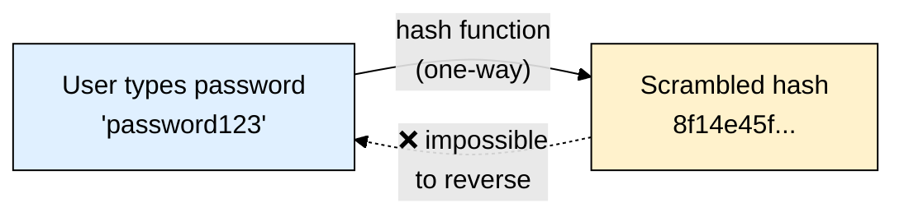
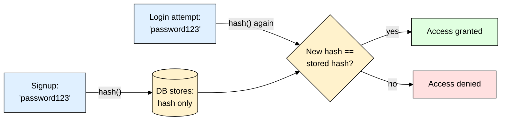

# Password Hashing — The Basics (Read This First)

> **Scope:** Core concepts behind password hashing — what it is, why it exists, salt & pepper. Read this **before** the library-specific deep dives: [[argon2]], [[bcrypt]], [[scrypt]].
> **Level:** Beginner.

---

## 1. ELI5: What is password hashing?

When a user signs up with `"password123"`, you never want to store that exact text in your database. If your DB ever leaks — and DB leaks happen constantly — every user's real password would be exposed instantly, and since most people reuse passwords, that one leak compromises their other accounts too (email, banking, etc.).

**Hashing** solves this by running the password through a **one-way function** that scrambles it into a fixed-length string, e.g.:

```
"password123"  →  "8f14e45fceea167a5a36dedd4bea2543"
```

The key property: it's **mathematically one-way**. There is no "unhash" — you can never turn the scrambled string back into `"password123"`. So instead of storing the password, you store the hash.



### How login works without ever knowing the real password

You never "decrypt" a hash to check a login. Instead, you **hash the login attempt again** and compare the two hashes:



If the two hashes match, the login attempt must have typed the same original password — even though your server never stored, and never needed, the real thing.

---

## 2. Why not just use any hash function (MD5, SHA-256)?

This is the single most important thing to understand: **not all hash functions are suitable for passwords.**

MD5, SHA-1, and SHA-256 are **general-purpose** hash functions — used for things like verifying a downloaded file wasn't corrupted. Their design goal is to be **fast**, so you can hash huge files quickly.

That speed is exactly what makes them *dangerous* for passwords:

| | Fast hash (MD5/SHA-256) | Password hash (argon2/bcrypt/scrypt) |
|---|---|---|
| Design goal | Speed | Deliberate **slowness** |
| Guesses/sec an attacker can try (GPU) | Billions per second | A handful per second (per core) |
| Time to brute-force a stolen hash dump | Minutes to hours | Years to centuries (at reasonable cost settings) |

If an attacker steals your DB of MD5-hashed passwords, they can try **billions of password guesses per second** on cheap GPU hardware, cracking most common/weak passwords within minutes. Password-specific hash functions are deliberately engineered to be slow and (in modern designs) memory-hungry, so the same attack takes drastically longer — often infeasibly long.

> ⚠️ **Rule of thumb:** if a hash function's main selling point is "fast," it's wrong for passwords. If it's "slow, tunable, memory-hard," it's right for passwords.

---

## 3. Salt — why two identical passwords must never look identical

A **salt** is a random string generated separately **for every single password**, mixed in before hashing.

```
hash("password123" + salt_A)  →  completely different output than
hash("password123" + salt_B)
```

**Without salt:**
- Two users who both pick `"password123"` get the exact same hash in your DB.
- Attackers can precompute a giant lookup table of hash → common password (a **rainbow table**) *once*, and instantly crack every matching hash in any leaked database, forever.

**With salt:**
- Every user's hash is unique, even for identical passwords.
- A precomputed rainbow table becomes useless — the attacker must brute-force each hash individually, from scratch.

The salt itself is **not secret** — it's stored right alongside the hash (often embedded in the same string). Its whole job is to guarantee uniqueness, not to hide anything.

> **Good news:** [[argon2]] and [[bcrypt]] generate and embed the salt for you automatically — you never write salt-handling code by hand. [[scrypt]] (Node's built-in, lower-level tool) is the exception — there, you generate and store the salt yourself.

---

## 4. Pepper — the optional extra layer

A **pepper** is different from a salt in one key way: it's a **single secret value**, shared across *all* passwords, stored **outside the database** — typically in an environment variable or secrets manager.

| | Salt | Pepper |
|---|---|---|
| Unique per user? | Yes | No — same value for everyone |
| Where it's stored | In the DB, next to the hash | Outside the DB (`.env` / secrets manager) |
| Secret? | No — not meant to be hidden | Yes — this is the point |
| Purpose | Defeats rainbow tables | Means a stolen **database alone** isn't enough to crack anything — attacker also needs the server's secret |

Pepper is a defense-in-depth bonus on top of salting, not a replacement for it — and it adds operational risk (losing the pepper locks out every user), so treat it as optional hardening rather than a must-have for every project.

---

## 5. Tier List — Which Algorithm to Use

| Tier | Algorithm | Verdict |
|---|---|---|
| **S** | [[argon2]] (argon2id) | Modern winner — memory-hard, resists both GPU and ASIC cracking. Default choice for new projects. |
| **A** | [[bcrypt]] | Battle-tested since 1999, simple API, huge ecosystem. Great fallback if argon2's native install is a problem. |
| **B** | [[scrypt]] | Also memory-hard, built into Node (zero dependencies) — but more manual work (you handle salt & comparison yourself). |
| **F** | MD5 / SHA-1 / SHA-256 (plain) | Never for passwords — these are fast hashes, the opposite of what you want. See section 2. |

---

## 6. Where to Go Next

This file covers the **concepts**. For hands-on code, install instructions, and tuning per library, see:

- **[[argon2]]** — the recommended default for new Node.js/Express projects
- **[[bcrypt]]** — the mature, widely-supported classic
- **[[scrypt]]** — Node's built-in option, no npm install needed

**Mental model to remember:**
> Hashing = a one-way scramble, never reversed, only re-checked. Fast hash functions (MD5/SHA) are wrong for passwords — you want *slow*. Salt = per-user randomness that defeats rainbow tables (usually automatic). Pepper = optional app-wide secret for extra defense. Pick a purpose-built algorithm — argon2, bcrypt, or scrypt — never a general-purpose one.
