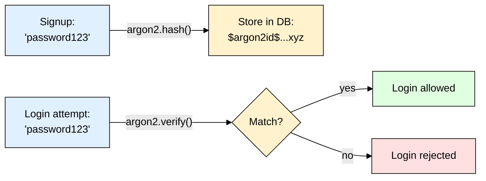

# argon2 — Modern Password Hashing (Node.js)

> **Scope:** The `argon2` npm package for hashing/verifying user passwords in Node.js/Express.
> **Level:** Beginner + practical.
> **New to password hashing?** Read [[password_hashing]] first for the core concepts (why hashing, salt, pepper).

---

## 1. ELI5: What is argon2?

If you store passwords as plain text and your DB leaks, every user's real password is exposed instantly. **argon2** turns `"password123"` into a scrambled, fixed-length string like `$argon2id$v=19$m=65536,t=3,p=4$...` that **cannot be reversed** back to the original. To check a login, you hash what the user typed again and compare the two strings.

**argon2 is the "winner" algorithm** — it won the [Password Hashing Competition](https://www.password-hashing.net/) in 2015 (a public contest where cryptographers tried to break each other's designs), and is the current gold-standard recommendation from OWASP for new projects.

> **Type:** npm package, wraps the native Argon2 C library
> **Core promise:** Deliberately slow, **memory-hard** hashing — resistant to both regular CPU brute-forcing *and* cheap GPU/ASIC cracking rigs.



---

## 2. Why Does argon2 Exist? (The Problem It Solves)

| Fast hash (MD5/SHA-256) | argon2 |
|---|---|
| Built for *speed* — billions of guesses/sec on a GPU | Deliberately slow — a few hundred ms per guess |
| Uses almost no RAM → cheap to run millions in parallel on GPUs | Uses a configurable chunk of **RAM per hash** → GPUs/ASICs can't run millions in parallel, RAM is expensive to duplicate |
| Same input → same output, so rainbow tables work at scale | Random salt baked into every hash automatically → identical passwords produce different hashes |

The "memory-hard" property is argon2's headline feature over older algorithms like bcrypt: cracking rigs get their speed advantage from cheap, massively parallel compute (GPUs), but RAM doesn't parallelize the same way — so argon2 closes that loophole.

---

## 3. Installing & Basic Usage

```bash
npm install argon2
```

```js
const argon2 = require("argon2");

// Signup — hash & store (salt is generated & embedded automatically)
async function hashPassword(plainPassword) {
  return await argon2.hash(plainPassword);
}

// Login — verify
async function checkPassword(plainPassword, storedHash) {
  return await argon2.verify(storedHash, plainPassword);
}
```

### Express example

```js
app.post("/signup", async (req, res) => {
  const hash = await hashPassword(req.body.password);
  await User.create({ email: req.body.email, passwordHash: hash });
  res.sendStatus(201);
});

app.post("/login", async (req, res) => {
  const user = await User.findOne({ email: req.body.email });
  if (!user || !(await checkPassword(req.body.password, user.passwordHash))) {
    return res.status(401).send("Invalid credentials");
  }
  res.send("Logged in");
});
```

That's the entire mental model: `argon2.hash()` on the way in, `argon2.verify()` on the way out. No manual salt handling — it's embedded in the output string.

---

## 4. Tuning the Cost Parameters

argon2's difficulty is controlled by 3 knobs:

| Parameter | What it controls | Default (this lib) |
|---|---|---|
| `memoryCost` | KB of RAM used per hash — the main GPU-resistance lever | `65536` (64 MB) |
| `timeCost` | Number of iterations/passes over that memory | `3` |
| `parallelism` | Number of parallel threads used | `4` |

```js
await argon2.hash(plainPassword, {
  type: argon2.argon2id, // use the "id" variant (default) — balances GPU & side-channel resistance
  memoryCost: 65536,
  timeCost: 3,
  parallelism: 4,
});
```

**Rule of thumb:** the library's defaults are sane for most apps — only raise `memoryCost`/`timeCost` if you have a specific threat model, and only lower them if login latency is a measured problem (each hash should still take roughly 250ms–1s on your server).

### The 3 variants

| Variant | Use case |
|---|---|
| `argon2d` | Max resistance to GPU cracking, but vulnerable to side-channel (timing) attacks — rarely used directly |
| `argon2i` | Resistant to side-channel attacks, slightly weaker against GPU attacks |
| **`argon2id`** | **Hybrid of both — this is the default, and what you should use** |

---

## 5. Common Gotchas & Best Practices

| Gotcha | Fix |
|---|---|
| Native binary fails to install (some serverless/CI/Alpine images) | argon2 compiles a native addon on install — if this breaks your deploy pipeline, fall back to `bcrypt` (pure-JS options like `bcryptjs` exist too). See [[bcrypt]]. |
| Comparing hashes manually with `===` | Never — always use `argon2.verify()`, which does a timing-safe comparison internally. |
| Re-hashing on every login "to be safe" | Don't — hash once at signup/password change, verify on login. Only re-hash if you deliberately raise `memoryCost`/`timeCost` later (rehash-on-login pattern). |
| No rate limiting on `/login` | argon2 being slow doesn't fully stop *online* brute force against your API — pair with rate limiting/account lockout on the endpoint. |
| Storing salt separately "for security" | Don't bother — the salt is embedded in the output string and isn't meant to be secret. |
| Wanting extra defense-in-depth | Add a **pepper** — a single app-wide secret from `.env`, HMAC'd into the password before hashing. Not argon2-specific, but pairs well with it. |

---

## 6. Quick Cheat Sheet

```bash
npm install argon2
```

```js
const argon2 = require("argon2");

// Hash
const hash = await argon2.hash(password);

// Verify
const ok = await argon2.verify(hash, password);

// With custom cost params
const hash2 = await argon2.hash(password, {
  type: argon2.argon2id,
  memoryCost: 65536,
  timeCost: 3,
  parallelism: 4,
});
```

**Mental model to remember:**
> argon2 = a deliberately slow, RAM-hungry hash function purpose-built for passwords. `hash()` in at signup, `verify()` out at login — salt is automatic, no manual bookkeeping. Use the default `argon2id` variant unless you have a specific reason not to. See [[bcrypt]] and [[scrypt]] for alternatives.
