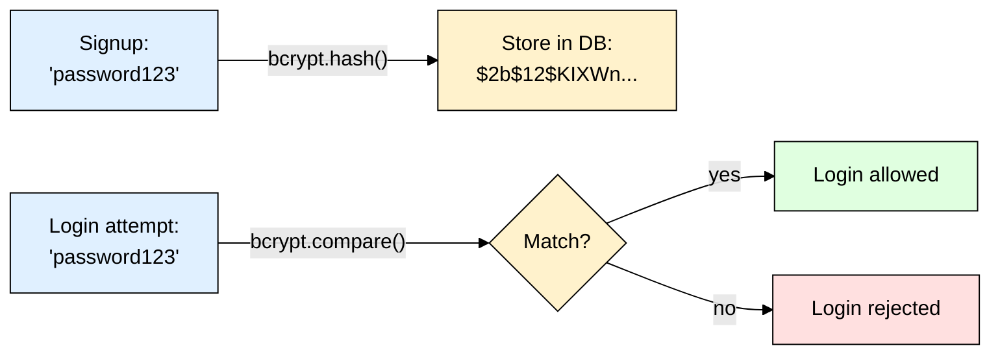

# bcrypt — The Classic Password Hashing Library (Node.js)

> **Scope:** The `bcrypt` / `bcryptjs` npm packages for hashing/verifying user passwords in Node.js/Express.
> **Level:** Beginner + practical.
> **New to password hashing?** Read [[password_hashing]] first for the core concepts (why hashing, salt, pepper).

---

## 1. ELI5: What is bcrypt?

If you store passwords as plain text and your DB leaks, every user's real password is exposed instantly. **bcrypt** turns `"password123"` into a scrambled, fixed-length string like `$2b$12$KIXWn...` that **cannot be reversed** back to the original. To check a login, you hash what the user typed again and compare it against the stored string.

**bcrypt is the veteran** — designed in 1999, based on the Blowfish cipher, running in production at massive scale for 25+ years. It's not the newest algorithm (see [[argon2]]), but it's extremely mature, has near-universal library support, and is still considered secure when configured correctly.

> **Type:** npm package (`bcrypt` = native C++ binding, `bcryptjs` = pure JS, no native compile step)
> **Core promise:** Deliberately slow, tunable hashing via a "cost factor" — resistant to brute force by making each guess expensive.



---

## 2. Why Does bcrypt Exist? (The Problem It Solves)

| Fast hash (MD5/SHA-256) | bcrypt |
|---|---|
| Built for *speed* — billions of guesses/sec on a GPU | Deliberately slow — configurable, ~100ms–1s per guess |
| Same input → same output → rainbow tables work at scale | Random salt baked into every hash automatically |
| Difficulty is fixed forever | Difficulty ("cost factor") can be dialed up as hardware gets faster |

bcrypt's key idea: instead of just being slow once, its cost is a **tunable parameter you control** — so as attackers' hardware improves over the years, you raise the cost factor on new hashes without changing any code logic.

---

## 3. Installing & Basic Usage

```bash
npm install bcrypt
# or, if native compilation is a problem (serverless/CI/Alpine):
npm install bcryptjs   # same API, pure JavaScript, slightly slower
```

```js
const bcrypt = require("bcrypt");

const SALT_ROUNDS = 12; // the "cost factor" — see table below

// Signup — hash & store (salt is generated & embedded automatically)
async function hashPassword(plainPassword) {
  return await bcrypt.hash(plainPassword, SALT_ROUNDS);
}

// Login — verify
async function checkPassword(plainPassword, storedHash) {
  return await bcrypt.compare(plainPassword, storedHash);
}
```

### Express example

```js
app.post("/signup", async (req, res) => {
  const hash = await hashPassword(req.body.password);
  await User.create({ email: req.body.email, passwordHash: hash });
  res.sendStatus(201);
});

app.post("/login", async (req, res) => {
  const user = await User.findOne({ email: req.body.email });
  if (!user || !(await checkPassword(req.body.password, user.passwordHash))) {
    return res.status(401).send("Invalid credentials");
  }
  res.send("Logged in");
});
```

That's the entire mental model: `bcrypt.hash()` on the way in, `bcrypt.compare()` on the way out. No manual salt handling — it's embedded in the output string (you can see it as the `$2b$12$KIXWn...` prefix).

---

## 4. The Cost Factor (`SALT_ROUNDS`)

bcrypt's slowness is controlled by **rounds** — each `+1` **doubles** the work (it's `2^rounds` internal iterations):

| Rounds | Approx. time per hash (typical server, 2025) | Use case |
|---|---|---|
| 10 | ~65 ms | Minimum acceptable today |
| **12** | **~250 ms** | **Recommended default** |
| 14 | ~1 s | High-security apps, if login latency isn't critical |

```js
await bcrypt.hash(plainPassword, 12);
```

**Rule of thumb:** pick a round count where hashing takes ~200–300ms on your production hardware — slow enough to blunt brute force, fast enough that real users don't notice at signup/login.

---

## 5. Common Gotchas & Best Practices

| Gotcha | Fix |
|---|---|
| **72-byte password limit** | bcrypt silently **truncates** anything past 72 bytes — extra characters are ignored entirely. Rarely an issue for typical passwords, but cap input length explicitly if you allow very long passphrases, or switch to [[argon2]] (no such limit). |
| Comparing hashes manually with `===` | Never — always use `bcrypt.compare()`, which does a timing-safe comparison internally. |
| Using `bcrypt.hashSync`/`compareSync` in a request handler | Sync versions **block the Node event loop** — always use the async `hash`/`compare` functions in server code. |
| Re-hashing on every login "to be safe" | Don't — hash once at signup/password change, verify on login. Only re-hash if you deliberately raise `SALT_ROUNDS` later. |
| No rate limiting on `/login` | bcrypt being slow doesn't fully stop *online* brute force against your API — pair with rate limiting/account lockout on the endpoint. |
| Native `bcrypt` fails to install | Switch to `bcryptjs` — identical API, pure JavaScript, no native compile step (slightly slower, negligible for most apps). |
| Storing salt separately "for security" | Don't bother — the salt is embedded in the output string and isn't meant to be secret. |

---

## 6. Quick Cheat Sheet

```bash
npm install bcrypt      # native binding
npm install bcryptjs    # pure JS fallback, same API
```

```js
const bcrypt = require("bcrypt");

// Hash
const hash = await bcrypt.hash(password, 12);

// Verify
const ok = await bcrypt.compare(password, hash);
```

**Mental model to remember:**
> bcrypt = the battle-tested classic. `hash()` in at signup, `compare()` out at login — salt is automatic, no manual bookkeeping. Cost factor `12` is a solid default in 2025+; bump it up over time as hardware improves. See [[argon2]] (more modern, memory-hard) and [[scrypt]] (built into Node, no dependency) for alternatives.
