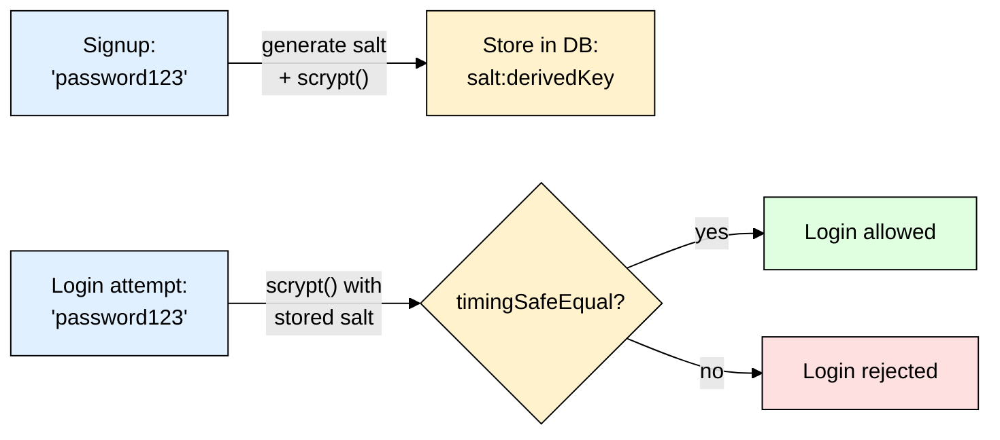

# scrypt — Node's Built-in Memory-Hard Hashing (Node.js)

> **Scope:** `crypto.scrypt` — Node.js's built-in password hashing primitive (no npm install required).
> **Level:** Beginner + practical.
> **New to password hashing?** Read [[password_hashing]] first for the core concepts (why hashing, salt, pepper).

---

## 1. ELI5: What is scrypt?

If you store passwords as plain text and your DB leaks, every user's real password is exposed instantly. **scrypt** turns `"password123"` into a scrambled, fixed-length key that **cannot be reversed** back to the original. To check a login, you derive the key from what the user typed again and compare it against the stored value.

**scrypt's claim to fame:** it was designed in 2009 specifically to be **memory-hard** — deliberately requiring a large, configurable chunk of RAM per computation — years before argon2 popularized the same idea. Unlike [[argon2]] and [[bcrypt]], it ships **inside Node.js itself** (`require("crypto")`), so there's nothing to `npm install`.

> **Type:** Built into Node's native `crypto` module
> **Core promise:** Memory-hard key derivation — RAM cost makes GPU/ASIC cracking rigs far less effective, same idea as argon2, just an older implementation with a more manual API.



> ⚠️ **Key difference from argon2/bcrypt:** those libraries generate, embed, and check the salt **for you**. `crypto.scrypt` is a lower-level primitive — **you** must generate the salt, store it, re-supply it on verify, and do the comparison safely. More boilerplate, more room for mistakes.

---

## 2. Why Would You Reach for scrypt?

| Reason | Why it matters |
|---|---|
| Zero dependencies | Already inside Node — nothing to `npm install`, no native binary to worry about in restrictive deploy environments |
| Memory-hard | Same GPU/ASIC resistance idea as argon2 — real security benefit over plain bcrypt |
| Battle-tested | Used in things like Litecoin and many crypto/KDF (key derivation function) contexts since 2009 |

**When to prefer it:** you specifically want zero extra dependencies, or you're deriving a cryptographic key (not just checking a login) and want a well-known KDF. For typical app password hashing, [[argon2]] or [[bcrypt]] are usually simpler and less error-prone thanks to their higher-level APIs.

---

## 3. Installing & Basic Usage

No install needed — it's part of Node's standard library.

```js
const crypto = require("crypto");
const { promisify } = require("util");
const scrypt = promisify(crypto.scrypt);

// Signup — YOU generate and store the salt
async function hashPassword(plainPassword) {
  const salt = crypto.randomBytes(16).toString("hex");
  const derivedKey = await scrypt(plainPassword, salt, 64); // 64 = key length in bytes
  return `${salt}:${derivedKey.toString("hex")}`; // store salt + key together
}

// Login — YOU re-derive and compare safely
async function checkPassword(plainPassword, stored) {
  const [salt, key] = stored.split(":");
  const derivedKey = await scrypt(plainPassword, salt, 64);
  return crypto.timingSafeEqual(Buffer.from(key, "hex"), derivedKey);
}
```

### Express example

```js
app.post("/signup", async (req, res) => {
  const stored = await hashPassword(req.body.password);
  await User.create({ email: req.body.email, passwordHash: stored });
  res.sendStatus(201);
});

app.post("/login", async (req, res) => {
  const user = await User.findOne({ email: req.body.email });
  if (!user || !(await checkPassword(req.body.password, user.passwordHash))) {
    return res.status(401).send("Invalid credentials");
  }
  res.send("Logged in");
});
```

---

## 4. Why `crypto.timingSafeEqual` Instead of `===`?

A normal `===` string comparison stops at the **first mismatched byte** — meaning it's ever-so-slightly faster to compare a string that matches more leading bytes. In theory, an attacker measuring response times very precisely could exploit that to guess a hash byte-by-byte (a **timing attack**).

`crypto.timingSafeEqual(a, b)` always takes the same amount of time regardless of where the mismatch is, so no timing information leaks. `argon2.verify()` and `bcrypt.compare()` do this internally for you automatically — with raw `scrypt`, it's your responsibility to call it explicitly.

```js
// ❌ Don't do this — leaks timing information
if (key === derivedKey.toString("hex")) { ... }

// ✅ Do this
crypto.timingSafeEqual(Buffer.from(key, "hex"), derivedKey);
```

---

## 5. Tuning Cost Parameters

`crypto.scrypt` accepts an options object as its 4th argument (before the callback/promisify wrapping):

```js
await scrypt(plainPassword, salt, 64, {
  N: 16384, // CPU/memory cost — must be a power of 2 (default: 16384)
  r: 8,      // block size
  p: 1,      // parallelization factor
});
```

| Parameter | What it controls |
|---|---|
| `N` | Main cost knob — higher = more RAM & CPU per hash, exponentially harder to brute-force in parallel |
| `r` | Block size — tunes RAM access pattern |
| `p` | Parallelization — how many independent computations run per hash |

**Rule of thumb:** the Node defaults (`N=16384`) are a reasonable starting point; only tune if you have a specific performance/security target, same as with argon2's `memoryCost`.

---

## 6. Common Gotchas & Best Practices

| Gotcha | Fix |
|---|---|
| Forgetting to store the salt | Unlike argon2/bcrypt, scrypt does **not** embed the salt in its output — you must concatenate/store it yourself (e.g. `salt:key` format shown above), or verification is impossible. |
| Comparing derived keys with `===` | Always use `crypto.timingSafeEqual()` — see section 4. |
| Using the callback-style API awkwardly | Wrap with `util.promisify(crypto.scrypt)` (shown above) for clean `async`/`await` code instead of nested callbacks. |
| Reusing the same salt across users | Generate a fresh `crypto.randomBytes(16)` salt **per password**, never a fixed/shared one. |
| Choosing scrypt just because it's "built in" | If you're building a typical app, [[argon2]] or [[bcrypt]] give you the same (or better) security with a much simpler, harder-to-misuse API — scrypt's manual salt/compare steps are extra surface area for bugs. |

---

## 7. Quick Cheat Sheet

```js
const crypto = require("crypto");
const { promisify } = require("util");
const scrypt = promisify(crypto.scrypt);

// Hash
const salt = crypto.randomBytes(16).toString("hex");
const key = await scrypt(password, salt, 64);
const stored = `${salt}:${key.toString("hex")}`;

// Verify
const [salt2, key2] = stored.split(":");
const derived = await scrypt(password, salt2, 64);
const ok = crypto.timingSafeEqual(Buffer.from(key2, "hex"), derived);
```

**Mental model to remember:**
> scrypt = the memory-hard KDF baked into Node itself — same core idea as argon2, but a low-level primitive: you manage the salt and the safe comparison yourself. Reach for it when you want zero dependencies; reach for [[argon2]] or [[bcrypt]] when you want a simpler, harder-to-misuse API.
