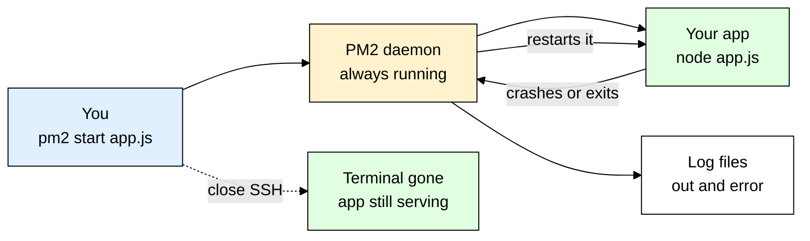
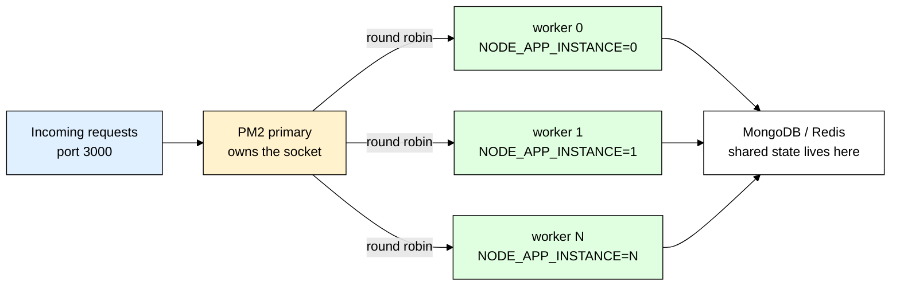
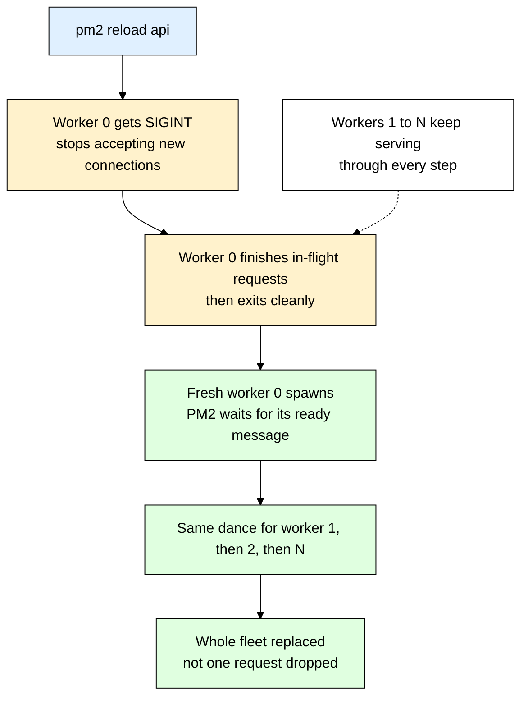
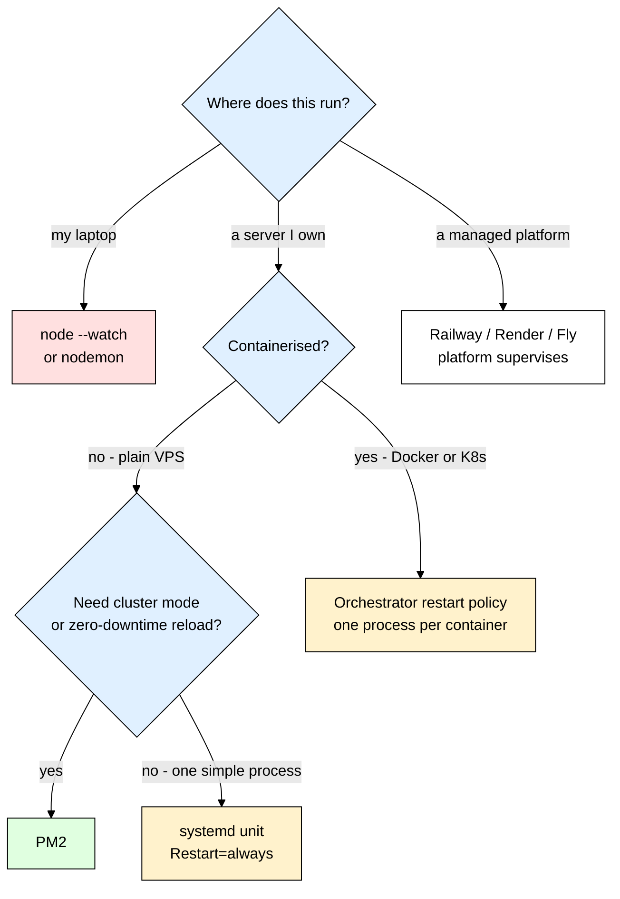

# pm2 — Keeping Your Node App Alive in Production

> **Scope:** The `pm2` process manager for Node.js — daemonising, auto-restart, cluster mode, zero-downtime reloads, log management, and when *not* to use it.
> **Level:** Beginner + practical. Assumes you can already run `node index.js` and have an [[express]] app.
> **New to process managers?** Read [[nodemon]] first — it is the development-time cousin of PM2 and shares the same "something watches your process" idea.

---

## 1. ELI5: What is PM2?

You built an API. It works on your laptop. You rent a small VPS, `git clone`, `npm install`, run `node index.js`, see `Server listening on 3000`, hit the URL from your phone — it works. You feel great and close your laptop. Twenty minutes later the site is down.

Then it gets worse. A malformed JSON body triggers an unhandled rejection at 3am and the app is dead until you wake up. Your VPS provider does a maintenance reboot — dead again. Your server has 4 CPU cores and your app uses exactly one. And when you finally want to know *why* it crashed, the stack trace went to a terminal that no longer exists.

**PM2 is the night-shift supervisor on your factory floor.** You go home at six. At 2am the machine on line 3 jams and shuts itself off. Without a supervisor it sits there dark until morning and nobody knows why. With one: he hears it stop, clears the jam, restarts it in seconds, and writes what happened in the logbook. He has the keys, so he can also run lines 4, 5 and 6 at the same time instead of just line 3 — and when the building loses power overnight, he is the one who walks in at dawn and switches everything back on.

> **Full name:** PM2 — "Process Manager 2"
> **Type:** npm package installed globally — a CLI plus a long-lived background daemon (PM2 calls it the *God daemon*)
> **Core promise:** Your Node process stays up — restarted on crash, restarted on reboot, forked across every CPU core, with all output captured to log files.



---

## 2. Why Does PM2 Exist? (The Problem It Solves)

Here is the "deployment" almost every beginner writes first:

```bash
ssh root@203.0.113.10
cd /var/www/api && git pull && npm ci

node index.js            # "deploy" — now keep this SSH window open forever, praying

node index.js &          # backgrounded: survives nothing, logs go nowhere useful
nohup node index.js &    # survives logout, but still dies permanently on any crash
```

None of these is a deployment. They are a process that happens to be running.

| The old way (`node index.js`) | With PM2 |
|---|---|
| Uncaught exception kills it — **stays dead** | Daemon notices the exit and restarts it in milliseconds |
| Dies when your SSH session closes | Daemonised — completely detached from your terminal |
| Server reboots → nothing comes back | `pm2 startup` + `pm2 save` bring everything back automatically |
| Uses **one CPU core** on a 4-core box | `-i max` forks one worker per core, all sharing port 3000 |
| Logs scroll past in a terminal and vanish | Captured to `~/.pm2/logs/`, rotated, timestamped, greppable |
| Deploying means "kill it and hope nobody was mid-request" | `pm2 reload` swaps workers one at a time — zero dropped requests |
| No idea how much RAM it is using | `pm2 monit` / `pm2 list` show CPU, memory, restart count, uptime |

---

## 3. Installing & Basic Usage

PM2 is one of the very few packages you install **globally** — it is a system tool, not a library your code imports.

```bash
npm install -g pm2
```

The smallest possible thing to run. Save this as `app.js`:

```js
// app.js — ESM (works when package.json has "type": "module")
import http from "node:http";

// process.pid proves which worker answered — you will want this in cluster mode
const server = http.createServer((req, res) => res.end(`hello from pid ${process.pid}\n`));

server.listen(3000, () => console.log(`listening on 3000, pid ${process.pid}`));
```

```bash
pm2 start app.js --name api
```

That is it. The process is now **daemonised** — PM2 forked it as a child of its own background daemon, not of your shell. Close the SSH session, log out, unplug your laptop: `api` keeps serving, and `pm2 list` still shows it tomorrow.

### CommonJS version

```js
// app.js — same thing without "type": "module"
const http = require("node:http");

const server = http.createServer((req, res) => res.end(`hello from pid ${process.pid}\n`));
server.listen(3000, () => console.log(`listening on 3000, pid ${process.pid}`));
```

### Express example

```js
// server.js
import "dotenv/config";           // PM2 does not read .env for you — see section 7
import express from "express";
import mongoose from "mongoose";

const app = express();
app.use(express.json());

// Cheap liveness probe — also tells you which worker replied
app.get("/health", (req, res) => res.json({ ok: true, pid: process.pid }));

// Connect BEFORE listening so the first request never hits a cold connection
await mongoose.connect(process.env.MONGO_URI);

app.listen(process.env.PORT || 3000, () => console.log(`api up, pid ${process.pid}`));
```

```bash
pm2 start server.js --name api
pm2 start npm --name api -- run start   # if you boot through an npm script instead
```

That's the entire mental model — you hand PM2 a command, PM2 runs it as a background child it owns, and PM2 promises to keep that child alive. Everything else in this file is refinement on top of that one idea.

---

## 4. Why `node index.js` Is Not a Deployment

Be precise about *which* five things break — each has a different fix, and beginners usually know only the first.

| Failure | What actually happens | What PM2 does |
|---|---|---|
| **Uncaught exception / unhandled rejection** | Node prints the stack trace and the process exits with a non-zero code (since Node 15 an unhandled rejection is fatal too). Nothing restarts it, so the site is down until a human notices. | `autorestart: true` (the default) — the daemon sees the non-zero exit and respawns immediately. |
| **You close the SSH session** | Your shell sends `SIGHUP` to its children. `node` dies with it. `nohup` avoids this but fixes nothing else. | PM2's daemon is the parent, not your shell — there is no `SIGHUP` to receive. |
| **Server reboots** | Kernel restarts, your process does not exist. Nobody starts it. | `pm2 startup` installs a systemd unit; `pm2 save` snapshots the current process list; on boot PM2 resurrects it. |
| **One CPU core** | Node runs your JavaScript on a **single thread**. A 4-core box sits 75% idle while one core pegs at 100%. | Cluster mode (`-i max`) forks one process per core, all sharing the same port. |
| **Logs vanish** | `console.log` goes to stdout. Backgrounded, stdout goes to `/dev/null` or a giant unbounded `nohup.out`. | Captures stdout and stderr to separate files, timestamps them, and rotates them via `pm2-logrotate`. |

> ⚠️ PM2 restarting a crashed process is a **safety net, not a fix**. An app that restarts 400 times an hour is still broken — it is just broken quietly. Always pair PM2 with real logging ([[winston_morgan]]) so you can find out *why* it died, and watch the `↺` restart column in `pm2 list`.

---

## 5. The Commands You Will Actually Use Every Day

```bash
pm2 start server.js --name api    # start and label it
pm2 list                          # table: name, status, restarts, cpu, memory, uptime
pm2 logs                          # tail every app's stdout + stderr, live
pm2 logs api --lines 200          # last 200 lines of just this app
pm2 logs api --err                # only the error stream
pm2 monit                         # full-screen dashboard, per-process CPU/RAM
pm2 describe api                  # script path, env, log paths, exec mode
pm2 restart api                   # hard: kill, then start (there IS a gap — see section 8)
pm2 reload api                    # rolling: one worker at a time (zero downtime, cluster only)
pm2 stop api                      # stop but keep it in the process list
pm2 delete api                    # stop AND forget it entirely
pm2 flush                         # truncate all log files
```

Two distinctions that trip people up. **`stop` vs `delete`:** `stop` leaves the app in PM2's list as `stopped`, so `pm2 save` still remembers it and `pm2 restart api` brings it back by name — `delete` removes it entirely and you must `pm2 start` with the full command again. **`restart` vs `reload`:** covered properly in section 8, but the one-liner is that `restart` drops requests and `reload` does not.

PM2 also speaks JSON, which is what you want in scripts and health checks: `pm2 jlist | jq '.[].pm2_env.restart_time'`.

---

## 6. Cluster Mode — Using All Your CPU Cores

Node executes your JavaScript on **one thread** — that is the runtime's design, not something you can configure away. On a 4-core server, a single `node server.js` can therefore use at most ~25% of the machine no matter how much traffic you throw at it. Cluster mode fixes that by running **N copies of your app**:

```bash
pm2 start server.js --name api -i max   # one worker per CPU core
pm2 start server.js --name api -i 4     # exactly 4
pm2 start server.js --name api -i -1    # cores minus one, leave headroom for nginx/OS
```

The magic bit: all four workers appear to listen on port 3000 with no `EADDRINUSE`. They do not actually each bind it. PM2 uses Node's built-in `cluster` module — the **primary process** binds the socket once, then hands each incoming connection to a worker in round-robin order (the default scheduling policy on Linux and macOS).



### The three things beginners get wrong

**1. In-memory state is no longer shared.** Each worker is a *separate OS process* with its own heap. A `Map` in worker 0 does not exist in worker 1.

```js
// ❌ Breaks the moment you go to -i 4
const sessions = new Map();          // request lands on worker 2, session was on worker 0 → logged out
const attempts = {};                 // in-memory rate limit → each worker counts separately
                                     //  → your "5 requests per minute" is now 20 per minute

// ✅ Move shared state out of process memory
import Redis from "ioredis";
const redis = new Redis(process.env.REDIS_URL);
```

Sessions, caches, rate-limit counters, "who is online" sets — all of it moves to Redis. See [[ioredis]] for the client and [[express_rate_limit]] for wiring a Redis store into the limiter (its default memory store is per-process and silently multiplies your limit by the worker count).

**2. WebSockets need sticky sessions plus a shared adapter.** Socket.IO's handshake is several HTTP requests; round-robin can send request 2 to a worker that never saw request 1, and the connection fails with a 400. Even once connected, `io.emit()` from worker 1 only reaches clients attached to worker 1. You need **both** sticky routing (nginx `ip_hash`) **and** a Redis adapter so broadcasts cross process boundaries. See [[socket_io]].

**3. Anything that must run exactly once now runs N times.** A `setInterval` that emails a daily report, a cron job that cleans expired tokens — under `-i 4` that fires four times. Gate it on the instance index PM2 injects:

```js
// PM2 sets NODE_APP_INSTANCE to "0", "1", "2"... per worker
if ((process.env.NODE_APP_INSTANCE ?? "0") === "0") scheduleNightlyCleanup();
```

That works, but it is fragile — worker 0 restarting means a missed run, and it does not survive multiple servers. The durable answer is a job queue with repeatable jobs and a lock: see [[bullmq]].

**Rule of thumb:** cluster mode multiplies **CPU**, not magic. If `pm2 monit` shows your single worker at 8% CPU while requests still feel slow, you are **I/O bound** — waiting on Mongo, on an upstream API, on disk. Node already handles thousands of concurrent waits on one thread, so forking four idle processes just gives you four idle processes and 4x the memory bill. Fix the slow query instead. Cluster mode also assumes a genuinely **stateless** app: no local file uploads later requests need to read, no in-process cache you treat as authoritative.

---

## 7. ecosystem.config.cjs — Your Deployment, Committed to Git

Typing `pm2 start server.js --name api -i max --max-memory-restart 400M ...` on a server at midnight is how mistakes happen. PM2 reads a config file instead — commit it and the deployment becomes reproducible.

```js
// ecosystem.config.cjs
// NOTE: .cjs, not .js — PM2 loads this with require(). If your package.json has
// "type": "module", a file named ecosystem.config.js will blow up with
// "module is not defined". The .cjs extension forces CommonJS regardless.
module.exports = {
  apps: [{
    name: "api",
    script: "./server.js",       // in a TS project: "./dist/index.js"
    cwd: "/var/www/api",         // absolute — never rely on where you ran pm2 from
    instances: "max",            // one worker per CPU core
    exec_mode: "cluster",        // REQUIRED for zero-downtime reload; default is "fork"
    autorestart: true,           // respawn on crash (default, but be explicit in prod)
    watch: false,                // NEVER true in production — see gotchas
    max_memory_restart: "400M",  // leak insurance: restart a worker that bloats past this
    min_uptime: "10s",           // alive <10s counts as a failed start...
    max_restarts: 10,            // ...after 10 of those PM2 gives up and marks it "errored"
    restart_delay: 2000,         // wait 2s between restarts instead of hammering
    kill_timeout: 10000,         // give graceful shutdown 10s before SIGKILL (default 1600ms)
    wait_ready: true,            // don't route traffic until the app sends "ready"
    listen_timeout: 8000,        // if "ready" never arrives in 8s, assume it is up anyway
    error_file: "/var/log/api/error.log",
    out_file: "/var/log/api/out.log",
    time: true,                  // prefix every log line with a timestamp
    env: { NODE_ENV: "development", PORT: 3000 },          // baseline, always applied
    env_production: { NODE_ENV: "production", PORT: 3000 } // merged in with --env production
  }]
};
```

```bash
pm2 start ecosystem.config.cjs --env production
pm2 reload ecosystem.config.cjs --env production   # every subsequent deploy
```

### How PM2 env interacts with dotenv

PM2 does **not** read your `.env` file. It knows only about `env` / `env_production` and whatever was in the shell when the daemon started. Three sane options:

| Approach | How | When |
|---|---|---|
| **[[dotenv]] inside the app** | `import "dotenv/config"` at the very top of `server.js` | **Default choice.** Same code path in dev and prod, secrets stay out of a git-committed config file. |
| Node's native loader | `node_args: "--env-file=.env.production"` in the ecosystem file (Node 20.6+) | No dependency at all, but less flexible than dotenv. |
| `env_production` block | Values written directly into `ecosystem.config.cjs` | Only for **non-secret** values like `NODE_ENV` and `PORT`. Never commit a DB password here. |

> ⚠️ PM2 caches a process's environment from when it first started. Change `.env` or the ecosystem `env` block, run `pm2 restart api`, and you will still be running the **old values**. You must use `pm2 restart api --update-env` (or `pm2 reload ecosystem.config.cjs --env production`). This one wastes an hour of everybody's life exactly once.

### pm2 deploy, briefly

PM2 ships a small git-based deployer. Add a `deploy` key alongside `apps` in the same file:

```js
  deploy: {
    production: {
      user: "deploy", host: "203.0.113.10",
      ref: "origin/main", repo: "git@github.com:you/api.git", path: "/var/www/api",
      "post-deploy": "npm ci --omit=dev && pm2 reload ecosystem.config.cjs --env production"
    }
  }
```

```bash
pm2 deploy ecosystem.config.cjs production setup   # once: clone + directory structure
pm2 deploy ecosystem.config.cjs production         # every deploy: fetch, checkout, post-deploy
```

Fine for a single VPS. It is not a CI/CD system — no build artifacts, no real rollback story. Most teams outgrow it into GitHub Actions plus an `ssh ... pm2 reload` step.

---

## 8. Zero-Downtime Reloads & Graceful Shutdown

`pm2 restart api` does exactly what it says: **kill every worker, then start new ones**. For a second or two nothing is listening on port 3000 and every request in that window gets a connection error. `pm2 reload api` instead restarts workers **one at a time** — worker 0 is drained and replaced while workers 1–3 keep serving, then worker 1, and so on. There is never a moment with zero live workers.



Two conditions, and if you miss either one `reload` is a lie:

**Condition 1: you must be in cluster mode** (`exec_mode: "cluster"`). In fork mode there is only one process, so "one at a time" degrades to a plain restart with a gap. `pm2 reload` still runs and reports success — it just is not zero downtime.

**Condition 2: your app must shut down gracefully.** PM2 sends `SIGINT` and waits `kill_timeout` milliseconds (default a stingy **1600ms**) before `SIGKILL`. If your app ignores the signal, PM2 hard-kills it mid-request and you dropped traffic anyway. This handler is what makes reload real:

```js
// server.js
import express from "express";
import mongoose from "mongoose";

const app = express();
app.get("/health", (req, res) => res.json({ ok: true, pid: process.pid }));

await mongoose.connect(process.env.MONGO_URI); // connect BEFORE declaring readiness

const server = app.listen(process.env.PORT || 3000, () => {
  // Pairs with wait_ready: true. Until this fires PM2 keeps the OLD worker alive,
  // so there is genuinely never a gap. process.send exists only under PM2.
  process.send?.("ready");
});

let shuttingDown = false;

async function shutdown(signal) {
  if (shuttingDown) return;              // a second SIGINT must not re-enter this
  shuttingDown = true;
  console.log(`[shutdown] ${signal} received, draining`);

  // 1. Stop accepting NEW connections. This callback fires only once every
  //    request that was already in flight has finished.
  server.close(async () => {
    await mongoose.connection.close();   // 3. now safe: DB, BullMQ workers, timers
    process.exit(0);
  });

  // 2. Idle keep-alive sockets would hold server.close() open forever.
  //    Node 18.2+ closes the idle ones without touching busy ones.
  server.closeIdleConnections();

  // 4. Backstop — exit before PM2 SIGKILLs us. Must be shorter than kill_timeout.
  setTimeout(() => process.exit(1), 8000).unref();
}

// PM2 sends SIGINT. Docker and Kubernetes send SIGTERM. Handle both.
process.on("SIGINT", () => shutdown("SIGINT"));
process.on("SIGTERM", () => shutdown("SIGTERM"));
```

Without `wait_ready` + `process.send("ready")`, PM2 treats a worker as usable the moment it binds the port — which can be before Mongo is connected, so the first requests after a reload fail. With it, the old worker stays up until the new one says it is genuinely serving.

---

## 9. Surviving a Reboot, and Keeping Logs Under Control

### Boot persistence — two commands, and both are required

```bash
# Prints a sudo command tailored to your init system, e.g.
#   sudo env PATH=$PATH:/usr/bin /usr/lib/node_modules/pm2/bin/pm2 \
#        startup systemd -u deploy --hp /home/deploy
# Run exactly what it prints — it installs a systemd unit that starts the PM2
# daemon at boot, as your user.
pm2 startup

# Snapshots the CURRENT process list to ~/.pm2/dump.pm2. On boot the systemd
# unit starts PM2, and PM2 resurrects everything in that dump.
pm2 save
```

`pm2 startup` alone gets you a PM2 daemon at boot with **zero apps in it**. `pm2 save` alone survives nothing, because nothing starts PM2. You need both — and you must re-run `pm2 save` **every time you add, rename, or delete an app**, or the dump goes stale. (`pm2 resurrect` reloads the dump manually; `pm2 unstartup` removes the boot hook.)

Test it for real: `sudo reboot`, wait, SSH back in, `pm2 list`. If the list is empty you have not deployed anything — you have set a trap for yourself.

### Logs

PM2 writes stdout and stderr to separate files, by default `~/.pm2/logs/<name>-out.log` and `<name>-error.log`. Left alone they grow without limit — and a full disk takes down Mongo, nginx and your app at once, with an `ENOSPC` error that does not obviously point at logs.

```bash
pm2 install pm2-logrotate

pm2 set pm2-logrotate:max_size 10M      # rotate once a file hits 10 MB
pm2 set pm2-logrotate:retain 14         # keep 14 rotated files, delete older
pm2 set pm2-logrotate:compress true     # gzip the rotated ones
```

> ⚠️ Do this on day one, not the day the disk fills. `pm2 install` here means "install a PM2 *module*" — a helper process PM2 runs alongside your apps. It is not `npm install`.

`pm2 logs` is a **tail**, not observability: raw text on one box, no levels, no request IDs, nothing to search across servers. Use it to confirm "did it start", and use [[winston_morgan]] for structured logs you can actually query. The one PM2 signal worth watching is the **restart count** in `pm2 list` — a steadily climbing `↺` is a crash loop that `autorestart` is hiding from you.

---

## 10. TypeScript Version

Do **not** run `ts-node` in production. Compile to JavaScript and point PM2 at the build output — it boots faster, uses less memory, and a type error becomes a failed build instead of a 3am crash loop.

```ts
// src/index.ts
import express, { type Request, type Response, type NextFunction } from "express";
import mongoose from "mongoose";
import type { Server } from "node:http";

const app = express();

app.get("/health", (_req: Request, res: Response) => {
  // NODE_APP_INSTANCE is injected per worker in cluster mode; "0" when standalone
  res.json({ ok: true, pid: process.pid, instance: process.env.NODE_APP_INSTANCE ?? "0" });
});

// Express 5 forwards rejected async handlers here automatically — no try/catch wrapper needed
app.use((err: Error, _req: Request, res: Response, _next: NextFunction) => {
  console.error(err);
  res.status(500).json({ error: "Internal Server Error" });
});

await mongoose.connect(process.env.MONGO_URI as string);

const server: Server = app.listen(Number(process.env.PORT ?? 3000), () => {
  process.send?.("ready"); // optional call — process.send is undefined outside PM2/child forks
});

let shuttingDown = false;
async function shutdown(signal: NodeJS.Signals): Promise<void> {
  if (shuttingDown) return;
  shuttingDown = true;
  console.log(`[shutdown] ${signal}`);

  server.close(async () => {
    await mongoose.connection.close();
    process.exit(0);
  });
  server.closeIdleConnections();
  setTimeout(() => process.exit(1), 8000).unref();
}

process.on("SIGINT", () => shutdown("SIGINT"));
process.on("SIGTERM", () => shutdown("SIGTERM"));
```

Point the ecosystem file at the build output — `script: "./dist/index.js"`, never `src/index.ts` — and make the build part of the deploy:

```bash
npm run build && pm2 reload ecosystem.config.cjs --env production
```

---

## 11. Production Setup

What a real single-VPS Node deployment actually has configured:

```bash
# 1. Run as a non-root user — PM2's daemon, logs and dump live under that user's $HOME
sudo adduser --disabled-password --gecos "" deploy && sudo su - deploy
npm install -g pm2

# 2. Start from the committed config, not from flags
cd /var/www/api && pm2 start ecosystem.config.cjs --env production

# 3. Persist across reboots (both commands are required)
pm2 startup            # then run the sudo line it prints
pm2 save

# 4. Bound the logs before they bound you, then verify
pm2 install pm2-logrotate && pm2 set pm2-logrotate:max_size 10M
pm2 list && curl -s localhost:3000/health
```

Plus:

- **nginx (or Caddy) in front.** PM2 is not a reverse proxy and does not do TLS. nginx terminates HTTPS, serves static files, sets timeouts, and forwards to `localhost:3000`. Leave one core free (`instances: -1`) so nginx and the OS are not fighting your workers.
- **`npm ci --omit=dev`** on the server, never `npm install` — reproducible from the lockfile, no dev dependencies shipped.
- **After upgrading Node, run `pm2 update`.** PM2 runs whatever `node` was on the daemon's PATH when the daemon started; `pm2 update` restarts the in-memory daemon so it picks up the new binary. Skipping it is why "I upgraded Node but it still reports v18".
- **Deploy = `pm2 reload`, not `pm2 restart`.** Get into the habit now.

### PM2 inside Docker or Kubernetes — usually, don't

This is the single most common architectural mistake with PM2. Docker and Kubernetes already **are** process supervisors:

| PM2's job | Who does it in Docker/K8s |
|---|---|
| Restart on crash | `restart: unless-stopped` / the kubelet restarting the container |
| Run N copies | `docker compose --scale` / `replicas: 4` in a Deployment |
| Survive reboot | The Docker daemon's restart policy / the scheduler rescheduling the pod |
| Collect logs | `docker logs` / the cluster's log agent reading container stdout |

Running PM2 inside a container gives you **two** supervisors that disagree. Plain `pm2 start` will not even work as a `CMD` — it daemonises and returns, so PID 1 exits and the container dies instantly. Use `pm2-runtime` and PM2 itself becomes PID 1, which means the container stays "healthy" while your app crash-loops inside it: Kubernetes sees green and never reschedules the pod, and `docker logs` shows PM2's chatter rather than your app's output.

The convention is **one process per container**: `CMD ["node", "dist/index.js"]`, and let the orchestrator scale by adding replicas — which also spreads across machines, something PM2 cluster mode cannot do. If you genuinely must use PM2 in an image, use **`pm2-runtime`**: it runs in the foreground as PID 1, forwards signals properly, and streams logs to stdout instead of files.

```dockerfile
CMD ["pm2-runtime", "start", "ecosystem.config.cjs", "--env", "production"]
```

---

## 12. Common Gotchas & Best Practices

| Gotcha | Fix |
|---|---|
| **`ecosystem.config.js` throws "module is not defined"** | Your `package.json` has `"type": "module"`, so `.js` is treated as ESM — but PM2 loads the config with `require()`. Rename it to **`ecosystem.config.cjs`**. Nothing else changes. |
| **Changed `.env`, ran `pm2 restart`, still getting old values** | PM2 caches each process's environment from its first start. Use `pm2 restart api --update-env`, or `pm2 reload ecosystem.config.cjs --env production`. Verify with `pm2 describe api`. |
| **`watch: true` left on in production → endless restart loop** | The app writes a log file or an upload into the watched directory, PM2 sees a file change, restarts, which writes another file... Set `watch: false` in prod. Watching is [[nodemon]]'s job, in development only. |
| **`pm2 reload` gave downtime anyway** | Either `exec_mode` is `"fork"` (reload needs `"cluster"`), or your app ignores `SIGINT` so PM2 `SIGKILL`s it mid-request after `kill_timeout`. Add the graceful shutdown handler from section 8 and raise `kill_timeout` to ~10000. |
| **After `-i max`: users randomly logged out, and the nightly cron job fires four times** | Every worker is a separate process with its own heap running your whole file. Move sessions, caches and rate-limit counters into Redis ([[ioredis]], [[express_rate_limit]]), and gate scheduled work on `process.env.NODE_APP_INSTANCE === "0"` or hand it to a queue with repeatable jobs and a lock ([[bullmq]]). |
| **Server rebooted and nothing came back** | `pm2 startup` and `pm2 save` are both required, and `pm2 save` must be re-run after every change to the process list. Test with an actual `sudo reboot` before you call it done. |
| **Disk full at 4am, everything down** | Unrotated PM2 logs. `pm2 install pm2-logrotate` plus `max_size` and `retain` — do it on day one. |
| **App restarts 500 times an hour and nobody noticed** | `autorestart` hides crash loops. Set `min_uptime: "10s"` and `max_restarts: 10` so a genuinely broken app goes `errored` instead of thrashing forever, and alert on the restart count from `pm2 jlist`. |

---

## 13. Alternatives — When PM2 Isn't the Best Fit

| Tool | What it is | Best for |
|---|---|---|
| **PM2** | Node-specific process manager: daemon, auto-restart, cluster mode, log capture, reload. | **A single VPS or a handful of them, running Node, deployed with git or rsync.** The default answer for a self-hosted side project or small production app. |
| **systemd** | The Linux init system already on your server. A `.service` unit gives you `Restart=always`, boot persistence, and journald logs — with zero extra dependencies. | Servers running a mix of languages, or teams that already manage everything with systemd. You lose cluster mode (you would run N units on N ports behind nginx) and `pm2 monit`. |
| **Docker + `restart: unless-stopped`** | The container runtime supervises one process per container; scale with `--scale`. | Reproducible environments, multiple services (API, worker, Redis) on one box. **Do not also run PM2 inside** — use `CMD ["node", "dist/index.js"]`. |
| **Kubernetes** | Full orchestrator: restarts, replicas across machines, rolling deploys, health probes, autoscaling. | Real scale and a team to operate it. It does everything PM2 does, plus across many machines. Massive overkill for one app on one server. |
| **A PaaS (Railway / Render / Fly.io)** | You push code; they build, run, restart, scale, and collect logs. | You do not want to own a server. Cheapest option in *engineer-hours*, more expensive in dollars at scale. There is no PM2 here — the platform is the supervisor. |
| **`node --watch`** (built into Node 18.11+) | Restarts your process when a source file changes. Nothing else. | **Development only.** Zero dependencies, replaces most of what people used [[nodemon]] for. It is not a supervisor and has no place in production. |



---

## 14. Interview Questions

**Q: Why is `node index.js` not good enough for production?**
A: It dies permanently on any uncaught exception, dies when the SSH session that started it closes, does not come back after a server reboot, and uses a single CPU core because Node runs JavaScript on one thread. Its logs also go to a terminal that will not exist tomorrow. A process manager like PM2 (or systemd, or a container runtime) supplies the missing supervision: respawn, boot persistence, multi-core forking, and captured output.

**Q: What does PM2 cluster mode actually do, and what breaks when you turn it on?**
A: It uses Node's `cluster` module to fork N worker processes; the primary binds the port once and round-robins incoming connections to the workers, so all of them appear to share port 3000. What breaks is anything relying on shared process memory — in-memory sessions, in-memory caches, in-memory rate limiters, Socket.IO broadcasts, and any job scheduled with `setInterval` now runs once per worker. The fix is to move shared state into Redis and gate single-run jobs on `NODE_APP_INSTANCE`.

**Q: What is the difference between `pm2 restart` and `pm2 reload`?**
A: `restart` kills all workers and then starts new ones, so there is a window with nothing listening and requests fail. `reload` replaces workers one at a time, keeping the rest serving, so there is never zero capacity — that is the zero-downtime deploy. `reload` only gives you that in cluster mode; in fork mode it degrades to a plain restart.

**Q: How do you make `pm2 reload` genuinely zero-downtime?**
A: Two halves. On shutdown, handle `SIGINT`/`SIGTERM`: call `server.close()` so no new connections are accepted while in-flight requests finish, close idle keep-alive sockets, then close Mongo and any queue workers, and raise `kill_timeout` above your slowest request so PM2 does not `SIGKILL` you mid-flight. On startup, set `wait_ready: true` and call `process.send("ready")` only after the DB is connected, so PM2 keeps the old worker alive until the new one can genuinely serve.

**Q: Would you run PM2 inside a Docker container?**
A: Normally no. The container runtime is already the supervisor — it restarts on crash, scales by replicas, and collects stdout — so PM2 inside gives you two supervisors that disagree. Worse, PM2 becomes PID 1, so the container looks healthy while your app crash-loops inside it and Kubernetes never reschedules the pod. The convention is one process per container with `CMD ["node", "dist/index.js"]`; if you truly must use PM2 in an image, use `pm2-runtime`, which runs in the foreground and forwards signals correctly.

**Q: How does a PM2-managed app survive a server reboot?**
A: `pm2 startup` prints a sudo command that installs a systemd unit which launches the PM2 daemon at boot as your user. `pm2 save` writes the current process list to `~/.pm2/dump.pm2`, and on boot PM2 resurrects everything in that dump. Both are required — and `pm2 save` must be re-run whenever you add or remove an app, otherwise the dump is stale.

**Q: You switched to `-i max` on a 4-core box and throughput barely moved. Why?**
A: Almost certainly because the app is I/O bound, not CPU bound — the workers spend their time waiting on database queries or upstream APIs, and Node already handles thousands of concurrent waits on a single thread. Forking four processes multiplies memory usage without adding useful capacity. Check CPU per worker in `pm2 monit`: if it is low, the bottleneck is a missing index or a slow dependency, and clustering will not fix it.

**Q: PM2 shows 800 restarts on your app overnight. What is your reaction?**
A: PM2 restarting a crashed process is a safety net, not a fix — 800 restarts means the app is broken and `autorestart` has been hiding it. I would read the error log for the recurring stack trace, set `min_uptime` and `max_restarts` so a genuinely broken deploy stops and goes `errored` instead of thrashing, and add structured logging plus an alert on the restart count so the next crash loop pages someone instead of sitting silently.

---

## 15. Quick Cheat Sheet

```bash
# Install (global — it is a system tool, not a dependency)
npm install -g pm2

# Start
pm2 start server.js --name api            # single process
pm2 start server.js --name api -i max     # one worker per CPU core
pm2 start npm --name api -- run start     # start via an npm script
pm2 start ecosystem.config.cjs --env production

# Inspect and control
pm2 list                      # status, restarts, cpu, memory
pm2 logs api --lines 200      # tail logs
pm2 monit                     # live dashboard
pm2 reload api                # zero-downtime rolling restart (cluster mode only)
pm2 restart api --update-env  # hard restart, pick up new env vars
pm2 delete api                # stop and forget
```

```bash
# Make it permanent
pm2 startup                 # then run the sudo command it prints
pm2 save                    # snapshot process list (re-run after any change)
pm2 install pm2-logrotate && pm2 set pm2-logrotate:max_size 10M
pm2 set pm2-logrotate:retain 14
```

```js
// ecosystem.config.cjs — the whole deployment, committed to git
module.exports = {
  apps: [{
    name: "api", script: "./dist/index.js",
    instances: "max", exec_mode: "cluster", // cluster is required for reload
    watch: false, max_memory_restart: "400M",
    kill_timeout: 10000, wait_ready: true,  // room for graceful shutdown
    min_uptime: "10s", max_restarts: 10, time: true,
    env_production: { NODE_ENV: "production", PORT: 3000 }
  }]
};
```

```js
// The graceful shutdown that makes reload actually zero-downtime
// (server = the http.Server returned by app.listen, mongoose = your DB client)
process.on("SIGINT", shutdown);
process.on("SIGTERM", shutdown);

async function shutdown() {
  server.close(async () => {                // finish in-flight requests first
    await mongoose.connection.close();
    process.exit(0);
  });
  server.closeIdleConnections();            // release idle keep-alive sockets
  setTimeout(() => process.exit(1), 8000).unref();
}
```

**Mental model to remember:**
> PM2 is a supervisor, not a feature — it keeps your Node process alive across crashes, logouts and reboots, forks it across every CPU core, and swaps workers one at a time so deploys drop no requests. The moment you enable cluster mode your app must be stateless, so push sessions, caches and rate limits into Redis ([[ioredis]], [[express_rate_limit]]), scheduled work into [[bullmq]], and real diagnostics into [[winston_morgan]] — and remember that inside Docker or Kubernetes the orchestrator is already the supervisor, so PM2 steps aside.
