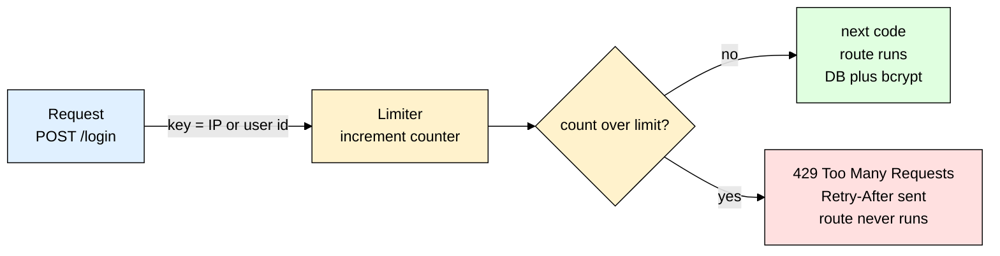
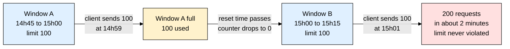
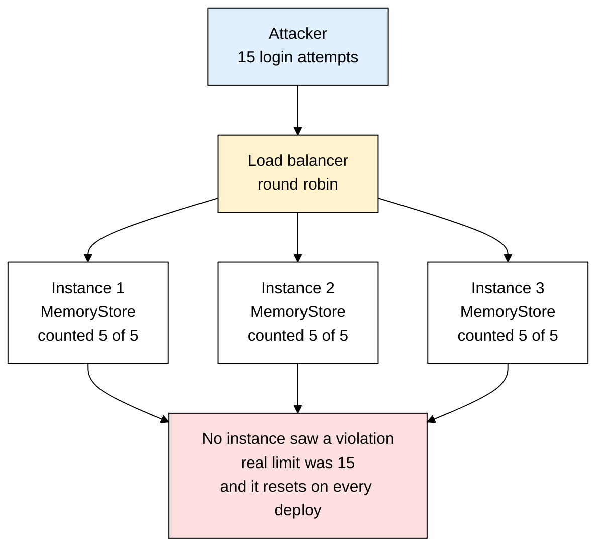
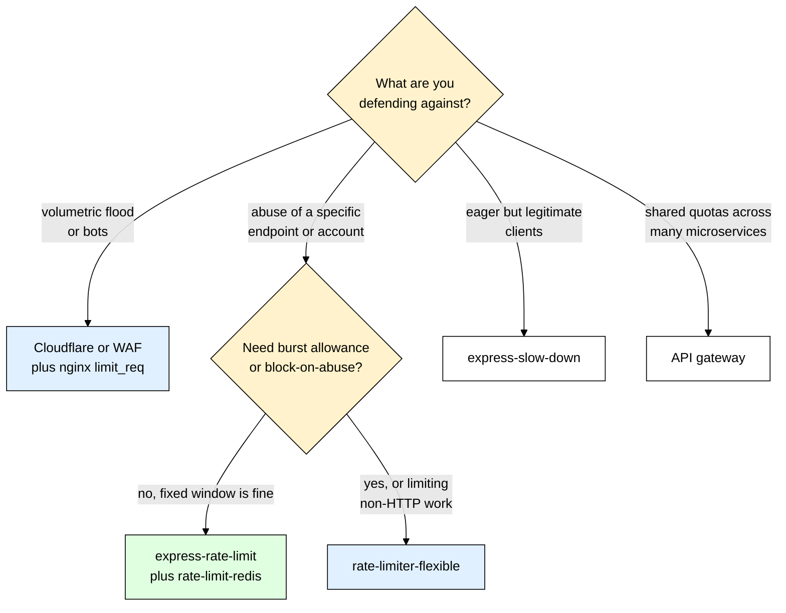

# express-rate-limit — Stopping Abuse Before It Reaches Your Database

> **Scope:** The `express-rate-limit` npm package — counting requests per client, the algorithms behind it, running it across multiple instances with Redis, and where rate limiting belongs in a real deployment.
> **Level:** Beginner + practical.
> **New to Express middleware?** Read [[express]] first — a rate limiter is just middleware that sometimes refuses to call `next()`.

---

## 1. ELI5: What is express-rate-limit?

You built a `/login` route. It looks fine. Then one night a script starts hitting it 40 times a second, walking through a leaked password list. Every request wakes your server, opens a database query, and runs a [[bcrypt]] comparison that deliberately burns 250ms of CPU. Your connection pool saturates, real users see timeouts, and the month's hosting bill arrives looking like a phone number. Nothing was "hacked" — you were simply *asked too many questions, too fast*.

Think of a nightclub with one bouncer at the door, holding a **clicker with one count per face**. He isn't checking a banned list. You can walk in and out five times an hour, no problem; on the sixth try he puts a hand up — *"Not banned. Just come back in twenty minutes."* He counts, and when the count is too high for that face he stalls you at the door, before you get anywhere near the bar, the kitchen, or anything else that costs the club money. `express-rate-limit` is that bouncer as Express middleware. It keeps a counter per client, and when the counter goes over your threshold it answers the request itself with a `429` instead of calling `next()`. Your route handler never runs. Your database is never touched.

> **Type:** npm package — Express middleware. Its only peer dependency is `express >= 4.11`, so Express 4 and Express 5 are both supported.
> **Core promise:** Count requests per client per time window, and cheaply reject the ones over the line before they reach anything expensive.



---

## 2. Why Does express-rate-limit Exist? (The Problem It Solves)

Everyone hand-rolls this once. It looks like ten lines:

```js
// ❌ The version everyone writes first — quietly broken in five different ways
const hits = new Map(); // ip -> { count, firstSeenAt }
app.post("/login", (req, res, next) => {
  const entry = hits.get(req.ip);
  const now = Date.now();
  if (!entry || now - entry.firstSeenAt > 15 * 60 * 1000) {  // no entry, or window expired
    hits.set(req.ip, { count: 1, firstSeenAt: now });
    return next();
  }
  if (++entry.count > 5) return res.status(429).send("Too many requests");
  next();
});
```

What is actually wrong with it: that `Map` never shrinks, so a scraper rotating through 200k addresses turns it into a memory leak — a funnier denial-of-service than the one you were preventing. `req.ip` is the load balancer, not the user, the moment you deploy behind nginx (section 7). No `RateLimit` or `Retry-After` headers means a well-behaved client can't back off politely. It counts successful logins, punishing the user who fat-fingered their password twice then got it right. And it's per-process: two containers, two `Map`s, double the limit (section 6).

| Without express-rate-limit | With express-rate-limit |
|---|---|
| A leaked-password script gets unlimited guesses against `/login` | 5 guesses per 15 minutes, then the door closes — the password list becomes useless in practice |
| A slow hash like [[bcrypt]] makes each guess expensive **for your CPU too** — the attacker is spending your money | The guess is rejected in microseconds, before hashing, before the DB round trip |
| A scraper pulls your entire product catalogue overnight | Reads capped at a sane rate per client; bulk scraping needs hundreds of IPs to be worth it |
| A buggy frontend `useEffect` loops and fires 10k requests | The loop hits a wall at request 100 and your logs show *one* obvious offender |
| Every request to a route that calls a paid API is billable | You cap spend structurally, not by hoping nobody notices the endpoint |
| Your `Map` grows forever and resets on deploy | Counters expire automatically; with a shared store they survive restarts |

Named properly, the threats this blocks are **online brute force** (guessing one account's password — a strong hash slows each attempt down, it does not *stop* the attempts), **credential stuffing** (millions of leaked email/password pairs, one attempt per account, where per-IP limits catch the naive version and per-account limits catch the distributed one), **scraping** (rebuilding your catalogue by walking your IDs), **accidental self-DoS** (a retry loop with no backoff in your own mobile app, shipped to 50k phones), and **cost blowouts** on any route that fans out to something metered.

---

## 3. Installing & Basic Usage

```bash
npm install express-rate-limit
```

The smallest thing that works:

```js
import express from "express";
import { rateLimit } from "express-rate-limit";

const app = express();
// Order matters — only routes registered BELOW this line are protected
app.use(rateLimit({
  windowMs: 15 * 60 * 1000,   // window length in ms — the default is only 60000
  limit: 100,                 // max requests per key per window — the default is only 5
  standardHeaders: "draft-8", // send the IETF RateLimit headers
  legacyHeaders: false,       // drop the X-RateLimit-* trio, which defaults to ON
}));

app.get("/products", (req, res) => res.json([]));
app.listen(3000);
```

Write all four out every time: the package ships defaults of `windowMs: 60000` and `limit: 5` — deliberately tiny, so an unconfigured limiter is obvious rather than silently permissive — and it still sends only the obsolete `X-RateLimit-*` headers unless you say otherwise.

### CommonJS version

```js
const express = require("express");
const { rateLimit } = require("express-rate-limit"); // named export works in CJS too

const app = express();
app.use(rateLimit({ windowMs: 15 * 60 * 1000, limit: 100 }));
```

### Express example

Apply a much stricter limiter to exactly one route by passing it as route-level middleware:

```js
import bcrypt from "bcrypt";
import { rateLimit } from "express-rate-limit";
import User from "./models/User.js"; // mongoose model

const loginLimiter = rateLimit({
  windowMs: 15 * 60 * 1000,
  limit: 5,                     // 5 attempts per IP per 15 min
  standardHeaders: "draft-8",
  legacyHeaders: false,
  message: { error: "Too many login attempts. Try again in 15 minutes." },
  skipSuccessfulRequests: true, // a correct password shouldn't cost you an attempt
});

// The limiter runs first, every time — bcrypt only ever sees survivors
app.post("/login", loginLimiter, async (req, res) => {
  const user = await User.findOne({ email: req.body.email });
  if (!user || !(await bcrypt.compare(req.body.password, user.passwordHash))) {
    return res.status(401).json({ error: "Invalid credentials" });
  }
  res.json({ ok: true });
});
```

That's the entire mental model — build a limiter object with a window and a limit, then mount it either globally with `app.use()` or on a single route. Everything else in this file is about making the counting *correct*: correct algorithm, correct key, correct store.

---

## 4. The Algorithms — And Why Fixed Window Lets Through a Double Burst

Every rate limiter answers one question: *"has this client made too many requests recently?"* The word doing all the work is **recently**. There are five standard ways to define it.

**Fixed window** — chop time into buckets of `windowMs` and keep one integer per client. A client's window opens on their first request; when their `resetTime` passes, the counter drops straight back to zero — a hard reset, not a gradual decay. One number per client, trivially fast. **This is what `express-rate-limit` does by default**, and it's what the code above is doing. It has one famous flaw, and it is the single most important thing to understand about rate limiting:



A limit of "100 per 15 minutes" therefore really means "up to 200 in any 2-minute stretch, if the attacker lines up with the reset." And attackers do line up — the seconds remaining are right there in the `RateLimit` response header you helpfully sent them. **Rule of thumb:** if a burst of `2 × limit` would hurt you, set the limit to half what you actually want to allow, or move to an algorithm without boundaries.

**Sliding window log** stores the timestamp of *every* request, drops the ones older than the window, and counts what's left — perfectly accurate, no boundary effect, and one entry per request per client. Ten thousand users at 100 requests each is a million timestamps sitting in Redis: correct and expensive. **Sliding window counter** is the pragmatic compromise: keep this window's count and the previous one, then weight the old one by how much still overlaps, so 40% into the new window `estimate = prev × 0.6 + current`. Two integers, no boundary burst, small approximation error — what most CDNs run.

**Token bucket** refills a bucket of capacity `N` at a steady rate; each request spends a token and no tokens means rejection. Idle clients accumulate tokens, so an app that's quiet for a minute can then fire a legitimate burst — the right model for "sustained 10/s, but a page load may fire 50 at once." **Leaky bucket** queues requests into a bucket that drains at a fixed rate, so output is perfectly smooth and overflow is dropped. That's what nginx's `limit_req` implements, and it fits when the thing downstream physically cannot go faster than X per second.

| Algorithm | Boundary burst? | Memory per client | Bursts allowed | Where you meet it |
|---|---|---|---|---|
| **Fixed window** | Yes — up to 2× limit | 1 counter | Uncontrolled at boundaries | `express-rate-limit` default, most tutorials |
| Sliding window log | No — exact | 1 timestamp **per request** | None | Small, high-value endpoints only |
| **Sliding window counter** | No — approximate | 2 counters | None | Cloudflare, most API gateways |
| Token bucket | No | 2 values: tokens plus refill time | Yes, capped and intentional | AWS API Gateway, Stripe's API |
| Leaky bucket | No | 2 values: level plus timestamp | No — smooths output | nginx `limit_req` |

For 95% of apps, fixed window with a limit set at half your true tolerance is completely fine. Reach for [[ioredis]]-backed `rate-limiter-flexible` when you specifically need burst allowances or block-on-abuse behaviour that this package does not model.

---

## 5. Options, Headers, and the Correct 429 Response

The full set of options you'll realistically use:

```js
const limiter = rateLimit({
  windowMs: 15 * 60 * 1000,     // default 60000
  limit: 100,                   // default 5; v7 renamed this from `max`, which still works
  standardHeaders: "draft-8",   // "draft-6" | "draft-7" | "draft-8" | true | false (default false)
  legacyHeaders: false,         // the old X-RateLimit-* trio — default true, turn it off
  statusCode: 429,              // the default, and the only correct answer here
  message: { error: "Too many requests, slow down." }, // string, object, or function
  skip: (req) => req.path === "/health", // uptime pings shouldn't eat the budget
  skipSuccessfulRequests: false,         // true = only failures count (see below)
  skipFailedRequests: false,             // true = only successes count
  passOnStoreError: false,               // true = allow the request if the store throws
  ipv6Subnet: 56,                        // how much of an IPv6 address shares a counter
  // handler fires only when the limit is exceeded — the place to log the offender
  handler: (req, res, next, options) =>
    res.status(options.statusCode).json({ error: "rate_limited" }),
});
```

**`skipSuccessfulRequests` is not "don't count successes" — it's "count, then refund."** The middleware increments up front, and when the response finishes with a status under 400 it calls `store.decrement()` to give the hit back. That distinction matters: a hundred concurrent successful requests can still trip the limiter momentarily, because the refunds haven't landed yet. It's still exactly what you want on `/login`, where only wrong guesses should cost anything.

### The headers

With `standardHeaders: "draft-8"` and `windowMs: 900000, limit: 100`, every response carries the client's current budget:

```
RateLimit: "100-in-15min"; r=87; t=412
RateLimit-Policy: "100-in-15min"; q=100; w=900; pk=:MTJjYTE3YjQ5YWYy:

HTTP/1.1 429 Too Many Requests    <- and, only on rejection
Retry-After: 412
```

Read that as: the policy named `100-in-15min` allows a quota of 100 (`q`) per 900-second window (`w`), you have 87 remaining (`r`), and it resets in 412 seconds (`t`). The `pk` is an opaque hash of your rate-limit key, so a client can tell two policies apart without you leaking the key. The policy name comes from the `identifier` option, which defaults to `{limit}-in-{window}`.

The three drafts differ only in shape, and the package supports all of them. `"draft-6"` — which is also what `true` maps to — sends `RateLimit-Policy` plus separate `RateLimit-Limit`, `RateLimit-Remaining` and `RateLimit-Reset` headers. `"draft-7"` sends `RateLimit-Policy: 100;w=900` plus a combined `RateLimit: limit=100, remaining=87, reset=412`. `"draft-8"` is the named-policy form shown above, and it's what the package's own docs now recommend.

**Always set `standardHeaders` and `legacyHeaders` explicitly.** The defaults are `false` and `true` respectively, kept that way for backwards compatibility, so an unconfigured limiter ships only the headers nobody should be parsing any more.

**`429 Too Many Requests` is the correct status code** — not 403 (that means "authenticated but forbidden, don't bother retrying"), not 503. A well-written client sees 429 plus `Retry-After` and sleeps exactly that long. Send 403 and it will retry immediately, forever. Note that `Retry-After` is attached to the rejection only, while the `RateLimit` headers ride along on every response.

Two more things worth knowing. Any downstream handler can read `req.rateLimit` — `{ limit, used, remaining, resetTime, key }`, where `resetTime` is a `Date` and `key` is the string the limiter counted against. And you can wipe a client's counter by hand, which is the standard move right after a successful login:

```js
// Reset the key the limiter actually counted — for IPv6 that is the masked subnet,
// not the raw req.ip, so read it back off the request
await loginLimiter.resetKey(req.rateLimit.key);
```

---

## 6. The Multi-Instance Trap (Read This One Twice)

Here is the bug that ships to production more than any other in this file, and it never throws an error.

The default store is `MemoryStore` — a pair of JavaScript `Map`s living inside one Node process (two, so expired clients can be dropped in bulk instead of scanned for). That's perfect on your laptop, where there is exactly one process. Now you deploy: [[pm2]] in cluster mode across 4 CPU cores, or three containers behind a load balancer, or a platform that autoscales. Each process gets its **own** maps. The load balancer sprays requests across them round-robin. Your "5 login attempts per 15 minutes" is now 15 attempts, and nobody told you.



Two consequences, both bad. **Your effective limit is silently multiplied by your instance count** — and it changes every time you autoscale, so you cannot reason about a number that depends on how many pods happen to be running. And **counters die on every restart**: deploy during an attack and you hand the attacker a fresh budget; crash-loop and they get one per restart.

The fix is a **shared store** — one counter that every instance increments. In practice that means Redis, via `rate-limit-redis` on top of [[ioredis]]:

```bash
npm install express-rate-limit rate-limit-redis ioredis
```

```js
// rateLimiters.js
import { rateLimit } from "express-rate-limit";
import { RedisStore } from "rate-limit-redis";
import { Redis } from "ioredis";

// enableOfflineQueue:false makes commands fail fast instead of silently buffering
// while Redis is down. One connection, shared by every limiter.
export const redis = new Redis(process.env.REDIS_URL, { enableOfflineQueue: false });
redis.on("error", (err) => console.error("[redis] limiter store", err.message));

// A factory: every limiter shares the wiring but gets its OWN store instance —
// sharing one RedisStore across limiters is a real error, ERR_ERL_STORE_REUSE.
export function makeLimiter({ windowMs, limit, prefix, ...rest }) {
  return rateLimit({
    windowMs,
    limit,
    standardHeaders: "draft-8",
    legacyHeaders: false,
    // rate-limit-redis takes a raw command sender, so it works with any client, and
    // the prefix keeps keyspaces apart: "rl:auth:" must never collide with "rl:api:".
    store: new RedisStore({ sendCommand: (...args) => redis.call(...args), prefix }),
    // Redis unreachable? Let the request through rather than 500-ing every caller.
    // Fail-open favours availability, fail-closed favours security — choose per route.
    passOnStoreError: true,
    ...rest,
  });
}
// app.js — one counter in Redis, shared by every instance
app.use("/api", makeLimiter({ windowMs: 15 * 60 * 1000, limit: 100, prefix: "rl:api:" }));
```

Redis is the right tool here specifically because the increment is **atomic**. `rate-limit-redis` ships the whole read-set-expire dance as a small Lua script, which Redis runs to completion without interleaving anything else, so two instances incrementing the same key in the same millisecond cannot both read "4" and both write "5". A Mongo counter would need `findOneAndUpdate` with `$inc` and would still be paying durable writes for a number that lives fifteen minutes. Short-lived counters are the textbook Redis workload.

> ⚠️ Do not "fix" the multi-instance problem with sticky sessions. Sticky routing pins a client to one instance so the counter looks right — until that instance restarts, or the attacker changes their source IP, or you scale down. It hides the bug instead of fixing it.

---

## 7. Identifying the Client Correctly

A rate limiter is only as good as its **key** — the string it counts against. Get the key wrong and you have either no protection or an outage.

By default the key is derived from `req.ip`. Behind any proxy, `req.ip` is *the proxy's address*, so every user on your site shares a single counter. The first hundred visitors after deploy consume the budget and everyone else gets a `429`. One counter, one global outage.

Express solves this with the `trust proxy` setting, which decides how `req.ip` is derived from the `X-Forwarded-For` header. That header is a list, appended left to right as the request passes through proxies: `X-Forwarded-For: <client>, <proxy1>, <proxy2>`.

With exactly one proxy in front of Node — nginx, an ALB, or Cloudflare alone — you write `app.set("trust proxy", 1)`. The number means **"how many hops in front of me do I trust"**. With `1`, Express treats the single connection in front of it as trusted and takes the **rightmost** `X-Forwarded-For` entry as the client. Why that's safe: an attacker sends `X-Forwarded-For: 1.2.3.4` from their machine; your nginx *appends* the address it actually received the connection from, producing `1.2.3.4, <real-attacker-ip>`; Express reads the rightmost entry and gets the real address. The forged prefix is ignored.

Never write `app.set("trust proxy", true)` on a public app. `true` means "trust the entire chain", so Express walks all the way to the **leftmost** entry — the one fully under the attacker's control. They now change one header per request and every request looks like a different client. Your rate limiter becomes decorative. `express-rate-limit` checks for exactly this and logs an `ERR_ERL_PERMISSIVE_TRUST_PROXY` validation error, which you should treat as a build failure, not a warning.

**Rule of thumb:** set `trust proxy` to the exact number of proxies you control, count them by hand, and re-count when your infrastructure changes. Behind Cloudflare *and* nginx, that's `2`. If Node is exposed directly, leave it at the default `false` — and if an `X-Forwarded-For` header shows up anyway, the package tells you with `ERR_ERL_UNEXPECTED_X_FORWARDED_FOR`. Cloudflare additionally sends `CF-Connecting-IP`, a single unambiguous value rather than a list, but it's only trustworthy if your origin firewall rejects traffic that didn't come from Cloudflare — otherwise anyone who finds your origin IP can set that header themselves.

**Keying by user, not by address.** IP keying has two failure modes that no amount of `trust proxy` tuning fixes. Addresses are *shared* — an office, a university, or a mobile carrier behind CGNAT looks like one client, so a limit of 100 per 15 minutes locks out 3,000 people. And addresses are *cheap to rotate* — a residential proxy pool gives an attacker a fresh one per request. So once a user is authenticated (see [[jsonwebtoken]]), key on their **user id**: stable, unforgeable, and exactly the thing you want to limit.

```js
import { rateLimit, ipKeyGenerator } from "express-rate-limit";

const apiLimiter = rateLimit({
  windowMs: 15 * 60 * 1000,
  limit: 100,
  // Authenticated? The account is the identity that matters, not the network path.
  // Anonymous? Fall back to the IP — normalised, see below.
  keyGenerator: (req) =>
    req.user?.id ? `user:${req.user.id}` : ipKeyGenerator(req.ip ?? "unknown"),
});

// Mount AFTER your auth middleware, so req.user is already populated
app.use("/api", authenticate, apiLimiter);
```

**Why `ipKeyGenerator` instead of `req.ip` directly?** IPv6. A single home connection is typically handed a /64 — 18 quintillion addresses the user can rotate through for free, so per-address IPv6 limiting is worthless. `ipKeyGenerator(ip, ipv6Subnet = 56)` masks IPv6 addresses down to a /56 subnet and returns IPv4 addresses untouched, so a whole allocation shares one counter. The default `keyGenerator` already does this; the moment you write your own, you own the problem, and the package throws `ERR_ERL_KEY_GEN_IPV6` if your function mentions `req.ip` without the helper. To widen or tighten the mask without writing a `keyGenerator` at all, set the `ipv6Subnet` option — it is ignored when a custom `keyGenerator` is also present.

> ⚠️ Never key on something the client controls freely — an `X-Api-Key` header from an unauthenticated caller, a `deviceId` from the request body, or a cookie you don't sign. The attacker just changes it. Key on something *you* issued and verified.

---

## 8. Tiered Limits — Different Doors, Different Bouncers

One global limit is a blunt instrument. A search endpoint and a password-reset endpoint have nothing in common: one should allow hundreds of calls, the other should allow five. Real apps stack several limiters.

```js
// limiters.js — every prefix is a separate Redis keyspace, so the counters never collide
import { makeLimiter } from "./rateLimiters.js";

// Safety net, then reads (cheap and cacheable) versus writes (they touch the database)
export const globalLimiter = makeLimiter({ windowMs: 15 * 60 * 1000, limit: 1000, prefix: "rl:global:" });
export const readLimiter  = makeLimiter({ windowMs: 60 * 1000, limit: 120, prefix: "rl:read:" });
export const writeLimiter = makeLimiter({ windowMs: 60 * 1000, limit: 20,  prefix: "rl:write:" });

// Credential endpoints: brutally strict, and only wrong guesses cost anything
export const authLimiter = makeLimiter({
  windowMs: 15 * 60 * 1000, limit: 5, prefix: "rl:auth:",
  skipSuccessfulRequests: true,
  message: { error: "Too many attempts. Try again in 15 minutes." },
});

// Paid plans buy a bigger budget — `limit` may be a function of the request, evaluated
// per request, so an upgrade takes effect immediately with no redeploy
export const planLimiter = makeLimiter({
  windowMs: 60 * 1000, prefix: "rl:plan:",
  limit: (req) => ({ enterprise: 5000, pro: 600 })[req.user?.plan] ?? 60,
});
```

Mounting them — order is everything, because middleware runs top to bottom:

```js
import express from "express";
import helmet from "helmet"; // see [[helmet]]
import { authenticate } from "./auth.js";
import { loginHandler, forgotHandler, listProducts, createOrder } from "./handlers.js";
import { globalLimiter, readLimiter, writeLimiter, authLimiter, planLimiter } from "./limiters.js";

const app = express();
app.use(helmet());        // security headers first
app.use(express.json());
app.use(globalLimiter);   // everything below passes through the safety net

// Strict limiters go on the specific route, before the handler
app.post("/auth/login", authLimiter, loginHandler);
app.post("/auth/forgot-password", authLimiter, forgotHandler);

app.use("/api", authenticate, planLimiter); // per-plan budget, keyed on the logged-in user
app.get("/api/products", readLimiter, listProducts);
app.post("/api/orders", writeLimiter, createOrder);
```

A request to `POST /api/orders` is now counted by three separate limiters against three separate Redis keys, and the tightest one wins. That's intentional: the global limiter catches pathological clients, the plan limiter enforces what the customer paid for, and the write limiter protects the database.

**Rule of thumb:** mount limiters on `/api` and on auth routes — never at the very top of a server that also serves static files, or one page load pulling 40 assets will burn 40 of the user's 100 requests.

---

## 9. express-slow-down and Defence in Depth

Rejecting with a `429` is a hard wall. Sometimes you want a **speed bump** instead: eager-but-legitimate clients get progressively slower, while automated abuse becomes too slow to be worth running. That's `express-slow-down`, from the same maintainers, with the same options shape.

```bash
npm install express-slow-down
```

```js
import { slowDown } from "express-slow-down";
const speedBump = slowDown({
  windowMs: 15 * 60 * 1000,
  delayAfter: 50,                       // first 50 requests are full speed (default is 1)
  // delayMs takes a function of the hit count: the delay grows past the threshold
  delayMs: (used) => (used - 50) * 200, // request 51 waits 200ms, 52 waits 400ms...
  maxDelayMs: 10_000,                   // default is Infinity — always cap it
});

app.use("/api/search", speedBump);
```

Use `slowDown` where a hard rejection would be user-hostile (search-as-you-type, autocomplete) and `rateLimit` where abuse is the only explanation (login, signup, password reset). They compose — a speed bump at 50, a wall at 200.

### Application limits are the *last* line, not the only one

By the time a request reaches Node you have already paid for a TCP handshake, TLS negotiation, HTTP parsing and an event-loop slot, and a 10 Gbps flood exhausts your bandwidth long before your limiter has an opinion. So layer it:

| Layer | Handles | Blind to |
|---|---|---|
| Cloudflare / WAF | Volumetric floods, known bad networks, bot fingerprints — traffic never touches your bill | Your business rules, who is logged in, what a "plan" is |
| nginx / load balancer `limit_req` | Per-IP connection and request floods, cheaply, in C | Authenticated identity, per-endpoint cost |
| **`express-rate-limit`** | Per-user, per-plan, per-endpoint rules that need your app's knowledge | Anything that never reaches Node |

**Rule of thumb:** the edge stops *volume*, your app stops *abuse of meaning*. The edge cannot know that this authenticated user is on the free plan and has already triggered 40 report exports today. Only your app knows that — which is exactly why you still need `express-rate-limit` even behind Cloudflare.

---

## 10. TypeScript Version

```ts
import express, { type Request, type Response, type NextFunction } from "express";
import { rateLimit, ipKeyGenerator, type AugmentedRequest, type Options, type RateLimitRequestHandler } from "express-rate-limit";
import { loginHandler } from "./handlers.js";

// Tell TypeScript what your auth middleware attaches to the request
declare global {
  namespace Express {
    interface Request { user?: { id: string; plan: "free" | "pro" | "enterprise" } }
  }
}

// A typed factory: shared config lives here, callers override what they need.
// `Options` is fully typed, so a typo like `windowMS` fails at compile time.
function createLimiter(overrides: Partial<Options>): RateLimitRequestHandler {
  return rateLimit({
    windowMs: 15 * 60 * 1000,
    limit: 100,
    standardHeaders: "draft-8",
    legacyHeaders: false,
    keyGenerator: (req: Request): string =>
      req.user ? `user:${req.user.id}` : ipKeyGenerator(req.ip ?? "unknown"),
    handler: (req: Request, res: Response, _next: NextFunction, options: Options): void => {
      // The package does NOT augment express.Request globally — cast to reach
      // `rateLimit`, whose `resetTime` is `Date | undefined`.
      const { resetTime } = (req as AugmentedRequest).rateLimit;
      const retryAfter = resetTime
        ? Math.ceil((resetTime.getTime() - Date.now()) / 1000)
        : Math.ceil(options.windowMs / 1000);
      res.status(options.statusCode).json({ error: "rate_limited", retryAfterSeconds: retryAfter });
    },
    ...overrides,
  });
}

const app = express();
app.set("trust proxy", 1);
app.post("/auth/login", createLimiter({ limit: 5, skipSuccessfulRequests: true }), loginHandler);
```

The one thing people get wrong here: `req.rateLimit` is **not** added to Express's `Request` type by installing the package. Either cast to the exported `AugmentedRequest`, as above, or write your own `declare global` block for it — the same mechanism you already need for `req.user`.

---

## 11. Production Setup

What a real deployed Express app actually configures, end to end:

```js
// server.js — reuses makeLimiter() from section 6
import "dotenv/config"; // see [[dotenv]]
import express from "express";
import helmet from "helmet";
import logger from "./logger.js"; // winston — see [[winston_morgan]]
import { makeLimiter } from "./rateLimiters.js";

const app = express();
// Count your proxies by hand. One ALB = 1. Cloudflare in front of nginx = 2. Never `true`.
app.set("trust proxy", Number(process.env.TRUSTED_PROXY_HOPS ?? 1));

app.use(helmet());
app.use(express.json({ limit: "100kb" })); // cap body size too — abuse isn't only about count
app.get("/health", (req, res) => res.json({ ok: true })); // BEFORE any limiter

app.use(makeLimiter({
  windowMs: 15 * 60 * 1000,
  limit: Number(process.env.GLOBAL_LIMIT ?? 1000), // tunable during an incident
  prefix: "rl:global:",
  handler: (req, res, next, options) => {
    // Log every rejection — a spike here is an incident signal, not noise
    logger.warn("rate_limited", { ip: req.ip, path: req.originalUrl, userId: req.user?.id });
    res.status(options.statusCode).json({ error: "Too many requests" });
  },
}));
app.listen(process.env.PORT ?? 3000);
```

The production checklist:

- **Shared store** — mandatory the moment you run more than one process, non-negotiable under [[pm2]] cluster mode, and each limiter needs its own store instance with its own prefix.
- **`trust proxy` set to a number**, verified by logging `req.ip` in staging and confirming it's a real client address.
- **Limits driven by env vars**, so you can loosen them during an incident without a deploy, and **documented publicly** so API consumers can build correct backoff instead of guessing.
- **429s logged and alerted on**, with health checks and internal traffic exempted via `skip`. A sustained spike in 429s from many IPs on `/login` is a credential-stuffing campaign in progress.
- **A deliberate answer to "what if Redis dies?"** — `passOnStoreError: true` keeps you available but unprotected; `false` (the default) surfaces the store error to your error handler. Public APIs usually fail open; auth endpoints often fail closed.

---

## 12. Common Gotchas & Best Practices

| Gotcha | Fix |
|---|---|
| **Limiter registered after the routes** | `app.use(limiter)` only protects routes declared *below* it. Put global limiters immediately after `helmet`/`express.json()`, or pass the limiter as route-level middleware where the order is explicit. |
| **Default `MemoryStore` in a multi-process deploy** | Under [[pm2]] cluster mode or N containers your real limit is silently `N × limit`, and it resets on every deploy. Swap in `rate-limit-redis` backed by [[ioredis]] — there is no warning for this, you have to know. |
| **`app.set("trust proxy", true)`** | Express then walks to the leftmost `X-Forwarded-For` entry, which the attacker controls, so one header change per request bypasses the limiter entirely. Set the exact hop count (`1`, `2`, …). The package logs `ERR_ERL_PERMISSIVE_TRUST_PROXY` when you get this wrong. |
| **No `trust proxy` at all behind nginx** | Every request appears to come from the proxy, so all your users share one counter and the whole site starts returning 429 after 100 requests. The package logs `ERR_ERL_UNEXPECTED_X_FORWARDED_FOR`; the symptom is 429s that hit everyone at once, right after a traffic bump. |
| **Limiting traffic that isn't abuse** | A global limiter in front of static files means one page pulling 40 assets spends 40 of the user's 100 requests; one in front of `/health` means your load balancer gets 429s and marks the instance unhealthy — a self-inflicted outage. Mount limiters on `/api` and auth routes, and `skip` health paths. |
| **Custom `keyGenerator` using `req.ip` raw** | A single IPv6 customer typically owns a /64, so per-address counting is free to bypass. Use the exported `ipKeyGenerator(req.ip)`, which masks IPv6 to a /56 and leaves IPv4 untouched, or the package throws `ERR_ERL_KEY_GEN_IPV6`. |
| **Sharing one store instance across limiters** | Every `rateLimit()` call needs its own `RedisStore` with its own `prefix`, or the counters merge and you get `ERR_ERL_STORE_REUSE`. Build them in a factory so the mistake is impossible. |
| **Copying `max:` and header defaults from old tutorials** | v7 renamed `max` to `limit`; `max` still works but is deprecated. And the header defaults are `legacyHeaders: true` / `standardHeaders: false`, so an unconfigured limiter ships only the obsolete `X-RateLimit-*` trio. Set all three explicitly. |

---

## 13. Alternatives — When express-rate-limit Isn't the Best Fit

| Tool | What it is | Best for | Weakness |
|---|---|---|---|
| **`express-rate-limit`** | Express middleware, fixed window, pluggable stores, near-zero config | Almost every Node app — per-route and per-user rules that need app knowledge | Fixed window only; runs after the request already reached Node |
| **`rate-limiter-flexible`** | Framework-agnostic library with `BurstyRateLimiter`, `blockDuration`, `execEvenly` smoothing, an `insuranceLimiter` fallback, and stores for Redis, Mongo, Postgres, MySQL and memory | You need burst allowances, long blocks after abuse, a fallback store, or limiting things that aren't HTTP requests (a queue consumer, an SMS sender) | Bigger API surface, more wiring, not middleware-shaped out of the box |
| **`express-slow-down`** | Adds increasing latency instead of rejecting | Search and autocomplete, where a hard 429 is user-hostile | Holds sockets open — always set `maxDelayMs`; doesn't stop a determined attacker |
| **nginx `limit_req`** | Leaky bucket in the reverse proxy, keyed on any variable | Cheap per-IP flood protection before Node spends a single cycle | Knows nothing about users, plans, or endpoint costs; config lives outside your repo |
| **Cloudflare or a WAF** | Edge rate limiting plus bot detection, on someone else's hardware | Volumetric attacks, scrapers, keeping junk off your bandwidth bill entirely | Costs money at real volume; per-user business rules still live in your app |
| **API gateway** (Kong, AWS API Gateway, Apigee) | Centralised quotas and plans across many services | Microservices where the limit must be shared across services and monetised per API key | Operational weight; overkill for a single Express app |



**Rule of thumb:** start with `express-rate-limit` plus a Redis store — it covers the real threats for a normal app. Add the edge layer when volume becomes a bandwidth problem. Graduate to `rate-limiter-flexible` only when you can name the specific behaviour you need and why a fixed window fails you.

---

## 14. Interview Questions

**Q: If you already hash passwords with bcrypt, why do you still need rate limiting on `/login`?**
A: A slow hash defends the *offline* attack — someone who stole your database and is grinding hashes on their own GPUs. It does nothing about the *online* attack, where the attacker is politely asking your API to check guesses for them. Worse, bcrypt makes each of those guesses expensive for **your** CPU, so an unlimited login endpoint with a strong hash is an efficient way for an attacker to exhaust your server. The two controls solve different halves of the problem and you need both.

**Q: Explain the burst problem with fixed-window rate limiting.**
A: Fixed window resets a client's counter the instant their reset time passes, so a client can spend its entire budget in the last second of one window and its full budget again in the first second of the next — `2 × limit` requests in a tiny stretch of time, without ever violating the stated limit. The seconds remaining are published in the `RateLimit` header, so lining up with the reset is trivial. The mitigations are to set the limit at half your true tolerance, or to move to a sliding window counter or token bucket.

**Q: Why does the default in-memory store break in production?**
A: `MemoryStore` keeps its maps inside one Node process. With pm2 cluster mode or several containers behind a load balancer, each process keeps its own independent counter, so the effective limit becomes the configured limit times the number of instances — and it changes silently whenever you autoscale. Counters also vanish on every restart, handing an attacker a fresh budget on each deploy. The fix is a shared store, normally Redis via `rate-limit-redis`, whose increment runs as an atomic Lua script.

**Q: What exactly does `app.set("trust proxy", 1)` do, and why is `true` dangerous?**
A: It tells Express how many proxy hops in front of it are trusted, which determines how `req.ip` is extracted from the `X-Forwarded-For` list. With `1`, Express takes the rightmost entry — the address your own proxy appended — so an attacker's forged prefix is ignored. With `true`, Express trusts the entire chain and takes the leftmost value, which is entirely attacker-supplied, so changing one header per request gives them an unlimited supply of identities and your limiter stops working.

**Q: Which HTTP status code and headers should a rate-limited response carry?**
A: `429 Too Many Requests`, with `Retry-After` giving the number of seconds to wait, and the `RateLimit` / `RateLimit-Policy` headers describing the budget on every response, not just the rejections. That combination lets a well-written client back off precisely instead of retrying blindly. Using `403` is wrong because it signals "don't bother retrying, ever", and clients will hammer you anyway.

**Q: Should you rate limit by IP address or by user ID?**
A: Both, at different layers. IP is the only identity you have for anonymous traffic like login and signup, but it's shared by everyone behind a corporate NAT or a mobile carrier, and it's cheap for an attacker to rotate. Once a request is authenticated, the user ID is stable and unforgeable, so it's the better key for API quotas and per-plan limits. The usual pattern is a `keyGenerator` that returns the user ID when present and a normalised IP otherwise — and for IPv6 that fallback must go through `ipKeyGenerator`, or a single customer's /64 hands them unlimited keys.

**Q: What does `skipSuccessfulRequests` actually do under the hood?**
A: It does not skip the count — it refunds it. The middleware increments the store before your handler runs, then calls `store.decrement()` when the response finishes with a status below 400. That matters under concurrency, because a burst of successful requests can still momentarily exhaust the budget before the refunds land. On `/login` it is still the right setting, since only wrong guesses should consume attempts.

**Q: If you're already behind Cloudflare, why bother with application-level rate limiting?**
A: The edge stops volume — floods, bots, obvious scrapers — and it does that far more cheaply than your server can. What it cannot do is enforce meaning: it doesn't know this user is on the free plan, that they've already run 40 report exports today, or that this endpoint costs you money per call because it fans out to a paid API. Those rules require your application's data, so the layers are complementary rather than redundant.

---

## 15. Quick Cheat Sheet

```bash
npm install express-rate-limit                # the middleware
npm install rate-limit-redis ioredis          # shared store for multi-instance deploys
npm install express-slow-down                 # delays instead of rejecting
```

```js
// Minimal limiter — always set all four; the defaults are 60s / 5 / legacy headers on
import { rateLimit } from "express-rate-limit";

app.use("/api", rateLimit({
  windowMs: 15 * 60 * 1000, limit: 100,
  standardHeaders: "draft-8", legacyHeaders: false,
}));

// Strict auth limiter — only wrong guesses count
app.post("/login", rateLimit({
  windowMs: 15 * 60 * 1000, limit: 5,
  skipSuccessfulRequests: true,
  message: { error: "Too many attempts." },
}), loginHandler);
```

```js
// Shared Redis store — REQUIRED for pm2 cluster mode / multiple containers
import { RedisStore } from "rate-limit-redis";
import { Redis } from "ioredis";

const redis = new Redis(process.env.REDIS_URL, { enableOfflineQueue: false });
rateLimit({
  windowMs: 60_000, limit: 100,
  // one RedisStore instance per limiter, or you get ERR_ERL_STORE_REUSE
  store: new RedisStore({ sendCommand: (...args) => redis.call(...args), prefix: "rl:api:" }),
  passOnStoreError: true, // fail open if Redis is unreachable
});
```

```js
// Correct client identification, and the rest of the API surface
import { ipKeyGenerator } from "express-rate-limit";
app.set("trust proxy", 1);              // exact number of proxies — never `true`
keyGenerator: (req) => (req.user ? `user:${req.user.id}` : ipKeyGenerator(req.ip ?? "unknown"));
skip: (req) => req.path === "/health";  // never throttle your own probes
await limiter.resetKey(req.rateLimit.key); // forgive after a successful login
req.rateLimit;                          // { limit, used, remaining, resetTime, key }
```

**Mental model to remember:**
> `express-rate-limit` is a bouncer with a clicker: it counts requests per key per window and answers `429` itself, so abuse never reaches your database or your [[bcrypt]] calls. The two things that silently break it are the in-memory store (use [[ioredis]] the moment you run more than one process — especially under [[pm2]]) and a wrong `trust proxy` value (set the exact hop count, never `true`). Pair it with [[helmet]] for headers and key on the [[jsonwebtoken]] user id once the request is authenticated.
