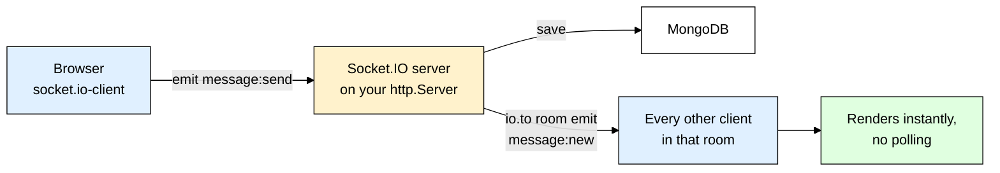
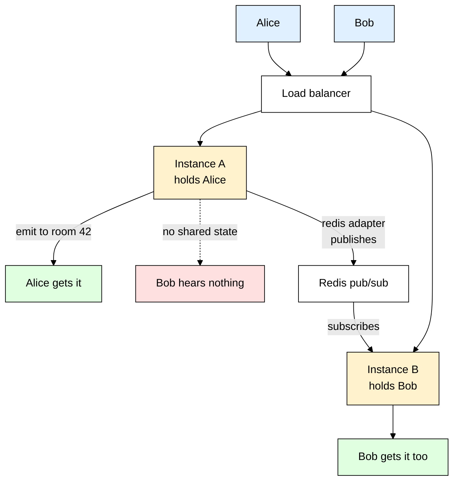
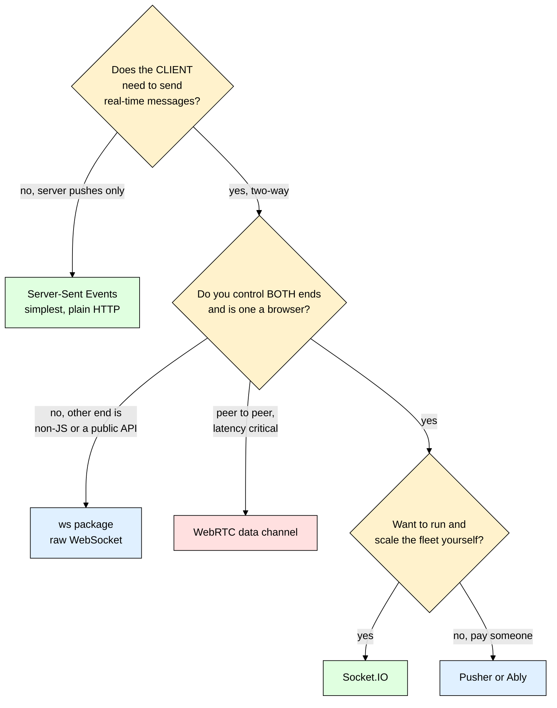

# socket.io — Real-Time, Two-Way Communication Made Practical

> **Scope:** The `socket.io` server package and its `socket.io-client` counterpart — events, rooms, namespaces, auth, acknowledgements, and multi-server scaling with the Redis adapter.
> **Level:** Beginner + practical. Assumes you can already build an Express route.
> **New to Express?** Read [[express]] first — Socket.IO almost always rides on top of an existing Express HTTP server.

---

## 1. ELI5: What is Socket.IO?

You built a chat app. Messages save fine, the REST endpoints work, and then you hit the wall: **how does User B find out that User A just sent something?** Your server knows — the message is sitting right there in memory. But your server has no way to tap User B on the shoulder, because HTTP only ever lets the server *answer*, never *speak first*. So you do what everyone does: `setInterval` calling `GET /messages` every two seconds. It works, sort of. It is also 30 pointless database queries per user per minute and a two-second lag on every message.

Think of the difference between **a drive-through window and a phone call**. HTTP is the drive-through: you pull up, you ask, they hand it over, you drive away — the window is shut again. If the kitchen later realises your order was wrong, they cannot reach you; you have to drive around the block and ask again, and again, just in case. A **WebSocket** is a phone call: you dial once, the line stays open, and either side speaks the moment it has something to say. **Socket.IO** is that phone call plus everything a real phone system gives you — it redials when the signal drops, falls back to a landline when the mobile network is blocked, has conference rooms so you can address a group, and beeps periodically to check the other side is still breathing.

> **Type:** npm package — a *pair* of packages: `socket.io` on the server, `socket.io-client` in the browser or another Node process.
> **Core promise:** A persistent, bidirectional, event-based channel between server and client that survives flaky networks and hostile proxies — without you writing any of the reconnection or fallback logic.



---

## 2. Why Does Socket.IO Exist? (The Problem It Solves)

Here is the "life without it" version — the polling loop every beginner writes before they know better:

```js
// ❌ The polling hack — client side
let lastSeenId = null;
setInterval(async () => {
  const res = await fetch(`/api/messages?after=${lastSeenId ?? ""}`); // ask over and over, forever
  for (const msg of await res.json()) { renderMessage(msg); lastSeenId = msg._id; }
}, 2000); // 2s feels "real-time" until you count the cost
```

Do the arithmetic. 1,000 concurrent users at one request every 2 seconds is **500 requests per second**, each a full HTTP round trip with headers, cookies, TLS bookkeeping and a database query — and in a quiet room roughly 99% of them return an empty array. You are paying full price for "nothing happened." Drop the interval to 500ms to feel snappy and you quadruple the bill; raise it to 10s to save money and it stops being real-time. No setting is both cheap and fast, because the design is wrong: the client is *guessing* when to ask instead of the server *saying* when it knows.

| Without Socket.IO | With Socket.IO |
|---|---|
| Client polls on a timer — mostly empty responses | Server pushes the instant something happens, zero wasted requests |
| Latency is however long the poll interval is | Latency is one network hop, typically tens of milliseconds |
| Every poll re-sends headers, cookies and auth — hundreds of bytes per "nothing" | One handshake, then tiny framed messages on an already-open connection |
| You hand-write reconnect logic, backoff, and "did I miss anything?" recovery | Automatic reconnection with exponential backoff and optional state recovery |
| A corporate proxy blocks WebSocket, so your feature is simply dead for that user | Falls back to HTTP long-polling, then silently upgrades when possible |
| "Send this to everyone in the general channel" means tracking every connection by hand | `io.to("general").emit(...)` — one line |
| Two servers behind a load balancer, so half your users miss every message | Swap in the Redis adapter and broadcasts cross instances |

---

## 3. Installing & Basic Usage

```bash
npm install socket.io          # server side
npm install socket.io-client   # browser bundle or a Node client
```

The smallest thing that actually works:

```js
// server.js
import { createServer } from "node:http";
import { Server } from "socket.io";

const httpServer = createServer();           // a bare HTTP server for now — Express comes next
// The CORS origin is the ORIGIN OF THE PAGE, not of this server
const io = new Server(httpServer, { cors: { origin: "http://localhost:5173" } });

io.on("connection", (socket) => {            // socket.id identifies a CONNECTION, not a user
  socket.on("chat:message", (text) =>        // an event name you invented — no route table needed
    io.emit("chat:message", { text, from: socket.id })); // fan out to every connected client
  socket.on("disconnect", (reason) => console.log("gone", socket.id, reason)); // log the reason
});

httpServer.listen(3000);
```

```js
// client.js — the client speaks in the SAME event names
import { io } from "socket.io-client";
const socket = io("http://localhost:3000");  // connects immediately, retries on its own
socket.on("connect", () => socket.emit("chat:message", "hello world"));
socket.on("chat:message", (msg) => console.log(msg.from, msg.text)); // objects arrive as objects
```

### CommonJS version

Only the imports change — every line after them is identical:

```js
const { createServer } = require("node:http");
const { Server } = require("socket.io"); // note the destructuring — Server is a named export
```

### Express example

This is the part beginners get wrong most often. `app.listen()` **creates its own HTTP server internally** — call it and Socket.IO ends up bolted to a different server object that never listens on the port.

```js
import express from "express";
import { createServer } from "node:http";
import { Server } from "socket.io";

const app = express();
const httpServer = createServer(app);        // hand Express to a server YOU own — the key line
const io = new Server(httpServer, { cors: { origin: process.env.CLIENT_ORIGIN } });
app.post("/api/announce", express.json(), (req, res) => {
  io.emit("announcement", { text: req.body.text }); // REST in, real-time out — a very common shape
  res.sendStatus(202);
});

// httpServer.listen — NOT app.listen. app.listen() silently orphans Socket.IO.
httpServer.listen(3000, () => console.log("http + ws on :3000"));
```

That's the entire mental model — one long-lived connection per client, `emit` to send a named event, `on` to receive one, and both sides can do either at any time. Everything below is refinement: *who* receives the event, *who is allowed* to connect, and *what happens when you run more than one server*.

---

## 4. HTTP Cannot Push — Polling, Upgrades, and the Persistent Connection

HTTP is strictly **request then response**. The client asks, gets an answer, and the exchange is over. The server is structurally incapable of initiating anything, which is why "push" has always needed a trick:

1. **Short polling** — ask every N seconds. Simple, wasteful, laggy (the code in section 2).
2. **Long polling** — the client asks and the server *deliberately holds the request open* until it has something to say or the timeout hits; the client immediately re-asks. Far less waste, works through every proxy on earth, but still one HTTP request per message with full headers.
3. **WebSocket** — the client sends a normal `GET` carrying `Upgrade: websocket`, the server replies `101 Switching Protocols`, and the TCP connection stops speaking HTTP entirely. Both sides now push small frames whenever they like, and per-message overhead drops from hundreds of bytes to a handful.

Socket.IO's transport layer (called **Engine.IO**) connects on **long-polling first, then upgrades to WebSocket**. That sounds backwards — why not go straight to WebSocket? Because long-polling succeeds through basically any corporate proxy, mobile carrier or ancient middlebox, so the connection is *usable within milliseconds*. The upgrade then happens quietly in the background and the same logical connection keeps going without your code noticing: you degrade to something slower rather than to something broken. Socket.IO 4.7 added an optional WebTransport transport on top of the same mechanism.

A persistent connection needs one more thing: **TCP does not tell you when the other side disappears.** Close a laptop lid or lose signal and no FIN packet is ever sent — the socket sits there looking healthy forever. Socket.IO fixes this with a **heartbeat**: the server sends a ping every `pingInterval` (default 25000 ms) and expects a pong within `pingTimeout` (default 20000 ms). Miss it and the connection is declared dead with reason `"ping timeout"`, `disconnect` fires, and your cleanup runs. Without it your "online users" list would only ever grow.

---

## 5. What Socket.IO Adds on Top of Raw WebSocket

The most important thing to internalise: **Socket.IO is not WebSocket.** It is *its own protocol* that usually *travels over* WebSocket. A `socket.io-client` cannot connect to a plain `ws` server, and a browser's native `new WebSocket(...)` cannot connect to a Socket.IO server — the packets carry Engine.IO and Socket.IO framing (packet-type digits, namespace names, ack ids) the other side does not understand. If you must interoperate with a non-Socket.IO peer — an IoT device, a service written in another language, an exchange feed — use the `ws` package instead. What you buy for that lock-in:

| Feature | Raw WebSocket / `ws` | Socket.IO |
|---|---|---|
| **Automatic reconnection** | You write it: detect close, backoff, jitter, cap, give up | Built in — `reconnectionDelay`, `reconnectionDelayMax`, `randomizationFactor` |
| **Fallback transport** | None. Blocked WebSocket means the feature is dead | HTTP long-polling first, transparent upgrade after |
| **Disconnect detection** | You implement ping/pong yourself on top | Heartbeat both directions, `disconnect` with a reason string |
| **Named events** | One `message` event; you invent a `{type, payload}` envelope | `emit("order:created", data)` and `on("order:created", fn)` natively |
| **Serialisation** | Strings and binary only — manual `JSON.stringify` and `JSON.parse` | Objects, arrays, `Buffer`, `ArrayBuffer`, `Blob` handled for you, with `maxHttpBufferSize` (1 MB default) rejecting oversized frames |
| **Broadcasting and rooms** | Keep your own `Set` of clients, or a `Map` of room to sockets, and loop | `io.emit`, `socket.broadcast.emit`, `io.to(room).emit`, `socket.join()` with cleanup on disconnect |
| **Acknowledgements** | Correlation ids and a pending-callback map, hand-rolled | Pass a callback as the last arg to `emit`, with `.timeout()` support |
| **Namespaces** | Not a concept | `io.of("/admin")` — separate event space and middleware on one connection |
| **Multi-server** | Wire up your own pub/sub | Swap the adapter — one line with `@socket.io/redis-adapter` |

**Rule of thumb:** if both ends are code you control and at least one is a browser, the reconnection and fallback are worth the protocol lock-in. If you are publishing a wire protocol or chasing raw throughput, use `ws`.

---

## 6. Events, Rooms and Namespaces

### Emitting — who actually receives it

Five variants, and confusing them causes half of all "the sender sees their own message twice" bugs:

```js
io.on("connection", (socket) => {
  socket.emit("private", data);              // this one client only
  io.emit("global", data);                   // EVERY connected client, sender included
  socket.broadcast.emit("global", data);     // every client EXCEPT the sender
  io.to("room:42").emit("scoped", data);     // everyone in room:42, sender included
  socket.to("room:42").emit("scoped", data); // everyone in room:42 EXCEPT the sender
});
```

The rule is mechanical: **starting from `io` includes the sender, starting from `socket` excludes them.** If the client already rendered the message optimistically the instant the user hit Enter, use `socket.to(...)` so they do not get a duplicate. If it waits for server confirmation before rendering, use `io.to(...)`.

### Rooms

A **room** is just a server-side string label attached to sockets. There is nothing to create or delete — it exists while sockets are in it and vanishes when the last one leaves. `join` and `leave` are server-only, so a client can never put itself in a room, which is exactly what you want.

```js
io.on("connection", (socket) => {
  const user = socket.data.user;              // put there by auth middleware — see section 8

  // Every socket is already in a room named after its own id — that is how direct messages work.
  // The pattern that matters more: one room per USER, so all their devices land in one place.
  socket.join(`user:${user.id}`);

  socket.on("room:join", async (roomId) => {
    // ALWAYS authorise before joining — the client picked this id, not you
    if (!(await Membership.exists({ user: user.id, room: roomId }))) return;
    socket.join(`room:${roomId}`);
    socket.to(`room:${roomId}`).emit("presence:joined", { userId: user.id }); // sender excluded
  });

  socket.on("message:send", async ({ roomId, text }) => {
    if (!socket.rooms.has(`room:${roomId}`)) return; // cheap re-check: are they actually in there?
    const msg = await Message.create({ room: roomId, author: user.id, text });
    io.to(`room:${roomId}`).emit("message:new", {    // an explicit DTO, never the raw document
      id: msg._id.toString(), text: msg.text,
      authorId: user.id, sentAt: msg.createdAt.toISOString(),
    });
  });
});
```

Sending a notification to one person from anywhere else — an Express route, a [[bullmq]] worker, a webhook — is now one line that reaches every device they have open: ``io.to(`user:${targetUserId}`).emit("notification:new", { title: "Payment received" })``.

You *could* address `io.to(socketId)` instead, since each socket sits in a room named by its id, but never build features on it: `socket.id` is regenerated on every reconnect, so it identifies a connection for a few minutes — never a person.

### Namespaces vs rooms

A **namespace** is a separate channel multiplexed over the *same* physical connection, addressed by a path. Each has its own handlers, its own middleware and its own set of rooms.

```js
const admin = io.of("/admin");                 // a distinct namespace
admin.use(requireRole("admin"));               // middleware that applies ONLY here
admin.on("connection", (socket) => socket.join("metrics"));
// Client: io("https://api.example.com/admin", { auth: { token } })
```

| Use a namespace when | Use a room when |
|---|---|
| Two features need genuinely different **auth rules** or middleware | Everyone is the same kind of user, just grouped differently |
| Event names would otherwise collide across features | You want dynamic, per-entity grouping |
| The set of channels is small and **known at code-writing time** | The set is unbounded and created at runtime — one per chat, document, game |

**Rule of thumb:** namespaces are for *kinds of clients* — you will have two or three. Rooms are for *instances of things* — you may have a million. Most apps need exactly one namespace (`/`) and a lot of rooms.

---

## 7. Acknowledgements, Volatile Emits, and Disconnect Cleanup

`emit` is fire-and-forget by default. Pass a function as the **last argument** and Socket.IO turns that emit into a round trip, correlating the reply by an internal ack id:

```js
// Server: the last parameter is the client's callback
socket.on("message:send", async (payload, ack) => {
  try {
    const msg = await Message.create({ text: payload.text, author: socket.data.user.id });
    ack({ ok: true, id: msg._id.toString() });  // travels back to THAT client's callback
  } catch {
    ack({ ok: false, error: "save_failed" });   // errors must be data — throwing here reaches nobody
  }
});
```

```js
// Client: .timeout() is essential — without it a dropped connection hangs the callback forever
socket.timeout(5000).emit("message:send", { text }, (err, response) => {
  if (err) return showRetry();                  // err is set ONLY on timeout
  if (!response.ok) return showError(response.error);
  markDelivered(response.id);
});
// Since v4.6, the same round trip as a promise that rejects on timeout
const saved = await socket.timeout(5000).emitWithAck("message:send", { text });
```

A timeout is **not** proof the work did not happen — the server may have saved the message and the ack packet may have been lost coming back. Any retry path must be idempotent (send a client-generated id and upsert on it), or users will double-post on every flaky-network day.

**Volatile emits** are the opposite trade. Normal emits are queued while a client is mid-reconnect and delivered late; for a cursor position or a scoreboard tick, an eight-second-old packet is worse than none. `socket.volatile.emit("cursor:move", { x, y })` drops the packet silently if the client is not ready — right for high-frequency streams where the next update supersedes the last, wrong for anything a user would notice missing.

### Disconnect cleanup — the leak nobody sees in dev

Anything attached *per socket* must be detached in `disconnect`, because at 10,000 connections a small leak becomes an outage:

```js
io.on("connection", (socket) => {
  const heartbeat = setInterval(() => socket.volatile.emit("tick", Date.now()), 1000);
  const onPrice = (price) => socket.emit("price", price);
  priceFeed.on("update", onPrice);              // an external emitter now holds a reference

  socket.on("disconnect", (reason) => {
    clearInterval(heartbeat);                   // ❌ forget this and you leak a timer per connection
    priceFeed.off("update", onPrice);           // ❌ forget this and the socket is never GC'd
    console.log("disconnect", socket.id, reason);
  });
});
```

The `reason` string is your production debugger. `"transport close"` means the network dropped or the tab closed. `"ping timeout"` means the client went silent, often a sleeping phone or a proxy killing idle connections. `"client namespace disconnect"` means the client called `socket.disconnect()` deliberately; `"server namespace disconnect"` means your own code did.

Handshake failures never reach `io.on("connection")` at all, because no connection was ever established — they surface in two other places:

```js
// Server: low-level engine errors — bad CORS, rejected middleware, malformed handshake
io.engine.on("connection_error", (err) => console.error(err.code, err.message, err.context));

// Client: every failed attempt, including auth rejections from io.use()
socket.on("connect_error", async (err) => {
  console.error(err.message);                   // the message from next(new Error(...))
  if (!socket.active) {                         // false = a middleware refused us, retries stopped
    socket.auth = { token: await refreshAccessToken() };
    socket.connect();
  }
});
```

---

## 8. Authentication — Never Trust the Client's Claimed Identity

The tempting shortcut is to let the client send its own user id — `socket.data.userId = socket.handshake.auth.userId`. Never do this: anyone can open a console and type `io("...", { auth: { userId: "the-admin-id" } })`. The correct place is **`io.use()` middleware**, which runs once per connection *during the handshake*, before `connection` fires. Reject there and the socket is never created.

```js
import jwt from "jsonwebtoken";

io.use(async (socket, next) => {
  try {
    // handshake.auth is the right channel — browsers cannot set headers on a WebSocket,
    // and query strings end up in access logs and proxy logs.
    const token = socket.handshake.auth?.token;
    if (!token) return next(new Error("missing_token"));
    const payload = jwt.verify(token, process.env.JWT_SECRET); // throws on bad signature or expiry
    const user = await User.findById(payload.sub).select("_id name role").lean();
    if (!user) return next(new Error("unknown_user"));
    // socket.data is the per-connection stash, available in every handler on this socket
    socket.data.user = { id: user._id.toString(), name: user.name, role: user.role };
    next();                                      // no argument = allow
  } catch {
    next(new Error("invalid_token"));            // an Error argument = reject the handshake
  }
});

io.on("connection", (socket) => socket.join(`user:${socket.data.user.id}`)); // identity is verified
```

Client side the token goes in `auth`, which is re-sent on **every** connection attempt — so replace `socket.auth` before reconnecting and retries carry the fresh token:

```js
const socket = io("https://api.example.com", { auth: { token: getAccessToken() } });

// After an expiry: replace socket.auth, then reconnect — the next attempt carries the fresh token
socket.auth = { token: await refreshAccessToken() };
socket.connect();
```

See [[jsonwebtoken]] for minting and verifying those tokens. Two Socket.IO-specific wrinkles: a JWT is checked **once, at handshake**, but the connection then lives for hours — to revoke mid-session you need a periodic server-side re-check or a `session:revoked` event followed by `socket.disconnect(true)`. And `io.use()` applies to the default namespace only; a namespace made with `io.of("/admin")` needs its own `admin.use(...)`.

### CORS is configured separately from Express

Socket.IO's handshake requests hit `/socket.io/` and are handled by Engine.IO **before Express middleware runs** — so the [[cors]] middleware you mounted on your app has no effect on them:

```js
app.use(cors({ origin: "https://app.example.com", credentials: true })); // for /api/* only

const io = new Server(httpServer, {
  cors: {                                        // completely separate config, for /socket.io/*
    origin: "https://app.example.com",           // exact origin, or an array, or a function
    credentials: true,                           // required if the client sets withCredentials
    methods: ["GET", "POST"],                    // long-polling needs POST as well as GET
  },
});
```

If you see "blocked by CORS policy" for `/socket.io/?EIO=4&transport=polling`, it is *this* config that is wrong, not the Express one. Note also that `origin: "*"` and `credentials: true` are mutually exclusive per the CORS spec; browsers reject the combination.

---

## 9. Scaling to More Than One Server

This is the gotcha that only appears in production, and it is brutal precisely because everything works perfectly on your laptop. A Socket.IO server keeps its connections **in the memory of one process**. Room membership is a `Map` in RAM. So the moment you run two instances behind a load balancer, `io.to("room:42").emit(...)` on instance A reaches only the sockets connected to *instance A*. Users on instance B see nothing — and which half of the room goes silent depends on the load balancer's mood.



The fix is an **adapter** — a pluggable layer that turns every local broadcast into a pub/sub message other instances receive and replay to their own sockets. The standard one is Redis-backed, driven by [[ioredis]] (`npm install @socket.io/redis-adapter ioredis`):

```js
import { createAdapter } from "@socket.io/redis-adapter";
import { Redis } from "ioredis";

// A Redis connection in SUBSCRIBE mode cannot issue normal commands, so you need TWO;
// duplicate() clones the config, which is why you never hand-build the second one.
const pubClient = new Redis(process.env.REDIS_URL);
const subClient = pubClient.duplicate();
io.adapter(createAdapter(pubClient, subClient)); // one line, broadcasts now cross instances
```

That is genuinely all the application code that changes — `io.to(...)`, `socket.broadcast` and `io.emit` keep identical semantics, they just travel further.

### Sticky sessions — the other half of the problem

The adapter fixes *broadcasting*. It does not fix the **handshake**. Because Socket.IO starts on HTTP long-polling, one connection is established over several separate HTTP requests; if request 2 lands on a different instance than request 1, that instance has never heard of the session and errors out. You will see `Session ID unknown` and a client stuck in a reconnect loop. Two ways out:

- **Skip long-polling** — `io(url, { transports: ["websocket"] })` on the client. Simplest, but you lose the proxy fallback.
- **Enable sticky sessions** so every request from one client goes to one instance: `ip_hash` or a sticky cookie in nginx, target-group stickiness on an AWS ALB, `sessionAffinity: ClientIP` in Kubernetes. This is the right answer for a public app where some users sit behind WebSocket-hostile proxies.

Two related notes: `io.serverSideEmit("event", data)` sends between *server instances* rather than to clients once an adapter is installed (handy for cache invalidation across the fleet), and running [[pm2]] in cluster mode gives you exactly this multi-process problem on a single machine — you still need an adapter plus sticky routing between workers.

---

## 10. TypeScript Version

Socket.IO's generics type event **names** and their **payloads** on both ends, so a typo in an event name becomes a compile error instead of a silent no-op. Declare the four maps once, in a file both sides import:

```ts
// events.ts
export interface ChatMessage { id: string; roomId: string; text: string; authorId: string; sentAt: string }
export interface ServerToClientEvents { "message:new": (msg: ChatMessage) => void }
export interface ClientToServerEvents {
  "room:join": (roomId: string) => void;
  "message:send": (input: { roomId: string; text: string },
    ack: (res: { ok: true; id: string } | { ok: false; error: string }) => void) => void; // typed ack
}
export interface InterServerEvents { "cache:invalidate": (key: string) => void } // serverSideEmit
export interface SocketData { user: { id: string; name: string; role: "user" | "admin" } }
```

```ts
// realtime.ts
import { randomUUID } from "node:crypto";
import type { Server as HttpServer } from "node:http";
import { Server } from "socket.io";
import { verifyToken } from "./auth.js"; // returns SocketData["user"] or null — see section 8
import type { ClientToServerEvents, InterServerEvents, ServerToClientEvents, SocketData } from "./events.js";

// Generic order: client-to-server, server-to-client, inter-server, then the socket.data shape
export type AppServer = Server<ClientToServerEvents, ServerToClientEvents, InterServerEvents, SocketData>;

let ioRef: AppServer | null = null;

export function initRealtime(httpServer: HttpServer): AppServer {
  const io: AppServer = new Server(httpServer, {
    cors: { origin: process.env.CLIENT_ORIGIN!, credentials: true },
  });

  io.use((socket, next) => {
    const user = verifyToken(socket.handshake.auth?.token as string | undefined);
    if (!user) return next(new Error("invalid_token"));
    socket.data.user = user;                   // assigning the wrong shape is a compile error
    next();
  });
  io.on("connection", (socket) => {
    socket.join(`user:${socket.data.user.id}`);
    socket.on("message:send", (input, ack) => {  // input and ack are both inferred, no casting
      if (!socket.rooms.has(`room:${input.roomId}`)) return ack({ ok: false, error: "not_in_room" });
      const id = randomUUID();
      io.to(`room:${input.roomId}`).emit("message:new", {
        id, roomId: input.roomId, text: input.text,
        authorId: socket.data.user.id, sentAt: new Date().toISOString(),
      });
      ack({ ok: true, id });
    });
  });
  ioRef = io;
  return io;
}

// Routes, workers and webhooks reach the live instance through this, never by importing a `let`
export function getIO(): AppServer {
  if (!ioRef) throw new Error("Socket.IO not initialised — call initRealtime() first");
  return ioRef;
}
```

On the client, reuse the same two interfaces with the order **flipped** — what the server sends is what the client receives — so a renamed event breaks the build on both sides at once:

```ts
import { io, type Socket } from "socket.io-client";
import type { ClientToServerEvents, ServerToClientEvents } from "./events";

const socket: Socket<ServerToClientEvents, ClientToServerEvents> = io("https://api.example.com", {
  auth: { token: localStorage.getItem("accessToken") ?? "" },
});
socket.on("message:new", (msg) => console.log(msg.text)); // msg is fully typed, no casting
```

---

## 11. Production Setup

```js
export const io = new Server(httpServer, {
  // Never "*" in production — an allowlist from env, so staging and prod differ by config only
  cors: { origin: process.env.CLIENT_ORIGIN.split(","), credentials: true },
  maxHttpBufferSize: 1e6,   // 1 MB default; raising it is a DoS vector, lower it if you can
  // Heartbeat must be SHORTER than your proxy's idle timeout or the proxy kills healthy sockets
  pingInterval: 25_000,
  pingTimeout: 20_000,
  // Since v4.6: buffer missed events for a briefly-offline client and replay them on reconnect
  connectionStateRecovery: { maxDisconnectionDuration: 120_000, skipMiddlewares: true },
});
io.adapter(createAdapter(pub, sub)); // see section 9

process.on("SIGTERM", () => {
  // io.close() disconnects every client and closes the HTTP server it is attached to, so clients
  // reconnect at once instead of waiting out a ping timeout
  io.close(async () => {
    await Promise.all([pub.quit(), sub.quit()]);
    process.exit(0);
  });
});
```

> ⚠️ Connection state recovery is not supported by every adapter. It works with the default in-memory adapter and with the Redis *streams* adapter, but not with the classic pub/sub `@socket.io/redis-adapter` — there, a reconnecting client gets a fresh session and you replay missed data from your own database instead.

**Reverse proxy.** nginx will not forward a WebSocket upgrade unless you tell it to — this is the number one "works locally, breaks on the server" cause:

```nginx
location /socket.io/ {
    proxy_pass http://app_upstream;
    proxy_http_version 1.1;                 # HTTP/1.0 cannot upgrade
    proxy_set_header Upgrade $http_upgrade; # forward the upgrade request
    proxy_set_header Connection "upgrade";  # without this you are stuck on polling forever
    proxy_read_timeout 60s;                 # must exceed pingInterval + pingTimeout
}
```

The rest of the checklist: expose `io.engine.clientsCount` on your health endpoint and ship `io.engine.on("connection_error", ...)` to your logger ([[winston_morgan]]); rate-limit **events**, not just routes, because [[express_rate_limit]] never sees socket traffic — count events per socket in `socket.data` and disconnect abusers; move heavy work into [[bullmq]] so a slow handler does not block the event loop for every connected client; and if you run [[pm2]] in cluster mode, remember each worker is its own isolated Socket.IO server needing both the adapter and sticky routing.

---

## 12. Common Gotchas & Best Practices

| Gotcha | Fix |
|---|---|
| **`app.listen()` instead of `httpServer.listen()`** | Express creates its *own* internal server, so Socket.IO is attached to something that never listens and every handshake 404s on `/socket.io/`. Always `const httpServer = createServer(app)` then `httpServer.listen()`. |
| **CORS errors even though `app.use(cors())` is there** | Engine.IO handles `/socket.io/*` before Express middleware runs. Configure `cors` inside `new Server(httpServer, { cors: {...} })` separately — and note `origin: "*"` with `credentials: true` is rejected by browsers. |
| **Client and server on different major versions** | A v2 client cannot talk to a v4 server; you get `connect_error` with `xhr poll error` and nothing useful in the server logs. Keep `socket.io` and `socket.io-client` on the same major, including old mobile builds still in the wild. |
| **Using `socket.id` as a user identity** | It is regenerated on every reconnect, so it is useless as a key. Verify a token in `io.use()`, store the real id on `socket.data.user`, and `socket.join("user:" + id)` to address the person across all their devices. |
| **Broadcasting a Mongoose document directly** | `io.emit("user", userDoc)` serialises the whole document — `passwordHash`, `__v`, internal flags and all. Build an explicit DTO, or `.select()` plus `.lean()`. See [[mongoose]]. |
| **Two instances behind a load balancer and half the messages vanish** | Rooms live in one process's memory. Install `@socket.io/redis-adapter` with a duplicated [[ioredis]] pub/sub pair, and enable sticky sessions (or force `transports: ["websocket"]`). |
| **`Session ID unknown` in a reconnect loop after deploying** | Long-polling's multi-request handshake is hitting different instances. This is the sticky-session problem, not an adapter problem — the adapter will not fix it. |
| **Per-socket timers and external listeners never cleaned up** | Every `setInterval` or `emitter.on(...)` created inside the `connection` callback must be cleared inside `socket.on("disconnect")`, or you leak one per connection until the process dies. |

---

## 13. Alternatives — When Socket.IO Isn't the Best Fit

| Option | What it is | Best for | Cost |
|---|---|---|---|
| **Socket.IO** | A protocol plus client/server library on top of WebSocket and long-polling | Chat, collaboration, live dashboards, multiplayer, notifications — anything bidirectional where both ends are yours | Roughly 15 kB min+gzip of client bundle, a custom protocol, no interop with plain WebSocket |
| **`ws`** | A minimal, very fast raw WebSocket server for Node | Interoperating with non-JS clients, public wire protocols, high-throughput feeds where bytes matter | You hand-write reconnection, heartbeats, rooms, serialisation and scaling |
| **Server-Sent Events** | Plain HTTP, `text/event-stream`, `EventSource` in the browser | **One-way** server to client streams: notifications, live logs, progress bars, token streaming | Server to client only; per-origin connection caps on HTTP/1.1 |
| **Pusher / Ably** | Hosted real-time infrastructure with SDKs | Small teams who do not want to run and scale a socket fleet; presence and history out of the box | Per-message pricing, vendor lock-in, data leaves your infrastructure |
| **WebRTC data channels** | Peer-to-peer, UDP-like, optionally unreliable and unordered | Latency-critical peer traffic — games, live cursors, side channels next to voice or video | Complex: STUN/TURN servers, and you still need a signalling server first |



**Rule of thumb:** if data only ever flows server to client, use **SSE** — plain HTTP, reconnects on its own, no library, passes through every proxy. Reach for Socket.IO the moment the client must talk back in real time, or the moment you need rooms.

---

## 14. Interview Questions

**Q: Is Socket.IO just a wrapper around WebSocket?**
A: No — it is a distinct protocol layered on a transport, where the transport is usually WebSocket but starts as HTTP long-polling. It adds its own packet framing for event names, namespaces and acknowledgement ids, which is why a Socket.IO client cannot connect to a raw `ws` server and a native browser `WebSocket` cannot connect to a Socket.IO server. You are choosing a protocol, not just a convenience layer.

**Q: Why connect with long-polling first instead of going straight to WebSocket?**
A: Long-polling works through virtually every proxy, firewall and mobile network, so the connection becomes usable almost immediately instead of failing outright in hostile environments. Engine.IO then attempts a WebSocket upgrade in the background and switches over transparently if it succeeds. The trade-off is that this multi-request handshake is exactly what forces sticky sessions once you run more than one instance.

**Q: What is the difference between a room and a namespace?**
A: A namespace is a separate channel multiplexed over the same physical connection, addressed by a path like `/admin`, with its own middleware and handlers — it separates *kinds* of clients, and you will have two or three. A room is just a string label attached to sockets inside a namespace, created and destroyed implicitly, grouping *instances* of things like individual chats or documents. Rooms are dynamic and unbounded; namespaces are static and few.

**Q: Why does `io.to(room).emit()` break when you scale to two servers, and how do you fix it?**
A: Room membership lives in the memory of a single Node process, so an emit on instance A reaches only sockets connected to instance A — users on instance B silently receive nothing. The fix is an adapter, usually `@socket.io/redis-adapter`, which republishes every broadcast over Redis pub/sub so other instances replay it locally. It needs two Redis clients because a connection in subscribe mode cannot issue normal commands, which is why the setup calls `pubClient.duplicate()`.

**Q: How do you authenticate a Socket.IO connection, and why not just send the user id?**
A: Use `io.use()` middleware, which runs during the handshake before the `connection` event: read a token from `socket.handshake.auth`, verify it with `jwt.verify`, attach the identity to `socket.data.user`, and call `next(new Error("..."))` to reject. Trusting a client-supplied user id is trivially spoofable — anyone can open a console and claim to be the admin. The caveat is that the token is verified once at connect time, so long-lived connections need an explicit revocation path.

**Q: What is an acknowledgement, and what should you always pair it with?**
A: Passing a function as the last argument to `emit` turns a fire-and-forget event into a round trip; Socket.IO correlates the reply by an internal ack id and invokes your callback with whatever the other side passed. Always pair it with `.timeout(ms)`, because otherwise a dropped connection leaves the callback pending forever. And treat a timeout as "unknown", not "failed" — the work may have completed and only the ack got lost, so retries must be idempotent.

**Q: When would you choose Server-Sent Events over Socket.IO?**
A: When data only flows server to client — live notifications, log tailing, progress updates, streaming model output. SSE is plain HTTP with a `text/event-stream` response, `EventSource` reconnects automatically, there is no extra protocol to ship, and it passes proxies without special configuration. The moment the client needs to push in real time, or you need rooms and per-connection auth handshakes, that simplicity stops paying and Socket.IO wins.

---

## 15. Quick Cheat Sheet

```bash
npm install socket.io socket.io-client         # server + client
npm install @socket.io/redis-adapter ioredis   # multi-instance scaling
```

```js
// Wiring — attach to a server YOU own
const httpServer = createServer(app);
const io = new Server(httpServer, { cors: { origin: process.env.CLIENT_ORIGIN } });
httpServer.listen(3000); // ✅ httpServer.listen — ❌ never app.listen

// Emit targets
socket.emit("ev", data);              // just this client
io.emit("ev", data);                  // everyone
socket.broadcast.emit("ev", data);    // everyone except sender
io.to("room:1").emit("ev", data);     // room, sender included
socket.to("room:1").emit("ev", data); // room, sender excluded
io.to(`user:${id}`).emit("ev", data); // one person, all their devices

// Rooms, acks, volatile
socket.join(`user:${socket.data.user.id}`);                          // socket.rooms holds the set
const res = await socket.timeout(5000).emitWithAck("save", payload); // rejects on timeout
socket.volatile.emit("cursor", { x, y });                            // dropped if client not ready

// Scaling + debugging
io.adapter(createAdapter(pub, pub.duplicate())); // a subscriber cannot run normal commands, so two
io.engine.on("connection_error", (err) => console.error(err.code, err.message, err.context));
socket.on("disconnect", (reason) => console.log(reason)); // "ping timeout" | "transport close" | ...
```

**Mental model to remember:**
> Socket.IO turns HTTP's one-way drive-through into a phone line that redials itself: one persistent connection per client, named events in both directions, rooms for addressing groups, and `io.use()` for proving who is on the other end. The two things that bite in production are CORS — configured on the Socket.IO server, separately from [[express]] and [[cors]] — and the fact that rooms live in one process's memory, so the day you run a second instance you need `@socket.io/redis-adapter` on [[ioredis]] plus sticky sessions, especially under [[pm2]] cluster mode. Verify identity with [[jsonwebtoken]] in handshake middleware, never from what the client claims.
