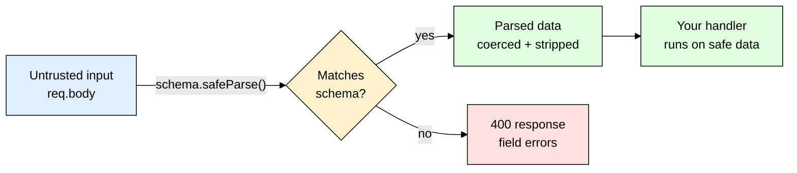
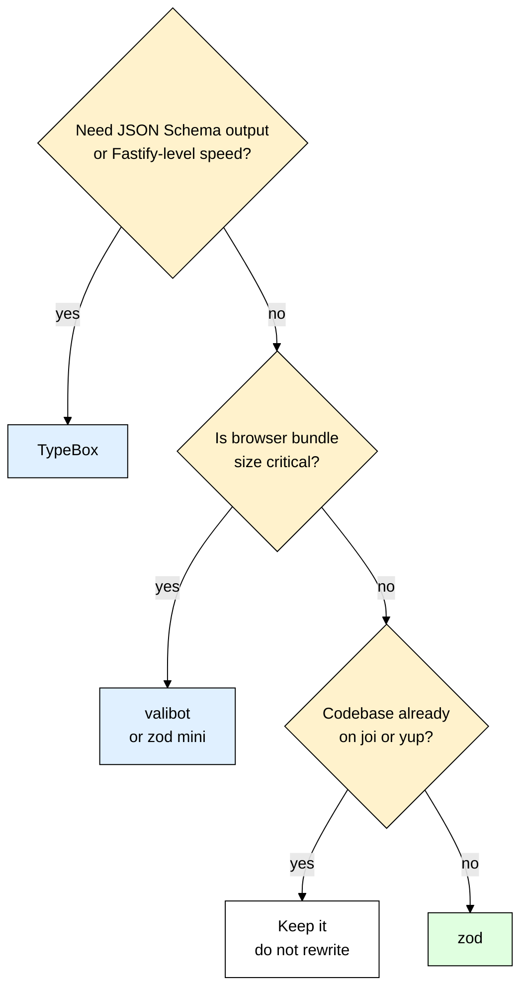

# zod — Never Trust req.body Again

> **Scope:** The `zod` npm package for runtime validation and static typing of untrusted input in Node.js/Express APIs — schemas, `parse`/`safeParse`, `z.infer`, a reusable validation middleware, and env-var validation at boot.
> **Level:** Beginner + practical. TypeScript helps but is not required — zod works fine in plain JavaScript.
> **New to Express?** Read [[express]] first — most examples here are middleware.

---

## 1. ELI5: What is zod?

You built a signup route. It works when *you* test it. Then a real request arrives:

```json
{ "email": 42, "age": "twenty", "role": "admin" }
```

Your handler writes all of that into MongoDB. Now you have a user whose email is a number, whose age crashes every `age + 1` you ever write, and who quietly promoted themselves to admin because you passed `req.body` straight into `User.create()`. None of this is a TypeScript problem — TypeScript disappeared at build time. At runtime `req.body` is just untyped garbage arriving over the wire.

Think of zod as the **bouncer with the guest list at the door of your API**. You write the guest list once — "email must be a real email, age must be a positive integer, `role` is not on this list at all." Everyone walks past the bouncer, and anyone not on the list is turned away with a specific reason. The part beginners miss: the bouncer also **hands you a cleaned-up guest** — extra items confiscated, the string `"25"` from a query param turned into the number `25`, missing optional fields filled in with defaults. What reaches your handler is not the raw request; it is the validated, normalized version of it.

> **Type:** npm package — runtime schema validation with first-class TypeScript inference
> **Core promise:** Declare the shape of your data **once**, and get both a runtime validator and a static TypeScript type out of that single declaration — they can never drift apart.



---

## 2. Why Does zod Exist? (The Problem It Solves)

Here is validation when you hand-roll it — real code from real beginner projects:

```js
app.post("/signup", async (req, res) => {
  const { email, password, age } = req.body;
  if (!email) return res.status(400).send("email required");
  if (typeof email !== "string") return res.status(400).send("email must be a string");
  if (!email.includes("@")) return res.status(400).send("email invalid");
  if (password.length < 8) return res.status(400).send("password too short"); // crashes if undefined
  if (age !== undefined && (typeof age !== "number" || age < 0)) return res.status(400).send("bad age");
  // ...you never checked `role`, so the attacker's "admin" sails through
  await User.create(req.body); // ← and here you save the RAW body anyway
});
```

Five problems live in that block. It is ten lines for three fields, so nobody writes it for twenty. Every route reimplements it slightly differently, so your error format is inconsistent. It returns one error at a time, so the frontend plays twenty questions. It validates `email` and then saves `req.body`, so the checks protected nothing. And on TypeScript you *also* wrote an `interface SignupBody` somewhere that this if-block knows nothing about.

| The hand-rolled way | With zod |
|---|---|
| Validation logic scattered across every route handler | One schema object, defined once, importable anywhere |
| Returns the **first** error only | Returns **every** failing field in one response — the UI highlights all of them at once |
| TS `interface` and runtime checks are written separately and silently drift | `z.infer<typeof schema>` derives the type **from** the validator — drift is structurally impossible |
| `typeof x === "string"` says nothing about *contents* | `.email()`, `.uuid()`, `.min()`, `.regex()` — semantic constraints, not just type tags |
| You still pass raw `req.body` to the DB → mass-assignment bugs | `parse()` returns a **new** object with unknown keys stripped out |
| Query params arrive as strings and you `Number()` them by hand, half the time | `z.coerce.number()` converts and validates in one step |

---

## 3. Installing & Basic Usage

```bash
npm install zod
```

zod ships its own TypeScript types — there is no `@types/zod`, and you should not install one. Everything below targets **zod v4**, which `npm install zod` has resolved to since the 4.0 release in July 2025; the v3 differences are in section 10.

```js
import { z } from "zod";

// Declare the shape ONCE. A schema is a plain value — export it, import it, compose it.
const signupSchema = z.object({
  email: z.email(),                             // v4 top-level format helper
  password: z.string().min(8),                  // constraints chain onto the base type
  age: z.number().int().positive().optional(),  // optional = the key may be absent
});

const user = signupSchema.parse({ email: "a@b.com", password: "hunter2hunter2" }); // throws if invalid
console.log(user); // { email: "a@b.com", password: "hunter2hunter2" }  ← no age, no junk keys
```

### CommonJS version

```js
const { z } = require("zod"); // same API — zod ships both ESM and CJS builds
const signupSchema = z.object({ email: z.email(), password: z.string().min(8) });
module.exports = { signupSchema };
```

### Express example

```js
import express from "express";
const app = express();
app.use(express.json()); // without this req.body is undefined and every schema fails

app.post("/signup", async (req, res) => {
  const result = signupSchema.safeParse(req.body); // safeParse never throws
  // issues is an ARRAY — every failing field, not just the first
  if (!result.success) return res.status(400).json({ errors: result.error.issues });
  // result.data is a NEW object: only the declared keys, correctly typed
  const user = await User.create(result.data);
  res.status(201).json({ id: user.id });
});
```

That's the entire mental model — define a schema, run untrusted input through `safeParse`, bail out with a 400 if it fails, and from then on work with `result.data` instead of `req.body`. Everything else in this file is variations on those four lines.

---

## 4. Building Schemas — The Vocabulary You Actually Need

Every schema starts with a base type, then you chain constraints. Each `.method()` returns a **new** schema, so nothing mutates in place.

```js
z.string().min(3).max(20)         // length bounds
z.string().trim().toLowerCase()   // transforms applied during parsing
z.string().regex(/^[a-z0-9_]+$/)  // custom pattern
z.number().int().positive()       // whole number greater than 0
z.date()                          // an actual Date INSTANCE, not a date string
z.literal("admin")                // exactly this value
z.email()                         // v4 format helpers are top-level; v3: z.string().email()
z.url()                           // v3: z.string().url()
z.uuid()                          // v3: z.string().uuid()
z.iso.datetime()                  // ISO 8601 string — v3: z.string().datetime()
// Custom messages attach to whichever constraint failed — your users read these
const passwordSchema = z.string({ error: "Password is required" }) // fires when missing or not a string
  .min(8, { error: "Password must be at least 8 characters" })
  .regex(/[0-9]/, { error: "Password must contain a number" });

// Objects and arrays nest because a schema is just a value
const addressSchema = z.object({ city: z.string().min(1), zip: z.string().regex(/^\d{5}$/) });
const userSchema = z.object({
  emails: z.array(z.email()).min(1).max(5), // .min/.max here constrain the ARRAY, not the strings
  address: addressSchema,
});
```

### optional vs nullable vs default

These get mixed up constantly, and the difference is exactly what JSON can express — the key is absent, or present-but-null:

| Modifier | Accepts | Output type | Use when |
|---|---|---|---|
| `.optional()` | key missing, or `undefined` | `T \| undefined` | The client may simply not send the field |
| `.nullable()` | explicit `null` (key must exist) | `T \| null` | The field exists but is deliberately empty — a cleared value |
| `.nullish()` | both `undefined` and `null` | `T \| null \| undefined` | You accept either and normalize later |
| **`.default(v)`** | key missing/`undefined` → becomes `v` | **`T`, never undefined** | **You want a guaranteed value downstream** |
| `.catch(v)` | any parse failure → becomes `v` | `T` | Non-critical fields where garbage should not 400 |

`.default()` is the one that removes code: with `.optional()` every consumer has to handle `undefined`; with `.default()` nobody does.

### Enums and unions

```js
const roleSchema = z.enum(["user", "editor", "admin"]); // also infers the literal union type
const idSchema = z.union([z.uuid(), z.number().int()]); // matches ANY branch

// A DISCRIMINATED union — when a shared literal key picks the branch
const eventSchema = z.discriminatedUnion("type", [
  z.object({ type: z.literal("click"), x: z.number(), y: z.number() }),
  z.object({ type: z.literal("keypress"), key: z.string() }),
]);
```

Prefer `z.discriminatedUnion` whenever the objects share a literal tag. A plain `z.union` tries every branch and on failure reports errors from *all* of them — an unreadable wall of text — while a discriminated union reads the tag first and reports only the branch you actually meant.

### z.coerce — the query-param trap

**Everything in `req.query` and `req.params` is a string.** Always. `?page=2` gives `"2"`, not `2`. So this schema fails 100% of the time, and beginners lose an hour to it:

```js
const bad = z.object({ page: z.number() }); // ❌ never matches — req.query.page is the STRING "2"
// ✅ z.coerce converts first, then the numeric rules run on the result
const paginationSchema = z.object({
  page: z.coerce.number().int().positive().default(1),
  limit: z.coerce.number().int().min(1).max(100).default(20), // cap it, or a client asks for 1e9 rows
  createdAfter: z.coerce.date().optional(),                   // "2026-01-01" → a real Date instance
});
paginationSchema.parse({ page: "3" }); // → { page: 3, limit: 20 }
```

> ⚠️ **`z.coerce.boolean()` is a trap.** It runs JavaScript's `Boolean()`, and `Boolean("false")` is `true` — so is `Boolean("0")`. Never use it on query strings. Use `z.enum(["true", "false"]).transform((v) => v === "true")` instead.

---

## 5. parse vs safeParse

Two ways to run a schema. The choice is about **who handles the failure**.

```js
try {
  const data = schema.parse(input); // returns data, or THROWS a ZodError
} catch (err) { /* err is a ZodError */ }
const result = schema.safeParse(input); // never throws
if (result.success) result.data; // typed as the schema's output
else result.error;               // a ZodError
```

| Use `parse()` when | Use `safeParse()` when |
|---|---|
| Failure is a **bug**, not a user mistake — config, env vars, data you wrote yourself | Failure is **expected** — anything from a client, a webhook, a third-party API |
| You want the process to crash loudly at boot | You need to return a 400 with a helpful message |
| You are already inside a `try/catch` that funnels into error middleware | You want plain control flow with no exceptions |

### What a ZodError actually contains

`error.issues` is an array — one entry per failing field, all of them, in one pass:

```js
z.object({ email: z.email(), age: z.number().int() }).safeParse({ email: "nope", age: 4.5 }).error.issues;
// [ { code: "invalid_format", format: "email", path: ["email"], message: "Invalid email address" },
//   { code: "invalid_type",   path: ["age"],   message: "Invalid input: expected int, received number" } ]
```

`path` is an array because errors get deep — a bad zip inside the second address is `path: ["addresses", 1, "zip"]`.

### Flattening into a clean API error response

Raw `issues` is too noisy for a frontend — collapse it into `{ field: message }`, one line per input box:

```js
export function formatZodError(error) {
  const fields = {};
  for (const issue of error.issues) {
    // join() turns ["addresses", 1, "zip"] into "addresses.1.zip" — how form libraries name inputs
    const key = issue.path.join(".") || "_root";
    if (!(key in fields)) fields[key] = issue.message; // keep the FIRST error per field only
  }
  return fields;
}

// zod v4 also ships built-ins you can use instead:
z.flattenError(error);  // { formErrors: string[], fieldErrors: { email: ["Invalid email address"] } } — one level deep only
z.treeifyError(error);  // nested tree mirroring the object shape — good for deep forms
z.prettifyError(error); // multi-line human-readable string — for LOGS, not API responses
```

---

## 6. Schema-First Thinking — Types for Free with z.infer

The idea that makes zod click: **one declaration does two jobs at two different times.** At runtime `schema.parse(input)` checks real values off the network. At compile time `z.infer<typeof schema>` produces the TypeScript type describing exactly what `parse` returns.

```ts
const userSchema = z.object({
  id: z.uuid(),
  email: z.email(),
  password: z.string().min(8),
  age: z.number().int().optional(),
  role: z.enum(["user", "admin"]).default("user"),
});

type User = z.infer<typeof userSchema>;
// { id: string; email: string; password: string; age?: number | undefined; role: "user" | "admin" }
```

Note `typeof userSchema` — you want the type of the schema *value*, and `z.infer` unwraps what that schema produces. Contrast that with hand-writing an `interface CreatePostBody` next to hand-written `if` checks: TypeScript cannot tell you the two disagree, because it has no idea what shape the JSON hitting your server actually has. You *asserted* it — and an assertion is a promise you made, not a fact anyone checked. Derive the type from the validator and the drift is gone permanently: add a field and every consumer updates, with compile errors pointing at each place that needs attention.

**Rule of thumb:** any time you would write a TypeScript `interface` for something that crosses a network boundary — request bodies, API responses you `fetch`, webhook payloads, environment variables — write a zod schema instead and infer the interface from it.

Every schema actually has **two** types, and the difference appears the moment you use `.default()`, `.coerce`, or `.transform()`:

```ts
const paginationSchema = z.object({ page: z.coerce.number().default(1) });
type PageIn = z.input<typeof paginationSchema>;   // what you may SEND → { page?: unknown }
type PageOut = z.output<typeof paginationSchema>; // what you GET BACK → { page: number }
// z.infer is an alias for z.output — the useful one 95% of the time
```

### Reusing one schema for create vs update vs response

Real APIs need several near-identical shapes. Never copy-paste them — derive them:

```ts
const createUserSchema = userSchema.omit({ id: true });       // POST — the server generates the id
const updateUserSchema = createUserSchema.partial();          // PATCH — same rules, all optional
const publicUserSchema = userSchema.omit({ password: true }); // response — secrets never leave
const loginSchema = userSchema.pick({ email: true, password: true });
const adminSchema = userSchema.extend({ permissions: z.array(z.string()) });

type CreateUserDTO = z.infer<typeof createUserSchema>;
```

Five request/response shapes, one source of truth. Change `password` to `.min(12)` and all of them tighten at once.

---

## 7. Cross-Field Rules — .refine, .superRefine, .transform

Field-level constraints cannot express "password must equal confirmPassword" — that rule needs two fields at once. `.refine()` runs on the **whole parsed object**:

```js
const registerSchema = z
  .object({ password: z.string().min(8), confirmPassword: z.string() })
  .refine((data) => data.password === data.confirmPassword, {
    error: "Passwords do not match",
    path: ["confirmPassword"], // attach to a FIELD — otherwise it lands on the root, invisible to the UI
  });
```

Without `path` the issue lands on the root, `formatZodError` files it under `_root`, and the user sees a form with no red box anywhere. `.refine()` reports one issue. For several conditional issues, `.superRefine()` hands you a context object:

```js
const bookingSchema = z
  .object({ startDate: z.coerce.date(), endDate: z.coerce.date(), guests: z.number().int().positive(), roomType: z.enum(["single", "double"]) })
  .superRefine((data, ctx) => {
    if (data.endDate <= data.startDate) {
      ctx.addIssue({ code: "custom", message: "End date must be after start date", path: ["endDate"] });
    }
    // a rule that applies to one variant only — impossible to express field-by-field
    if (data.roomType === "single" && data.guests > 1) {
      ctx.addIssue({ code: "custom", message: "A single room fits one guest", path: ["guests"] });
    }
  });
```

Refinements can be **async**, which is how people check the database — but then you must use the async parser:

```js
const emailSchema = z.email().refine(
  async (email) => !(await User.exists({ email })), // hits the database on every parse
  { error: "Email already registered" },
);
await emailSchema.safeParseAsync(input); // ✅ async refinements need the async parser
// emailSchema.parse(input);             // ❌ throws $ZodAsyncError: "Encountered Promise during synchronous parse"
```

> ⚠️ An async refinement runs a DB query on unauthenticated input and makes email-existence probing trivial. For uniqueness, a unique index plus a caught duplicate-key error is usually the safer design.

`.transform()` reshapes data *after* validation, so downstream code gets exactly the form it wants:

```js
const tagsSchema = z.string()
  .transform((s) => s.split(",").map((t) => t.trim()).filter(Boolean)) // "a, b,c" → ["a","b","c"]
  .pipe(z.array(z.string().min(1)).max(10)); // .pipe() re-validates the TRANSFORMED value
```

Order matters: validate → transform → validate again with `.pipe()` if the new shape has its own rules.

---

## 8. The Reusable Express Validation Middleware

This is the pattern worth memorizing. One higher-order middleware, used on every route, buys you consistent 400 responses and handlers with zero defensive checks.

```js
// middleware/validate.js
export const validate = (schemas) => (req, res, next) => {
  const errors = {};
  for (const source of ["body", "query", "params"]) {
    const schema = schemas[source];
    if (!schema) continue; // only validate what you declared
    const result = schema.safeParse(req[source]);
    if (!result.success) {
      for (const issue of result.error.issues) {
        // prefix with the source so "body.email" and "query.email" never collide
        const key = [source, ...issue.path].join(".");
        if (!(key in errors)) errors[key] = issue.message;
      }
      continue; // keep going so the client gets body AND query errors in one response
    }
    if (source === "body") {
      req.body = result.data; // safe: Express leaves req.body writable
    } else {
      // NOTE: Express 5 defines req.query as a GETTER — assigning to it throws a TypeError.
      // Park parsed query/params on our own property instead.
      req.validated = { ...req.validated, [source]: result.data };
    }
  }
  if (Object.keys(errors).length > 0) {
    return res.status(400).json({ error: "ValidationError", fields: errors });
  }
  next();
};
```

```js
// Schemas live at module scope — never rebuild them per request
const createPostSchema = z.object({ title: z.string().min(1).max(120), tags: z.array(z.string()).max(5).default([]) });
const listQuerySchema = z.object({ page: z.coerce.number().int().positive().default(1) });
app.post("/posts", validate({ body: createPostSchema }), async (req, res) => {
  // req.body is GUARANTEED to match the schema — no defensive checks belong here
  res.status(201).json(await Post.create(req.body));
});

app.get("/posts", validate({ query: listQuerySchema }), async (req, res) => {
  const { page } = req.validated.query; // a real number, default already applied
  res.json(await Post.find().skip((page - 1) * 20).limit(20));
});
```

### Stripping unknown keys, and why it kills mass-assignment bugs

By default `z.object()` **silently removes** keys you did not declare — a single behaviour that doubles as a security feature:

```js
const updateProfileSchema = z.object({ name: z.string(), bio: z.string() });
updateProfileSchema.parse({ name: "Ada", bio: "hi", role: "admin", isVerified: true });
// → { name: "Ada", bio: "hi" }   ← role and isVerified are GONE
```

Now `await User.findByIdAndUpdate(id, req.body)` is safe: the middleware replaced `req.body` with the parsed object, so `role` is no longer in it. In the raw version the attacker's `role: "admin"` goes straight into your `$set`. **This is why reassigning `req.body` matters** — validating and then using the original object gives you all of the work and none of the protection.

| Mode | Unknown keys | When |
|---|---|---|
| **`z.object({...})`** (default) | **silently stripped** | **Almost always — public request bodies** |
| `z.strictObject({...})` | rejected with an `unrecognized_keys` issue | Internal APIs and config, where a typo like `limt: 50` should be loud rather than silently ignored |
| `z.looseObject({...})` | passed through untouched | Proxying payloads you must forward intact |

---

## 9. TypeScript Version

The same middleware, properly typed, plus the declaration merge that makes `req.validated` legal:

```ts
// middleware/validate.ts
import type { Request, Response, NextFunction, RequestHandler } from "express";
import type { ZodType } from "zod";

// Teach Express about the property we attach, so handlers get autocomplete instead of an error
declare global {
  namespace Express {
    interface Request { validated?: { query?: unknown; params?: unknown } }
  }
}
// ZodType is the base class every schema extends — accepts any schema shape
interface Schemas { body?: ZodType; query?: ZodType; params?: ZodType }

export const validate = (schemas: Schemas): RequestHandler =>
  (req: Request, res: Response, next: NextFunction): void => {
    const errors: Record<string, string> = {};
    for (const source of ["body", "query", "params"] as const) {
      const schema = schemas[source]; // narrowed to ZodType | undefined by the const tuple
      if (!schema) continue;
      const result = schema.safeParse(req[source]);
      if (!result.success) {
        for (const issue of result.error.issues) {
          const key = [source, ...issue.path].join(".");
          if (!(key in errors)) errors[key] = issue.message;
        }
      } else if (source === "body") req.body = result.data;
      else req.validated = { ...req.validated, [source]: result.data };
    }
    if (Object.keys(errors).length > 0) {
      res.status(400).json({ error: "ValidationError", fields: errors }); // never `return res.json()`
      return; // RequestHandler returns void
    }
    next();
  };
```

To get a **typed** `req.body` inside the handler, type the request at the call site:

```ts
import { z } from "zod";
const createPostSchema = z.object({ title: z.string().min(1).max(120), tags: z.array(z.string()).max(5).default([]) });
type CreatePostBody = z.infer<typeof createPostSchema>;

// Request<Params, ResBody, ReqBody, Query> — the 3rd slot types req.body
app.post("/posts", validate({ body: createPostSchema }),
  async (req: Request<unknown, unknown, CreatePostBody>, res: Response) => {
    req.body.title;       // string — autocompletes
    req.body.tags.length; // string[] — .default([]) means it is never undefined here
    res.status(201).json(await Post.create(req.body));
  });
```

The important part: `CreatePostBody` was never hand-written. It is the schema, read backwards.

---

## 10. Production Setup

### Validate environment variables at boot

The best-value twenty lines of zod in any codebase. A missing `JWT_SECRET` should crash the process at startup with a clear message — not throw `undefined` at your token signer during a real user's login at 3am.

```js
// config/env.js
import "dotenv/config"; // loads .env into process.env — see [[dotenv]]
import { z } from "zod";

const envSchema = z.object({
  NODE_ENV: z.enum(["development", "test", "production"]).default("development"),
  PORT: z.coerce.number().int().positive().default(3000), // env vars are ALWAYS strings — coerce
  MONGODB_URI: z.string().startsWith("mongodb"),          // catches a pasted Postgres URL instantly
  JWT_SECRET: z.string().min(32, { error: "JWT_SECRET must be at least 32 characters" }),
  REDIS_URL: z.url().optional(),                          // a genuinely optional feature
});

const parsed = envSchema.safeParse(process.env);
if (!parsed.success) {
  // prettifyError gives a readable multi-line dump — exactly right for a crash log
  console.error("Invalid environment variables:\n" + z.prettifyError(parsed.error));
  process.exit(1); // fail fast and LOUD, before a single request is served
}
export const env = parsed.data; // import { env } everywhere instead of touching process.env
```

Two wins beyond the crash: `env.PORT` is a real `number`, and in TypeScript `env` is fully typed, so a `process.env.MONGO_URI` typo becomes a compile error instead of a 3am `undefined`.

### Where schemas live

Keep schemas beside the resource they describe — `src/modules/users/user.schema.js` next to `user.routes.js` and `user.model.js` — and export the inferred types from that same module. A zod schema and a [[mongoose]] schema are **not** the same thing and should not be merged: zod guards the boundary (what a client is *allowed to send*), Mongoose describes storage (indexes, refs, hooks). The overlap is real but the rules differ — a client may not send `role`, yet `role` certainly exists in the database. The same split applies with [[prisma]], whose generated types describe rows, not requests.

Also remember the body is parsed before zod ever sees it. `express.json()` already caps payloads at `100kb` and answers anything larger with a 413, so the floor exists — but set the limit explicitly to what your largest genuine request needs, e.g. `app.use(express.json({ limit: "16kb" }))`, because a schema cannot reject bytes that were buffered and parsed before it ran.

### zod v3 vs v4 — the translation key

| v3 | v4 (current) |
|---|---|
| `z.string().email()`, `.url()`, `.uuid()`, `.datetime()` | `z.email()`, `z.url()`, `z.uuid()`, `z.iso.datetime()` — old forms work but are deprecated |
| `{ message: "..." }`, plus `required_error` / `invalid_type_error` | one unified `{ error: "..." }`; `message` is still accepted |
| `error.flatten()`, `error.format()` | top-level `z.flattenError()`, `z.treeifyError()`, `z.prettifyError()` |
| `z.object().strict()` / `.passthrough()` | `z.strictObject()` / `z.looseObject()` (methods still work) |
| `.merge()` for objects, `z.nativeEnum(E)` for enums | `.extend()`, and `z.enum(E)` handles both cases |

Both versions share the same core mental model, so v3 code mostly runs unchanged on v4. If you are reading a 2023 tutorial, that table is your decoder ring.

---

## 11. Common Gotchas & Best Practices

| Gotcha | Fix |
|---|---|
| **Validating, then using `req.body` anyway** | The single most common zod mistake. `parse()` returns a **new** object — ignore the return value and you get zero coercion, zero defaults, zero stripping, so mass-assignment is still wide open. Assign `req.body = result.data`, or use `result.data` directly. |
| **`z.number()` on query params never matches** | `req.query` values are always strings — `?page=2` is `"2"`. Use `z.coerce.number()`. Same for `req.params` and `process.env`. |
| **`z.coerce.boolean()` treats `"false"` as `true`** | It calls `Boolean()`, and every non-empty string is truthy. Use `z.enum(["true","false"]).transform(v => v === "true")` for query flags. |
| **Assigning `req.query` throws in Express 5** | `req.query` is a getter with no setter in Express 5, so `req.query = parsed` raises a `TypeError`. Store the parsed value on your own property, e.g. `req.validated.query`. |
| **`.refine()` errors vanish in the UI** | An object-level refine without `path` produces an issue with an empty path, so field-keyed error maps drop it. Always pass `{ path: ["confirmPassword"] }`. |
| **`schema.parse()` in an async handler with no try/catch** | In Express 4 a rejected promise never reaches your error middleware — the request hangs until timeout. Use `safeParse`, or the `validate` middleware, or Express 5 which forwards async rejections. |
| **`z.string()` happily accepts `""`** | An empty string is a valid string. Required text fields need `z.string().min(1)`, or a blank form submits successfully. |
| **`z.date()` rejects your JSON date** | JSON has no date type, so `"2026-01-01"` is a string while `z.date()` demands a `Date` instance. Use `z.iso.datetime()` to keep it a string, or `z.coerce.date()` to convert. |

---

## 12. Alternatives — When zod Isn't the Best Fit

| Library | What it is | Best for |
|---|---|---|
| **zod** | TypeScript-first schema validation with static inference. Chainable API, huge ecosystem (React Hook Form, tRPC, OpenAPI generators). | **The default for any Node/TypeScript backend in 2026.** Pick this unless you have a specific reason not to. |
| **joi** | The veteran, from the hapi ecosystem. Very rich validator set, mature, plain-JS oriented; type inference is bolted on and weak. | Legacy JavaScript codebases, or teams already deep in hapi. Poor fit if you want types from your schemas. |
| **yup** | Schema validation born on the frontend, closely tied to Formik. Older, smaller, weaker inference, async-by-default API. | Existing Formik forms. Rarely the right pick for a new backend. |
| **express-validator** | A middleware-shaped wrapper over `validator.js` — chains attached directly to routes, no reusable schema object. | Quick validation bolted onto an existing Express app when you do not want a schema layer. You get no types and no reusable shape. |
| **valibot** | Same idea as zod but a modular functional API, so bundlers tree-shake unused validators — much smaller in the browser. | Frontend bundles and edge/serverless functions where kilobytes matter. zod's own `zod/mini` subpath now targets this too. |
| **TypeBox** | Builds real **JSON Schema** objects that also infer TS types, and compiles them into very fast validators with its own `TypeCompiler` (or hands them to AJV). | High-throughput APIs, Fastify (which validates with JSON Schema natively), and anywhere you must publish OpenAPI as the contract. |



**Rule of thumb:** for a normal Express + MongoDB API, reach for zod and stop shopping. The tie-breaker against joi and yup is not features — it is that zod's schema *is* your TypeScript type, and theirs is not.

---

## 13. Interview Questions

**Q: TypeScript already checks types. Why do you still need zod?**
A: TypeScript is erased at build time — it checks the code you wrote, not the JSON that arrives at runtime. When you write `req.body as SignupBody` you have made an unverified promise, and a buggy or malicious client can break it freely. zod performs the check at runtime, and `z.infer` derives the TypeScript type from that same check, so the compile-time belief and the runtime reality cannot diverge.

**Q: What is the difference between `parse` and `safeParse`, and when do you use each?**
A: `parse` returns the validated data or throws a `ZodError`; `safeParse` never throws and returns `{ success: true, data }` or `{ success: false, error }`. Use `safeParse` for anything from a client, because invalid input is expected and you want to answer with a 400 rather than an exception. Use `parse` for data you control, like environment variables at boot, where failure is a bug and crashing loudly is correct.

**Q: What happens to keys you did not declare in a `z.object()`?**
A: They are silently stripped — `parse` returns a new object containing only the declared keys. That is the defence against mass assignment: passing the parsed object to `User.findByIdAndUpdate` means an injected `role: "admin"` never reaches the database. It only protects you if you actually use the returned object; validating and then saving the original `req.body` gives you nothing. Use `z.strictObject()` when you would rather reject unknown keys loudly.

**Q: Why does `z.object({ page: z.number() })` always fail on `req.query`?**
A: Query strings, route params, and environment variables are always strings — `?page=2` gives `"2"`, not `2` — so `z.number()` correctly rejects it. The fix is `z.coerce.number()`, which runs `Number()` first and then applies the numeric constraints. Watch out for `z.coerce.boolean()`, which uses `Boolean()` and therefore turns the string `"false"` into `true`.

**Q: How do you validate that two fields agree, like password and confirmPassword?**
A: Field-level rules cannot see other fields, so you use `.refine()` on the object schema, which receives the whole parsed object. Pass `path: ["confirmPassword"]` so the resulting issue attaches to a specific field rather than the root — otherwise the frontend has no input to highlight. For several conditional rules, `.superRefine()` gives you a `ctx` you can call `ctx.addIssue()` on as many times as needed.

**Q: Where does zod validation belong in a production Express app?**
A: In a single higher-order `validate(schemas)` middleware applied per route, so every endpoint returns the same 400 shape and handlers contain zero defensive checks. It should `safeParse` body, query, and params, collect all issues into a `{ field: message }` map, and replace `req.body` with the parsed data. Separately, validate `process.env` with `parse` at startup so misconfiguration crashes the process before it serves traffic.

---

## 14. Quick Cheat Sheet

```js
// npm install zod  — v4 by default, and no @types package exists or is needed
import { z } from "zod";

const schema = z.object({
  email: z.email(),                               // v4 top-level format helper
  role: z.enum(["user", "admin"]).default("user"),
  address: z.object({ city: z.string().min(1) }), // nesting is just composition
});

const data = schema.parse(input);       // throws ZodError on failure
const result = schema.safeParse(input); // { success, data } | { success, error }
await schema.safeParseAsync(input);     // required if any refinement is async

// Query params and env vars are ALWAYS strings
z.coerce.number().int().positive().default(1);
z.enum(["true", "false"]).transform((v) => v === "true"); // NOT z.coerce.boolean()

// Cross-field rule — always set path
schema.refine((d) => d.password === d.confirmPassword, {
  error: "Passwords do not match",
  path: ["confirmPassword"], // ✅ required, or the error lands on the root
});

z.flattenError(err);  // { formErrors, fieldErrors }
z.prettifyError(err); // human-readable string, for logs

z.object({});       // strip unknown keys  ✅ default, use for request bodies
z.strictObject({}); // reject unknown keys ✅ use for config
z.looseObject({});  // keep unknown keys — only when proxying
```

```ts
// Types for free, derived DTOs, and the Express wiring
type User = z.infer<typeof userSchema>;
const createSchema = userSchema.omit({ id: true });
const updateSchema = createSchema.partial();
app.post("/posts", validate({ body: createSchema }), handler);
```

**Mental model to remember:**
> zod is one declaration pulling double duty — a runtime bouncer that rejects bad input and hands your handler a cleaned, coerced, stripped copy, plus a TypeScript type derived from that same declaration so validation and types can never drift. `safeParse` everything crossing a network boundary, `parse` your `process.env` at boot so misconfiguration crashes loudly, and always use the returned object instead of the raw `req.body`. Pair it with [[express]] middleware and [[dotenv]] for config loading, and keep it separate from your [[mongoose]] or [[prisma]] models — one guards the door, the other describes the warehouse.
