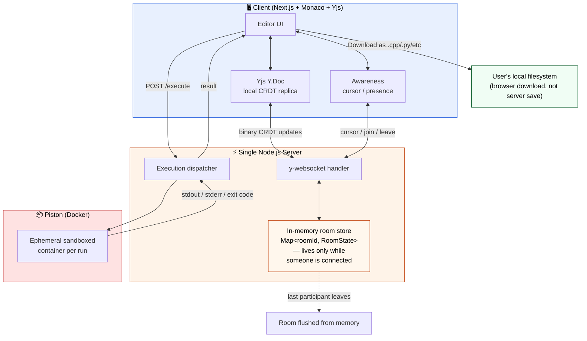
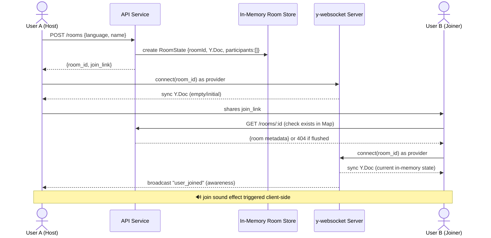
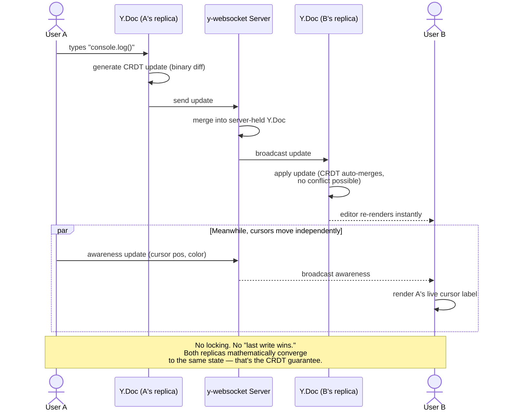
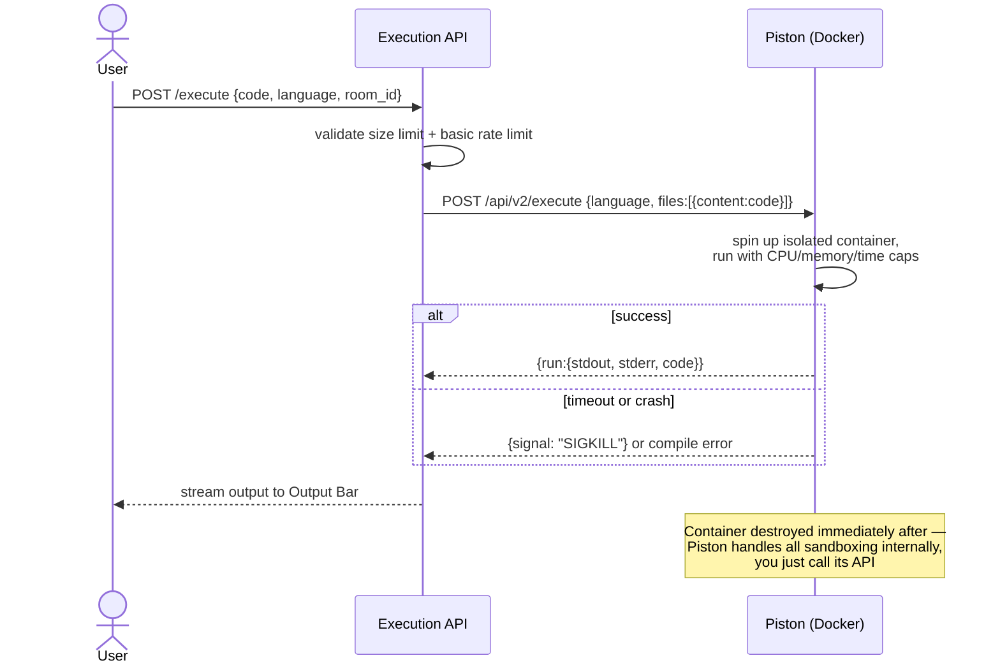
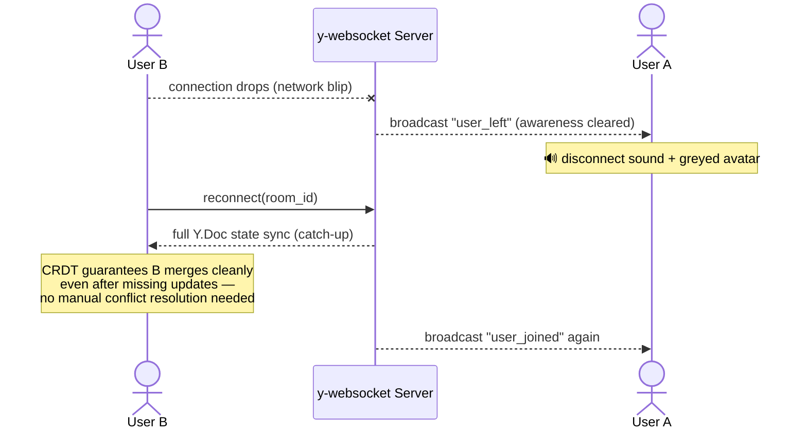
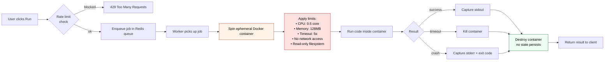
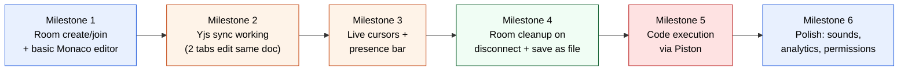

# CodeSync — Collaborative Code Editor
### Full System Design (HLD + LLD) — Portfolio Reference Guide

> Goal: a real-time collaborative code editor with live cursors, presence, and sandboxed code execution — built to demonstrate distributed-systems thinking to recruiters, not just CRUD skills.

---

## Table of Contents
1. [Critique of Your Original Sketch](#1-critique-of-your-original-sketch)
2. [Recommended Tech Stack](#2-recommended-tech-stack)
3. [High-Level Design](#3-high-level-design)
4. [Core Flows (Sequence Diagrams)](#4-core-flows-sequence-diagrams)
5. [Low-Level Design](#5-low-level-design)
6. [Code Execution Sandbox](#6-code-execution-sandbox-the-hard-part)
7. [Scaling Strategy](#7-scaling-strategy)
8. [Extra Features (Prioritized)](#8-extra-features-prioritized)
9. [Learning Roadmap](#9-learning-roadmap)
10. [Build Order / Milestones](#10-build-order--milestones)

---

## 1. Critique of Your Original Sketch

### What you got right (genuinely good instincts)
- **Room-based model** (Create Room / Join Room / Fill Room ID / Join via link) — correct mental model for isolating collaboration sessions.
- **You identified CRDT as the sync mechanism** and even noted "concurrent, works each other" — that's the core insight most beginners miss entirely.
- **Presence UX details** — random color assignment, short-name avatars, join/disconnect sound effects. These are small but recruiters notice polish like this in a demo.
- **Analytics hook** ("how much live code written") — shows product thinking beyond just "make it work."
- **Link-based join with shortener** — good UX instinct, reduces friction vs manual Room ID entry.

### Mistakes / gaps (in order of severity)

| Issue | Why it matters |
|---|---|
| **No code execution architecture** | You want "run code in browser" — this is the single most dangerous and most impressive part of the system. Arbitrary code execution needs sandboxing, resource limits, and timeouts, or it's a security hole. This wasn't in the sketch at all. |
| **No persistence layer distinction** | "Save that file" is ambiguous — save *where*? Locally (browser) disappears on refresh; you need server-side persistence (Postgres) with versioning for this to be portfolio-credible. |
| **CRDT box floats disconnected from data flow** | Your diagram shows CRDT near Output Bar but doesn't show *which* data structure syncs (the document text) vs what's ephemeral (cursor position). Yjs treats these very differently — `Y.Text` (persistent, synced) vs `Awareness` (ephemeral, not persisted). |
| **No reconnection / conflict handling** | What happens when a user's WebSocket drops mid-edit and reconnects? Your sketch has "User Discover → sound effect" but no state reconciliation logic. |
| **No auth / access control** | Room IDs are guessable strings — anyone with a link can join and edit. Fine for MVP, but you should at least *design* for view-only vs edit permissions to show you thought about it. |
| **No horizontal scaling consideration** | A single WebSocket server caps your "impressive" ceiling. Even a paragraph on Redis pub/sub scaling in your README shows senior-level thinking. |

### Bottom line
Your sketch is a solid **product flow diagram**, not yet a **system design**. The gap between the two — data models, API contracts, sync protocol, sandboxing, scaling — is exactly what separates "I built a project" from "I understand distributed systems," which is what recruiters are actually screening for.

---

## 2. Recommended Tech Stack

Since you're open to recommendations, here's what optimizes for **portfolio impressiveness + your existing skill overlap + reasonable build time**:

| Layer | Choice | Why |
|---|---|---|
| Frontend framework | **Next.js** | Matches your stack; SSR for landing/room pages, CSR for the editor itself |
| Code editor component | **Monaco Editor** | The actual VS Code editor engine — instant credibility, syntax highlighting, IntelliSense for free |
| CRDT sync | **Yjs** + `y-monaco` binding | Industry-standard CRDT lib; `y-monaco` gives you cursor + text sync out of the box |
| Real-time transport | **y-websocket** (Yjs's own protocol) — NOT Socket.IO | Yjs has its own optimized binary sync protocol. Socket.IO is great for chat/notifications but is the *wrong tool* for CRDT sync — don't mix them for the same channel |
| Presence / live cursors | **Yjs Awareness API** | Built for exactly this — ephemeral state (cursor pos, user color, name) that never touches persistent storage |
| Backend API | **Node.js + Express** | Room creation + execution job dispatch only — no auth, no CRUD |
| State storage | **In-memory (server RAM)** — `Map<roomId, RoomState>` | No DB needed. Room = live Y.Doc + participant list, held only while at least one person is connected |
| Code execution | **Piston** (open-source, self-hosted via Docker) | See Section 6 — sandboxes 40+ languages out of the box, no Judge0 setup overhead |
| Deployment | Vercel (frontend) + single Railway/Render instance (WS + API + Piston container) | One box is enough at this scale |

> **Key correction to your instinct:** Don't reuse your Socket.IO knowledge here for the *document sync* channel. Use Socket.IO (or plain events) only for secondary things like join/leave toasts and sound-effect triggers if you want. The CRDT document itself should sync over `y-websocket`.

> **Why no database:** rooms are ephemeral by design here — that's a legitimate, intentional architecture choice, not a shortcut. It means zero data-retention concerns, zero auth complexity, and a much smaller attack surface. Worth stating explicitly in your README as a design decision, not an omission — recruiters read "I chose not to add X" very differently from "I forgot X."

---

## 3. High-Level Design



**Read it like this:** everything happens on one server. Two real-time channels leave the browser — the **Yjs document channel** (the actual code text, CRDT-merged) and the **Awareness channel** (ephemeral cursor/presence). Both live in a plain in-memory `Map` on the server, keyed by room ID — no database round-trips for editing. "Save" means the browser downloads the current buffer as a real file (`.cpp`, `.py`, whatever language is selected) via the [File System Access API](https://developer.mozilla.org/en-US/docs/Web/API/File_System_Access_API) or a simple `Blob` download — it never touches your server's disk. When the last participant disconnects, the room's entry is deleted from the `Map` and garbage collected. This is the right level of complexity for what you're building — explain this separation confidently, it's a real architectural choice.

---

## 4. Core Flows (Sequence Diagrams)

### 4.1 Create Room → Join Flow



### 4.2 Live Collaborative Editing (the CRDT core)



### 4.3 Run Code (Sandboxed Execution)



### 4.4 Disconnect / Reconnect Handling



---

## 5. Low-Level Design

### 5.1 Data Model (in-memory, TypeScript shape)

No database — this is the actual server-side state shape, held entirely in RAM:

```typescript
interface Participant {
  userId: string;        // random uuid, generated client-side on join
  name: string;           // short name they typed
  color: string;           // assigned randomly by server on join
  role: "HOST" | "EDITOR" | "VIEWER";
  socketId: string;         // current WS connection id
}

interface RoomState {
  roomId: string;             // short nanoid, e.g. "x7f9k2"
  language: string;            // selected on room creation
  yDoc: Y.Doc;                  // the live CRDT document
  awareness: Awareness;          // Yjs awareness instance (cursors etc.)
  participants: Map<string, Participant>;
  createdAt: number;
}

// The entire "database" of the app:
const rooms = new Map<string, RoomState>();
```

**Room lifecycle:** created on `POST /rooms` → lives in `rooms` Map → **deleted the moment `participants.size` hits 0** (on the last disconnect, after a short grace period of ~30s to survive brief refreshes/reconnects). No cron job, no expiry column — just a `setTimeout` cleanup check on disconnect.

**Saving code:** there is no server-side save. The client calls `Y.Text.toString()` on the current buffer and triggers a browser download (`Blob` + `<a download>`, or the File System Access API) named `main.<ext>` based on the selected language. This is genuinely simpler *and* more honest about what "save" means for a tool with no accounts.

### 5.2 REST API Contract

| Method | Endpoint | Purpose |
|---|---|---|
| `POST` | `/api/rooms` | Create room `{language, hostName}` → `{roomId, joinLink}` |
| `GET` | `/api/rooms/:id` | Check room still exists in memory (404 if flushed) |
| `POST` | `/api/execute` | `{roomId, code, language}` → proxies to Piston, returns `{stdout, stderr, exitCode}` directly (no job polling needed — Piston runs are fast enough to await) |

Saving/loading is entirely client-side (browser download/upload of a file) so it needs no API endpoint at all.

### 5.3 Real-Time Event Contract (y-websocket + Awareness)

| Channel | Payload | Persisted? |
|---|---|---|
| `doc-update` | Binary Yjs update (CRDT delta) | ✅ Yes (via periodic snapshot) |
| `awareness-update` | `{userId, name, color, cursorPos, selectionRange}` | ❌ No — memory only |
| `user-joined` (custom, via awareness) | `{userId, name, color}` | ❌ No |
| `user-left` | `{userId}` | ❌ No |

---

## 6. Code Execution Sandbox (the hard part)

This is what will make recruiters stop scrolling. It's also the part with real security risk if done carelessly.



**Non-negotiable rules for this component:**
1. **No network access inside the sandbox** — otherwise someone runs code that calls out to attack other services.
2. **Hard timeout** (e.g. 5–10s) — otherwise someone runs `while(true){}` and exhausts your server.
3. **Memory/CPU caps** via Docker's `--memory` and `--cpus` flags — otherwise one execution starves the whole box.
4. **Ephemeral, single-use containers** — destroy after every run, never reuse a warm container between different users' code.
5. **Read-only root filesystem** — prevents writing malicious files that outlive the container.

**Your call — Piston — is a good one.** [Piston](https://github.com/engineer-man/piston) is purpose-built for exactly this: open source, self-hostable via Docker, supports 40+ languages out of the box, and already implements all five rules above internally (it's what runs code execution for the Engineer Man Discord and several online judges). You send it `{language, version, files: [{content: code}]}` and get back `{stdout, stderr, code}` — all the sandboxing complexity is abstracted away.

**Why this is the right call for your scope:** self-hosting Judge0 requires its own Postgres + Redis + Sidekiq worker setup — exactly the infra you just correctly decided you don't need. Piston runs as a single Docker container with no external dependencies, which matches an ephemeral, no-database app much better. You still get to *explain* container-level sandboxing in interviews (CPU/memory caps, no network, timeouts) — you're just not reinventing it from scratch.

---

## 7. Scaling — Deliberately Out of Scope (and why that's fine)

At this scope (ephemeral rooms, no accounts, in-memory state) a **single server instance is the right answer** — one process handles the WebSocket connections, the in-memory room `Map`, and proxies to Piston. Adding Redis pub/sub or multiple instances here would be solving a problem you don't have, at the cost of real complexity (cross-instance room-state coordination, sticky session config, another moving part to deploy and pay for).

**What to put in your README instead of building it:**

> "This runs on a single server instance, which is sufficient for the expected load. If this needed to scale beyond one instance, the standard pattern is Redis Pub/Sub: each server publishes CRDT doc-updates to a Redis channel keyed by room ID, and all instances subscribe, so users on different servers still see each other's edits in real time — the same pattern used for scaling Socket.IO horizontally."

That one paragraph demonstrates you understand the scaling story *without* you having to build and maintain infrastructure your app doesn't need yet. Recruiters care that you can reason about the tradeoff, not that you over-engineered a toy app.

---

## 8. Extra Features (Prioritized)

**Tier 1 — do these, high impact/effort ratio:**
- Multi-file / tabs support (most real editors aren't single-file)
- View-only vs Editor permission roles (you already modeled this in the schema above)
- Download/export code as file
- Room expiry + auto-cleanup (shows you think about resource hygiene)

**Tier 2 — strong differentiators if time allows:**
- Undo/redo across the session using Yjs's built-in `UndoManager` (in-memory, no DB needed)
- Room analytics dashboard (lines written, active time — you already sketched this! can be computed live from the in-memory Y.Doc, no storage required)
- Syntax-aware AI code assistant panel (ties into your AI agent learning track)

**Tier 3 — nice-to-have, lower priority:**
- Voice chat integration
- GitHub Gist import/export
- Themeable editor (dark/light/custom)

---

## 9. Learning Roadmap

Since you already understand CRDT vs OT conceptually, this roadmap skips theory and goes straight to implementation + production concerns, in build order:

1. **Yjs implementation** — `Y.Doc`, `Y.Text`, shared types, `y-websocket` provider setup, and critically the **Awareness protocol** (separate from doc sync). Build a minimal 2-browser-tab text sync demo before touching Monaco.
2. **Monaco Editor integration** — embedding it in React/Next.js, then wiring `y-monaco` for automatic cursor decoration and text binding. This is mostly configuration, not hard logic.
3. **WebSocket server internals** — write your own minimal `y-websocket` server (or study the reference implementation) so you can *explain* it, not just import it. Also design the in-memory `Map<roomId, RoomState>` and its cleanup-on-disconnect logic.
4. **Docker fundamentals** — containers, resource limits (`--memory`, `--cpus`), `--network none`. You'll need this to self-host Piston and to explain what it's doing under the hood, even though Piston does the heavy lifting for you.
5. **Piston's API** — read its docs, self-host it locally via `docker-compose`, understand its request/response shape and how it manages runtimes per language.
6. **Client-side file handling** — the `Blob` download pattern and/or the File System Access API for the "save as .cpp/.py" flow, plus basic file-upload-to-restore-a-session if you want that later.
7. **Security fundamentals for sandboxing** — resource exhaustion attacks, why `--network none` matters, rate limiting patterns on your `/execute` endpoint so one user can't hammer Piston.
8. **(Optional, conceptual only) Redis Pub/Sub** — you don't need to build this, but understanding *why* it's the standard horizontal-scaling pattern for WebSocket servers is worth 30 minutes of reading so you can speak to it in interviews.

---

## 10. Build Order / Milestones



**Why this order:** get sync working with plain text first (Milestone 2) before adding Monaco's complexity, so you can debug CRDT behavior in isolation. Save execution (the riskiest, most complex piece) for after the collaborative core is solid — that way your portfolio demo works end-to-end even if you run out of time before finishing Milestone 5.

---

*This document is designed to be reused as a reference for future real-time collaborative projects, not just this one.*
