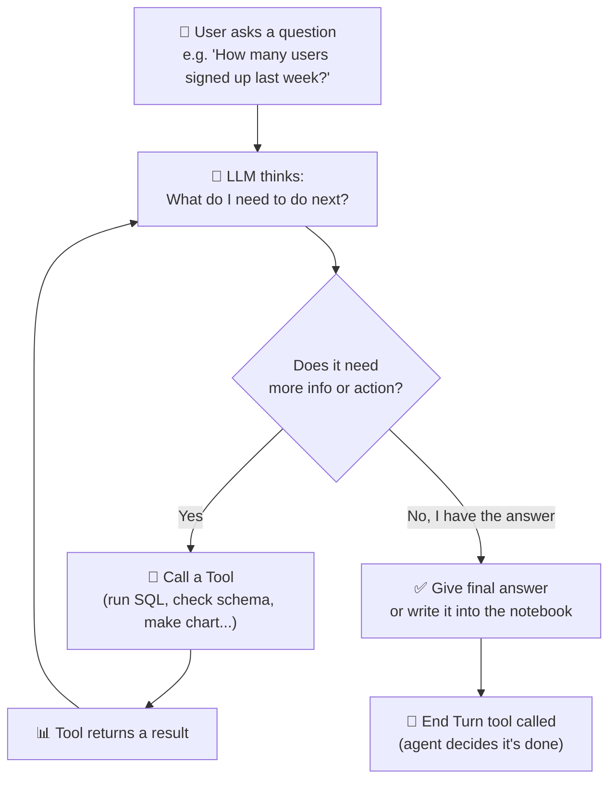
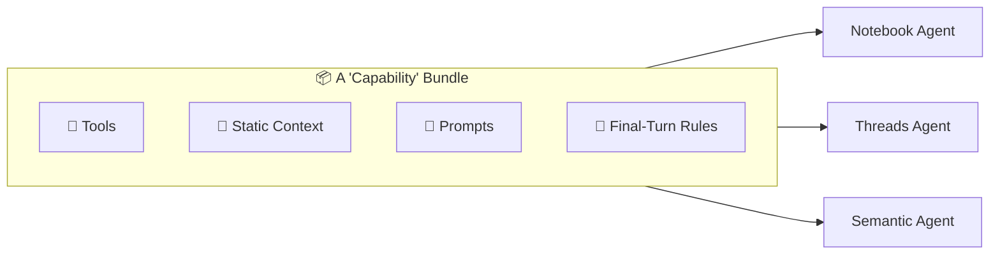
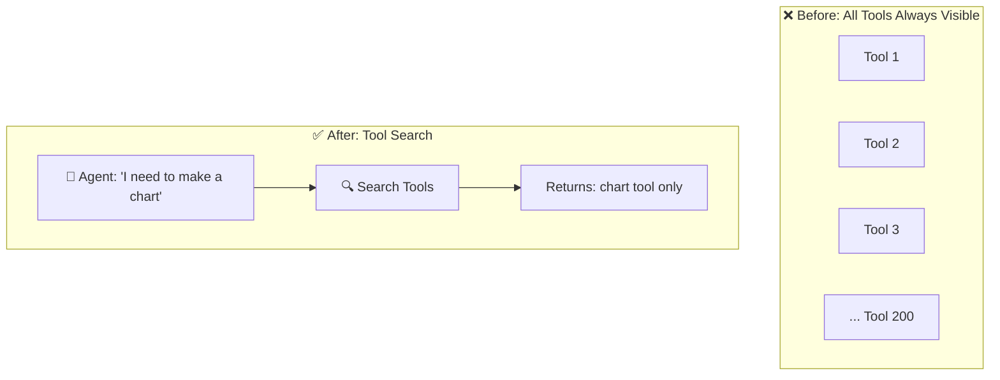
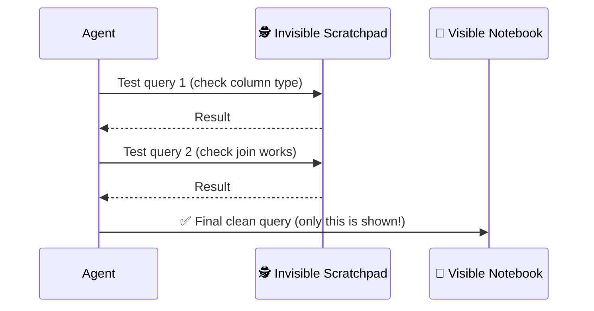
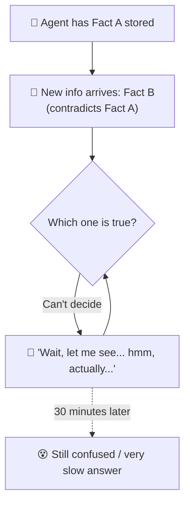
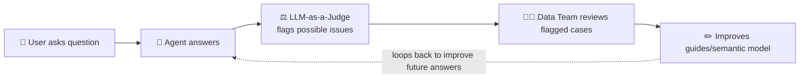
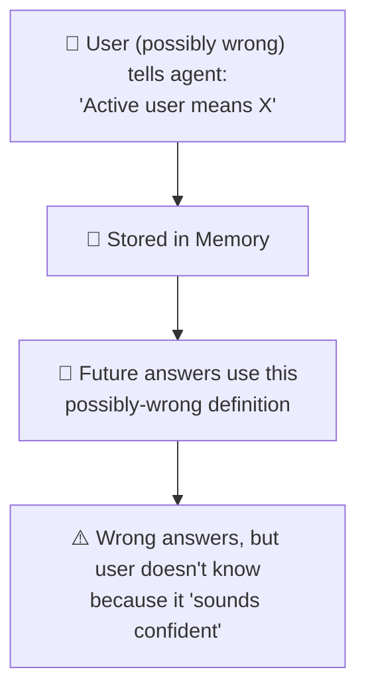
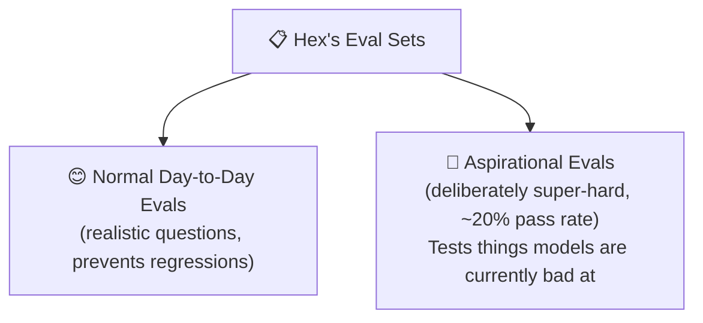
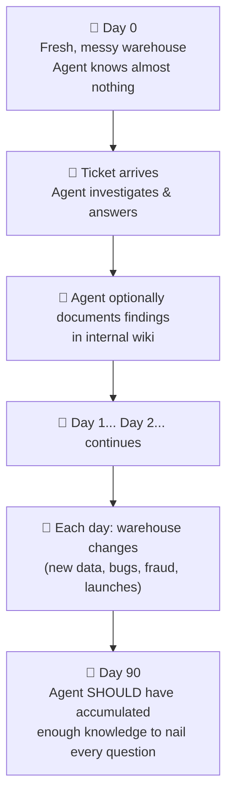

# How Hex Builds AI Agents That Reason Like Human Data Analysts
### A deep, beginner-friendly breakdown of Izzy Miller's (AI Engineer @ Hex) conversation on the Max Agency podcast

---

## 🔑 TL;DR (Read this if you only have 1 minute)

Hex is a data analytics tool where people write SQL/Python in "notebooks" to analyze data. Izzy Miller and his team built AI agents that can operate an *entire* notebook (not just one line of code at a time). The video explains: how they went from "one question → one answer" AI to full autonomous agents; how their agent handles thousands of tools using a system of "context" and "capabilities"; the weird failure modes agents fall into (like freezing for 30 minutes when given contradictory information); why almost all public AI benchmarks are secretly bad; and a wild new evaluation idea — a **90-day simulated company** where the agent has to prove it gets *smarter over time*, not just answer one question correctly.

---

## 🗺️ How This Document is Organized

We'll go theme by theme, not in video order, so it builds like a story:

1. The Backstory — why Hex built agents at all
2. The Core Idea — what "an agent" actually means here
3. Architecture — how Hex's agents are built under the hood
4. Weird Failure Modes at Scale
5. Trust & Verification — how do you know the AI is right?
6. Memory — the most dangerous feature
7. Evaluations — why most AI benchmarks are lies, and Hex's wild 90-day simulation
8. Izzy's Career Path — from marketer to AI engineer
9. Key Takeaways for YOU (Naman)
10. Glossary — every term explained like you're 5

---

## 1. The Backstory: Why Did Hex Build Agents?

### What is Hex, in one sentence?
Imagine Google Sheets + Python + SQL + charts, all mixed into one document called a **"notebook."** You write little blocks ("cells") of code or text, one after another, and each cell can use the results of the ones before it. Data analysts use this to explore data and answer business questions like *"How many users bought our product last week?"*

### The Old World: "Single-shot" AI (2023-era)
Before agents, Hex had a simple AI feature:
- You open **one cell**
- You type in plain English: *"give me total sales by month"*
- The AI writes **one SQL query** for that one cell
- Done. That's it. It can't do anything else.

This is called **"single-shot"** — one prompt in, one answer out, like a vending machine. You put in a coin (question), you get one snack (answer). No back-and-forth, no exploring.

> 🧒 **Like a 5-year-old would understand it:** Imagine asking a friend one question, they answer, and then they forget you exist. If you have a follow-up question, you have to start the whole conversation over. That's single-shot AI.

### Why Single-Shot Was Bad for Data Work
Izzy explains that data analysis is naturally an **iterative** process — meaning you rarely get the right answer on the first try. A real analyst:
1. Asks a question
2. Gets a rough answer
3. Notices something weird ("wait, that number looks too high")
4. Digs deeper
5. Finds a bug, fixes it, tries again
6. THEN gets the real answer

Single-shot AI could only do step 1-2. It could never do the "hmm, that's weird, let me dig deeper" part — which is literally the most important skill of a data analyst.

### The Turning Point
Two things convinced Hex to rebuild everything around **agents**:

| Signal | What it means |
|---|---|
| **Model trajectory** | AI models (GPT, Claude) were clearly getting smarter every few months. Izzy describes this as *"driving a high-horsepower race car at 25 mph in a school zone"* — meaning they had powerful AI but were only letting it do tiny, restricted tasks. |
| **It just wasn't working** | Single-shot text-to-SQL had hit a ceiling. No matter how much they polished it, users kept needing follow-ups it couldn't do. |

So they built a **sidebar agent** that could see the *entire* notebook (not just one cell) and use *all* the same tools a human user has. Overnight, internal reactions were: *"oh my god, this is it."*

---

## 2. The Core Idea: What Actually IS an "Agent"?

This is the single most important concept in the whole video, so let's slow down.

> 🧒 **Simplest definition (from Izzy himself):**
> *"An agent is an LLM running in a loop, calling tools."*

Let's unpack every word of that.

- **LLM** = Large Language Model = the "brain" (like Claude or GPT). It can read text and generate text.
- **Running in a loop** = it doesn't just answer once and stop. It keeps thinking, acting, checking, and thinking again — like a while-loop in code.
- **Calling tools** = the LLM can't directly touch a database or run code by itself. So we give it "tools" — like functions it's allowed to call, e.g. `run_sql_query()`, `create_chart()`, `edit_cell()`.

### The Agent Loop (Diagram)

This loop can run for **20+ minutes** for a complex question — the agent might run 10, 20, even 50 tool calls before it's confident enough to answer.

### Why This Is Powerful For Data Work
Because now the agent can behave like a *real analyst*:
- Run a quick "scratchpad" query to peek at data
- Notice something odd
- Investigate further
- Only THEN write the final, confident answer

This mirrors exactly the "iterative" behavior single-shot AI could never do.

---

## 3. Architecture: How Hex's Agents Actually Work Under the Hood

Hex doesn't have just ONE agent. They have several, and this section explains each one, then how they're merging into one unified system.

### 3.1 The Different Agents Hex Built

| Agent | Who it's for | What it does |
|---|---|---|
| **Notebook Agent** | Technical users (SQL/Python people) | Operates inside the notebook, writes real cells (SQL, Python, charts) that stay visible and become a shareable report |
| **Threads Agent** | Non-technical business people | Looks like a chat app (like ChatGPT), hides all the code, just gives you the answer + interactive charts |
| **Semantic Authoring Agent** | Data teams | Helps write "semantic models" (see below) — the official rulebook for what business terms mean |
| **Context Agent** | Internal / behind the scenes | Synthesizes information from everywhere in the workspace so other agents have better context |

> 🧒 **Semantic model, simply explained:** Imagine two coworkers arguing about what "active user" means. One says "logged in this month," the other says "made a purchase this month." A **semantic model** is a written-down, agreed rulebook that says exactly what every business term means, so everyone (humans AND the AI) uses the same definition.

### 3.2 Why They're Merging These Agents Into One

Early on, each agent had a totally different set of powers. This confused users:
> *"Why can Threads do this, but why can't Threads write Python, but the notebook agent can?"*

So Hex is now unifying all agents around shared building blocks called **"capabilities."**

**A capability bundles together:**
1. **Tools** — the functions the agent can call
2. **Static context** — fixed background info (like company rules)
3. **Prompts** — instructions on how to behave
4. **Final-turn behavior** — special rules for how the agent should wrap up

Instead of building each agent from scratch with its own rules, they now assemble agents by mixing and matching these standard capability bundles — like Lego blocks.

### 3.3 Static vs Dynamic Context

Izzy splits "context" (the background info the AI needs) into two types:

- **Static context** — things that don't change often: company rules, semantic models, guides/skills, table schemas
- **Dynamic context** — things that change per conversation: what's currently in this notebook, what the user just said, live data

> 🧒 **Analogy:** Static context is like the rules of a board game (fixed). Dynamic context is like the current state of the board (changes every turn).

### 3.4 The "Too Many Tools" Problem

Hex's agent toolkit is close to **100,000 tokens worth of tool descriptions**. Izzy openly says: *"It's too many tools. I'm not proud of it."*

**Why does having too many tools hurt?**
Every tool description takes up space in the AI's "working memory" (context window). More tools = more clutter = the AI gets confused about which tool to pick, and it costs more money/time.

**Their fixes:**
1. **Consolidate tools** — instead of separate `create_chart`, `update_chart`, `delete_chart` tools, just make ONE `chart` tool that does all three
2. **Tool Search** — instead of showing the AI all 100+ tools every time, let it *search* for the right tool when it needs one (like a librarian fetching a book instead of piling every book on your desk)

### 3.5 Ephemeral Queries: The "Secret Scratchpad"

This is a genuinely clever design decision. The notebook agent has ONE special tool: it can run "scratchpad" SQL queries that **do NOT show up in the notebook.**

**Why?** Because real investigation is messy. A human analyst doesn't show their boss 15 failed exploratory queries — they only show the final clean one. So the agent:
1. Runs several *invisible* test queries to explore the data (check column formats, test joins, etc.)
2. Once confident, writes ONE clean, correct query
3. THAT query becomes the visible notebook cell

**The downside (a real failure mode):** Sometimes a user asks a simple question, the agent silently runs a scratchpad query, and just says "the answer is 42" with **no visible proof**. Users get annoyed: *"Where's the chart? Where's the proof? Take my word for it?"* So Hex is still tuning when to show work vs. just answer.

### 3.6 Custom Orchestrator (Built In-House, Not Off-the-Shelf)

Hex considered using existing agent-building frameworks but chose to build their own orchestration system, later migrating to a tool called **Temporal** (a framework for long-running, reliable workflows — think of it as infrastructure for tasks that might run for many minutes and need to survive crashes/restarts).

**Why build custom instead of buying?**
- Things were moving too fast; they wanted full control
- It let them fix model weaknesses directly (see next section)
- Trade-off: they now carry ongoing "maintenance tax" — lots of engineering time goes into upkeep instead of new features

---

## 4. Weird Failure Modes at Scale (This Is the Most Fascinating Part)

When you go from testing 5 agent behaviors to running them for **500 real customers**, bizarre problems appear that you'd never predict.

### 4.1 The ID Hallucination Bug (Now Fixed, But a Great Lesson)

Every object in Hex (a cell, a project, a data connection) has a long unique ID number. Early AI models had a "ceiling" — if a notebook had more than 50-60 cells, the model would start **hallucinating IDs** (making them up or mixing them up).

**Their fix at the time:** They built a complex system to map short, simple references to the real long IDs — basically a translation layer to protect the AI from itself.

**The twist:** Just this past week, an engineer ran an experiment and discovered — the newer models don't need this workaround anymore! The complex system had become **unnecessary tech debt** — something that used to help but now just slows things down and is hard to remove.

> 💡 **Big lesson:** In fast-moving AI, "solutions" you build today can become "problems" (dead weight) in just months once models improve. Izzy calls this figuring out "**what's sand and what's stone**" — sand washes away as models improve, stone (real lasting value) remains.

### 4.2 The "Conflicting Context Collapse" Bug

This is wild. Hex ran an experiment: they gave the agent (Claude Sonnet 4.6) a piece of information that **contradicted** something else it already knew or believed.

**Result:** The agent would spend up to **30 minutes** going in circles — *"wait, let me see... hmm, actually..."* — stuck in a loop of doubt, unable to move forward. Izzy calls this a **"collapse mode."**

> 🧒 **Analogy:** Imagine someone tells you your friend's birthday is June 1st. Later someone else says it's June 15th. If you can't decide who to trust, you might just freeze up trying to reconcile it instead of just asking or picking one. AI agents do something similar — but MUCH worse, spinning for a long time instead of just resolving it quickly.

This is a big unsolved research problem: **how should AI agents handle contradictory information gracefully?**

### 4.3 The "Overconfidence" Bug (GPT-5 specific)

Some newer models (Izzy mentions GPT-5 series) are extremely thorough — sometimes running up to **50 invisible SQL queries** just to be "sure" before answering, even for questions that don't need it. This makes them slow, even though the extra caution *sometimes* helps.

### 4.4 The Fake "Best Quarter Ever" Trap (Izzy's Favorite Eval)

Izzy built a test using a REAL internal Hex dashboard about sales performance. He intentionally broke it with a **"fan-out bug"** (a common SQL bug where a join duplicates rows, inflating numbers).

**Result:** The dashboard shows every salesperson at 900%+ of their quota — looks like the best quarter ever, but it's actually fake, caused by the bug.

**What happens when you ask the AI "how are top performers doing?":**
- Every AI model tested says: *"Wow, amazing quarter! Everyone's crushing it!"* 😬
- **None of them catch the bug on their own** — even at absurd numbers like 1,200%
- BUT if the human says *"that doesn't seem right,"* the AI catches the bug in **10 seconds**

> 💡 **Big lesson:** Current AI models are bad at having their "ears perk up" the way an experienced human analyst instinctively would when something looks suspicious. They need a human to say "check again" — they don't naturally get suspicious of amazing-looking results.

---

## 5. Trust & Verification: How Do You Know the AI Is Right?

This is one of the hardest unsolved problems discussed in the whole video.

### Coding Agents vs. Data Agents (Key Distinction)

| | Coding Agents | Data Agents |
|---|---|---|
| **How you check correctness** | Run the code — it either works or it errors. Very verifiable. | There's often no single "correct" answer — depends on definitions, business context, judgment |
| **Why AI improves fast here** | Clear pass/fail signal = easy to train on | Ambiguous signal = hard to train on |
| **Example** | "Build a dashboard with 5 buttons" → either 5 buttons exist and work, or they don't | "How is the business doing?" → depends on what metric, what time range, what counts as "active" |

> 🧒 **Analogy:** Grading a coding task is like grading a math problem with one right answer. Grading a data-analysis task is like grading an essay — reasonable people can disagree on what's "good."

### Their Two Main Trust Strategies

**1. Semantic Models (the "guardrails" approach)**
If the data team builds a really good semantic model (the rulebook of business term definitions), users' answers are much more likely to be correct — because the AI is drawing from *pre-approved, trusted definitions* rather than guessing or writing custom SQL from scratch.

**2. Human-in-the-Loop Feedback Loop (the "Context Studio")**
Hex built a tool for data-team admins to see:
- What questions users are asking
- What answers the AI gave
- Cases flagged by "LLM-as-a-judge" as possibly wrong or confusing

> 🧒 **What's "LLM-as-a-judge"?** It's using a *second* AI model whose only job is to look at the first AI's answer and rate it — like a teacher grading a student's homework, except the teacher is also an AI.

This creates a **flywheel**: the more the product is used, the more mistakes get caught and fixed, the smarter the guides/context get, the better future answers become. This is why Izzy says Hex performs much better on **Day 90** than **Day 0** — it's not just the AI model getting smarter, it's the *system around it* accumulating better context over time.

---

## 6. Memory: The Scary, Powerful Feature

### What Memory Means Here
Like ChatGPT remembering "you have a dog named Rover," Hex agents could remember things a specific user told them across conversations.

### Why This Is Dangerous for Business Data (Unlike Casual Chat)
Imagine:
1. A user asks a question and gets a **wrong** answer
2. OR a user tells the agent, *"No, that's wrong — this metric is actually defined THIS way"* — but the user themselves is mistaken, or the info is now outdated
3. That incorrect info gets stored in the agent's memory
4. Now future answers to that SAME user are built on a **false foundation**, silently, with no one else knowing

### The Layers of Conflicting Truth
Now imagine memory conflicting with official rules:

| Level | Example |
|---|---|
| **Company/Data Team level** | Official semantic model says "Active user = made a purchase in 30 days" |
| **Team level** | Marketing team has their own convention |
| **Individual user level (memory)** | This one user told the AI a different definition weeks ago |

When these conflict, remember Section 4.2 — the agent might enter that dangerous **30-minute confusion spiral**. So Hex is being very cautious and slow about rolling out user-level memory, keeping it deliberately separate from the "official," data-team-approved context for now.

---

## 7. Evaluations (Evals): Why Almost Every AI Benchmark Is Secretly Broken

This is the most detailed and, honestly, most important section for anyone wanting to build good AI products.

### 7.1 What Is an "Eval," Simply?

> 🧒 **Simple definition:** An eval is a test you give an AI to check if it's doing its job well — like a report card, but for AI.

The basic process:
1. You have a set of questions with **known correct answers** ("ground truth")
2. You run the AI on those questions
3. You grade the answers (either automatically, or using another AI as a judge)
4. You get a score, like "73% correct"

### 7.2 Why Izzy Says Most Eval Sets Are Bad

He's very blunt: *"I've been very disappointed by what I saw... almost every time I've cracked open the hood on some data benchmark."* Common problems he found:

1. **Wrong ground truth** — the "correct answer" in the test is actually incorrect
2. **Broken grading scripts** — e.g., a script that fails to recognize "50%" and "0.5" as the same answer
3. **Testing the wrong skill entirely** — a famous data benchmark he mentions is secretly not testing *data reasoning* at all — it's testing whether the AI notices one obscure rule buried in a manual (like "should an empty list count the same as 'null'?"). This is a "needle in a haystack" memory test disguised as a "data reasoning" test.
4. **Not realistic** — most public data benchmarks are simple trivia questions like *"How many users did we have on April 16th, 2019?"* — a single lookup, not the layered, iterative investigation real analysts do

> 🧒 **His analogy:** Testing a coding AI only on "autocomplete one line" when people actually want it to build whole features is the wrong test. Same problem exists in data evals.

### 7.3 What Makes a GOOD Eval Set, According to Izzy

| Principle | Explanation |
|---|---|
| **Small enough to fully understand** | Their real eval sets are only ~30-50 questions — small enough that Izzy personally knows *why* each one exists and what failure it's designed to catch (he calls these "traps") |
| **Repeat the traps, don't multiply variations** | Rather than 470 slightly different versions of the same gotcha, better to have a handful of well-designed traps and run them multiple times |
| **Based on REAL usage, not made-up trivia** | Many of Hex's best evals start in the *middle* of an already-complex real notebook, mimicking real messy situations |
| **Multi-layered bugs** | His favorite evals bury 2-3 chained bugs — fixing bug #1 reveals bug #2, which was hidden behind it. This tests true investigative persistence, not just one lucky guess |

### 7.4 Two Categories of Hex's Internal Evals

The "aspirational" evals (like the fake "best quarter ever" trap in Section 4.4) are intentionally things that current AI is bad at — they exist to track progress over time as models improve, not to be passed today.

### 7.5 The Big New Idea: "Metric City" — A 90-Day Simulated Company

This is genuinely one of the most creative ideas in the whole talk. Izzy's core complaint: **normal evals only test one attempt, once, and never let the AI improve — which is unfair and unrealistic**, because in real life, Hex is supposed to get *better* the more you use it (remember the flywheel from Section 5).

**So he built a simulation:**

1. Start with a realistic (but deliberately messy/buggy) fake company database — "Shorelane Commerce," a fictional chachki (trinket) seller
2. A simulated clock ticks forward, **one day at a time, for 90 days**
3. Each day:
   - Database models re-run (via dbt — a tool for transforming warehouse data) to simulate real changes
   - New data rows appear, new products launch, fraud happens, things break
   - The agent receives **email-style tickets** from fake "stakeholders" asking real data questions
4. After answering a ticket, the agent gets an **"end turn" tool** — but it's ALSO allowed to do extra proactive work first: follow up on loose threads, document findings, update an internal wiki
5. This repeats every simulated day for 90 days

**The genius of the design:** The questions are crafted so they are *"borderline impossible to answer on Day 0"* — they require knowledge the agent can only gain by living through the 90 days and documenting what it learns. It's specifically testing: **does the agent get smarter over time by using its own memory/notes/wiki well?**

### 7.6 The Actual Results (Surprisingly Humbling)

| Day | Claude Sonnet 4.6 Score |
|---|---|
| Day 0 | ~4% |
| Day 90 | ~24% |

Even though the questions are *designed* so a well-functioning agent should reach 100% by Day 90, the best current model only reaches 24%. Izzy is not discouraged by this low number — he says it would actually be a *bad sign* if it scored near 100% (that would mean the benchmark is too easy). The low score just proves: **today's AI is still bad at long-term learning and self-organizing knowledge**, which is exactly the gap Hex needs to fill with good product design.

### 7.7 Why This Matters — Comparison to Other Long-Horizon Evals

Izzy mentions this idea is inspired by **"Vending Bench"** — a benchmark by a company called Andon Labs (in partnership with Anthropic) where an AI has to run a simulated vending machine business over a long period of time (related to a fun experiment called "Claudius" where Claude literally ran a vending machine). Vending Bench is closed-source; Izzy hopes to eventually open-source his "Metric City" benchmark.

**Why long-horizon evals matter:** A single "did you get it right, yes/no" test is like judging a new employee's entire career based on their answer to one interview question. A long-horizon eval is like watching them work for 90 real days — do they learn, adapt, document things, and get better? That's a MUCH more honest test of whether an AI product like Hex is actually valuable.

---

## 8. Izzy's Career Path (From Marketer → AI Engineer)

A short but genuinely useful story for anyone early in their career:

- Izzy joined Hex as an early employee doing **marketing / developer relations (DevRel)**, not engineering
- His personal rule: *"You shouldn't talk about anything you can't build — that's what I call lying."* So he always stayed hands-on and technical, even while doing marketing
- He believes he **"couldn't have become an AI engineer until models like GPT-01 got good enough"** — meaning the AI tools themselves unlocked his career transition, by letting him turn deep product knowledge + AI assistance into real, clean code
- His honest take: as AI coding tools got even better, he went from *"writing all my code by hand, so proud"* → to mostly reading/reviewing AI-written code, which he says paradoxically felt like *"forgetting how to code"*
- His view on hiring AI engineers: **domain passion beats existing technical skill.** He points to a former Hex *user* who gave amazing feedback for years, who they eventually hired — despite being a data scientist, not a trained engineer — and who became one of their most productive AI engineers, purely because of deep user empathy and strong opinions about what "good" looks like

> 💡 **Why this matters for you:** Izzy's core message is that **caring deeply about a problem + being AI-assisted** can now get you further than raw technical skill alone used to. This doesn't mean skip learning fundamentals — he still personally reviews and edits all AI-written code — but it does mean genuine curiosity and product sense are becoming much more valuable currency in engineering careers.

---

## 9. Key Takeaways & Lessons for You (Naman)

Since you're building toward being an exceptional software engineer and eventually working at a top tech company, here's what to actually extract from this talk:

1. **"Agent = LLM in a loop calling tools" is the mental model to internalize.** When you build your own AI features/projects, always ask: what's the loop? What are the tools? When does it decide to stop?

2. **Build small, real evals — don't trust big public benchmarks blindly.** If you ever build an AI feature (even a side project), write 20-30 realistic test cases YOU understand deeply, rather than chasing a giant generic benchmark score.

3. **"What's sand and what's stone?"** — a great engineering discipline. Periodically ask of your own code: *is this workaround still needed, or is it now dead weight because the tools/models around it improved?* Applies beyond AI — to any dependency, library, or hack you added early on.

4. **Context management is often harder than the "core logic."** Izzy repeatedly says the actual agent loop is simple engineering — the HARD part is deciding what information to feed the AI and when. This generalizes: in any system (not just AI), what data you expose and when is often more important than the algorithm itself.

5. **Verifiability matters enormously for trust.** Coding tasks are easy to verify (it runs or it doesn't); many real-world tasks (data judgments, business decisions, your own project decisions) are NOT easy to verify. Think about how you'll know if your own systems are "right," not just whether they "run."

6. **Long-horizon thinking beats single-attempt thinking.** Whether it's an AI agent or your own skill growth (DSA, system design, etc.), what matters isn't "did I get it right once" — it's "am I building a system (or a study habit) that compounds and gets better every single day." That's literally the philosophy behind your own long-term vision notes.

7. **Domain passion + AI fluency is a real career path now.** You don't need to be a 10-year veteran engineer to contribute meaningfully — deep curiosity about a problem, paired with strong AI-assisted execution, is increasingly valued. Keep building real projects you care about; that's your actual credential.

---

## 10. Glossary — Every Term, Explained Simply

| Term | Simple Explanation |
|---|---|
| **LLM (Large Language Model)** | The AI "brain" that reads and generates text (e.g., Claude, GPT) |
| **Agent** | An LLM that runs in a loop, using tools, to complete multi-step tasks on its own |
| **Tool** | A specific action the AI is allowed to take, like "run SQL" or "make a chart" |
| **Context** | All the background information fed to the AI so it can answer well |
| **Context window** | The total amount of text/info an AI can "hold in its head" at once |
| **Static context** | Background info that rarely changes (rules, schemas, definitions) |
| **Dynamic context** | Info that changes per conversation (current notebook state, live data) |
| **Single-shot** | One question in, one answer out — no follow-up, no exploring |
| **Semantic model** | An agreed-upon rulebook defining what business terms mean (e.g., "active user") |
| **Hallucination** | When an AI confidently makes up false information |
| **LLM-as-a-judge** | Using a second AI to grade/check the first AI's answers |
| **Eval / Evaluation set** | A test set used to measure how good an AI system is |
| **Ground truth** | The known "correct answer" used to grade an AI's response |
| **Fan-out bug** | A common SQL bug where a join duplicates rows, inflating totals |
| **Flywheel** | A system that gets easier/better to run the more it's used, building momentum over time |
| **Orchestrator** | The engineering system that manages and runs the agent's loop and workflow |
| **Temporal** | A software framework for reliably running long, multi-step workflows |
| **Compaction** | Compressing older parts of a conversation so the AI doesn't run out of context space |
| **In distribution** | When something matches the patterns the AI was specifically trained on (so it performs better) |
| **Long-horizon eval** | A test that runs over a long simulated time period, checking if an AI improves over time, not just once |
| **Vending Bench** | A long-horizon benchmark by Andon Labs/Anthropic where an AI runs a simulated vending machine business |
| **DevRel (Developer Relations)** | A hybrid marketing/technical role that helps developers understand and adopt a product |

---

## 📌 Final Thought

The single biggest theme across this entire conversation: **building a great AI product isn't really about the AI model — it's about everything AROUND the model.** The context you feed it, the tools you expose, the evals you use to catch mistakes, and the feedback loops that let it improve over time. The model is the engine, but Hex's engineering (harness, evals, memory design, context system) is the car, the driver, and the road all together.
