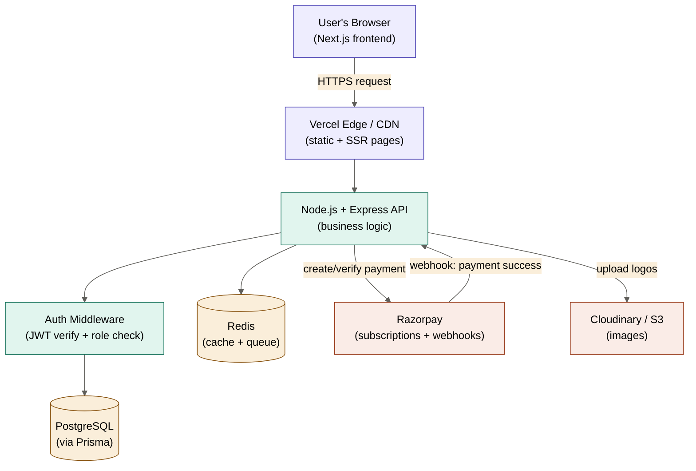
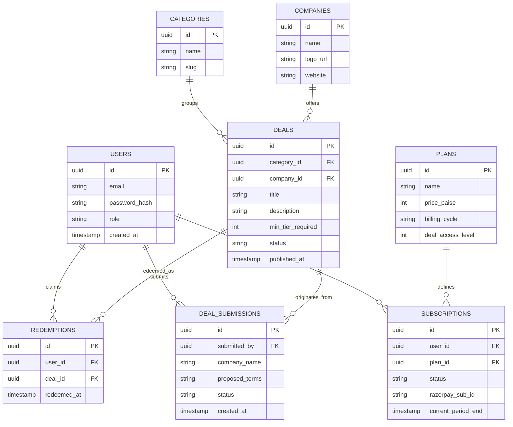
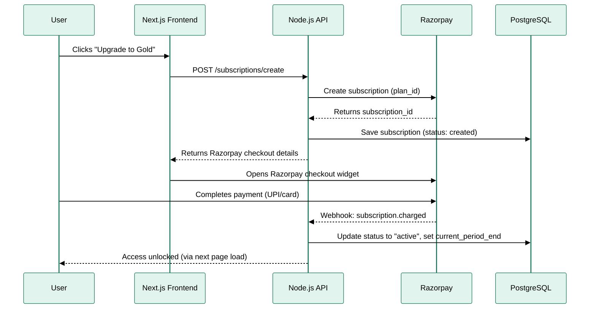
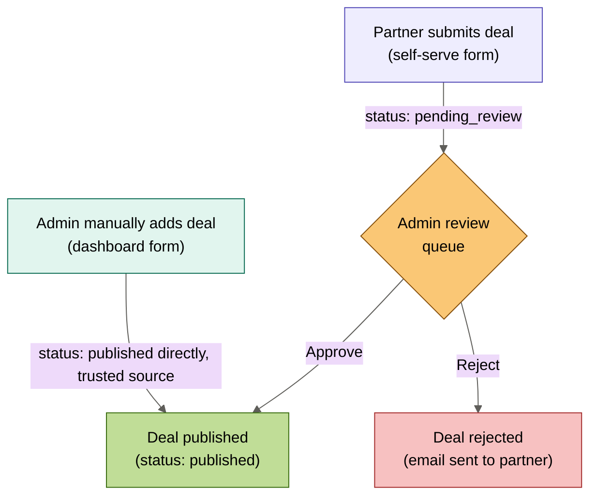

# Deals + Membership Platform — Full System Design
### A JoinSecret-style marketplace, built with Next.js + Node.js
**Target scale:** 8,000–10,000 users · **Payments:** Razorpay · **DB:** PostgreSQL

---

## 1. The Mental Model (Read This First)

Forget code for a second. This product has exactly 3 moving parts:

1. **Deals** — a list of "offer cards" (e.g. "50% off Notion for 6 months"), organized into categories.
2. **Membership** — a wall that says "you can see 5 deals for free, but the other 95 need a paid card."
3. **People who bring deals in** — either *you* (admin, typing them in manually) or *outside companies* (self-serve, submitting for your approval).

Everything else — auth, database, payments, security — exists purely to **serve these 3 things safely and reliably**. Keep that in your head; it stops you from over-engineering.

---

## 2. MVP Feature Scope (What We're Actually Building)

| Included in v1 | Explicitly excluded from v1 |
|---|---|
| Deal browsing + search + category filters | Community/forum/chat |
| Free tier + multiple paid membership tiers | Multi-language support |
| Razorpay subscription billing (recurring) | Mobile app (native) |
| Admin dashboard to add/edit/approve deals | Affiliate/referral payout system |
| Partner self-serve deal submission portal | AI-based deal recommendations |
| User auth (signup/login/roles) | White-label/multi-tenant support |
| "Redeem" tracking (who claimed what) | |

Keeping the excluded list explicit matters — it's what stops scope creep 3 weeks into the build.

---

## 3. Tech Stack & Why

| Layer | Choice | Why this, not something else |
|---|---|---|
| Frontend | **Next.js (App Router)** | SEO matters for a deals site (people Google "Notion discount code") — Next.js gives you server-side rendering for free, which plain React (Vite/CRA) doesn't. |
| Backend | **Node.js + Express** | You already know it. At 8-10k users, a monolith is not just "good enough" — it's *correct*. Microservices would be pure overhead here. |
| Database | **PostgreSQL** | Deals, users, subscriptions, and payments are all *relational* (a user *has* a subscription, a subscription *has* a plan, a deal *belongs to* a category). Postgres is built for exactly this. Skip MongoDB — you'd be fighting the tool. |
| ORM | **Prisma** | Type-safe queries, auto-migrations, and it's the industry default for Next.js + Postgres right now. Saves you from writing raw SQL for 90% of queries. |
| Caching | **Redis** | Deal listing pages get hit constantly and change rarely — cache them. Also used for rate-limiting and session storage. |
| Auth | **NextAuth.js (Auth.js) or custom JWT** | NextAuth if you want speed (Google login, email/password out of the box). Custom JWT if you want full control over roles (user/partner/admin) — recommended here since you have 3 distinct roles. |
| Payments | **Razorpay Subscriptions API** | India-focused, handles recurring billing, webhooks for renewal/failure, and UPI/cards natively. |
| File/image storage | **Cloudinary or AWS S3** | Deal logos, partner company images. Don't store images in Postgres. |
| Hosting | **Vercel (frontend) + Railway/Render (backend + DB)** | Matches your existing deployment comfort zone. |
| Background jobs | **BullMQ (Redis-backed queue)** | For things like "send renewal reminder email 3 days before subscription expires" — don't do this synchronously in a request. |

**A note on scale:** 8-10k users is *small* by web standards. A single Postgres instance + a single Node server + Redis cache will comfortably handle this. Resist the urge to add Kafka, microservices, or multi-region anything — that complexity would slow you down for zero benefit at this scale.

---

## 4. High-Level Architecture



**Reading this diagram like a 5-year-old would:** the browser is the customer walking into the shop. The CDN is the shop's front door (fast, cached). The API is the shop assistant who checks your membership card (Auth Middleware) before letting you into the back room (Database). Redis is the assistant's notepad for things they check often. Razorpay is the payment counter outside the shop — it's a separate company, and it *tells* your shop assistant "this person paid" via a webhook (a phone call your API always answers).

---

## 5. Database Design

### 5.1 Core Tables (Entity Relationship)



### 5.2 Table-by-Table Explanation (in plain English)

- **users** — everyone who signs up. `role` is one of `user`, `partner`, `admin`. This single field is how you gate access to different dashboards.
- **plans** — your membership tiers (e.g. Free, Silver ₹499/mo, Gold ₹1499/mo). `deal_access_level` is a number (0, 1, 2...) — a deal requiring level 1 is visible to Silver and Gold, but not Free. This is the cleanest way to do tiered gating without messy if/else chains.
- **subscriptions** — links a user to a plan, and stores the Razorpay subscription ID so you can look up billing status. `status` is `active`, `past_due`, `cancelled`.
- **categories** — "AI Tools", "Marketing", "Dev Tools" etc. — used for filtering.
- **companies** — the vendor behind a deal (e.g. Notion, Figma). Stored separately from deals so one company can have multiple deals, and so partner self-serve submissions map cleanly to a company profile.
- **deals** — the actual offer cards. `status` is `draft`, `pending_review`, `published`, `expired`. `min_tier_required` ties back to `plans.deal_access_level`.
- **deal_submissions** — this is your **hybrid ingestion** table (see Section 6). A partner fills this out; it does *not* touch the live `deals` table until an admin approves it.
- **redemptions** — tracks who clicked "reveal deal" or "claim" on what, and when. This is your analytics goldmine later (which deals are popular, which users are engaged).

---

## 6. Membership & Payment System

### 6.1 Tier Design

You said **free + multiple paid tiers** — here's a concrete example structure:

| Tier | Price (example) | Access |
|---|---|---|
| Free | ₹0 | ~15% of deals, low-value ones |
| Silver | ₹499/mo or ₹3,999/yr | All deals except top-tier exclusive ones |
| Gold | ₹1,499/mo or ₹11,999/yr | Everything, including exclusive high-value deals + early access |

This maps directly to `deal_access_level`: Free=0, Silver=1, Gold=2. A deal with `min_tier_required = 1` is hidden (blurred/locked) for Free users, visible for Silver and Gold.

### 6.2 Razorpay Subscription Flow



**Why webhooks matter (the beginner trap):** Never mark a user as "paid" the moment they click "Pay" on the frontend — the payment could still fail on Razorpay's side. Always wait for Razorpay's **webhook** (a server-to-server callback) to confirm success, and *only then* update your database. This is the #1 mistake in DIY payment integrations — trusting the frontend instead of the source of truth.

---

## 7. Deal Ingestion: The Hybrid Approach (Your Answer)

You asked for a mix of manual + self-serve. Here's the recommended flow:



**Why this hybrid works well for you:**
- **Admin-added deals** (deals you personally sourced/negotiated) go live instantly — no need to approve your own work.
- **Partner-submitted deals** always land in a review queue first. This protects you from spam, scams, or low-quality offers damaging your platform's trust — which is the entire value proposition of a curated deals site.
- Build the partner form as a simple public page (`/partner/submit`) with fields: company name, deal description, terms, logo upload, contact email. No login required to submit — reduces friction. But require email verification before the submission enters the review queue, to cut spam.

---

## 8. Authentication & Roles

Three roles, one `role` column, one auth system — don't overcomplicate this with separate login systems per role.

| Role | Can do |
|---|---|
| `user` | Browse deals, subscribe, redeem deals within their tier |
| `partner` | Submit deals, view status of their own submissions |
| `admin` | Everything + approve/reject submissions, manage plans, view analytics |

**How gating actually works in code (conceptually, not language-specific):**

```
On every API request that touches protected data:
  1. Read JWT from cookie/header
  2. Verify signature (proves it wasn't tampered with)
  3. Extract { userId, role } from the token
  4. If route requires role="admin" and token role != "admin" → reject (403)
  5. If route is a deal listing, filter deals server-side by:
     user's subscription tier >= deal.min_tier_required
```

**Critical beginner point:** Never filter "locked" deals on the frontend only (e.g. hiding them with CSS). A user can open browser dev tools and see the full deal data in the API response. Always filter **server-side**, before the data ever leaves your backend.

---

## 9. Security Checklist (Non-Negotiable for a Payments-Adjacent Site)

- **Password storage:** bcrypt/argon2 hashing — never plain text, never reversible encryption.
- **HTTPS everywhere:** enforced automatically by Vercel/Railway, but double-check no HTTP fallback.
- **Rate limiting:** use Redis to cap login attempts (e.g. 5/min per IP) and API calls generally — prevents brute force and scraping.
- **Input validation:** validate every form (especially the partner submission form — it's your most public-facing input) with a schema library (e.g. Zod) on the backend, not just the frontend.
- **Webhook signature verification:** Razorpay signs every webhook — always verify the signature before trusting a "payment succeeded" event. This is the single most important payment security step.
- **SQL injection:** Prisma parameterizes queries automatically — just never string-concatenate raw SQL.
- **Secrets management:** API keys (Razorpay, DB URL, JWT secret) go in environment variables, never committed to git.
- **Role checks on every protected route:** don't just hide the "Admin" button in the UI — re-check the role server-side on every admin API call.
- **CORS:** restrict your API to only accept requests from your actual frontend domain in production.

---

## 10. Scaling for 8,000–10,000 Users (Keep It Boring)

This is a small-to-medium scale. Here's what that actually means for your infra decisions:

- **One Postgres instance** (managed, e.g. Railway/Render/Supabase) is plenty. You don't need read replicas or sharding.
- **One Node.js server instance**, maybe 2 for redundancy once you have paying users — no need for a Kubernetes cluster.
- **Redis** mainly earns its keep for caching the deal listing page (which gets read far more than it's written) and for rate limiting.
- **CDN caching** on Vercel handles most of your traffic for static/SSR pages without hitting your API at all.
- The only place you'll feel real load is the **deals listing/search endpoint** — cache it aggressively (e.g. 60-second Redis cache, invalidated when an admin publishes a new deal).

**The mistake to avoid:** don't design for 1 million users when you have 10,000. Every extra layer of infrastructure (message queues, microservices, multi-region) is complexity you'll pay for in development time now, for a scaling problem you don't have yet.

---

## 11. Suggested Project Structure

```
project-root/
├── frontend/                  (Next.js app)
│   ├── app/
│   │   ├── (public)/
│   │   │   ├── deals/
│   │   │   ├── pricing/
│   │   │   └── partner/submit/
│   │   ├── (auth)/
│   │   │   ├── login/
│   │   │   └── signup/
│   │   ├── dashboard/          (logged-in user)
│   │   └── admin/               (admin only, role-guarded)
│   ├── components/
│   └── lib/                     (API client, auth helpers)
│
├── backend/                   (Node.js + Express)
│   ├── src/
│   │   ├── routes/
│   │   │   ├── deals.routes.js
│   │   │   ├── subscriptions.routes.js
│   │   │   ├── auth.routes.js
│   │   │   └── admin.routes.js
│   │   ├── controllers/
│   │   ├── middleware/
│   │   │   ├── auth.middleware.js
│   │   │   └── roleGuard.middleware.js
│   │   ├── services/
│   │   │   ├── razorpay.service.js
│   │   │   └── cache.service.js
│   │   └── webhooks/
│   │       └── razorpay.webhook.js
│   ├── prisma/
│   │   └── schema.prisma
│   └── jobs/                    (BullMQ background jobs)
│
└── shared/                    (types/constants used by both, if using TS)
```

---

## 12. Build Roadmap (Phased)

| Phase | What you build | Outcome |
|---|---|---|
| **Phase 1 — Foundation** | Postgres + Prisma schema, auth (signup/login/roles), basic Next.js shell | You can log in as different roles |
| **Phase 2 — Deals core** | Admin CRUD for deals, categories, companies; public deal listing + search/filter | Deals are visible, no gating yet |
| **Phase 3 — Membership** | Plans table, Razorpay subscription creation + webhook handling, tier-based deal gating | Free vs paid access actually works |
| **Phase 4 — Partner self-serve** | Public submission form, admin review queue, approve/reject flow | Hybrid ingestion complete |
| **Phase 5 — Polish** | Redemption tracking, Redis caching, rate limiting, email notifications (renewal reminders, submission status) | Production-ready |

Build strictly in this order — Phase 3 (payments) is the highest-risk piece, so get Phases 1-2 rock solid first so you're not debugging auth *and* Razorpay webhooks at the same time.

---