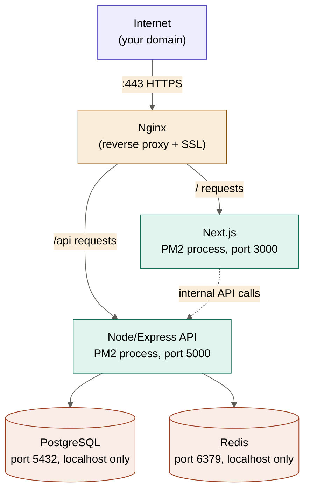

# Deploying on a Single Hostinger VPS (8GB RAM)
### Frontend + Backend + Database, all on one server

---

## 1. Is 8GB RAM Safe? Yes — Here's the Math

At 8,000-10,000 users, nothing here is heavy. A rough resource budget:

| Component | Typical RAM usage | Notes |
|---|---|---|
| Ubuntu OS + panel (FastPanel) | ~300-500 MB | Baseline overhead |
| Next.js frontend (PM2, prod build) | ~150-300 MB | Per instance |
| Node.js/Express backend (PM2) | ~150-300 MB | Per instance |
| PostgreSQL | ~200-500 MB | Grows with data, but stays modest at this scale |
| Redis | ~50-150 MB | Small in-memory cache, not a data lake |
| Nginx (reverse proxy) | ~20-50 MB | Negligible |
| **Total (realistic)** | **~1-2 GB** | Leaves **6-7 GB free** as headroom/burst capacity |

**Verdict:** 8GB is genuinely generous for this setup. You could run this whole thing on 2GB and be fine; 8GB gives you room to run PM2 in cluster mode (multiple Node processes) for redundancy, plus space for traffic spikes, without ever touching swap.

---

## 2. Architecture on the VPS



**The key idea:** Nginx is the only thing exposed to the internet (port 443). It looks at the incoming request path and decides: "does this go to the Next.js app, or the Node API?" — then quietly forwards it internally. Postgres and Redis are never exposed to the internet at all; they only listen on `localhost`, so nothing outside your server can even attempt to reach them directly. This is the standard, safe pattern for single-VPS deployments.

---

## 3. Step-by-Step Deployment

### Step 1 — Server prep (one-time)
Since you already have Ubuntu installed via FastPanel, SSH in and install the runtime tools:
```bash
sudo apt update && sudo apt upgrade -y
curl -fsSL https://deb.nodesource.com/setup_20.x | sudo -E bash -
sudo apt install -y nodejs postgresql redis-server
sudo npm install -g pm2
```

### Step 2 — PostgreSQL setup
```bash
sudo -u postgres psql
CREATE DATABASE dealsdb;
CREATE USER dealsapp WITH ENCRYPTED PASSWORD 'a-strong-password-here';
GRANT ALL PRIVILEGES ON DATABASE dealsdb TO dealsapp;
\q
```
Confirm Postgres only listens locally — check `/etc/postgresql/*/main/postgresql.conf` has `listen_addresses = 'localhost'` (this is the default, just verify it wasn't changed).

### Step 3 — Deploy your code
```bash
cd /var/www
git clone <your-repo-url> deals-platform
cd deals-platform/backend
npm install
npx prisma migrate deploy
cd ../frontend
npm install
npm run build
```

### Step 4 — Run both apps with PM2
PM2 keeps your apps alive, restarts them on crash, and restarts them on server reboot.
```bash
cd /var/www/deals-platform/backend
pm2 start npm --name "deals-api" -- start

cd /var/www/deals-platform/frontend
pm2 start npm --name "deals-web" -- start

pm2 save
pm2 startup   # follow the printed command to enable boot persistence
```

### Step 5 — Nginx reverse proxy config
FastPanel can generate most of this for you via its UI, but conceptually your config needs to look like this:
```nginx
server {
    listen 80;
    server_name yourdomain.com www.yourdomain.com;

    location /api/ {
        proxy_pass http://localhost:5000/;
        proxy_set_header Host $host;
        proxy_set_header X-Real-IP $remote_addr;
    }

    location / {
        proxy_pass http://localhost:3000/;
        proxy_set_header Host $host;
        proxy_set_header X-Real-IP $remote_addr;
    }
}
```

### Step 6 — SSL certificate
Since your domain is already pointed, FastPanel usually has a one-click Let's Encrypt option — use that. If doing it manually instead:
```bash
sudo apt install certbot python3-certbot-nginx
sudo certbot --nginx -d yourdomain.com -d www.yourdomain.com
```
This auto-renews every 90 days once set up — no action needed after.

---

## 4. Security Hardening Checklist for the VPS Itself

- **Firewall:** only allow ports 22 (SSH), 80, and 443 — block everything else.
  ```bash
  sudo ufw allow OpenSSH
  sudo ufw allow 'Nginx Full'
  sudo ufw enable
  ```
- **SSH:** disable password login, use SSH keys only. Change the default SSH port if you want extra noise reduction from bots (optional, not critical).
- **Postgres & Redis:** confirm neither is reachable from outside — `sudo ss -tulnp | grep -E '5432|6379'` should show `127.0.0.1`, not `0.0.0.0`.
- **Environment variables:** keep your `.env` files (DB password, JWT secret, Razorpay keys) out of git, with file permissions restricted (`chmod 600 .env`).
- **Automatic updates:** enable `unattended-upgrades` for security patches:
  ```bash
  sudo apt install unattended-upgrades
  sudo dpkg-reconfigure --priority=low unattended-upgrades
  ```
- **Backups:** set up a daily `pg_dump` cron job writing to a separate location (or Hostinger's snapshot feature) — a single-VPS setup has no redundancy, so backups are your safety net, not optional.

---

## 5. One Thing Worth Knowing: The Trade-off vs Vercel/Railway

Going all-in on one VPS is cheaper and gives you full control, but it means **you** are responsible for uptime, security patches, and scaling — there's no automatic failover if the server goes down. For a portfolio/early-stage project at 8-10k users, this is a completely reasonable trade-off. Just know that if the VPS reboots unexpectedly or runs out of resources, there's no automatic recovery beyond what PM2 and your backup routine provide — worth checking `pm2 status` and server health periodically until you have monitoring set up.
