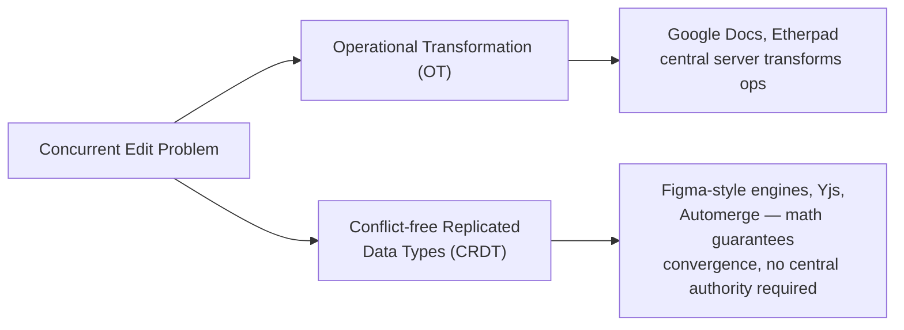
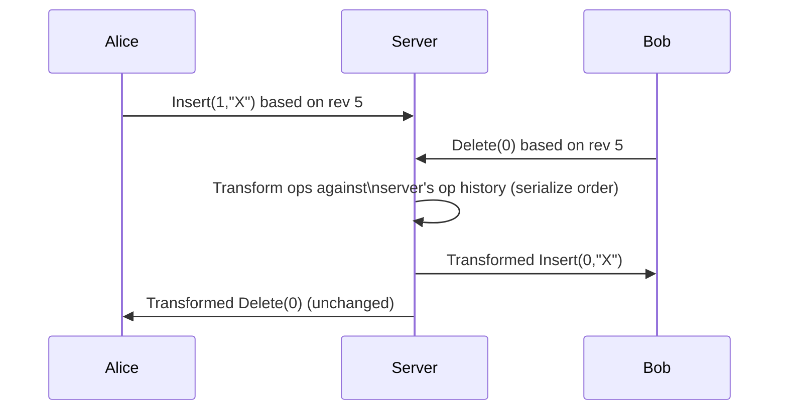
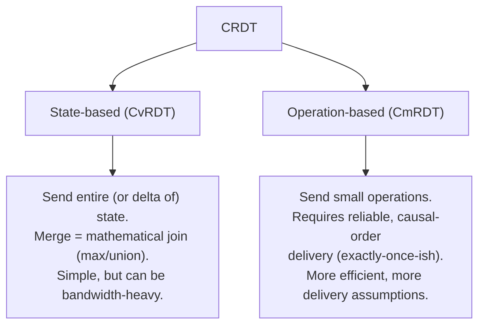
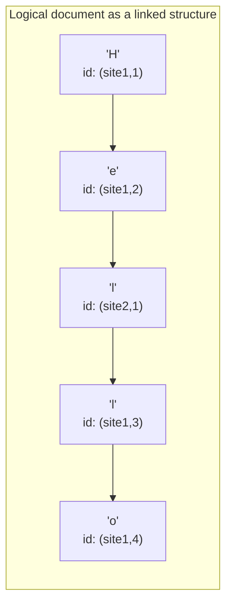
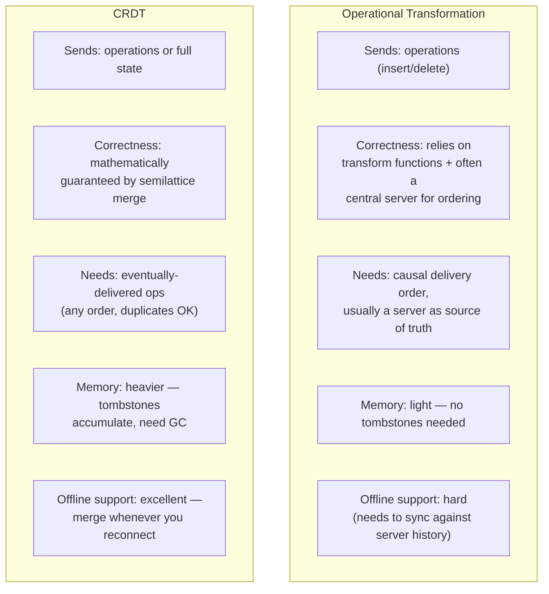
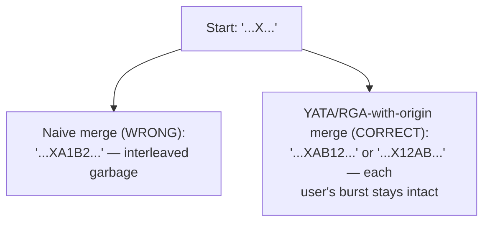

# CRDTs vs Operational Transformation (OT) — A Complete Interview-Ready Deep Dive

> Goal: understand *why* these exist, *how* they work internally (with pseudocode), *why they're mathematically correct*, and *how to talk about them in a system design interview*.

---

## 1. The Problem They Both Solve

Imagine two people editing the same Google Doc at the same time.

- Alice's cursor is at position 5 and she types `"X"`.
- Bob's cursor is also near position 5 and he deletes a character.

Both actions happen **at the same time, on different computers, based on the same starting document**. By the time Alice's edit reaches Bob's computer, Bob's document has already changed underneath it — so if you just replay Alice's edit "insert X at position 5" blindly, you might insert it in the wrong place, corrupt the document, or the two computers might end up with **different final text**.

This is the **concurrent editing / replicated data consistency problem**. Two families of solutions dominate real systems:



Both aim for the same end goal, called **eventual/strong eventual consistency**: *if everyone stops sending new edits, all replicas end up byte-for-byte identical.* They just get there by very different routes.

---

## 2. Operational Transformation (OT)

### 2.1 The Core Idea (5-year-old version)

Imagine you and a friend are both editing the same sentence written on a whiteboard, but you're in different rooms with **copies** of the whiteboard. You each make an edit and then call each other to describe what you did ("I inserted 'cat' at position 3"). The problem: while you were talking, your friend already made their own edit, so "position 3" might not mean the same thing anymore on their board.

**OT's trick:** before applying someone else's operation, you mathematically **adjust ("transform") it** to account for edits that happened in between — like saying "oh, since you added 2 letters before that spot, I'll insert at position 5 instead of 3."

### 2.2 Formal Model

An operation is typically one of:
- `Insert(pos, char)`
- `Delete(pos)`

The heart of OT is a **transform function**:

```
T(Op_a, Op_b) → Op_a'
```

This produces a new version of `Op_a` that has the *same intention* as the original, but is adjusted so it's correct to apply **after** `Op_b` has already been applied.

### 2.3 Pseudocode: Transforming Insert/Delete

```python
def transform_insert_insert(op_a, op_b):
    # both are Insert(pos, char)
    if op_a.pos < op_b.pos:
        return op_a
    elif op_a.pos > op_b.pos:
        return Insert(op_a.pos + 1, op_a.char)
    else:
        # tie-break: use a deterministic rule, e.g. site/client ID
        if op_a.site_id < op_b.site_id:
            return op_a
        else:
            return Insert(op_a.pos + 1, op_a.char)

def transform_insert_delete(op_a, op_b):
    # op_a = Insert, op_b = Delete
    if op_a.pos <= op_b.pos:
        return op_a
    else:
        return Insert(op_a.pos - 1, op_a.char)

def transform_delete_insert(op_a, op_b):
    # op_a = Delete, op_b = Insert
    if op_a.pos < op_b.pos:
        return op_a
    else:
        return Delete(op_a.pos + 1)

def transform_delete_delete(op_a, op_b):
    if op_a.pos < op_b.pos:
        return op_a
    elif op_a.pos > op_b.pos:
        return Delete(op_a.pos - 1)
    else:
        return NoOp()  # already deleted by the other operation
```

### 2.4 Worked Example

Start: `"ABC"`

- Alice does `Insert(1, "X")` → intends `"AXBC"`
- Bob (concurrently, on the same starting `"ABC"`) does `Delete(0)` (deletes `"A"`) → intends `"BC"`

If Bob's system just blindly replays Alice's raw op `Insert(1, "X")` on his already-changed `"BC"`, he'd get `"BXC"` — **that's correct by luck here**, but in general this breaks. So instead:

1. Bob applies his own delete locally: `"BC"`.
2. Alice's op arrives. Bob transforms it against his own delete:
   `transform_insert_delete(Insert(1,"X"), Delete(0))` → since `1 > 0`, becomes `Insert(0, "X")`.
3. Bob applies `Insert(0,"X")` to `"BC"` → `"XBC"`.

Meanwhile Alice, upon receiving Bob's `Delete(0)`, transforms it against her own insert and applies it — and **both converge to the same final string** `"XBC"`.

### 2.5 Correctness: TP1 and TP2 (the actual interview-worthy theory)

For OT to be provably correct in a peer-to-peer (no central server) setting, the transform function must satisfy two properties:

**TP1 (Convergence property):**
For any two concurrent operations `Op_a`, `Op_b`, applying `Op_a` then `T(Op_b, Op_a)` must produce the same document as applying `Op_b` then `T(Op_a, Op_b)`.

```
apply(apply(D, Op_a), T(Op_b, Op_a)) == apply(apply(D, Op_b), T(Op_a, Op_b))
```

**TP2 (Transform associativity across a third op):**
When you have three concurrent ops, transforming needs to give a consistent result regardless of the order operations are composed — this matters when operations are transformed against *sequences* of other ops, not just one at a time.

Most simple `insert`/`delete` transform functions satisfy TP1 but **famously fail TP2** in edge cases — this was a notorious bug class in early OT systems (Jupiter, dOPT). This is precisely why:

- **Google's real system (the "Jupiter" protocol, still used in Docs)** sidesteps TP2 by using a **central server**. Every client sends ops to the server; the server is the single source of truth that serializes and transforms all operations against each other in one consistent order, then broadcasts the transformed op back. Clients never need to transform against each other directly — only against the server's canonical history.



### 2.6 Why OT Is Hard in Practice
- Transform functions must be written (and proven correct) for **every pair of operation types** — insert/insert, insert/delete, delete/delete, plus rich-text ops like formatting, and it explodes combinatorially with more operation types (bold, move, table edits...).
- True peer-to-peer OT (no server) is a known hard research problem because of TP2 violations.
- Undo/redo interacts badly with transforms and needs special handling.
- This is why virtually all production OT systems (Google Docs, Etherpad) use a **central server** as an arbiter.

---

## 3. Conflict-free Replicated Data Types (CRDT)

### 3.1 The Core Idea (5-year-old version)

Instead of sending "instructions" that need to be carefully re-interpreted depending on what else happened (like OT), a CRDT is a data structure **designed so that no matter what order you receive updates, or how many times you receive the same update, or if two people update it at exactly the same time — you always end up with the same answer.**

It's like a rule: "**highest number wins**." If Alice sets a value to 5 and Bob sets it to 7 at the same time, everyone just keeps 7, no matter which one they heard about first. No negotiation needed — the merge rule is baked into the data type itself.

### 3.2 The Math Foundation: Join-Semilattices

A CRDT's merge function must be:

| Property | Meaning | Why it matters |
|---|---|---|
| **Commutative** | `merge(a, b) == merge(b, a)` | Order of receiving updates doesn't matter |
| **Associative** | `merge(merge(a,b),c) == merge(a,merge(b,c))` | Grouping/batching of updates doesn't matter |
| **Idempotent** | `merge(a, a) == a` | Receiving the same update twice (duplicate network delivery) causes no harm |

Any merge function with these three properties forms a mathematical structure called a **join-semilattice**, and this guarantees a property called **Strong Eventual Consistency (SEC)**:

> *If two replicas have received the same set of updates (in any order, any number of duplicates), they are guaranteed to be in the same state — with zero coordination and no central server required.*

This is *provable*, not just "usually works" — that's the whole appeal over OT.

### 3.3 Two Flavors of CRDTs



### 3.4 Simple CRDTs with Pseudocode

**G-Counter (Grow-only counter)** — a counter that can only increase, safe across N replicas:

```python
class GCounter:
    def __init__(self, replica_id, num_replicas):
        self.id = replica_id
        self.counts = [0] * num_replicas  # one slot per replica

    def increment(self):
        self.counts[self.id] += 1

    def value(self):
        return sum(self.counts)

    def merge(self, other):
        # commutative, associative, idempotent: element-wise max
        for i in range(len(self.counts)):
            self.counts[i] = max(self.counts[i], other.counts[i])
```

**PN-Counter** (supports increment and decrement): two G-Counters, one for increments (`P`) and one for decrements (`N`); `value = P.value() - N.value()`.

**G-Set (Grow-only Set):** just a set with union as merge — `merge(A,B) = A ∪ B`. Union is commutative, associative, idempotent — trivially a valid CRDT. Downside: can't remove elements.

**2P-Set (Two-Phase Set):** adds a "tombstone" set for removals — once removed, an element can never be re-added (simple but limited).

**LWW-Register (Last-Write-Wins Register):** stores `(value, timestamp, replica_id)`; merge picks the entry with the higher timestamp, breaking ties with replica ID. Simple, but can silently discard concurrent writes (data loss is a known trade-off).

**OR-Set (Observed-Remove Set)** — the practical, widely-used set CRDT:

```python
class ORSet:
    def __init__(self):
        self.adds = set()     # set of (element, unique_tag)
        self.removes = set()  # set of (element, unique_tag) that were removed

    def add(self, element):
        tag = generate_unique_id()  # e.g. (replica_id, counter)
        self.adds.add((element, tag))

    def remove(self, element):
        # remove only the tags currently observed for this element
        for (e, tag) in self.adds:
            if e == element and (e, tag) not in self.removes:
                self.removes.add((e, tag))

    def contains(self, element):
        return any(e == element and (e,t) not in self.removes for (e,t) in self.adds)

    def merge(self, other):
        self.adds |= other.adds
        self.removes |= other.removes
```

Using a **unique tag per add** (instead of just the element value) is the key trick — it means a concurrent `add("x")` and `remove("x")` from two different replicas don't clash: the remove only kills the tags it actually observed, so a "fresh" concurrent add survives. This "add-wins" bias is a deliberate, documented design choice.

### 3.5 The Hard One: Text/Sequence CRDTs

Counters and sets are easy. **Collaborative text editing (what Google Docs / Notion / Figma need) is the hard case**, because order matters — you need every replica to agree on a total order of characters even though inserts happen concurrently at "the same position."

The standard trick, used by **RGA (Replicated Growable Array)**, **Logoot**, **LSEQ**, and **Yjs's YATA algorithm**: instead of positions like "index 5," every character gets a **globally unique, immutable identifier** that encodes its position relative to its neighbors, generated so identifiers can always be sorted consistently and new ones can always be inserted between any two existing ones.



**Simplified RGA insert logic:**

```python
class RGAElement:
    def __init__(self, id, value, tombstone=False):
        self.id = id             # (timestamp, replica_id) — globally unique & totally ordered
        self.value = value
        self.tombstone = tombstone  # deleted-but-kept-as-marker

def insert_after(doc, ref_id, new_id, value):
    # Find the reference element, then find correct spot among
    # any elements that were concurrently inserted at same position,
    # ordering by id (e.g. higher timestamp/replica wins position)
    idx = find_index(doc, ref_id)
    insert_pos = idx + 1
    while (insert_pos < len(doc) and
           doc[insert_pos].id > new_id):     # keep total order deterministic
        insert_pos += 1
    doc.insert(insert_pos, RGAElement(new_id, value))

def delete(doc, target_id):
    el = find(doc, target_id)
    el.tombstone = True   # never physically remove — keeps ids stable for concurrent ops referencing it
```

Key ideas that make this converge correctly:
- **Every element has a globally unique ID** that never changes and is totally ordered (usually `(logical_clock, replica_id)` — a **Lamport timestamp** or similar).
- **Deletes become tombstones**, not physical removal — this is essential so that a concurrent insert "after character X" still has a valid anchor even if X was deleted by someone else. (This is also CRDTs' biggest practical cost: tombstones accumulate forever unless you run a garbage-collection protocol.)
- The **insertion rule is a deterministic total order function** — every replica, given the same set of elements, sorts them identically, so they converge regardless of arrival order.

### 3.6 Proof Sketch: Why This Converges (Strong Eventual Consistency)

Claim: If replica A and replica B have received the exact same set of operations (in any order), they produce the same document.

Proof sketch:
1. Every element's identity (`id`) is generated once and is immutable and globally unique (no two concurrent inserts can produce the same id — typically enforced by embedding the replica ID as a tie-breaker).
2. The document is conceptually just "the set of all non-tombstoned elements, sorted by a total order over ids."
3. Since **set union** is commutative/associative/idempotent, and the **sort function** is a pure deterministic function of the ids (not of arrival order), the final sorted, filtered list is identical regardless of the order operations arrived in.
4. Therefore the *rendered document* — which is a deterministic function of that sorted list — is identical on every replica. ∎

This is why CRDTs don't need a central server, don't need causal-order-guaranteeing transformation logic, and tolerate network partitions, offline edits, and out-of-order delivery gracefully — the guarantee is structural, not procedural.

---

## 4. Side-by-Side Comparison



| Dimension | OT | CRDT |
|---|---|---|
| Central server required? | Usually yes (for correctness at scale) | No (true P2P possible) |
| Network assumptions | Needs ordered/causal delivery | Tolerates any order, duplicates |
| Implementation complexity | Transform functions per op-pair; combinatorial explosion with rich features | Data-structure design is hard once, then reused |
| Memory overhead | Low | Higher (tombstones, unique IDs per char) |
| Offline-first apps | Weak fit | Strong fit (Figma, Linear, local-first apps) |
| Maturity in production | Very mature (Google Docs since ~2010) | Newer, maturing fast (Yjs, Automerge, Figma's engine) |
| Formal correctness proof | Historically buggy (TP2 violations); provable only with a server | Provable by construction (semilattice laws) |

---

## 5. Real-World Implementations

- **Google Docs / Google Sheets** — classic server-mediated OT (the "Jupiter" protocol lineage).
- **Etherpad** — open-source OT-based collaborative text editor.
- **Figma** — a custom multiplayer engine; not textbook CRDT or OT, but conceptually CRDT-like: it uses per-property last-writer-wins style merging over a tree of objects, with a central server relaying updates (a practical hybrid — good interview talking point: "real systems often blend ideas rather than using a textbook implementation").
- **Yjs** — a widely used JS CRDT library (YATA algorithm, a refinement of RGA) powering many local-first collaborative apps.
- **Automerge** — a JSON-document CRDT library from Ink & Switch, strongly associated with the "local-first software" movement.
- **Redis CRDTs (Active-Active / Redis Enterprise)** — CRDT-based counters, sets, and hashes for multi-region active-active database replication (a good example that CRDTs go beyond text editing — they're a general distributed-systems tool).

---

## 6. How to Use This in a System Design Interview

If asked "design a Google-Docs-like collaborative editor," structure your answer like this:

1. **Name the core problem explicitly**: concurrent, out-of-order edits from multiple clients need to converge to one consistent document.
2. **State the two families** and pick one, justifying with a trade-off, e.g.:
   *"I'd lean CRDT here because we want offline-first support and don't want a single server to be a bottleneck/single point of failure for conflict resolution — but I'd still use a server for persistence, auth, and presence."*
3. **Describe the data structure concretely** — e.g., "each character gets a unique ID via a Lamport clock (replica ID + counter), inserts are anchored to neighbor IDs, deletes are tombstoned."
4. **Mention the trade-off you're accepting** — tombstone growth — and how you'd mitigate it (periodic garbage collection once all replicas acknowledge a delete, e.g. via a version-vector-based safe-truncation protocol).
5. **Bring up alternatives and why you're not choosing them** — mention OT and *why* Google chose a central-server design (simpler transform logic, but a scaling/SPOF trade-off).
6. **Mention presence/awareness** (cursors, who's online) — usually handled by simple ephemeral broadcast, not the CRDT/OT layer itself.

This shows breadth (you know both approaches), depth (you can produce actual mechanics, not just buzzwords), and engineering judgment (trade-off reasoning, not just "CRDTs are cool").

---

## 7. Advanced Topics (Likely Follow-Up Questions)

### 7.1 Vector Clocks — Detecting "Concurrent" vs. "Happened-Before"

A single Lamport timestamp only gives you *a* total order — it can't tell you whether two operations were truly concurrent or one causally depended on the other. **Vector clocks** fix this. Each replica keeps a vector of counters, one slot per replica:

```python
class VectorClock:
    def __init__(self, replica_id, num_replicas):
        self.id = replica_id
        self.clock = [0] * num_replicas

    def tick(self):
        self.clock[self.id] += 1
        return list(self.clock)

    def merge(self, other):
        for i in range(len(self.clock)):
            self.clock[i] = max(self.clock[i], other[i])

def compare(vc_a, vc_b):
    if all(a <= b for a, b in zip(vc_a, vc_b)) and vc_a != vc_b:
        return "A happened-before B"
    elif all(b <= a for a, b in zip(vc_a, vc_b)) and vc_a != vc_b:
        return "B happened-before A"
    elif vc_a == vc_b:
        return "identical"
    else:
        return "concurrent"  # neither dominates the other — a real conflict
```

Why it matters: CmRDTs (op-based CRDTs) often need to know *"has every replica already seen this op's causal dependencies?"* before applying it safely — vector clocks (or version vectors, the per-replica variant) answer that. This is also the mechanism behind tombstone garbage collection (7.4) and is a near-guaranteed interview follow-up once you mention "causal delivery."

### 7.2 The Interleaving Anomaly (and why YATA/Yjs exists)

Naive RGA-style algorithms only anchor a new character to "the element before it." This breaks down when **two people insert multiple characters at the same position at the same time**:

- Alice types `"AB"` after character `X` (in one keystroke-by-keystroke burst).
- Bob types `"12"` after the same character `X`, concurrently.

A naive algorithm that just compares IDs character-by-character can produce `"XA1B2"` — the two users' text gets **interleaved**, which is visually nonsensical (nobody typed that sequence).



**YATA (Yjs's algorithm)** and other modern sequence CRDTs fix this by tracking each character's **origin-left AND origin-right neighbor** (not just "insert after this ID"), and using a smarter conflict-resolution rule that keeps causally-related runs of characters together instead of comparing raw IDs one at a time. This is genuinely one of the more subtle, PhD-thesis-worthy details in the space — bringing it up unprompted is a strong signal in an interview.

### 7.3 Delta-CRDTs (Bandwidth Optimization)

Naive state-based CvRDTs send the **entire state** on every sync — fine for a small counter, terrible for a large document. **Delta-CRDTs** send only the *delta* (the small state change) since the last sync, while still preserving the semilattice merge guarantees:

```python
def local_update(state, op):
    delta = compute_delta(state, op)   # small, e.g. {replica_5: 3} not the whole counter array
    apply(state, delta)
    broadcast(delta)                    # ship only the delta, not full state
    return delta

# receiver still merges deltas using the same join operation —
# join is associative, so accumulating deltas is safe even if some are delayed or reordered
```

This gets most of CmRDT's bandwidth efficiency while keeping CvRDT's simpler "just merge, no delivery-order requirements" model — a good middle ground to mention.

### 7.4 Tombstone Garbage Collection (Causal Stability)

Tombstones can't just be deleted whenever — a replica that hasn't yet seen an insert anchored to that tombstone would break. The standard fix uses **causal stability**: a tombstone is safe to purge only once you can prove *every* replica has already seen it (i.e., its vector clock entry is dominated by the minimum across all known replicas' vector clocks).

```python
def is_causally_stable(op_vclock, all_replica_vclocks):
    # safe to GC only if every replica's clock already "knows about" this op
    return all(op_vclock[i] <= replica_vc[i]
               for replica_vc in all_replica_vclocks
               for i in range(len(op_vclock)))
```

In practice this requires a periodic gossip/heartbeat protocol so replicas can learn each other's vector clocks — it's a real operational cost of CRDTs, and worth naming as a trade-off rather than glossing over.

### 7.5 Undo/Redo

- **In OT:** undo is notoriously hard because you must transform the "undo" operation through every operation that happened *after* the original edit — get the transform wrong and undo silently corrupts the document. Most production OT editors implement undo as a client-local operation stack rather than a true distributed undo.
- **In CRDTs:** undo is usually modeled as **"apply the inverse operation as a new op"** rather than literally removing history (since CRDT history is often append-only/immutable). E.g., undoing an insert = a normal delete of that specific tombstoned ID; undoing a delete = "resurrecting" the tombstone. This keeps undo compatible with the same merge guarantees, at the cost of extra metadata.

### 7.6 JSON / Tree CRDTs (Automerge's Approach)

Real apps need more than flat text — nested objects, arrays, maps (think a Notion page, not just a text file). **Automerge** generalizes the "unique ID per element" idea to an entire JSON-like tree: every object, array entry, and map key gets a unique ID, and moves/inserts/deletes are all resolved the same way sequence CRDTs resolve character inserts — by anchoring to neighbor IDs and using tombstones. The hard extra problem here is **concurrent moves** (e.g., two users dragging the same list item to different positions at the same time), which needs its own careful "move" CRDT design to avoid creating cycles or duplicating nodes.

### 7.7 Rich-Text Formatting CRDTs (Peritext)

Bold/italic/links aren't per-character values — they're **spans** applied across ranges of characters, and ranges shift as text is concurrently inserted/deleted around them. Naively storing "bold from index 3 to 8" breaks the moment someone inserts text in the middle concurrently. **Peritext** (from the Ink & Switch team behind Automerge) solves this by anchoring format-span boundaries to the same stable character IDs the text CRDT already uses (rather than raw indices), and defining explicit merge rules for concurrent overlapping formatting (e.g., "if two people concurrently bold overlapping-but-different ranges, the result is the union of both ranges"). Worth a one-line mention if asked about formatting — it shows you know the naive text-CRDT solution doesn't just extend for free to rich text.

### 7.8 CAP Theorem Framing

A clean way to close out a comparison:

- **OT (server-mediated)** leans **CP** — it privileges consistency by routing everything through one authoritative server; if that server is unreachable, clients can't safely apply new remote edits (or must queue and risk conflicts on reconnect).
- **CRDT** leans **AP** — every replica can accept local writes and remain fully available even during a network partition, sacrificing nothing but eventual (not immediate) convergence — which is exactly the "P" trade-off CAP describes.

Saying this one sentence out loud in an interview instantly signals you're connecting this topic to the broader distributed-systems theory the interviewer already cares about.

---

## 8. Quick-Reference Cheat Sheet

- **OT** = transform operations against each other so they stay correct after being reordered; strongest / simplest with a central server.
- **CRDT** = design the data type itself so merges are mathematically guaranteed to converge (commutative + associative + idempotent merge), no server required.
- **SEC (Strong Eventual Consistency)** = the formal guarantee CRDTs provide: same updates received ⇒ same state, regardless of order/duplicates.
- **Tombstones** = deleted elements kept as markers (not physically removed) so future inserts can still anchor to them — the main memory cost of sequence CRDTs.
- **TP1/TP2** = the two correctness properties an OT transform function must satisfy for true peer-to-peer correctness; TP2 is famously hard to satisfy, which is why production OT systems use a server.
- **Vector clock** = per-replica counter array that lets you tell "happened-before" apart from "truly concurrent" — needed for causal delivery and safe tombstone GC.
- **Interleaving anomaly** = naive sequence CRDTs can shuffle two users' concurrent multi-character inserts together into nonsense; YATA/RGA-with-origin fixes this by tracking left+right anchors, not just one.
- **Delta-CRDT** = send only the recent state change instead of the whole state, while keeping the same join-based merge guarantees.
- **Causal stability** = a tombstone is only safe to garbage-collect once every replica's vector clock proves it has already seen that delete.
- **CAP framing** = OT (server-mediated) leans CP; CRDT leans AP.
