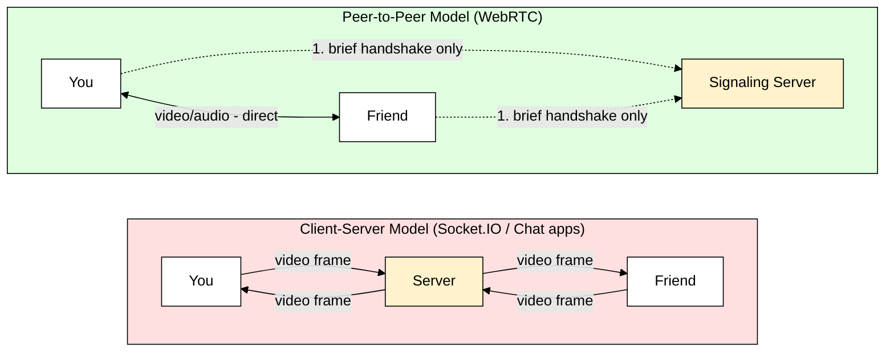
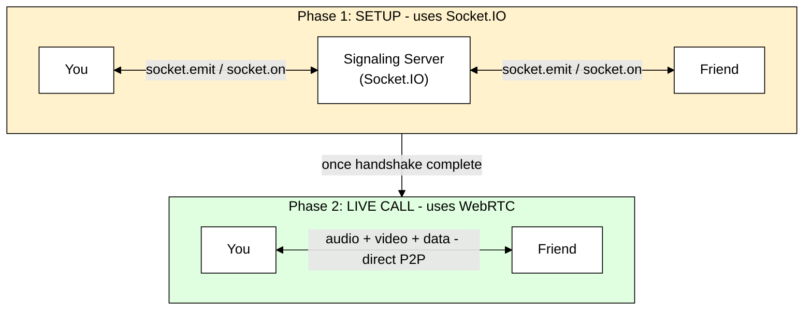
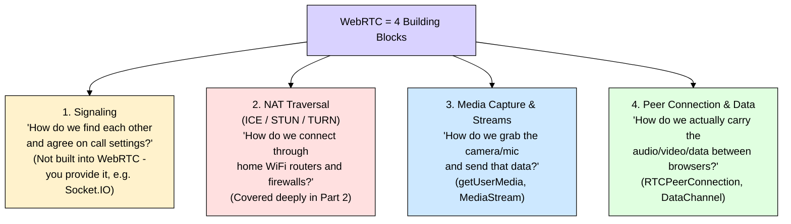
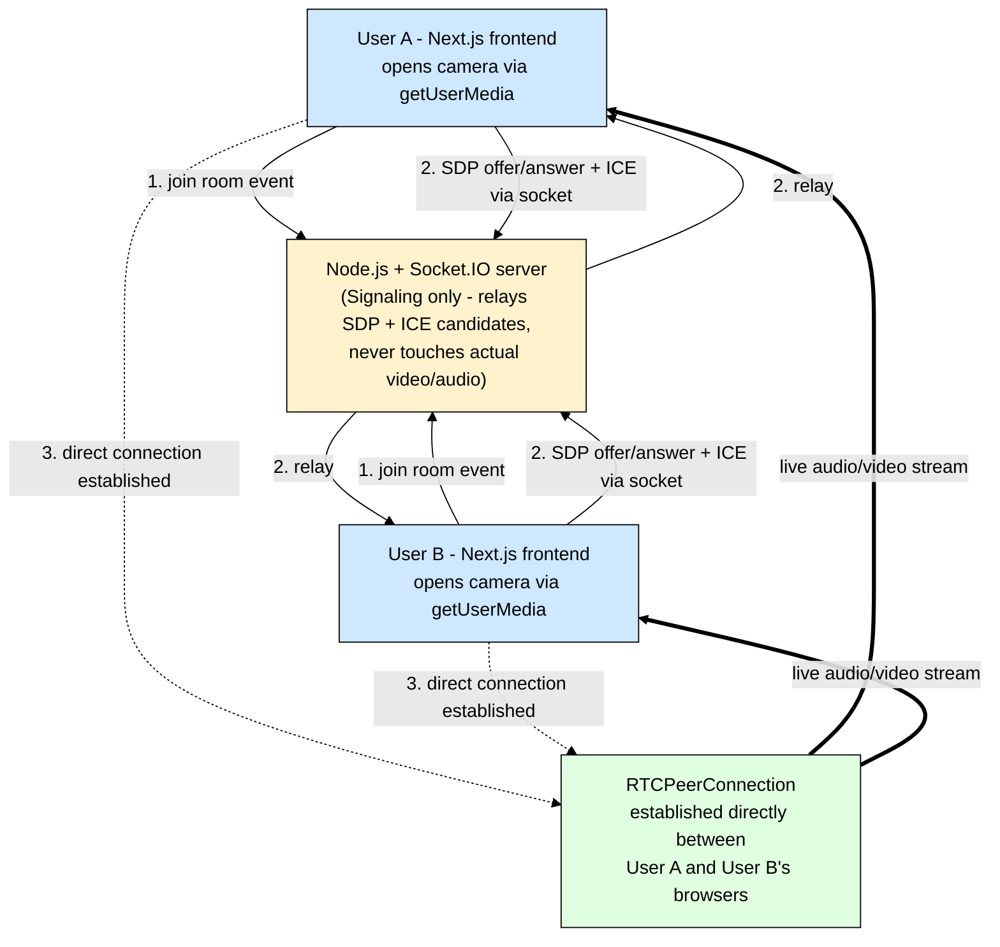

# WebRTC Deep Dive — Part 1: Fundamentals & Core Concepts

> **Series roadmap** (for your video/audio calling app project):
> - **Part 1 (this doc):** What WebRTC is, why it exists, how it compares to Socket.IO/WebSockets, and the big-picture architecture.
> - **Part 2 (next):** Signaling, SDP (Offer/Answer), ICE, STUN, TURN, NAT traversal — the hardest and most misunderstood part of WebRTC.
> - **Part 3 (final):** Media streams, Data Channels, security (DTLS/SRTP), scaling with SFU/MCU, and production concerns for a real calling app.

---

## 1. ELI5: What is WebRTC?

Imagine two kids, **A** and **B**, who want to talk to each other.

- **Option 1 — Texting through Mom:** A writes a note, gives it to Mom, Mom reads it, walks it over to B. B replies, Mom carries it back. Every single message goes through Mom. This is how **normal web apps** and **Socket.IO chat apps** work — every message passes through a **server**.
- **Option 2 — A tin-can telephone:** A and B run a string directly between their two cans. Once the string is set up, they talk **directly** to each other. Mom only helped them **find each other's houses** and tie the string — after that, she's out of the conversation.

**WebRTC (Web Real-Time Communication)** is that tin-can telephone for the browser. It lets two browsers send video, audio, and data **directly to each other**, without the data passing through a server on every message.

> **Full name:** Web Real-Time Communication
> **Type:** Free, open-source project (backed by Google, standardized by W3C + IETF)
> **Core promise:** Peer-to-peer audio, video, and data — in real time, inside the browser, no plugins.

---

## 2. Why Does WebRTC Exist? (The Problem It Solves)

Before WebRTC (pre-2011), real-time video calling in a browser needed **Flash** or **proprietary plugins** (Skype's own client, etc.). There was no native, standard way for two browsers to exchange live audio/video.

Even today, if you tried to build a video call app using **only Socket.IO / WebSockets**, here's what would happen:

| Approach | What happens | Problem |
|---|---|---|
| Socket.IO / WebSocket relay | Every video frame goes: You → Server → Server → Friend | Server must handle massive bandwidth for every call. Extra hop = more delay (latency). Doesn't scale — 1000 calls = 1000x the server bandwidth. |
| WebRTC | Video flows: You → Friend (directly) | Server is only needed briefly, at the start, to help you two "find" each other. After that, server load ≈ zero. |

This is the core reason WebRTC exists: **video/audio is huge and time-sensitive data**. Routing it through a server for every call, for every frame, doesn't scale and adds lag. WebRTC's job is to get two browsers talking **directly**.

---

## 3. Diagram: Client-Server vs Peer-to-Peer




**Key insight:** In client-server, the server is in the video path **forever** (solid arrows both sides, every frame). In WebRTC, the server (called a **Signaling Server**) is only involved in the **dotted line** — a one-time introduction — then it steps aside.

## 4. WebRTC vs Socket.IO / WebSockets (Since You Already Know These)

You've already gone deep on Socket.IO — here's how WebRTC relates to and differs from it. This is important because **WebRTC and Socket.IO are not competitors — they're teammates.**

| Aspect | Socket.IO / WebSockets | WebRTC |
|---|---|---|
| **Connection shape** | Client ↔ Server ↔ Client (star, server-centered) | Client ↔ Client (direct, mesh) |
| **Best for** | Chat messages, notifications, live cursors, small JSON payloads | Video, audio, screen share, large/real-time binary data |
| **Transport protocol** | TCP (via WebSocket) | UDP by default (via SRTP/DTLS), can fall back |
| **Server's job** | Relays every message, forever | Only helps peers "discover" each other, then leaves |
| **Latency** | Higher — every message hops through server | Lower — direct path between peers |
| **Bandwidth cost to you (server owner)** | Scales linearly with every message sent | Scales only with signaling (tiny), not media |
| **Setup complexity** | Simple — connect and emit/on | Complex — needs SDP, ICE, NAT traversal (Part 2!) |
| **Built-in browser API?** | No — needs a library (Socket.IO) | Yes — native `RTCPeerConnection` API in every modern browser |

### The twist: WebRTC *needs* something like Socket.IO to even start

This is the part beginners always miss:

> **WebRTC has zero built-in way for two browsers to find each other.** It only defines what happens *after* two browsers already know about each other. The "finding each other and exchanging setup info" step is called **signaling**, and WebRTC deliberately does **not** standardize it — you bring your own transport for that.

**This is exactly where Socket.IO comes back in!** In almost every real WebRTC app (including the one you're building), Socket.IO (or plain WebSockets) is used as the **signaling channel** — the "Mom" from our ELI5 — just to introduce the two peers and hand them each other's connection details. Once that's done, Socket.IO steps aside and the actual video/audio flows peer-to-peer.



**Takeaway for your project:** You will use **Socket.IO for signaling** and **WebRTC for the actual call**. They work together, not against each other.

## 5. The 4 Core Building Blocks of WebRTC

Every WebRTC app — including your video calling app — is built from exactly four pieces. Think of these as four departments that each solve one specific problem. We'll go deep into each in Part 2 and Part 3; for now, just get the big picture.



Let's briefly define each — full depth comes in Parts 2 and 3.

### 5.1 Signaling — "Making the introduction"
The process of two browsers exchanging metadata *before* a call can begin: who wants to call whom, what audio/video formats they support, and their network location. WebRTC deliberately leaves this undefined — you implement it using **any transport you like** (Socket.IO, WebSockets, even a QR code in theory). The actual message format exchanged is called an **SDP (Session Description Protocol)** offer/answer — covered in Part 2.

### 5.2 NAT Traversal — "Getting through the router"
Almost everyone's device sits behind a home router / firewall (this is called **NAT — Network Address Translation**). Your device doesn't have a public internet address by default — it's hidden behind your router. NAT Traversal is the set of tricks (**STUN** and **TURN** servers, coordinated by the **ICE** framework) WebRTC uses to punch through this and still establish a direct connection. This is genuinely the trickiest part of WebRTC and gets a full deep dive in Part 2.

### 5.3 Media Capture & Streams — "Grabbing the camera and mic"
The browser API `navigator.mediaDevices.getUserMedia()` asks the user for permission and returns a `MediaStream` object — a live feed from the camera/microphone. This stream is what eventually gets attached to the peer connection and sent to the other browser.

### 5.4 Peer Connection & Data — "The actual pipe"
`RTCPeerConnection` is the central JavaScript object that does the heavy lifting: it takes your local media, negotiates formats (codecs) with the other side, encrypts everything (via **DTLS/SRTP** — WebRTC is encrypted **by default**, unlike plain WebSockets), and sends it directly to the peer. A sibling feature, `RTCDataChannel`, lets you also send arbitrary data (like a Socket.IO-style message, but P2P) — useful for things like file transfer or game state.

## 6. High-Level Flow: How a Call Actually Gets Established

This is a **simplified preview** — every step here gets fully unpacked in Part 2 (signaling/ICE deep dive). For now, just follow the story.

```mermaid
%%{init: {'themeVariables': { 'primaryTextColor': '#000000', 'textColor': '#000000', 'lineColor': '#000000', 'primaryBorderColor': '#000000'}}}%%
sequenceDiagram
    participant A as You (Caller)
    participant S as Signaling Server (Socket.IO)
    participant B as Friend (Callee)

    Note over A,B: Step 1 - Media Capture
    A->>A: getUserMedia() - grab camera/mic

    Note over A,S,B: Step 2 - Signaling (SDP exchange)
    A->>S: "I want to call Friend" + my SDP Offer
    S->>B: forward Offer
    B->>B: getUserMedia() - grab camera/mic
    B->>S: SDP Answer
    S->>A: forward Answer

    Note over A,S,B: Step 3 - NAT Traversal (ICE candidates)
    A->>S: my network paths (ICE candidates)
    S->>B: forward candidates
    B->>S: their network paths (ICE candidates)
    S->>A: forward candidates

    Note over A,B: Step 4 - Direct Connection
    A->>B: Best path found - connect directly
    A-->>B: Encrypted audio/video/data flows P2P
    B-->>A: Encrypted audio/video/data flows P2P
```

**In plain English:**
1. Both browsers grab their camera/mic.
2. They exchange "what I can do" messages (SDP offer/answer) through your Socket.IO server.
3. They exchange "here's how to reach me on the network" messages (ICE candidates) through the same server.
4. Once they agree on a working path, **the server steps out**, and video/audio flows directly between the two browsers.

---

## 7. Mapping This to Your Video Calling App

Here's how these building blocks map directly onto the app you're building:



Notice: your existing Socket.IO knowledge (rooms, Redis adapter for scaling multiple server instances, sticky sessions) directly applies here — your signaling server for a video app is architecturally the same kind of thing as a chat app's Socket.IO server. The only difference is *what* gets relayed (SDP/ICE data instead of chat messages) and *how briefly* it's needed per connection.

## 8. Anticipating Your Next Question: "Why UDP instead of TCP?"

You know TCP well from Socket.IO/WebSockets (which run over TCP). WebRTC's media path defaults to **UDP** instead. Here's the ELI5 reason:

- **TCP** is like a very polite mail carrier: if a letter (packet) gets lost, it **waits and resends it** before delivering anything else, in order. Great for chat messages — you never want a missing or out-of-order message.
- **UDP** is like shouting across a room: if a word gets lost in the noise, **nobody stops to repeat it** — the conversation just keeps going.

For a **live video call**, a frame from half a second ago that arrives late is **useless** — you'd rather skip it and show the *current* frame than freeze the call waiting for an old one to be resent. This is why WebRTC prefers UDP: **low latency matters more than perfect delivery** for real-time media. (Data Channels, covered in Part 3, can optionally be configured to be more TCP-like when you need reliability, e.g. for file transfer.)

---

## 9. Key Takeaways (Cheat Sheet)

| Concept | One-line summary |
|---|---|
| **WebRTC** | Native browser tech for direct, peer-to-peer audio/video/data |
| **Why it exists** | Routing live video through a server for every call doesn't scale and adds latency |
| **Signaling** | The "introduction" step — WebRTC doesn't define it; you use Socket.IO/WebSockets for it |
| **NAT Traversal (ICE/STUN/TURN)** | The trickiest part — gets peers through routers/firewalls to connect directly (Part 2) |
| **Media Capture** | `getUserMedia()` grabs camera/mic as a `MediaStream` |
| **RTCPeerConnection** | The core object that negotiates, encrypts, and transmits media directly to the peer |
| **RTCDataChannel** | Sibling feature for sending arbitrary P2P data, not just media |
| **Encryption** | Built-in by default (DTLS/SRTP) — unlike plain WebSockets |
| **Transport** | Defaults to UDP — favors low latency over guaranteed delivery |
| **Relationship to Socket.IO** | Teammates, not competitors: Socket.IO handles signaling, WebRTC handles the call |

---

## What's Next

**Part 2** will go deep on the part everyone finds hardest: **Signaling, SDP, ICE, STUN, and TURN** — exactly how two browsers behind different home routers manage to find a direct path to each other, with full diagrams of the ICE candidate-gathering and connectivity-check process.

**Part 3** will cover **Media Streams & Data Channels in practice, security internals (DTLS/SRTP), and scaling** — including why group calls beyond ~4 people typically need an **SFU (Selective Forwarding Unit)** instead of pure mesh P2P, which is critical for your calling app's architecture decisions.

Just say the word when you're ready for **Part 2**.
