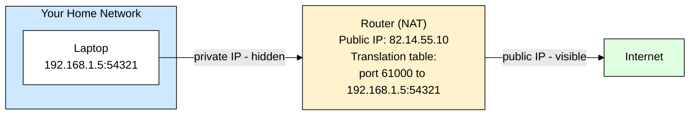
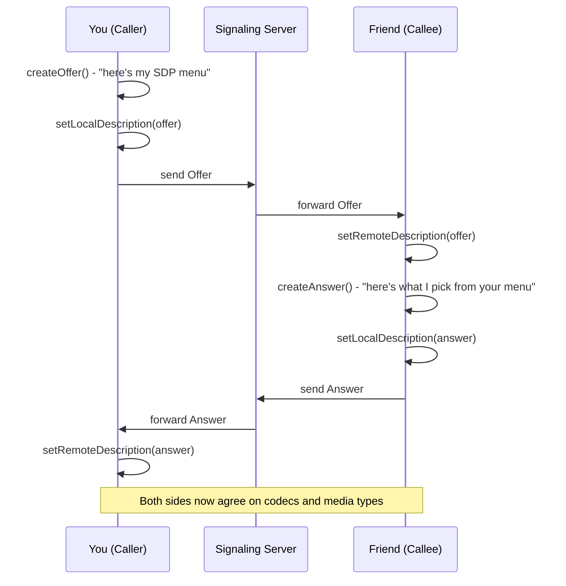
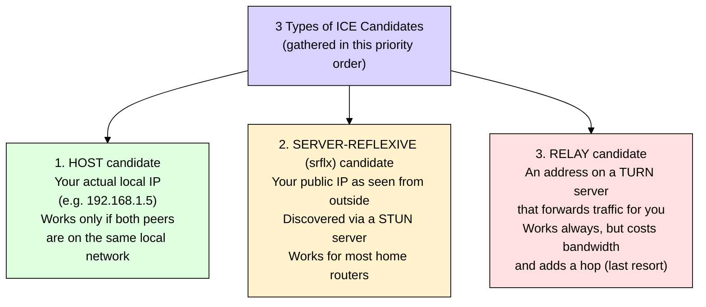
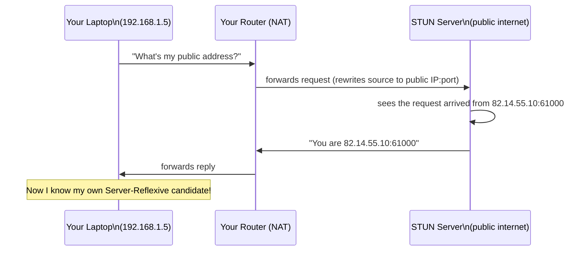
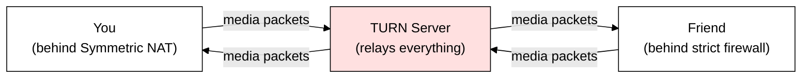
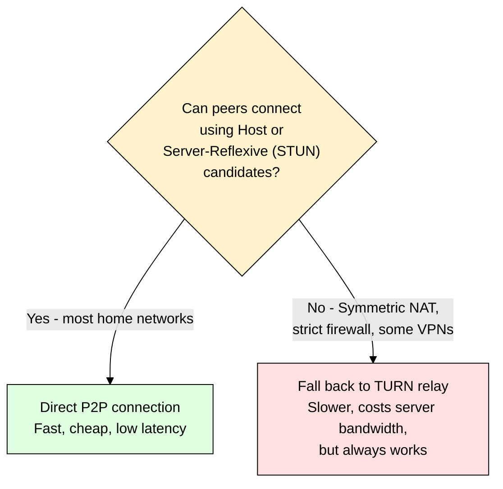
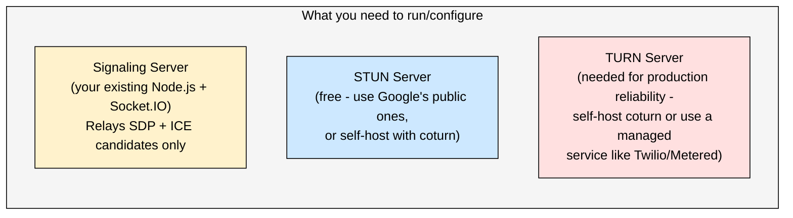

# WebRTC Deep Dive — Part 2: Signaling, SDP, ICE, STUN & TURN (NAT Traversal)

> **Series roadmap:**
> - **Part 1:** WebRTC fundamentals, why it exists, comparison with Socket.IO, the 4 building blocks. ✅ Done
> - **Part 2 (this doc):** Signaling, SDP Offer/Answer, and the full NAT traversal story — ICE, STUN, TURN. This is the part almost everyone finds hardest, so we go slow.
> - **Part 3 (next):** Media Streams & Data Channels in practice, security internals, and scaling (SFU/MCU) for group calls.

---

## 1. ELI5: The Actual Problem We're Solving

Recall from Part 1: two browsers want to talk directly, tin-can-telephone style. But there's a catch.

Imagine you and your friend each live in an **apartment building with one shared front door and a doorman**. Nobody outside the building knows your exact apartment number — they only know the building's front address. If a stranger shows up and says "I want to talk to apartment 4B," the doorman has no idea who that is or whether to let them in, because **4B never told the doorman to expect anyone**.

This is exactly your situation on the internet. Your laptop is "apartment 4B" inside a building called your **home router**. The building's front address is your **public IP**. Nobody on the internet can reach your laptop directly — they can only reach your router, and your router doesn't know it should forward traffic to you unless *you* set that up first.

This front-door system is called **NAT — Network Address Translation**, and solving it is the entire point of this document.

---

## 2. What is NAT, Really?

**NAT (Network Address Translation)** is a function almost every router performs. Your home has one public IP address (say `82.14.55.10`), but multiple devices (phone, laptop, smart TV) share it. NAT is the router's trick for making that work:

- Every device inside your home gets a **private IP** (like `192.168.1.5`) — meaningless outside your home.
- When your laptop sends a request out to the internet, the router **rewrites** the packet to say it came from the router's public IP, and remembers "port 54321 belongs to 192.168.1.5" in a temporary table.
- When a reply comes back to port 54321, the router looks up its table and forwards it to your laptop.



**The core problem for WebRTC:** this translation table entry only gets created when *your* device initiates outbound traffic. Your friend, sitting behind their own NAT, has no way to know your router's public IP + the exact translated port to reach you — **unless something tells them.** That "something" is what ICE, STUN, and TURN exist to solve.

---

## 3. Signaling — The Introduction, In Full Detail

Before any NAT-punching can happen, both browsers need to exchange two things through a **signaling server** (your Socket.IO server, from Part 1):

1. **SDP (Session Description Protocol)** — "here's what kind of media I can send/receive"
2. **ICE candidates** — "here's how you might be able to reach me on the network"

### 3.1 What is SDP?

**SDP** is a plain-text format (not JSON, not binary — literally readable text) that describes a media session: which codecs are supported (e.g., VP8 vs H.264 for video, Opus for audio), what media types are being sent (audio/video/data), and connection parameters. Think of it as **a menu each browser hands the other**, saying "here's everything I can cook and eat."

The exchange follows a strict pattern called the **Offer/Answer model**:



**ELI5 of Offer/Answer:** It's like A saying "I can speak English, Hindi, or French — pick one" (the Offer), and B replying "Let's do Hindi" (the Answer). After this exchange, both sides know exactly what "language" (codec/format) the call will use. Note that **SDP alone says nothing about network location** — that's ICE's job, covered next.


---

## 4. ICE — The Framework That Ties Everything Together

**ICE (Interactive Connectivity Establishment)** is not a single tool — it's a **strategy** for finding the best possible path between two peers, trying multiple options and picking whichever works. Think of ICE as a project manager that says: "Let's gather every possible way to reach me, send that list to the other side, and test every combination until we find one that works."

ICE gathers what are called **candidates** — each candidate is one possible network address/route to reach you. There are three types, tried roughly in this priority order:



**ELI5 of the 3 candidate types:** Imagine giving someone three ways to reach you:
1. **"Come to my exact desk"** (Host) — only works if they're already in your building.
2. **"Call the building's front desk, ask for me by name"** (Server-Reflexive, via STUN) — the front desk (your router) knows how to route it to you, works from outside the building.
3. **"Send it to my assistant, who will walk it over to me"** (Relay, via TURN) — works no matter what, but slower and costs your assistant's time (server bandwidth).

Each browser gathers **all** of its candidates, sends the full list to the other peer (through the signaling server), receives the other peer's list, and then **both sides try every combination** of local-candidate-to-remote-candidate pairs. This testing phase is called **connectivity checks**. Whichever pair succeeds *and* is highest priority (Host > Server-Reflexive > Relay) wins and becomes the actual media path.


---

## 5. STUN — "What's My Public Address?"

**STUN (Session Traversal Utilities for NAT)** is a lightweight server with exactly one job: when your browser sends it a request, it replies "here's the public IP and port I saw your request come from." That's it. It doesn't relay any media, doesn't store anything, doesn't even need to know who you're calling.



**ELI5:** STUN is like calling a friend and asking "hey, what number did this call come from on your caller ID?" — because *you* can't see your own public "phone number," but someone on the outside can tell you.

**Key fact:** STUN servers are cheap to run and Google even provides free public ones (`stun.l.google.com`). Most home routers use a NAT type called **Cone NAT**, where STUN alone is enough to establish a direct connection — this covers roughly 80-90% of real-world calls.

---

## 6. TURN — "When STUN Isn't Enough"

Some networks (strict corporate firewalls, some mobile carrier networks, a NAT type called **Symmetric NAT**) actively block any attempt at a direct peer-to-peer connection, no matter how good your STUN-discovered address is. For these cases, WebRTC needs a fallback: **relay everything through a server**, just like the old client-server model from Part 1 — but only as a last resort.

**TURN (Traversal Using Relays around NAT)** is that fallback server. Unlike STUN (which just tells you your address), a TURN server actually **relays your media traffic** — every audio/video packet passes through it.



**ELI5:** TURN is the "assistant who walks the message over" from our earlier analogy — the most reliable option, because it always works, but it costs the assistant (your server) time and effort for *every single message*, unlike STUN which only helps once at the start.

**Important for your project's budget:** Unlike STUN (nearly free), a TURN server relays actual video/audio bandwidth, so it costs real money at scale (bandwidth + compute). Roughly **10-20% of real-world calls** need TURN, depending on your users' networks — corporate VPNs and some mobile networks are the usual culprits. Production apps almost always run (or pay for) a TURN server as a safety net, even though most calls won't need it. Popular options: **coturn** (self-hosted, open source) or managed services like **Twilio, Xirsys, or Metered**.

| Server | What it does | Cost | Touches media? |
|---|---|---|---|
| **STUN** | Tells you your public IP:port | Nearly free | No |
| **TURN** | Relays your media traffic when direct connection fails | Real bandwidth cost | Yes, all of it |
| **Signaling (your Socket.IO server)** | Exchanges SDP + ICE candidates only | Cheap (tiny messages) | No |


---

## 7. Why Some Networks Are Harder: NAT Types

Not all NAT behaves the same way — this is *why* STUN sometimes isn't enough.

| NAT Type | Behavior | STUN alone works? |
|---|---|---|
| **Full Cone** | Once your port is mapped, *anyone* can send to it | ✅ Yes — easiest |
| **Restricted Cone** | Only IPs you've sent to first can reply | ✅ Yes, usually |
| **Port-Restricted Cone** | Only the exact IP+port you've sent to first can reply | ✅ Yes, usually |
| **Symmetric** | Router assigns a **different** public port for every destination you talk to — your "address" changes depending on who you're calling | ❌ No — needs TURN |

**Why Symmetric NAT breaks STUN:** with Symmetric NAT, when you ask the STUN server "what's my public address?", it gives you an address that only works **for talking to the STUN server** — the moment you try using that same address to reach your friend, the router assigns you a *different* port, and the address you shared is already stale. This is precisely the scenario TURN exists for.




---

## 8. The Complete Picture: Full Connection Establishment Flow

Now let's combine SDP exchange + ICE candidate gathering + connectivity checks into the real, complete flow. Modern WebRTC uses a technique called **Trickle ICE**, where candidates are sent **as soon as each one is found**, rather than waiting to gather them all first — this makes call setup noticeably faster.

```mermaid
%%{init: {'themeVariables': { 'primaryTextColor': '#000000', 'textColor': '#000000', 'lineColor': '#000000', 'primaryBorderColor': '#000000'}}}%%
sequenceDiagram
    participant A as You (Caller)
    participant ST as STUN/TURN Servers
    participant S as Signaling Server
    participant B as Friend (Callee)

    Note over A,B: 1. SDP Offer/Answer
    A->>S: SDP Offer
    S->>B: forward Offer
    B->>S: SDP Answer
    S->>A: forward Answer

    Note over A,ST,B: 2. ICE candidate gathering (parallel, trickled)
    A->>ST: gather Host, Server-Reflexive, Relay candidates
    ST-->>A: candidate info
    A->>S: send each candidate as found
    S->>B: forward candidates

    B->>ST: gather Host, Server-Reflexive, Relay candidates
    ST-->>B: candidate info
    B->>S: send each candidate as found
    S->>A: forward candidates

    Note over A,B: 3. Connectivity checks
    A->>B: try candidate pair 1 (Host to Host)
    B-->>A: fail - not same network
    A->>B: try candidate pair 2 (srflx to srflx)
    B-->>A: success!

    Note over A,B: 4. Media flows on winning path
    A-->>B: encrypted audio/video/data - direct
    B-->>A: encrypted audio/video/data - direct
```

**Plain English summary of the whole Part 2 story:**
1. Both browsers agree on *what* they'll send (SDP Offer/Answer — codecs, media types).
2. Both browsers figure out *where* they can be reached (ICE candidates — Host, via STUN, via TURN) and exchange the full list through the signaling server.
3. Both browsers try every combination of paths (connectivity checks) until one works.
4. The winning path becomes the actual media connection — direct if possible, relayed through TURN if not.

---

## 9. Mapping This to Your Video Calling App

For your Next.js + Node.js project, this section directly becomes your **infrastructure checklist**:



**Practical note:** In your `RTCPeerConnection` config, you'll pass an `iceServers` list containing both STUN and TURN server URLs — the browser automatically tries them in the right order as part of the ICE process described above. You don't have to manually implement any of the candidate-gathering or connectivity-check logic — the browser's native WebRTC engine handles all of it. Your job is just to (a) run/provide the signaling server, and (b) provide working STUN/TURN server addresses.

---

## 10. Key Takeaways (Cheat Sheet)

| Term | One-line meaning |
|---|---|
| **NAT** | Your router's system for sharing one public IP across many devices — the root cause of the whole problem |
| **Signaling** | Exchanging SDP + ICE candidates through a server you control (Socket.IO) |
| **SDP** | Text description of "what" media/codecs each side supports; exchanged via Offer/Answer |
| **ICE** | The overall strategy: gather candidates, exchange them, test every pair, pick the best working one |
| **ICE Candidate** | One possible address/route to reach you (Host, Server-Reflexive, or Relay) |
| **STUN** | Free, lightweight server that tells you your own public IP:port |
| **TURN** | Fallback relay server used only when direct connection fails (costs bandwidth) |
| **Symmetric NAT** | The trickiest NAT type — forces reliance on TURN |
| **Trickle ICE** | Sending candidates as they're found instead of waiting for all of them — speeds up setup |

---

## What's Next

**Part 3** covers the pieces that turn this connection into an actual working video call: **Media Streams (`getUserMedia`, `MediaStream`) and Data Channels in practice, WebRTC's built-in encryption (DTLS/SRTP), and — critically for a multi-person calling app — why pure mesh P2P breaks down past ~4 participants and how an SFU (Selective Forwarding Unit) solves it.**

Just say the word when you're ready for **Part 3**.
