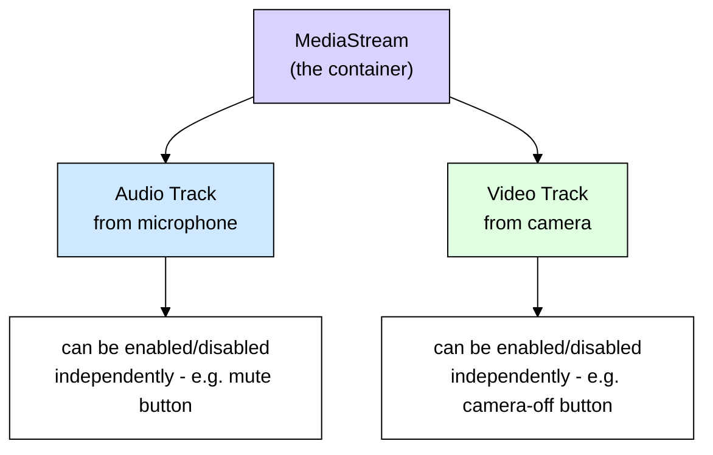
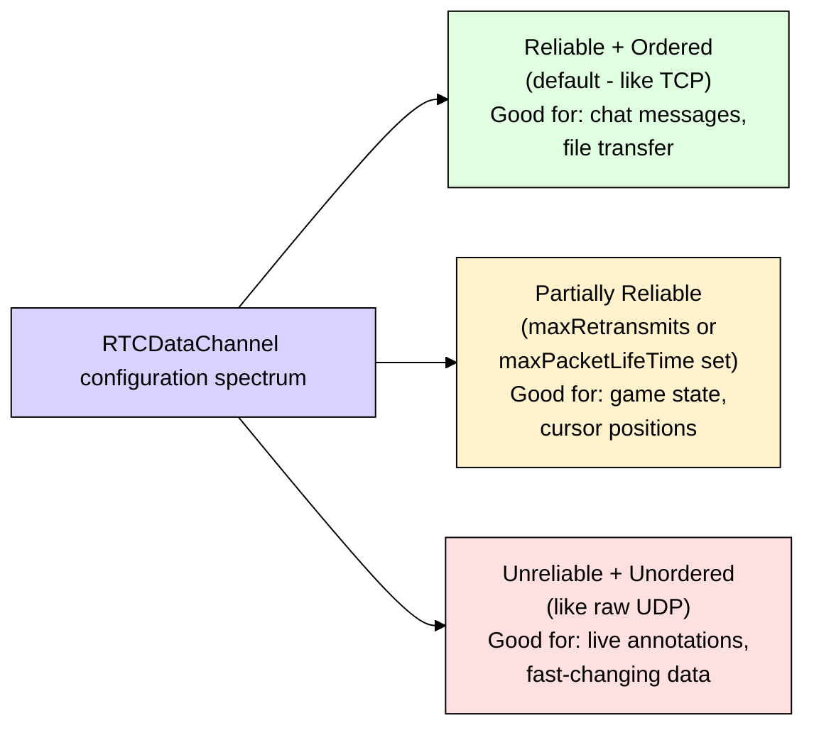
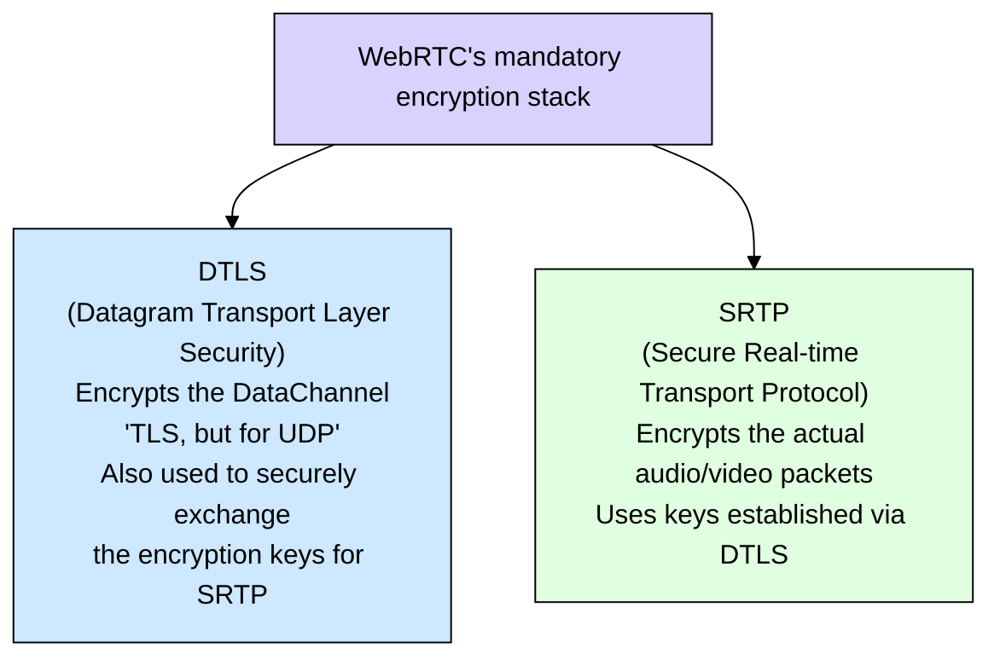
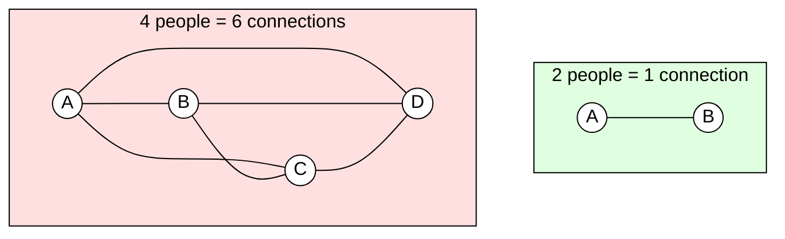
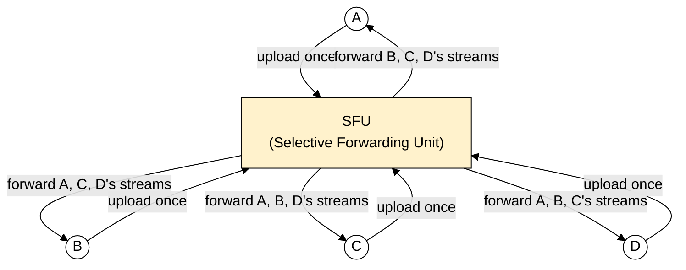
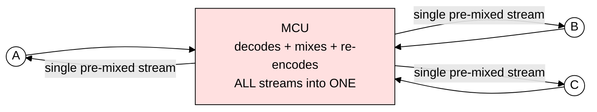
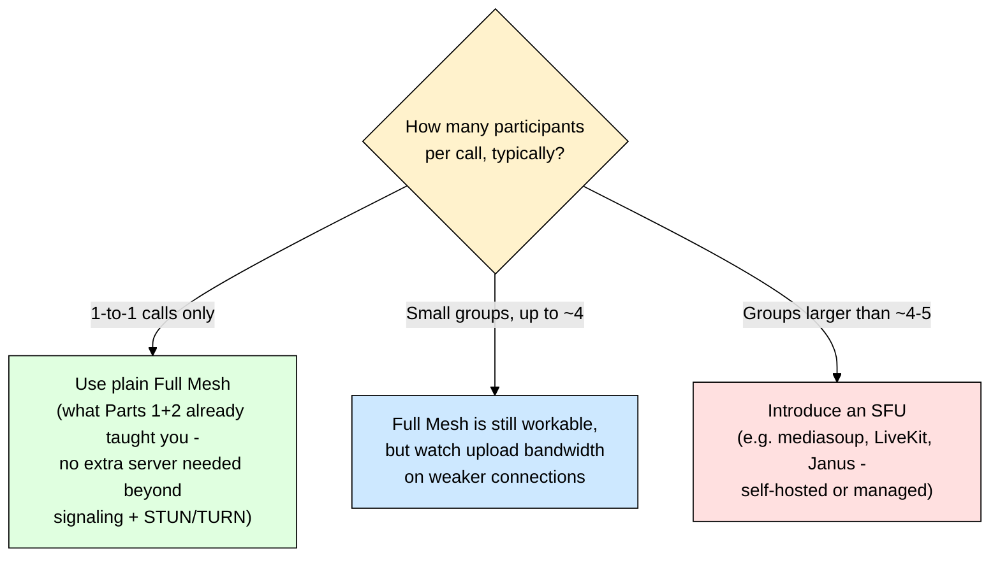

# WebRTC Deep Dive — Part 3: Media Streams, Data Channels, Security & Scaling

> **Series roadmap:**
> - **Part 1:** WebRTC fundamentals, why it exists, comparison with Socket.IO, the 4 building blocks. ✅ Done
> - **Part 2:** Signaling, SDP Offer/Answer, ICE, STUN, TURN — how two peers find each other through NAT. ✅ Done
> - **Part 3 (this doc):** How the actual audio/video/data gets captured and sent, how it's encrypted by default, and — most important for your project — why a video calling app can't just scale mesh P2P past a handful of people, and what to use instead.

---

## 1. ELI5 Recap: Where We Left Off

By the end of Part 2, two browsers have found a working path to each other — either directly, or through a TURN relay. That connection is like a pipe now sitting between two houses. Part 3 is about **what actually flows through that pipe**: video, audio, and arbitrary data — and what happens when you want **more than 2 houses** connected at once.

---

## 2. Media Streams: Capturing and Modeling Audio/Video

### 2.1 `getUserMedia()` and `MediaStream`

The browser API `navigator.mediaDevices.getUserMedia()` is the front door to a user's camera and microphone. It asks for permission, and if granted, returns a `MediaStream` object — a live, playable feed.

The key thing to understand is the **object model**: a `MediaStream` is a **container** that holds one or more `MediaStreamTrack`s. A "track" is a single audio or video feed — think of the stream as a folder, and tracks as the individual files inside it.

**Why this matters for your app:** your "mute" and "camera off" buttons don't need to renegotiate the whole connection — they just toggle a track's `enabled` property. The track keeps existing; it just stops sending data. This is far cheaper than tearing down and rebuilding the connection.

### 2.2 Constraints — Controlling Quality at the Source

When calling `getUserMedia()`, you pass **constraints** describing what you want: resolution, frame rate, which camera (front/back on mobile), noise suppression/echo cancellation for audio, and so on. The browser tries to satisfy them as closely as the hardware allows. This is your first and cheapest lever for controlling bandwidth usage — asking for 720p instead of 1080p reduces the data that needs to flow before any network-level adaptation even happens.

### 2.3 Attaching Media to the Connection

Once you have a `MediaStream`, its tracks get attached to the `RTCPeerConnection` (the object from Part 1/2 that actually carries data to the peer). Internally, WebRTC wraps each outgoing track in a **sender** and each incoming track in a **receiver**. This sender/receiver model is also what makes advanced features possible later — like swapping the video track (e.g., switching from camera to screen-share) without renegotiating the entire connection.

---

## 3. RTCDataChannel — Sending More Than Just Media

Alongside audio/video, WebRTC offers `RTCDataChannel` — a way to send **arbitrary data** peer-to-peer, over the same already-established connection (no separate signaling or NAT traversal needed once the connection exists). Think of it as **"Socket.IO, but peer-to-peer instead of through your server."**

**Common uses in a video calling app:** in-call text chat, "user is typing" indicators, reactions/emoji bursts, screen annotation coordinates, or file transfer during a call.

### 3.1 Reliable vs Unreliable Modes

This is the feature people are most surprised by: unlike TCP (always reliable, always ordered) or raw UDP (never reliable), `RTCDataChannel` lets **you** choose, per channel, where you sit on that spectrum.

**For your app:** in-call chat should use the default reliable/ordered mode (you never want a dropped or out-of-order chat message). A "user is typing" indicator or live cursor position, however, is a great candidate for an unreliable channel — if one update is lost, the next one arrives a moment later anyway, and you'd rather not waste time resending a stale one (same philosophy as UDP for media, from Part 1).

---

## 4. Security: Encryption Is Not Optional in WebRTC

This is a genuinely reassuring fact: unlike plain WebSockets (where *you* must remember to use `wss://` for encryption), **WebRTC cannot run unencrypted at all** — it's a mandatory part of the spec, not a configuration option.

Two protocols handle this, working together:

**ELI5:** DTLS and SRTP are like a courier who (a) first shakes hands with the recipient in a way that only the two of them can understand (DTLS handshake, establishing shared secret keys), and then (b) uses that secret understanding to seal every subsequent package (SRTP encrypting each media packet) so nobody along the way can peek inside.

**Practical implication for you:** even if a call's media ends up relayed through a TURN server (Part 2), the TURN server **cannot see the actual audio/video content** — it only sees encrypted bytes it's blindly forwarding. This matters a lot for your team's regulatory/privacy conversations if this calling feature ever touches anything sensitive.

---

## 5. Codecs — Briefly, Since SDP (Part 2) Negotiates Them

A **codec** compresses raw audio/video into a much smaller stream for transmission, then decompresses it on the other end. This is what the SDP Offer/Answer exchange (Part 2) is actually negotiating when it lists "supported formats." You don't usually need to choose codecs manually — the browser negotiates the best mutually-supported one automatically — but it's useful to recognize the names:

| Media | Common codecs | Notes |
|---|---|---|
| Audio | **Opus** | The de facto standard — adapts well to poor networks, low latency |
| Video | **VP8**, **VP9**, **H.264**, **AV1** | H.264 has the widest hardware support; VP9/AV1 compress better but need more CPU |

---

## 6. The Scaling Problem: Why Mesh P2P Breaks Down

Everything so far assumed **2 people**. What happens with 3, 5, or 10 people on a call?

### 6.1 Full Mesh — The Naive Approach

The most obvious approach: every participant opens a **direct `RTCPeerConnection` to every other participant**. This is called a **full mesh** topology.

**The math that kills this approach:** connections grow as **N × (N-1) / 2**. Worse, each participant's **upload bandwidth** must support sending their own video stream to *every other* participant simultaneously — a 5-person call means each person is uploading their video **4 times over**, once per peer. On a typical home upload connection (often the weakest link), this collapses fast.

| Participants | Total connections | Each person uploads their video... |
|---|---|---|
| 2 | 1 | 1x |
| 4 | 6 | 3x |
| 6 | 15 | 5x |
| 10 | 45 | 9x |

**ELI5:** Full mesh is like every person at a dinner party having to individually whisper the same story to every other person at the table, one at a time, simultaneously. It works fine for 2 people. By 8 people, everyone's exhausted just from repeating themselves.

### 6.2 SFU — Selective Forwarding Unit

The fix: introduce a **server** back into the picture — but a smart, lightweight one. Each participant uploads their video/audio **once**, to the SFU. The SFU then forwards (relays) each incoming stream to every *other* participant, without decoding, re-encoding, or mixing anything — it's a fast, mostly network-level relay.

**ELI5:** Instead of everyone whispering to everyone individually, everyone whispers once to a helpful assistant standing in the middle, who then repeats each story to everyone else. Each speaker only has to talk once — the assistant does the repeating work. This is essentially the same relay concept as TURN from Part 2, except the SFU is a **permanent, active participant of the call**, not just a NAT-traversal fallback.

**Trade-off:** each participant now downloads N-1 streams (that part doesn't change — someone has to receive everyone's video). But **upload** — usually the bottleneck on home connections — drops from N-1 copies down to just 1. This is why virtually every production video calling product (Zoom, Google Meet, Discord) uses an SFU-based architecture for group calls.

### 6.3 MCU — Multipoint Control Unit (For Completeness)

An older, heavier alternative: the **MCU** doesn't just forward streams — it **decodes every incoming stream, mixes them into a single combined video (e.g., a grid), re-encodes that single stream, and sends one unified stream to each participant.**

**Trade-off:** participants download almost nothing extra (just one stream, great for very low-bandwidth clients like old phones), but the server does **massive CPU work** decoding/mixing/re-encoding every stream, for every participant, constantly — expensive and harder to scale server-side. This is largely why MCUs have fallen out of favor compared to SFUs for most modern apps.

---

## 7. Comparison Table: Mesh vs SFU vs MCU

| Topology | Each person uploads | Each person downloads | Server CPU cost | Best for |
|---|---|---|---|---|
| **Full Mesh** | N-1 copies (high) | N-1 streams | None (no media server) | 1-to-1 calls, or very small groups (2-3 people) |
| **SFU** | 1 copy (low) | N-1 streams | Low (just relays, no decoding) | Most group calls — the modern default |
| **MCU** | 1 copy (low) | 1 pre-mixed stream | Very high (decode+mix+encode per participant) | Legacy systems, very low-bandwidth clients |

---

## 8. Recommendation for Your Video Calling App

Since you're building on **Node.js**, popular open-source SFU options that integrate well with your stack include **mediasoup** (a Node.js library, gives you the most control) and **LiveKit** (batteries-included, has its own server + client SDKs). If your app starts as 1-to-1 calling, you don't need any of this yet — everything from Parts 1 and 2 (plain `RTCPeerConnection` + your Socket.IO signaling + STUN/TURN) is sufficient. Only reach for an SFU when you add group calling.

---

## 9. A Few Production Realities Worth Knowing

These aren't full topics on their own, but worth having on your radar as you build:

- **ICE Restart:** if a user's network changes mid-call (e.g., WiFi drops, switches to mobile data), WebRTC supports renegotiating just the connectivity part (ICE) without tearing down the whole call — this is what makes calls survive network switches.
- **Simulcast / SVC:** for group calls via SFU, a sender can send **multiple quality versions** of their video simultaneously (e.g., a high-res and a low-res version), letting the SFU forward whichever quality fits each receiver's bandwidth — this is how apps handle mixed-bandwidth participants gracefully.
- **Bandwidth estimation:** WebRTC continuously monitors network conditions and automatically adjusts video quality/bitrate in real time — this happens under the hood, but explains why call quality can visibly change mid-call.

---

## 10. Key Takeaways (Cheat Sheet)

| Concept | One-line summary |
|---|---|
| **MediaStream / MediaStreamTrack** | A stream is a container; tracks (audio/video) inside it can be enabled/disabled independently |
| **Constraints** | Control resolution/frame rate/device at capture time — your first bandwidth lever |
| **RTCDataChannel** | P2P channel for arbitrary data, configurable anywhere from fully reliable to fully unreliable |
| **DTLS** | Encrypts the DataChannel and establishes shared keys — mandatory, not optional |
| **SRTP** | Encrypts actual audio/video packets using DTLS-established keys |
| **Codecs** | Opus (audio), VP8/VP9/H.264/AV1 (video) — negotiated automatically via SDP |
| **Full Mesh** | Every participant connects to every other — fine for 2-4 people, breaks down after |
| **SFU** | Server relays streams without decoding — the standard approach for group calls |
| **MCU** | Server decodes/mixes/re-encodes into one stream — heavy CPU cost, mostly legacy now |
| **ICE Restart** | Lets a call survive a network change mid-call |
| **Simulcast** | Sending multiple quality versions so the SFU can adapt per-receiver bandwidth |

---

## Series Complete — Full Picture

You now have the complete conceptual map of WebRTC:

1. **Part 1** — What WebRTC is, why it exists, and how it relates to Socket.IO
2. **Part 2** — How two peers behind NAT actually find each other (Signaling, SDP, ICE, STUN, TURN)
3. **Part 3** — What flows through that connection (media, data), how it's secured, and how to scale past 2 people

**Natural next steps**, whenever you're ready:
- A hands-on implementation guide (with actual Next.js + Node.js + Socket.IO code) building a working 1-to-1 video call from these concepts
- A deeper dive specifically into SFU internals (mediasoup vs LiveKit vs Janus) if/when you build group calling
- A dedicated guide on WebRTC debugging tools (`chrome://webrtc-internals`, connection state events) for when things go wrong in practice

Just say the word for whichever one you want next.
